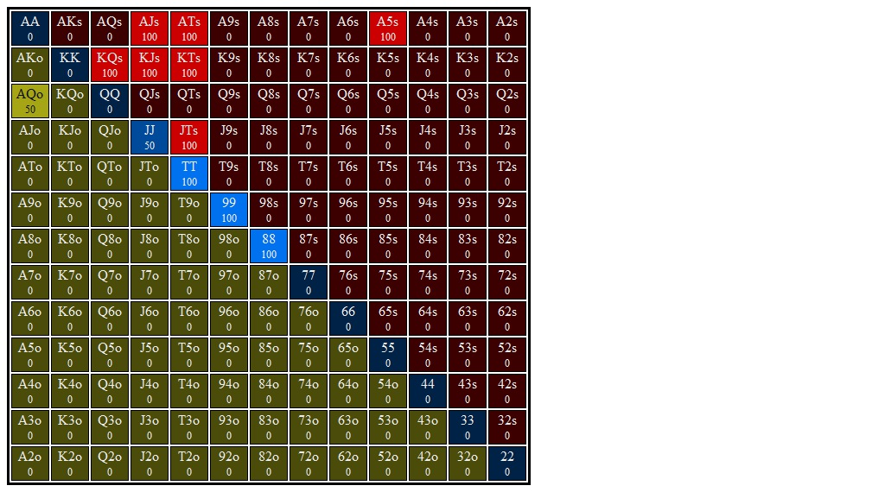

# Section 1: Lojack opens, Bn 3Bets, and Lojack Calls

Blinds are $0.05/$0.10. Effective stacks are $10.00. You're in the LJ and you open for $0.30 (3bb). Action folds to the BN who 3Bets you to $0.90, a 3x raise. SB and BB both fold, and action is back to you. You call from out of position and go to the flop with $9.10 behind and a pot of $1.95. Action is on you.
### Player Ranges

#### Hero's Lojack OOP 3Bet Call Range Range

#### Villain's Button 3Bet Range vs Lojack Open Range

### Flop 1: <b>A&spades;T&diams;5&clubs;</b>
1. **Approximate each player's equity. Who has the equity advantage?**

2. **What are the weakest hands in your range that could go all in on the flop? Go for three streets of value on blank turns?**

3. **Which player has the nuts advantage?**

4. **How static or dynamic is this flop? What aspects of this flop make it more static or dynamic?  How do these aspects interact with one another?**

5. **What are some hands that prefer to check/fold?**

6. **What are some hands that prefer to check/call?**

7. **What are some hands that prefer to check/raise?**

8. **Do any hands ever donk? If so, which ones?**

9. **Suppose you check and villain checks behind. What are the best and worst turn cards for your range? Do any give you an equity advantage? A nuts advantage? Uncap your range?**

10. **Suppose you check, villain bets 1/3 pot, and you call. What are the best and worst turn cards for your range? Do any give you an equity advantage? A nuts advantage? Uncap your range?**

#### Hands for flop A&spades;T&diams;5&clubs;
1. <b>9&spades;9&diams;</b>    (Flop: A&spades;T&diams;5&clubs;)

    1. **Do you ever check/fold this hand?**

    2. **Do you ever check/call this hand?**

    3. **If you check/raise this hand should you expect better hands to fold? If so, which hands?**

    4. **If you check/raise this hand should you expect worse hands to call? If so, which hands?**

    5. **Does this hand ever donk bet 1/2 pot?**

    6. **Does this hand benefit from protection bet?**

    7. **Does this hand benefit from growing the pot?**

    8. **How is this hand doing if you check/raise and get called? What parts of villain's range are you ahead of? Behind?**

    9. **How is this hand doing against a bet or raise when you check or bet respectively?**

    10. **Suppose you check the flop and villain checks behind. What are the best and worst turn cards for this hand?**

    11. **Suppose you check the flop, villain bets 1/3 pot, and and you call behind. What are the best and worst turn cards for this hand?**

2. <b>J&spades;T&spades;</b>    (Flop: A&spades;T&diams;5&clubs;)

    1. **Do you ever check/fold this hand?**

    2. **Do you ever check/call this hand?**

    3. **If you check/raise this hand should you expect better hands to fold? If so, which hands?**

    4. **If you check/raise this hand should you expect worse hands to call? If so, which hands?**

    5. **Does this hand ever donk bet 1/2 pot?**

    6. **Does this hand benefit from protection bet?**

    7. **Does this hand benefit from growing the pot?**

    8. **How is this hand doing if you check/raise and get called? What parts of villain's range are you ahead of? Behind?**

    9. **How is this hand doing against a bet or raise when you check or bet respectively?**

    10. **Suppose you check the flop and villain checks behind. What are the best and worst turn cards for this hand?**

    11. **Suppose you check the flop, villain bets 1/3 pot, and and you call behind. What are the best and worst turn cards for this hand?**

3. <b>A&hearts;T&hearts;</b>    (Flop: A&spades;T&diams;5&clubs;)

    1. **Do you ever check/fold this hand?**

    2. **Do you ever check/call this hand?**

    3. **If you check/raise this hand should you expect better hands to fold? If so, which hands?**

    4. **If you check/raise this hand should you expect worse hands to call? If so, which hands?**

    5. **Does this hand ever donk bet 1/2 pot?**

    6. **Does this hand benefit from protection bet?**

    7. **Does this hand benefit from growing the pot?**

    8. **How is this hand doing if you check/raise and get called? What parts of villain's range are you ahead of? Behind?**

    9. **How is this hand doing against a bet or raise when you check or bet respectively?**

    10. **Suppose you check the flop and villain checks behind. What are the best and worst turn cards for this hand?**

    11. **Suppose you check the flop, villain bets 1/3 pot, and and you call behind. What are the best and worst turn cards for this hand?**

4. <b>J&hearts;J&diams;</b>    (Flop: A&spades;T&diams;5&clubs;)

    1. **Do you ever check/fold this hand?**

    2. **Do you ever check/call this hand?**

    3. **If you check/raise this hand should you expect better hands to fold? If so, which hands?**

    4. **If you check/raise this hand should you expect worse hands to call? If so, which hands?**

    5. **Does this hand ever donk bet 1/2 pot?**

    6. **Does this hand benefit from protection bet?**

    7. **Does this hand benefit from growing the pot?**

    8. **How is this hand doing if you check/raise and get called? What parts of villain's range are you ahead of? Behind?**

    9. **How is this hand doing against a bet or raise when you check or bet respectively?**

    10. **Suppose you check the flop and villain checks behind. What are the best and worst turn cards for this hand?**

    11. **Suppose you check the flop, villain bets 1/3 pot, and and you call behind. What are the best and worst turn cards for this hand?**

5. <b>A&hearts;5&hearts;</b>    (Flop: A&spades;T&diams;5&clubs;)

    1. **Do you ever check/fold this hand?**

    2. **Do you ever check/call this hand?**

    3. **If you check/raise this hand should you expect better hands to fold? If so, which hands?**

    4. **If you check/raise this hand should you expect worse hands to call? If so, which hands?**

    5. **Does this hand ever donk bet 1/2 pot?**

    6. **Does this hand benefit from protection bet?**

    7. **Does this hand benefit from growing the pot?**

    8. **How is this hand doing if you check/raise and get called? What parts of villain's range are you ahead of? Behind?**

    9. **How is this hand doing against a bet or raise when you check or bet respectively?**

    10. **Suppose you check the flop and villain checks behind. What are the best and worst turn cards for this hand?**

    11. **Suppose you check the flop, villain bets 1/3 pot, and and you call behind. What are the best and worst turn cards for this hand?**

6. <b>K&diams;Q&diams;</b>    (Flop: A&spades;T&diams;5&clubs;)

    1. **Do you ever check/fold this hand?**

    2. **Do you ever check/call this hand?**

    3. **If you check/raise this hand should you expect better hands to fold? If so, which hands?**

    4. **If you check/raise this hand should you expect worse hands to call? If so, which hands?**

    5. **Does this hand ever donk bet 1/2 pot?**

    6. **Does this hand benefit from protection bet?**

    7. **Does this hand benefit from growing the pot?**

    8. **How is this hand doing if you check/raise and get called? What parts of villain's range are you ahead of? Behind?**

    9. **How is this hand doing against a bet or raise when you check or bet respectively?**

    10. **Suppose you check the flop and villain checks behind. What are the best and worst turn cards for this hand?**

    11. **Suppose you check the flop, villain bets 1/3 pot, and and you call behind. What are the best and worst turn cards for this hand?**

7. <b>K&hearts;J&hearts;</b>    (Flop: A&spades;T&diams;5&clubs;)

    1. **Do you ever check/fold this hand?**

    2. **Do you ever check/call this hand?**

    3. **If you check/raise this hand should you expect better hands to fold? If so, which hands?**

    4. **If you check/raise this hand should you expect worse hands to call? If so, which hands?**

    5. **Does this hand ever donk bet 1/2 pot?**

    6. **Does this hand benefit from protection bet?**

    7. **Does this hand benefit from growing the pot?**

    8. **How is this hand doing if you check/raise and get called? What parts of villain's range are you ahead of? Behind?**

    9. **How is this hand doing against a bet or raise when you check or bet respectively?**

    10. **Suppose you check the flop and villain checks behind. What are the best and worst turn cards for this hand?**

    11. **Suppose you check the flop, villain bets 1/3 pot, and and you call behind. What are the best and worst turn cards for this hand?**

8. <b>A&diams;J&diams;</b>    (Flop: A&spades;T&diams;5&clubs;)

    1. **Do you ever check/fold this hand?**

    2. **Do you ever check/call this hand?**

    3. **If you check/raise this hand should you expect better hands to fold? If so, which hands?**

    4. **If you check/raise this hand should you expect worse hands to call? If so, which hands?**

    5. **Does this hand ever donk bet 1/2 pot?**

    6. **Does this hand benefit from protection bet?**

    7. **Does this hand benefit from growing the pot?**

    8. **How is this hand doing if you check/raise and get called? What parts of villain's range are you ahead of? Behind?**

    9. **How is this hand doing against a bet or raise when you check or bet respectively?**

    10. **Suppose you check the flop and villain checks behind. What are the best and worst turn cards for this hand?**

    11. **Suppose you check the flop, villain bets 1/3 pot, and and you call behind. What are the best and worst turn cards for this hand?**

9. <b>K&spades;T&spades;</b>    (Flop: A&spades;T&diams;5&clubs;)

    1. **Do you ever check/fold this hand?**

    2. **Do you ever check/call this hand?**

    3. **If you check/raise this hand should you expect better hands to fold? If so, which hands?**

    4. **If you check/raise this hand should you expect worse hands to call? If so, which hands?**

    5. **Does this hand ever donk bet 1/2 pot?**

    6. **Does this hand benefit from protection bet?**

    7. **Does this hand benefit from growing the pot?**

    8. **How is this hand doing if you check/raise and get called? What parts of villain's range are you ahead of? Behind?**

    9. **How is this hand doing against a bet or raise when you check or bet respectively?**

    10. **Suppose you check the flop and villain checks behind. What are the best and worst turn cards for this hand?**

    11. **Suppose you check the flop, villain bets 1/3 pot, and and you call behind. What are the best and worst turn cards for this hand?**

10. <b>8&spades;8&diams;</b>    (Flop: A&spades;T&diams;5&clubs;)

    1. **Do you ever check/fold this hand?**

    2. **Do you ever check/call this hand?**

    3. **If you check/raise this hand should you expect better hands to fold? If so, which hands?**

    4. **If you check/raise this hand should you expect worse hands to call? If so, which hands?**

    5. **Does this hand ever donk bet 1/2 pot?**

    6. **Does this hand benefit from protection bet?**

    7. **Does this hand benefit from growing the pot?**

    8. **How is this hand doing if you check/raise and get called? What parts of villain's range are you ahead of? Behind?**

    9. **How is this hand doing against a bet or raise when you check or bet respectively?**

    10. **Suppose you check the flop and villain checks behind. What are the best and worst turn cards for this hand?**

    11. **Suppose you check the flop, villain bets 1/3 pot, and and you call behind. What are the best and worst turn cards for this hand?**

### Flop 2: <b>T&spades;4&spades;2&spades;</b>
1. **Approximate each player's equity. Who has the equity advantage?**

2. **What are the weakest hands in your range that could go all in on the flop? Go for three streets of value on blank turns?**

3. **Which player has the nuts advantage?**

4. **How static or dynamic is this flop? What aspects of this flop make it more static or dynamic?  How do these aspects interact with one another?**

5. **What are some hands that prefer to check/fold?**

6. **What are some hands that prefer to check/call?**

7. **What are some hands that prefer to check/raise?**

8. **Do any hands ever donk? If so, which ones?**

9. **Suppose you check and villain checks behind. What are the best and worst turn cards for your range? Do any give you an equity advantage? A nuts advantage? Uncap your range?**

10. **Suppose you check, villain bets 1/3 pot, and you call. What are the best and worst turn cards for your range? Do any give you an equity advantage? A nuts advantage? Uncap your range?**

#### Hands for flop T&spades;4&spades;2&spades;
1. <b>A&clubs;Q&hearts;</b>    (Flop: T&spades;4&spades;2&spades;)

    1. **Do you ever check/fold this hand?**

    2. **Do you ever check/call this hand?**

    3. **If you check/raise this hand should you expect better hands to fold? If so, which hands?**

    4. **If you check/raise this hand should you expect worse hands to call? If so, which hands?**

    5. **Does this hand ever donk bet 1/2 pot?**

    6. **Does this hand benefit from protection bet?**

    7. **Does this hand benefit from growing the pot?**

    8. **How is this hand doing if you check/raise and get called? What parts of villain's range are you ahead of? Behind?**

    9. **How is this hand doing against a bet or raise when you check or bet respectively?**

    10. **Suppose you check the flop and villain checks behind. What are the best and worst turn cards for this hand?**

    11. **Suppose you check the flop, villain bets 1/3 pot, and and you call behind. What are the best and worst turn cards for this hand?**

2. <b>A&hearts;5&hearts;</b>    (Flop: T&spades;4&spades;2&spades;)

    1. **Do you ever check/fold this hand?**

    2. **Do you ever check/call this hand?**

    3. **If you check/raise this hand should you expect better hands to fold? If so, which hands?**

    4. **If you check/raise this hand should you expect worse hands to call? If so, which hands?**

    5. **Does this hand ever donk bet 1/2 pot?**

    6. **Does this hand benefit from protection bet?**

    7. **Does this hand benefit from growing the pot?**

    8. **How is this hand doing if you check/raise and get called? What parts of villain's range are you ahead of? Behind?**

    9. **How is this hand doing against a bet or raise when you check or bet respectively?**

    10. **Suppose you check the flop and villain checks behind. What are the best and worst turn cards for this hand?**

    11. **Suppose you check the flop, villain bets 1/3 pot, and and you call behind. What are the best and worst turn cards for this hand?**

3. <b>K&hearts;T&hearts;</b>    (Flop: T&spades;4&spades;2&spades;)

    1. **Do you ever check/fold this hand?**

    2. **Do you ever check/call this hand?**

    3. **If you check/raise this hand should you expect better hands to fold? If so, which hands?**

    4. **If you check/raise this hand should you expect worse hands to call? If so, which hands?**

    5. **Does this hand ever donk bet 1/2 pot?**

    6. **Does this hand benefit from protection bet?**

    7. **Does this hand benefit from growing the pot?**

    8. **How is this hand doing if you check/raise and get called? What parts of villain's range are you ahead of? Behind?**

    9. **How is this hand doing against a bet or raise when you check or bet respectively?**

    10. **Suppose you check the flop and villain checks behind. What are the best and worst turn cards for this hand?**

    11. **Suppose you check the flop, villain bets 1/3 pot, and and you call behind. What are the best and worst turn cards for this hand?**

4. <b>T&hearts;T&diams;</b>    (Flop: T&spades;4&spades;2&spades;)

    1. **Do you ever check/fold this hand?**

    2. **Do you ever check/call this hand?**

    3. **If you check/raise this hand should you expect better hands to fold? If so, which hands?**

    4. **If you check/raise this hand should you expect worse hands to call? If so, which hands?**

    5. **Does this hand ever donk bet 1/2 pot?**

    6. **Does this hand benefit from protection bet?**

    7. **Does this hand benefit from growing the pot?**

    8. **How is this hand doing if you check/raise and get called? What parts of villain's range are you ahead of? Behind?**

    9. **How is this hand doing against a bet or raise when you check or bet respectively?**

    10. **Suppose you check the flop and villain checks behind. What are the best and worst turn cards for this hand?**

    11. **Suppose you check the flop, villain bets 1/3 pot, and and you call behind. What are the best and worst turn cards for this hand?**

5. <b>A&diams;T&diams;</b>    (Flop: T&spades;4&spades;2&spades;)

    1. **Do you ever check/fold this hand?**

    2. **Do you ever check/call this hand?**

    3. **If you check/raise this hand should you expect better hands to fold? If so, which hands?**

    4. **If you check/raise this hand should you expect worse hands to call? If so, which hands?**

    5. **Does this hand ever donk bet 1/2 pot?**

    6. **Does this hand benefit from protection bet?**

    7. **Does this hand benefit from growing the pot?**

    8. **How is this hand doing if you check/raise and get called? What parts of villain's range are you ahead of? Behind?**

    9. **How is this hand doing against a bet or raise when you check or bet respectively?**

    10. **Suppose you check the flop and villain checks behind. What are the best and worst turn cards for this hand?**

    11. **Suppose you check the flop, villain bets 1/3 pot, and and you call behind. What are the best and worst turn cards for this hand?**

6. <b>K&diams;Q&diams;</b>    (Flop: T&spades;4&spades;2&spades;)

    1. **Do you ever check/fold this hand?**

    2. **Do you ever check/call this hand?**

    3. **If you check/raise this hand should you expect better hands to fold? If so, which hands?**

    4. **If you check/raise this hand should you expect worse hands to call? If so, which hands?**

    5. **Does this hand ever donk bet 1/2 pot?**

    6. **Does this hand benefit from protection bet?**

    7. **Does this hand benefit from growing the pot?**

    8. **How is this hand doing if you check/raise and get called? What parts of villain's range are you ahead of? Behind?**

    9. **How is this hand doing against a bet or raise when you check or bet respectively?**

    10. **Suppose you check the flop and villain checks behind. What are the best and worst turn cards for this hand?**

    11. **Suppose you check the flop, villain bets 1/3 pot, and and you call behind. What are the best and worst turn cards for this hand?**

7. <b>K&diams;J&diams;</b>    (Flop: T&spades;4&spades;2&spades;)

    1. **Do you ever check/fold this hand?**

    2. **Do you ever check/call this hand?**

    3. **If you check/raise this hand should you expect better hands to fold? If so, which hands?**

    4. **If you check/raise this hand should you expect worse hands to call? If so, which hands?**

    5. **Does this hand ever donk bet 1/2 pot?**

    6. **Does this hand benefit from protection bet?**

    7. **Does this hand benefit from growing the pot?**

    8. **How is this hand doing if you check/raise and get called? What parts of villain's range are you ahead of? Behind?**

    9. **How is this hand doing against a bet or raise when you check or bet respectively?**

    10. **Suppose you check the flop and villain checks behind. What are the best and worst turn cards for this hand?**

    11. **Suppose you check the flop, villain bets 1/3 pot, and and you call behind. What are the best and worst turn cards for this hand?**

8. <b>A&spades;J&spades;</b>    (Flop: T&spades;4&spades;2&spades;)

    1. **Do you ever check/fold this hand?**

    2. **Do you ever check/call this hand?**

    3. **If you check/raise this hand should you expect better hands to fold? If so, which hands?**

    4. **If you check/raise this hand should you expect worse hands to call? If so, which hands?**

    5. **Does this hand ever donk bet 1/2 pot?**

    6. **Does this hand benefit from protection bet?**

    7. **Does this hand benefit from growing the pot?**

    8. **How is this hand doing if you check/raise and get called? What parts of villain's range are you ahead of? Behind?**

    9. **How is this hand doing against a bet or raise when you check or bet respectively?**

    10. **Suppose you check the flop and villain checks behind. What are the best and worst turn cards for this hand?**

    11. **Suppose you check the flop, villain bets 1/3 pot, and and you call behind. What are the best and worst turn cards for this hand?**

9. <b>J&clubs;T&clubs;</b>    (Flop: T&spades;4&spades;2&spades;)

    1. **Do you ever check/fold this hand?**

    2. **Do you ever check/call this hand?**

    3. **If you check/raise this hand should you expect better hands to fold? If so, which hands?**

    4. **If you check/raise this hand should you expect worse hands to call? If so, which hands?**

    5. **Does this hand ever donk bet 1/2 pot?**

    6. **Does this hand benefit from protection bet?**

    7. **Does this hand benefit from growing the pot?**

    8. **How is this hand doing if you check/raise and get called? What parts of villain's range are you ahead of? Behind?**

    9. **How is this hand doing against a bet or raise when you check or bet respectively?**

    10. **Suppose you check the flop and villain checks behind. What are the best and worst turn cards for this hand?**

    11. **Suppose you check the flop, villain bets 1/3 pot, and and you call behind. What are the best and worst turn cards for this hand?**

10. <b>J&diams;J&clubs;</b>    (Flop: T&spades;4&spades;2&spades;)

    1. **Do you ever check/fold this hand?**

    2. **Do you ever check/call this hand?**

    3. **If you check/raise this hand should you expect better hands to fold? If so, which hands?**

    4. **If you check/raise this hand should you expect worse hands to call? If so, which hands?**

    5. **Does this hand ever donk bet 1/2 pot?**

    6. **Does this hand benefit from protection bet?**

    7. **Does this hand benefit from growing the pot?**

    8. **How is this hand doing if you check/raise and get called? What parts of villain's range are you ahead of? Behind?**

    9. **How is this hand doing against a bet or raise when you check or bet respectively?**

    10. **Suppose you check the flop and villain checks behind. What are the best and worst turn cards for this hand?**

    11. **Suppose you check the flop, villain bets 1/3 pot, and and you call behind. What are the best and worst turn cards for this hand?**

### Flop 3: <b>7&spades;6&spades;6&diams;</b>
1. **Approximate each player's equity. Who has the equity advantage?**

2. **What are the weakest hands in your range that could go all in on the flop? Go for three streets of value on blank turns?**

3. **Which player has the nuts advantage?**

4. **How static or dynamic is this flop? What aspects of this flop make it more static or dynamic?  How do these aspects interact with one another?**

5. **What are some hands that prefer to check/fold?**

6. **What are some hands that prefer to check/call?**

7. **What are some hands that prefer to check/raise?**

8. **Do any hands ever donk? If so, which ones?**

9. **Suppose you check and villain checks behind. What are the best and worst turn cards for your range? Do any give you an equity advantage? A nuts advantage? Uncap your range?**

10. **Suppose you check, villain bets 1/3 pot, and you call. What are the best and worst turn cards for your range? Do any give you an equity advantage? A nuts advantage? Uncap your range?**

#### Hands for flop 7&spades;6&spades;6&diams;
1. <b>8&diams;8&clubs;</b>    (Flop: 7&spades;6&spades;6&diams;)

    1. **Do you ever check/fold this hand?**

    2. **Do you ever check/call this hand?**

    3. **If you check/raise this hand should you expect better hands to fold? If so, which hands?**

    4. **If you check/raise this hand should you expect worse hands to call? If so, which hands?**

    5. **Does this hand ever donk bet 1/2 pot?**

    6. **Does this hand benefit from protection bet?**

    7. **Does this hand benefit from growing the pot?**

    8. **How is this hand doing if you check/raise and get called? What parts of villain's range are you ahead of? Behind?**

    9. **How is this hand doing against a bet or raise when you check or bet respectively?**

    10. **Suppose you check the flop and villain checks behind. What are the best and worst turn cards for this hand?**

    11. **Suppose you check the flop, villain bets 1/3 pot, and and you call behind. What are the best and worst turn cards for this hand?**

2. <b>K&clubs;J&clubs;</b>    (Flop: 7&spades;6&spades;6&diams;)

    1. **Do you ever check/fold this hand?**

    2. **Do you ever check/call this hand?**

    3. **If you check/raise this hand should you expect better hands to fold? If so, which hands?**

    4. **If you check/raise this hand should you expect worse hands to call? If so, which hands?**

    5. **Does this hand ever donk bet 1/2 pot?**

    6. **Does this hand benefit from protection bet?**

    7. **Does this hand benefit from growing the pot?**

    8. **How is this hand doing if you check/raise and get called? What parts of villain's range are you ahead of? Behind?**

    9. **How is this hand doing against a bet or raise when you check or bet respectively?**

    10. **Suppose you check the flop and villain checks behind. What are the best and worst turn cards for this hand?**

    11. **Suppose you check the flop, villain bets 1/3 pot, and and you call behind. What are the best and worst turn cards for this hand?**

3. <b>K&spades;Q&spades;</b>    (Flop: 7&spades;6&spades;6&diams;)

    1. **Do you ever check/fold this hand?**

    2. **Do you ever check/call this hand?**

    3. **If you check/raise this hand should you expect better hands to fold? If so, which hands?**

    4. **If you check/raise this hand should you expect worse hands to call? If so, which hands?**

    5. **Does this hand ever donk bet 1/2 pot?**

    6. **Does this hand benefit from protection bet?**

    7. **Does this hand benefit from growing the pot?**

    8. **How is this hand doing if you check/raise and get called? What parts of villain's range are you ahead of? Behind?**

    9. **How is this hand doing against a bet or raise when you check or bet respectively?**

    10. **Suppose you check the flop and villain checks behind. What are the best and worst turn cards for this hand?**

    11. **Suppose you check the flop, villain bets 1/3 pot, and and you call behind. What are the best and worst turn cards for this hand?**

4. <b>A&diams;Q&spades;</b>    (Flop: 7&spades;6&spades;6&diams;)

    1. **Do you ever check/fold this hand?**

    2. **Do you ever check/call this hand?**

    3. **If you check/raise this hand should you expect better hands to fold? If so, which hands?**

    4. **If you check/raise this hand should you expect worse hands to call? If so, which hands?**

    5. **Does this hand ever donk bet 1/2 pot?**

    6. **Does this hand benefit from protection bet?**

    7. **Does this hand benefit from growing the pot?**

    8. **How is this hand doing if you check/raise and get called? What parts of villain's range are you ahead of? Behind?**

    9. **How is this hand doing against a bet or raise when you check or bet respectively?**

    10. **Suppose you check the flop and villain checks behind. What are the best and worst turn cards for this hand?**

    11. **Suppose you check the flop, villain bets 1/3 pot, and and you call behind. What are the best and worst turn cards for this hand?**

5. <b>K&clubs;T&clubs;</b>    (Flop: 7&spades;6&spades;6&diams;)

    1. **Do you ever check/fold this hand?**

    2. **Do you ever check/call this hand?**

    3. **If you check/raise this hand should you expect better hands to fold? If so, which hands?**

    4. **If you check/raise this hand should you expect worse hands to call? If so, which hands?**

    5. **Does this hand ever donk bet 1/2 pot?**

    6. **Does this hand benefit from protection bet?**

    7. **Does this hand benefit from growing the pot?**

    8. **How is this hand doing if you check/raise and get called? What parts of villain's range are you ahead of? Behind?**

    9. **How is this hand doing against a bet or raise when you check or bet respectively?**

    10. **Suppose you check the flop and villain checks behind. What are the best and worst turn cards for this hand?**

    11. **Suppose you check the flop, villain bets 1/3 pot, and and you call behind. What are the best and worst turn cards for this hand?**

6. <b>T&spades;T&clubs;</b>    (Flop: 7&spades;6&spades;6&diams;)

    1. **Do you ever check/fold this hand?**

    2. **Do you ever check/call this hand?**

    3. **If you check/raise this hand should you expect better hands to fold? If so, which hands?**

    4. **If you check/raise this hand should you expect worse hands to call? If so, which hands?**

    5. **Does this hand ever donk bet 1/2 pot?**

    6. **Does this hand benefit from protection bet?**

    7. **Does this hand benefit from growing the pot?**

    8. **How is this hand doing if you check/raise and get called? What parts of villain's range are you ahead of? Behind?**

    9. **How is this hand doing against a bet or raise when you check or bet respectively?**

    10. **Suppose you check the flop and villain checks behind. What are the best and worst turn cards for this hand?**

    11. **Suppose you check the flop, villain bets 1/3 pot, and and you call behind. What are the best and worst turn cards for this hand?**

7. <b>J&hearts;J&diams;</b>    (Flop: 7&spades;6&spades;6&diams;)

    1. **Do you ever check/fold this hand?**

    2. **Do you ever check/call this hand?**

    3. **If you check/raise this hand should you expect better hands to fold? If so, which hands?**

    4. **If you check/raise this hand should you expect worse hands to call? If so, which hands?**

    5. **Does this hand ever donk bet 1/2 pot?**

    6. **Does this hand benefit from protection bet?**

    7. **Does this hand benefit from growing the pot?**

    8. **How is this hand doing if you check/raise and get called? What parts of villain's range are you ahead of? Behind?**

    9. **How is this hand doing against a bet or raise when you check or bet respectively?**

    10. **Suppose you check the flop and villain checks behind. What are the best and worst turn cards for this hand?**

    11. **Suppose you check the flop, villain bets 1/3 pot, and and you call behind. What are the best and worst turn cards for this hand?**

8. <b>J&hearts;T&hearts;</b>    (Flop: 7&spades;6&spades;6&diams;)

    1. **Do you ever check/fold this hand?**

    2. **Do you ever check/call this hand?**

    3. **If you check/raise this hand should you expect better hands to fold? If so, which hands?**

    4. **If you check/raise this hand should you expect worse hands to call? If so, which hands?**

    5. **Does this hand ever donk bet 1/2 pot?**

    6. **Does this hand benefit from protection bet?**

    7. **Does this hand benefit from growing the pot?**

    8. **How is this hand doing if you check/raise and get called? What parts of villain's range are you ahead of? Behind?**

    9. **How is this hand doing against a bet or raise when you check or bet respectively?**

    10. **Suppose you check the flop and villain checks behind. What are the best and worst turn cards for this hand?**

    11. **Suppose you check the flop, villain bets 1/3 pot, and and you call behind. What are the best and worst turn cards for this hand?**

9. <b>A&hearts;J&hearts;</b>    (Flop: 7&spades;6&spades;6&diams;)

    1. **Do you ever check/fold this hand?**

    2. **Do you ever check/call this hand?**

    3. **If you check/raise this hand should you expect better hands to fold? If so, which hands?**

    4. **If you check/raise this hand should you expect worse hands to call? If so, which hands?**

    5. **Does this hand ever donk bet 1/2 pot?**

    6. **Does this hand benefit from protection bet?**

    7. **Does this hand benefit from growing the pot?**

    8. **How is this hand doing if you check/raise and get called? What parts of villain's range are you ahead of? Behind?**

    9. **How is this hand doing against a bet or raise when you check or bet respectively?**

    10. **Suppose you check the flop and villain checks behind. What are the best and worst turn cards for this hand?**

    11. **Suppose you check the flop, villain bets 1/3 pot, and and you call behind. What are the best and worst turn cards for this hand?**

10. <b>9&hearts;9&clubs;</b>    (Flop: 7&spades;6&spades;6&diams;)

    1. **Do you ever check/fold this hand?**

    2. **Do you ever check/call this hand?**

    3. **If you check/raise this hand should you expect better hands to fold? If so, which hands?**

    4. **If you check/raise this hand should you expect worse hands to call? If so, which hands?**

    5. **Does this hand ever donk bet 1/2 pot?**

    6. **Does this hand benefit from protection bet?**

    7. **Does this hand benefit from growing the pot?**

    8. **How is this hand doing if you check/raise and get called? What parts of villain's range are you ahead of? Behind?**

    9. **How is this hand doing against a bet or raise when you check or bet respectively?**

    10. **Suppose you check the flop and villain checks behind. What are the best and worst turn cards for this hand?**

    11. **Suppose you check the flop, villain bets 1/3 pot, and and you call behind. What are the best and worst turn cards for this hand?**

### Flop 4: <b>Q&spades;8&diams;6&spades;</b>
1. **Approximate each player's equity. Who has the equity advantage?**

2. **What are the weakest hands in your range that could go all in on the flop? Go for three streets of value on blank turns?**

3. **Which player has the nuts advantage?**

4. **How static or dynamic is this flop? What aspects of this flop make it more static or dynamic?  How do these aspects interact with one another?**

5. **What are some hands that prefer to check/fold?**

6. **What are some hands that prefer to check/call?**

7. **What are some hands that prefer to check/raise?**

8. **Do any hands ever donk? If so, which ones?**

9. **Suppose you check and villain checks behind. What are the best and worst turn cards for your range? Do any give you an equity advantage? A nuts advantage? Uncap your range?**

10. **Suppose you check, villain bets 1/3 pot, and you call. What are the best and worst turn cards for your range? Do any give you an equity advantage? A nuts advantage? Uncap your range?**

#### Hands for flop Q&spades;8&diams;6&spades;
1. <b>A&diams;T&diams;</b>    (Flop: Q&spades;8&diams;6&spades;)

    1. **Do you ever check/fold this hand?**

    2. **Do you ever check/call this hand?**

    3. **If you check/raise this hand should you expect better hands to fold? If so, which hands?**

    4. **If you check/raise this hand should you expect worse hands to call? If so, which hands?**

    5. **Does this hand ever donk bet 1/2 pot?**

    6. **Does this hand benefit from protection bet?**

    7. **Does this hand benefit from growing the pot?**

    8. **How is this hand doing if you check/raise and get called? What parts of villain's range are you ahead of? Behind?**

    9. **How is this hand doing against a bet or raise when you check or bet respectively?**

    10. **Suppose you check the flop and villain checks behind. What are the best and worst turn cards for this hand?**

    11. **Suppose you check the flop, villain bets 1/3 pot, and and you call behind. What are the best and worst turn cards for this hand?**

2. <b>K&hearts;Q&hearts;</b>    (Flop: Q&spades;8&diams;6&spades;)

    1. **Do you ever check/fold this hand?**

    2. **Do you ever check/call this hand?**

    3. **If you check/raise this hand should you expect better hands to fold? If so, which hands?**

    4. **If you check/raise this hand should you expect worse hands to call? If so, which hands?**

    5. **Does this hand ever donk bet 1/2 pot?**

    6. **Does this hand benefit from protection bet?**

    7. **Does this hand benefit from growing the pot?**

    8. **How is this hand doing if you check/raise and get called? What parts of villain's range are you ahead of? Behind?**

    9. **How is this hand doing against a bet or raise when you check or bet respectively?**

    10. **Suppose you check the flop and villain checks behind. What are the best and worst turn cards for this hand?**

    11. **Suppose you check the flop, villain bets 1/3 pot, and and you call behind. What are the best and worst turn cards for this hand?**

3. <b>A&diams;5&diams;</b>    (Flop: Q&spades;8&diams;6&spades;)

    1. **Do you ever check/fold this hand?**

    2. **Do you ever check/call this hand?**

    3. **If you check/raise this hand should you expect better hands to fold? If so, which hands?**

    4. **If you check/raise this hand should you expect worse hands to call? If so, which hands?**

    5. **Does this hand ever donk bet 1/2 pot?**

    6. **Does this hand benefit from protection bet?**

    7. **Does this hand benefit from growing the pot?**

    8. **How is this hand doing if you check/raise and get called? What parts of villain's range are you ahead of? Behind?**

    9. **How is this hand doing against a bet or raise when you check or bet respectively?**

    10. **Suppose you check the flop and villain checks behind. What are the best and worst turn cards for this hand?**

    11. **Suppose you check the flop, villain bets 1/3 pot, and and you call behind. What are the best and worst turn cards for this hand?**

4. <b>A&diams;Q&clubs;</b>    (Flop: Q&spades;8&diams;6&spades;)

    1. **Do you ever check/fold this hand?**

    2. **Do you ever check/call this hand?**

    3. **If you check/raise this hand should you expect better hands to fold? If so, which hands?**

    4. **If you check/raise this hand should you expect worse hands to call? If so, which hands?**

    5. **Does this hand ever donk bet 1/2 pot?**

    6. **Does this hand benefit from protection bet?**

    7. **Does this hand benefit from growing the pot?**

    8. **How is this hand doing if you check/raise and get called? What parts of villain's range are you ahead of? Behind?**

    9. **How is this hand doing against a bet or raise when you check or bet respectively?**

    10. **Suppose you check the flop and villain checks behind. What are the best and worst turn cards for this hand?**

    11. **Suppose you check the flop, villain bets 1/3 pot, and and you call behind. What are the best and worst turn cards for this hand?**

5. <b>J&diams;T&diams;</b>    (Flop: Q&spades;8&diams;6&spades;)

    1. **Do you ever check/fold this hand?**

    2. **Do you ever check/call this hand?**

    3. **If you check/raise this hand should you expect better hands to fold? If so, which hands?**

    4. **If you check/raise this hand should you expect worse hands to call? If so, which hands?**

    5. **Does this hand ever donk bet 1/2 pot?**

    6. **Does this hand benefit from protection bet?**

    7. **Does this hand benefit from growing the pot?**

    8. **How is this hand doing if you check/raise and get called? What parts of villain's range are you ahead of? Behind?**

    9. **How is this hand doing against a bet or raise when you check or bet respectively?**

    10. **Suppose you check the flop and villain checks behind. What are the best and worst turn cards for this hand?**

    11. **Suppose you check the flop, villain bets 1/3 pot, and and you call behind. What are the best and worst turn cards for this hand?**

6. <b>8&spades;8&clubs;</b>    (Flop: Q&spades;8&diams;6&spades;)

    1. **Do you ever check/fold this hand?**

    2. **Do you ever check/call this hand?**

    3. **If you check/raise this hand should you expect better hands to fold? If so, which hands?**

    4. **If you check/raise this hand should you expect worse hands to call? If so, which hands?**

    5. **Does this hand ever donk bet 1/2 pot?**

    6. **Does this hand benefit from protection bet?**

    7. **Does this hand benefit from growing the pot?**

    8. **How is this hand doing if you check/raise and get called? What parts of villain's range are you ahead of? Behind?**

    9. **How is this hand doing against a bet or raise when you check or bet respectively?**

    10. **Suppose you check the flop and villain checks behind. What are the best and worst turn cards for this hand?**

    11. **Suppose you check the flop, villain bets 1/3 pot, and and you call behind. What are the best and worst turn cards for this hand?**

7. <b>K&hearts;J&hearts;</b>    (Flop: Q&spades;8&diams;6&spades;)

    1. **Do you ever check/fold this hand?**

    2. **Do you ever check/call this hand?**

    3. **If you check/raise this hand should you expect better hands to fold? If so, which hands?**

    4. **If you check/raise this hand should you expect worse hands to call? If so, which hands?**

    5. **Does this hand ever donk bet 1/2 pot?**

    6. **Does this hand benefit from protection bet?**

    7. **Does this hand benefit from growing the pot?**

    8. **How is this hand doing if you check/raise and get called? What parts of villain's range are you ahead of? Behind?**

    9. **How is this hand doing against a bet or raise when you check or bet respectively?**

    10. **Suppose you check the flop and villain checks behind. What are the best and worst turn cards for this hand?**

    11. **Suppose you check the flop, villain bets 1/3 pot, and and you call behind. What are the best and worst turn cards for this hand?**

8. <b>T&hearts;T&diams;</b>    (Flop: Q&spades;8&diams;6&spades;)

    1. **Do you ever check/fold this hand?**

    2. **Do you ever check/call this hand?**

    3. **If you check/raise this hand should you expect better hands to fold? If so, which hands?**

    4. **If you check/raise this hand should you expect worse hands to call? If so, which hands?**

    5. **Does this hand ever donk bet 1/2 pot?**

    6. **Does this hand benefit from protection bet?**

    7. **Does this hand benefit from growing the pot?**

    8. **How is this hand doing if you check/raise and get called? What parts of villain's range are you ahead of? Behind?**

    9. **How is this hand doing against a bet or raise when you check or bet respectively?**

    10. **Suppose you check the flop and villain checks behind. What are the best and worst turn cards for this hand?**

    11. **Suppose you check the flop, villain bets 1/3 pot, and and you call behind. What are the best and worst turn cards for this hand?**

9. <b>J&hearts;J&spades;</b>    (Flop: Q&spades;8&diams;6&spades;)

    1. **Do you ever check/fold this hand?**

    2. **Do you ever check/call this hand?**

    3. **If you check/raise this hand should you expect better hands to fold? If so, which hands?**

    4. **If you check/raise this hand should you expect worse hands to call? If so, which hands?**

    5. **Does this hand ever donk bet 1/2 pot?**

    6. **Does this hand benefit from protection bet?**

    7. **Does this hand benefit from growing the pot?**

    8. **How is this hand doing if you check/raise and get called? What parts of villain's range are you ahead of? Behind?**

    9. **How is this hand doing against a bet or raise when you check or bet respectively?**

    10. **Suppose you check the flop and villain checks behind. What are the best and worst turn cards for this hand?**

    11. **Suppose you check the flop, villain bets 1/3 pot, and and you call behind. What are the best and worst turn cards for this hand?**

10. <b>9&spades;9&clubs;</b>    (Flop: Q&spades;8&diams;6&spades;)

    1. **Do you ever check/fold this hand?**

    2. **Do you ever check/call this hand?**

    3. **If you check/raise this hand should you expect better hands to fold? If so, which hands?**

    4. **If you check/raise this hand should you expect worse hands to call? If so, which hands?**

    5. **Does this hand ever donk bet 1/2 pot?**

    6. **Does this hand benefit from protection bet?**

    7. **Does this hand benefit from growing the pot?**

    8. **How is this hand doing if you check/raise and get called? What parts of villain's range are you ahead of? Behind?**

    9. **How is this hand doing against a bet or raise when you check or bet respectively?**

    10. **Suppose you check the flop and villain checks behind. What are the best and worst turn cards for this hand?**

    11. **Suppose you check the flop, villain bets 1/3 pot, and and you call behind. What are the best and worst turn cards for this hand?**

### Flop 5: <b>8&spades;5&diams;3&diams;</b>
1. **Approximate each player's equity. Who has the equity advantage?**

2. **What are the weakest hands in your range that could go all in on the flop? Go for three streets of value on blank turns?**

3. **Which player has the nuts advantage?**

4. **How static or dynamic is this flop? What aspects of this flop make it more static or dynamic?  How do these aspects interact with one another?**

5. **What are some hands that prefer to check/fold?**

6. **What are some hands that prefer to check/call?**

7. **What are some hands that prefer to check/raise?**

8. **Do any hands ever donk? If so, which ones?**

9. **Suppose you check and villain checks behind. What are the best and worst turn cards for your range? Do any give you an equity advantage? A nuts advantage? Uncap your range?**

10. **Suppose you check, villain bets 1/3 pot, and you call. What are the best and worst turn cards for your range? Do any give you an equity advantage? A nuts advantage? Uncap your range?**

#### Hands for flop 8&spades;5&diams;3&diams;
1. <b>8&diams;8&clubs;</b>    (Flop: 8&spades;5&diams;3&diams;)

    1. **Do you ever check/fold this hand?**

    2. **Do you ever check/call this hand?**

    3. **If you check/raise this hand should you expect better hands to fold? If so, which hands?**

    4. **If you check/raise this hand should you expect worse hands to call? If so, which hands?**

    5. **Does this hand ever donk bet 1/2 pot?**

    6. **Does this hand benefit from protection bet?**

    7. **Does this hand benefit from growing the pot?**

    8. **How is this hand doing if you check/raise and get called? What parts of villain's range are you ahead of? Behind?**

    9. **How is this hand doing against a bet or raise when you check or bet respectively?**

    10. **Suppose you check the flop and villain checks behind. What are the best and worst turn cards for this hand?**

    11. **Suppose you check the flop, villain bets 1/3 pot, and and you call behind. What are the best and worst turn cards for this hand?**

2. <b>K&diams;Q&diams;</b>    (Flop: 8&spades;5&diams;3&diams;)

    1. **Do you ever check/fold this hand?**

    2. **Do you ever check/call this hand?**

    3. **If you check/raise this hand should you expect better hands to fold? If so, which hands?**

    4. **If you check/raise this hand should you expect worse hands to call? If so, which hands?**

    5. **Does this hand ever donk bet 1/2 pot?**

    6. **Does this hand benefit from protection bet?**

    7. **Does this hand benefit from growing the pot?**

    8. **How is this hand doing if you check/raise and get called? What parts of villain's range are you ahead of? Behind?**

    9. **How is this hand doing against a bet or raise when you check or bet respectively?**

    10. **Suppose you check the flop and villain checks behind. What are the best and worst turn cards for this hand?**

    11. **Suppose you check the flop, villain bets 1/3 pot, and and you call behind. What are the best and worst turn cards for this hand?**

3. <b>9&spades;9&clubs;</b>    (Flop: 8&spades;5&diams;3&diams;)

    1. **Do you ever check/fold this hand?**

    2. **Do you ever check/call this hand?**

    3. **If you check/raise this hand should you expect better hands to fold? If so, which hands?**

    4. **If you check/raise this hand should you expect worse hands to call? If so, which hands?**

    5. **Does this hand ever donk bet 1/2 pot?**

    6. **Does this hand benefit from protection bet?**

    7. **Does this hand benefit from growing the pot?**

    8. **How is this hand doing if you check/raise and get called? What parts of villain's range are you ahead of? Behind?**

    9. **How is this hand doing against a bet or raise when you check or bet respectively?**

    10. **Suppose you check the flop and villain checks behind. What are the best and worst turn cards for this hand?**

    11. **Suppose you check the flop, villain bets 1/3 pot, and and you call behind. What are the best and worst turn cards for this hand?**

4. <b>A&spades;5&spades;</b>    (Flop: 8&spades;5&diams;3&diams;)

    1. **Do you ever check/fold this hand?**

    2. **Do you ever check/call this hand?**

    3. **If you check/raise this hand should you expect better hands to fold? If so, which hands?**

    4. **If you check/raise this hand should you expect worse hands to call? If so, which hands?**

    5. **Does this hand ever donk bet 1/2 pot?**

    6. **Does this hand benefit from protection bet?**

    7. **Does this hand benefit from growing the pot?**

    8. **How is this hand doing if you check/raise and get called? What parts of villain's range are you ahead of? Behind?**

    9. **How is this hand doing against a bet or raise when you check or bet respectively?**

    10. **Suppose you check the flop and villain checks behind. What are the best and worst turn cards for this hand?**

    11. **Suppose you check the flop, villain bets 1/3 pot, and and you call behind. What are the best and worst turn cards for this hand?**

5. <b>K&spades;J&spades;</b>    (Flop: 8&spades;5&diams;3&diams;)

    1. **Do you ever check/fold this hand?**

    2. **Do you ever check/call this hand?**

    3. **If you check/raise this hand should you expect better hands to fold? If so, which hands?**

    4. **If you check/raise this hand should you expect worse hands to call? If so, which hands?**

    5. **Does this hand ever donk bet 1/2 pot?**

    6. **Does this hand benefit from protection bet?**

    7. **Does this hand benefit from growing the pot?**

    8. **How is this hand doing if you check/raise and get called? What parts of villain's range are you ahead of? Behind?**

    9. **How is this hand doing against a bet or raise when you check or bet respectively?**

    10. **Suppose you check the flop and villain checks behind. What are the best and worst turn cards for this hand?**

    11. **Suppose you check the flop, villain bets 1/3 pot, and and you call behind. What are the best and worst turn cards for this hand?**

6. <b>J&diams;T&diams;</b>    (Flop: 8&spades;5&diams;3&diams;)

    1. **Do you ever check/fold this hand?**

    2. **Do you ever check/call this hand?**

    3. **If you check/raise this hand should you expect better hands to fold? If so, which hands?**

    4. **If you check/raise this hand should you expect worse hands to call? If so, which hands?**

    5. **Does this hand ever donk bet 1/2 pot?**

    6. **Does this hand benefit from protection bet?**

    7. **Does this hand benefit from growing the pot?**

    8. **How is this hand doing if you check/raise and get called? What parts of villain's range are you ahead of? Behind?**

    9. **How is this hand doing against a bet or raise when you check or bet respectively?**

    10. **Suppose you check the flop and villain checks behind. What are the best and worst turn cards for this hand?**

    11. **Suppose you check the flop, villain bets 1/3 pot, and and you call behind. What are the best and worst turn cards for this hand?**

7. <b>K&diams;T&diams;</b>    (Flop: 8&spades;5&diams;3&diams;)

    1. **Do you ever check/fold this hand?**

    2. **Do you ever check/call this hand?**

    3. **If you check/raise this hand should you expect better hands to fold? If so, which hands?**

    4. **If you check/raise this hand should you expect worse hands to call? If so, which hands?**

    5. **Does this hand ever donk bet 1/2 pot?**

    6. **Does this hand benefit from protection bet?**

    7. **Does this hand benefit from growing the pot?**

    8. **How is this hand doing if you check/raise and get called? What parts of villain's range are you ahead of? Behind?**

    9. **How is this hand doing against a bet or raise when you check or bet respectively?**

    10. **Suppose you check the flop and villain checks behind. What are the best and worst turn cards for this hand?**

    11. **Suppose you check the flop, villain bets 1/3 pot, and and you call behind. What are the best and worst turn cards for this hand?**

8. <b>J&hearts;J&diams;</b>    (Flop: 8&spades;5&diams;3&diams;)

    1. **Do you ever check/fold this hand?**

    2. **Do you ever check/call this hand?**

    3. **If you check/raise this hand should you expect better hands to fold? If so, which hands?**

    4. **If you check/raise this hand should you expect worse hands to call? If so, which hands?**

    5. **Does this hand ever donk bet 1/2 pot?**

    6. **Does this hand benefit from protection bet?**

    7. **Does this hand benefit from growing the pot?**

    8. **How is this hand doing if you check/raise and get called? What parts of villain's range are you ahead of? Behind?**

    9. **How is this hand doing against a bet or raise when you check or bet respectively?**

    10. **Suppose you check the flop and villain checks behind. What are the best and worst turn cards for this hand?**

    11. **Suppose you check the flop, villain bets 1/3 pot, and and you call behind. What are the best and worst turn cards for this hand?**

9. <b>A&diams;T&diams;</b>    (Flop: 8&spades;5&diams;3&diams;)

    1. **Do you ever check/fold this hand?**

    2. **Do you ever check/call this hand?**

    3. **If you check/raise this hand should you expect better hands to fold? If so, which hands?**

    4. **If you check/raise this hand should you expect worse hands to call? If so, which hands?**

    5. **Does this hand ever donk bet 1/2 pot?**

    6. **Does this hand benefit from protection bet?**

    7. **Does this hand benefit from growing the pot?**

    8. **How is this hand doing if you check/raise and get called? What parts of villain's range are you ahead of? Behind?**

    9. **How is this hand doing against a bet or raise when you check or bet respectively?**

    10. **Suppose you check the flop and villain checks behind. What are the best and worst turn cards for this hand?**

    11. **Suppose you check the flop, villain bets 1/3 pot, and and you call behind. What are the best and worst turn cards for this hand?**

10. <b>T&hearts;T&clubs;</b>    (Flop: 8&spades;5&diams;3&diams;)

    1. **Do you ever check/fold this hand?**

    2. **Do you ever check/call this hand?**

    3. **If you check/raise this hand should you expect better hands to fold? If so, which hands?**

    4. **If you check/raise this hand should you expect worse hands to call? If so, which hands?**

    5. **Does this hand ever donk bet 1/2 pot?**

    6. **Does this hand benefit from protection bet?**

    7. **Does this hand benefit from growing the pot?**

    8. **How is this hand doing if you check/raise and get called? What parts of villain's range are you ahead of? Behind?**

    9. **How is this hand doing against a bet or raise when you check or bet respectively?**

    10. **Suppose you check the flop and villain checks behind. What are the best and worst turn cards for this hand?**

    11. **Suppose you check the flop, villain bets 1/3 pot, and and you call behind. What are the best and worst turn cards for this hand?**

### Flop 6: <b>K&spades;5&diams;2&spades;</b>
1. **Approximate each player's equity. Who has the equity advantage?**

2. **What are the weakest hands in your range that could go all in on the flop? Go for three streets of value on blank turns?**

3. **Which player has the nuts advantage?**

4. **How static or dynamic is this flop? What aspects of this flop make it more static or dynamic?  How do these aspects interact with one another?**

5. **What are some hands that prefer to check/fold?**

6. **What are some hands that prefer to check/call?**

7. **What are some hands that prefer to check/raise?**

8. **Do any hands ever donk? If so, which ones?**

9. **Suppose you check and villain checks behind. What are the best and worst turn cards for your range? Do any give you an equity advantage? A nuts advantage? Uncap your range?**

10. **Suppose you check, villain bets 1/3 pot, and you call. What are the best and worst turn cards for your range? Do any give you an equity advantage? A nuts advantage? Uncap your range?**

#### Hands for flop K&spades;5&diams;2&spades;
1. <b>8&hearts;8&spades;</b>    (Flop: K&spades;5&diams;2&spades;)

    1. **Do you ever check/fold this hand?**

    2. **Do you ever check/call this hand?**

    3. **If you check/raise this hand should you expect better hands to fold? If so, which hands?**

    4. **If you check/raise this hand should you expect worse hands to call? If so, which hands?**

    5. **Does this hand ever donk bet 1/2 pot?**

    6. **Does this hand benefit from protection bet?**

    7. **Does this hand benefit from growing the pot?**

    8. **How is this hand doing if you check/raise and get called? What parts of villain's range are you ahead of? Behind?**

    9. **How is this hand doing against a bet or raise when you check or bet respectively?**

    10. **Suppose you check the flop and villain checks behind. What are the best and worst turn cards for this hand?**

    11. **Suppose you check the flop, villain bets 1/3 pot, and and you call behind. What are the best and worst turn cards for this hand?**

2. <b>J&spades;T&spades;</b>    (Flop: K&spades;5&diams;2&spades;)

    1. **Do you ever check/fold this hand?**

    2. **Do you ever check/call this hand?**

    3. **If you check/raise this hand should you expect better hands to fold? If so, which hands?**

    4. **If you check/raise this hand should you expect worse hands to call? If so, which hands?**

    5. **Does this hand ever donk bet 1/2 pot?**

    6. **Does this hand benefit from protection bet?**

    7. **Does this hand benefit from growing the pot?**

    8. **How is this hand doing if you check/raise and get called? What parts of villain's range are you ahead of? Behind?**

    9. **How is this hand doing against a bet or raise when you check or bet respectively?**

    10. **Suppose you check the flop and villain checks behind. What are the best and worst turn cards for this hand?**

    11. **Suppose you check the flop, villain bets 1/3 pot, and and you call behind. What are the best and worst turn cards for this hand?**

3. <b>9&hearts;9&diams;</b>    (Flop: K&spades;5&diams;2&spades;)

    1. **Do you ever check/fold this hand?**

    2. **Do you ever check/call this hand?**

    3. **If you check/raise this hand should you expect better hands to fold? If so, which hands?**

    4. **If you check/raise this hand should you expect worse hands to call? If so, which hands?**

    5. **Does this hand ever donk bet 1/2 pot?**

    6. **Does this hand benefit from protection bet?**

    7. **Does this hand benefit from growing the pot?**

    8. **How is this hand doing if you check/raise and get called? What parts of villain's range are you ahead of? Behind?**

    9. **How is this hand doing against a bet or raise when you check or bet respectively?**

    10. **Suppose you check the flop and villain checks behind. What are the best and worst turn cards for this hand?**

    11. **Suppose you check the flop, villain bets 1/3 pot, and and you call behind. What are the best and worst turn cards for this hand?**

4. <b>A&spades;5&spades;</b>    (Flop: K&spades;5&diams;2&spades;)

    1. **Do you ever check/fold this hand?**

    2. **Do you ever check/call this hand?**

    3. **If you check/raise this hand should you expect better hands to fold? If so, which hands?**

    4. **If you check/raise this hand should you expect worse hands to call? If so, which hands?**

    5. **Does this hand ever donk bet 1/2 pot?**

    6. **Does this hand benefit from protection bet?**

    7. **Does this hand benefit from growing the pot?**

    8. **How is this hand doing if you check/raise and get called? What parts of villain's range are you ahead of? Behind?**

    9. **How is this hand doing against a bet or raise when you check or bet respectively?**

    10. **Suppose you check the flop and villain checks behind. What are the best and worst turn cards for this hand?**

    11. **Suppose you check the flop, villain bets 1/3 pot, and and you call behind. What are the best and worst turn cards for this hand?**

5. <b>K&hearts;J&hearts;</b>    (Flop: K&spades;5&diams;2&spades;)

    1. **Do you ever check/fold this hand?**

    2. **Do you ever check/call this hand?**

    3. **If you check/raise this hand should you expect better hands to fold? If so, which hands?**

    4. **If you check/raise this hand should you expect worse hands to call? If so, which hands?**

    5. **Does this hand ever donk bet 1/2 pot?**

    6. **Does this hand benefit from protection bet?**

    7. **Does this hand benefit from growing the pot?**

    8. **How is this hand doing if you check/raise and get called? What parts of villain's range are you ahead of? Behind?**

    9. **How is this hand doing against a bet or raise when you check or bet respectively?**

    10. **Suppose you check the flop and villain checks behind. What are the best and worst turn cards for this hand?**

    11. **Suppose you check the flop, villain bets 1/3 pot, and and you call behind. What are the best and worst turn cards for this hand?**

6. <b>T&spades;T&clubs;</b>    (Flop: K&spades;5&diams;2&spades;)

    1. **Do you ever check/fold this hand?**

    2. **Do you ever check/call this hand?**

    3. **If you check/raise this hand should you expect better hands to fold? If so, which hands?**

    4. **If you check/raise this hand should you expect worse hands to call? If so, which hands?**

    5. **Does this hand ever donk bet 1/2 pot?**

    6. **Does this hand benefit from protection bet?**

    7. **Does this hand benefit from growing the pot?**

    8. **How is this hand doing if you check/raise and get called? What parts of villain's range are you ahead of? Behind?**

    9. **How is this hand doing against a bet or raise when you check or bet respectively?**

    10. **Suppose you check the flop and villain checks behind. What are the best and worst turn cards for this hand?**

    11. **Suppose you check the flop, villain bets 1/3 pot, and and you call behind. What are the best and worst turn cards for this hand?**

7. <b>K&clubs;T&clubs;</b>    (Flop: K&spades;5&diams;2&spades;)

    1. **Do you ever check/fold this hand?**

    2. **Do you ever check/call this hand?**

    3. **If you check/raise this hand should you expect better hands to fold? If so, which hands?**

    4. **If you check/raise this hand should you expect worse hands to call? If so, which hands?**

    5. **Does this hand ever donk bet 1/2 pot?**

    6. **Does this hand benefit from protection bet?**

    7. **Does this hand benefit from growing the pot?**

    8. **How is this hand doing if you check/raise and get called? What parts of villain's range are you ahead of? Behind?**

    9. **How is this hand doing against a bet or raise when you check or bet respectively?**

    10. **Suppose you check the flop and villain checks behind. What are the best and worst turn cards for this hand?**

    11. **Suppose you check the flop, villain bets 1/3 pot, and and you call behind. What are the best and worst turn cards for this hand?**

8. <b>J&hearts;J&clubs;</b>    (Flop: K&spades;5&diams;2&spades;)

    1. **Do you ever check/fold this hand?**

    2. **Do you ever check/call this hand?**

    3. **If you check/raise this hand should you expect better hands to fold? If so, which hands?**

    4. **If you check/raise this hand should you expect worse hands to call? If so, which hands?**

    5. **Does this hand ever donk bet 1/2 pot?**

    6. **Does this hand benefit from protection bet?**

    7. **Does this hand benefit from growing the pot?**

    8. **How is this hand doing if you check/raise and get called? What parts of villain's range are you ahead of? Behind?**

    9. **How is this hand doing against a bet or raise when you check or bet respectively?**

    10. **Suppose you check the flop and villain checks behind. What are the best and worst turn cards for this hand?**

    11. **Suppose you check the flop, villain bets 1/3 pot, and and you call behind. What are the best and worst turn cards for this hand?**

9. <b>A&spades;J&spades;</b>    (Flop: K&spades;5&diams;2&spades;)

    1. **Do you ever check/fold this hand?**

    2. **Do you ever check/call this hand?**

    3. **If you check/raise this hand should you expect better hands to fold? If so, which hands?**

    4. **If you check/raise this hand should you expect worse hands to call? If so, which hands?**

    5. **Does this hand ever donk bet 1/2 pot?**

    6. **Does this hand benefit from protection bet?**

    7. **Does this hand benefit from growing the pot?**

    8. **How is this hand doing if you check/raise and get called? What parts of villain's range are you ahead of? Behind?**

    9. **How is this hand doing against a bet or raise when you check or bet respectively?**

    10. **Suppose you check the flop and villain checks behind. What are the best and worst turn cards for this hand?**

    11. **Suppose you check the flop, villain bets 1/3 pot, and and you call behind. What are the best and worst turn cards for this hand?**

10. <b>A&diams;T&diams;</b>    (Flop: K&spades;5&diams;2&spades;)

    1. **Do you ever check/fold this hand?**

    2. **Do you ever check/call this hand?**

    3. **If you check/raise this hand should you expect better hands to fold? If so, which hands?**

    4. **If you check/raise this hand should you expect worse hands to call? If so, which hands?**

    5. **Does this hand ever donk bet 1/2 pot?**

    6. **Does this hand benefit from protection bet?**

    7. **Does this hand benefit from growing the pot?**

    8. **How is this hand doing if you check/raise and get called? What parts of villain's range are you ahead of? Behind?**

    9. **How is this hand doing against a bet or raise when you check or bet respectively?**

    10. **Suppose you check the flop and villain checks behind. What are the best and worst turn cards for this hand?**

    11. **Suppose you check the flop, villain bets 1/3 pot, and and you call behind. What are the best and worst turn cards for this hand?**

### Flop 7: <b>Q&spades;Q&diams;J&clubs;</b>
1. **Approximate each player's equity. Who has the equity advantage?**

2. **What are the weakest hands in your range that could go all in on the flop? Go for three streets of value on blank turns?**

3. **Which player has the nuts advantage?**

4. **How static or dynamic is this flop? What aspects of this flop make it more static or dynamic?  How do these aspects interact with one another?**

5. **What are some hands that prefer to check/fold?**

6. **What are some hands that prefer to check/call?**

7. **What are some hands that prefer to check/raise?**

8. **Do any hands ever donk? If so, which ones?**

9. **Suppose you check and villain checks behind. What are the best and worst turn cards for your range? Do any give you an equity advantage? A nuts advantage? Uncap your range?**

10. **Suppose you check, villain bets 1/3 pot, and you call. What are the best and worst turn cards for your range? Do any give you an equity advantage? A nuts advantage? Uncap your range?**

#### Hands for flop Q&spades;Q&diams;J&clubs;
1. <b>T&hearts;T&clubs;</b>    (Flop: Q&spades;Q&diams;J&clubs;)

    1. **Do you ever check/fold this hand?**

    2. **Do you ever check/call this hand?**

    3. **If you check/raise this hand should you expect better hands to fold? If so, which hands?**

    4. **If you check/raise this hand should you expect worse hands to call? If so, which hands?**

    5. **Does this hand ever donk bet 1/2 pot?**

    6. **Does this hand benefit from protection bet?**

    7. **Does this hand benefit from growing the pot?**

    8. **How is this hand doing if you check/raise and get called? What parts of villain's range are you ahead of? Behind?**

    9. **How is this hand doing against a bet or raise when you check or bet respectively?**

    10. **Suppose you check the flop and villain checks behind. What are the best and worst turn cards for this hand?**

    11. **Suppose you check the flop, villain bets 1/3 pot, and and you call behind. What are the best and worst turn cards for this hand?**

2. <b>A&diams;T&diams;</b>    (Flop: Q&spades;Q&diams;J&clubs;)

    1. **Do you ever check/fold this hand?**

    2. **Do you ever check/call this hand?**

    3. **If you check/raise this hand should you expect better hands to fold? If so, which hands?**

    4. **If you check/raise this hand should you expect worse hands to call? If so, which hands?**

    5. **Does this hand ever donk bet 1/2 pot?**

    6. **Does this hand benefit from protection bet?**

    7. **Does this hand benefit from growing the pot?**

    8. **How is this hand doing if you check/raise and get called? What parts of villain's range are you ahead of? Behind?**

    9. **How is this hand doing against a bet or raise when you check or bet respectively?**

    10. **Suppose you check the flop and villain checks behind. What are the best and worst turn cards for this hand?**

    11. **Suppose you check the flop, villain bets 1/3 pot, and and you call behind. What are the best and worst turn cards for this hand?**

3. <b>9&hearts;9&diams;</b>    (Flop: Q&spades;Q&diams;J&clubs;)

    1. **Do you ever check/fold this hand?**

    2. **Do you ever check/call this hand?**

    3. **If you check/raise this hand should you expect better hands to fold? If so, which hands?**

    4. **If you check/raise this hand should you expect worse hands to call? If so, which hands?**

    5. **Does this hand ever donk bet 1/2 pot?**

    6. **Does this hand benefit from protection bet?**

    7. **Does this hand benefit from growing the pot?**

    8. **How is this hand doing if you check/raise and get called? What parts of villain's range are you ahead of? Behind?**

    9. **How is this hand doing against a bet or raise when you check or bet respectively?**

    10. **Suppose you check the flop and villain checks behind. What are the best and worst turn cards for this hand?**

    11. **Suppose you check the flop, villain bets 1/3 pot, and and you call behind. What are the best and worst turn cards for this hand?**

4. <b>J&spades;T&spades;</b>    (Flop: Q&spades;Q&diams;J&clubs;)

    1. **Do you ever check/fold this hand?**

    2. **Do you ever check/call this hand?**

    3. **If you check/raise this hand should you expect better hands to fold? If so, which hands?**

    4. **If you check/raise this hand should you expect worse hands to call? If so, which hands?**

    5. **Does this hand ever donk bet 1/2 pot?**

    6. **Does this hand benefit from protection bet?**

    7. **Does this hand benefit from growing the pot?**

    8. **How is this hand doing if you check/raise and get called? What parts of villain's range are you ahead of? Behind?**

    9. **How is this hand doing against a bet or raise when you check or bet respectively?**

    10. **Suppose you check the flop and villain checks behind. What are the best and worst turn cards for this hand?**

    11. **Suppose you check the flop, villain bets 1/3 pot, and and you call behind. What are the best and worst turn cards for this hand?**

5. <b>K&spades;T&spades;</b>    (Flop: Q&spades;Q&diams;J&clubs;)

    1. **Do you ever check/fold this hand?**

    2. **Do you ever check/call this hand?**

    3. **If you check/raise this hand should you expect better hands to fold? If so, which hands?**

    4. **If you check/raise this hand should you expect worse hands to call? If so, which hands?**

    5. **Does this hand ever donk bet 1/2 pot?**

    6. **Does this hand benefit from protection bet?**

    7. **Does this hand benefit from growing the pot?**

    8. **How is this hand doing if you check/raise and get called? What parts of villain's range are you ahead of? Behind?**

    9. **How is this hand doing against a bet or raise when you check or bet respectively?**

    10. **Suppose you check the flop and villain checks behind. What are the best and worst turn cards for this hand?**

    11. **Suppose you check the flop, villain bets 1/3 pot, and and you call behind. What are the best and worst turn cards for this hand?**

6. <b>K&hearts;J&hearts;</b>    (Flop: Q&spades;Q&diams;J&clubs;)

    1. **Do you ever check/fold this hand?**

    2. **Do you ever check/call this hand?**

    3. **If you check/raise this hand should you expect better hands to fold? If so, which hands?**

    4. **If you check/raise this hand should you expect worse hands to call? If so, which hands?**

    5. **Does this hand ever donk bet 1/2 pot?**

    6. **Does this hand benefit from protection bet?**

    7. **Does this hand benefit from growing the pot?**

    8. **How is this hand doing if you check/raise and get called? What parts of villain's range are you ahead of? Behind?**

    9. **How is this hand doing against a bet or raise when you check or bet respectively?**

    10. **Suppose you check the flop and villain checks behind. What are the best and worst turn cards for this hand?**

    11. **Suppose you check the flop, villain bets 1/3 pot, and and you call behind. What are the best and worst turn cards for this hand?**

7. <b>8&hearts;8&clubs;</b>    (Flop: Q&spades;Q&diams;J&clubs;)

    1. **Do you ever check/fold this hand?**

    2. **Do you ever check/call this hand?**

    3. **If you check/raise this hand should you expect better hands to fold? If so, which hands?**

    4. **If you check/raise this hand should you expect worse hands to call? If so, which hands?**

    5. **Does this hand ever donk bet 1/2 pot?**

    6. **Does this hand benefit from protection bet?**

    7. **Does this hand benefit from growing the pot?**

    8. **How is this hand doing if you check/raise and get called? What parts of villain's range are you ahead of? Behind?**

    9. **How is this hand doing against a bet or raise when you check or bet respectively?**

    10. **Suppose you check the flop and villain checks behind. What are the best and worst turn cards for this hand?**

    11. **Suppose you check the flop, villain bets 1/3 pot, and and you call behind. What are the best and worst turn cards for this hand?**

8. <b>A&hearts;J&hearts;</b>    (Flop: Q&spades;Q&diams;J&clubs;)

    1. **Do you ever check/fold this hand?**

    2. **Do you ever check/call this hand?**

    3. **If you check/raise this hand should you expect better hands to fold? If so, which hands?**

    4. **If you check/raise this hand should you expect worse hands to call? If so, which hands?**

    5. **Does this hand ever donk bet 1/2 pot?**

    6. **Does this hand benefit from protection bet?**

    7. **Does this hand benefit from growing the pot?**

    8. **How is this hand doing if you check/raise and get called? What parts of villain's range are you ahead of? Behind?**

    9. **How is this hand doing against a bet or raise when you check or bet respectively?**

    10. **Suppose you check the flop and villain checks behind. What are the best and worst turn cards for this hand?**

    11. **Suppose you check the flop, villain bets 1/3 pot, and and you call behind. What are the best and worst turn cards for this hand?**

9. <b>A&hearts;5&hearts;</b>    (Flop: Q&spades;Q&diams;J&clubs;)

    1. **Do you ever check/fold this hand?**

    2. **Do you ever check/call this hand?**

    3. **If you check/raise this hand should you expect better hands to fold? If so, which hands?**

    4. **If you check/raise this hand should you expect worse hands to call? If so, which hands?**

    5. **Does this hand ever donk bet 1/2 pot?**

    6. **Does this hand benefit from protection bet?**

    7. **Does this hand benefit from growing the pot?**

    8. **How is this hand doing if you check/raise and get called? What parts of villain's range are you ahead of? Behind?**

    9. **How is this hand doing against a bet or raise when you check or bet respectively?**

    10. **Suppose you check the flop and villain checks behind. What are the best and worst turn cards for this hand?**

    11. **Suppose you check the flop, villain bets 1/3 pot, and and you call behind. What are the best and worst turn cards for this hand?**

10. <b>A&hearts;Q&clubs;</b>    (Flop: Q&spades;Q&diams;J&clubs;)

    1. **Do you ever check/fold this hand?**

    2. **Do you ever check/call this hand?**

    3. **If you check/raise this hand should you expect better hands to fold? If so, which hands?**

    4. **If you check/raise this hand should you expect worse hands to call? If so, which hands?**

    5. **Does this hand ever donk bet 1/2 pot?**

    6. **Does this hand benefit from protection bet?**

    7. **Does this hand benefit from growing the pot?**

    8. **How is this hand doing if you check/raise and get called? What parts of villain's range are you ahead of? Behind?**

    9. **How is this hand doing against a bet or raise when you check or bet respectively?**

    10. **Suppose you check the flop and villain checks behind. What are the best and worst turn cards for this hand?**

    11. **Suppose you check the flop, villain bets 1/3 pot, and and you call behind. What are the best and worst turn cards for this hand?**

### Flop 8: <b>J&spades;3&diams;2&clubs;</b>
1. **Approximate each player's equity. Who has the equity advantage?**

2. **What are the weakest hands in your range that could go all in on the flop? Go for three streets of value on blank turns?**

3. **Which player has the nuts advantage?**

4. **How static or dynamic is this flop? What aspects of this flop make it more static or dynamic?  How do these aspects interact with one another?**

5. **What are some hands that prefer to check/fold?**

6. **What are some hands that prefer to check/call?**

7. **What are some hands that prefer to check/raise?**

8. **Do any hands ever donk? If so, which ones?**

9. **Suppose you check and villain checks behind. What are the best and worst turn cards for your range? Do any give you an equity advantage? A nuts advantage? Uncap your range?**

10. **Suppose you check, villain bets 1/3 pot, and you call. What are the best and worst turn cards for your range? Do any give you an equity advantage? A nuts advantage? Uncap your range?**

#### Hands for flop J&spades;3&diams;2&clubs;
1. <b>K&diams;J&diams;</b>    (Flop: J&spades;3&diams;2&clubs;)

    1. **Do you ever check/fold this hand?**

    2. **Do you ever check/call this hand?**

    3. **If you check/raise this hand should you expect better hands to fold? If so, which hands?**

    4. **If you check/raise this hand should you expect worse hands to call? If so, which hands?**

    5. **Does this hand ever donk bet 1/2 pot?**

    6. **Does this hand benefit from protection bet?**

    7. **Does this hand benefit from growing the pot?**

    8. **How is this hand doing if you check/raise and get called? What parts of villain's range are you ahead of? Behind?**

    9. **How is this hand doing against a bet or raise when you check or bet respectively?**

    10. **Suppose you check the flop and villain checks behind. What are the best and worst turn cards for this hand?**

    11. **Suppose you check the flop, villain bets 1/3 pot, and and you call behind. What are the best and worst turn cards for this hand?**

2. <b>K&diams;T&diams;</b>    (Flop: J&spades;3&diams;2&clubs;)

    1. **Do you ever check/fold this hand?**

    2. **Do you ever check/call this hand?**

    3. **If you check/raise this hand should you expect better hands to fold? If so, which hands?**

    4. **If you check/raise this hand should you expect worse hands to call? If so, which hands?**

    5. **Does this hand ever donk bet 1/2 pot?**

    6. **Does this hand benefit from protection bet?**

    7. **Does this hand benefit from growing the pot?**

    8. **How is this hand doing if you check/raise and get called? What parts of villain's range are you ahead of? Behind?**

    9. **How is this hand doing against a bet or raise when you check or bet respectively?**

    10. **Suppose you check the flop and villain checks behind. What are the best and worst turn cards for this hand?**

    11. **Suppose you check the flop, villain bets 1/3 pot, and and you call behind. What are the best and worst turn cards for this hand?**

3. <b>8&spades;8&diams;</b>    (Flop: J&spades;3&diams;2&clubs;)

    1. **Do you ever check/fold this hand?**

    2. **Do you ever check/call this hand?**

    3. **If you check/raise this hand should you expect better hands to fold? If so, which hands?**

    4. **If you check/raise this hand should you expect worse hands to call? If so, which hands?**

    5. **Does this hand ever donk bet 1/2 pot?**

    6. **Does this hand benefit from protection bet?**

    7. **Does this hand benefit from growing the pot?**

    8. **How is this hand doing if you check/raise and get called? What parts of villain's range are you ahead of? Behind?**

    9. **How is this hand doing against a bet or raise when you check or bet respectively?**

    10. **Suppose you check the flop and villain checks behind. What are the best and worst turn cards for this hand?**

    11. **Suppose you check the flop, villain bets 1/3 pot, and and you call behind. What are the best and worst turn cards for this hand?**

4. <b>A&hearts;J&hearts;</b>    (Flop: J&spades;3&diams;2&clubs;)

    1. **Do you ever check/fold this hand?**

    2. **Do you ever check/call this hand?**

    3. **If you check/raise this hand should you expect better hands to fold? If so, which hands?**

    4. **If you check/raise this hand should you expect worse hands to call? If so, which hands?**

    5. **Does this hand ever donk bet 1/2 pot?**

    6. **Does this hand benefit from protection bet?**

    7. **Does this hand benefit from growing the pot?**

    8. **How is this hand doing if you check/raise and get called? What parts of villain's range are you ahead of? Behind?**

    9. **How is this hand doing against a bet or raise when you check or bet respectively?**

    10. **Suppose you check the flop and villain checks behind. What are the best and worst turn cards for this hand?**

    11. **Suppose you check the flop, villain bets 1/3 pot, and and you call behind. What are the best and worst turn cards for this hand?**

5. <b>9&spades;9&diams;</b>    (Flop: J&spades;3&diams;2&clubs;)

    1. **Do you ever check/fold this hand?**

    2. **Do you ever check/call this hand?**

    3. **If you check/raise this hand should you expect better hands to fold? If so, which hands?**

    4. **If you check/raise this hand should you expect worse hands to call? If so, which hands?**

    5. **Does this hand ever donk bet 1/2 pot?**

    6. **Does this hand benefit from protection bet?**

    7. **Does this hand benefit from growing the pot?**

    8. **How is this hand doing if you check/raise and get called? What parts of villain's range are you ahead of? Behind?**

    9. **How is this hand doing against a bet or raise when you check or bet respectively?**

    10. **Suppose you check the flop and villain checks behind. What are the best and worst turn cards for this hand?**

    11. **Suppose you check the flop, villain bets 1/3 pot, and and you call behind. What are the best and worst turn cards for this hand?**

6. <b>A&spades;5&spades;</b>    (Flop: J&spades;3&diams;2&clubs;)

    1. **Do you ever check/fold this hand?**

    2. **Do you ever check/call this hand?**

    3. **If you check/raise this hand should you expect better hands to fold? If so, which hands?**

    4. **If you check/raise this hand should you expect worse hands to call? If so, which hands?**

    5. **Does this hand ever donk bet 1/2 pot?**

    6. **Does this hand benefit from protection bet?**

    7. **Does this hand benefit from growing the pot?**

    8. **How is this hand doing if you check/raise and get called? What parts of villain's range are you ahead of? Behind?**

    9. **How is this hand doing against a bet or raise when you check or bet respectively?**

    10. **Suppose you check the flop and villain checks behind. What are the best and worst turn cards for this hand?**

    11. **Suppose you check the flop, villain bets 1/3 pot, and and you call behind. What are the best and worst turn cards for this hand?**

7. <b>A&diams;T&diams;</b>    (Flop: J&spades;3&diams;2&clubs;)

    1. **Do you ever check/fold this hand?**

    2. **Do you ever check/call this hand?**

    3. **If you check/raise this hand should you expect better hands to fold? If so, which hands?**

    4. **If you check/raise this hand should you expect worse hands to call? If so, which hands?**

    5. **Does this hand ever donk bet 1/2 pot?**

    6. **Does this hand benefit from protection bet?**

    7. **Does this hand benefit from growing the pot?**

    8. **How is this hand doing if you check/raise and get called? What parts of villain's range are you ahead of? Behind?**

    9. **How is this hand doing against a bet or raise when you check or bet respectively?**

    10. **Suppose you check the flop and villain checks behind. What are the best and worst turn cards for this hand?**

    11. **Suppose you check the flop, villain bets 1/3 pot, and and you call behind. What are the best and worst turn cards for this hand?**

8. <b>K&spades;Q&spades;</b>    (Flop: J&spades;3&diams;2&clubs;)

    1. **Do you ever check/fold this hand?**

    2. **Do you ever check/call this hand?**

    3. **If you check/raise this hand should you expect better hands to fold? If so, which hands?**

    4. **If you check/raise this hand should you expect worse hands to call? If so, which hands?**

    5. **Does this hand ever donk bet 1/2 pot?**

    6. **Does this hand benefit from protection bet?**

    7. **Does this hand benefit from growing the pot?**

    8. **How is this hand doing if you check/raise and get called? What parts of villain's range are you ahead of? Behind?**

    9. **How is this hand doing against a bet or raise when you check or bet respectively?**

    10. **Suppose you check the flop and villain checks behind. What are the best and worst turn cards for this hand?**

    11. **Suppose you check the flop, villain bets 1/3 pot, and and you call behind. What are the best and worst turn cards for this hand?**

9. <b>J&diams;J&clubs;</b>    (Flop: J&spades;3&diams;2&clubs;)

    1. **Do you ever check/fold this hand?**

    2. **Do you ever check/call this hand?**

    3. **If you check/raise this hand should you expect better hands to fold? If so, which hands?**

    4. **If you check/raise this hand should you expect worse hands to call? If so, which hands?**

    5. **Does this hand ever donk bet 1/2 pot?**

    6. **Does this hand benefit from protection bet?**

    7. **Does this hand benefit from growing the pot?**

    8. **How is this hand doing if you check/raise and get called? What parts of villain's range are you ahead of? Behind?**

    9. **How is this hand doing against a bet or raise when you check or bet respectively?**

    10. **Suppose you check the flop and villain checks behind. What are the best and worst turn cards for this hand?**

    11. **Suppose you check the flop, villain bets 1/3 pot, and and you call behind. What are the best and worst turn cards for this hand?**

10. <b>A&spades;Q&clubs;</b>    (Flop: J&spades;3&diams;2&clubs;)

    1. **Do you ever check/fold this hand?**

    2. **Do you ever check/call this hand?**

    3. **If you check/raise this hand should you expect better hands to fold? If so, which hands?**

    4. **If you check/raise this hand should you expect worse hands to call? If so, which hands?**

    5. **Does this hand ever donk bet 1/2 pot?**

    6. **Does this hand benefit from protection bet?**

    7. **Does this hand benefit from growing the pot?**

    8. **How is this hand doing if you check/raise and get called? What parts of villain's range are you ahead of? Behind?**

    9. **How is this hand doing against a bet or raise when you check or bet respectively?**

    10. **Suppose you check the flop and villain checks behind. What are the best and worst turn cards for this hand?**

    11. **Suppose you check the flop, villain bets 1/3 pot, and and you call behind. What are the best and worst turn cards for this hand?**

### Flop 9: <b>Q&spades;T&diams;7&spades;</b>
1. **Approximate each player's equity. Who has the equity advantage?**

2. **What are the weakest hands in your range that could go all in on the flop? Go for three streets of value on blank turns?**

3. **Which player has the nuts advantage?**

4. **How static or dynamic is this flop? What aspects of this flop make it more static or dynamic?  How do these aspects interact with one another?**

5. **What are some hands that prefer to check/fold?**

6. **What are some hands that prefer to check/call?**

7. **What are some hands that prefer to check/raise?**

8. **Do any hands ever donk? If so, which ones?**

9. **Suppose you check and villain checks behind. What are the best and worst turn cards for your range? Do any give you an equity advantage? A nuts advantage? Uncap your range?**

10. **Suppose you check, villain bets 1/3 pot, and you call. What are the best and worst turn cards for your range? Do any give you an equity advantage? A nuts advantage? Uncap your range?**

#### Hands for flop Q&spades;T&diams;7&spades;
1. <b>K&clubs;T&clubs;</b>    (Flop: Q&spades;T&diams;7&spades;)

    1. **Do you ever check/fold this hand?**

    2. **Do you ever check/call this hand?**

    3. **If you check/raise this hand should you expect better hands to fold? If so, which hands?**

    4. **If you check/raise this hand should you expect worse hands to call? If so, which hands?**

    5. **Does this hand ever donk bet 1/2 pot?**

    6. **Does this hand benefit from protection bet?**

    7. **Does this hand benefit from growing the pot?**

    8. **How is this hand doing if you check/raise and get called? What parts of villain's range are you ahead of? Behind?**

    9. **How is this hand doing against a bet or raise when you check or bet respectively?**

    10. **Suppose you check the flop and villain checks behind. What are the best and worst turn cards for this hand?**

    11. **Suppose you check the flop, villain bets 1/3 pot, and and you call behind. What are the best and worst turn cards for this hand?**

2. <b>K&diams;J&diams;</b>    (Flop: Q&spades;T&diams;7&spades;)

    1. **Do you ever check/fold this hand?**

    2. **Do you ever check/call this hand?**

    3. **If you check/raise this hand should you expect better hands to fold? If so, which hands?**

    4. **If you check/raise this hand should you expect worse hands to call? If so, which hands?**

    5. **Does this hand ever donk bet 1/2 pot?**

    6. **Does this hand benefit from protection bet?**

    7. **Does this hand benefit from growing the pot?**

    8. **How is this hand doing if you check/raise and get called? What parts of villain's range are you ahead of? Behind?**

    9. **How is this hand doing against a bet or raise when you check or bet respectively?**

    10. **Suppose you check the flop and villain checks behind. What are the best and worst turn cards for this hand?**

    11. **Suppose you check the flop, villain bets 1/3 pot, and and you call behind. What are the best and worst turn cards for this hand?**

3. <b>9&diams;9&clubs;</b>    (Flop: Q&spades;T&diams;7&spades;)

    1. **Do you ever check/fold this hand?**

    2. **Do you ever check/call this hand?**

    3. **If you check/raise this hand should you expect better hands to fold? If so, which hands?**

    4. **If you check/raise this hand should you expect worse hands to call? If so, which hands?**

    5. **Does this hand ever donk bet 1/2 pot?**

    6. **Does this hand benefit from protection bet?**

    7. **Does this hand benefit from growing the pot?**

    8. **How is this hand doing if you check/raise and get called? What parts of villain's range are you ahead of? Behind?**

    9. **How is this hand doing against a bet or raise when you check or bet respectively?**

    10. **Suppose you check the flop and villain checks behind. What are the best and worst turn cards for this hand?**

    11. **Suppose you check the flop, villain bets 1/3 pot, and and you call behind. What are the best and worst turn cards for this hand?**

4. <b>K&hearts;Q&hearts;</b>    (Flop: Q&spades;T&diams;7&spades;)

    1. **Do you ever check/fold this hand?**

    2. **Do you ever check/call this hand?**

    3. **If you check/raise this hand should you expect better hands to fold? If so, which hands?**

    4. **If you check/raise this hand should you expect worse hands to call? If so, which hands?**

    5. **Does this hand ever donk bet 1/2 pot?**

    6. **Does this hand benefit from protection bet?**

    7. **Does this hand benefit from growing the pot?**

    8. **How is this hand doing if you check/raise and get called? What parts of villain's range are you ahead of? Behind?**

    9. **How is this hand doing against a bet or raise when you check or bet respectively?**

    10. **Suppose you check the flop and villain checks behind. What are the best and worst turn cards for this hand?**

    11. **Suppose you check the flop, villain bets 1/3 pot, and and you call behind. What are the best and worst turn cards for this hand?**

5. <b>A&diams;Q&hearts;</b>    (Flop: Q&spades;T&diams;7&spades;)

    1. **Do you ever check/fold this hand?**

    2. **Do you ever check/call this hand?**

    3. **If you check/raise this hand should you expect better hands to fold? If so, which hands?**

    4. **If you check/raise this hand should you expect worse hands to call? If so, which hands?**

    5. **Does this hand ever donk bet 1/2 pot?**

    6. **Does this hand benefit from protection bet?**

    7. **Does this hand benefit from growing the pot?**

    8. **How is this hand doing if you check/raise and get called? What parts of villain's range are you ahead of? Behind?**

    9. **How is this hand doing against a bet or raise when you check or bet respectively?**

    10. **Suppose you check the flop and villain checks behind. What are the best and worst turn cards for this hand?**

    11. **Suppose you check the flop, villain bets 1/3 pot, and and you call behind. What are the best and worst turn cards for this hand?**

6. <b>A&spades;T&spades;</b>    (Flop: Q&spades;T&diams;7&spades;)

    1. **Do you ever check/fold this hand?**

    2. **Do you ever check/call this hand?**

    3. **If you check/raise this hand should you expect better hands to fold? If so, which hands?**

    4. **If you check/raise this hand should you expect worse hands to call? If so, which hands?**

    5. **Does this hand ever donk bet 1/2 pot?**

    6. **Does this hand benefit from protection bet?**

    7. **Does this hand benefit from growing the pot?**

    8. **How is this hand doing if you check/raise and get called? What parts of villain's range are you ahead of? Behind?**

    9. **How is this hand doing against a bet or raise when you check or bet respectively?**

    10. **Suppose you check the flop and villain checks behind. What are the best and worst turn cards for this hand?**

    11. **Suppose you check the flop, villain bets 1/3 pot, and and you call behind. What are the best and worst turn cards for this hand?**

7. <b>T&hearts;T&clubs;</b>    (Flop: Q&spades;T&diams;7&spades;)

    1. **Do you ever check/fold this hand?**

    2. **Do you ever check/call this hand?**

    3. **If you check/raise this hand should you expect better hands to fold? If so, which hands?**

    4. **If you check/raise this hand should you expect worse hands to call? If so, which hands?**

    5. **Does this hand ever donk bet 1/2 pot?**

    6. **Does this hand benefit from protection bet?**

    7. **Does this hand benefit from growing the pot?**

    8. **How is this hand doing if you check/raise and get called? What parts of villain's range are you ahead of? Behind?**

    9. **How is this hand doing against a bet or raise when you check or bet respectively?**

    10. **Suppose you check the flop and villain checks behind. What are the best and worst turn cards for this hand?**

    11. **Suppose you check the flop, villain bets 1/3 pot, and and you call behind. What are the best and worst turn cards for this hand?**

8. <b>A&spades;J&spades;</b>    (Flop: Q&spades;T&diams;7&spades;)

    1. **Do you ever check/fold this hand?**

    2. **Do you ever check/call this hand?**

    3. **If you check/raise this hand should you expect better hands to fold? If so, which hands?**

    4. **If you check/raise this hand should you expect worse hands to call? If so, which hands?**

    5. **Does this hand ever donk bet 1/2 pot?**

    6. **Does this hand benefit from protection bet?**

    7. **Does this hand benefit from growing the pot?**

    8. **How is this hand doing if you check/raise and get called? What parts of villain's range are you ahead of? Behind?**

    9. **How is this hand doing against a bet or raise when you check or bet respectively?**

    10. **Suppose you check the flop and villain checks behind. What are the best and worst turn cards for this hand?**

    11. **Suppose you check the flop, villain bets 1/3 pot, and and you call behind. What are the best and worst turn cards for this hand?**

9. <b>A&clubs;5&clubs;</b>    (Flop: Q&spades;T&diams;7&spades;)

    1. **Do you ever check/fold this hand?**

    2. **Do you ever check/call this hand?**

    3. **If you check/raise this hand should you expect better hands to fold? If so, which hands?**

    4. **If you check/raise this hand should you expect worse hands to call? If so, which hands?**

    5. **Does this hand ever donk bet 1/2 pot?**

    6. **Does this hand benefit from protection bet?**

    7. **Does this hand benefit from growing the pot?**

    8. **How is this hand doing if you check/raise and get called? What parts of villain's range are you ahead of? Behind?**

    9. **How is this hand doing against a bet or raise when you check or bet respectively?**

    10. **Suppose you check the flop and villain checks behind. What are the best and worst turn cards for this hand?**

    11. **Suppose you check the flop, villain bets 1/3 pot, and and you call behind. What are the best and worst turn cards for this hand?**

10. <b>J&hearts;J&clubs;</b>    (Flop: Q&spades;T&diams;7&spades;)

    1. **Do you ever check/fold this hand?**

    2. **Do you ever check/call this hand?**

    3. **If you check/raise this hand should you expect better hands to fold? If so, which hands?**

    4. **If you check/raise this hand should you expect worse hands to call? If so, which hands?**

    5. **Does this hand ever donk bet 1/2 pot?**

    6. **Does this hand benefit from protection bet?**

    7. **Does this hand benefit from growing the pot?**

    8. **How is this hand doing if you check/raise and get called? What parts of villain's range are you ahead of? Behind?**

    9. **How is this hand doing against a bet or raise when you check or bet respectively?**

    10. **Suppose you check the flop and villain checks behind. What are the best and worst turn cards for this hand?**

    11. **Suppose you check the flop, villain bets 1/3 pot, and and you call behind. What are the best and worst turn cards for this hand?**

### Flop 10: <b>T&spades;9&diams;6&diams;</b>
1. **Approximate each player's equity. Who has the equity advantage?**

2. **What are the weakest hands in your range that could go all in on the flop? Go for three streets of value on blank turns?**

3. **Which player has the nuts advantage?**

4. **How static or dynamic is this flop? What aspects of this flop make it more static or dynamic?  How do these aspects interact with one another?**

5. **What are some hands that prefer to check/fold?**

6. **What are some hands that prefer to check/call?**

7. **What are some hands that prefer to check/raise?**

8. **Do any hands ever donk? If so, which ones?**

9. **Suppose you check and villain checks behind. What are the best and worst turn cards for your range? Do any give you an equity advantage? A nuts advantage? Uncap your range?**

10. **Suppose you check, villain bets 1/3 pot, and you call. What are the best and worst turn cards for your range? Do any give you an equity advantage? A nuts advantage? Uncap your range?**

#### Hands for flop T&spades;9&diams;6&diams;
1. <b>J&spades;J&clubs;</b>    (Flop: T&spades;9&diams;6&diams;)

    1. **Do you ever check/fold this hand?**

    2. **Do you ever check/call this hand?**

    3. **If you check/raise this hand should you expect better hands to fold? If so, which hands?**

    4. **If you check/raise this hand should you expect worse hands to call? If so, which hands?**

    5. **Does this hand ever donk bet 1/2 pot?**

    6. **Does this hand benefit from protection bet?**

    7. **Does this hand benefit from growing the pot?**

    8. **How is this hand doing if you check/raise and get called? What parts of villain's range are you ahead of? Behind?**

    9. **How is this hand doing against a bet or raise when you check or bet respectively?**

    10. **Suppose you check the flop and villain checks behind. What are the best and worst turn cards for this hand?**

    11. **Suppose you check the flop, villain bets 1/3 pot, and and you call behind. What are the best and worst turn cards for this hand?**

2. <b>A&clubs;T&clubs;</b>    (Flop: T&spades;9&diams;6&diams;)

    1. **Do you ever check/fold this hand?**

    2. **Do you ever check/call this hand?**

    3. **If you check/raise this hand should you expect better hands to fold? If so, which hands?**

    4. **If you check/raise this hand should you expect worse hands to call? If so, which hands?**

    5. **Does this hand ever donk bet 1/2 pot?**

    6. **Does this hand benefit from protection bet?**

    7. **Does this hand benefit from growing the pot?**

    8. **How is this hand doing if you check/raise and get called? What parts of villain's range are you ahead of? Behind?**

    9. **How is this hand doing against a bet or raise when you check or bet respectively?**

    10. **Suppose you check the flop and villain checks behind. What are the best and worst turn cards for this hand?**

    11. **Suppose you check the flop, villain bets 1/3 pot, and and you call behind. What are the best and worst turn cards for this hand?**

3. <b>K&hearts;Q&hearts;</b>    (Flop: T&spades;9&diams;6&diams;)

    1. **Do you ever check/fold this hand?**

    2. **Do you ever check/call this hand?**

    3. **If you check/raise this hand should you expect better hands to fold? If so, which hands?**

    4. **If you check/raise this hand should you expect worse hands to call? If so, which hands?**

    5. **Does this hand ever donk bet 1/2 pot?**

    6. **Does this hand benefit from protection bet?**

    7. **Does this hand benefit from growing the pot?**

    8. **How is this hand doing if you check/raise and get called? What parts of villain's range are you ahead of? Behind?**

    9. **How is this hand doing against a bet or raise when you check or bet respectively?**

    10. **Suppose you check the flop and villain checks behind. What are the best and worst turn cards for this hand?**

    11. **Suppose you check the flop, villain bets 1/3 pot, and and you call behind. What are the best and worst turn cards for this hand?**

4. <b>T&hearts;T&diams;</b>    (Flop: T&spades;9&diams;6&diams;)

    1. **Do you ever check/fold this hand?**

    2. **Do you ever check/call this hand?**

    3. **If you check/raise this hand should you expect better hands to fold? If so, which hands?**

    4. **If you check/raise this hand should you expect worse hands to call? If so, which hands?**

    5. **Does this hand ever donk bet 1/2 pot?**

    6. **Does this hand benefit from protection bet?**

    7. **Does this hand benefit from growing the pot?**

    8. **How is this hand doing if you check/raise and get called? What parts of villain's range are you ahead of? Behind?**

    9. **How is this hand doing against a bet or raise when you check or bet respectively?**

    10. **Suppose you check the flop and villain checks behind. What are the best and worst turn cards for this hand?**

    11. **Suppose you check the flop, villain bets 1/3 pot, and and you call behind. What are the best and worst turn cards for this hand?**

5. <b>K&hearts;J&hearts;</b>    (Flop: T&spades;9&diams;6&diams;)

    1. **Do you ever check/fold this hand?**

    2. **Do you ever check/call this hand?**

    3. **If you check/raise this hand should you expect better hands to fold? If so, which hands?**

    4. **If you check/raise this hand should you expect worse hands to call? If so, which hands?**

    5. **Does this hand ever donk bet 1/2 pot?**

    6. **Does this hand benefit from protection bet?**

    7. **Does this hand benefit from growing the pot?**

    8. **How is this hand doing if you check/raise and get called? What parts of villain's range are you ahead of? Behind?**

    9. **How is this hand doing against a bet or raise when you check or bet respectively?**

    10. **Suppose you check the flop and villain checks behind. What are the best and worst turn cards for this hand?**

    11. **Suppose you check the flop, villain bets 1/3 pot, and and you call behind. What are the best and worst turn cards for this hand?**

6. <b>J&hearts;T&hearts;</b>    (Flop: T&spades;9&diams;6&diams;)

    1. **Do you ever check/fold this hand?**

    2. **Do you ever check/call this hand?**

    3. **If you check/raise this hand should you expect better hands to fold? If so, which hands?**

    4. **If you check/raise this hand should you expect worse hands to call? If so, which hands?**

    5. **Does this hand ever donk bet 1/2 pot?**

    6. **Does this hand benefit from protection bet?**

    7. **Does this hand benefit from growing the pot?**

    8. **How is this hand doing if you check/raise and get called? What parts of villain's range are you ahead of? Behind?**

    9. **How is this hand doing against a bet or raise when you check or bet respectively?**

    10. **Suppose you check the flop and villain checks behind. What are the best and worst turn cards for this hand?**

    11. **Suppose you check the flop, villain bets 1/3 pot, and and you call behind. What are the best and worst turn cards for this hand?**

7. <b>K&clubs;T&clubs;</b>    (Flop: T&spades;9&diams;6&diams;)

    1. **Do you ever check/fold this hand?**

    2. **Do you ever check/call this hand?**

    3. **If you check/raise this hand should you expect better hands to fold? If so, which hands?**

    4. **If you check/raise this hand should you expect worse hands to call? If so, which hands?**

    5. **Does this hand ever donk bet 1/2 pot?**

    6. **Does this hand benefit from protection bet?**

    7. **Does this hand benefit from growing the pot?**

    8. **How is this hand doing if you check/raise and get called? What parts of villain's range are you ahead of? Behind?**

    9. **How is this hand doing against a bet or raise when you check or bet respectively?**

    10. **Suppose you check the flop and villain checks behind. What are the best and worst turn cards for this hand?**

    11. **Suppose you check the flop, villain bets 1/3 pot, and and you call behind. What are the best and worst turn cards for this hand?**

8. <b>9&hearts;9&spades;</b>    (Flop: T&spades;9&diams;6&diams;)

    1. **Do you ever check/fold this hand?**

    2. **Do you ever check/call this hand?**

    3. **If you check/raise this hand should you expect better hands to fold? If so, which hands?**

    4. **If you check/raise this hand should you expect worse hands to call? If so, which hands?**

    5. **Does this hand ever donk bet 1/2 pot?**

    6. **Does this hand benefit from protection bet?**

    7. **Does this hand benefit from growing the pot?**

    8. **How is this hand doing if you check/raise and get called? What parts of villain's range are you ahead of? Behind?**

    9. **How is this hand doing against a bet or raise when you check or bet respectively?**

    10. **Suppose you check the flop and villain checks behind. What are the best and worst turn cards for this hand?**

    11. **Suppose you check the flop, villain bets 1/3 pot, and and you call behind. What are the best and worst turn cards for this hand?**

9. <b>A&clubs;5&clubs;</b>    (Flop: T&spades;9&diams;6&diams;)

    1. **Do you ever check/fold this hand?**

    2. **Do you ever check/call this hand?**

    3. **If you check/raise this hand should you expect better hands to fold? If so, which hands?**

    4. **If you check/raise this hand should you expect worse hands to call? If so, which hands?**

    5. **Does this hand ever donk bet 1/2 pot?**

    6. **Does this hand benefit from protection bet?**

    7. **Does this hand benefit from growing the pot?**

    8. **How is this hand doing if you check/raise and get called? What parts of villain's range are you ahead of? Behind?**

    9. **How is this hand doing against a bet or raise when you check or bet respectively?**

    10. **Suppose you check the flop and villain checks behind. What are the best and worst turn cards for this hand?**

    11. **Suppose you check the flop, villain bets 1/3 pot, and and you call behind. What are the best and worst turn cards for this hand?**

10. <b>8&hearts;8&diams;</b>    (Flop: T&spades;9&diams;6&diams;)

    1. **Do you ever check/fold this hand?**

    2. **Do you ever check/call this hand?**

    3. **If you check/raise this hand should you expect better hands to fold? If so, which hands?**

    4. **If you check/raise this hand should you expect worse hands to call? If so, which hands?**

    5. **Does this hand ever donk bet 1/2 pot?**

    6. **Does this hand benefit from protection bet?**

    7. **Does this hand benefit from growing the pot?**

    8. **How is this hand doing if you check/raise and get called? What parts of villain's range are you ahead of? Behind?**

    9. **How is this hand doing against a bet or raise when you check or bet respectively?**

    10. **Suppose you check the flop and villain checks behind. What are the best and worst turn cards for this hand?**

    11. **Suppose you check the flop, villain bets 1/3 pot, and and you call behind. What are the best and worst turn cards for this hand?**

### Flop 11: <b>A&spades;8&diams;4&spades;</b>
1. **Approximate each player's equity. Who has the equity advantage?**

2. **What are the weakest hands in your range that could go all in on the flop? Go for three streets of value on blank turns?**

3. **Which player has the nuts advantage?**

4. **How static or dynamic is this flop? What aspects of this flop make it more static or dynamic?  How do these aspects interact with one another?**

5. **What are some hands that prefer to check/fold?**

6. **What are some hands that prefer to check/call?**

7. **What are some hands that prefer to check/raise?**

8. **Do any hands ever donk? If so, which ones?**

9. **Suppose you check and villain checks behind. What are the best and worst turn cards for your range? Do any give you an equity advantage? A nuts advantage? Uncap your range?**

10. **Suppose you check, villain bets 1/3 pot, and you call. What are the best and worst turn cards for your range? Do any give you an equity advantage? A nuts advantage? Uncap your range?**

#### Hands for flop A&spades;8&diams;4&spades;
1. <b>K&clubs;T&clubs;</b>    (Flop: A&spades;8&diams;4&spades;)

    1. **Do you ever check/fold this hand?**

    2. **Do you ever check/call this hand?**

    3. **If you check/raise this hand should you expect better hands to fold? If so, which hands?**

    4. **If you check/raise this hand should you expect worse hands to call? If so, which hands?**

    5. **Does this hand ever donk bet 1/2 pot?**

    6. **Does this hand benefit from protection bet?**

    7. **Does this hand benefit from growing the pot?**

    8. **How is this hand doing if you check/raise and get called? What parts of villain's range are you ahead of? Behind?**

    9. **How is this hand doing against a bet or raise when you check or bet respectively?**

    10. **Suppose you check the flop and villain checks behind. What are the best and worst turn cards for this hand?**

    11. **Suppose you check the flop, villain bets 1/3 pot, and and you call behind. What are the best and worst turn cards for this hand?**

2. <b>8&hearts;8&spades;</b>    (Flop: A&spades;8&diams;4&spades;)

    1. **Do you ever check/fold this hand?**

    2. **Do you ever check/call this hand?**

    3. **If you check/raise this hand should you expect better hands to fold? If so, which hands?**

    4. **If you check/raise this hand should you expect worse hands to call? If so, which hands?**

    5. **Does this hand ever donk bet 1/2 pot?**

    6. **Does this hand benefit from protection bet?**

    7. **Does this hand benefit from growing the pot?**

    8. **How is this hand doing if you check/raise and get called? What parts of villain's range are you ahead of? Behind?**

    9. **How is this hand doing against a bet or raise when you check or bet respectively?**

    10. **Suppose you check the flop and villain checks behind. What are the best and worst turn cards for this hand?**

    11. **Suppose you check the flop, villain bets 1/3 pot, and and you call behind. What are the best and worst turn cards for this hand?**

3. <b>A&clubs;Q&spades;</b>    (Flop: A&spades;8&diams;4&spades;)

    1. **Do you ever check/fold this hand?**

    2. **Do you ever check/call this hand?**

    3. **If you check/raise this hand should you expect better hands to fold? If so, which hands?**

    4. **If you check/raise this hand should you expect worse hands to call? If so, which hands?**

    5. **Does this hand ever donk bet 1/2 pot?**

    6. **Does this hand benefit from protection bet?**

    7. **Does this hand benefit from growing the pot?**

    8. **How is this hand doing if you check/raise and get called? What parts of villain's range are you ahead of? Behind?**

    9. **How is this hand doing against a bet or raise when you check or bet respectively?**

    10. **Suppose you check the flop and villain checks behind. What are the best and worst turn cards for this hand?**

    11. **Suppose you check the flop, villain bets 1/3 pot, and and you call behind. What are the best and worst turn cards for this hand?**

4. <b>J&spades;T&spades;</b>    (Flop: A&spades;8&diams;4&spades;)

    1. **Do you ever check/fold this hand?**

    2. **Do you ever check/call this hand?**

    3. **If you check/raise this hand should you expect better hands to fold? If so, which hands?**

    4. **If you check/raise this hand should you expect worse hands to call? If so, which hands?**

    5. **Does this hand ever donk bet 1/2 pot?**

    6. **Does this hand benefit from protection bet?**

    7. **Does this hand benefit from growing the pot?**

    8. **How is this hand doing if you check/raise and get called? What parts of villain's range are you ahead of? Behind?**

    9. **How is this hand doing against a bet or raise when you check or bet respectively?**

    10. **Suppose you check the flop and villain checks behind. What are the best and worst turn cards for this hand?**

    11. **Suppose you check the flop, villain bets 1/3 pot, and and you call behind. What are the best and worst turn cards for this hand?**

5. <b>A&diams;T&diams;</b>    (Flop: A&spades;8&diams;4&spades;)

    1. **Do you ever check/fold this hand?**

    2. **Do you ever check/call this hand?**

    3. **If you check/raise this hand should you expect better hands to fold? If so, which hands?**

    4. **If you check/raise this hand should you expect worse hands to call? If so, which hands?**

    5. **Does this hand ever donk bet 1/2 pot?**

    6. **Does this hand benefit from protection bet?**

    7. **Does this hand benefit from growing the pot?**

    8. **How is this hand doing if you check/raise and get called? What parts of villain's range are you ahead of? Behind?**

    9. **How is this hand doing against a bet or raise when you check or bet respectively?**

    10. **Suppose you check the flop and villain checks behind. What are the best and worst turn cards for this hand?**

    11. **Suppose you check the flop, villain bets 1/3 pot, and and you call behind. What are the best and worst turn cards for this hand?**

6. <b>T&spades;T&diams;</b>    (Flop: A&spades;8&diams;4&spades;)

    1. **Do you ever check/fold this hand?**

    2. **Do you ever check/call this hand?**

    3. **If you check/raise this hand should you expect better hands to fold? If so, which hands?**

    4. **If you check/raise this hand should you expect worse hands to call? If so, which hands?**

    5. **Does this hand ever donk bet 1/2 pot?**

    6. **Does this hand benefit from protection bet?**

    7. **Does this hand benefit from growing the pot?**

    8. **How is this hand doing if you check/raise and get called? What parts of villain's range are you ahead of? Behind?**

    9. **How is this hand doing against a bet or raise when you check or bet respectively?**

    10. **Suppose you check the flop and villain checks behind. What are the best and worst turn cards for this hand?**

    11. **Suppose you check the flop, villain bets 1/3 pot, and and you call behind. What are the best and worst turn cards for this hand?**

7. <b>K&spades;J&spades;</b>    (Flop: A&spades;8&diams;4&spades;)

    1. **Do you ever check/fold this hand?**

    2. **Do you ever check/call this hand?**

    3. **If you check/raise this hand should you expect better hands to fold? If so, which hands?**

    4. **If you check/raise this hand should you expect worse hands to call? If so, which hands?**

    5. **Does this hand ever donk bet 1/2 pot?**

    6. **Does this hand benefit from protection bet?**

    7. **Does this hand benefit from growing the pot?**

    8. **How is this hand doing if you check/raise and get called? What parts of villain's range are you ahead of? Behind?**

    9. **How is this hand doing against a bet or raise when you check or bet respectively?**

    10. **Suppose you check the flop and villain checks behind. What are the best and worst turn cards for this hand?**

    11. **Suppose you check the flop, villain bets 1/3 pot, and and you call behind. What are the best and worst turn cards for this hand?**

8. <b>J&diams;J&clubs;</b>    (Flop: A&spades;8&diams;4&spades;)

    1. **Do you ever check/fold this hand?**

    2. **Do you ever check/call this hand?**

    3. **If you check/raise this hand should you expect better hands to fold? If so, which hands?**

    4. **If you check/raise this hand should you expect worse hands to call? If so, which hands?**

    5. **Does this hand ever donk bet 1/2 pot?**

    6. **Does this hand benefit from protection bet?**

    7. **Does this hand benefit from growing the pot?**

    8. **How is this hand doing if you check/raise and get called? What parts of villain's range are you ahead of? Behind?**

    9. **How is this hand doing against a bet or raise when you check or bet respectively?**

    10. **Suppose you check the flop and villain checks behind. What are the best and worst turn cards for this hand?**

    11. **Suppose you check the flop, villain bets 1/3 pot, and and you call behind. What are the best and worst turn cards for this hand?**

9. <b>A&clubs;5&clubs;</b>    (Flop: A&spades;8&diams;4&spades;)

    1. **Do you ever check/fold this hand?**

    2. **Do you ever check/call this hand?**

    3. **If you check/raise this hand should you expect better hands to fold? If so, which hands?**

    4. **If you check/raise this hand should you expect worse hands to call? If so, which hands?**

    5. **Does this hand ever donk bet 1/2 pot?**

    6. **Does this hand benefit from protection bet?**

    7. **Does this hand benefit from growing the pot?**

    8. **How is this hand doing if you check/raise and get called? What parts of villain's range are you ahead of? Behind?**

    9. **How is this hand doing against a bet or raise when you check or bet respectively?**

    10. **Suppose you check the flop and villain checks behind. What are the best and worst turn cards for this hand?**

    11. **Suppose you check the flop, villain bets 1/3 pot, and and you call behind. What are the best and worst turn cards for this hand?**

10. <b>A&clubs;J&clubs;</b>    (Flop: A&spades;8&diams;4&spades;)

    1. **Do you ever check/fold this hand?**

    2. **Do you ever check/call this hand?**

    3. **If you check/raise this hand should you expect better hands to fold? If so, which hands?**

    4. **If you check/raise this hand should you expect worse hands to call? If so, which hands?**

    5. **Does this hand ever donk bet 1/2 pot?**

    6. **Does this hand benefit from protection bet?**

    7. **Does this hand benefit from growing the pot?**

    8. **How is this hand doing if you check/raise and get called? What parts of villain's range are you ahead of? Behind?**

    9. **How is this hand doing against a bet or raise when you check or bet respectively?**

    10. **Suppose you check the flop and villain checks behind. What are the best and worst turn cards for this hand?**

    11. **Suppose you check the flop, villain bets 1/3 pot, and and you call behind. What are the best and worst turn cards for this hand?**

### Flop 12: <b>K&spades;J&diams;4&diams;</b>
1. **Approximate each player's equity. Who has the equity advantage?**

2. **What are the weakest hands in your range that could go all in on the flop? Go for three streets of value on blank turns?**

3. **Which player has the nuts advantage?**

4. **How static or dynamic is this flop? What aspects of this flop make it more static or dynamic?  How do these aspects interact with one another?**

5. **What are some hands that prefer to check/fold?**

6. **What are some hands that prefer to check/call?**

7. **What are some hands that prefer to check/raise?**

8. **Do any hands ever donk? If so, which ones?**

9. **Suppose you check and villain checks behind. What are the best and worst turn cards for your range? Do any give you an equity advantage? A nuts advantage? Uncap your range?**

10. **Suppose you check, villain bets 1/3 pot, and you call. What are the best and worst turn cards for your range? Do any give you an equity advantage? A nuts advantage? Uncap your range?**

#### Hands for flop K&spades;J&diams;4&diams;
1. <b>9&diams;9&clubs;</b>    (Flop: K&spades;J&diams;4&diams;)

    1. **Do you ever check/fold this hand?**

    2. **Do you ever check/call this hand?**

    3. **If you check/raise this hand should you expect better hands to fold? If so, which hands?**

    4. **If you check/raise this hand should you expect worse hands to call? If so, which hands?**

    5. **Does this hand ever donk bet 1/2 pot?**

    6. **Does this hand benefit from protection bet?**

    7. **Does this hand benefit from growing the pot?**

    8. **How is this hand doing if you check/raise and get called? What parts of villain's range are you ahead of? Behind?**

    9. **How is this hand doing against a bet or raise when you check or bet respectively?**

    10. **Suppose you check the flop and villain checks behind. What are the best and worst turn cards for this hand?**

    11. **Suppose you check the flop, villain bets 1/3 pot, and and you call behind. What are the best and worst turn cards for this hand?**

2. <b>K&clubs;Q&clubs;</b>    (Flop: K&spades;J&diams;4&diams;)

    1. **Do you ever check/fold this hand?**

    2. **Do you ever check/call this hand?**

    3. **If you check/raise this hand should you expect better hands to fold? If so, which hands?**

    4. **If you check/raise this hand should you expect worse hands to call? If so, which hands?**

    5. **Does this hand ever donk bet 1/2 pot?**

    6. **Does this hand benefit from protection bet?**

    7. **Does this hand benefit from growing the pot?**

    8. **How is this hand doing if you check/raise and get called? What parts of villain's range are you ahead of? Behind?**

    9. **How is this hand doing against a bet or raise when you check or bet respectively?**

    10. **Suppose you check the flop and villain checks behind. What are the best and worst turn cards for this hand?**

    11. **Suppose you check the flop, villain bets 1/3 pot, and and you call behind. What are the best and worst turn cards for this hand?**

3. <b>A&clubs;T&clubs;</b>    (Flop: K&spades;J&diams;4&diams;)

    1. **Do you ever check/fold this hand?**

    2. **Do you ever check/call this hand?**

    3. **If you check/raise this hand should you expect better hands to fold? If so, which hands?**

    4. **If you check/raise this hand should you expect worse hands to call? If so, which hands?**

    5. **Does this hand ever donk bet 1/2 pot?**

    6. **Does this hand benefit from protection bet?**

    7. **Does this hand benefit from growing the pot?**

    8. **How is this hand doing if you check/raise and get called? What parts of villain's range are you ahead of? Behind?**

    9. **How is this hand doing against a bet or raise when you check or bet respectively?**

    10. **Suppose you check the flop and villain checks behind. What are the best and worst turn cards for this hand?**

    11. **Suppose you check the flop, villain bets 1/3 pot, and and you call behind. What are the best and worst turn cards for this hand?**

4. <b>J&spades;J&clubs;</b>    (Flop: K&spades;J&diams;4&diams;)

    1. **Do you ever check/fold this hand?**

    2. **Do you ever check/call this hand?**

    3. **If you check/raise this hand should you expect better hands to fold? If so, which hands?**

    4. **If you check/raise this hand should you expect worse hands to call? If so, which hands?**

    5. **Does this hand ever donk bet 1/2 pot?**

    6. **Does this hand benefit from protection bet?**

    7. **Does this hand benefit from growing the pot?**

    8. **How is this hand doing if you check/raise and get called? What parts of villain's range are you ahead of? Behind?**

    9. **How is this hand doing against a bet or raise when you check or bet respectively?**

    10. **Suppose you check the flop and villain checks behind. What are the best and worst turn cards for this hand?**

    11. **Suppose you check the flop, villain bets 1/3 pot, and and you call behind. What are the best and worst turn cards for this hand?**

5. <b>A&diams;5&diams;</b>    (Flop: K&spades;J&diams;4&diams;)

    1. **Do you ever check/fold this hand?**

    2. **Do you ever check/call this hand?**

    3. **If you check/raise this hand should you expect better hands to fold? If so, which hands?**

    4. **If you check/raise this hand should you expect worse hands to call? If so, which hands?**

    5. **Does this hand ever donk bet 1/2 pot?**

    6. **Does this hand benefit from protection bet?**

    7. **Does this hand benefit from growing the pot?**

    8. **How is this hand doing if you check/raise and get called? What parts of villain's range are you ahead of? Behind?**

    9. **How is this hand doing against a bet or raise when you check or bet respectively?**

    10. **Suppose you check the flop and villain checks behind. What are the best and worst turn cards for this hand?**

    11. **Suppose you check the flop, villain bets 1/3 pot, and and you call behind. What are the best and worst turn cards for this hand?**

6. <b>T&hearts;T&spades;</b>    (Flop: K&spades;J&diams;4&diams;)

    1. **Do you ever check/fold this hand?**

    2. **Do you ever check/call this hand?**

    3. **If you check/raise this hand should you expect better hands to fold? If so, which hands?**

    4. **If you check/raise this hand should you expect worse hands to call? If so, which hands?**

    5. **Does this hand ever donk bet 1/2 pot?**

    6. **Does this hand benefit from protection bet?**

    7. **Does this hand benefit from growing the pot?**

    8. **How is this hand doing if you check/raise and get called? What parts of villain's range are you ahead of? Behind?**

    9. **How is this hand doing against a bet or raise when you check or bet respectively?**

    10. **Suppose you check the flop and villain checks behind. What are the best and worst turn cards for this hand?**

    11. **Suppose you check the flop, villain bets 1/3 pot, and and you call behind. What are the best and worst turn cards for this hand?**

7. <b>A&hearts;J&hearts;</b>    (Flop: K&spades;J&diams;4&diams;)

    1. **Do you ever check/fold this hand?**

    2. **Do you ever check/call this hand?**

    3. **If you check/raise this hand should you expect better hands to fold? If so, which hands?**

    4. **If you check/raise this hand should you expect worse hands to call? If so, which hands?**

    5. **Does this hand ever donk bet 1/2 pot?**

    6. **Does this hand benefit from protection bet?**

    7. **Does this hand benefit from growing the pot?**

    8. **How is this hand doing if you check/raise and get called? What parts of villain's range are you ahead of? Behind?**

    9. **How is this hand doing against a bet or raise when you check or bet respectively?**

    10. **Suppose you check the flop and villain checks behind. What are the best and worst turn cards for this hand?**

    11. **Suppose you check the flop, villain bets 1/3 pot, and and you call behind. What are the best and worst turn cards for this hand?**

8. <b>K&hearts;J&hearts;</b>    (Flop: K&spades;J&diams;4&diams;)

    1. **Do you ever check/fold this hand?**

    2. **Do you ever check/call this hand?**

    3. **If you check/raise this hand should you expect better hands to fold? If so, which hands?**

    4. **If you check/raise this hand should you expect worse hands to call? If so, which hands?**

    5. **Does this hand ever donk bet 1/2 pot?**

    6. **Does this hand benefit from protection bet?**

    7. **Does this hand benefit from growing the pot?**

    8. **How is this hand doing if you check/raise and get called? What parts of villain's range are you ahead of? Behind?**

    9. **How is this hand doing against a bet or raise when you check or bet respectively?**

    10. **Suppose you check the flop and villain checks behind. What are the best and worst turn cards for this hand?**

    11. **Suppose you check the flop, villain bets 1/3 pot, and and you call behind. What are the best and worst turn cards for this hand?**

9. <b>A&spades;Q&diams;</b>    (Flop: K&spades;J&diams;4&diams;)

    1. **Do you ever check/fold this hand?**

    2. **Do you ever check/call this hand?**

    3. **If you check/raise this hand should you expect better hands to fold? If so, which hands?**

    4. **If you check/raise this hand should you expect worse hands to call? If so, which hands?**

    5. **Does this hand ever donk bet 1/2 pot?**

    6. **Does this hand benefit from protection bet?**

    7. **Does this hand benefit from growing the pot?**

    8. **How is this hand doing if you check/raise and get called? What parts of villain's range are you ahead of? Behind?**

    9. **How is this hand doing against a bet or raise when you check or bet respectively?**

    10. **Suppose you check the flop and villain checks behind. What are the best and worst turn cards for this hand?**

    11. **Suppose you check the flop, villain bets 1/3 pot, and and you call behind. What are the best and worst turn cards for this hand?**

10. <b>K&clubs;T&clubs;</b>    (Flop: K&spades;J&diams;4&diams;)

    1. **Do you ever check/fold this hand?**

    2. **Do you ever check/call this hand?**

    3. **If you check/raise this hand should you expect better hands to fold? If so, which hands?**

    4. **If you check/raise this hand should you expect worse hands to call? If so, which hands?**

    5. **Does this hand ever donk bet 1/2 pot?**

    6. **Does this hand benefit from protection bet?**

    7. **Does this hand benefit from growing the pot?**

    8. **How is this hand doing if you check/raise and get called? What parts of villain's range are you ahead of? Behind?**

    9. **How is this hand doing against a bet or raise when you check or bet respectively?**

    10. **Suppose you check the flop and villain checks behind. What are the best and worst turn cards for this hand?**

    11. **Suppose you check the flop, villain bets 1/3 pot, and and you call behind. What are the best and worst turn cards for this hand?**

### Flop 13: <b>A&spades;7&spades;2&diams;</b>
1. **Approximate each player's equity. Who has the equity advantage?**

2. **What are the weakest hands in your range that could go all in on the flop? Go for three streets of value on blank turns?**

3. **Which player has the nuts advantage?**

4. **How static or dynamic is this flop? What aspects of this flop make it more static or dynamic?  How do these aspects interact with one another?**

5. **What are some hands that prefer to check/fold?**

6. **What are some hands that prefer to check/call?**

7. **What are some hands that prefer to check/raise?**

8. **Do any hands ever donk? If so, which ones?**

9. **Suppose you check and villain checks behind. What are the best and worst turn cards for your range? Do any give you an equity advantage? A nuts advantage? Uncap your range?**

10. **Suppose you check, villain bets 1/3 pot, and you call. What are the best and worst turn cards for your range? Do any give you an equity advantage? A nuts advantage? Uncap your range?**

#### Hands for flop A&spades;7&spades;2&diams;
1. <b>A&diams;T&diams;</b>    (Flop: A&spades;7&spades;2&diams;)

    1. **Do you ever check/fold this hand?**

    2. **Do you ever check/call this hand?**

    3. **If you check/raise this hand should you expect better hands to fold? If so, which hands?**

    4. **If you check/raise this hand should you expect worse hands to call? If so, which hands?**

    5. **Does this hand ever donk bet 1/2 pot?**

    6. **Does this hand benefit from protection bet?**

    7. **Does this hand benefit from growing the pot?**

    8. **How is this hand doing if you check/raise and get called? What parts of villain's range are you ahead of? Behind?**

    9. **How is this hand doing against a bet or raise when you check or bet respectively?**

    10. **Suppose you check the flop and villain checks behind. What are the best and worst turn cards for this hand?**

    11. **Suppose you check the flop, villain bets 1/3 pot, and and you call behind. What are the best and worst turn cards for this hand?**

2. <b>A&diams;Q&clubs;</b>    (Flop: A&spades;7&spades;2&diams;)

    1. **Do you ever check/fold this hand?**

    2. **Do you ever check/call this hand?**

    3. **If you check/raise this hand should you expect better hands to fold? If so, which hands?**

    4. **If you check/raise this hand should you expect worse hands to call? If so, which hands?**

    5. **Does this hand ever donk bet 1/2 pot?**

    6. **Does this hand benefit from protection bet?**

    7. **Does this hand benefit from growing the pot?**

    8. **How is this hand doing if you check/raise and get called? What parts of villain's range are you ahead of? Behind?**

    9. **How is this hand doing against a bet or raise when you check or bet respectively?**

    10. **Suppose you check the flop and villain checks behind. What are the best and worst turn cards for this hand?**

    11. **Suppose you check the flop, villain bets 1/3 pot, and and you call behind. What are the best and worst turn cards for this hand?**

3. <b>K&hearts;T&hearts;</b>    (Flop: A&spades;7&spades;2&diams;)

    1. **Do you ever check/fold this hand?**

    2. **Do you ever check/call this hand?**

    3. **If you check/raise this hand should you expect better hands to fold? If so, which hands?**

    4. **If you check/raise this hand should you expect worse hands to call? If so, which hands?**

    5. **Does this hand ever donk bet 1/2 pot?**

    6. **Does this hand benefit from protection bet?**

    7. **Does this hand benefit from growing the pot?**

    8. **How is this hand doing if you check/raise and get called? What parts of villain's range are you ahead of? Behind?**

    9. **How is this hand doing against a bet or raise when you check or bet respectively?**

    10. **Suppose you check the flop and villain checks behind. What are the best and worst turn cards for this hand?**

    11. **Suppose you check the flop, villain bets 1/3 pot, and and you call behind. What are the best and worst turn cards for this hand?**

4. <b>9&hearts;9&spades;</b>    (Flop: A&spades;7&spades;2&diams;)

    1. **Do you ever check/fold this hand?**

    2. **Do you ever check/call this hand?**

    3. **If you check/raise this hand should you expect better hands to fold? If so, which hands?**

    4. **If you check/raise this hand should you expect worse hands to call? If so, which hands?**

    5. **Does this hand ever donk bet 1/2 pot?**

    6. **Does this hand benefit from protection bet?**

    7. **Does this hand benefit from growing the pot?**

    8. **How is this hand doing if you check/raise and get called? What parts of villain's range are you ahead of? Behind?**

    9. **How is this hand doing against a bet or raise when you check or bet respectively?**

    10. **Suppose you check the flop and villain checks behind. What are the best and worst turn cards for this hand?**

    11. **Suppose you check the flop, villain bets 1/3 pot, and and you call behind. What are the best and worst turn cards for this hand?**

5. <b>K&hearts;Q&hearts;</b>    (Flop: A&spades;7&spades;2&diams;)

    1. **Do you ever check/fold this hand?**

    2. **Do you ever check/call this hand?**

    3. **If you check/raise this hand should you expect better hands to fold? If so, which hands?**

    4. **If you check/raise this hand should you expect worse hands to call? If so, which hands?**

    5. **Does this hand ever donk bet 1/2 pot?**

    6. **Does this hand benefit from protection bet?**

    7. **Does this hand benefit from growing the pot?**

    8. **How is this hand doing if you check/raise and get called? What parts of villain's range are you ahead of? Behind?**

    9. **How is this hand doing against a bet or raise when you check or bet respectively?**

    10. **Suppose you check the flop and villain checks behind. What are the best and worst turn cards for this hand?**

    11. **Suppose you check the flop, villain bets 1/3 pot, and and you call behind. What are the best and worst turn cards for this hand?**

6. <b>8&spades;8&diams;</b>    (Flop: A&spades;7&spades;2&diams;)

    1. **Do you ever check/fold this hand?**

    2. **Do you ever check/call this hand?**

    3. **If you check/raise this hand should you expect better hands to fold? If so, which hands?**

    4. **If you check/raise this hand should you expect worse hands to call? If so, which hands?**

    5. **Does this hand ever donk bet 1/2 pot?**

    6. **Does this hand benefit from protection bet?**

    7. **Does this hand benefit from growing the pot?**

    8. **How is this hand doing if you check/raise and get called? What parts of villain's range are you ahead of? Behind?**

    9. **How is this hand doing against a bet or raise when you check or bet respectively?**

    10. **Suppose you check the flop and villain checks behind. What are the best and worst turn cards for this hand?**

    11. **Suppose you check the flop, villain bets 1/3 pot, and and you call behind. What are the best and worst turn cards for this hand?**

7. <b>T&hearts;T&diams;</b>    (Flop: A&spades;7&spades;2&diams;)

    1. **Do you ever check/fold this hand?**

    2. **Do you ever check/call this hand?**

    3. **If you check/raise this hand should you expect better hands to fold? If so, which hands?**

    4. **If you check/raise this hand should you expect worse hands to call? If so, which hands?**

    5. **Does this hand ever donk bet 1/2 pot?**

    6. **Does this hand benefit from protection bet?**

    7. **Does this hand benefit from growing the pot?**

    8. **How is this hand doing if you check/raise and get called? What parts of villain's range are you ahead of? Behind?**

    9. **How is this hand doing against a bet or raise when you check or bet respectively?**

    10. **Suppose you check the flop and villain checks behind. What are the best and worst turn cards for this hand?**

    11. **Suppose you check the flop, villain bets 1/3 pot, and and you call behind. What are the best and worst turn cards for this hand?**

8. <b>A&diams;5&diams;</b>    (Flop: A&spades;7&spades;2&diams;)

    1. **Do you ever check/fold this hand?**

    2. **Do you ever check/call this hand?**

    3. **If you check/raise this hand should you expect better hands to fold? If so, which hands?**

    4. **If you check/raise this hand should you expect worse hands to call? If so, which hands?**

    5. **Does this hand ever donk bet 1/2 pot?**

    6. **Does this hand benefit from protection bet?**

    7. **Does this hand benefit from growing the pot?**

    8. **How is this hand doing if you check/raise and get called? What parts of villain's range are you ahead of? Behind?**

    9. **How is this hand doing against a bet or raise when you check or bet respectively?**

    10. **Suppose you check the flop and villain checks behind. What are the best and worst turn cards for this hand?**

    11. **Suppose you check the flop, villain bets 1/3 pot, and and you call behind. What are the best and worst turn cards for this hand?**

9. <b>J&hearts;T&hearts;</b>    (Flop: A&spades;7&spades;2&diams;)

    1. **Do you ever check/fold this hand?**

    2. **Do you ever check/call this hand?**

    3. **If you check/raise this hand should you expect better hands to fold? If so, which hands?**

    4. **If you check/raise this hand should you expect worse hands to call? If so, which hands?**

    5. **Does this hand ever donk bet 1/2 pot?**

    6. **Does this hand benefit from protection bet?**

    7. **Does this hand benefit from growing the pot?**

    8. **How is this hand doing if you check/raise and get called? What parts of villain's range are you ahead of? Behind?**

    9. **How is this hand doing against a bet or raise when you check or bet respectively?**

    10. **Suppose you check the flop and villain checks behind. What are the best and worst turn cards for this hand?**

    11. **Suppose you check the flop, villain bets 1/3 pot, and and you call behind. What are the best and worst turn cards for this hand?**

10. <b>A&diams;J&diams;</b>    (Flop: A&spades;7&spades;2&diams;)

    1. **Do you ever check/fold this hand?**

    2. **Do you ever check/call this hand?**

    3. **If you check/raise this hand should you expect better hands to fold? If so, which hands?**

    4. **If you check/raise this hand should you expect worse hands to call? If so, which hands?**

    5. **Does this hand ever donk bet 1/2 pot?**

    6. **Does this hand benefit from protection bet?**

    7. **Does this hand benefit from growing the pot?**

    8. **How is this hand doing if you check/raise and get called? What parts of villain's range are you ahead of? Behind?**

    9. **How is this hand doing against a bet or raise when you check or bet respectively?**

    10. **Suppose you check the flop and villain checks behind. What are the best and worst turn cards for this hand?**

    11. **Suppose you check the flop, villain bets 1/3 pot, and and you call behind. What are the best and worst turn cards for this hand?**

### Flop 14: <b>9&spades;4&diams;3&clubs;</b>
1. **Approximate each player's equity. Who has the equity advantage?**

2. **What are the weakest hands in your range that could go all in on the flop? Go for three streets of value on blank turns?**

3. **Which player has the nuts advantage?**

4. **How static or dynamic is this flop? What aspects of this flop make it more static or dynamic?  How do these aspects interact with one another?**

5. **What are some hands that prefer to check/fold?**

6. **What are some hands that prefer to check/call?**

7. **What are some hands that prefer to check/raise?**

8. **Do any hands ever donk? If so, which ones?**

9. **Suppose you check and villain checks behind. What are the best and worst turn cards for your range? Do any give you an equity advantage? A nuts advantage? Uncap your range?**

10. **Suppose you check, villain bets 1/3 pot, and you call. What are the best and worst turn cards for your range? Do any give you an equity advantage? A nuts advantage? Uncap your range?**

#### Hands for flop 9&spades;4&diams;3&clubs;
1. <b>K&clubs;T&clubs;</b>    (Flop: 9&spades;4&diams;3&clubs;)

    1. **Do you ever check/fold this hand?**

    2. **Do you ever check/call this hand?**

    3. **If you check/raise this hand should you expect better hands to fold? If so, which hands?**

    4. **If you check/raise this hand should you expect worse hands to call? If so, which hands?**

    5. **Does this hand ever donk bet 1/2 pot?**

    6. **Does this hand benefit from protection bet?**

    7. **Does this hand benefit from growing the pot?**

    8. **How is this hand doing if you check/raise and get called? What parts of villain's range are you ahead of? Behind?**

    9. **How is this hand doing against a bet or raise when you check or bet respectively?**

    10. **Suppose you check the flop and villain checks behind. What are the best and worst turn cards for this hand?**

    11. **Suppose you check the flop, villain bets 1/3 pot, and and you call behind. What are the best and worst turn cards for this hand?**

2. <b>A&clubs;Q&diams;</b>    (Flop: 9&spades;4&diams;3&clubs;)

    1. **Do you ever check/fold this hand?**

    2. **Do you ever check/call this hand?**

    3. **If you check/raise this hand should you expect better hands to fold? If so, which hands?**

    4. **If you check/raise this hand should you expect worse hands to call? If so, which hands?**

    5. **Does this hand ever donk bet 1/2 pot?**

    6. **Does this hand benefit from protection bet?**

    7. **Does this hand benefit from growing the pot?**

    8. **How is this hand doing if you check/raise and get called? What parts of villain's range are you ahead of? Behind?**

    9. **How is this hand doing against a bet or raise when you check or bet respectively?**

    10. **Suppose you check the flop and villain checks behind. What are the best and worst turn cards for this hand?**

    11. **Suppose you check the flop, villain bets 1/3 pot, and and you call behind. What are the best and worst turn cards for this hand?**

3. <b>A&clubs;J&clubs;</b>    (Flop: 9&spades;4&diams;3&clubs;)

    1. **Do you ever check/fold this hand?**

    2. **Do you ever check/call this hand?**

    3. **If you check/raise this hand should you expect better hands to fold? If so, which hands?**

    4. **If you check/raise this hand should you expect worse hands to call? If so, which hands?**

    5. **Does this hand ever donk bet 1/2 pot?**

    6. **Does this hand benefit from protection bet?**

    7. **Does this hand benefit from growing the pot?**

    8. **How is this hand doing if you check/raise and get called? What parts of villain's range are you ahead of? Behind?**

    9. **How is this hand doing against a bet or raise when you check or bet respectively?**

    10. **Suppose you check the flop and villain checks behind. What are the best and worst turn cards for this hand?**

    11. **Suppose you check the flop, villain bets 1/3 pot, and and you call behind. What are the best and worst turn cards for this hand?**

4. <b>8&hearts;8&spades;</b>    (Flop: 9&spades;4&diams;3&clubs;)

    1. **Do you ever check/fold this hand?**

    2. **Do you ever check/call this hand?**

    3. **If you check/raise this hand should you expect better hands to fold? If so, which hands?**

    4. **If you check/raise this hand should you expect worse hands to call? If so, which hands?**

    5. **Does this hand ever donk bet 1/2 pot?**

    6. **Does this hand benefit from protection bet?**

    7. **Does this hand benefit from growing the pot?**

    8. **How is this hand doing if you check/raise and get called? What parts of villain's range are you ahead of? Behind?**

    9. **How is this hand doing against a bet or raise when you check or bet respectively?**

    10. **Suppose you check the flop and villain checks behind. What are the best and worst turn cards for this hand?**

    11. **Suppose you check the flop, villain bets 1/3 pot, and and you call behind. What are the best and worst turn cards for this hand?**

5. <b>J&spades;T&spades;</b>    (Flop: 9&spades;4&diams;3&clubs;)

    1. **Do you ever check/fold this hand?**

    2. **Do you ever check/call this hand?**

    3. **If you check/raise this hand should you expect better hands to fold? If so, which hands?**

    4. **If you check/raise this hand should you expect worse hands to call? If so, which hands?**

    5. **Does this hand ever donk bet 1/2 pot?**

    6. **Does this hand benefit from protection bet?**

    7. **Does this hand benefit from growing the pot?**

    8. **How is this hand doing if you check/raise and get called? What parts of villain's range are you ahead of? Behind?**

    9. **How is this hand doing against a bet or raise when you check or bet respectively?**

    10. **Suppose you check the flop and villain checks behind. What are the best and worst turn cards for this hand?**

    11. **Suppose you check the flop, villain bets 1/3 pot, and and you call behind. What are the best and worst turn cards for this hand?**

6. <b>A&diams;T&diams;</b>    (Flop: 9&spades;4&diams;3&clubs;)

    1. **Do you ever check/fold this hand?**

    2. **Do you ever check/call this hand?**

    3. **If you check/raise this hand should you expect better hands to fold? If so, which hands?**

    4. **If you check/raise this hand should you expect worse hands to call? If so, which hands?**

    5. **Does this hand ever donk bet 1/2 pot?**

    6. **Does this hand benefit from protection bet?**

    7. **Does this hand benefit from growing the pot?**

    8. **How is this hand doing if you check/raise and get called? What parts of villain's range are you ahead of? Behind?**

    9. **How is this hand doing against a bet or raise when you check or bet respectively?**

    10. **Suppose you check the flop and villain checks behind. What are the best and worst turn cards for this hand?**

    11. **Suppose you check the flop, villain bets 1/3 pot, and and you call behind. What are the best and worst turn cards for this hand?**

7. <b>9&hearts;9&clubs;</b>    (Flop: 9&spades;4&diams;3&clubs;)

    1. **Do you ever check/fold this hand?**

    2. **Do you ever check/call this hand?**

    3. **If you check/raise this hand should you expect better hands to fold? If so, which hands?**

    4. **If you check/raise this hand should you expect worse hands to call? If so, which hands?**

    5. **Does this hand ever donk bet 1/2 pot?**

    6. **Does this hand benefit from protection bet?**

    7. **Does this hand benefit from growing the pot?**

    8. **How is this hand doing if you check/raise and get called? What parts of villain's range are you ahead of? Behind?**

    9. **How is this hand doing against a bet or raise when you check or bet respectively?**

    10. **Suppose you check the flop and villain checks behind. What are the best and worst turn cards for this hand?**

    11. **Suppose you check the flop, villain bets 1/3 pot, and and you call behind. What are the best and worst turn cards for this hand?**

8. <b>K&diams;Q&diams;</b>    (Flop: 9&spades;4&diams;3&clubs;)

    1. **Do you ever check/fold this hand?**

    2. **Do you ever check/call this hand?**

    3. **If you check/raise this hand should you expect better hands to fold? If so, which hands?**

    4. **If you check/raise this hand should you expect worse hands to call? If so, which hands?**

    5. **Does this hand ever donk bet 1/2 pot?**

    6. **Does this hand benefit from protection bet?**

    7. **Does this hand benefit from growing the pot?**

    8. **How is this hand doing if you check/raise and get called? What parts of villain's range are you ahead of? Behind?**

    9. **How is this hand doing against a bet or raise when you check or bet respectively?**

    10. **Suppose you check the flop and villain checks behind. What are the best and worst turn cards for this hand?**

    11. **Suppose you check the flop, villain bets 1/3 pot, and and you call behind. What are the best and worst turn cards for this hand?**

9. <b>K&hearts;J&hearts;</b>    (Flop: 9&spades;4&diams;3&clubs;)

    1. **Do you ever check/fold this hand?**

    2. **Do you ever check/call this hand?**

    3. **If you check/raise this hand should you expect better hands to fold? If so, which hands?**

    4. **If you check/raise this hand should you expect worse hands to call? If so, which hands?**

    5. **Does this hand ever donk bet 1/2 pot?**

    6. **Does this hand benefit from protection bet?**

    7. **Does this hand benefit from growing the pot?**

    8. **How is this hand doing if you check/raise and get called? What parts of villain's range are you ahead of? Behind?**

    9. **How is this hand doing against a bet or raise when you check or bet respectively?**

    10. **Suppose you check the flop and villain checks behind. What are the best and worst turn cards for this hand?**

    11. **Suppose you check the flop, villain bets 1/3 pot, and and you call behind. What are the best and worst turn cards for this hand?**

10. <b>A&diams;5&diams;</b>    (Flop: 9&spades;4&diams;3&clubs;)

    1. **Do you ever check/fold this hand?**

    2. **Do you ever check/call this hand?**

    3. **If you check/raise this hand should you expect better hands to fold? If so, which hands?**

    4. **If you check/raise this hand should you expect worse hands to call? If so, which hands?**

    5. **Does this hand ever donk bet 1/2 pot?**

    6. **Does this hand benefit from protection bet?**

    7. **Does this hand benefit from growing the pot?**

    8. **How is this hand doing if you check/raise and get called? What parts of villain's range are you ahead of? Behind?**

    9. **How is this hand doing against a bet or raise when you check or bet respectively?**

    10. **Suppose you check the flop and villain checks behind. What are the best and worst turn cards for this hand?**

    11. **Suppose you check the flop, villain bets 1/3 pot, and and you call behind. What are the best and worst turn cards for this hand?**

### Flop 15: <b>K&spades;9&diams;7&clubs;</b>
1. **Approximate each player's equity. Who has the equity advantage?**

2. **What are the weakest hands in your range that could go all in on the flop? Go for three streets of value on blank turns?**

3. **Which player has the nuts advantage?**

4. **How static or dynamic is this flop? What aspects of this flop make it more static or dynamic?  How do these aspects interact with one another?**

5. **What are some hands that prefer to check/fold?**

6. **What are some hands that prefer to check/call?**

7. **What are some hands that prefer to check/raise?**

8. **Do any hands ever donk? If so, which ones?**

9. **Suppose you check and villain checks behind. What are the best and worst turn cards for your range? Do any give you an equity advantage? A nuts advantage? Uncap your range?**

10. **Suppose you check, villain bets 1/3 pot, and you call. What are the best and worst turn cards for your range? Do any give you an equity advantage? A nuts advantage? Uncap your range?**

#### Hands for flop K&spades;9&diams;7&clubs;
1. <b>K&diams;T&diams;</b>    (Flop: K&spades;9&diams;7&clubs;)

    1. **Do you ever check/fold this hand?**

    2. **Do you ever check/call this hand?**

    3. **If you check/raise this hand should you expect better hands to fold? If so, which hands?**

    4. **If you check/raise this hand should you expect worse hands to call? If so, which hands?**

    5. **Does this hand ever donk bet 1/2 pot?**

    6. **Does this hand benefit from protection bet?**

    7. **Does this hand benefit from growing the pot?**

    8. **How is this hand doing if you check/raise and get called? What parts of villain's range are you ahead of? Behind?**

    9. **How is this hand doing against a bet or raise when you check or bet respectively?**

    10. **Suppose you check the flop and villain checks behind. What are the best and worst turn cards for this hand?**

    11. **Suppose you check the flop, villain bets 1/3 pot, and and you call behind. What are the best and worst turn cards for this hand?**

2. <b>J&hearts;J&spades;</b>    (Flop: K&spades;9&diams;7&clubs;)

    1. **Do you ever check/fold this hand?**

    2. **Do you ever check/call this hand?**

    3. **If you check/raise this hand should you expect better hands to fold? If so, which hands?**

    4. **If you check/raise this hand should you expect worse hands to call? If so, which hands?**

    5. **Does this hand ever donk bet 1/2 pot?**

    6. **Does this hand benefit from protection bet?**

    7. **Does this hand benefit from growing the pot?**

    8. **How is this hand doing if you check/raise and get called? What parts of villain's range are you ahead of? Behind?**

    9. **How is this hand doing against a bet or raise when you check or bet respectively?**

    10. **Suppose you check the flop and villain checks behind. What are the best and worst turn cards for this hand?**

    11. **Suppose you check the flop, villain bets 1/3 pot, and and you call behind. What are the best and worst turn cards for this hand?**

3. <b>A&hearts;Q&diams;</b>    (Flop: K&spades;9&diams;7&clubs;)

    1. **Do you ever check/fold this hand?**

    2. **Do you ever check/call this hand?**

    3. **If you check/raise this hand should you expect better hands to fold? If so, which hands?**

    4. **If you check/raise this hand should you expect worse hands to call? If so, which hands?**

    5. **Does this hand ever donk bet 1/2 pot?**

    6. **Does this hand benefit from protection bet?**

    7. **Does this hand benefit from growing the pot?**

    8. **How is this hand doing if you check/raise and get called? What parts of villain's range are you ahead of? Behind?**

    9. **How is this hand doing against a bet or raise when you check or bet respectively?**

    10. **Suppose you check the flop and villain checks behind. What are the best and worst turn cards for this hand?**

    11. **Suppose you check the flop, villain bets 1/3 pot, and and you call behind. What are the best and worst turn cards for this hand?**

4. <b>A&hearts;5&hearts;</b>    (Flop: K&spades;9&diams;7&clubs;)

    1. **Do you ever check/fold this hand?**

    2. **Do you ever check/call this hand?**

    3. **If you check/raise this hand should you expect better hands to fold? If so, which hands?**

    4. **If you check/raise this hand should you expect worse hands to call? If so, which hands?**

    5. **Does this hand ever donk bet 1/2 pot?**

    6. **Does this hand benefit from protection bet?**

    7. **Does this hand benefit from growing the pot?**

    8. **How is this hand doing if you check/raise and get called? What parts of villain's range are you ahead of? Behind?**

    9. **How is this hand doing against a bet or raise when you check or bet respectively?**

    10. **Suppose you check the flop and villain checks behind. What are the best and worst turn cards for this hand?**

    11. **Suppose you check the flop, villain bets 1/3 pot, and and you call behind. What are the best and worst turn cards for this hand?**

5. <b>T&diams;T&clubs;</b>    (Flop: K&spades;9&diams;7&clubs;)

    1. **Do you ever check/fold this hand?**

    2. **Do you ever check/call this hand?**

    3. **If you check/raise this hand should you expect better hands to fold? If so, which hands?**

    4. **If you check/raise this hand should you expect worse hands to call? If so, which hands?**

    5. **Does this hand ever donk bet 1/2 pot?**

    6. **Does this hand benefit from protection bet?**

    7. **Does this hand benefit from growing the pot?**

    8. **How is this hand doing if you check/raise and get called? What parts of villain's range are you ahead of? Behind?**

    9. **How is this hand doing against a bet or raise when you check or bet respectively?**

    10. **Suppose you check the flop and villain checks behind. What are the best and worst turn cards for this hand?**

    11. **Suppose you check the flop, villain bets 1/3 pot, and and you call behind. What are the best and worst turn cards for this hand?**

6. <b>9&hearts;9&spades;</b>    (Flop: K&spades;9&diams;7&clubs;)

    1. **Do you ever check/fold this hand?**

    2. **Do you ever check/call this hand?**

    3. **If you check/raise this hand should you expect better hands to fold? If so, which hands?**

    4. **If you check/raise this hand should you expect worse hands to call? If so, which hands?**

    5. **Does this hand ever donk bet 1/2 pot?**

    6. **Does this hand benefit from protection bet?**

    7. **Does this hand benefit from growing the pot?**

    8. **How is this hand doing if you check/raise and get called? What parts of villain's range are you ahead of? Behind?**

    9. **How is this hand doing against a bet or raise when you check or bet respectively?**

    10. **Suppose you check the flop and villain checks behind. What are the best and worst turn cards for this hand?**

    11. **Suppose you check the flop, villain bets 1/3 pot, and and you call behind. What are the best and worst turn cards for this hand?**

7. <b>K&diams;J&diams;</b>    (Flop: K&spades;9&diams;7&clubs;)

    1. **Do you ever check/fold this hand?**

    2. **Do you ever check/call this hand?**

    3. **If you check/raise this hand should you expect better hands to fold? If so, which hands?**

    4. **If you check/raise this hand should you expect worse hands to call? If so, which hands?**

    5. **Does this hand ever donk bet 1/2 pot?**

    6. **Does this hand benefit from protection bet?**

    7. **Does this hand benefit from growing the pot?**

    8. **How is this hand doing if you check/raise and get called? What parts of villain's range are you ahead of? Behind?**

    9. **How is this hand doing against a bet or raise when you check or bet respectively?**

    10. **Suppose you check the flop and villain checks behind. What are the best and worst turn cards for this hand?**

    11. **Suppose you check the flop, villain bets 1/3 pot, and and you call behind. What are the best and worst turn cards for this hand?**

8. <b>A&spades;J&spades;</b>    (Flop: K&spades;9&diams;7&clubs;)

    1. **Do you ever check/fold this hand?**

    2. **Do you ever check/call this hand?**

    3. **If you check/raise this hand should you expect better hands to fold? If so, which hands?**

    4. **If you check/raise this hand should you expect worse hands to call? If so, which hands?**

    5. **Does this hand ever donk bet 1/2 pot?**

    6. **Does this hand benefit from protection bet?**

    7. **Does this hand benefit from growing the pot?**

    8. **How is this hand doing if you check/raise and get called? What parts of villain's range are you ahead of? Behind?**

    9. **How is this hand doing against a bet or raise when you check or bet respectively?**

    10. **Suppose you check the flop and villain checks behind. What are the best and worst turn cards for this hand?**

    11. **Suppose you check the flop, villain bets 1/3 pot, and and you call behind. What are the best and worst turn cards for this hand?**

9. <b>8&diams;8&clubs;</b>    (Flop: K&spades;9&diams;7&clubs;)

    1. **Do you ever check/fold this hand?**

    2. **Do you ever check/call this hand?**

    3. **If you check/raise this hand should you expect better hands to fold? If so, which hands?**

    4. **If you check/raise this hand should you expect worse hands to call? If so, which hands?**

    5. **Does this hand ever donk bet 1/2 pot?**

    6. **Does this hand benefit from protection bet?**

    7. **Does this hand benefit from growing the pot?**

    8. **How is this hand doing if you check/raise and get called? What parts of villain's range are you ahead of? Behind?**

    9. **How is this hand doing against a bet or raise when you check or bet respectively?**

    10. **Suppose you check the flop and villain checks behind. What are the best and worst turn cards for this hand?**

    11. **Suppose you check the flop, villain bets 1/3 pot, and and you call behind. What are the best and worst turn cards for this hand?**

10. <b>K&diams;Q&diams;</b>    (Flop: K&spades;9&diams;7&clubs;)

    1. **Do you ever check/fold this hand?**

    2. **Do you ever check/call this hand?**

    3. **If you check/raise this hand should you expect better hands to fold? If so, which hands?**

    4. **If you check/raise this hand should you expect worse hands to call? If so, which hands?**

    5. **Does this hand ever donk bet 1/2 pot?**

    6. **Does this hand benefit from protection bet?**

    7. **Does this hand benefit from growing the pot?**

    8. **How is this hand doing if you check/raise and get called? What parts of villain's range are you ahead of? Behind?**

    9. **How is this hand doing against a bet or raise when you check or bet respectively?**

    10. **Suppose you check the flop and villain checks behind. What are the best and worst turn cards for this hand?**

    11. **Suppose you check the flop, villain bets 1/3 pot, and and you call behind. What are the best and worst turn cards for this hand?**

