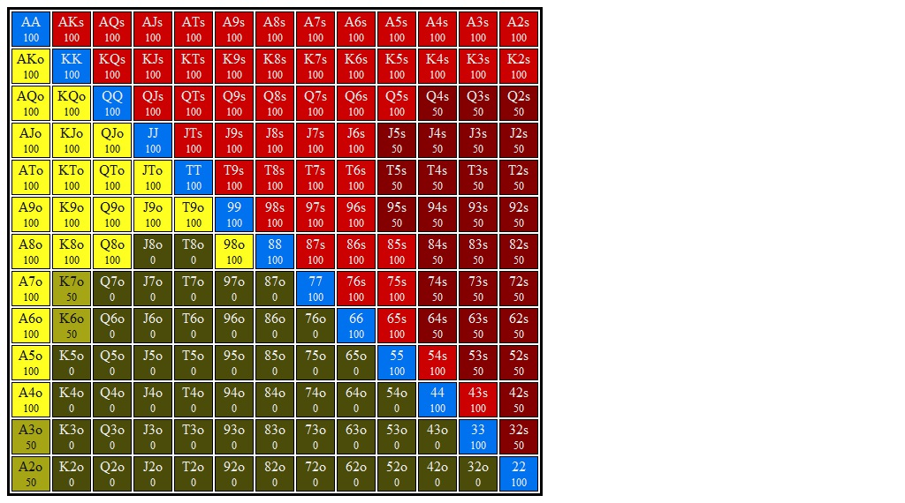

# Section 1: Sb opens, Bb Calls

Blinds are $0.05/$0.10. Effective stacks are $10.00. You're in the Sb. Action folds to you and you open for $0.30 (3bb). Bb calls and go to the flop with $9.70 behind and a pot of $0.60. Action is on you
### Player Ranges

#### Hero's Smallblind Opens and Bigblind Calls Range

#### Villain's Button 3Bet Range vs Lojack Open Range

### Flop 1: <b>A&spades;T&diams;5&clubs;</b>
1. **Approximate each player's equity. Who has the equity advantage?**

    SB should have about 55% equity

2. **What are the weakest hands in your range that could go all in on the flop? Go for three streets of value on blank turns?**

    Weakest hands I'd shove for value:
    + Some top pair (AK, AQ)
    
    Possible bluff shoves:
    + Some KQ, KJ, QJ w/ a BDFD?

    Weakest hands I'd call a shove with:
    + Probably some top pair (AK, AQ)

    + **Question:** how do suits affect my calling range? Do I prefer to block or
      unblock flush draws? I'd imagine I'd rather unblock flush draws. This means
      I'd probably prefer to call with AhKh than AdKd.
      BB doesn't have QJ in range, but if they did I'd prefer to unblock it as
      a potential bluff.

3. **Which player has the nuts advantage?**
   About even, maybe? We can have AA, TT, and 55, versus BB's 55. We do
   have about 3x the hands in range as BB so we should have around the same percentage
   sets, but ours are stronger. We also have AT, all A5 (they have A5o tho), and some T5s.
   Thus we have better 2pair, though  they should have a similar number of combos.

4. **How static or dynamic is this flop? What aspects of this flop make it more static or dynamic?  How do these aspects interact with one another?**

5. **Do you want to develop a betting range? Which hands prefer to bet?**

6. **Do you want to develop a checking range? If so, estimate a x/f, x/c, and x/r range?**

7. **Suppose you check and villain checks behind. What are the best and worst turn cards for your range? Do any give you an equity advantage? A nuts advantage? Uncap your range?**

8. **Suppose you check, villain bets 1/3 pot, and you call. What are the best and worst turn cards for your range? Do any give you an equity advantage? A nuts advantage? Uncap your range?**

#### Hands for flop A&spades;T&diams;5&clubs;
1. <b>9&diams;6&diams;</b>    (Flop: A&spades;T&diams;5&clubs;)

    1. **Do you ever check/fold this hand?**

    2. **Do you ever check/call this hand? If so, discuss your turn strategy.**

    3. **Do you ever check/raise this hand? If so, should you expect better hands to fold? Worse hands to call? Which hands? Discuss your strategy when reraised. Discuss your turn strategy when called.**

    4. **Does this hand benefit from protection bet?**

    5. **Which aspects of this hand want to grow the pot? Which aspects want to play a smaller pot? How do they interact?**

    6. **Does this hand ever bet? Which sizes should you choose (1/3 pot, 2/3 pot, 5/4 pot)? What is your strategy after getting called? After getting raised?**

    7. **Suppose you check the flop and villain checks behind. Discuss your turn strategy.**

2. <b>A&diams;7&diams;</b>    (Flop: A&spades;T&diams;5&clubs;)

    1. **Do you ever check/fold this hand?**

    2. **Do you ever check/call this hand? If so, discuss your turn strategy.**

    3. **Do you ever check/raise this hand? If so, should you expect better hands to fold? Worse hands to call? Which hands? Discuss your strategy when reraised. Discuss your turn strategy when called.**

    4. **Does this hand benefit from protection bet?**

    5. **Which aspects of this hand want to grow the pot? Which aspects want to play a smaller pot? How do they interact?**

    6. **Does this hand ever bet? Which sizes should you choose (1/3 pot, 2/3 pot, 5/4 pot)? What is your strategy after getting called? After getting raised?**

    7. **Suppose you check the flop and villain checks behind. Discuss your turn strategy.**

3. <b>8&diams;5&diams;</b>    (Flop: A&spades;T&diams;5&clubs;)

    1. **Do you ever check/fold this hand?**

    2. **Do you ever check/call this hand? If so, discuss your turn strategy.**

    3. **Do you ever check/raise this hand? If so, should you expect better hands to fold? Worse hands to call? Which hands? Discuss your strategy when reraised. Discuss your turn strategy when called.**

    4. **Does this hand benefit from protection bet?**

    5. **Which aspects of this hand want to grow the pot? Which aspects want to play a smaller pot? How do they interact?**

    6. **Does this hand ever bet? Which sizes should you choose (1/3 pot, 2/3 pot, 5/4 pot)? What is your strategy after getting called? After getting raised?**

    7. **Suppose you check the flop and villain checks behind. Discuss your turn strategy.**

4. <b>K&hearts;Q&hearts;</b>    (Flop: A&spades;T&diams;5&clubs;)

    1. **Do you ever check/fold this hand?**

    2. **Do you ever check/call this hand? If so, discuss your turn strategy.**

    3. **Do you ever check/raise this hand? If so, should you expect better hands to fold? Worse hands to call? Which hands? Discuss your strategy when reraised. Discuss your turn strategy when called.**

    4. **Does this hand benefit from protection bet?**

    5. **Which aspects of this hand want to grow the pot? Which aspects want to play a smaller pot? How do they interact?**

    6. **Does this hand ever bet? Which sizes should you choose (1/3 pot, 2/3 pot, 5/4 pot)? What is your strategy after getting called? After getting raised?**

    7. **Suppose you check the flop and villain checks behind. Discuss your turn strategy.**

5. <b>J&clubs;T&clubs;</b>    (Flop: A&spades;T&diams;5&clubs;)

    1. **Do you ever check/fold this hand?**

    2. **Do you ever check/call this hand? If so, discuss your turn strategy.**

    3. **Do you ever check/raise this hand? If so, should you expect better hands to fold? Worse hands to call? Which hands? Discuss your strategy when reraised. Discuss your turn strategy when called.**

    4. **Does this hand benefit from protection bet?**

    5. **Which aspects of this hand want to grow the pot? Which aspects want to play a smaller pot? How do they interact?**

    6. **Does this hand ever bet? Which sizes should you choose (1/3 pot, 2/3 pot, 5/4 pot)? What is your strategy after getting called? After getting raised?**

    7. **Suppose you check the flop and villain checks behind. Discuss your turn strategy.**

6. <b>9&hearts;9&clubs;</b>    (Flop: A&spades;T&diams;5&clubs;)

    1. **Do you ever check/fold this hand?**

    2. **Do you ever check/call this hand? If so, discuss your turn strategy.**

    3. **Do you ever check/raise this hand? If so, should you expect better hands to fold? Worse hands to call? Which hands? Discuss your strategy when reraised. Discuss your turn strategy when called.**

    4. **Does this hand benefit from protection bet?**

    5. **Which aspects of this hand want to grow the pot? Which aspects want to play a smaller pot? How do they interact?**

    6. **Does this hand ever bet? Which sizes should you choose (1/3 pot, 2/3 pot, 5/4 pot)? What is your strategy after getting called? After getting raised?**

    7. **Suppose you check the flop and villain checks behind. Discuss your turn strategy.**

7. <b>Q&clubs;T&clubs;</b>    (Flop: A&spades;T&diams;5&clubs;)

    1. **Do you ever check/fold this hand?**

    2. **Do you ever check/call this hand? If so, discuss your turn strategy.**

    3. **Do you ever check/raise this hand? If so, should you expect better hands to fold? Worse hands to call? Which hands? Discuss your strategy when reraised. Discuss your turn strategy when called.**

    4. **Does this hand benefit from protection bet?**

    5. **Which aspects of this hand want to grow the pot? Which aspects want to play a smaller pot? How do they interact?**

    6. **Does this hand ever bet? Which sizes should you choose (1/3 pot, 2/3 pot, 5/4 pot)? What is your strategy after getting called? After getting raised?**

    7. **Suppose you check the flop and villain checks behind. Discuss your turn strategy.**

8. <b>K&hearts;7&spades;</b>    (Flop: A&spades;T&diams;5&clubs;)

    1. **Do you ever check/fold this hand?**

    2. **Do you ever check/call this hand? If so, discuss your turn strategy.**

    3. **Do you ever check/raise this hand? If so, should you expect better hands to fold? Worse hands to call? Which hands? Discuss your strategy when reraised. Discuss your turn strategy when called.**

    4. **Does this hand benefit from protection bet?**

    5. **Which aspects of this hand want to grow the pot? Which aspects want to play a smaller pot? How do they interact?**

    6. **Does this hand ever bet? Which sizes should you choose (1/3 pot, 2/3 pot, 5/4 pot)? What is your strategy after getting called? After getting raised?**

    7. **Suppose you check the flop and villain checks behind. Discuss your turn strategy.**

9. <b>J&spades;4&spades;</b>    (Flop: A&spades;T&diams;5&clubs;)

    1. **Do you ever check/fold this hand?**

    2. **Do you ever check/call this hand? If so, discuss your turn strategy.**

    3. **Do you ever check/raise this hand? If so, should you expect better hands to fold? Worse hands to call? Which hands? Discuss your strategy when reraised. Discuss your turn strategy when called.**

    4. **Does this hand benefit from protection bet?**

    5. **Which aspects of this hand want to grow the pot? Which aspects want to play a smaller pot? How do they interact?**

    6. **Does this hand ever bet? Which sizes should you choose (1/3 pot, 2/3 pot, 5/4 pot)? What is your strategy after getting called? After getting raised?**

    7. **Suppose you check the flop and villain checks behind. Discuss your turn strategy.**

10. <b>K&diams;7&diams;</b>    (Flop: A&spades;T&diams;5&clubs;)

    1. **Do you ever check/fold this hand?**

    2. **Do you ever check/call this hand? If so, discuss your turn strategy.**

    3. **Do you ever check/raise this hand? If so, should you expect better hands to fold? Worse hands to call? Which hands? Discuss your strategy when reraised. Discuss your turn strategy when called.**

    4. **Does this hand benefit from protection bet?**

    5. **Which aspects of this hand want to grow the pot? Which aspects want to play a smaller pot? How do they interact?**

    6. **Does this hand ever bet? Which sizes should you choose (1/3 pot, 2/3 pot, 5/4 pot)? What is your strategy after getting called? After getting raised?**

    7. **Suppose you check the flop and villain checks behind. Discuss your turn strategy.**

### Flop 2: <b>T&spades;4&spades;2&spades;</b>
1. **Approximate each player's equity. Who has the equity advantage?**

2. **What are the weakest hands in your range that could go all in on the flop? Go for three streets of value on blank turns?**

3. **Which player has the nuts advantage?**

4. **How static or dynamic is this flop? What aspects of this flop make it more static or dynamic?  How do these aspects interact with one another?**

5. **Do you want to develop a betting range? Which hands prefer to bet?**

6. **Do you want to develop a checking range? If so, estimate a x/f, x/c, and x/r range?**

7. **Suppose you check and villain checks behind. What are the best and worst turn cards for your range? Do any give you an equity advantage? A nuts advantage? Uncap your range?**

8. **Suppose you check, villain bets 1/3 pot, and you call. What are the best and worst turn cards for your range? Do any give you an equity advantage? A nuts advantage? Uncap your range?**

#### Hands for flop T&spades;4&spades;2&spades;
1. <b>K&hearts;5&hearts;</b>    (Flop: T&spades;4&spades;2&spades;)

    1. **Do you ever check/fold this hand?**

    2. **Do you ever check/call this hand? If so, discuss your turn strategy.**

    3. **Do you ever check/raise this hand? If so, should you expect better hands to fold? Worse hands to call? Which hands? Discuss your strategy when reraised. Discuss your turn strategy when called.**

    4. **Does this hand benefit from protection bet?**

    5. **Which aspects of this hand want to grow the pot? Which aspects want to play a smaller pot? How do they interact?**

    6. **Does this hand ever bet? Which sizes should you choose (1/3 pot, 2/3 pot, 5/4 pot)? What is your strategy after getting called? After getting raised?**

    7. **Suppose you check the flop and villain checks behind. Discuss your turn strategy.**

2. <b>A&clubs;5&clubs;</b>    (Flop: T&spades;4&spades;2&spades;)

    1. **Do you ever check/fold this hand?**

    2. **Do you ever check/call this hand? If so, discuss your turn strategy.**

    3. **Do you ever check/raise this hand? If so, should you expect better hands to fold? Worse hands to call? Which hands? Discuss your strategy when reraised. Discuss your turn strategy when called.**

    4. **Does this hand benefit from protection bet?**

    5. **Which aspects of this hand want to grow the pot? Which aspects want to play a smaller pot? How do they interact?**

    6. **Does this hand ever bet? Which sizes should you choose (1/3 pot, 2/3 pot, 5/4 pot)? What is your strategy after getting called? After getting raised?**

    7. **Suppose you check the flop and villain checks behind. Discuss your turn strategy.**

3. <b>Q&diams;J&clubs;</b>    (Flop: T&spades;4&spades;2&spades;)

    1. **Do you ever check/fold this hand?**

    2. **Do you ever check/call this hand? If so, discuss your turn strategy.**

    3. **Do you ever check/raise this hand? If so, should you expect better hands to fold? Worse hands to call? Which hands? Discuss your strategy when reraised. Discuss your turn strategy when called.**

    4. **Does this hand benefit from protection bet?**

    5. **Which aspects of this hand want to grow the pot? Which aspects want to play a smaller pot? How do they interact?**

    6. **Does this hand ever bet? Which sizes should you choose (1/3 pot, 2/3 pot, 5/4 pot)? What is your strategy after getting called? After getting raised?**

    7. **Suppose you check the flop and villain checks behind. Discuss your turn strategy.**

4. <b>4&hearts;3&hearts;</b>    (Flop: T&spades;4&spades;2&spades;)

    1. **Do you ever check/fold this hand?**

    2. **Do you ever check/call this hand? If so, discuss your turn strategy.**

    3. **Do you ever check/raise this hand? If so, should you expect better hands to fold? Worse hands to call? Which hands? Discuss your strategy when reraised. Discuss your turn strategy when called.**

    4. **Does this hand benefit from protection bet?**

    5. **Which aspects of this hand want to grow the pot? Which aspects want to play a smaller pot? How do they interact?**

    6. **Does this hand ever bet? Which sizes should you choose (1/3 pot, 2/3 pot, 5/4 pot)? What is your strategy after getting called? After getting raised?**

    7. **Suppose you check the flop and villain checks behind. Discuss your turn strategy.**

5. <b>K&clubs;T&clubs;</b>    (Flop: T&spades;4&spades;2&spades;)

    1. **Do you ever check/fold this hand?**

    2. **Do you ever check/call this hand? If so, discuss your turn strategy.**

    3. **Do you ever check/raise this hand? If so, should you expect better hands to fold? Worse hands to call? Which hands? Discuss your strategy when reraised. Discuss your turn strategy when called.**

    4. **Does this hand benefit from protection bet?**

    5. **Which aspects of this hand want to grow the pot? Which aspects want to play a smaller pot? How do they interact?**

    6. **Does this hand ever bet? Which sizes should you choose (1/3 pot, 2/3 pot, 5/4 pot)? What is your strategy after getting called? After getting raised?**

    7. **Suppose you check the flop and villain checks behind. Discuss your turn strategy.**

6. <b>T&diams;T&clubs;</b>    (Flop: T&spades;4&spades;2&spades;)

    1. **Do you ever check/fold this hand?**

    2. **Do you ever check/call this hand? If so, discuss your turn strategy.**

    3. **Do you ever check/raise this hand? If so, should you expect better hands to fold? Worse hands to call? Which hands? Discuss your strategy when reraised. Discuss your turn strategy when called.**

    4. **Does this hand benefit from protection bet?**

    5. **Which aspects of this hand want to grow the pot? Which aspects want to play a smaller pot? How do they interact?**

    6. **Does this hand ever bet? Which sizes should you choose (1/3 pot, 2/3 pot, 5/4 pot)? What is your strategy after getting called? After getting raised?**

    7. **Suppose you check the flop and villain checks behind. Discuss your turn strategy.**

7. <b>K&clubs;2&clubs;</b>    (Flop: T&spades;4&spades;2&spades;)

    1. **Do you ever check/fold this hand?**

    2. **Do you ever check/call this hand? If so, discuss your turn strategy.**

    3. **Do you ever check/raise this hand? If so, should you expect better hands to fold? Worse hands to call? Which hands? Discuss your strategy when reraised. Discuss your turn strategy when called.**

    4. **Does this hand benefit from protection bet?**

    5. **Which aspects of this hand want to grow the pot? Which aspects want to play a smaller pot? How do they interact?**

    6. **Does this hand ever bet? Which sizes should you choose (1/3 pot, 2/3 pot, 5/4 pot)? What is your strategy after getting called? After getting raised?**

    7. **Suppose you check the flop and villain checks behind. Discuss your turn strategy.**

8. <b>7&diams;5&diams;</b>    (Flop: T&spades;4&spades;2&spades;)

    1. **Do you ever check/fold this hand?**

    2. **Do you ever check/call this hand? If so, discuss your turn strategy.**

    3. **Do you ever check/raise this hand? If so, should you expect better hands to fold? Worse hands to call? Which hands? Discuss your strategy when reraised. Discuss your turn strategy when called.**

    4. **Does this hand benefit from protection bet?**

    5. **Which aspects of this hand want to grow the pot? Which aspects want to play a smaller pot? How do they interact?**

    6. **Does this hand ever bet? Which sizes should you choose (1/3 pot, 2/3 pot, 5/4 pot)? What is your strategy after getting called? After getting raised?**

    7. **Suppose you check the flop and villain checks behind. Discuss your turn strategy.**

9. <b>6&diams;3&diams;</b>    (Flop: T&spades;4&spades;2&spades;)

    1. **Do you ever check/fold this hand?**

    2. **Do you ever check/call this hand? If so, discuss your turn strategy.**

    3. **Do you ever check/raise this hand? If so, should you expect better hands to fold? Worse hands to call? Which hands? Discuss your strategy when reraised. Discuss your turn strategy when called.**

    4. **Does this hand benefit from protection bet?**

    5. **Which aspects of this hand want to grow the pot? Which aspects want to play a smaller pot? How do they interact?**

    6. **Does this hand ever bet? Which sizes should you choose (1/3 pot, 2/3 pot, 5/4 pot)? What is your strategy after getting called? After getting raised?**

    7. **Suppose you check the flop and villain checks behind. Discuss your turn strategy.**

10. <b>A&spades;3&clubs;</b>    (Flop: T&spades;4&spades;2&spades;)

    1. **Do you ever check/fold this hand?**

    2. **Do you ever check/call this hand? If so, discuss your turn strategy.**

    3. **Do you ever check/raise this hand? If so, should you expect better hands to fold? Worse hands to call? Which hands? Discuss your strategy when reraised. Discuss your turn strategy when called.**

    4. **Does this hand benefit from protection bet?**

    5. **Which aspects of this hand want to grow the pot? Which aspects want to play a smaller pot? How do they interact?**

    6. **Does this hand ever bet? Which sizes should you choose (1/3 pot, 2/3 pot, 5/4 pot)? What is your strategy after getting called? After getting raised?**

    7. **Suppose you check the flop and villain checks behind. Discuss your turn strategy.**

### Flop 3: <b>7&spades;6&spades;6&diams;</b>
1. **Approximate each player's equity. Who has the equity advantage?**

2. **What are the weakest hands in your range that could go all in on the flop? Go for three streets of value on blank turns?**

3. **Which player has the nuts advantage?**

4. **How static or dynamic is this flop? What aspects of this flop make it more static or dynamic?  How do these aspects interact with one another?**

5. **Do you want to develop a betting range? Which hands prefer to bet?**

6. **Do you want to develop a checking range? If so, estimate a x/f, x/c, and x/r range?**

7. **Suppose you check and villain checks behind. What are the best and worst turn cards for your range? Do any give you an equity advantage? A nuts advantage? Uncap your range?**

8. **Suppose you check, villain bets 1/3 pot, and you call. What are the best and worst turn cards for your range? Do any give you an equity advantage? A nuts advantage? Uncap your range?**

#### Hands for flop 7&spades;6&spades;6&diams;
1. <b>Q&diams;7&diams;</b>    (Flop: 7&spades;6&spades;6&diams;)

    1. **Do you ever check/fold this hand?**

    2. **Do you ever check/call this hand? If so, discuss your turn strategy.**

    3. **Do you ever check/raise this hand? If so, should you expect better hands to fold? Worse hands to call? Which hands? Discuss your strategy when reraised. Discuss your turn strategy when called.**

    4. **Does this hand benefit from protection bet?**

    5. **Which aspects of this hand want to grow the pot? Which aspects want to play a smaller pot? How do they interact?**

    6. **Does this hand ever bet? Which sizes should you choose (1/3 pot, 2/3 pot, 5/4 pot)? What is your strategy after getting called? After getting raised?**

    7. **Suppose you check the flop and villain checks behind. Discuss your turn strategy.**

2. <b>4&diams;3&diams;</b>    (Flop: 7&spades;6&spades;6&diams;)

    1. **Do you ever check/fold this hand?**

    2. **Do you ever check/call this hand? If so, discuss your turn strategy.**

    3. **Do you ever check/raise this hand? If so, should you expect better hands to fold? Worse hands to call? Which hands? Discuss your strategy when reraised. Discuss your turn strategy when called.**

    4. **Does this hand benefit from protection bet?**

    5. **Which aspects of this hand want to grow the pot? Which aspects want to play a smaller pot? How do they interact?**

    6. **Does this hand ever bet? Which sizes should you choose (1/3 pot, 2/3 pot, 5/4 pot)? What is your strategy after getting called? After getting raised?**

    7. **Suppose you check the flop and villain checks behind. Discuss your turn strategy.**

3. <b>Q&clubs;8&clubs;</b>    (Flop: 7&spades;6&spades;6&diams;)

    1. **Do you ever check/fold this hand?**

    2. **Do you ever check/call this hand? If so, discuss your turn strategy.**

    3. **Do you ever check/raise this hand? If so, should you expect better hands to fold? Worse hands to call? Which hands? Discuss your strategy when reraised. Discuss your turn strategy when called.**

    4. **Does this hand benefit from protection bet?**

    5. **Which aspects of this hand want to grow the pot? Which aspects want to play a smaller pot? How do they interact?**

    6. **Does this hand ever bet? Which sizes should you choose (1/3 pot, 2/3 pot, 5/4 pot)? What is your strategy after getting called? After getting raised?**

    7. **Suppose you check the flop and villain checks behind. Discuss your turn strategy.**

4. <b>K&spades;J&spades;</b>    (Flop: 7&spades;6&spades;6&diams;)

    1. **Do you ever check/fold this hand?**

    2. **Do you ever check/call this hand? If so, discuss your turn strategy.**

    3. **Do you ever check/raise this hand? If so, should you expect better hands to fold? Worse hands to call? Which hands? Discuss your strategy when reraised. Discuss your turn strategy when called.**

    4. **Does this hand benefit from protection bet?**

    5. **Which aspects of this hand want to grow the pot? Which aspects want to play a smaller pot? How do they interact?**

    6. **Does this hand ever bet? Which sizes should you choose (1/3 pot, 2/3 pot, 5/4 pot)? What is your strategy after getting called? After getting raised?**

    7. **Suppose you check the flop and villain checks behind. Discuss your turn strategy.**

5. <b>A&diams;Q&clubs;</b>    (Flop: 7&spades;6&spades;6&diams;)

    1. **Do you ever check/fold this hand?**

    2. **Do you ever check/call this hand? If so, discuss your turn strategy.**

    3. **Do you ever check/raise this hand? If so, should you expect better hands to fold? Worse hands to call? Which hands? Discuss your strategy when reraised. Discuss your turn strategy when called.**

    4. **Does this hand benefit from protection bet?**

    5. **Which aspects of this hand want to grow the pot? Which aspects want to play a smaller pot? How do they interact?**

    6. **Does this hand ever bet? Which sizes should you choose (1/3 pot, 2/3 pot, 5/4 pot)? What is your strategy after getting called? After getting raised?**

    7. **Suppose you check the flop and villain checks behind. Discuss your turn strategy.**

6. <b>7&clubs;4&clubs;</b>    (Flop: 7&spades;6&spades;6&diams;)

    1. **Do you ever check/fold this hand?**

    2. **Do you ever check/call this hand? If so, discuss your turn strategy.**

    3. **Do you ever check/raise this hand? If so, should you expect better hands to fold? Worse hands to call? Which hands? Discuss your strategy when reraised. Discuss your turn strategy when called.**

    4. **Does this hand benefit from protection bet?**

    5. **Which aspects of this hand want to grow the pot? Which aspects want to play a smaller pot? How do they interact?**

    6. **Does this hand ever bet? Which sizes should you choose (1/3 pot, 2/3 pot, 5/4 pot)? What is your strategy after getting called? After getting raised?**

    7. **Suppose you check the flop and villain checks behind. Discuss your turn strategy.**

7. <b>K&diams;T&diams;</b>    (Flop: 7&spades;6&spades;6&diams;)

    1. **Do you ever check/fold this hand?**

    2. **Do you ever check/call this hand? If so, discuss your turn strategy.**

    3. **Do you ever check/raise this hand? If so, should you expect better hands to fold? Worse hands to call? Which hands? Discuss your strategy when reraised. Discuss your turn strategy when called.**

    4. **Does this hand benefit from protection bet?**

    5. **Which aspects of this hand want to grow the pot? Which aspects want to play a smaller pot? How do they interact?**

    6. **Does this hand ever bet? Which sizes should you choose (1/3 pot, 2/3 pot, 5/4 pot)? What is your strategy after getting called? After getting raised?**

    7. **Suppose you check the flop and villain checks behind. Discuss your turn strategy.**

8. <b>5&spades;3&spades;</b>    (Flop: 7&spades;6&spades;6&diams;)

    1. **Do you ever check/fold this hand?**

    2. **Do you ever check/call this hand? If so, discuss your turn strategy.**

    3. **Do you ever check/raise this hand? If so, should you expect better hands to fold? Worse hands to call? Which hands? Discuss your strategy when reraised. Discuss your turn strategy when called.**

    4. **Does this hand benefit from protection bet?**

    5. **Which aspects of this hand want to grow the pot? Which aspects want to play a smaller pot? How do they interact?**

    6. **Does this hand ever bet? Which sizes should you choose (1/3 pot, 2/3 pot, 5/4 pot)? What is your strategy after getting called? After getting raised?**

    7. **Suppose you check the flop and villain checks behind. Discuss your turn strategy.**

9. <b>Q&spades;T&clubs;</b>    (Flop: 7&spades;6&spades;6&diams;)

    1. **Do you ever check/fold this hand?**

    2. **Do you ever check/call this hand? If so, discuss your turn strategy.**

    3. **Do you ever check/raise this hand? If so, should you expect better hands to fold? Worse hands to call? Which hands? Discuss your strategy when reraised. Discuss your turn strategy when called.**

    4. **Does this hand benefit from protection bet?**

    5. **Which aspects of this hand want to grow the pot? Which aspects want to play a smaller pot? How do they interact?**

    6. **Does this hand ever bet? Which sizes should you choose (1/3 pot, 2/3 pot, 5/4 pot)? What is your strategy after getting called? After getting raised?**

    7. **Suppose you check the flop and villain checks behind. Discuss your turn strategy.**

10. <b>Q&spades;J&spades;</b>    (Flop: 7&spades;6&spades;6&diams;)

    1. **Do you ever check/fold this hand?**

    2. **Do you ever check/call this hand? If so, discuss your turn strategy.**

    3. **Do you ever check/raise this hand? If so, should you expect better hands to fold? Worse hands to call? Which hands? Discuss your strategy when reraised. Discuss your turn strategy when called.**

    4. **Does this hand benefit from protection bet?**

    5. **Which aspects of this hand want to grow the pot? Which aspects want to play a smaller pot? How do they interact?**

    6. **Does this hand ever bet? Which sizes should you choose (1/3 pot, 2/3 pot, 5/4 pot)? What is your strategy after getting called? After getting raised?**

    7. **Suppose you check the flop and villain checks behind. Discuss your turn strategy.**

### Flop 4: <b>Q&spades;8&diams;6&spades;</b>
1. **Approximate each player's equity. Who has the equity advantage?**

2. **What are the weakest hands in your range that could go all in on the flop? Go for three streets of value on blank turns?**

3. **Which player has the nuts advantage?**

4. **How static or dynamic is this flop? What aspects of this flop make it more static or dynamic?  How do these aspects interact with one another?**

5. **Do you want to develop a betting range? Which hands prefer to bet?**

6. **Do you want to develop a checking range? If so, estimate a x/f, x/c, and x/r range?**

7. **Suppose you check and villain checks behind. What are the best and worst turn cards for your range? Do any give you an equity advantage? A nuts advantage? Uncap your range?**

8. **Suppose you check, villain bets 1/3 pot, and you call. What are the best and worst turn cards for your range? Do any give you an equity advantage? A nuts advantage? Uncap your range?**

#### Hands for flop Q&spades;8&diams;6&spades;
1. <b>Q&clubs;2&clubs;</b>    (Flop: Q&spades;8&diams;6&spades;)

    1. **Do you ever check/fold this hand?**

    2. **Do you ever check/call this hand? If so, discuss your turn strategy.**

    3. **Do you ever check/raise this hand? If so, should you expect better hands to fold? Worse hands to call? Which hands? Discuss your strategy when reraised. Discuss your turn strategy when called.**

    4. **Does this hand benefit from protection bet?**

    5. **Which aspects of this hand want to grow the pot? Which aspects want to play a smaller pot? How do they interact?**

    6. **Does this hand ever bet? Which sizes should you choose (1/3 pot, 2/3 pot, 5/4 pot)? What is your strategy after getting called? After getting raised?**

    7. **Suppose you check the flop and villain checks behind. Discuss your turn strategy.**

2. <b>9&spades;7&spades;</b>    (Flop: Q&spades;8&diams;6&spades;)

    1. **Do you ever check/fold this hand?**

    2. **Do you ever check/call this hand? If so, discuss your turn strategy.**

    3. **Do you ever check/raise this hand? If so, should you expect better hands to fold? Worse hands to call? Which hands? Discuss your strategy when reraised. Discuss your turn strategy when called.**

    4. **Does this hand benefit from protection bet?**

    5. **Which aspects of this hand want to grow the pot? Which aspects want to play a smaller pot? How do they interact?**

    6. **Does this hand ever bet? Which sizes should you choose (1/3 pot, 2/3 pot, 5/4 pot)? What is your strategy after getting called? After getting raised?**

    7. **Suppose you check the flop and villain checks behind. Discuss your turn strategy.**

3. <b>A&clubs;5&clubs;</b>    (Flop: Q&spades;8&diams;6&spades;)

    1. **Do you ever check/fold this hand?**

    2. **Do you ever check/call this hand? If so, discuss your turn strategy.**

    3. **Do you ever check/raise this hand? If so, should you expect better hands to fold? Worse hands to call? Which hands? Discuss your strategy when reraised. Discuss your turn strategy when called.**

    4. **Does this hand benefit from protection bet?**

    5. **Which aspects of this hand want to grow the pot? Which aspects want to play a smaller pot? How do they interact?**

    6. **Does this hand ever bet? Which sizes should you choose (1/3 pot, 2/3 pot, 5/4 pot)? What is your strategy after getting called? After getting raised?**

    7. **Suppose you check the flop and villain checks behind. Discuss your turn strategy.**

4. <b>J&spades;7&spades;</b>    (Flop: Q&spades;8&diams;6&spades;)

    1. **Do you ever check/fold this hand?**

    2. **Do you ever check/call this hand? If so, discuss your turn strategy.**

    3. **Do you ever check/raise this hand? If so, should you expect better hands to fold? Worse hands to call? Which hands? Discuss your strategy when reraised. Discuss your turn strategy when called.**

    4. **Does this hand benefit from protection bet?**

    5. **Which aspects of this hand want to grow the pot? Which aspects want to play a smaller pot? How do they interact?**

    6. **Does this hand ever bet? Which sizes should you choose (1/3 pot, 2/3 pot, 5/4 pot)? What is your strategy after getting called? After getting raised?**

    7. **Suppose you check the flop and villain checks behind. Discuss your turn strategy.**

5. <b>J&spades;5&spades;</b>    (Flop: Q&spades;8&diams;6&spades;)

    1. **Do you ever check/fold this hand?**

    2. **Do you ever check/call this hand? If so, discuss your turn strategy.**

    3. **Do you ever check/raise this hand? If so, should you expect better hands to fold? Worse hands to call? Which hands? Discuss your strategy when reraised. Discuss your turn strategy when called.**

    4. **Does this hand benefit from protection bet?**

    5. **Which aspects of this hand want to grow the pot? Which aspects want to play a smaller pot? How do they interact?**

    6. **Does this hand ever bet? Which sizes should you choose (1/3 pot, 2/3 pot, 5/4 pot)? What is your strategy after getting called? After getting raised?**

    7. **Suppose you check the flop and villain checks behind. Discuss your turn strategy.**

6. <b>J&hearts;J&diams;</b>    (Flop: Q&spades;8&diams;6&spades;)

    1. **Do you ever check/fold this hand?**

    2. **Do you ever check/call this hand? If so, discuss your turn strategy.**

    3. **Do you ever check/raise this hand? If so, should you expect better hands to fold? Worse hands to call? Which hands? Discuss your strategy when reraised. Discuss your turn strategy when called.**

    4. **Does this hand benefit from protection bet?**

    5. **Which aspects of this hand want to grow the pot? Which aspects want to play a smaller pot? How do they interact?**

    6. **Does this hand ever bet? Which sizes should you choose (1/3 pot, 2/3 pot, 5/4 pot)? What is your strategy after getting called? After getting raised?**

    7. **Suppose you check the flop and villain checks behind. Discuss your turn strategy.**

7. <b>T&diams;T&clubs;</b>    (Flop: Q&spades;8&diams;6&spades;)

    1. **Do you ever check/fold this hand?**

    2. **Do you ever check/call this hand? If so, discuss your turn strategy.**

    3. **Do you ever check/raise this hand? If so, should you expect better hands to fold? Worse hands to call? Which hands? Discuss your strategy when reraised. Discuss your turn strategy when called.**

    4. **Does this hand benefit from protection bet?**

    5. **Which aspects of this hand want to grow the pot? Which aspects want to play a smaller pot? How do they interact?**

    6. **Does this hand ever bet? Which sizes should you choose (1/3 pot, 2/3 pot, 5/4 pot)? What is your strategy after getting called? After getting raised?**

    7. **Suppose you check the flop and villain checks behind. Discuss your turn strategy.**

8. <b>T&diams;5&diams;</b>    (Flop: Q&spades;8&diams;6&spades;)

    1. **Do you ever check/fold this hand?**

    2. **Do you ever check/call this hand? If so, discuss your turn strategy.**

    3. **Do you ever check/raise this hand? If so, should you expect better hands to fold? Worse hands to call? Which hands? Discuss your strategy when reraised. Discuss your turn strategy when called.**

    4. **Does this hand benefit from protection bet?**

    5. **Which aspects of this hand want to grow the pot? Which aspects want to play a smaller pot? How do they interact?**

    6. **Does this hand ever bet? Which sizes should you choose (1/3 pot, 2/3 pot, 5/4 pot)? What is your strategy after getting called? After getting raised?**

    7. **Suppose you check the flop and villain checks behind. Discuss your turn strategy.**

9. <b>Q&hearts;8&hearts;</b>    (Flop: Q&spades;8&diams;6&spades;)

    1. **Do you ever check/fold this hand?**

    2. **Do you ever check/call this hand? If so, discuss your turn strategy.**

    3. **Do you ever check/raise this hand? If so, should you expect better hands to fold? Worse hands to call? Which hands? Discuss your strategy when reraised. Discuss your turn strategy when called.**

    4. **Does this hand benefit from protection bet?**

    5. **Which aspects of this hand want to grow the pot? Which aspects want to play a smaller pot? How do they interact?**

    6. **Does this hand ever bet? Which sizes should you choose (1/3 pot, 2/3 pot, 5/4 pot)? What is your strategy after getting called? After getting raised?**

    7. **Suppose you check the flop and villain checks behind. Discuss your turn strategy.**

10. <b>J&clubs;T&spades;</b>    (Flop: Q&spades;8&diams;6&spades;)

    1. **Do you ever check/fold this hand?**

    2. **Do you ever check/call this hand? If so, discuss your turn strategy.**

    3. **Do you ever check/raise this hand? If so, should you expect better hands to fold? Worse hands to call? Which hands? Discuss your strategy when reraised. Discuss your turn strategy when called.**

    4. **Does this hand benefit from protection bet?**

    5. **Which aspects of this hand want to grow the pot? Which aspects want to play a smaller pot? How do they interact?**

    6. **Does this hand ever bet? Which sizes should you choose (1/3 pot, 2/3 pot, 5/4 pot)? What is your strategy after getting called? After getting raised?**

    7. **Suppose you check the flop and villain checks behind. Discuss your turn strategy.**

### Flop 5: <b>8&spades;5&diams;3&diams;</b>
1. **Approximate each player's equity. Who has the equity advantage?**

2. **What are the weakest hands in your range that could go all in on the flop? Go for three streets of value on blank turns?**

3. **Which player has the nuts advantage?**

4. **How static or dynamic is this flop? What aspects of this flop make it more static or dynamic?  How do these aspects interact with one another?**

5. **Do you want to develop a betting range? Which hands prefer to bet?**

6. **Do you want to develop a checking range? If so, estimate a x/f, x/c, and x/r range?**

7. **Suppose you check and villain checks behind. What are the best and worst turn cards for your range? Do any give you an equity advantage? A nuts advantage? Uncap your range?**

8. **Suppose you check, villain bets 1/3 pot, and you call. What are the best and worst turn cards for your range? Do any give you an equity advantage? A nuts advantage? Uncap your range?**

#### Hands for flop 8&spades;5&diams;3&diams;
1. <b>6&hearts;4&hearts;</b>    (Flop: 8&spades;5&diams;3&diams;)

    1. **Do you ever check/fold this hand?**

    2. **Do you ever check/call this hand? If so, discuss your turn strategy.**

    3. **Do you ever check/raise this hand? If so, should you expect better hands to fold? Worse hands to call? Which hands? Discuss your strategy when reraised. Discuss your turn strategy when called.**

    4. **Does this hand benefit from protection bet?**

    5. **Which aspects of this hand want to grow the pot? Which aspects want to play a smaller pot? How do they interact?**

    6. **Does this hand ever bet? Which sizes should you choose (1/3 pot, 2/3 pot, 5/4 pot)? What is your strategy after getting called? After getting raised?**

    7. **Suppose you check the flop and villain checks behind. Discuss your turn strategy.**

2. <b>K&diams;6&hearts;</b>    (Flop: 8&spades;5&diams;3&diams;)

    1. **Do you ever check/fold this hand?**

    2. **Do you ever check/call this hand? If so, discuss your turn strategy.**

    3. **Do you ever check/raise this hand? If so, should you expect better hands to fold? Worse hands to call? Which hands? Discuss your strategy when reraised. Discuss your turn strategy when called.**

    4. **Does this hand benefit from protection bet?**

    5. **Which aspects of this hand want to grow the pot? Which aspects want to play a smaller pot? How do they interact?**

    6. **Does this hand ever bet? Which sizes should you choose (1/3 pot, 2/3 pot, 5/4 pot)? What is your strategy after getting called? After getting raised?**

    7. **Suppose you check the flop and villain checks behind. Discuss your turn strategy.**

3. <b>J&clubs;9&hearts;</b>    (Flop: 8&spades;5&diams;3&diams;)

    1. **Do you ever check/fold this hand?**

    2. **Do you ever check/call this hand? If so, discuss your turn strategy.**

    3. **Do you ever check/raise this hand? If so, should you expect better hands to fold? Worse hands to call? Which hands? Discuss your strategy when reraised. Discuss your turn strategy when called.**

    4. **Does this hand benefit from protection bet?**

    5. **Which aspects of this hand want to grow the pot? Which aspects want to play a smaller pot? How do they interact?**

    6. **Does this hand ever bet? Which sizes should you choose (1/3 pot, 2/3 pot, 5/4 pot)? What is your strategy after getting called? After getting raised?**

    7. **Suppose you check the flop and villain checks behind. Discuss your turn strategy.**

4. <b>Q&diams;9&hearts;</b>    (Flop: 8&spades;5&diams;3&diams;)

    1. **Do you ever check/fold this hand?**

    2. **Do you ever check/call this hand? If so, discuss your turn strategy.**

    3. **Do you ever check/raise this hand? If so, should you expect better hands to fold? Worse hands to call? Which hands? Discuss your strategy when reraised. Discuss your turn strategy when called.**

    4. **Does this hand benefit from protection bet?**

    5. **Which aspects of this hand want to grow the pot? Which aspects want to play a smaller pot? How do they interact?**

    6. **Does this hand ever bet? Which sizes should you choose (1/3 pot, 2/3 pot, 5/4 pot)? What is your strategy after getting called? After getting raised?**

    7. **Suppose you check the flop and villain checks behind. Discuss your turn strategy.**

5. <b>J&hearts;2&hearts;</b>    (Flop: 8&spades;5&diams;3&diams;)

    1. **Do you ever check/fold this hand?**

    2. **Do you ever check/call this hand? If so, discuss your turn strategy.**

    3. **Do you ever check/raise this hand? If so, should you expect better hands to fold? Worse hands to call? Which hands? Discuss your strategy when reraised. Discuss your turn strategy when called.**

    4. **Does this hand benefit from protection bet?**

    5. **Which aspects of this hand want to grow the pot? Which aspects want to play a smaller pot? How do they interact?**

    6. **Does this hand ever bet? Which sizes should you choose (1/3 pot, 2/3 pot, 5/4 pot)? What is your strategy after getting called? After getting raised?**

    7. **Suppose you check the flop and villain checks behind. Discuss your turn strategy.**

6. <b>Q&clubs;J&hearts;</b>    (Flop: 8&spades;5&diams;3&diams;)

    1. **Do you ever check/fold this hand?**

    2. **Do you ever check/call this hand? If so, discuss your turn strategy.**

    3. **Do you ever check/raise this hand? If so, should you expect better hands to fold? Worse hands to call? Which hands? Discuss your strategy when reraised. Discuss your turn strategy when called.**

    4. **Does this hand benefit from protection bet?**

    5. **Which aspects of this hand want to grow the pot? Which aspects want to play a smaller pot? How do they interact?**

    6. **Does this hand ever bet? Which sizes should you choose (1/3 pot, 2/3 pot, 5/4 pot)? What is your strategy after getting called? After getting raised?**

    7. **Suppose you check the flop and villain checks behind. Discuss your turn strategy.**

7. <b>A&clubs;3&hearts;</b>    (Flop: 8&spades;5&diams;3&diams;)

    1. **Do you ever check/fold this hand?**

    2. **Do you ever check/call this hand? If so, discuss your turn strategy.**

    3. **Do you ever check/raise this hand? If so, should you expect better hands to fold? Worse hands to call? Which hands? Discuss your strategy when reraised. Discuss your turn strategy when called.**

    4. **Does this hand benefit from protection bet?**

    5. **Which aspects of this hand want to grow the pot? Which aspects want to play a smaller pot? How do they interact?**

    6. **Does this hand ever bet? Which sizes should you choose (1/3 pot, 2/3 pot, 5/4 pot)? What is your strategy after getting called? After getting raised?**

    7. **Suppose you check the flop and villain checks behind. Discuss your turn strategy.**

8. <b>T&diams;9&diams;</b>    (Flop: 8&spades;5&diams;3&diams;)

    1. **Do you ever check/fold this hand?**

    2. **Do you ever check/call this hand? If so, discuss your turn strategy.**

    3. **Do you ever check/raise this hand? If so, should you expect better hands to fold? Worse hands to call? Which hands? Discuss your strategy when reraised. Discuss your turn strategy when called.**

    4. **Does this hand benefit from protection bet?**

    5. **Which aspects of this hand want to grow the pot? Which aspects want to play a smaller pot? How do they interact?**

    6. **Does this hand ever bet? Which sizes should you choose (1/3 pot, 2/3 pot, 5/4 pot)? What is your strategy after getting called? After getting raised?**

    7. **Suppose you check the flop and villain checks behind. Discuss your turn strategy.**

9. <b>K&hearts;T&hearts;</b>    (Flop: 8&spades;5&diams;3&diams;)

    1. **Do you ever check/fold this hand?**

    2. **Do you ever check/call this hand? If so, discuss your turn strategy.**

    3. **Do you ever check/raise this hand? If so, should you expect better hands to fold? Worse hands to call? Which hands? Discuss your strategy when reraised. Discuss your turn strategy when called.**

    4. **Does this hand benefit from protection bet?**

    5. **Which aspects of this hand want to grow the pot? Which aspects want to play a smaller pot? How do they interact?**

    6. **Does this hand ever bet? Which sizes should you choose (1/3 pot, 2/3 pot, 5/4 pot)? What is your strategy after getting called? After getting raised?**

    7. **Suppose you check the flop and villain checks behind. Discuss your turn strategy.**

10. <b>K&diams;8&diams;</b>    (Flop: 8&spades;5&diams;3&diams;)

    1. **Do you ever check/fold this hand?**

    2. **Do you ever check/call this hand? If so, discuss your turn strategy.**

    3. **Do you ever check/raise this hand? If so, should you expect better hands to fold? Worse hands to call? Which hands? Discuss your strategy when reraised. Discuss your turn strategy when called.**

    4. **Does this hand benefit from protection bet?**

    5. **Which aspects of this hand want to grow the pot? Which aspects want to play a smaller pot? How do they interact?**

    6. **Does this hand ever bet? Which sizes should you choose (1/3 pot, 2/3 pot, 5/4 pot)? What is your strategy after getting called? After getting raised?**

    7. **Suppose you check the flop and villain checks behind. Discuss your turn strategy.**

### Flop 6: <b>K&spades;5&diams;2&spades;</b>
1. **Approximate each player's equity. Who has the equity advantage?**

2. **What are the weakest hands in your range that could go all in on the flop? Go for three streets of value on blank turns?**

3. **Which player has the nuts advantage?**

4. **How static or dynamic is this flop? What aspects of this flop make it more static or dynamic?  How do these aspects interact with one another?**

5. **Do you want to develop a betting range? Which hands prefer to bet?**

6. **Do you want to develop a checking range? If so, estimate a x/f, x/c, and x/r range?**

7. **Suppose you check and villain checks behind. What are the best and worst turn cards for your range? Do any give you an equity advantage? A nuts advantage? Uncap your range?**

8. **Suppose you check, villain bets 1/3 pot, and you call. What are the best and worst turn cards for your range? Do any give you an equity advantage? A nuts advantage? Uncap your range?**

#### Hands for flop K&spades;5&diams;2&spades;
1. <b>9&hearts;3&hearts;</b>    (Flop: K&spades;5&diams;2&spades;)

    1. **Do you ever check/fold this hand?**

    2. **Do you ever check/call this hand? If so, discuss your turn strategy.**

    3. **Do you ever check/raise this hand? If so, should you expect better hands to fold? Worse hands to call? Which hands? Discuss your strategy when reraised. Discuss your turn strategy when called.**

    4. **Does this hand benefit from protection bet?**

    5. **Which aspects of this hand want to grow the pot? Which aspects want to play a smaller pot? How do they interact?**

    6. **Does this hand ever bet? Which sizes should you choose (1/3 pot, 2/3 pot, 5/4 pot)? What is your strategy after getting called? After getting raised?**

    7. **Suppose you check the flop and villain checks behind. Discuss your turn strategy.**

2. <b>9&clubs;4&clubs;</b>    (Flop: K&spades;5&diams;2&spades;)

    1. **Do you ever check/fold this hand?**

    2. **Do you ever check/call this hand? If so, discuss your turn strategy.**

    3. **Do you ever check/raise this hand? If so, should you expect better hands to fold? Worse hands to call? Which hands? Discuss your strategy when reraised. Discuss your turn strategy when called.**

    4. **Does this hand benefit from protection bet?**

    5. **Which aspects of this hand want to grow the pot? Which aspects want to play a smaller pot? How do they interact?**

    6. **Does this hand ever bet? Which sizes should you choose (1/3 pot, 2/3 pot, 5/4 pot)? What is your strategy after getting called? After getting raised?**

    7. **Suppose you check the flop and villain checks behind. Discuss your turn strategy.**

3. <b>Q&diams;4&diams;</b>    (Flop: K&spades;5&diams;2&spades;)

    1. **Do you ever check/fold this hand?**

    2. **Do you ever check/call this hand? If so, discuss your turn strategy.**

    3. **Do you ever check/raise this hand? If so, should you expect better hands to fold? Worse hands to call? Which hands? Discuss your strategy when reraised. Discuss your turn strategy when called.**

    4. **Does this hand benefit from protection bet?**

    5. **Which aspects of this hand want to grow the pot? Which aspects want to play a smaller pot? How do they interact?**

    6. **Does this hand ever bet? Which sizes should you choose (1/3 pot, 2/3 pot, 5/4 pot)? What is your strategy after getting called? After getting raised?**

    7. **Suppose you check the flop and villain checks behind. Discuss your turn strategy.**

4. <b>Q&spades;8&diams;</b>    (Flop: K&spades;5&diams;2&spades;)

    1. **Do you ever check/fold this hand?**

    2. **Do you ever check/call this hand? If so, discuss your turn strategy.**

    3. **Do you ever check/raise this hand? If so, should you expect better hands to fold? Worse hands to call? Which hands? Discuss your strategy when reraised. Discuss your turn strategy when called.**

    4. **Does this hand benefit from protection bet?**

    5. **Which aspects of this hand want to grow the pot? Which aspects want to play a smaller pot? How do they interact?**

    6. **Does this hand ever bet? Which sizes should you choose (1/3 pot, 2/3 pot, 5/4 pot)? What is your strategy after getting called? After getting raised?**

    7. **Suppose you check the flop and villain checks behind. Discuss your turn strategy.**

5. <b>A&hearts;5&clubs;</b>    (Flop: K&spades;5&diams;2&spades;)

    1. **Do you ever check/fold this hand?**

    2. **Do you ever check/call this hand? If so, discuss your turn strategy.**

    3. **Do you ever check/raise this hand? If so, should you expect better hands to fold? Worse hands to call? Which hands? Discuss your strategy when reraised. Discuss your turn strategy when called.**

    4. **Does this hand benefit from protection bet?**

    5. **Which aspects of this hand want to grow the pot? Which aspects want to play a smaller pot? How do they interact?**

    6. **Does this hand ever bet? Which sizes should you choose (1/3 pot, 2/3 pot, 5/4 pot)? What is your strategy after getting called? After getting raised?**

    7. **Suppose you check the flop and villain checks behind. Discuss your turn strategy.**

6. <b>Q&hearts;5&hearts;</b>    (Flop: K&spades;5&diams;2&spades;)

    1. **Do you ever check/fold this hand?**

    2. **Do you ever check/call this hand? If so, discuss your turn strategy.**

    3. **Do you ever check/raise this hand? If so, should you expect better hands to fold? Worse hands to call? Which hands? Discuss your strategy when reraised. Discuss your turn strategy when called.**

    4. **Does this hand benefit from protection bet?**

    5. **Which aspects of this hand want to grow the pot? Which aspects want to play a smaller pot? How do they interact?**

    6. **Does this hand ever bet? Which sizes should you choose (1/3 pot, 2/3 pot, 5/4 pot)? What is your strategy after getting called? After getting raised?**

    7. **Suppose you check the flop and villain checks behind. Discuss your turn strategy.**

7. <b>A&clubs;8&spades;</b>    (Flop: K&spades;5&diams;2&spades;)

    1. **Do you ever check/fold this hand?**

    2. **Do you ever check/call this hand? If so, discuss your turn strategy.**

    3. **Do you ever check/raise this hand? If so, should you expect better hands to fold? Worse hands to call? Which hands? Discuss your strategy when reraised. Discuss your turn strategy when called.**

    4. **Does this hand benefit from protection bet?**

    5. **Which aspects of this hand want to grow the pot? Which aspects want to play a smaller pot? How do they interact?**

    6. **Does this hand ever bet? Which sizes should you choose (1/3 pot, 2/3 pot, 5/4 pot)? What is your strategy after getting called? After getting raised?**

    7. **Suppose you check the flop and villain checks behind. Discuss your turn strategy.**

8. <b>Q&hearts;2&hearts;</b>    (Flop: K&spades;5&diams;2&spades;)

    1. **Do you ever check/fold this hand?**

    2. **Do you ever check/call this hand? If so, discuss your turn strategy.**

    3. **Do you ever check/raise this hand? If so, should you expect better hands to fold? Worse hands to call? Which hands? Discuss your strategy when reraised. Discuss your turn strategy when called.**

    4. **Does this hand benefit from protection bet?**

    5. **Which aspects of this hand want to grow the pot? Which aspects want to play a smaller pot? How do they interact?**

    6. **Does this hand ever bet? Which sizes should you choose (1/3 pot, 2/3 pot, 5/4 pot)? What is your strategy after getting called? After getting raised?**

    7. **Suppose you check the flop and villain checks behind. Discuss your turn strategy.**

9. <b>5&hearts;5&spades;</b>    (Flop: K&spades;5&diams;2&spades;)

    1. **Do you ever check/fold this hand?**

    2. **Do you ever check/call this hand? If so, discuss your turn strategy.**

    3. **Do you ever check/raise this hand? If so, should you expect better hands to fold? Worse hands to call? Which hands? Discuss your strategy when reraised. Discuss your turn strategy when called.**

    4. **Does this hand benefit from protection bet?**

    5. **Which aspects of this hand want to grow the pot? Which aspects want to play a smaller pot? How do they interact?**

    6. **Does this hand ever bet? Which sizes should you choose (1/3 pot, 2/3 pot, 5/4 pot)? What is your strategy after getting called? After getting raised?**

    7. **Suppose you check the flop and villain checks behind. Discuss your turn strategy.**

10. <b>K&clubs;J&clubs;</b>    (Flop: K&spades;5&diams;2&spades;)

    1. **Do you ever check/fold this hand?**

    2. **Do you ever check/call this hand? If so, discuss your turn strategy.**

    3. **Do you ever check/raise this hand? If so, should you expect better hands to fold? Worse hands to call? Which hands? Discuss your strategy when reraised. Discuss your turn strategy when called.**

    4. **Does this hand benefit from protection bet?**

    5. **Which aspects of this hand want to grow the pot? Which aspects want to play a smaller pot? How do they interact?**

    6. **Does this hand ever bet? Which sizes should you choose (1/3 pot, 2/3 pot, 5/4 pot)? What is your strategy after getting called? After getting raised?**

    7. **Suppose you check the flop and villain checks behind. Discuss your turn strategy.**

### Flop 7: <b>Q&spades;Q&diams;J&clubs;</b>
1. **Approximate each player's equity. Who has the equity advantage?**

2. **What are the weakest hands in your range that could go all in on the flop? Go for three streets of value on blank turns?**

3. **Which player has the nuts advantage?**

4. **How static or dynamic is this flop? What aspects of this flop make it more static or dynamic?  How do these aspects interact with one another?**

5. **Do you want to develop a betting range? Which hands prefer to bet?**

6. **Do you want to develop a checking range? If so, estimate a x/f, x/c, and x/r range?**

7. **Suppose you check and villain checks behind. What are the best and worst turn cards for your range? Do any give you an equity advantage? A nuts advantage? Uncap your range?**

8. **Suppose you check, villain bets 1/3 pot, and you call. What are the best and worst turn cards for your range? Do any give you an equity advantage? A nuts advantage? Uncap your range?**

#### Hands for flop Q&spades;Q&diams;J&clubs;
1. <b>A&diams;7&hearts;</b>    (Flop: Q&spades;Q&diams;J&clubs;)

    1. **Do you ever check/fold this hand?**

    2. **Do you ever check/call this hand? If so, discuss your turn strategy.**

    3. **Do you ever check/raise this hand? If so, should you expect better hands to fold? Worse hands to call? Which hands? Discuss your strategy when reraised. Discuss your turn strategy when called.**

    4. **Does this hand benefit from protection bet?**

    5. **Which aspects of this hand want to grow the pot? Which aspects want to play a smaller pot? How do they interact?**

    6. **Does this hand ever bet? Which sizes should you choose (1/3 pot, 2/3 pot, 5/4 pot)? What is your strategy after getting called? After getting raised?**

    7. **Suppose you check the flop and villain checks behind. Discuss your turn strategy.**

2. <b>2&hearts;2&clubs;</b>    (Flop: Q&spades;Q&diams;J&clubs;)

    1. **Do you ever check/fold this hand?**

    2. **Do you ever check/call this hand? If so, discuss your turn strategy.**

    3. **Do you ever check/raise this hand? If so, should you expect better hands to fold? Worse hands to call? Which hands? Discuss your strategy when reraised. Discuss your turn strategy when called.**

    4. **Does this hand benefit from protection bet?**

    5. **Which aspects of this hand want to grow the pot? Which aspects want to play a smaller pot? How do they interact?**

    6. **Does this hand ever bet? Which sizes should you choose (1/3 pot, 2/3 pot, 5/4 pot)? What is your strategy after getting called? After getting raised?**

    7. **Suppose you check the flop and villain checks behind. Discuss your turn strategy.**

3. <b>6&spades;3&spades;</b>    (Flop: Q&spades;Q&diams;J&clubs;)

    1. **Do you ever check/fold this hand?**

    2. **Do you ever check/call this hand? If so, discuss your turn strategy.**

    3. **Do you ever check/raise this hand? If so, should you expect better hands to fold? Worse hands to call? Which hands? Discuss your strategy when reraised. Discuss your turn strategy when called.**

    4. **Does this hand benefit from protection bet?**

    5. **Which aspects of this hand want to grow the pot? Which aspects want to play a smaller pot? How do they interact?**

    6. **Does this hand ever bet? Which sizes should you choose (1/3 pot, 2/3 pot, 5/4 pot)? What is your strategy after getting called? After getting raised?**

    7. **Suppose you check the flop and villain checks behind. Discuss your turn strategy.**

4. <b>A&hearts;6&spades;</b>    (Flop: Q&spades;Q&diams;J&clubs;)

    1. **Do you ever check/fold this hand?**

    2. **Do you ever check/call this hand? If so, discuss your turn strategy.**

    3. **Do you ever check/raise this hand? If so, should you expect better hands to fold? Worse hands to call? Which hands? Discuss your strategy when reraised. Discuss your turn strategy when called.**

    4. **Does this hand benefit from protection bet?**

    5. **Which aspects of this hand want to grow the pot? Which aspects want to play a smaller pot? How do they interact?**

    6. **Does this hand ever bet? Which sizes should you choose (1/3 pot, 2/3 pot, 5/4 pot)? What is your strategy after getting called? After getting raised?**

    7. **Suppose you check the flop and villain checks behind. Discuss your turn strategy.**

5. <b>9&diams;2&diams;</b>    (Flop: Q&spades;Q&diams;J&clubs;)

    1. **Do you ever check/fold this hand?**

    2. **Do you ever check/call this hand? If so, discuss your turn strategy.**

    3. **Do you ever check/raise this hand? If so, should you expect better hands to fold? Worse hands to call? Which hands? Discuss your strategy when reraised. Discuss your turn strategy when called.**

    4. **Does this hand benefit from protection bet?**

    5. **Which aspects of this hand want to grow the pot? Which aspects want to play a smaller pot? How do they interact?**

    6. **Does this hand ever bet? Which sizes should you choose (1/3 pot, 2/3 pot, 5/4 pot)? What is your strategy after getting called? After getting raised?**

    7. **Suppose you check the flop and villain checks behind. Discuss your turn strategy.**

6. <b>A&hearts;2&hearts;</b>    (Flop: Q&spades;Q&diams;J&clubs;)

    1. **Do you ever check/fold this hand?**

    2. **Do you ever check/call this hand? If so, discuss your turn strategy.**

    3. **Do you ever check/raise this hand? If so, should you expect better hands to fold? Worse hands to call? Which hands? Discuss your strategy when reraised. Discuss your turn strategy when called.**

    4. **Does this hand benefit from protection bet?**

    5. **Which aspects of this hand want to grow the pot? Which aspects want to play a smaller pot? How do they interact?**

    6. **Does this hand ever bet? Which sizes should you choose (1/3 pot, 2/3 pot, 5/4 pot)? What is your strategy after getting called? After getting raised?**

    7. **Suppose you check the flop and villain checks behind. Discuss your turn strategy.**

7. <b>9&hearts;9&clubs;</b>    (Flop: Q&spades;Q&diams;J&clubs;)

    1. **Do you ever check/fold this hand?**

    2. **Do you ever check/call this hand? If so, discuss your turn strategy.**

    3. **Do you ever check/raise this hand? If so, should you expect better hands to fold? Worse hands to call? Which hands? Discuss your strategy when reraised. Discuss your turn strategy when called.**

    4. **Does this hand benefit from protection bet?**

    5. **Which aspects of this hand want to grow the pot? Which aspects want to play a smaller pot? How do they interact?**

    6. **Does this hand ever bet? Which sizes should you choose (1/3 pot, 2/3 pot, 5/4 pot)? What is your strategy after getting called? After getting raised?**

    7. **Suppose you check the flop and villain checks behind. Discuss your turn strategy.**

8. <b>6&spades;4&spades;</b>    (Flop: Q&spades;Q&diams;J&clubs;)

    1. **Do you ever check/fold this hand?**

    2. **Do you ever check/call this hand? If so, discuss your turn strategy.**

    3. **Do you ever check/raise this hand? If so, should you expect better hands to fold? Worse hands to call? Which hands? Discuss your strategy when reraised. Discuss your turn strategy when called.**

    4. **Does this hand benefit from protection bet?**

    5. **Which aspects of this hand want to grow the pot? Which aspects want to play a smaller pot? How do they interact?**

    6. **Does this hand ever bet? Which sizes should you choose (1/3 pot, 2/3 pot, 5/4 pot)? What is your strategy after getting called? After getting raised?**

    7. **Suppose you check the flop and villain checks behind. Discuss your turn strategy.**

9. <b>5&clubs;4&clubs;</b>    (Flop: Q&spades;Q&diams;J&clubs;)

    1. **Do you ever check/fold this hand?**

    2. **Do you ever check/call this hand? If so, discuss your turn strategy.**

    3. **Do you ever check/raise this hand? If so, should you expect better hands to fold? Worse hands to call? Which hands? Discuss your strategy when reraised. Discuss your turn strategy when called.**

    4. **Does this hand benefit from protection bet?**

    5. **Which aspects of this hand want to grow the pot? Which aspects want to play a smaller pot? How do they interact?**

    6. **Does this hand ever bet? Which sizes should you choose (1/3 pot, 2/3 pot, 5/4 pot)? What is your strategy after getting called? After getting raised?**

    7. **Suppose you check the flop and villain checks behind. Discuss your turn strategy.**

10. <b>A&hearts;2&diams;</b>    (Flop: Q&spades;Q&diams;J&clubs;)

    1. **Do you ever check/fold this hand?**

    2. **Do you ever check/call this hand? If so, discuss your turn strategy.**

    3. **Do you ever check/raise this hand? If so, should you expect better hands to fold? Worse hands to call? Which hands? Discuss your strategy when reraised. Discuss your turn strategy when called.**

    4. **Does this hand benefit from protection bet?**

    5. **Which aspects of this hand want to grow the pot? Which aspects want to play a smaller pot? How do they interact?**

    6. **Does this hand ever bet? Which sizes should you choose (1/3 pot, 2/3 pot, 5/4 pot)? What is your strategy after getting called? After getting raised?**

    7. **Suppose you check the flop and villain checks behind. Discuss your turn strategy.**

### Flop 8: <b>J&spades;3&diams;2&clubs;</b>
1. **Approximate each player's equity. Who has the equity advantage?**

2. **What are the weakest hands in your range that could go all in on the flop? Go for three streets of value on blank turns?**

3. **Which player has the nuts advantage?**

4. **How static or dynamic is this flop? What aspects of this flop make it more static or dynamic?  How do these aspects interact with one another?**

5. **Do you want to develop a betting range? Which hands prefer to bet?**

6. **Do you want to develop a checking range? If so, estimate a x/f, x/c, and x/r range?**

7. **Suppose you check and villain checks behind. What are the best and worst turn cards for your range? Do any give you an equity advantage? A nuts advantage? Uncap your range?**

8. **Suppose you check, villain bets 1/3 pot, and you call. What are the best and worst turn cards for your range? Do any give you an equity advantage? A nuts advantage? Uncap your range?**

#### Hands for flop J&spades;3&diams;2&clubs;
1. <b>Q&spades;J&diams;</b>    (Flop: J&spades;3&diams;2&clubs;)

    1. **Do you ever check/fold this hand?**

    2. **Do you ever check/call this hand? If so, discuss your turn strategy.**

    3. **Do you ever check/raise this hand? If so, should you expect better hands to fold? Worse hands to call? Which hands? Discuss your strategy when reraised. Discuss your turn strategy when called.**

    4. **Does this hand benefit from protection bet?**

    5. **Which aspects of this hand want to grow the pot? Which aspects want to play a smaller pot? How do they interact?**

    6. **Does this hand ever bet? Which sizes should you choose (1/3 pot, 2/3 pot, 5/4 pot)? What is your strategy after getting called? After getting raised?**

    7. **Suppose you check the flop and villain checks behind. Discuss your turn strategy.**

2. <b>8&clubs;7&clubs;</b>    (Flop: J&spades;3&diams;2&clubs;)

    1. **Do you ever check/fold this hand?**

    2. **Do you ever check/call this hand? If so, discuss your turn strategy.**

    3. **Do you ever check/raise this hand? If so, should you expect better hands to fold? Worse hands to call? Which hands? Discuss your strategy when reraised. Discuss your turn strategy when called.**

    4. **Does this hand benefit from protection bet?**

    5. **Which aspects of this hand want to grow the pot? Which aspects want to play a smaller pot? How do they interact?**

    6. **Does this hand ever bet? Which sizes should you choose (1/3 pot, 2/3 pot, 5/4 pot)? What is your strategy after getting called? After getting raised?**

    7. **Suppose you check the flop and villain checks behind. Discuss your turn strategy.**

3. <b>T&clubs;5&clubs;</b>    (Flop: J&spades;3&diams;2&clubs;)

    1. **Do you ever check/fold this hand?**

    2. **Do you ever check/call this hand? If so, discuss your turn strategy.**

    3. **Do you ever check/raise this hand? If so, should you expect better hands to fold? Worse hands to call? Which hands? Discuss your strategy when reraised. Discuss your turn strategy when called.**

    4. **Does this hand benefit from protection bet?**

    5. **Which aspects of this hand want to grow the pot? Which aspects want to play a smaller pot? How do they interact?**

    6. **Does this hand ever bet? Which sizes should you choose (1/3 pot, 2/3 pot, 5/4 pot)? What is your strategy after getting called? After getting raised?**

    7. **Suppose you check the flop and villain checks behind. Discuss your turn strategy.**

4. <b>J&diams;T&spades;</b>    (Flop: J&spades;3&diams;2&clubs;)

    1. **Do you ever check/fold this hand?**

    2. **Do you ever check/call this hand? If so, discuss your turn strategy.**

    3. **Do you ever check/raise this hand? If so, should you expect better hands to fold? Worse hands to call? Which hands? Discuss your strategy when reraised. Discuss your turn strategy when called.**

    4. **Does this hand benefit from protection bet?**

    5. **Which aspects of this hand want to grow the pot? Which aspects want to play a smaller pot? How do they interact?**

    6. **Does this hand ever bet? Which sizes should you choose (1/3 pot, 2/3 pot, 5/4 pot)? What is your strategy after getting called? After getting raised?**

    7. **Suppose you check the flop and villain checks behind. Discuss your turn strategy.**

5. <b>K&diams;5&diams;</b>    (Flop: J&spades;3&diams;2&clubs;)

    1. **Do you ever check/fold this hand?**

    2. **Do you ever check/call this hand? If so, discuss your turn strategy.**

    3. **Do you ever check/raise this hand? If so, should you expect better hands to fold? Worse hands to call? Which hands? Discuss your strategy when reraised. Discuss your turn strategy when called.**

    4. **Does this hand benefit from protection bet?**

    5. **Which aspects of this hand want to grow the pot? Which aspects want to play a smaller pot? How do they interact?**

    6. **Does this hand ever bet? Which sizes should you choose (1/3 pot, 2/3 pot, 5/4 pot)? What is your strategy after getting called? After getting raised?**

    7. **Suppose you check the flop and villain checks behind. Discuss your turn strategy.**

6. <b>9&hearts;2&hearts;</b>    (Flop: J&spades;3&diams;2&clubs;)

    1. **Do you ever check/fold this hand?**

    2. **Do you ever check/call this hand? If so, discuss your turn strategy.**

    3. **Do you ever check/raise this hand? If so, should you expect better hands to fold? Worse hands to call? Which hands? Discuss your strategy when reraised. Discuss your turn strategy when called.**

    4. **Does this hand benefit from protection bet?**

    5. **Which aspects of this hand want to grow the pot? Which aspects want to play a smaller pot? How do they interact?**

    6. **Does this hand ever bet? Which sizes should you choose (1/3 pot, 2/3 pot, 5/4 pot)? What is your strategy after getting called? After getting raised?**

    7. **Suppose you check the flop and villain checks behind. Discuss your turn strategy.**

7. <b>J&diams;5&diams;</b>    (Flop: J&spades;3&diams;2&clubs;)

    1. **Do you ever check/fold this hand?**

    2. **Do you ever check/call this hand? If so, discuss your turn strategy.**

    3. **Do you ever check/raise this hand? If so, should you expect better hands to fold? Worse hands to call? Which hands? Discuss your strategy when reraised. Discuss your turn strategy when called.**

    4. **Does this hand benefit from protection bet?**

    5. **Which aspects of this hand want to grow the pot? Which aspects want to play a smaller pot? How do they interact?**

    6. **Does this hand ever bet? Which sizes should you choose (1/3 pot, 2/3 pot, 5/4 pot)? What is your strategy after getting called? After getting raised?**

    7. **Suppose you check the flop and villain checks behind. Discuss your turn strategy.**

8. <b>A&spades;8&hearts;</b>    (Flop: J&spades;3&diams;2&clubs;)

    1. **Do you ever check/fold this hand?**

    2. **Do you ever check/call this hand? If so, discuss your turn strategy.**

    3. **Do you ever check/raise this hand? If so, should you expect better hands to fold? Worse hands to call? Which hands? Discuss your strategy when reraised. Discuss your turn strategy when called.**

    4. **Does this hand benefit from protection bet?**

    5. **Which aspects of this hand want to grow the pot? Which aspects want to play a smaller pot? How do they interact?**

    6. **Does this hand ever bet? Which sizes should you choose (1/3 pot, 2/3 pot, 5/4 pot)? What is your strategy after getting called? After getting raised?**

    7. **Suppose you check the flop and villain checks behind. Discuss your turn strategy.**

9. <b>4&spades;3&spades;</b>    (Flop: J&spades;3&diams;2&clubs;)

    1. **Do you ever check/fold this hand?**

    2. **Do you ever check/call this hand? If so, discuss your turn strategy.**

    3. **Do you ever check/raise this hand? If so, should you expect better hands to fold? Worse hands to call? Which hands? Discuss your strategy when reraised. Discuss your turn strategy when called.**

    4. **Does this hand benefit from protection bet?**

    5. **Which aspects of this hand want to grow the pot? Which aspects want to play a smaller pot? How do they interact?**

    6. **Does this hand ever bet? Which sizes should you choose (1/3 pot, 2/3 pot, 5/4 pot)? What is your strategy after getting called? After getting raised?**

    7. **Suppose you check the flop and villain checks behind. Discuss your turn strategy.**

10. <b>K&spades;8&spades;</b>    (Flop: J&spades;3&diams;2&clubs;)

    1. **Do you ever check/fold this hand?**

    2. **Do you ever check/call this hand? If so, discuss your turn strategy.**

    3. **Do you ever check/raise this hand? If so, should you expect better hands to fold? Worse hands to call? Which hands? Discuss your strategy when reraised. Discuss your turn strategy when called.**

    4. **Does this hand benefit from protection bet?**

    5. **Which aspects of this hand want to grow the pot? Which aspects want to play a smaller pot? How do they interact?**

    6. **Does this hand ever bet? Which sizes should you choose (1/3 pot, 2/3 pot, 5/4 pot)? What is your strategy after getting called? After getting raised?**

    7. **Suppose you check the flop and villain checks behind. Discuss your turn strategy.**

### Flop 9: <b>Q&spades;T&diams;7&spades;</b>
1. **Approximate each player's equity. Who has the equity advantage?**

2. **What are the weakest hands in your range that could go all in on the flop? Go for three streets of value on blank turns?**

3. **Which player has the nuts advantage?**

4. **How static or dynamic is this flop? What aspects of this flop make it more static or dynamic?  How do these aspects interact with one another?**

5. **Do you want to develop a betting range? Which hands prefer to bet?**

6. **Do you want to develop a checking range? If so, estimate a x/f, x/c, and x/r range?**

7. **Suppose you check and villain checks behind. What are the best and worst turn cards for your range? Do any give you an equity advantage? A nuts advantage? Uncap your range?**

8. **Suppose you check, villain bets 1/3 pot, and you call. What are the best and worst turn cards for your range? Do any give you an equity advantage? A nuts advantage? Uncap your range?**

#### Hands for flop Q&spades;T&diams;7&spades;
1. <b>2&diams;2&clubs;</b>    (Flop: Q&spades;T&diams;7&spades;)

    1. **Do you ever check/fold this hand?**

    2. **Do you ever check/call this hand? If so, discuss your turn strategy.**

    3. **Do you ever check/raise this hand? If so, should you expect better hands to fold? Worse hands to call? Which hands? Discuss your strategy when reraised. Discuss your turn strategy when called.**

    4. **Does this hand benefit from protection bet?**

    5. **Which aspects of this hand want to grow the pot? Which aspects want to play a smaller pot? How do they interact?**

    6. **Does this hand ever bet? Which sizes should you choose (1/3 pot, 2/3 pot, 5/4 pot)? What is your strategy after getting called? After getting raised?**

    7. **Suppose you check the flop and villain checks behind. Discuss your turn strategy.**

2. <b>Q&diams;8&spades;</b>    (Flop: Q&spades;T&diams;7&spades;)

    1. **Do you ever check/fold this hand?**

    2. **Do you ever check/call this hand? If so, discuss your turn strategy.**

    3. **Do you ever check/raise this hand? If so, should you expect better hands to fold? Worse hands to call? Which hands? Discuss your strategy when reraised. Discuss your turn strategy when called.**

    4. **Does this hand benefit from protection bet?**

    5. **Which aspects of this hand want to grow the pot? Which aspects want to play a smaller pot? How do they interact?**

    6. **Does this hand ever bet? Which sizes should you choose (1/3 pot, 2/3 pot, 5/4 pot)? What is your strategy after getting called? After getting raised?**

    7. **Suppose you check the flop and villain checks behind. Discuss your turn strategy.**

3. <b>A&spades;Q&diams;</b>    (Flop: Q&spades;T&diams;7&spades;)

    1. **Do you ever check/fold this hand?**

    2. **Do you ever check/call this hand? If so, discuss your turn strategy.**

    3. **Do you ever check/raise this hand? If so, should you expect better hands to fold? Worse hands to call? Which hands? Discuss your strategy when reraised. Discuss your turn strategy when called.**

    4. **Does this hand benefit from protection bet?**

    5. **Which aspects of this hand want to grow the pot? Which aspects want to play a smaller pot? How do they interact?**

    6. **Does this hand ever bet? Which sizes should you choose (1/3 pot, 2/3 pot, 5/4 pot)? What is your strategy after getting called? After getting raised?**

    7. **Suppose you check the flop and villain checks behind. Discuss your turn strategy.**

4. <b>8&hearts;2&hearts;</b>    (Flop: Q&spades;T&diams;7&spades;)

    1. **Do you ever check/fold this hand?**

    2. **Do you ever check/call this hand? If so, discuss your turn strategy.**

    3. **Do you ever check/raise this hand? If so, should you expect better hands to fold? Worse hands to call? Which hands? Discuss your strategy when reraised. Discuss your turn strategy when called.**

    4. **Does this hand benefit from protection bet?**

    5. **Which aspects of this hand want to grow the pot? Which aspects want to play a smaller pot? How do they interact?**

    6. **Does this hand ever bet? Which sizes should you choose (1/3 pot, 2/3 pot, 5/4 pot)? What is your strategy after getting called? After getting raised?**

    7. **Suppose you check the flop and villain checks behind. Discuss your turn strategy.**

5. <b>7&hearts;7&clubs;</b>    (Flop: Q&spades;T&diams;7&spades;)

    1. **Do you ever check/fold this hand?**

    2. **Do you ever check/call this hand? If so, discuss your turn strategy.**

    3. **Do you ever check/raise this hand? If so, should you expect better hands to fold? Worse hands to call? Which hands? Discuss your strategy when reraised. Discuss your turn strategy when called.**

    4. **Does this hand benefit from protection bet?**

    5. **Which aspects of this hand want to grow the pot? Which aspects want to play a smaller pot? How do they interact?**

    6. **Does this hand ever bet? Which sizes should you choose (1/3 pot, 2/3 pot, 5/4 pot)? What is your strategy after getting called? After getting raised?**

    7. **Suppose you check the flop and villain checks behind. Discuss your turn strategy.**

6. <b>K&spades;4&spades;</b>    (Flop: Q&spades;T&diams;7&spades;)

    1. **Do you ever check/fold this hand?**

    2. **Do you ever check/call this hand? If so, discuss your turn strategy.**

    3. **Do you ever check/raise this hand? If so, should you expect better hands to fold? Worse hands to call? Which hands? Discuss your strategy when reraised. Discuss your turn strategy when called.**

    4. **Does this hand benefit from protection bet?**

    5. **Which aspects of this hand want to grow the pot? Which aspects want to play a smaller pot? How do they interact?**

    6. **Does this hand ever bet? Which sizes should you choose (1/3 pot, 2/3 pot, 5/4 pot)? What is your strategy after getting called? After getting raised?**

    7. **Suppose you check the flop and villain checks behind. Discuss your turn strategy.**

7. <b>T&hearts;9&hearts;</b>    (Flop: Q&spades;T&diams;7&spades;)

    1. **Do you ever check/fold this hand?**

    2. **Do you ever check/call this hand? If so, discuss your turn strategy.**

    3. **Do you ever check/raise this hand? If so, should you expect better hands to fold? Worse hands to call? Which hands? Discuss your strategy when reraised. Discuss your turn strategy when called.**

    4. **Does this hand benefit from protection bet?**

    5. **Which aspects of this hand want to grow the pot? Which aspects want to play a smaller pot? How do they interact?**

    6. **Does this hand ever bet? Which sizes should you choose (1/3 pot, 2/3 pot, 5/4 pot)? What is your strategy after getting called? After getting raised?**

    7. **Suppose you check the flop and villain checks behind. Discuss your turn strategy.**

8. <b>K&clubs;6&clubs;</b>    (Flop: Q&spades;T&diams;7&spades;)

    1. **Do you ever check/fold this hand?**

    2. **Do you ever check/call this hand? If so, discuss your turn strategy.**

    3. **Do you ever check/raise this hand? If so, should you expect better hands to fold? Worse hands to call? Which hands? Discuss your strategy when reraised. Discuss your turn strategy when called.**

    4. **Does this hand benefit from protection bet?**

    5. **Which aspects of this hand want to grow the pot? Which aspects want to play a smaller pot? How do they interact?**

    6. **Does this hand ever bet? Which sizes should you choose (1/3 pot, 2/3 pot, 5/4 pot)? What is your strategy after getting called? After getting raised?**

    7. **Suppose you check the flop and villain checks behind. Discuss your turn strategy.**

9. <b>K&diams;2&diams;</b>    (Flop: Q&spades;T&diams;7&spades;)

    1. **Do you ever check/fold this hand?**

    2. **Do you ever check/call this hand? If so, discuss your turn strategy.**

    3. **Do you ever check/raise this hand? If so, should you expect better hands to fold? Worse hands to call? Which hands? Discuss your strategy when reraised. Discuss your turn strategy when called.**

    4. **Does this hand benefit from protection bet?**

    5. **Which aspects of this hand want to grow the pot? Which aspects want to play a smaller pot? How do they interact?**

    6. **Does this hand ever bet? Which sizes should you choose (1/3 pot, 2/3 pot, 5/4 pot)? What is your strategy after getting called? After getting raised?**

    7. **Suppose you check the flop and villain checks behind. Discuss your turn strategy.**

10. <b>9&hearts;3&hearts;</b>    (Flop: Q&spades;T&diams;7&spades;)

    1. **Do you ever check/fold this hand?**

    2. **Do you ever check/call this hand? If so, discuss your turn strategy.**

    3. **Do you ever check/raise this hand? If so, should you expect better hands to fold? Worse hands to call? Which hands? Discuss your strategy when reraised. Discuss your turn strategy when called.**

    4. **Does this hand benefit from protection bet?**

    5. **Which aspects of this hand want to grow the pot? Which aspects want to play a smaller pot? How do they interact?**

    6. **Does this hand ever bet? Which sizes should you choose (1/3 pot, 2/3 pot, 5/4 pot)? What is your strategy after getting called? After getting raised?**

    7. **Suppose you check the flop and villain checks behind. Discuss your turn strategy.**

### Flop 10: <b>T&spades;9&diams;6&diams;</b>
1. **Approximate each player's equity. Who has the equity advantage?**

2. **What are the weakest hands in your range that could go all in on the flop? Go for three streets of value on blank turns?**

3. **Which player has the nuts advantage?**

4. **How static or dynamic is this flop? What aspects of this flop make it more static or dynamic?  How do these aspects interact with one another?**

5. **Do you want to develop a betting range? Which hands prefer to bet?**

6. **Do you want to develop a checking range? If so, estimate a x/f, x/c, and x/r range?**

7. **Suppose you check and villain checks behind. What are the best and worst turn cards for your range? Do any give you an equity advantage? A nuts advantage? Uncap your range?**

8. **Suppose you check, villain bets 1/3 pot, and you call. What are the best and worst turn cards for your range? Do any give you an equity advantage? A nuts advantage? Uncap your range?**

#### Hands for flop T&spades;9&diams;6&diams;
1. <b>5&diams;5&clubs;</b>    (Flop: T&spades;9&diams;6&diams;)

    1. **Do you ever check/fold this hand?**

    2. **Do you ever check/call this hand? If so, discuss your turn strategy.**

    3. **Do you ever check/raise this hand? If so, should you expect better hands to fold? Worse hands to call? Which hands? Discuss your strategy when reraised. Discuss your turn strategy when called.**

    4. **Does this hand benefit from protection bet?**

    5. **Which aspects of this hand want to grow the pot? Which aspects want to play a smaller pot? How do they interact?**

    6. **Does this hand ever bet? Which sizes should you choose (1/3 pot, 2/3 pot, 5/4 pot)? What is your strategy after getting called? After getting raised?**

    7. **Suppose you check the flop and villain checks behind. Discuss your turn strategy.**

2. <b>T&diams;7&diams;</b>    (Flop: T&spades;9&diams;6&diams;)

    1. **Do you ever check/fold this hand?**

    2. **Do you ever check/call this hand? If so, discuss your turn strategy.**

    3. **Do you ever check/raise this hand? If so, should you expect better hands to fold? Worse hands to call? Which hands? Discuss your strategy when reraised. Discuss your turn strategy when called.**

    4. **Does this hand benefit from protection bet?**

    5. **Which aspects of this hand want to grow the pot? Which aspects want to play a smaller pot? How do they interact?**

    6. **Does this hand ever bet? Which sizes should you choose (1/3 pot, 2/3 pot, 5/4 pot)? What is your strategy after getting called? After getting raised?**

    7. **Suppose you check the flop and villain checks behind. Discuss your turn strategy.**

3. <b>A&clubs;2&hearts;</b>    (Flop: T&spades;9&diams;6&diams;)

    1. **Do you ever check/fold this hand?**

    2. **Do you ever check/call this hand? If so, discuss your turn strategy.**

    3. **Do you ever check/raise this hand? If so, should you expect better hands to fold? Worse hands to call? Which hands? Discuss your strategy when reraised. Discuss your turn strategy when called.**

    4. **Does this hand benefit from protection bet?**

    5. **Which aspects of this hand want to grow the pot? Which aspects want to play a smaller pot? How do they interact?**

    6. **Does this hand ever bet? Which sizes should you choose (1/3 pot, 2/3 pot, 5/4 pot)? What is your strategy after getting called? After getting raised?**

    7. **Suppose you check the flop and villain checks behind. Discuss your turn strategy.**

4. <b>Q&hearts;J&spades;</b>    (Flop: T&spades;9&diams;6&diams;)

    1. **Do you ever check/fold this hand?**

    2. **Do you ever check/call this hand? If so, discuss your turn strategy.**

    3. **Do you ever check/raise this hand? If so, should you expect better hands to fold? Worse hands to call? Which hands? Discuss your strategy when reraised. Discuss your turn strategy when called.**

    4. **Does this hand benefit from protection bet?**

    5. **Which aspects of this hand want to grow the pot? Which aspects want to play a smaller pot? How do they interact?**

    6. **Does this hand ever bet? Which sizes should you choose (1/3 pot, 2/3 pot, 5/4 pot)? What is your strategy after getting called? After getting raised?**

    7. **Suppose you check the flop and villain checks behind. Discuss your turn strategy.**

5. <b>K&spades;3&spades;</b>    (Flop: T&spades;9&diams;6&diams;)

    1. **Do you ever check/fold this hand?**

    2. **Do you ever check/call this hand? If so, discuss your turn strategy.**

    3. **Do you ever check/raise this hand? If so, should you expect better hands to fold? Worse hands to call? Which hands? Discuss your strategy when reraised. Discuss your turn strategy when called.**

    4. **Does this hand benefit from protection bet?**

    5. **Which aspects of this hand want to grow the pot? Which aspects want to play a smaller pot? How do they interact?**

    6. **Does this hand ever bet? Which sizes should you choose (1/3 pot, 2/3 pot, 5/4 pot)? What is your strategy after getting called? After getting raised?**

    7. **Suppose you check the flop and villain checks behind. Discuss your turn strategy.**

6. <b>A&diams;5&diams;</b>    (Flop: T&spades;9&diams;6&diams;)

    1. **Do you ever check/fold this hand?**

    2. **Do you ever check/call this hand? If so, discuss your turn strategy.**

    3. **Do you ever check/raise this hand? If so, should you expect better hands to fold? Worse hands to call? Which hands? Discuss your strategy when reraised. Discuss your turn strategy when called.**

    4. **Does this hand benefit from protection bet?**

    5. **Which aspects of this hand want to grow the pot? Which aspects want to play a smaller pot? How do they interact?**

    6. **Does this hand ever bet? Which sizes should you choose (1/3 pot, 2/3 pot, 5/4 pot)? What is your strategy after getting called? After getting raised?**

    7. **Suppose you check the flop and villain checks behind. Discuss your turn strategy.**

7. <b>A&hearts;K&spades;</b>    (Flop: T&spades;9&diams;6&diams;)

    1. **Do you ever check/fold this hand?**

    2. **Do you ever check/call this hand? If so, discuss your turn strategy.**

    3. **Do you ever check/raise this hand? If so, should you expect better hands to fold? Worse hands to call? Which hands? Discuss your strategy when reraised. Discuss your turn strategy when called.**

    4. **Does this hand benefit from protection bet?**

    5. **Which aspects of this hand want to grow the pot? Which aspects want to play a smaller pot? How do they interact?**

    6. **Does this hand ever bet? Which sizes should you choose (1/3 pot, 2/3 pot, 5/4 pot)? What is your strategy after getting called? After getting raised?**

    7. **Suppose you check the flop and villain checks behind. Discuss your turn strategy.**

8. <b>A&hearts;T&clubs;</b>    (Flop: T&spades;9&diams;6&diams;)

    1. **Do you ever check/fold this hand?**

    2. **Do you ever check/call this hand? If so, discuss your turn strategy.**

    3. **Do you ever check/raise this hand? If so, should you expect better hands to fold? Worse hands to call? Which hands? Discuss your strategy when reraised. Discuss your turn strategy when called.**

    4. **Does this hand benefit from protection bet?**

    5. **Which aspects of this hand want to grow the pot? Which aspects want to play a smaller pot? How do they interact?**

    6. **Does this hand ever bet? Which sizes should you choose (1/3 pot, 2/3 pot, 5/4 pot)? What is your strategy after getting called? After getting raised?**

    7. **Suppose you check the flop and villain checks behind. Discuss your turn strategy.**

9. <b>K&spades;Q&clubs;</b>    (Flop: T&spades;9&diams;6&diams;)

    1. **Do you ever check/fold this hand?**

    2. **Do you ever check/call this hand? If so, discuss your turn strategy.**

    3. **Do you ever check/raise this hand? If so, should you expect better hands to fold? Worse hands to call? Which hands? Discuss your strategy when reraised. Discuss your turn strategy when called.**

    4. **Does this hand benefit from protection bet?**

    5. **Which aspects of this hand want to grow the pot? Which aspects want to play a smaller pot? How do they interact?**

    6. **Does this hand ever bet? Which sizes should you choose (1/3 pot, 2/3 pot, 5/4 pot)? What is your strategy after getting called? After getting raised?**

    7. **Suppose you check the flop and villain checks behind. Discuss your turn strategy.**

10. <b>7&hearts;2&hearts;</b>    (Flop: T&spades;9&diams;6&diams;)

    1. **Do you ever check/fold this hand?**

    2. **Do you ever check/call this hand? If so, discuss your turn strategy.**

    3. **Do you ever check/raise this hand? If so, should you expect better hands to fold? Worse hands to call? Which hands? Discuss your strategy when reraised. Discuss your turn strategy when called.**

    4. **Does this hand benefit from protection bet?**

    5. **Which aspects of this hand want to grow the pot? Which aspects want to play a smaller pot? How do they interact?**

    6. **Does this hand ever bet? Which sizes should you choose (1/3 pot, 2/3 pot, 5/4 pot)? What is your strategy after getting called? After getting raised?**

    7. **Suppose you check the flop and villain checks behind. Discuss your turn strategy.**

### Flop 11: <b>A&spades;8&diams;4&spades;</b>
1. **Approximate each player's equity. Who has the equity advantage?**

2. **What are the weakest hands in your range that could go all in on the flop? Go for three streets of value on blank turns?**

3. **Which player has the nuts advantage?**

4. **How static or dynamic is this flop? What aspects of this flop make it more static or dynamic?  How do these aspects interact with one another?**

5. **Do you want to develop a betting range? Which hands prefer to bet?**

6. **Do you want to develop a checking range? If so, estimate a x/f, x/c, and x/r range?**

7. **Suppose you check and villain checks behind. What are the best and worst turn cards for your range? Do any give you an equity advantage? A nuts advantage? Uncap your range?**

8. **Suppose you check, villain bets 1/3 pot, and you call. What are the best and worst turn cards for your range? Do any give you an equity advantage? A nuts advantage? Uncap your range?**

#### Hands for flop A&spades;8&diams;4&spades;
1. <b>A&diams;4&hearts;</b>    (Flop: A&spades;8&diams;4&spades;)

    1. **Do you ever check/fold this hand?**

    2. **Do you ever check/call this hand? If so, discuss your turn strategy.**

    3. **Do you ever check/raise this hand? If so, should you expect better hands to fold? Worse hands to call? Which hands? Discuss your strategy when reraised. Discuss your turn strategy when called.**

    4. **Does this hand benefit from protection bet?**

    5. **Which aspects of this hand want to grow the pot? Which aspects want to play a smaller pot? How do they interact?**

    6. **Does this hand ever bet? Which sizes should you choose (1/3 pot, 2/3 pot, 5/4 pot)? What is your strategy after getting called? After getting raised?**

    7. **Suppose you check the flop and villain checks behind. Discuss your turn strategy.**

2. <b>9&hearts;6&hearts;</b>    (Flop: A&spades;8&diams;4&spades;)

    1. **Do you ever check/fold this hand?**

    2. **Do you ever check/call this hand? If so, discuss your turn strategy.**

    3. **Do you ever check/raise this hand? If so, should you expect better hands to fold? Worse hands to call? Which hands? Discuss your strategy when reraised. Discuss your turn strategy when called.**

    4. **Does this hand benefit from protection bet?**

    5. **Which aspects of this hand want to grow the pot? Which aspects want to play a smaller pot? How do they interact?**

    6. **Does this hand ever bet? Which sizes should you choose (1/3 pot, 2/3 pot, 5/4 pot)? What is your strategy after getting called? After getting raised?**

    7. **Suppose you check the flop and villain checks behind. Discuss your turn strategy.**

3. <b>A&diams;3&diams;</b>    (Flop: A&spades;8&diams;4&spades;)

    1. **Do you ever check/fold this hand?**

    2. **Do you ever check/call this hand? If so, discuss your turn strategy.**

    3. **Do you ever check/raise this hand? If so, should you expect better hands to fold? Worse hands to call? Which hands? Discuss your strategy when reraised. Discuss your turn strategy when called.**

    4. **Does this hand benefit from protection bet?**

    5. **Which aspects of this hand want to grow the pot? Which aspects want to play a smaller pot? How do they interact?**

    6. **Does this hand ever bet? Which sizes should you choose (1/3 pot, 2/3 pot, 5/4 pot)? What is your strategy after getting called? After getting raised?**

    7. **Suppose you check the flop and villain checks behind. Discuss your turn strategy.**

4. <b>9&spades;8&spades;</b>    (Flop: A&spades;8&diams;4&spades;)

    1. **Do you ever check/fold this hand?**

    2. **Do you ever check/call this hand? If so, discuss your turn strategy.**

    3. **Do you ever check/raise this hand? If so, should you expect better hands to fold? Worse hands to call? Which hands? Discuss your strategy when reraised. Discuss your turn strategy when called.**

    4. **Does this hand benefit from protection bet?**

    5. **Which aspects of this hand want to grow the pot? Which aspects want to play a smaller pot? How do they interact?**

    6. **Does this hand ever bet? Which sizes should you choose (1/3 pot, 2/3 pot, 5/4 pot)? What is your strategy after getting called? After getting raised?**

    7. **Suppose you check the flop and villain checks behind. Discuss your turn strategy.**

5. <b>K&diams;9&diams;</b>    (Flop: A&spades;8&diams;4&spades;)

    1. **Do you ever check/fold this hand?**

    2. **Do you ever check/call this hand? If so, discuss your turn strategy.**

    3. **Do you ever check/raise this hand? If so, should you expect better hands to fold? Worse hands to call? Which hands? Discuss your strategy when reraised. Discuss your turn strategy when called.**

    4. **Does this hand benefit from protection bet?**

    5. **Which aspects of this hand want to grow the pot? Which aspects want to play a smaller pot? How do they interact?**

    6. **Does this hand ever bet? Which sizes should you choose (1/3 pot, 2/3 pot, 5/4 pot)? What is your strategy after getting called? After getting raised?**

    7. **Suppose you check the flop and villain checks behind. Discuss your turn strategy.**

6. <b>A&diams;K&spades;</b>    (Flop: A&spades;8&diams;4&spades;)

    1. **Do you ever check/fold this hand?**

    2. **Do you ever check/call this hand? If so, discuss your turn strategy.**

    3. **Do you ever check/raise this hand? If so, should you expect better hands to fold? Worse hands to call? Which hands? Discuss your strategy when reraised. Discuss your turn strategy when called.**

    4. **Does this hand benefit from protection bet?**

    5. **Which aspects of this hand want to grow the pot? Which aspects want to play a smaller pot? How do they interact?**

    6. **Does this hand ever bet? Which sizes should you choose (1/3 pot, 2/3 pot, 5/4 pot)? What is your strategy after getting called? After getting raised?**

    7. **Suppose you check the flop and villain checks behind. Discuss your turn strategy.**

7. <b>T&clubs;7&clubs;</b>    (Flop: A&spades;8&diams;4&spades;)

    1. **Do you ever check/fold this hand?**

    2. **Do you ever check/call this hand? If so, discuss your turn strategy.**

    3. **Do you ever check/raise this hand? If so, should you expect better hands to fold? Worse hands to call? Which hands? Discuss your strategy when reraised. Discuss your turn strategy when called.**

    4. **Does this hand benefit from protection bet?**

    5. **Which aspects of this hand want to grow the pot? Which aspects want to play a smaller pot? How do they interact?**

    6. **Does this hand ever bet? Which sizes should you choose (1/3 pot, 2/3 pot, 5/4 pot)? What is your strategy after getting called? After getting raised?**

    7. **Suppose you check the flop and villain checks behind. Discuss your turn strategy.**

8. <b>A&clubs;2&diams;</b>    (Flop: A&spades;8&diams;4&spades;)

    1. **Do you ever check/fold this hand?**

    2. **Do you ever check/call this hand? If so, discuss your turn strategy.**

    3. **Do you ever check/raise this hand? If so, should you expect better hands to fold? Worse hands to call? Which hands? Discuss your strategy when reraised. Discuss your turn strategy when called.**

    4. **Does this hand benefit from protection bet?**

    5. **Which aspects of this hand want to grow the pot? Which aspects want to play a smaller pot? How do they interact?**

    6. **Does this hand ever bet? Which sizes should you choose (1/3 pot, 2/3 pot, 5/4 pot)? What is your strategy after getting called? After getting raised?**

    7. **Suppose you check the flop and villain checks behind. Discuss your turn strategy.**

9. <b>3&hearts;3&clubs;</b>    (Flop: A&spades;8&diams;4&spades;)

    1. **Do you ever check/fold this hand?**

    2. **Do you ever check/call this hand? If so, discuss your turn strategy.**

    3. **Do you ever check/raise this hand? If so, should you expect better hands to fold? Worse hands to call? Which hands? Discuss your strategy when reraised. Discuss your turn strategy when called.**

    4. **Does this hand benefit from protection bet?**

    5. **Which aspects of this hand want to grow the pot? Which aspects want to play a smaller pot? How do they interact?**

    6. **Does this hand ever bet? Which sizes should you choose (1/3 pot, 2/3 pot, 5/4 pot)? What is your strategy after getting called? After getting raised?**

    7. **Suppose you check the flop and villain checks behind. Discuss your turn strategy.**

10. <b>J&clubs;2&clubs;</b>    (Flop: A&spades;8&diams;4&spades;)

    1. **Do you ever check/fold this hand?**

    2. **Do you ever check/call this hand? If so, discuss your turn strategy.**

    3. **Do you ever check/raise this hand? If so, should you expect better hands to fold? Worse hands to call? Which hands? Discuss your strategy when reraised. Discuss your turn strategy when called.**

    4. **Does this hand benefit from protection bet?**

    5. **Which aspects of this hand want to grow the pot? Which aspects want to play a smaller pot? How do they interact?**

    6. **Does this hand ever bet? Which sizes should you choose (1/3 pot, 2/3 pot, 5/4 pot)? What is your strategy after getting called? After getting raised?**

    7. **Suppose you check the flop and villain checks behind. Discuss your turn strategy.**

### Flop 12: <b>K&spades;J&diams;4&diams;</b>
1. **Approximate each player's equity. Who has the equity advantage?**

2. **What are the weakest hands in your range that could go all in on the flop? Go for three streets of value on blank turns?**

3. **Which player has the nuts advantage?**

4. **How static or dynamic is this flop? What aspects of this flop make it more static or dynamic?  How do these aspects interact with one another?**

5. **Do you want to develop a betting range? Which hands prefer to bet?**

6. **Do you want to develop a checking range? If so, estimate a x/f, x/c, and x/r range?**

7. **Suppose you check and villain checks behind. What are the best and worst turn cards for your range? Do any give you an equity advantage? A nuts advantage? Uncap your range?**

8. **Suppose you check, villain bets 1/3 pot, and you call. What are the best and worst turn cards for your range? Do any give you an equity advantage? A nuts advantage? Uncap your range?**

#### Hands for flop K&spades;J&diams;4&diams;
1. <b>A&hearts;4&spades;</b>    (Flop: K&spades;J&diams;4&diams;)

    1. **Do you ever check/fold this hand?**

    2. **Do you ever check/call this hand? If so, discuss your turn strategy.**

    3. **Do you ever check/raise this hand? If so, should you expect better hands to fold? Worse hands to call? Which hands? Discuss your strategy when reraised. Discuss your turn strategy when called.**

    4. **Does this hand benefit from protection bet?**

    5. **Which aspects of this hand want to grow the pot? Which aspects want to play a smaller pot? How do they interact?**

    6. **Does this hand ever bet? Which sizes should you choose (1/3 pot, 2/3 pot, 5/4 pot)? What is your strategy after getting called? After getting raised?**

    7. **Suppose you check the flop and villain checks behind. Discuss your turn strategy.**

2. <b>K&diams;3&diams;</b>    (Flop: K&spades;J&diams;4&diams;)

    1. **Do you ever check/fold this hand?**

    2. **Do you ever check/call this hand? If so, discuss your turn strategy.**

    3. **Do you ever check/raise this hand? If so, should you expect better hands to fold? Worse hands to call? Which hands? Discuss your strategy when reraised. Discuss your turn strategy when called.**

    4. **Does this hand benefit from protection bet?**

    5. **Which aspects of this hand want to grow the pot? Which aspects want to play a smaller pot? How do they interact?**

    6. **Does this hand ever bet? Which sizes should you choose (1/3 pot, 2/3 pot, 5/4 pot)? What is your strategy after getting called? After getting raised?**

    7. **Suppose you check the flop and villain checks behind. Discuss your turn strategy.**

3. <b>4&clubs;3&clubs;</b>    (Flop: K&spades;J&diams;4&diams;)

    1. **Do you ever check/fold this hand?**

    2. **Do you ever check/call this hand? If so, discuss your turn strategy.**

    3. **Do you ever check/raise this hand? If so, should you expect better hands to fold? Worse hands to call? Which hands? Discuss your strategy when reraised. Discuss your turn strategy when called.**

    4. **Does this hand benefit from protection bet?**

    5. **Which aspects of this hand want to grow the pot? Which aspects want to play a smaller pot? How do they interact?**

    6. **Does this hand ever bet? Which sizes should you choose (1/3 pot, 2/3 pot, 5/4 pot)? What is your strategy after getting called? After getting raised?**

    7. **Suppose you check the flop and villain checks behind. Discuss your turn strategy.**

4. <b>T&diams;6&diams;</b>    (Flop: K&spades;J&diams;4&diams;)

    1. **Do you ever check/fold this hand?**

    2. **Do you ever check/call this hand? If so, discuss your turn strategy.**

    3. **Do you ever check/raise this hand? If so, should you expect better hands to fold? Worse hands to call? Which hands? Discuss your strategy when reraised. Discuss your turn strategy when called.**

    4. **Does this hand benefit from protection bet?**

    5. **Which aspects of this hand want to grow the pot? Which aspects want to play a smaller pot? How do they interact?**

    6. **Does this hand ever bet? Which sizes should you choose (1/3 pot, 2/3 pot, 5/4 pot)? What is your strategy after getting called? After getting raised?**

    7. **Suppose you check the flop and villain checks behind. Discuss your turn strategy.**

5. <b>K&clubs;J&clubs;</b>    (Flop: K&spades;J&diams;4&diams;)

    1. **Do you ever check/fold this hand?**

    2. **Do you ever check/call this hand? If so, discuss your turn strategy.**

    3. **Do you ever check/raise this hand? If so, should you expect better hands to fold? Worse hands to call? Which hands? Discuss your strategy when reraised. Discuss your turn strategy when called.**

    4. **Does this hand benefit from protection bet?**

    5. **Which aspects of this hand want to grow the pot? Which aspects want to play a smaller pot? How do they interact?**

    6. **Does this hand ever bet? Which sizes should you choose (1/3 pot, 2/3 pot, 5/4 pot)? What is your strategy after getting called? After getting raised?**

    7. **Suppose you check the flop and villain checks behind. Discuss your turn strategy.**

6. <b>6&clubs;5&clubs;</b>    (Flop: K&spades;J&diams;4&diams;)

    1. **Do you ever check/fold this hand?**

    2. **Do you ever check/call this hand? If so, discuss your turn strategy.**

    3. **Do you ever check/raise this hand? If so, should you expect better hands to fold? Worse hands to call? Which hands? Discuss your strategy when reraised. Discuss your turn strategy when called.**

    4. **Does this hand benefit from protection bet?**

    5. **Which aspects of this hand want to grow the pot? Which aspects want to play a smaller pot? How do they interact?**

    6. **Does this hand ever bet? Which sizes should you choose (1/3 pot, 2/3 pot, 5/4 pot)? What is your strategy after getting called? After getting raised?**

    7. **Suppose you check the flop and villain checks behind. Discuss your turn strategy.**

7. <b>K&clubs;6&clubs;</b>    (Flop: K&spades;J&diams;4&diams;)

    1. **Do you ever check/fold this hand?**

    2. **Do you ever check/call this hand? If so, discuss your turn strategy.**

    3. **Do you ever check/raise this hand? If so, should you expect better hands to fold? Worse hands to call? Which hands? Discuss your strategy when reraised. Discuss your turn strategy when called.**

    4. **Does this hand benefit from protection bet?**

    5. **Which aspects of this hand want to grow the pot? Which aspects want to play a smaller pot? How do they interact?**

    6. **Does this hand ever bet? Which sizes should you choose (1/3 pot, 2/3 pot, 5/4 pot)? What is your strategy after getting called? After getting raised?**

    7. **Suppose you check the flop and villain checks behind. Discuss your turn strategy.**

8. <b>J&clubs;T&hearts;</b>    (Flop: K&spades;J&diams;4&diams;)

    1. **Do you ever check/fold this hand?**

    2. **Do you ever check/call this hand? If so, discuss your turn strategy.**

    3. **Do you ever check/raise this hand? If so, should you expect better hands to fold? Worse hands to call? Which hands? Discuss your strategy when reraised. Discuss your turn strategy when called.**

    4. **Does this hand benefit from protection bet?**

    5. **Which aspects of this hand want to grow the pot? Which aspects want to play a smaller pot? How do they interact?**

    6. **Does this hand ever bet? Which sizes should you choose (1/3 pot, 2/3 pot, 5/4 pot)? What is your strategy after getting called? After getting raised?**

    7. **Suppose you check the flop and villain checks behind. Discuss your turn strategy.**

9. <b>K&clubs;8&clubs;</b>    (Flop: K&spades;J&diams;4&diams;)

    1. **Do you ever check/fold this hand?**

    2. **Do you ever check/call this hand? If so, discuss your turn strategy.**

    3. **Do you ever check/raise this hand? If so, should you expect better hands to fold? Worse hands to call? Which hands? Discuss your strategy when reraised. Discuss your turn strategy when called.**

    4. **Does this hand benefit from protection bet?**

    5. **Which aspects of this hand want to grow the pot? Which aspects want to play a smaller pot? How do they interact?**

    6. **Does this hand ever bet? Which sizes should you choose (1/3 pot, 2/3 pot, 5/4 pot)? What is your strategy after getting called? After getting raised?**

    7. **Suppose you check the flop and villain checks behind. Discuss your turn strategy.**

10. <b>9&spades;3&spades;</b>    (Flop: K&spades;J&diams;4&diams;)

    1. **Do you ever check/fold this hand?**

    2. **Do you ever check/call this hand? If so, discuss your turn strategy.**

    3. **Do you ever check/raise this hand? If so, should you expect better hands to fold? Worse hands to call? Which hands? Discuss your strategy when reraised. Discuss your turn strategy when called.**

    4. **Does this hand benefit from protection bet?**

    5. **Which aspects of this hand want to grow the pot? Which aspects want to play a smaller pot? How do they interact?**

    6. **Does this hand ever bet? Which sizes should you choose (1/3 pot, 2/3 pot, 5/4 pot)? What is your strategy after getting called? After getting raised?**

    7. **Suppose you check the flop and villain checks behind. Discuss your turn strategy.**

### Flop 13: <b>A&spades;7&spades;2&diams;</b>
1. **Approximate each player's equity. Who has the equity advantage?**

2. **What are the weakest hands in your range that could go all in on the flop? Go for three streets of value on blank turns?**

3. **Which player has the nuts advantage?**

4. **How static or dynamic is this flop? What aspects of this flop make it more static or dynamic?  How do these aspects interact with one another?**

5. **Do you want to develop a betting range? Which hands prefer to bet?**

6. **Do you want to develop a checking range? If so, estimate a x/f, x/c, and x/r range?**

7. **Suppose you check and villain checks behind. What are the best and worst turn cards for your range? Do any give you an equity advantage? A nuts advantage? Uncap your range?**

8. **Suppose you check, villain bets 1/3 pot, and you call. What are the best and worst turn cards for your range? Do any give you an equity advantage? A nuts advantage? Uncap your range?**

#### Hands for flop A&spades;7&spades;2&diams;
1. <b>T&hearts;3&hearts;</b>    (Flop: A&spades;7&spades;2&diams;)

    1. **Do you ever check/fold this hand?**

    2. **Do you ever check/call this hand? If so, discuss your turn strategy.**

    3. **Do you ever check/raise this hand? If so, should you expect better hands to fold? Worse hands to call? Which hands? Discuss your strategy when reraised. Discuss your turn strategy when called.**

    4. **Does this hand benefit from protection bet?**

    5. **Which aspects of this hand want to grow the pot? Which aspects want to play a smaller pot? How do they interact?**

    6. **Does this hand ever bet? Which sizes should you choose (1/3 pot, 2/3 pot, 5/4 pot)? What is your strategy after getting called? After getting raised?**

    7. **Suppose you check the flop and villain checks behind. Discuss your turn strategy.**

2. <b>K&clubs;J&diams;</b>    (Flop: A&spades;7&spades;2&diams;)

    1. **Do you ever check/fold this hand?**

    2. **Do you ever check/call this hand? If so, discuss your turn strategy.**

    3. **Do you ever check/raise this hand? If so, should you expect better hands to fold? Worse hands to call? Which hands? Discuss your strategy when reraised. Discuss your turn strategy when called.**

    4. **Does this hand benefit from protection bet?**

    5. **Which aspects of this hand want to grow the pot? Which aspects want to play a smaller pot? How do they interact?**

    6. **Does this hand ever bet? Which sizes should you choose (1/3 pot, 2/3 pot, 5/4 pot)? What is your strategy after getting called? After getting raised?**

    7. **Suppose you check the flop and villain checks behind. Discuss your turn strategy.**

3. <b>A&hearts;5&hearts;</b>    (Flop: A&spades;7&spades;2&diams;)

    1. **Do you ever check/fold this hand?**

    2. **Do you ever check/call this hand? If so, discuss your turn strategy.**

    3. **Do you ever check/raise this hand? If so, should you expect better hands to fold? Worse hands to call? Which hands? Discuss your strategy when reraised. Discuss your turn strategy when called.**

    4. **Does this hand benefit from protection bet?**

    5. **Which aspects of this hand want to grow the pot? Which aspects want to play a smaller pot? How do they interact?**

    6. **Does this hand ever bet? Which sizes should you choose (1/3 pot, 2/3 pot, 5/4 pot)? What is your strategy after getting called? After getting raised?**

    7. **Suppose you check the flop and villain checks behind. Discuss your turn strategy.**

4. <b>8&clubs;4&clubs;</b>    (Flop: A&spades;7&spades;2&diams;)

    1. **Do you ever check/fold this hand?**

    2. **Do you ever check/call this hand? If so, discuss your turn strategy.**

    3. **Do you ever check/raise this hand? If so, should you expect better hands to fold? Worse hands to call? Which hands? Discuss your strategy when reraised. Discuss your turn strategy when called.**

    4. **Does this hand benefit from protection bet?**

    5. **Which aspects of this hand want to grow the pot? Which aspects want to play a smaller pot? How do they interact?**

    6. **Does this hand ever bet? Which sizes should you choose (1/3 pot, 2/3 pot, 5/4 pot)? What is your strategy after getting called? After getting raised?**

    7. **Suppose you check the flop and villain checks behind. Discuss your turn strategy.**

5. <b>J&hearts;T&hearts;</b>    (Flop: A&spades;7&spades;2&diams;)

    1. **Do you ever check/fold this hand?**

    2. **Do you ever check/call this hand? If so, discuss your turn strategy.**

    3. **Do you ever check/raise this hand? If so, should you expect better hands to fold? Worse hands to call? Which hands? Discuss your strategy when reraised. Discuss your turn strategy when called.**

    4. **Does this hand benefit from protection bet?**

    5. **Which aspects of this hand want to grow the pot? Which aspects want to play a smaller pot? How do they interact?**

    6. **Does this hand ever bet? Which sizes should you choose (1/3 pot, 2/3 pot, 5/4 pot)? What is your strategy after getting called? After getting raised?**

    7. **Suppose you check the flop and villain checks behind. Discuss your turn strategy.**

6. <b>4&hearts;4&spades;</b>    (Flop: A&spades;7&spades;2&diams;)

    1. **Do you ever check/fold this hand?**

    2. **Do you ever check/call this hand? If so, discuss your turn strategy.**

    3. **Do you ever check/raise this hand? If so, should you expect better hands to fold? Worse hands to call? Which hands? Discuss your strategy when reraised. Discuss your turn strategy when called.**

    4. **Does this hand benefit from protection bet?**

    5. **Which aspects of this hand want to grow the pot? Which aspects want to play a smaller pot? How do they interact?**

    6. **Does this hand ever bet? Which sizes should you choose (1/3 pot, 2/3 pot, 5/4 pot)? What is your strategy after getting called? After getting raised?**

    7. **Suppose you check the flop and villain checks behind. Discuss your turn strategy.**

7. <b>Q&hearts;4&hearts;</b>    (Flop: A&spades;7&spades;2&diams;)

    1. **Do you ever check/fold this hand?**

    2. **Do you ever check/call this hand? If so, discuss your turn strategy.**

    3. **Do you ever check/raise this hand? If so, should you expect better hands to fold? Worse hands to call? Which hands? Discuss your strategy when reraised. Discuss your turn strategy when called.**

    4. **Does this hand benefit from protection bet?**

    5. **Which aspects of this hand want to grow the pot? Which aspects want to play a smaller pot? How do they interact?**

    6. **Does this hand ever bet? Which sizes should you choose (1/3 pot, 2/3 pot, 5/4 pot)? What is your strategy after getting called? After getting raised?**

    7. **Suppose you check the flop and villain checks behind. Discuss your turn strategy.**

8. <b>T&spades;5&spades;</b>    (Flop: A&spades;7&spades;2&diams;)

    1. **Do you ever check/fold this hand?**

    2. **Do you ever check/call this hand? If so, discuss your turn strategy.**

    3. **Do you ever check/raise this hand? If so, should you expect better hands to fold? Worse hands to call? Which hands? Discuss your strategy when reraised. Discuss your turn strategy when called.**

    4. **Does this hand benefit from protection bet?**

    5. **Which aspects of this hand want to grow the pot? Which aspects want to play a smaller pot? How do they interact?**

    6. **Does this hand ever bet? Which sizes should you choose (1/3 pot, 2/3 pot, 5/4 pot)? What is your strategy after getting called? After getting raised?**

    7. **Suppose you check the flop and villain checks behind. Discuss your turn strategy.**

9. <b>Q&clubs;3&clubs;</b>    (Flop: A&spades;7&spades;2&diams;)

    1. **Do you ever check/fold this hand?**

    2. **Do you ever check/call this hand? If so, discuss your turn strategy.**

    3. **Do you ever check/raise this hand? If so, should you expect better hands to fold? Worse hands to call? Which hands? Discuss your strategy when reraised. Discuss your turn strategy when called.**

    4. **Does this hand benefit from protection bet?**

    5. **Which aspects of this hand want to grow the pot? Which aspects want to play a smaller pot? How do they interact?**

    6. **Does this hand ever bet? Which sizes should you choose (1/3 pot, 2/3 pot, 5/4 pot)? What is your strategy after getting called? After getting raised?**

    7. **Suppose you check the flop and villain checks behind. Discuss your turn strategy.**

10. <b>Q&hearts;J&diams;</b>    (Flop: A&spades;7&spades;2&diams;)

    1. **Do you ever check/fold this hand?**

    2. **Do you ever check/call this hand? If so, discuss your turn strategy.**

    3. **Do you ever check/raise this hand? If so, should you expect better hands to fold? Worse hands to call? Which hands? Discuss your strategy when reraised. Discuss your turn strategy when called.**

    4. **Does this hand benefit from protection bet?**

    5. **Which aspects of this hand want to grow the pot? Which aspects want to play a smaller pot? How do they interact?**

    6. **Does this hand ever bet? Which sizes should you choose (1/3 pot, 2/3 pot, 5/4 pot)? What is your strategy after getting called? After getting raised?**

    7. **Suppose you check the flop and villain checks behind. Discuss your turn strategy.**

### Flop 14: <b>9&spades;4&diams;3&clubs;</b>
1. **Approximate each player's equity. Who has the equity advantage?**

2. **What are the weakest hands in your range that could go all in on the flop? Go for three streets of value on blank turns?**

3. **Which player has the nuts advantage?**

4. **How static or dynamic is this flop? What aspects of this flop make it more static or dynamic?  How do these aspects interact with one another?**

5. **Do you want to develop a betting range? Which hands prefer to bet?**

6. **Do you want to develop a checking range? If so, estimate a x/f, x/c, and x/r range?**

7. **Suppose you check and villain checks behind. What are the best and worst turn cards for your range? Do any give you an equity advantage? A nuts advantage? Uncap your range?**

8. **Suppose you check, villain bets 1/3 pot, and you call. What are the best and worst turn cards for your range? Do any give you an equity advantage? A nuts advantage? Uncap your range?**

#### Hands for flop 9&spades;4&diams;3&clubs;
1. <b>7&hearts;4&hearts;</b>    (Flop: 9&spades;4&diams;3&clubs;)

    1. **Do you ever check/fold this hand?**

    2. **Do you ever check/call this hand? If so, discuss your turn strategy.**

    3. **Do you ever check/raise this hand? If so, should you expect better hands to fold? Worse hands to call? Which hands? Discuss your strategy when reraised. Discuss your turn strategy when called.**

    4. **Does this hand benefit from protection bet?**

    5. **Which aspects of this hand want to grow the pot? Which aspects want to play a smaller pot? How do they interact?**

    6. **Does this hand ever bet? Which sizes should you choose (1/3 pot, 2/3 pot, 5/4 pot)? What is your strategy after getting called? After getting raised?**

    7. **Suppose you check the flop and villain checks behind. Discuss your turn strategy.**

2. <b>A&hearts;J&hearts;</b>    (Flop: 9&spades;4&diams;3&clubs;)

    1. **Do you ever check/fold this hand?**

    2. **Do you ever check/call this hand? If so, discuss your turn strategy.**

    3. **Do you ever check/raise this hand? If so, should you expect better hands to fold? Worse hands to call? Which hands? Discuss your strategy when reraised. Discuss your turn strategy when called.**

    4. **Does this hand benefit from protection bet?**

    5. **Which aspects of this hand want to grow the pot? Which aspects want to play a smaller pot? How do they interact?**

    6. **Does this hand ever bet? Which sizes should you choose (1/3 pot, 2/3 pot, 5/4 pot)? What is your strategy after getting called? After getting raised?**

    7. **Suppose you check the flop and villain checks behind. Discuss your turn strategy.**

3. <b>2&hearts;2&spades;</b>    (Flop: 9&spades;4&diams;3&clubs;)

    1. **Do you ever check/fold this hand?**

    2. **Do you ever check/call this hand? If so, discuss your turn strategy.**

    3. **Do you ever check/raise this hand? If so, should you expect better hands to fold? Worse hands to call? Which hands? Discuss your strategy when reraised. Discuss your turn strategy when called.**

    4. **Does this hand benefit from protection bet?**

    5. **Which aspects of this hand want to grow the pot? Which aspects want to play a smaller pot? How do they interact?**

    6. **Does this hand ever bet? Which sizes should you choose (1/3 pot, 2/3 pot, 5/4 pot)? What is your strategy after getting called? After getting raised?**

    7. **Suppose you check the flop and villain checks behind. Discuss your turn strategy.**

4. <b>A&hearts;7&diams;</b>    (Flop: 9&spades;4&diams;3&clubs;)

    1. **Do you ever check/fold this hand?**

    2. **Do you ever check/call this hand? If so, discuss your turn strategy.**

    3. **Do you ever check/raise this hand? If so, should you expect better hands to fold? Worse hands to call? Which hands? Discuss your strategy when reraised. Discuss your turn strategy when called.**

    4. **Does this hand benefit from protection bet?**

    5. **Which aspects of this hand want to grow the pot? Which aspects want to play a smaller pot? How do they interact?**

    6. **Does this hand ever bet? Which sizes should you choose (1/3 pot, 2/3 pot, 5/4 pot)? What is your strategy after getting called? After getting raised?**

    7. **Suppose you check the flop and villain checks behind. Discuss your turn strategy.**

5. <b>K&hearts;8&hearts;</b>    (Flop: 9&spades;4&diams;3&clubs;)

    1. **Do you ever check/fold this hand?**

    2. **Do you ever check/call this hand? If so, discuss your turn strategy.**

    3. **Do you ever check/raise this hand? If so, should you expect better hands to fold? Worse hands to call? Which hands? Discuss your strategy when reraised. Discuss your turn strategy when called.**

    4. **Does this hand benefit from protection bet?**

    5. **Which aspects of this hand want to grow the pot? Which aspects want to play a smaller pot? How do they interact?**

    6. **Does this hand ever bet? Which sizes should you choose (1/3 pot, 2/3 pot, 5/4 pot)? What is your strategy after getting called? After getting raised?**

    7. **Suppose you check the flop and villain checks behind. Discuss your turn strategy.**

6. <b>A&diams;Q&clubs;</b>    (Flop: 9&spades;4&diams;3&clubs;)

    1. **Do you ever check/fold this hand?**

    2. **Do you ever check/call this hand? If so, discuss your turn strategy.**

    3. **Do you ever check/raise this hand? If so, should you expect better hands to fold? Worse hands to call? Which hands? Discuss your strategy when reraised. Discuss your turn strategy when called.**

    4. **Does this hand benefit from protection bet?**

    5. **Which aspects of this hand want to grow the pot? Which aspects want to play a smaller pot? How do they interact?**

    6. **Does this hand ever bet? Which sizes should you choose (1/3 pot, 2/3 pot, 5/4 pot)? What is your strategy after getting called? After getting raised?**

    7. **Suppose you check the flop and villain checks behind. Discuss your turn strategy.**

7. <b>A&clubs;T&clubs;</b>    (Flop: 9&spades;4&diams;3&clubs;)

    1. **Do you ever check/fold this hand?**

    2. **Do you ever check/call this hand? If so, discuss your turn strategy.**

    3. **Do you ever check/raise this hand? If so, should you expect better hands to fold? Worse hands to call? Which hands? Discuss your strategy when reraised. Discuss your turn strategy when called.**

    4. **Does this hand benefit from protection bet?**

    5. **Which aspects of this hand want to grow the pot? Which aspects want to play a smaller pot? How do they interact?**

    6. **Does this hand ever bet? Which sizes should you choose (1/3 pot, 2/3 pot, 5/4 pot)? What is your strategy after getting called? After getting raised?**

    7. **Suppose you check the flop and villain checks behind. Discuss your turn strategy.**

8. <b>K&spades;7&diams;</b>    (Flop: 9&spades;4&diams;3&clubs;)

    1. **Do you ever check/fold this hand?**

    2. **Do you ever check/call this hand? If so, discuss your turn strategy.**

    3. **Do you ever check/raise this hand? If so, should you expect better hands to fold? Worse hands to call? Which hands? Discuss your strategy when reraised. Discuss your turn strategy when called.**

    4. **Does this hand benefit from protection bet?**

    5. **Which aspects of this hand want to grow the pot? Which aspects want to play a smaller pot? How do they interact?**

    6. **Does this hand ever bet? Which sizes should you choose (1/3 pot, 2/3 pot, 5/4 pot)? What is your strategy after getting called? After getting raised?**

    7. **Suppose you check the flop and villain checks behind. Discuss your turn strategy.**

9. <b>8&clubs;6&clubs;</b>    (Flop: 9&spades;4&diams;3&clubs;)

    1. **Do you ever check/fold this hand?**

    2. **Do you ever check/call this hand? If so, discuss your turn strategy.**

    3. **Do you ever check/raise this hand? If so, should you expect better hands to fold? Worse hands to call? Which hands? Discuss your strategy when reraised. Discuss your turn strategy when called.**

    4. **Does this hand benefit from protection bet?**

    5. **Which aspects of this hand want to grow the pot? Which aspects want to play a smaller pot? How do they interact?**

    6. **Does this hand ever bet? Which sizes should you choose (1/3 pot, 2/3 pot, 5/4 pot)? What is your strategy after getting called? After getting raised?**

    7. **Suppose you check the flop and villain checks behind. Discuss your turn strategy.**

10. <b>J&spades;7&spades;</b>    (Flop: 9&spades;4&diams;3&clubs;)

    1. **Do you ever check/fold this hand?**

    2. **Do you ever check/call this hand? If so, discuss your turn strategy.**

    3. **Do you ever check/raise this hand? If so, should you expect better hands to fold? Worse hands to call? Which hands? Discuss your strategy when reraised. Discuss your turn strategy when called.**

    4. **Does this hand benefit from protection bet?**

    5. **Which aspects of this hand want to grow the pot? Which aspects want to play a smaller pot? How do they interact?**

    6. **Does this hand ever bet? Which sizes should you choose (1/3 pot, 2/3 pot, 5/4 pot)? What is your strategy after getting called? After getting raised?**

    7. **Suppose you check the flop and villain checks behind. Discuss your turn strategy.**

### Flop 15: <b>K&spades;9&diams;7&clubs;</b>
1. **Approximate each player's equity. Who has the equity advantage?**

2. **What are the weakest hands in your range that could go all in on the flop? Go for three streets of value on blank turns?**

3. **Which player has the nuts advantage?**

4. **How static or dynamic is this flop? What aspects of this flop make it more static or dynamic?  How do these aspects interact with one another?**

5. **Do you want to develop a betting range? Which hands prefer to bet?**

6. **Do you want to develop a checking range? If so, estimate a x/f, x/c, and x/r range?**

7. **Suppose you check and villain checks behind. What are the best and worst turn cards for your range? Do any give you an equity advantage? A nuts advantage? Uncap your range?**

8. **Suppose you check, villain bets 1/3 pot, and you call. What are the best and worst turn cards for your range? Do any give you an equity advantage? A nuts advantage? Uncap your range?**

#### Hands for flop K&spades;9&diams;7&clubs;
1. <b>T&spades;8&spades;</b>    (Flop: K&spades;9&diams;7&clubs;)

    1. **Do you ever check/fold this hand?**

    2. **Do you ever check/call this hand? If so, discuss your turn strategy.**

    3. **Do you ever check/raise this hand? If so, should you expect better hands to fold? Worse hands to call? Which hands? Discuss your strategy when reraised. Discuss your turn strategy when called.**

    4. **Does this hand benefit from protection bet?**

    5. **Which aspects of this hand want to grow the pot? Which aspects want to play a smaller pot? How do they interact?**

    6. **Does this hand ever bet? Which sizes should you choose (1/3 pot, 2/3 pot, 5/4 pot)? What is your strategy after getting called? After getting raised?**

    7. **Suppose you check the flop and villain checks behind. Discuss your turn strategy.**

2. <b>9&spades;5&spades;</b>    (Flop: K&spades;9&diams;7&clubs;)

    1. **Do you ever check/fold this hand?**

    2. **Do you ever check/call this hand? If so, discuss your turn strategy.**

    3. **Do you ever check/raise this hand? If so, should you expect better hands to fold? Worse hands to call? Which hands? Discuss your strategy when reraised. Discuss your turn strategy when called.**

    4. **Does this hand benefit from protection bet?**

    5. **Which aspects of this hand want to grow the pot? Which aspects want to play a smaller pot? How do they interact?**

    6. **Does this hand ever bet? Which sizes should you choose (1/3 pot, 2/3 pot, 5/4 pot)? What is your strategy after getting called? After getting raised?**

    7. **Suppose you check the flop and villain checks behind. Discuss your turn strategy.**

3. <b>T&spades;9&hearts;</b>    (Flop: K&spades;9&diams;7&clubs;)

    1. **Do you ever check/fold this hand?**

    2. **Do you ever check/call this hand? If so, discuss your turn strategy.**

    3. **Do you ever check/raise this hand? If so, should you expect better hands to fold? Worse hands to call? Which hands? Discuss your strategy when reraised. Discuss your turn strategy when called.**

    4. **Does this hand benefit from protection bet?**

    5. **Which aspects of this hand want to grow the pot? Which aspects want to play a smaller pot? How do they interact?**

    6. **Does this hand ever bet? Which sizes should you choose (1/3 pot, 2/3 pot, 5/4 pot)? What is your strategy after getting called? After getting raised?**

    7. **Suppose you check the flop and villain checks behind. Discuss your turn strategy.**

4. <b>K&hearts;K&diams;</b>    (Flop: K&spades;9&diams;7&clubs;)

    1. **Do you ever check/fold this hand?**

    2. **Do you ever check/call this hand? If so, discuss your turn strategy.**

    3. **Do you ever check/raise this hand? If so, should you expect better hands to fold? Worse hands to call? Which hands? Discuss your strategy when reraised. Discuss your turn strategy when called.**

    4. **Does this hand benefit from protection bet?**

    5. **Which aspects of this hand want to grow the pot? Which aspects want to play a smaller pot? How do they interact?**

    6. **Does this hand ever bet? Which sizes should you choose (1/3 pot, 2/3 pot, 5/4 pot)? What is your strategy after getting called? After getting raised?**

    7. **Suppose you check the flop and villain checks behind. Discuss your turn strategy.**

5. <b>A&clubs;6&hearts;</b>    (Flop: K&spades;9&diams;7&clubs;)

    1. **Do you ever check/fold this hand?**

    2. **Do you ever check/call this hand? If so, discuss your turn strategy.**

    3. **Do you ever check/raise this hand? If so, should you expect better hands to fold? Worse hands to call? Which hands? Discuss your strategy when reraised. Discuss your turn strategy when called.**

    4. **Does this hand benefit from protection bet?**

    5. **Which aspects of this hand want to grow the pot? Which aspects want to play a smaller pot? How do they interact?**

    6. **Does this hand ever bet? Which sizes should you choose (1/3 pot, 2/3 pot, 5/4 pot)? What is your strategy after getting called? After getting raised?**

    7. **Suppose you check the flop and villain checks behind. Discuss your turn strategy.**

6. <b>K&hearts;J&hearts;</b>    (Flop: K&spades;9&diams;7&clubs;)

    1. **Do you ever check/fold this hand?**

    2. **Do you ever check/call this hand? If so, discuss your turn strategy.**

    3. **Do you ever check/raise this hand? If so, should you expect better hands to fold? Worse hands to call? Which hands? Discuss your strategy when reraised. Discuss your turn strategy when called.**

    4. **Does this hand benefit from protection bet?**

    5. **Which aspects of this hand want to grow the pot? Which aspects want to play a smaller pot? How do they interact?**

    6. **Does this hand ever bet? Which sizes should you choose (1/3 pot, 2/3 pot, 5/4 pot)? What is your strategy after getting called? After getting raised?**

    7. **Suppose you check the flop and villain checks behind. Discuss your turn strategy.**

7. <b>J&diams;J&clubs;</b>    (Flop: K&spades;9&diams;7&clubs;)

    1. **Do you ever check/fold this hand?**

    2. **Do you ever check/call this hand? If so, discuss your turn strategy.**

    3. **Do you ever check/raise this hand? If so, should you expect better hands to fold? Worse hands to call? Which hands? Discuss your strategy when reraised. Discuss your turn strategy when called.**

    4. **Does this hand benefit from protection bet?**

    5. **Which aspects of this hand want to grow the pot? Which aspects want to play a smaller pot? How do they interact?**

    6. **Does this hand ever bet? Which sizes should you choose (1/3 pot, 2/3 pot, 5/4 pot)? What is your strategy after getting called? After getting raised?**

    7. **Suppose you check the flop and villain checks behind. Discuss your turn strategy.**

8. <b>8&spades;4&spades;</b>    (Flop: K&spades;9&diams;7&clubs;)

    1. **Do you ever check/fold this hand?**

    2. **Do you ever check/call this hand? If so, discuss your turn strategy.**

    3. **Do you ever check/raise this hand? If so, should you expect better hands to fold? Worse hands to call? Which hands? Discuss your strategy when reraised. Discuss your turn strategy when called.**

    4. **Does this hand benefit from protection bet?**

    5. **Which aspects of this hand want to grow the pot? Which aspects want to play a smaller pot? How do they interact?**

    6. **Does this hand ever bet? Which sizes should you choose (1/3 pot, 2/3 pot, 5/4 pot)? What is your strategy after getting called? After getting raised?**

    7. **Suppose you check the flop and villain checks behind. Discuss your turn strategy.**

9. <b>T&hearts;9&hearts;</b>    (Flop: K&spades;9&diams;7&clubs;)

    1. **Do you ever check/fold this hand?**

    2. **Do you ever check/call this hand? If so, discuss your turn strategy.**

    3. **Do you ever check/raise this hand? If so, should you expect better hands to fold? Worse hands to call? Which hands? Discuss your strategy when reraised. Discuss your turn strategy when called.**

    4. **Does this hand benefit from protection bet?**

    5. **Which aspects of this hand want to grow the pot? Which aspects want to play a smaller pot? How do they interact?**

    6. **Does this hand ever bet? Which sizes should you choose (1/3 pot, 2/3 pot, 5/4 pot)? What is your strategy after getting called? After getting raised?**

    7. **Suppose you check the flop and villain checks behind. Discuss your turn strategy.**

10. <b>A&spades;8&hearts;</b>    (Flop: K&spades;9&diams;7&clubs;)

    1. **Do you ever check/fold this hand?**

    2. **Do you ever check/call this hand? If so, discuss your turn strategy.**

    3. **Do you ever check/raise this hand? If so, should you expect better hands to fold? Worse hands to call? Which hands? Discuss your strategy when reraised. Discuss your turn strategy when called.**

    4. **Does this hand benefit from protection bet?**

    5. **Which aspects of this hand want to grow the pot? Which aspects want to play a smaller pot? How do they interact?**

    6. **Does this hand ever bet? Which sizes should you choose (1/3 pot, 2/3 pot, 5/4 pot)? What is your strategy after getting called? After getting raised?**

    7. **Suppose you check the flop and villain checks behind. Discuss your turn strategy.**

