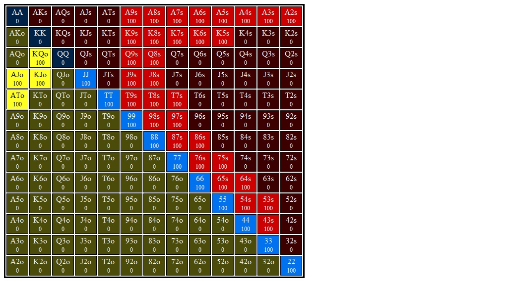

# Section 1: BB Calls LJ Open

Blinds are $0.05/$0.10. Effective stacks are $10.00. You're on the button and action folds to you. You open for $0.30 (3bb), SB folds, and BB calls. You go to the flop with $9.70 behind and a pot of $0.65, and BB checks to you.
### Player Ranges

#### Hero's Hijack Opening Range Range

#### Villain's Big Bling Calling Range vs Hijack Range

### Flop 1: <b>A&spades;T&diams;5&clubs;</b>

1. **Approximate each player's equity. Who has the equity advantage?**

    LJ: 55%, BB: 45%

2. **What are the weakest hands that could go all in on the flop? Go for three streets of value on blank turns?**

    AQ+ can get it in on the flop, though they are also happy seeing turns.
    2pairs also happy to get it in.

3. **Which player has the nuts advantage?**

    LJ has AA, TT, and a good chunk of 2pair (though BB also has as many 2pair,
    if not more, as LJ). 

4. **How static or dynamic is this flop? What aspects of this flop make it more static or dynamic?  How do these aspects interact with one another?**

    This is a very static flop.

5. **On this flop do you prefer to bet small or large?  With what frequencies would you check and bet?**

    In the LJ I want to bet small with range.

6. **Say you adopt a strategy where you either bet with your preferred sizing or check. You choose to bet and villain calls. What are the best and worst turn cards for your range?**

    + **Best Turns:** Any K, Q or J should be really good. Preferrably a heart,
      but that doesn't matter too much. I'm not sure about an A. This blocks
      a lot of our strongest holdings but also blocks a good chunk of their
      value calling range.

    + **Worst Turns:** We don't want to see a 5 or a T. The 5 is especially bad
      since it

#### Hands for flop A&spades;T&diams;5&clubs;
1. <b>7&hearts;7&diams;</b>    (Flop: A&spades;T&diams;5&clubs;)

    1. **If you bet this hand should you expect better hands to fold? If so, which hands?**

    2. **If you bet this hand should you expect worse hands to call? If so, which hands?**

    3. **Does this hand benefit from a protection bet? Explain.**

    4. **Does this hand benefit from growing the pot? How so?**

    5. **How is this hand doing if you bet and get called? What parts of villain's range are you ahead of? Behind?**

    6. **How is this hand doing against a check-raise?**

    7. **What are this hand's incentives on this flop? Does it want to bet or check? If it wants to bet, what sizing does it prefer? Do these incentives line up with the strategy you proposed for your range above?**

    8. **Suppose you take your preferred action from the last question (check or bet the preferred size). If this is a bet, suppose villain calls. What are the best and worst turn cards for this hand?**

2. <b>K&spades;J&clubs;</b>    (Flop: A&spades;T&diams;5&clubs;)

    1. **If you bet this hand should you expect better hands to fold? If so, which hands?**

    2. **If you bet this hand should you expect worse hands to call? If so, which hands?**

    3. **Does this hand benefit from a protection bet? Explain.**

    4. **Does this hand benefit from growing the pot? How so?**

    5. **How is this hand doing if you bet and get called? What parts of villain's range are you ahead of? Behind?**

    6. **How is this hand doing against a check-raise?**

    7. **What are this hand's incentives on this flop? Does it want to bet or check? If it wants to bet, what sizing does it prefer? Do these incentives line up with the strategy you proposed for your range above?**

    8. **Suppose you take your preferred action from the last question (check or bet the preferred size). If this is a bet, suppose villain calls. What are the best and worst turn cards for this hand?**

3. <b>J&hearts;T&hearts;</b>    (Flop: A&spades;T&diams;5&clubs;)

    1. **If you bet this hand should you expect better hands to fold? If so, which hands?**

    2. **If you bet this hand should you expect worse hands to call? If so, which hands?**

    3. **Does this hand benefit from a protection bet? Explain.**

    4. **Does this hand benefit from growing the pot? How so?**

    5. **How is this hand doing if you bet and get called? What parts of villain's range are you ahead of? Behind?**

    6. **How is this hand doing against a check-raise?**

    7. **What are this hand's incentives on this flop? Does it want to bet or check? If it wants to bet, what sizing does it prefer? Do these incentives line up with the strategy you proposed for your range above?**

    8. **Suppose you take your preferred action from the last question (check or bet the preferred size). If this is a bet, suppose villain calls. What are the best and worst turn cards for this hand?**

4. <b>K&hearts;9&hearts;</b>    (Flop: A&spades;T&diams;5&clubs;)

    1. **If you bet this hand should you expect better hands to fold? If so, which hands?**

    2. **If you bet this hand should you expect worse hands to call? If so, which hands?**

    3. **Does this hand benefit from a protection bet? Explain.**

    4. **Does this hand benefit from growing the pot? How so?**

    5. **How is this hand doing if you bet and get called? What parts of villain's range are you ahead of? Behind?**

    6. **How is this hand doing against a check-raise?**

    7. **What are this hand's incentives on this flop? Does it want to bet or check? If it wants to bet, what sizing does it prefer? Do these incentives line up with the strategy you proposed for your range above?**

    8. **Suppose you take your preferred action from the last question (check or bet the preferred size). If this is a bet, suppose villain calls. What are the best and worst turn cards for this hand?**

5. <b>A&hearts;T&hearts;</b>    (Flop: A&spades;T&diams;5&clubs;)

    1. **If you bet this hand should you expect better hands to fold? If so, which hands?**

    2. **If you bet this hand should you expect worse hands to call? If so, which hands?**

    3. **Does this hand benefit from a protection bet? Explain.**

    4. **Does this hand benefit from growing the pot? How so?**

    5. **How is this hand doing if you bet and get called? What parts of villain's range are you ahead of? Behind?**

    6. **How is this hand doing against a check-raise?**

    7. **What are this hand's incentives on this flop? Does it want to bet or check? If it wants to bet, what sizing does it prefer? Do these incentives line up with the strategy you proposed for your range above?**

    8. **Suppose you take your preferred action from the last question (check or bet the preferred size). If this is a bet, suppose villain calls. What are the best and worst turn cards for this hand?**

6. <b>K&spades;T&spades;</b>    (Flop: A&spades;T&diams;5&clubs;)

    1. **If you bet this hand should you expect better hands to fold? If so, which hands?**

    2. **If you bet this hand should you expect worse hands to call? If so, which hands?**

    3. **Does this hand benefit from a protection bet? Explain.**

    4. **Does this hand benefit from growing the pot? How so?**

    5. **How is this hand doing if you bet and get called? What parts of villain's range are you ahead of? Behind?**

    6. **How is this hand doing against a check-raise?**

    7. **What are this hand's incentives on this flop? Does it want to bet or check? If it wants to bet, what sizing does it prefer? Do these incentives line up with the strategy you proposed for your range above?**

    8. **Suppose you take your preferred action from the last question (check or bet the preferred size). If this is a bet, suppose villain calls. What are the best and worst turn cards for this hand?**

7. <b>9&diams;7&diams;</b>    (Flop: A&spades;T&diams;5&clubs;)

    1. **If you bet this hand should you expect better hands to fold? If so, which hands?**

    2. **If you bet this hand should you expect worse hands to call? If so, which hands?**

    3. **Does this hand benefit from a protection bet? Explain.**

    4. **Does this hand benefit from growing the pot? How so?**

    5. **How is this hand doing if you bet and get called? What parts of villain's range are you ahead of? Behind?**

    6. **How is this hand doing against a check-raise?**

    7. **What are this hand's incentives on this flop? Does it want to bet or check? If it wants to bet, what sizing does it prefer? Do these incentives line up with the strategy you proposed for your range above?**

    8. **Suppose you take your preferred action from the last question (check or bet the preferred size). If this is a bet, suppose villain calls. What are the best and worst turn cards for this hand?**

8. <b>4&hearts;4&diams;</b>    (Flop: A&spades;T&diams;5&clubs;)

    1. **If you bet this hand should you expect better hands to fold? If so, which hands?**

    2. **If you bet this hand should you expect worse hands to call? If so, which hands?**

    3. **Does this hand benefit from a protection bet? Explain.**

    4. **Does this hand benefit from growing the pot? How so?**

    5. **How is this hand doing if you bet and get called? What parts of villain's range are you ahead of? Behind?**

    6. **How is this hand doing against a check-raise?**

    7. **What are this hand's incentives on this flop? Does it want to bet or check? If it wants to bet, what sizing does it prefer? Do these incentives line up with the strategy you proposed for your range above?**

    8. **Suppose you take your preferred action from the last question (check or bet the preferred size). If this is a bet, suppose villain calls. What are the best and worst turn cards for this hand?**

9. <b>9&hearts;8&hearts;</b>    (Flop: A&spades;T&diams;5&clubs;)

    1. **If you bet this hand should you expect better hands to fold? If so, which hands?**

    2. **If you bet this hand should you expect worse hands to call? If so, which hands?**

    3. **Does this hand benefit from a protection bet? Explain.**

    4. **Does this hand benefit from growing the pot? How so?**

    5. **How is this hand doing if you bet and get called? What parts of villain's range are you ahead of? Behind?**

    6. **How is this hand doing against a check-raise?**

    7. **What are this hand's incentives on this flop? Does it want to bet or check? If it wants to bet, what sizing does it prefer? Do these incentives line up with the strategy you proposed for your range above?**

    8. **Suppose you take your preferred action from the last question (check or bet the preferred size). If this is a bet, suppose villain calls. What are the best and worst turn cards for this hand?**

10. <b>A&diams;K&diams;</b>    (Flop: A&spades;T&diams;5&clubs;)

    1. **If you bet this hand should you expect better hands to fold? If so, which hands?**

    2. **If you bet this hand should you expect worse hands to call? If so, which hands?**

    3. **Does this hand benefit from a protection bet? Explain.**

    4. **Does this hand benefit from growing the pot? How so?**

    5. **How is this hand doing if you bet and get called? What parts of villain's range are you ahead of? Behind?**

    6. **How is this hand doing against a check-raise?**

    7. **What are this hand's incentives on this flop? Does it want to bet or check? If it wants to bet, what sizing does it prefer? Do these incentives line up with the strategy you proposed for your range above?**

    8. **Suppose you take your preferred action from the last question (check or bet the preferred size). If this is a bet, suppose villain calls. What are the best and worst turn cards for this hand?**

### Flop 2: <b>T&spades;4&spades;2&spades;</b>
1. **Approximate each player's equity. Who has the equity advantage?**

2. **What are the weakest hands that could go all in on the flop? Go for three streets of value on blank turns?**

3. **Which player has the nuts advantage?**

4. **How static or dynamic is this flop? What aspects of this flop make it more static or dynamic?  How do these aspects interact with one another?**

5. **On this flop do you prefer to bet small or large?  With what frequencies would you check and bet?**

6. **Say you adopt a strategy where you either bet with your preferred sizing or check. You choose to bet and villain calls. What are the best and worst turn cards for your range?**

#### Hands for flop T&spades;4&spades;2&spades;
1. <b>T&clubs;9&clubs;</b>    (Flop: T&spades;4&spades;2&spades;)

    1. **If you bet this hand should you expect better hands to fold? If so, which hands?**

    2. **If you bet this hand should you expect worse hands to call? If so, which hands?**

    3. **Does this hand benefit from a protection bet? Explain.**

    4. **Does this hand benefit from growing the pot? How so?**

    5. **How is this hand doing if you bet and get called? What parts of villain's range are you ahead of? Behind?**

    6. **How is this hand doing against a check-raise?**

    7. **What are this hand's incentives on this flop? Does it want to bet or check? If it wants to bet, what sizing does it prefer? Do these incentives line up with the strategy you proposed for your range above?**

    8. **Suppose you take your preferred action from the last question (check or bet the preferred size). If this is a bet, suppose villain calls. What are the best and worst turn cards for this hand?**

2. <b>K&clubs;J&clubs;</b>    (Flop: T&spades;4&spades;2&spades;)

    1. **If you bet this hand should you expect better hands to fold? If so, which hands?**

    2. **If you bet this hand should you expect worse hands to call? If so, which hands?**

    3. **Does this hand benefit from a protection bet? Explain.**

    4. **Does this hand benefit from growing the pot? How so?**

    5. **How is this hand doing if you bet and get called? What parts of villain's range are you ahead of? Behind?**

    6. **How is this hand doing against a check-raise?**

    7. **What are this hand's incentives on this flop? Does it want to bet or check? If it wants to bet, what sizing does it prefer? Do these incentives line up with the strategy you proposed for your range above?**

    8. **Suppose you take your preferred action from the last question (check or bet the preferred size). If this is a bet, suppose villain calls. What are the best and worst turn cards for this hand?**

3. <b>T&diams;T&clubs;</b>    (Flop: T&spades;4&spades;2&spades;)

    1. **If you bet this hand should you expect better hands to fold? If so, which hands?**

    2. **If you bet this hand should you expect worse hands to call? If so, which hands?**

    3. **Does this hand benefit from a protection bet? Explain.**

    4. **Does this hand benefit from growing the pot? How so?**

    5. **How is this hand doing if you bet and get called? What parts of villain's range are you ahead of? Behind?**

    6. **How is this hand doing against a check-raise?**

    7. **What are this hand's incentives on this flop? Does it want to bet or check? If it wants to bet, what sizing does it prefer? Do these incentives line up with the strategy you proposed for your range above?**

    8. **Suppose you take your preferred action from the last question (check or bet the preferred size). If this is a bet, suppose villain calls. What are the best and worst turn cards for this hand?**

4. <b>K&clubs;Q&hearts;</b>    (Flop: T&spades;4&spades;2&spades;)

    1. **If you bet this hand should you expect better hands to fold? If so, which hands?**

    2. **If you bet this hand should you expect worse hands to call? If so, which hands?**

    3. **Does this hand benefit from a protection bet? Explain.**

    4. **Does this hand benefit from growing the pot? How so?**

    5. **How is this hand doing if you bet and get called? What parts of villain's range are you ahead of? Behind?**

    6. **How is this hand doing against a check-raise?**

    7. **What are this hand's incentives on this flop? Does it want to bet or check? If it wants to bet, what sizing does it prefer? Do these incentives line up with the strategy you proposed for your range above?**

    8. **Suppose you take your preferred action from the last question (check or bet the preferred size). If this is a bet, suppose villain calls. What are the best and worst turn cards for this hand?**

5. <b>9&spades;7&spades;</b>    (Flop: T&spades;4&spades;2&spades;)

    1. **If you bet this hand should you expect better hands to fold? If so, which hands?**

    2. **If you bet this hand should you expect worse hands to call? If so, which hands?**

    3. **Does this hand benefit from a protection bet? Explain.**

    4. **Does this hand benefit from growing the pot? How so?**

    5. **How is this hand doing if you bet and get called? What parts of villain's range are you ahead of? Behind?**

    6. **How is this hand doing against a check-raise?**

    7. **What are this hand's incentives on this flop? Does it want to bet or check? If it wants to bet, what sizing does it prefer? Do these incentives line up with the strategy you proposed for your range above?**

    8. **Suppose you take your preferred action from the last question (check or bet the preferred size). If this is a bet, suppose villain calls. What are the best and worst turn cards for this hand?**

6. <b>5&hearts;5&diams;</b>    (Flop: T&spades;4&spades;2&spades;)

    1. **If you bet this hand should you expect better hands to fold? If so, which hands?**

    2. **If you bet this hand should you expect worse hands to call? If so, which hands?**

    3. **Does this hand benefit from a protection bet? Explain.**

    4. **Does this hand benefit from growing the pot? How so?**

    5. **How is this hand doing if you bet and get called? What parts of villain's range are you ahead of? Behind?**

    6. **How is this hand doing against a check-raise?**

    7. **What are this hand's incentives on this flop? Does it want to bet or check? If it wants to bet, what sizing does it prefer? Do these incentives line up with the strategy you proposed for your range above?**

    8. **Suppose you take your preferred action from the last question (check or bet the preferred size). If this is a bet, suppose villain calls. What are the best and worst turn cards for this hand?**

7. <b>A&hearts;3&hearts;</b>    (Flop: T&spades;4&spades;2&spades;)

    1. **If you bet this hand should you expect better hands to fold? If so, which hands?**

    2. **If you bet this hand should you expect worse hands to call? If so, which hands?**

    3. **Does this hand benefit from a protection bet? Explain.**

    4. **Does this hand benefit from growing the pot? How so?**

    5. **How is this hand doing if you bet and get called? What parts of villain's range are you ahead of? Behind?**

    6. **How is this hand doing against a check-raise?**

    7. **What are this hand's incentives on this flop? Does it want to bet or check? If it wants to bet, what sizing does it prefer? Do these incentives line up with the strategy you proposed for your range above?**

    8. **Suppose you take your preferred action from the last question (check or bet the preferred size). If this is a bet, suppose villain calls. What are the best and worst turn cards for this hand?**

8. <b>A&hearts;T&diams;</b>    (Flop: T&spades;4&spades;2&spades;)

    1. **If you bet this hand should you expect better hands to fold? If so, which hands?**

    2. **If you bet this hand should you expect worse hands to call? If so, which hands?**

    3. **Does this hand benefit from a protection bet? Explain.**

    4. **Does this hand benefit from growing the pot? How so?**

    5. **How is this hand doing if you bet and get called? What parts of villain's range are you ahead of? Behind?**

    6. **How is this hand doing against a check-raise?**

    7. **What are this hand's incentives on this flop? Does it want to bet or check? If it wants to bet, what sizing does it prefer? Do these incentives line up with the strategy you proposed for your range above?**

    8. **Suppose you take your preferred action from the last question (check or bet the preferred size). If this is a bet, suppose villain calls. What are the best and worst turn cards for this hand?**

9. <b>K&hearts;K&clubs;</b>    (Flop: T&spades;4&spades;2&spades;)

    1. **If you bet this hand should you expect better hands to fold? If so, which hands?**

    2. **If you bet this hand should you expect worse hands to call? If so, which hands?**

    3. **Does this hand benefit from a protection bet? Explain.**

    4. **Does this hand benefit from growing the pot? How so?**

    5. **How is this hand doing if you bet and get called? What parts of villain's range are you ahead of? Behind?**

    6. **How is this hand doing against a check-raise?**

    7. **What are this hand's incentives on this flop? Does it want to bet or check? If it wants to bet, what sizing does it prefer? Do these incentives line up with the strategy you proposed for your range above?**

    8. **Suppose you take your preferred action from the last question (check or bet the preferred size). If this is a bet, suppose villain calls. What are the best and worst turn cards for this hand?**

10. <b>K&hearts;Q&hearts;</b>    (Flop: T&spades;4&spades;2&spades;)

    1. **If you bet this hand should you expect better hands to fold? If so, which hands?**

    2. **If you bet this hand should you expect worse hands to call? If so, which hands?**

    3. **Does this hand benefit from a protection bet? Explain.**

    4. **Does this hand benefit from growing the pot? How so?**

    5. **How is this hand doing if you bet and get called? What parts of villain's range are you ahead of? Behind?**

    6. **How is this hand doing against a check-raise?**

    7. **What are this hand's incentives on this flop? Does it want to bet or check? If it wants to bet, what sizing does it prefer? Do these incentives line up with the strategy you proposed for your range above?**

    8. **Suppose you take your preferred action from the last question (check or bet the preferred size). If this is a bet, suppose villain calls. What are the best and worst turn cards for this hand?**

### Flop 3: <b>7&spades;6&spades;6&diams;</b>
1. **Approximate each player's equity. Who has the equity advantage?**

2. **What are the weakest hands that could go all in on the flop? Go for three streets of value on blank turns?**

3. **Which player has the nuts advantage?**

4. **How static or dynamic is this flop? What aspects of this flop make it more static or dynamic?  How do these aspects interact with one another?**

5. **On this flop do you prefer to bet small or large?  With what frequencies would you check and bet?**

6. **Say you adopt a strategy where you either bet with your preferred sizing or check. You choose to bet and villain calls. What are the best and worst turn cards for your range?**

#### Hands for flop 7&spades;6&spades;6&diams;
1. <b>Q&hearts;T&hearts;</b>    (Flop: 7&spades;6&spades;6&diams;)

    1. **If you bet this hand should you expect better hands to fold? If so, which hands?**

    2. **If you bet this hand should you expect worse hands to call? If so, which hands?**

    3. **Does this hand benefit from a protection bet? Explain.**

    4. **Does this hand benefit from growing the pot? How so?**

    5. **How is this hand doing if you bet and get called? What parts of villain's range are you ahead of? Behind?**

    6. **How is this hand doing against a check-raise?**

    7. **What are this hand's incentives on this flop? Does it want to bet or check? If it wants to bet, what sizing does it prefer? Do these incentives line up with the strategy you proposed for your range above?**

    8. **Suppose you take your preferred action from the last question (check or bet the preferred size). If this is a bet, suppose villain calls. What are the best and worst turn cards for this hand?**

2. <b>A&spades;9&spades;</b>    (Flop: 7&spades;6&spades;6&diams;)

    1. **If you bet this hand should you expect better hands to fold? If so, which hands?**

    2. **If you bet this hand should you expect worse hands to call? If so, which hands?**

    3. **Does this hand benefit from a protection bet? Explain.**

    4. **Does this hand benefit from growing the pot? How so?**

    5. **How is this hand doing if you bet and get called? What parts of villain's range are you ahead of? Behind?**

    6. **How is this hand doing against a check-raise?**

    7. **What are this hand's incentives on this flop? Does it want to bet or check? If it wants to bet, what sizing does it prefer? Do these incentives line up with the strategy you proposed for your range above?**

    8. **Suppose you take your preferred action from the last question (check or bet the preferred size). If this is a bet, suppose villain calls. What are the best and worst turn cards for this hand?**

3. <b>5&spades;5&diams;</b>    (Flop: 7&spades;6&spades;6&diams;)

    1. **If you bet this hand should you expect better hands to fold? If so, which hands?**

    2. **If you bet this hand should you expect worse hands to call? If so, which hands?**

    3. **Does this hand benefit from a protection bet? Explain.**

    4. **Does this hand benefit from growing the pot? How so?**

    5. **How is this hand doing if you bet and get called? What parts of villain's range are you ahead of? Behind?**

    6. **How is this hand doing against a check-raise?**

    7. **What are this hand's incentives on this flop? Does it want to bet or check? If it wants to bet, what sizing does it prefer? Do these incentives line up with the strategy you proposed for your range above?**

    8. **Suppose you take your preferred action from the last question (check or bet the preferred size). If this is a bet, suppose villain calls. What are the best and worst turn cards for this hand?**

4. <b>A&hearts;J&clubs;</b>    (Flop: 7&spades;6&spades;6&diams;)

    1. **If you bet this hand should you expect better hands to fold? If so, which hands?**

    2. **If you bet this hand should you expect worse hands to call? If so, which hands?**

    3. **Does this hand benefit from a protection bet? Explain.**

    4. **Does this hand benefit from growing the pot? How so?**

    5. **How is this hand doing if you bet and get called? What parts of villain's range are you ahead of? Behind?**

    6. **How is this hand doing against a check-raise?**

    7. **What are this hand's incentives on this flop? Does it want to bet or check? If it wants to bet, what sizing does it prefer? Do these incentives line up with the strategy you proposed for your range above?**

    8. **Suppose you take your preferred action from the last question (check or bet the preferred size). If this is a bet, suppose villain calls. What are the best and worst turn cards for this hand?**

5. <b>A&diams;4&diams;</b>    (Flop: 7&spades;6&spades;6&diams;)

    1. **If you bet this hand should you expect better hands to fold? If so, which hands?**

    2. **If you bet this hand should you expect worse hands to call? If so, which hands?**

    3. **Does this hand benefit from a protection bet? Explain.**

    4. **Does this hand benefit from growing the pot? How so?**

    5. **How is this hand doing if you bet and get called? What parts of villain's range are you ahead of? Behind?**

    6. **How is this hand doing against a check-raise?**

    7. **What are this hand's incentives on this flop? Does it want to bet or check? If it wants to bet, what sizing does it prefer? Do these incentives line up with the strategy you proposed for your range above?**

    8. **Suppose you take your preferred action from the last question (check or bet the preferred size). If this is a bet, suppose villain calls. What are the best and worst turn cards for this hand?**

6. <b>K&clubs;Q&clubs;</b>    (Flop: 7&spades;6&spades;6&diams;)

    1. **If you bet this hand should you expect better hands to fold? If so, which hands?**

    2. **If you bet this hand should you expect worse hands to call? If so, which hands?**

    3. **Does this hand benefit from a protection bet? Explain.**

    4. **Does this hand benefit from growing the pot? How so?**

    5. **How is this hand doing if you bet and get called? What parts of villain's range are you ahead of? Behind?**

    6. **How is this hand doing against a check-raise?**

    7. **What are this hand's incentives on this flop? Does it want to bet or check? If it wants to bet, what sizing does it prefer? Do these incentives line up with the strategy you proposed for your range above?**

    8. **Suppose you take your preferred action from the last question (check or bet the preferred size). If this is a bet, suppose villain calls. What are the best and worst turn cards for this hand?**

7. <b>7&hearts;6&hearts;</b>    (Flop: 7&spades;6&spades;6&diams;)

    1. **If you bet this hand should you expect better hands to fold? If so, which hands?**

    2. **If you bet this hand should you expect worse hands to call? If so, which hands?**

    3. **Does this hand benefit from a protection bet? Explain.**

    4. **Does this hand benefit from growing the pot? How so?**

    5. **How is this hand doing if you bet and get called? What parts of villain's range are you ahead of? Behind?**

    6. **How is this hand doing against a check-raise?**

    7. **What are this hand's incentives on this flop? Does it want to bet or check? If it wants to bet, what sizing does it prefer? Do these incentives line up with the strategy you proposed for your range above?**

    8. **Suppose you take your preferred action from the last question (check or bet the preferred size). If this is a bet, suppose villain calls. What are the best and worst turn cards for this hand?**

8. <b>T&spades;9&spades;</b>    (Flop: 7&spades;6&spades;6&diams;)

    1. **If you bet this hand should you expect better hands to fold? If so, which hands?**

    2. **If you bet this hand should you expect worse hands to call? If so, which hands?**

    3. **Does this hand benefit from a protection bet? Explain.**

    4. **Does this hand benefit from growing the pot? How so?**

    5. **How is this hand doing if you bet and get called? What parts of villain's range are you ahead of? Behind?**

    6. **How is this hand doing against a check-raise?**

    7. **What are this hand's incentives on this flop? Does it want to bet or check? If it wants to bet, what sizing does it prefer? Do these incentives line up with the strategy you proposed for your range above?**

    8. **Suppose you take your preferred action from the last question (check or bet the preferred size). If this is a bet, suppose villain calls. What are the best and worst turn cards for this hand?**

9. <b>J&clubs;9&clubs;</b>    (Flop: 7&spades;6&spades;6&diams;)

    1. **If you bet this hand should you expect better hands to fold? If so, which hands?**

    2. **If you bet this hand should you expect worse hands to call? If so, which hands?**

    3. **Does this hand benefit from a protection bet? Explain.**

    4. **Does this hand benefit from growing the pot? How so?**

    5. **How is this hand doing if you bet and get called? What parts of villain's range are you ahead of? Behind?**

    6. **How is this hand doing against a check-raise?**

    7. **What are this hand's incentives on this flop? Does it want to bet or check? If it wants to bet, what sizing does it prefer? Do these incentives line up with the strategy you proposed for your range above?**

    8. **Suppose you take your preferred action from the last question (check or bet the preferred size). If this is a bet, suppose villain calls. What are the best and worst turn cards for this hand?**

10. <b>A&spades;J&spades;</b>    (Flop: 7&spades;6&spades;6&diams;)

    1. **If you bet this hand should you expect better hands to fold? If so, which hands?**

    2. **If you bet this hand should you expect worse hands to call? If so, which hands?**

    3. **Does this hand benefit from a protection bet? Explain.**

    4. **Does this hand benefit from growing the pot? How so?**

    5. **How is this hand doing if you bet and get called? What parts of villain's range are you ahead of? Behind?**

    6. **How is this hand doing against a check-raise?**

    7. **What are this hand's incentives on this flop? Does it want to bet or check? If it wants to bet, what sizing does it prefer? Do these incentives line up with the strategy you proposed for your range above?**

    8. **Suppose you take your preferred action from the last question (check or bet the preferred size). If this is a bet, suppose villain calls. What are the best and worst turn cards for this hand?**

### Flop 4: <b>Q&spades;8&diams;6&spades;</b>
1. **Approximate each player's equity. Who has the equity advantage?**

2. **What are the weakest hands that could go all in on the flop? Go for three streets of value on blank turns?**

3. **Which player has the nuts advantage?**

4. **How static or dynamic is this flop? What aspects of this flop make it more static or dynamic?  How do these aspects interact with one another?**

5. **On this flop do you prefer to bet small or large?  With what frequencies would you check and bet?**

6. **Say you adopt a strategy where you either bet with your preferred sizing or check. You choose to bet and villain calls. What are the best and worst turn cards for your range?**

#### Hands for flop Q&spades;8&diams;6&spades;
1. <b>A&diams;T&diams;</b>    (Flop: Q&spades;8&diams;6&spades;)

    1. **If you bet this hand should you expect better hands to fold? If so, which hands?**

    2. **If you bet this hand should you expect worse hands to call? If so, which hands?**

    3. **Does this hand benefit from a protection bet? Explain.**

    4. **Does this hand benefit from growing the pot? How so?**

    5. **How is this hand doing if you bet and get called? What parts of villain's range are you ahead of? Behind?**

    6. **How is this hand doing against a check-raise?**

    7. **What are this hand's incentives on this flop? Does it want to bet or check? If it wants to bet, what sizing does it prefer? Do these incentives line up with the strategy you proposed for your range above?**

    8. **Suppose you take your preferred action from the last question (check or bet the preferred size). If this is a bet, suppose villain calls. What are the best and worst turn cards for this hand?**

2. <b>A&clubs;7&clubs;</b>    (Flop: Q&spades;8&diams;6&spades;)

    1. **If you bet this hand should you expect better hands to fold? If so, which hands?**

    2. **If you bet this hand should you expect worse hands to call? If so, which hands?**

    3. **Does this hand benefit from a protection bet? Explain.**

    4. **Does this hand benefit from growing the pot? How so?**

    5. **How is this hand doing if you bet and get called? What parts of villain's range are you ahead of? Behind?**

    6. **How is this hand doing against a check-raise?**

    7. **What are this hand's incentives on this flop? Does it want to bet or check? If it wants to bet, what sizing does it prefer? Do these incentives line up with the strategy you proposed for your range above?**

    8. **Suppose you take your preferred action from the last question (check or bet the preferred size). If this is a bet, suppose villain calls. What are the best and worst turn cards for this hand?**

3. <b>9&hearts;7&hearts;</b>    (Flop: Q&spades;8&diams;6&spades;)

    1. **If you bet this hand should you expect better hands to fold? If so, which hands?**

    2. **If you bet this hand should you expect worse hands to call? If so, which hands?**

    3. **Does this hand benefit from a protection bet? Explain.**

    4. **Does this hand benefit from growing the pot? How so?**

    5. **How is this hand doing if you bet and get called? What parts of villain's range are you ahead of? Behind?**

    6. **How is this hand doing against a check-raise?**

    7. **What are this hand's incentives on this flop? Does it want to bet or check? If it wants to bet, what sizing does it prefer? Do these incentives line up with the strategy you proposed for your range above?**

    8. **Suppose you take your preferred action from the last question (check or bet the preferred size). If this is a bet, suppose villain calls. What are the best and worst turn cards for this hand?**

4. <b>7&clubs;6&clubs;</b>    (Flop: Q&spades;8&diams;6&spades;)

    1. **If you bet this hand should you expect better hands to fold? If so, which hands?**

    2. **If you bet this hand should you expect worse hands to call? If so, which hands?**

    3. **Does this hand benefit from a protection bet? Explain.**

    4. **Does this hand benefit from growing the pot? How so?**

    5. **How is this hand doing if you bet and get called? What parts of villain's range are you ahead of? Behind?**

    6. **How is this hand doing against a check-raise?**

    7. **What are this hand's incentives on this flop? Does it want to bet or check? If it wants to bet, what sizing does it prefer? Do these incentives line up with the strategy you proposed for your range above?**

    8. **Suppose you take your preferred action from the last question (check or bet the preferred size). If this is a bet, suppose villain calls. What are the best and worst turn cards for this hand?**

5. <b>K&spades;K&clubs;</b>    (Flop: Q&spades;8&diams;6&spades;)

    1. **If you bet this hand should you expect better hands to fold? If so, which hands?**

    2. **If you bet this hand should you expect worse hands to call? If so, which hands?**

    3. **Does this hand benefit from a protection bet? Explain.**

    4. **Does this hand benefit from growing the pot? How so?**

    5. **How is this hand doing if you bet and get called? What parts of villain's range are you ahead of? Behind?**

    6. **How is this hand doing against a check-raise?**

    7. **What are this hand's incentives on this flop? Does it want to bet or check? If it wants to bet, what sizing does it prefer? Do these incentives line up with the strategy you proposed for your range above?**

    8. **Suppose you take your preferred action from the last question (check or bet the preferred size). If this is a bet, suppose villain calls. What are the best and worst turn cards for this hand?**

6. <b>6&diams;5&diams;</b>    (Flop: Q&spades;8&diams;6&spades;)

    1. **If you bet this hand should you expect better hands to fold? If so, which hands?**

    2. **If you bet this hand should you expect worse hands to call? If so, which hands?**

    3. **Does this hand benefit from a protection bet? Explain.**

    4. **Does this hand benefit from growing the pot? How so?**

    5. **How is this hand doing if you bet and get called? What parts of villain's range are you ahead of? Behind?**

    6. **How is this hand doing against a check-raise?**

    7. **What are this hand's incentives on this flop? Does it want to bet or check? If it wants to bet, what sizing does it prefer? Do these incentives line up with the strategy you proposed for your range above?**

    8. **Suppose you take your preferred action from the last question (check or bet the preferred size). If this is a bet, suppose villain calls. What are the best and worst turn cards for this hand?**

7. <b>A&spades;A&clubs;</b>    (Flop: Q&spades;8&diams;6&spades;)

    1. **If you bet this hand should you expect better hands to fold? If so, which hands?**

    2. **If you bet this hand should you expect worse hands to call? If so, which hands?**

    3. **Does this hand benefit from a protection bet? Explain.**

    4. **Does this hand benefit from growing the pot? How so?**

    5. **How is this hand doing if you bet and get called? What parts of villain's range are you ahead of? Behind?**

    6. **How is this hand doing against a check-raise?**

    7. **What are this hand's incentives on this flop? Does it want to bet or check? If it wants to bet, what sizing does it prefer? Do these incentives line up with the strategy you proposed for your range above?**

    8. **Suppose you take your preferred action from the last question (check or bet the preferred size). If this is a bet, suppose villain calls. What are the best and worst turn cards for this hand?**

8. <b>8&spades;7&spades;</b>    (Flop: Q&spades;8&diams;6&spades;)

    1. **If you bet this hand should you expect better hands to fold? If so, which hands?**

    2. **If you bet this hand should you expect worse hands to call? If so, which hands?**

    3. **Does this hand benefit from a protection bet? Explain.**

    4. **Does this hand benefit from growing the pot? How so?**

    5. **How is this hand doing if you bet and get called? What parts of villain's range are you ahead of? Behind?**

    6. **How is this hand doing against a check-raise?**

    7. **What are this hand's incentives on this flop? Does it want to bet or check? If it wants to bet, what sizing does it prefer? Do these incentives line up with the strategy you proposed for your range above?**

    8. **Suppose you take your preferred action from the last question (check or bet the preferred size). If this is a bet, suppose villain calls. What are the best and worst turn cards for this hand?**

9. <b>Q&hearts;Q&diams;</b>    (Flop: Q&spades;8&diams;6&spades;)

    1. **If you bet this hand should you expect better hands to fold? If so, which hands?**

    2. **If you bet this hand should you expect worse hands to call? If so, which hands?**

    3. **Does this hand benefit from a protection bet? Explain.**

    4. **Does this hand benefit from growing the pot? How so?**

    5. **How is this hand doing if you bet and get called? What parts of villain's range are you ahead of? Behind?**

    6. **How is this hand doing against a check-raise?**

    7. **What are this hand's incentives on this flop? Does it want to bet or check? If it wants to bet, what sizing does it prefer? Do these incentives line up with the strategy you proposed for your range above?**

    8. **Suppose you take your preferred action from the last question (check or bet the preferred size). If this is a bet, suppose villain calls. What are the best and worst turn cards for this hand?**

10. <b>A&diams;5&diams;</b>    (Flop: Q&spades;8&diams;6&spades;)

    1. **If you bet this hand should you expect better hands to fold? If so, which hands?**

    2. **If you bet this hand should you expect worse hands to call? If so, which hands?**

    3. **Does this hand benefit from a protection bet? Explain.**

    4. **Does this hand benefit from growing the pot? How so?**

    5. **How is this hand doing if you bet and get called? What parts of villain's range are you ahead of? Behind?**

    6. **How is this hand doing against a check-raise?**

    7. **What are this hand's incentives on this flop? Does it want to bet or check? If it wants to bet, what sizing does it prefer? Do these incentives line up with the strategy you proposed for your range above?**

    8. **Suppose you take your preferred action from the last question (check or bet the preferred size). If this is a bet, suppose villain calls. What are the best and worst turn cards for this hand?**

### Flop 5: <b>8&spades;5&diams;3&diams;</b>
1. **Approximate each player's equity. Who has the equity advantage?**

2. **What are the weakest hands that could go all in on the flop? Go for three streets of value on blank turns?**

3. **Which player has the nuts advantage?**

4. **How static or dynamic is this flop? What aspects of this flop make it more static or dynamic?  How do these aspects interact with one another?**

5. **On this flop do you prefer to bet small or large?  With what frequencies would you check and bet?**

6. **Say you adopt a strategy where you either bet with your preferred sizing or check. You choose to bet and villain calls. What are the best and worst turn cards for your range?**

#### Hands for flop 8&spades;5&diams;3&diams;
1. <b>A&clubs;K&spades;</b>    (Flop: 8&spades;5&diams;3&diams;)

    1. **If you bet this hand should you expect better hands to fold? If so, which hands?**

    2. **If you bet this hand should you expect worse hands to call? If so, which hands?**

    3. **Does this hand benefit from a protection bet? Explain.**

    4. **Does this hand benefit from growing the pot? How so?**

    5. **How is this hand doing if you bet and get called? What parts of villain's range are you ahead of? Behind?**

    6. **How is this hand doing against a check-raise?**

    7. **What are this hand's incentives on this flop? Does it want to bet or check? If it wants to bet, what sizing does it prefer? Do these incentives line up with the strategy you proposed for your range above?**

    8. **Suppose you take your preferred action from the last question (check or bet the preferred size). If this is a bet, suppose villain calls. What are the best and worst turn cards for this hand?**

2. <b>8&diams;7&diams;</b>    (Flop: 8&spades;5&diams;3&diams;)

    1. **If you bet this hand should you expect better hands to fold? If so, which hands?**

    2. **If you bet this hand should you expect worse hands to call? If so, which hands?**

    3. **Does this hand benefit from a protection bet? Explain.**

    4. **Does this hand benefit from growing the pot? How so?**

    5. **How is this hand doing if you bet and get called? What parts of villain's range are you ahead of? Behind?**

    6. **How is this hand doing against a check-raise?**

    7. **What are this hand's incentives on this flop? Does it want to bet or check? If it wants to bet, what sizing does it prefer? Do these incentives line up with the strategy you proposed for your range above?**

    8. **Suppose you take your preferred action from the last question (check or bet the preferred size). If this is a bet, suppose villain calls. What are the best and worst turn cards for this hand?**

3. <b>A&hearts;T&hearts;</b>    (Flop: 8&spades;5&diams;3&diams;)

    1. **If you bet this hand should you expect better hands to fold? If so, which hands?**

    2. **If you bet this hand should you expect worse hands to call? If so, which hands?**

    3. **Does this hand benefit from a protection bet? Explain.**

    4. **Does this hand benefit from growing the pot? How so?**

    5. **How is this hand doing if you bet and get called? What parts of villain's range are you ahead of? Behind?**

    6. **How is this hand doing against a check-raise?**

    7. **What are this hand's incentives on this flop? Does it want to bet or check? If it wants to bet, what sizing does it prefer? Do these incentives line up with the strategy you proposed for your range above?**

    8. **Suppose you take your preferred action from the last question (check or bet the preferred size). If this is a bet, suppose villain calls. What are the best and worst turn cards for this hand?**

4. <b>K&diams;J&diams;</b>    (Flop: 8&spades;5&diams;3&diams;)

    1. **If you bet this hand should you expect better hands to fold? If so, which hands?**

    2. **If you bet this hand should you expect worse hands to call? If so, which hands?**

    3. **Does this hand benefit from a protection bet? Explain.**

    4. **Does this hand benefit from growing the pot? How so?**

    5. **How is this hand doing if you bet and get called? What parts of villain's range are you ahead of? Behind?**

    6. **How is this hand doing against a check-raise?**

    7. **What are this hand's incentives on this flop? Does it want to bet or check? If it wants to bet, what sizing does it prefer? Do these incentives line up with the strategy you proposed for your range above?**

    8. **Suppose you take your preferred action from the last question (check or bet the preferred size). If this is a bet, suppose villain calls. What are the best and worst turn cards for this hand?**

5. <b>9&hearts;9&diams;</b>    (Flop: 8&spades;5&diams;3&diams;)

    1. **If you bet this hand should you expect better hands to fold? If so, which hands?**

    2. **If you bet this hand should you expect worse hands to call? If so, which hands?**

    3. **Does this hand benefit from a protection bet? Explain.**

    4. **Does this hand benefit from growing the pot? How so?**

    5. **How is this hand doing if you bet and get called? What parts of villain's range are you ahead of? Behind?**

    6. **How is this hand doing against a check-raise?**

    7. **What are this hand's incentives on this flop? Does it want to bet or check? If it wants to bet, what sizing does it prefer? Do these incentives line up with the strategy you proposed for your range above?**

    8. **Suppose you take your preferred action from the last question (check or bet the preferred size). If this is a bet, suppose villain calls. What are the best and worst turn cards for this hand?**

6. <b>K&clubs;9&clubs;</b>    (Flop: 8&spades;5&diams;3&diams;)

    1. **If you bet this hand should you expect better hands to fold? If so, which hands?**

    2. **If you bet this hand should you expect worse hands to call? If so, which hands?**

    3. **Does this hand benefit from a protection bet? Explain.**

    4. **Does this hand benefit from growing the pot? How so?**

    5. **How is this hand doing if you bet and get called? What parts of villain's range are you ahead of? Behind?**

    6. **How is this hand doing against a check-raise?**

    7. **What are this hand's incentives on this flop? Does it want to bet or check? If it wants to bet, what sizing does it prefer? Do these incentives line up with the strategy you proposed for your range above?**

    8. **Suppose you take your preferred action from the last question (check or bet the preferred size). If this is a bet, suppose villain calls. What are the best and worst turn cards for this hand?**

7. <b>6&hearts;6&spades;</b>    (Flop: 8&spades;5&diams;3&diams;)

    1. **If you bet this hand should you expect better hands to fold? If so, which hands?**

    2. **If you bet this hand should you expect worse hands to call? If so, which hands?**

    3. **Does this hand benefit from a protection bet? Explain.**

    4. **Does this hand benefit from growing the pot? How so?**

    5. **How is this hand doing if you bet and get called? What parts of villain's range are you ahead of? Behind?**

    6. **How is this hand doing against a check-raise?**

    7. **What are this hand's incentives on this flop? Does it want to bet or check? If it wants to bet, what sizing does it prefer? Do these incentives line up with the strategy you proposed for your range above?**

    8. **Suppose you take your preferred action from the last question (check or bet the preferred size). If this is a bet, suppose villain calls. What are the best and worst turn cards for this hand?**

8. <b>K&spades;J&hearts;</b>    (Flop: 8&spades;5&diams;3&diams;)

    1. **If you bet this hand should you expect better hands to fold? If so, which hands?**

    2. **If you bet this hand should you expect worse hands to call? If so, which hands?**

    3. **Does this hand benefit from a protection bet? Explain.**

    4. **Does this hand benefit from growing the pot? How so?**

    5. **How is this hand doing if you bet and get called? What parts of villain's range are you ahead of? Behind?**

    6. **How is this hand doing against a check-raise?**

    7. **What are this hand's incentives on this flop? Does it want to bet or check? If it wants to bet, what sizing does it prefer? Do these incentives line up with the strategy you proposed for your range above?**

    8. **Suppose you take your preferred action from the last question (check or bet the preferred size). If this is a bet, suppose villain calls. What are the best and worst turn cards for this hand?**

9. <b>K&hearts;K&spades;</b>    (Flop: 8&spades;5&diams;3&diams;)

    1. **If you bet this hand should you expect better hands to fold? If so, which hands?**

    2. **If you bet this hand should you expect worse hands to call? If so, which hands?**

    3. **Does this hand benefit from a protection bet? Explain.**

    4. **Does this hand benefit from growing the pot? How so?**

    5. **How is this hand doing if you bet and get called? What parts of villain's range are you ahead of? Behind?**

    6. **How is this hand doing against a check-raise?**

    7. **What are this hand's incentives on this flop? Does it want to bet or check? If it wants to bet, what sizing does it prefer? Do these incentives line up with the strategy you proposed for your range above?**

    8. **Suppose you take your preferred action from the last question (check or bet the preferred size). If this is a bet, suppose villain calls. What are the best and worst turn cards for this hand?**

10. <b>K&clubs;8&clubs;</b>    (Flop: 8&spades;5&diams;3&diams;)

    1. **If you bet this hand should you expect better hands to fold? If so, which hands?**

    2. **If you bet this hand should you expect worse hands to call? If so, which hands?**

    3. **Does this hand benefit from a protection bet? Explain.**

    4. **Does this hand benefit from growing the pot? How so?**

    5. **How is this hand doing if you bet and get called? What parts of villain's range are you ahead of? Behind?**

    6. **How is this hand doing against a check-raise?**

    7. **What are this hand's incentives on this flop? Does it want to bet or check? If it wants to bet, what sizing does it prefer? Do these incentives line up with the strategy you proposed for your range above?**

    8. **Suppose you take your preferred action from the last question (check or bet the preferred size). If this is a bet, suppose villain calls. What are the best and worst turn cards for this hand?**

### Flop 6: <b>K&spades;5&diams;2&spades;</b>
1. **Approximate each player's equity. Who has the equity advantage?**

2. **What are the weakest hands that could go all in on the flop? Go for three streets of value on blank turns?**

3. **Which player has the nuts advantage?**

4. **How static or dynamic is this flop? What aspects of this flop make it more static or dynamic?  How do these aspects interact with one another?**

5. **On this flop do you prefer to bet small or large?  With what frequencies would you check and bet?**

6. **Say you adopt a strategy where you either bet with your preferred sizing or check. You choose to bet and villain calls. What are the best and worst turn cards for your range?**

#### Hands for flop K&spades;5&diams;2&spades;
1. <b>K&diams;8&diams;</b>    (Flop: K&spades;5&diams;2&spades;)

    1. **If you bet this hand should you expect better hands to fold? If so, which hands?**

    2. **If you bet this hand should you expect worse hands to call? If so, which hands?**

    3. **Does this hand benefit from a protection bet? Explain.**

    4. **Does this hand benefit from growing the pot? How so?**

    5. **How is this hand doing if you bet and get called? What parts of villain's range are you ahead of? Behind?**

    6. **How is this hand doing against a check-raise?**

    7. **What are this hand's incentives on this flop? Does it want to bet or check? If it wants to bet, what sizing does it prefer? Do these incentives line up with the strategy you proposed for your range above?**

    8. **Suppose you take your preferred action from the last question (check or bet the preferred size). If this is a bet, suppose villain calls. What are the best and worst turn cards for this hand?**

2. <b>A&hearts;6&hearts;</b>    (Flop: K&spades;5&diams;2&spades;)

    1. **If you bet this hand should you expect better hands to fold? If so, which hands?**

    2. **If you bet this hand should you expect worse hands to call? If so, which hands?**

    3. **Does this hand benefit from a protection bet? Explain.**

    4. **Does this hand benefit from growing the pot? How so?**

    5. **How is this hand doing if you bet and get called? What parts of villain's range are you ahead of? Behind?**

    6. **How is this hand doing against a check-raise?**

    7. **What are this hand's incentives on this flop? Does it want to bet or check? If it wants to bet, what sizing does it prefer? Do these incentives line up with the strategy you proposed for your range above?**

    8. **Suppose you take your preferred action from the last question (check or bet the preferred size). If this is a bet, suppose villain calls. What are the best and worst turn cards for this hand?**

3. <b>A&spades;J&diams;</b>    (Flop: K&spades;5&diams;2&spades;)

    1. **If you bet this hand should you expect better hands to fold? If so, which hands?**

    2. **If you bet this hand should you expect worse hands to call? If so, which hands?**

    3. **Does this hand benefit from a protection bet? Explain.**

    4. **Does this hand benefit from growing the pot? How so?**

    5. **How is this hand doing if you bet and get called? What parts of villain's range are you ahead of? Behind?**

    6. **How is this hand doing against a check-raise?**

    7. **What are this hand's incentives on this flop? Does it want to bet or check? If it wants to bet, what sizing does it prefer? Do these incentives line up with the strategy you proposed for your range above?**

    8. **Suppose you take your preferred action from the last question (check or bet the preferred size). If this is a bet, suppose villain calls. What are the best and worst turn cards for this hand?**

4. <b>7&hearts;7&spades;</b>    (Flop: K&spades;5&diams;2&spades;)

    1. **If you bet this hand should you expect better hands to fold? If so, which hands?**

    2. **If you bet this hand should you expect worse hands to call? If so, which hands?**

    3. **Does this hand benefit from a protection bet? Explain.**

    4. **Does this hand benefit from growing the pot? How so?**

    5. **How is this hand doing if you bet and get called? What parts of villain's range are you ahead of? Behind?**

    6. **How is this hand doing against a check-raise?**

    7. **What are this hand's incentives on this flop? Does it want to bet or check? If it wants to bet, what sizing does it prefer? Do these incentives line up with the strategy you proposed for your range above?**

    8. **Suppose you take your preferred action from the last question (check or bet the preferred size). If this is a bet, suppose villain calls. What are the best and worst turn cards for this hand?**

5. <b>8&spades;8&diams;</b>    (Flop: K&spades;5&diams;2&spades;)

    1. **If you bet this hand should you expect better hands to fold? If so, which hands?**

    2. **If you bet this hand should you expect worse hands to call? If so, which hands?**

    3. **Does this hand benefit from a protection bet? Explain.**

    4. **Does this hand benefit from growing the pot? How so?**

    5. **How is this hand doing if you bet and get called? What parts of villain's range are you ahead of? Behind?**

    6. **How is this hand doing against a check-raise?**

    7. **What are this hand's incentives on this flop? Does it want to bet or check? If it wants to bet, what sizing does it prefer? Do these incentives line up with the strategy you proposed for your range above?**

    8. **Suppose you take your preferred action from the last question (check or bet the preferred size). If this is a bet, suppose villain calls. What are the best and worst turn cards for this hand?**

6. <b>A&spades;A&diams;</b>    (Flop: K&spades;5&diams;2&spades;)

    1. **If you bet this hand should you expect better hands to fold? If so, which hands?**

    2. **If you bet this hand should you expect worse hands to call? If so, which hands?**

    3. **Does this hand benefit from a protection bet? Explain.**

    4. **Does this hand benefit from growing the pot? How so?**

    5. **How is this hand doing if you bet and get called? What parts of villain's range are you ahead of? Behind?**

    6. **How is this hand doing against a check-raise?**

    7. **What are this hand's incentives on this flop? Does it want to bet or check? If it wants to bet, what sizing does it prefer? Do these incentives line up with the strategy you proposed for your range above?**

    8. **Suppose you take your preferred action from the last question (check or bet the preferred size). If this is a bet, suppose villain calls. What are the best and worst turn cards for this hand?**

7. <b>Q&clubs;T&clubs;</b>    (Flop: K&spades;5&diams;2&spades;)

    1. **If you bet this hand should you expect better hands to fold? If so, which hands?**

    2. **If you bet this hand should you expect worse hands to call? If so, which hands?**

    3. **Does this hand benefit from a protection bet? Explain.**

    4. **Does this hand benefit from growing the pot? How so?**

    5. **How is this hand doing if you bet and get called? What parts of villain's range are you ahead of? Behind?**

    6. **How is this hand doing against a check-raise?**

    7. **What are this hand's incentives on this flop? Does it want to bet or check? If it wants to bet, what sizing does it prefer? Do these incentives line up with the strategy you proposed for your range above?**

    8. **Suppose you take your preferred action from the last question (check or bet the preferred size). If this is a bet, suppose villain calls. What are the best and worst turn cards for this hand?**

8. <b>K&clubs;J&clubs;</b>    (Flop: K&spades;5&diams;2&spades;)

    1. **If you bet this hand should you expect better hands to fold? If so, which hands?**

    2. **If you bet this hand should you expect worse hands to call? If so, which hands?**

    3. **Does this hand benefit from a protection bet? Explain.**

    4. **Does this hand benefit from growing the pot? How so?**

    5. **How is this hand doing if you bet and get called? What parts of villain's range are you ahead of? Behind?**

    6. **How is this hand doing against a check-raise?**

    7. **What are this hand's incentives on this flop? Does it want to bet or check? If it wants to bet, what sizing does it prefer? Do these incentives line up with the strategy you proposed for your range above?**

    8. **Suppose you take your preferred action from the last question (check or bet the preferred size). If this is a bet, suppose villain calls. What are the best and worst turn cards for this hand?**

9. <b>Q&hearts;J&hearts;</b>    (Flop: K&spades;5&diams;2&spades;)

    1. **If you bet this hand should you expect better hands to fold? If so, which hands?**

    2. **If you bet this hand should you expect worse hands to call? If so, which hands?**

    3. **Does this hand benefit from a protection bet? Explain.**

    4. **Does this hand benefit from growing the pot? How so?**

    5. **How is this hand doing if you bet and get called? What parts of villain's range are you ahead of? Behind?**

    6. **How is this hand doing against a check-raise?**

    7. **What are this hand's incentives on this flop? Does it want to bet or check? If it wants to bet, what sizing does it prefer? Do these incentives line up with the strategy you proposed for your range above?**

    8. **Suppose you take your preferred action from the last question (check or bet the preferred size). If this is a bet, suppose villain calls. What are the best and worst turn cards for this hand?**

10. <b>J&spades;J&clubs;</b>    (Flop: K&spades;5&diams;2&spades;)

    1. **If you bet this hand should you expect better hands to fold? If so, which hands?**

    2. **If you bet this hand should you expect worse hands to call? If so, which hands?**

    3. **Does this hand benefit from a protection bet? Explain.**

    4. **Does this hand benefit from growing the pot? How so?**

    5. **How is this hand doing if you bet and get called? What parts of villain's range are you ahead of? Behind?**

    6. **How is this hand doing against a check-raise?**

    7. **What are this hand's incentives on this flop? Does it want to bet or check? If it wants to bet, what sizing does it prefer? Do these incentives line up with the strategy you proposed for your range above?**

    8. **Suppose you take your preferred action from the last question (check or bet the preferred size). If this is a bet, suppose villain calls. What are the best and worst turn cards for this hand?**

### Flop 7: <b>Q&spades;Q&diams;J&clubs;</b>
1. **Approximate each player's equity. Who has the equity advantage?**

2. **What are the weakest hands that could go all in on the flop? Go for three streets of value on blank turns?**

3. **Which player has the nuts advantage?**

4. **How static or dynamic is this flop? What aspects of this flop make it more static or dynamic?  How do these aspects interact with one another?**

5. **On this flop do you prefer to bet small or large?  With what frequencies would you check and bet?**

6. **Say you adopt a strategy where you either bet with your preferred sizing or check. You choose to bet and villain calls. What are the best and worst turn cards for your range?**

#### Hands for flop Q&spades;Q&diams;J&clubs;
1. <b>A&spades;5&spades;</b>    (Flop: Q&spades;Q&diams;J&clubs;)

    1. **If you bet this hand should you expect better hands to fold? If so, which hands?**

    2. **If you bet this hand should you expect worse hands to call? If so, which hands?**

    3. **Does this hand benefit from a protection bet? Explain.**

    4. **Does this hand benefit from growing the pot? How so?**

    5. **How is this hand doing if you bet and get called? What parts of villain's range are you ahead of? Behind?**

    6. **How is this hand doing against a check-raise?**

    7. **What are this hand's incentives on this flop? Does it want to bet or check? If it wants to bet, what sizing does it prefer? Do these incentives line up with the strategy you proposed for your range above?**

    8. **Suppose you take your preferred action from the last question (check or bet the preferred size). If this is a bet, suppose villain calls. What are the best and worst turn cards for this hand?**

2. <b>7&clubs;6&clubs;</b>    (Flop: Q&spades;Q&diams;J&clubs;)

    1. **If you bet this hand should you expect better hands to fold? If so, which hands?**

    2. **If you bet this hand should you expect worse hands to call? If so, which hands?**

    3. **Does this hand benefit from a protection bet? Explain.**

    4. **Does this hand benefit from growing the pot? How so?**

    5. **How is this hand doing if you bet and get called? What parts of villain's range are you ahead of? Behind?**

    6. **How is this hand doing against a check-raise?**

    7. **What are this hand's incentives on this flop? Does it want to bet or check? If it wants to bet, what sizing does it prefer? Do these incentives line up with the strategy you proposed for your range above?**

    8. **Suppose you take your preferred action from the last question (check or bet the preferred size). If this is a bet, suppose villain calls. What are the best and worst turn cards for this hand?**

3. <b>8&spades;8&diams;</b>    (Flop: Q&spades;Q&diams;J&clubs;)

    1. **If you bet this hand should you expect better hands to fold? If so, which hands?**

    2. **If you bet this hand should you expect worse hands to call? If so, which hands?**

    3. **Does this hand benefit from a protection bet? Explain.**

    4. **Does this hand benefit from growing the pot? How so?**

    5. **How is this hand doing if you bet and get called? What parts of villain's range are you ahead of? Behind?**

    6. **How is this hand doing against a check-raise?**

    7. **What are this hand's incentives on this flop? Does it want to bet or check? If it wants to bet, what sizing does it prefer? Do these incentives line up with the strategy you proposed for your range above?**

    8. **Suppose you take your preferred action from the last question (check or bet the preferred size). If this is a bet, suppose villain calls. What are the best and worst turn cards for this hand?**

4. <b>A&hearts;2&hearts;</b>    (Flop: Q&spades;Q&diams;J&clubs;)

    1. **If you bet this hand should you expect better hands to fold? If so, which hands?**

    2. **If you bet this hand should you expect worse hands to call? If so, which hands?**

    3. **Does this hand benefit from a protection bet? Explain.**

    4. **Does this hand benefit from growing the pot? How so?**

    5. **How is this hand doing if you bet and get called? What parts of villain's range are you ahead of? Behind?**

    6. **How is this hand doing against a check-raise?**

    7. **What are this hand's incentives on this flop? Does it want to bet or check? If it wants to bet, what sizing does it prefer? Do these incentives line up with the strategy you proposed for your range above?**

    8. **Suppose you take your preferred action from the last question (check or bet the preferred size). If this is a bet, suppose villain calls. What are the best and worst turn cards for this hand?**

5. <b>A&hearts;Q&hearts;</b>    (Flop: Q&spades;Q&diams;J&clubs;)

    1. **If you bet this hand should you expect better hands to fold? If so, which hands?**

    2. **If you bet this hand should you expect worse hands to call? If so, which hands?**

    3. **Does this hand benefit from a protection bet? Explain.**

    4. **Does this hand benefit from growing the pot? How so?**

    5. **How is this hand doing if you bet and get called? What parts of villain's range are you ahead of? Behind?**

    6. **How is this hand doing against a check-raise?**

    7. **What are this hand's incentives on this flop? Does it want to bet or check? If it wants to bet, what sizing does it prefer? Do these incentives line up with the strategy you proposed for your range above?**

    8. **Suppose you take your preferred action from the last question (check or bet the preferred size). If this is a bet, suppose villain calls. What are the best and worst turn cards for this hand?**

6. <b>A&hearts;K&clubs;</b>    (Flop: Q&spades;Q&diams;J&clubs;)

    1. **If you bet this hand should you expect better hands to fold? If so, which hands?**

    2. **If you bet this hand should you expect worse hands to call? If so, which hands?**

    3. **Does this hand benefit from a protection bet? Explain.**

    4. **Does this hand benefit from growing the pot? How so?**

    5. **How is this hand doing if you bet and get called? What parts of villain's range are you ahead of? Behind?**

    6. **How is this hand doing against a check-raise?**

    7. **What are this hand's incentives on this flop? Does it want to bet or check? If it wants to bet, what sizing does it prefer? Do these incentives line up with the strategy you proposed for your range above?**

    8. **Suppose you take your preferred action from the last question (check or bet the preferred size). If this is a bet, suppose villain calls. What are the best and worst turn cards for this hand?**

7. <b>A&diams;4&diams;</b>    (Flop: Q&spades;Q&diams;J&clubs;)

    1. **If you bet this hand should you expect better hands to fold? If so, which hands?**

    2. **If you bet this hand should you expect worse hands to call? If so, which hands?**

    3. **Does this hand benefit from a protection bet? Explain.**

    4. **Does this hand benefit from growing the pot? How so?**

    5. **How is this hand doing if you bet and get called? What parts of villain's range are you ahead of? Behind?**

    6. **How is this hand doing against a check-raise?**

    7. **What are this hand's incentives on this flop? Does it want to bet or check? If it wants to bet, what sizing does it prefer? Do these incentives line up with the strategy you proposed for your range above?**

    8. **Suppose you take your preferred action from the last question (check or bet the preferred size). If this is a bet, suppose villain calls. What are the best and worst turn cards for this hand?**

8. <b>J&spades;9&spades;</b>    (Flop: Q&spades;Q&diams;J&clubs;)

    1. **If you bet this hand should you expect better hands to fold? If so, which hands?**

    2. **If you bet this hand should you expect worse hands to call? If so, which hands?**

    3. **Does this hand benefit from a protection bet? Explain.**

    4. **Does this hand benefit from growing the pot? How so?**

    5. **How is this hand doing if you bet and get called? What parts of villain's range are you ahead of? Behind?**

    6. **How is this hand doing against a check-raise?**

    7. **What are this hand's incentives on this flop? Does it want to bet or check? If it wants to bet, what sizing does it prefer? Do these incentives line up with the strategy you proposed for your range above?**

    8. **Suppose you take your preferred action from the last question (check or bet the preferred size). If this is a bet, suppose villain calls. What are the best and worst turn cards for this hand?**

9. <b>9&diams;7&diams;</b>    (Flop: Q&spades;Q&diams;J&clubs;)

    1. **If you bet this hand should you expect better hands to fold? If so, which hands?**

    2. **If you bet this hand should you expect worse hands to call? If so, which hands?**

    3. **Does this hand benefit from a protection bet? Explain.**

    4. **Does this hand benefit from growing the pot? How so?**

    5. **How is this hand doing if you bet and get called? What parts of villain's range are you ahead of? Behind?**

    6. **How is this hand doing against a check-raise?**

    7. **What are this hand's incentives on this flop? Does it want to bet or check? If it wants to bet, what sizing does it prefer? Do these incentives line up with the strategy you proposed for your range above?**

    8. **Suppose you take your preferred action from the last question (check or bet the preferred size). If this is a bet, suppose villain calls. What are the best and worst turn cards for this hand?**

10. <b>T&clubs;9&clubs;</b>    (Flop: Q&spades;Q&diams;J&clubs;)

    1. **If you bet this hand should you expect better hands to fold? If so, which hands?**

    2. **If you bet this hand should you expect worse hands to call? If so, which hands?**

    3. **Does this hand benefit from a protection bet? Explain.**

    4. **Does this hand benefit from growing the pot? How so?**

    5. **How is this hand doing if you bet and get called? What parts of villain's range are you ahead of? Behind?**

    6. **How is this hand doing against a check-raise?**

    7. **What are this hand's incentives on this flop? Does it want to bet or check? If it wants to bet, what sizing does it prefer? Do these incentives line up with the strategy you proposed for your range above?**

    8. **Suppose you take your preferred action from the last question (check or bet the preferred size). If this is a bet, suppose villain calls. What are the best and worst turn cards for this hand?**

### Flop 8: <b>J&spades;3&diams;2&clubs;</b>
1. **Approximate each player's equity. Who has the equity advantage?**

2. **What are the weakest hands that could go all in on the flop? Go for three streets of value on blank turns?**

3. **Which player has the nuts advantage?**

4. **How static or dynamic is this flop? What aspects of this flop make it more static or dynamic?  How do these aspects interact with one another?**

5. **On this flop do you prefer to bet small or large?  With what frequencies would you check and bet?**

6. **Say you adopt a strategy where you either bet with your preferred sizing or check. You choose to bet and villain calls. What are the best and worst turn cards for your range?**

#### Hands for flop J&spades;3&diams;2&clubs;
1. <b>T&diams;9&diams;</b>    (Flop: J&spades;3&diams;2&clubs;)

    1. **If you bet this hand should you expect better hands to fold? If so, which hands?**

    2. **If you bet this hand should you expect worse hands to call? If so, which hands?**

    3. **Does this hand benefit from a protection bet? Explain.**

    4. **Does this hand benefit from growing the pot? How so?**

    5. **How is this hand doing if you bet and get called? What parts of villain's range are you ahead of? Behind?**

    6. **How is this hand doing against a check-raise?**

    7. **What are this hand's incentives on this flop? Does it want to bet or check? If it wants to bet, what sizing does it prefer? Do these incentives line up with the strategy you proposed for your range above?**

    8. **Suppose you take your preferred action from the last question (check or bet the preferred size). If this is a bet, suppose villain calls. What are the best and worst turn cards for this hand?**

2. <b>5&hearts;5&clubs;</b>    (Flop: J&spades;3&diams;2&clubs;)

    1. **If you bet this hand should you expect better hands to fold? If so, which hands?**

    2. **If you bet this hand should you expect worse hands to call? If so, which hands?**

    3. **Does this hand benefit from a protection bet? Explain.**

    4. **Does this hand benefit from growing the pot? How so?**

    5. **How is this hand doing if you bet and get called? What parts of villain's range are you ahead of? Behind?**

    6. **How is this hand doing against a check-raise?**

    7. **What are this hand's incentives on this flop? Does it want to bet or check? If it wants to bet, what sizing does it prefer? Do these incentives line up with the strategy you proposed for your range above?**

    8. **Suppose you take your preferred action from the last question (check or bet the preferred size). If this is a bet, suppose villain calls. What are the best and worst turn cards for this hand?**

3. <b>A&hearts;2&hearts;</b>    (Flop: J&spades;3&diams;2&clubs;)

    1. **If you bet this hand should you expect better hands to fold? If so, which hands?**

    2. **If you bet this hand should you expect worse hands to call? If so, which hands?**

    3. **Does this hand benefit from a protection bet? Explain.**

    4. **Does this hand benefit from growing the pot? How so?**

    5. **How is this hand doing if you bet and get called? What parts of villain's range are you ahead of? Behind?**

    6. **How is this hand doing against a check-raise?**

    7. **What are this hand's incentives on this flop? Does it want to bet or check? If it wants to bet, what sizing does it prefer? Do these incentives line up with the strategy you proposed for your range above?**

    8. **Suppose you take your preferred action from the last question (check or bet the preferred size). If this is a bet, suppose villain calls. What are the best and worst turn cards for this hand?**

4. <b>9&spades;9&diams;</b>    (Flop: J&spades;3&diams;2&clubs;)

    1. **If you bet this hand should you expect better hands to fold? If so, which hands?**

    2. **If you bet this hand should you expect worse hands to call? If so, which hands?**

    3. **Does this hand benefit from a protection bet? Explain.**

    4. **Does this hand benefit from growing the pot? How so?**

    5. **How is this hand doing if you bet and get called? What parts of villain's range are you ahead of? Behind?**

    6. **How is this hand doing against a check-raise?**

    7. **What are this hand's incentives on this flop? Does it want to bet or check? If it wants to bet, what sizing does it prefer? Do these incentives line up with the strategy you proposed for your range above?**

    8. **Suppose you take your preferred action from the last question (check or bet the preferred size). If this is a bet, suppose villain calls. What are the best and worst turn cards for this hand?**

5. <b>A&spades;Q&diams;</b>    (Flop: J&spades;3&diams;2&clubs;)

    1. **If you bet this hand should you expect better hands to fold? If so, which hands?**

    2. **If you bet this hand should you expect worse hands to call? If so, which hands?**

    3. **Does this hand benefit from a protection bet? Explain.**

    4. **Does this hand benefit from growing the pot? How so?**

    5. **How is this hand doing if you bet and get called? What parts of villain's range are you ahead of? Behind?**

    6. **How is this hand doing against a check-raise?**

    7. **What are this hand's incentives on this flop? Does it want to bet or check? If it wants to bet, what sizing does it prefer? Do these incentives line up with the strategy you proposed for your range above?**

    8. **Suppose you take your preferred action from the last question (check or bet the preferred size). If this is a bet, suppose villain calls. What are the best and worst turn cards for this hand?**

6. <b>Q&spades;Q&clubs;</b>    (Flop: J&spades;3&diams;2&clubs;)

    1. **If you bet this hand should you expect better hands to fold? If so, which hands?**

    2. **If you bet this hand should you expect worse hands to call? If so, which hands?**

    3. **Does this hand benefit from a protection bet? Explain.**

    4. **Does this hand benefit from growing the pot? How so?**

    5. **How is this hand doing if you bet and get called? What parts of villain's range are you ahead of? Behind?**

    6. **How is this hand doing against a check-raise?**

    7. **What are this hand's incentives on this flop? Does it want to bet or check? If it wants to bet, what sizing does it prefer? Do these incentives line up with the strategy you proposed for your range above?**

    8. **Suppose you take your preferred action from the last question (check or bet the preferred size). If this is a bet, suppose villain calls. What are the best and worst turn cards for this hand?**

7. <b>T&hearts;8&hearts;</b>    (Flop: J&spades;3&diams;2&clubs;)

    1. **If you bet this hand should you expect better hands to fold? If so, which hands?**

    2. **If you bet this hand should you expect worse hands to call? If so, which hands?**

    3. **Does this hand benefit from a protection bet? Explain.**

    4. **Does this hand benefit from growing the pot? How so?**

    5. **How is this hand doing if you bet and get called? What parts of villain's range are you ahead of? Behind?**

    6. **How is this hand doing against a check-raise?**

    7. **What are this hand's incentives on this flop? Does it want to bet or check? If it wants to bet, what sizing does it prefer? Do these incentives line up with the strategy you proposed for your range above?**

    8. **Suppose you take your preferred action from the last question (check or bet the preferred size). If this is a bet, suppose villain calls. What are the best and worst turn cards for this hand?**

8. <b>A&hearts;K&hearts;</b>    (Flop: J&spades;3&diams;2&clubs;)

    1. **If you bet this hand should you expect better hands to fold? If so, which hands?**

    2. **If you bet this hand should you expect worse hands to call? If so, which hands?**

    3. **Does this hand benefit from a protection bet? Explain.**

    4. **Does this hand benefit from growing the pot? How so?**

    5. **How is this hand doing if you bet and get called? What parts of villain's range are you ahead of? Behind?**

    6. **How is this hand doing against a check-raise?**

    7. **What are this hand's incentives on this flop? Does it want to bet or check? If it wants to bet, what sizing does it prefer? Do these incentives line up with the strategy you proposed for your range above?**

    8. **Suppose you take your preferred action from the last question (check or bet the preferred size). If this is a bet, suppose villain calls. What are the best and worst turn cards for this hand?**

9. <b>9&diams;8&diams;</b>    (Flop: J&spades;3&diams;2&clubs;)

    1. **If you bet this hand should you expect better hands to fold? If so, which hands?**

    2. **If you bet this hand should you expect worse hands to call? If so, which hands?**

    3. **Does this hand benefit from a protection bet? Explain.**

    4. **Does this hand benefit from growing the pot? How so?**

    5. **How is this hand doing if you bet and get called? What parts of villain's range are you ahead of? Behind?**

    6. **How is this hand doing against a check-raise?**

    7. **What are this hand's incentives on this flop? Does it want to bet or check? If it wants to bet, what sizing does it prefer? Do these incentives line up with the strategy you proposed for your range above?**

    8. **Suppose you take your preferred action from the last question (check or bet the preferred size). If this is a bet, suppose villain calls. What are the best and worst turn cards for this hand?**

10. <b>K&spades;J&clubs;</b>    (Flop: J&spades;3&diams;2&clubs;)

    1. **If you bet this hand should you expect better hands to fold? If so, which hands?**

    2. **If you bet this hand should you expect worse hands to call? If so, which hands?**

    3. **Does this hand benefit from a protection bet? Explain.**

    4. **Does this hand benefit from growing the pot? How so?**

    5. **How is this hand doing if you bet and get called? What parts of villain's range are you ahead of? Behind?**

    6. **How is this hand doing against a check-raise?**

    7. **What are this hand's incentives on this flop? Does it want to bet or check? If it wants to bet, what sizing does it prefer? Do these incentives line up with the strategy you proposed for your range above?**

    8. **Suppose you take your preferred action from the last question (check or bet the preferred size). If this is a bet, suppose villain calls. What are the best and worst turn cards for this hand?**

### Flop 9: <b>Q&spades;T&diams;7&spades;</b>
1. **Approximate each player's equity. Who has the equity advantage?**

2. **What are the weakest hands that could go all in on the flop? Go for three streets of value on blank turns?**

3. **Which player has the nuts advantage?**

4. **How static or dynamic is this flop? What aspects of this flop make it more static or dynamic?  How do these aspects interact with one another?**

5. **On this flop do you prefer to bet small or large?  With what frequencies would you check and bet?**

6. **Say you adopt a strategy where you either bet with your preferred sizing or check. You choose to bet and villain calls. What are the best and worst turn cards for your range?**

#### Hands for flop Q&spades;T&diams;7&spades;
1. <b>8&hearts;8&diams;</b>    (Flop: Q&spades;T&diams;7&spades;)

    1. **If you bet this hand should you expect better hands to fold? If so, which hands?**

    2. **If you bet this hand should you expect worse hands to call? If so, which hands?**

    3. **Does this hand benefit from a protection bet? Explain.**

    4. **Does this hand benefit from growing the pot? How so?**

    5. **How is this hand doing if you bet and get called? What parts of villain's range are you ahead of? Behind?**

    6. **How is this hand doing against a check-raise?**

    7. **What are this hand's incentives on this flop? Does it want to bet or check? If it wants to bet, what sizing does it prefer? Do these incentives line up with the strategy you proposed for your range above?**

    8. **Suppose you take your preferred action from the last question (check or bet the preferred size). If this is a bet, suppose villain calls. What are the best and worst turn cards for this hand?**

2. <b>A&spades;8&spades;</b>    (Flop: Q&spades;T&diams;7&spades;)

    1. **If you bet this hand should you expect better hands to fold? If so, which hands?**

    2. **If you bet this hand should you expect worse hands to call? If so, which hands?**

    3. **Does this hand benefit from a protection bet? Explain.**

    4. **Does this hand benefit from growing the pot? How so?**

    5. **How is this hand doing if you bet and get called? What parts of villain's range are you ahead of? Behind?**

    6. **How is this hand doing against a check-raise?**

    7. **What are this hand's incentives on this flop? Does it want to bet or check? If it wants to bet, what sizing does it prefer? Do these incentives line up with the strategy you proposed for your range above?**

    8. **Suppose you take your preferred action from the last question (check or bet the preferred size). If this is a bet, suppose villain calls. What are the best and worst turn cards for this hand?**

3. <b>9&hearts;9&spades;</b>    (Flop: Q&spades;T&diams;7&spades;)

    1. **If you bet this hand should you expect better hands to fold? If so, which hands?**

    2. **If you bet this hand should you expect worse hands to call? If so, which hands?**

    3. **Does this hand benefit from a protection bet? Explain.**

    4. **Does this hand benefit from growing the pot? How so?**

    5. **How is this hand doing if you bet and get called? What parts of villain's range are you ahead of? Behind?**

    6. **How is this hand doing against a check-raise?**

    7. **What are this hand's incentives on this flop? Does it want to bet or check? If it wants to bet, what sizing does it prefer? Do these incentives line up with the strategy you proposed for your range above?**

    8. **Suppose you take your preferred action from the last question (check or bet the preferred size). If this is a bet, suppose villain calls. What are the best and worst turn cards for this hand?**

4. <b>6&diams;6&clubs;</b>    (Flop: Q&spades;T&diams;7&spades;)

    1. **If you bet this hand should you expect better hands to fold? If so, which hands?**

    2. **If you bet this hand should you expect worse hands to call? If so, which hands?**

    3. **Does this hand benefit from a protection bet? Explain.**

    4. **Does this hand benefit from growing the pot? How so?**

    5. **How is this hand doing if you bet and get called? What parts of villain's range are you ahead of? Behind?**

    6. **How is this hand doing against a check-raise?**

    7. **What are this hand's incentives on this flop? Does it want to bet or check? If it wants to bet, what sizing does it prefer? Do these incentives line up with the strategy you proposed for your range above?**

    8. **Suppose you take your preferred action from the last question (check or bet the preferred size). If this is a bet, suppose villain calls. What are the best and worst turn cards for this hand?**

5. <b>5&spades;5&clubs;</b>    (Flop: Q&spades;T&diams;7&spades;)

    1. **If you bet this hand should you expect better hands to fold? If so, which hands?**

    2. **If you bet this hand should you expect worse hands to call? If so, which hands?**

    3. **Does this hand benefit from a protection bet? Explain.**

    4. **Does this hand benefit from growing the pot? How so?**

    5. **How is this hand doing if you bet and get called? What parts of villain's range are you ahead of? Behind?**

    6. **How is this hand doing against a check-raise?**

    7. **What are this hand's incentives on this flop? Does it want to bet or check? If it wants to bet, what sizing does it prefer? Do these incentives line up with the strategy you proposed for your range above?**

    8. **Suppose you take your preferred action from the last question (check or bet the preferred size). If this is a bet, suppose villain calls. What are the best and worst turn cards for this hand?**

6. <b>K&diams;K&clubs;</b>    (Flop: Q&spades;T&diams;7&spades;)

    1. **If you bet this hand should you expect better hands to fold? If so, which hands?**

    2. **If you bet this hand should you expect worse hands to call? If so, which hands?**

    3. **Does this hand benefit from a protection bet? Explain.**

    4. **Does this hand benefit from growing the pot? How so?**

    5. **How is this hand doing if you bet and get called? What parts of villain's range are you ahead of? Behind?**

    6. **How is this hand doing against a check-raise?**

    7. **What are this hand's incentives on this flop? Does it want to bet or check? If it wants to bet, what sizing does it prefer? Do these incentives line up with the strategy you proposed for your range above?**

    8. **Suppose you take your preferred action from the last question (check or bet the preferred size). If this is a bet, suppose villain calls. What are the best and worst turn cards for this hand?**

7. <b>7&hearts;7&diams;</b>    (Flop: Q&spades;T&diams;7&spades;)

    1. **If you bet this hand should you expect better hands to fold? If so, which hands?**

    2. **If you bet this hand should you expect worse hands to call? If so, which hands?**

    3. **Does this hand benefit from a protection bet? Explain.**

    4. **Does this hand benefit from growing the pot? How so?**

    5. **How is this hand doing if you bet and get called? What parts of villain's range are you ahead of? Behind?**

    6. **How is this hand doing against a check-raise?**

    7. **What are this hand's incentives on this flop? Does it want to bet or check? If it wants to bet, what sizing does it prefer? Do these incentives line up with the strategy you proposed for your range above?**

    8. **Suppose you take your preferred action from the last question (check or bet the preferred size). If this is a bet, suppose villain calls. What are the best and worst turn cards for this hand?**

8. <b>Q&diams;9&diams;</b>    (Flop: Q&spades;T&diams;7&spades;)

    1. **If you bet this hand should you expect better hands to fold? If so, which hands?**

    2. **If you bet this hand should you expect worse hands to call? If so, which hands?**

    3. **Does this hand benefit from a protection bet? Explain.**

    4. **Does this hand benefit from growing the pot? How so?**

    5. **How is this hand doing if you bet and get called? What parts of villain's range are you ahead of? Behind?**

    6. **How is this hand doing against a check-raise?**

    7. **What are this hand's incentives on this flop? Does it want to bet or check? If it wants to bet, what sizing does it prefer? Do these incentives line up with the strategy you proposed for your range above?**

    8. **Suppose you take your preferred action from the last question (check or bet the preferred size). If this is a bet, suppose villain calls. What are the best and worst turn cards for this hand?**

9. <b>K&spades;8&spades;</b>    (Flop: Q&spades;T&diams;7&spades;)

    1. **If you bet this hand should you expect better hands to fold? If so, which hands?**

    2. **If you bet this hand should you expect worse hands to call? If so, which hands?**

    3. **Does this hand benefit from a protection bet? Explain.**

    4. **Does this hand benefit from growing the pot? How so?**

    5. **How is this hand doing if you bet and get called? What parts of villain's range are you ahead of? Behind?**

    6. **How is this hand doing against a check-raise?**

    7. **What are this hand's incentives on this flop? Does it want to bet or check? If it wants to bet, what sizing does it prefer? Do these incentives line up with the strategy you proposed for your range above?**

    8. **Suppose you take your preferred action from the last question (check or bet the preferred size). If this is a bet, suppose villain calls. What are the best and worst turn cards for this hand?**

10. <b>K&spades;J&diams;</b>    (Flop: Q&spades;T&diams;7&spades;)

    1. **If you bet this hand should you expect better hands to fold? If so, which hands?**

    2. **If you bet this hand should you expect worse hands to call? If so, which hands?**

    3. **Does this hand benefit from a protection bet? Explain.**

    4. **Does this hand benefit from growing the pot? How so?**

    5. **How is this hand doing if you bet and get called? What parts of villain's range are you ahead of? Behind?**

    6. **How is this hand doing against a check-raise?**

    7. **What are this hand's incentives on this flop? Does it want to bet or check? If it wants to bet, what sizing does it prefer? Do these incentives line up with the strategy you proposed for your range above?**

    8. **Suppose you take your preferred action from the last question (check or bet the preferred size). If this is a bet, suppose villain calls. What are the best and worst turn cards for this hand?**

### Flop 10: <b>T&spades;9&diams;6&diams;</b>
1. **Approximate each player's equity. Who has the equity advantage?**

2. **What are the weakest hands that could go all in on the flop? Go for three streets of value on blank turns?**

3. **Which player has the nuts advantage?**

4. **How static or dynamic is this flop? What aspects of this flop make it more static or dynamic?  How do these aspects interact with one another?**

5. **On this flop do you prefer to bet small or large?  With what frequencies would you check and bet?**

6. **Say you adopt a strategy where you either bet with your preferred sizing or check. You choose to bet and villain calls. What are the best and worst turn cards for your range?**

#### Hands for flop T&spades;9&diams;6&diams;
1. <b>A&hearts;Q&spades;</b>    (Flop: T&spades;9&diams;6&diams;)

    1. **If you bet this hand should you expect better hands to fold? If so, which hands?**

    2. **If you bet this hand should you expect worse hands to call? If so, which hands?**

    3. **Does this hand benefit from a protection bet? Explain.**

    4. **Does this hand benefit from growing the pot? How so?**

    5. **How is this hand doing if you bet and get called? What parts of villain's range are you ahead of? Behind?**

    6. **How is this hand doing against a check-raise?**

    7. **What are this hand's incentives on this flop? Does it want to bet or check? If it wants to bet, what sizing does it prefer? Do these incentives line up with the strategy you proposed for your range above?**

    8. **Suppose you take your preferred action from the last question (check or bet the preferred size). If this is a bet, suppose villain calls. What are the best and worst turn cards for this hand?**

2. <b>A&spades;K&clubs;</b>    (Flop: T&spades;9&diams;6&diams;)

    1. **If you bet this hand should you expect better hands to fold? If so, which hands?**

    2. **If you bet this hand should you expect worse hands to call? If so, which hands?**

    3. **Does this hand benefit from a protection bet? Explain.**

    4. **Does this hand benefit from growing the pot? How so?**

    5. **How is this hand doing if you bet and get called? What parts of villain's range are you ahead of? Behind?**

    6. **How is this hand doing against a check-raise?**

    7. **What are this hand's incentives on this flop? Does it want to bet or check? If it wants to bet, what sizing does it prefer? Do these incentives line up with the strategy you proposed for your range above?**

    8. **Suppose you take your preferred action from the last question (check or bet the preferred size). If this is a bet, suppose villain calls. What are the best and worst turn cards for this hand?**

3. <b>A&clubs;T&clubs;</b>    (Flop: T&spades;9&diams;6&diams;)

    1. **If you bet this hand should you expect better hands to fold? If so, which hands?**

    2. **If you bet this hand should you expect worse hands to call? If so, which hands?**

    3. **Does this hand benefit from a protection bet? Explain.**

    4. **Does this hand benefit from growing the pot? How so?**

    5. **How is this hand doing if you bet and get called? What parts of villain's range are you ahead of? Behind?**

    6. **How is this hand doing against a check-raise?**

    7. **What are this hand's incentives on this flop? Does it want to bet or check? If it wants to bet, what sizing does it prefer? Do these incentives line up with the strategy you proposed for your range above?**

    8. **Suppose you take your preferred action from the last question (check or bet the preferred size). If this is a bet, suppose villain calls. What are the best and worst turn cards for this hand?**

4. <b>K&diams;8&diams;</b>    (Flop: T&spades;9&diams;6&diams;)

    1. **If you bet this hand should you expect better hands to fold? If so, which hands?**

    2. **If you bet this hand should you expect worse hands to call? If so, which hands?**

    3. **Does this hand benefit from a protection bet? Explain.**

    4. **Does this hand benefit from growing the pot? How so?**

    5. **How is this hand doing if you bet and get called? What parts of villain's range are you ahead of? Behind?**

    6. **How is this hand doing against a check-raise?**

    7. **What are this hand's incentives on this flop? Does it want to bet or check? If it wants to bet, what sizing does it prefer? Do these incentives line up with the strategy you proposed for your range above?**

    8. **Suppose you take your preferred action from the last question (check or bet the preferred size). If this is a bet, suppose villain calls. What are the best and worst turn cards for this hand?**

5. <b>A&spades;2&spades;</b>    (Flop: T&spades;9&diams;6&diams;)

    1. **If you bet this hand should you expect better hands to fold? If so, which hands?**

    2. **If you bet this hand should you expect worse hands to call? If so, which hands?**

    3. **Does this hand benefit from a protection bet? Explain.**

    4. **Does this hand benefit from growing the pot? How so?**

    5. **How is this hand doing if you bet and get called? What parts of villain's range are you ahead of? Behind?**

    6. **How is this hand doing against a check-raise?**

    7. **What are this hand's incentives on this flop? Does it want to bet or check? If it wants to bet, what sizing does it prefer? Do these incentives line up with the strategy you proposed for your range above?**

    8. **Suppose you take your preferred action from the last question (check or bet the preferred size). If this is a bet, suppose villain calls. What are the best and worst turn cards for this hand?**

6. <b>A&diams;7&diams;</b>    (Flop: T&spades;9&diams;6&diams;)

    1. **If you bet this hand should you expect better hands to fold? If so, which hands?**

    2. **If you bet this hand should you expect worse hands to call? If so, which hands?**

    3. **Does this hand benefit from a protection bet? Explain.**

    4. **Does this hand benefit from growing the pot? How so?**

    5. **How is this hand doing if you bet and get called? What parts of villain's range are you ahead of? Behind?**

    6. **How is this hand doing against a check-raise?**

    7. **What are this hand's incentives on this flop? Does it want to bet or check? If it wants to bet, what sizing does it prefer? Do these incentives line up with the strategy you proposed for your range above?**

    8. **Suppose you take your preferred action from the last question (check or bet the preferred size). If this is a bet, suppose villain calls. What are the best and worst turn cards for this hand?**

7. <b>8&clubs;7&clubs;</b>    (Flop: T&spades;9&diams;6&diams;)

    1. **If you bet this hand should you expect better hands to fold? If so, which hands?**

    2. **If you bet this hand should you expect worse hands to call? If so, which hands?**

    3. **Does this hand benefit from a protection bet? Explain.**

    4. **Does this hand benefit from growing the pot? How so?**

    5. **How is this hand doing if you bet and get called? What parts of villain's range are you ahead of? Behind?**

    6. **How is this hand doing against a check-raise?**

    7. **What are this hand's incentives on this flop? Does it want to bet or check? If it wants to bet, what sizing does it prefer? Do these incentives line up with the strategy you proposed for your range above?**

    8. **Suppose you take your preferred action from the last question (check or bet the preferred size). If this is a bet, suppose villain calls. What are the best and worst turn cards for this hand?**

8. <b>T&clubs;9&clubs;</b>    (Flop: T&spades;9&diams;6&diams;)

    1. **If you bet this hand should you expect better hands to fold? If so, which hands?**

    2. **If you bet this hand should you expect worse hands to call? If so, which hands?**

    3. **Does this hand benefit from a protection bet? Explain.**

    4. **Does this hand benefit from growing the pot? How so?**

    5. **How is this hand doing if you bet and get called? What parts of villain's range are you ahead of? Behind?**

    6. **How is this hand doing against a check-raise?**

    7. **What are this hand's incentives on this flop? Does it want to bet or check? If it wants to bet, what sizing does it prefer? Do these incentives line up with the strategy you proposed for your range above?**

    8. **Suppose you take your preferred action from the last question (check or bet the preferred size). If this is a bet, suppose villain calls. What are the best and worst turn cards for this hand?**

9. <b>7&hearts;6&hearts;</b>    (Flop: T&spades;9&diams;6&diams;)

    1. **If you bet this hand should you expect better hands to fold? If so, which hands?**

    2. **If you bet this hand should you expect worse hands to call? If so, which hands?**

    3. **Does this hand benefit from a protection bet? Explain.**

    4. **Does this hand benefit from growing the pot? How so?**

    5. **How is this hand doing if you bet and get called? What parts of villain's range are you ahead of? Behind?**

    6. **How is this hand doing against a check-raise?**

    7. **What are this hand's incentives on this flop? Does it want to bet or check? If it wants to bet, what sizing does it prefer? Do these incentives line up with the strategy you proposed for your range above?**

    8. **Suppose you take your preferred action from the last question (check or bet the preferred size). If this is a bet, suppose villain calls. What are the best and worst turn cards for this hand?**

10. <b>A&hearts;K&hearts;</b>    (Flop: T&spades;9&diams;6&diams;)

    1. **If you bet this hand should you expect better hands to fold? If so, which hands?**

    2. **If you bet this hand should you expect worse hands to call? If so, which hands?**

    3. **Does this hand benefit from a protection bet? Explain.**

    4. **Does this hand benefit from growing the pot? How so?**

    5. **How is this hand doing if you bet and get called? What parts of villain's range are you ahead of? Behind?**

    6. **How is this hand doing against a check-raise?**

    7. **What are this hand's incentives on this flop? Does it want to bet or check? If it wants to bet, what sizing does it prefer? Do these incentives line up with the strategy you proposed for your range above?**

    8. **Suppose you take your preferred action from the last question (check or bet the preferred size). If this is a bet, suppose villain calls. What are the best and worst turn cards for this hand?**

### Flop 11: <b>A&spades;8&diams;4&spades;</b>
1. **Approximate each player's equity. Who has the equity advantage?**

2. **What are the weakest hands that could go all in on the flop? Go for three streets of value on blank turns?**

3. **Which player has the nuts advantage?**

4. **How static or dynamic is this flop? What aspects of this flop make it more static or dynamic?  How do these aspects interact with one another?**

5. **On this flop do you prefer to bet small or large?  With what frequencies would you check and bet?**

6. **Say you adopt a strategy where you either bet with your preferred sizing or check. You choose to bet and villain calls. What are the best and worst turn cards for your range?**

#### Hands for flop A&spades;8&diams;4&spades;
1. <b>4&hearts;4&diams;</b>    (Flop: A&spades;8&diams;4&spades;)

    1. **If you bet this hand should you expect better hands to fold? If so, which hands?**

    2. **If you bet this hand should you expect worse hands to call? If so, which hands?**

    3. **Does this hand benefit from a protection bet? Explain.**

    4. **Does this hand benefit from growing the pot? How so?**

    5. **How is this hand doing if you bet and get called? What parts of villain's range are you ahead of? Behind?**

    6. **How is this hand doing against a check-raise?**

    7. **What are this hand's incentives on this flop? Does it want to bet or check? If it wants to bet, what sizing does it prefer? Do these incentives line up with the strategy you proposed for your range above?**

    8. **Suppose you take your preferred action from the last question (check or bet the preferred size). If this is a bet, suppose villain calls. What are the best and worst turn cards for this hand?**

2. <b>K&diams;Q&diams;</b>    (Flop: A&spades;8&diams;4&spades;)

    1. **If you bet this hand should you expect better hands to fold? If so, which hands?**

    2. **If you bet this hand should you expect worse hands to call? If so, which hands?**

    3. **Does this hand benefit from a protection bet? Explain.**

    4. **Does this hand benefit from growing the pot? How so?**

    5. **How is this hand doing if you bet and get called? What parts of villain's range are you ahead of? Behind?**

    6. **How is this hand doing against a check-raise?**

    7. **What are this hand's incentives on this flop? Does it want to bet or check? If it wants to bet, what sizing does it prefer? Do these incentives line up with the strategy you proposed for your range above?**

    8. **Suppose you take your preferred action from the last question (check or bet the preferred size). If this is a bet, suppose villain calls. What are the best and worst turn cards for this hand?**

3. <b>A&clubs;5&clubs;</b>    (Flop: A&spades;8&diams;4&spades;)

    1. **If you bet this hand should you expect better hands to fold? If so, which hands?**

    2. **If you bet this hand should you expect worse hands to call? If so, which hands?**

    3. **Does this hand benefit from a protection bet? Explain.**

    4. **Does this hand benefit from growing the pot? How so?**

    5. **How is this hand doing if you bet and get called? What parts of villain's range are you ahead of? Behind?**

    6. **How is this hand doing against a check-raise?**

    7. **What are this hand's incentives on this flop? Does it want to bet or check? If it wants to bet, what sizing does it prefer? Do these incentives line up with the strategy you proposed for your range above?**

    8. **Suppose you take your preferred action from the last question (check or bet the preferred size). If this is a bet, suppose villain calls. What are the best and worst turn cards for this hand?**

4. <b>K&spades;Q&diams;</b>    (Flop: A&spades;8&diams;4&spades;)

    1. **If you bet this hand should you expect better hands to fold? If so, which hands?**

    2. **If you bet this hand should you expect worse hands to call? If so, which hands?**

    3. **Does this hand benefit from a protection bet? Explain.**

    4. **Does this hand benefit from growing the pot? How so?**

    5. **How is this hand doing if you bet and get called? What parts of villain's range are you ahead of? Behind?**

    6. **How is this hand doing against a check-raise?**

    7. **What are this hand's incentives on this flop? Does it want to bet or check? If it wants to bet, what sizing does it prefer? Do these incentives line up with the strategy you proposed for your range above?**

    8. **Suppose you take your preferred action from the last question (check or bet the preferred size). If this is a bet, suppose villain calls. What are the best and worst turn cards for this hand?**

5. <b>6&clubs;5&clubs;</b>    (Flop: A&spades;8&diams;4&spades;)

    1. **If you bet this hand should you expect better hands to fold? If so, which hands?**

    2. **If you bet this hand should you expect worse hands to call? If so, which hands?**

    3. **Does this hand benefit from a protection bet? Explain.**

    4. **Does this hand benefit from growing the pot? How so?**

    5. **How is this hand doing if you bet and get called? What parts of villain's range are you ahead of? Behind?**

    6. **How is this hand doing against a check-raise?**

    7. **What are this hand's incentives on this flop? Does it want to bet or check? If it wants to bet, what sizing does it prefer? Do these incentives line up with the strategy you proposed for your range above?**

    8. **Suppose you take your preferred action from the last question (check or bet the preferred size). If this is a bet, suppose villain calls. What are the best and worst turn cards for this hand?**

6. <b>A&clubs;8&clubs;</b>    (Flop: A&spades;8&diams;4&spades;)

    1. **If you bet this hand should you expect better hands to fold? If so, which hands?**

    2. **If you bet this hand should you expect worse hands to call? If so, which hands?**

    3. **Does this hand benefit from a protection bet? Explain.**

    4. **Does this hand benefit from growing the pot? How so?**

    5. **How is this hand doing if you bet and get called? What parts of villain's range are you ahead of? Behind?**

    6. **How is this hand doing against a check-raise?**

    7. **What are this hand's incentives on this flop? Does it want to bet or check? If it wants to bet, what sizing does it prefer? Do these incentives line up with the strategy you proposed for your range above?**

    8. **Suppose you take your preferred action from the last question (check or bet the preferred size). If this is a bet, suppose villain calls. What are the best and worst turn cards for this hand?**

7. <b>Q&hearts;Q&spades;</b>    (Flop: A&spades;8&diams;4&spades;)

    1. **If you bet this hand should you expect better hands to fold? If so, which hands?**

    2. **If you bet this hand should you expect worse hands to call? If so, which hands?**

    3. **Does this hand benefit from a protection bet? Explain.**

    4. **Does this hand benefit from growing the pot? How so?**

    5. **How is this hand doing if you bet and get called? What parts of villain's range are you ahead of? Behind?**

    6. **How is this hand doing against a check-raise?**

    7. **What are this hand's incentives on this flop? Does it want to bet or check? If it wants to bet, what sizing does it prefer? Do these incentives line up with the strategy you proposed for your range above?**

    8. **Suppose you take your preferred action from the last question (check or bet the preferred size). If this is a bet, suppose villain calls. What are the best and worst turn cards for this hand?**

8. <b>K&spades;J&diams;</b>    (Flop: A&spades;8&diams;4&spades;)

    1. **If you bet this hand should you expect better hands to fold? If so, which hands?**

    2. **If you bet this hand should you expect worse hands to call? If so, which hands?**

    3. **Does this hand benefit from a protection bet? Explain.**

    4. **Does this hand benefit from growing the pot? How so?**

    5. **How is this hand doing if you bet and get called? What parts of villain's range are you ahead of? Behind?**

    6. **How is this hand doing against a check-raise?**

    7. **What are this hand's incentives on this flop? Does it want to bet or check? If it wants to bet, what sizing does it prefer? Do these incentives line up with the strategy you proposed for your range above?**

    8. **Suppose you take your preferred action from the last question (check or bet the preferred size). If this is a bet, suppose villain calls. What are the best and worst turn cards for this hand?**

9. <b>K&spades;8&spades;</b>    (Flop: A&spades;8&diams;4&spades;)

    1. **If you bet this hand should you expect better hands to fold? If so, which hands?**

    2. **If you bet this hand should you expect worse hands to call? If so, which hands?**

    3. **Does this hand benefit from a protection bet? Explain.**

    4. **Does this hand benefit from growing the pot? How so?**

    5. **How is this hand doing if you bet and get called? What parts of villain's range are you ahead of? Behind?**

    6. **How is this hand doing against a check-raise?**

    7. **What are this hand's incentives on this flop? Does it want to bet or check? If it wants to bet, what sizing does it prefer? Do these incentives line up with the strategy you proposed for your range above?**

    8. **Suppose you take your preferred action from the last question (check or bet the preferred size). If this is a bet, suppose villain calls. What are the best and worst turn cards for this hand?**

10. <b>A&hearts;J&clubs;</b>    (Flop: A&spades;8&diams;4&spades;)

    1. **If you bet this hand should you expect better hands to fold? If so, which hands?**

    2. **If you bet this hand should you expect worse hands to call? If so, which hands?**

    3. **Does this hand benefit from a protection bet? Explain.**

    4. **Does this hand benefit from growing the pot? How so?**

    5. **How is this hand doing if you bet and get called? What parts of villain's range are you ahead of? Behind?**

    6. **How is this hand doing against a check-raise?**

    7. **What are this hand's incentives on this flop? Does it want to bet or check? If it wants to bet, what sizing does it prefer? Do these incentives line up with the strategy you proposed for your range above?**

    8. **Suppose you take your preferred action from the last question (check or bet the preferred size). If this is a bet, suppose villain calls. What are the best and worst turn cards for this hand?**

### Flop 12: <b>K&spades;J&diams;4&diams;</b>
1. **Approximate each player's equity. Who has the equity advantage?**

2. **What are the weakest hands that could go all in on the flop? Go for three streets of value on blank turns?**

3. **Which player has the nuts advantage?**

4. **How static or dynamic is this flop? What aspects of this flop make it more static or dynamic?  How do these aspects interact with one another?**

5. **On this flop do you prefer to bet small or large?  With what frequencies would you check and bet?**

6. **Say you adopt a strategy where you either bet with your preferred sizing or check. You choose to bet and villain calls. What are the best and worst turn cards for your range?**

#### Hands for flop K&spades;J&diams;4&diams;
1. <b>Q&hearts;9&hearts;</b>    (Flop: K&spades;J&diams;4&diams;)

    1. **If you bet this hand should you expect better hands to fold? If so, which hands?**

    2. **If you bet this hand should you expect worse hands to call? If so, which hands?**

    3. **Does this hand benefit from a protection bet? Explain.**

    4. **Does this hand benefit from growing the pot? How so?**

    5. **How is this hand doing if you bet and get called? What parts of villain's range are you ahead of? Behind?**

    6. **How is this hand doing against a check-raise?**

    7. **What are this hand's incentives on this flop? Does it want to bet or check? If it wants to bet, what sizing does it prefer? Do these incentives line up with the strategy you proposed for your range above?**

    8. **Suppose you take your preferred action from the last question (check or bet the preferred size). If this is a bet, suppose villain calls. What are the best and worst turn cards for this hand?**

2. <b>K&diams;J&clubs;</b>    (Flop: K&spades;J&diams;4&diams;)

    1. **If you bet this hand should you expect better hands to fold? If so, which hands?**

    2. **If you bet this hand should you expect worse hands to call? If so, which hands?**

    3. **Does this hand benefit from a protection bet? Explain.**

    4. **Does this hand benefit from growing the pot? How so?**

    5. **How is this hand doing if you bet and get called? What parts of villain's range are you ahead of? Behind?**

    6. **How is this hand doing against a check-raise?**

    7. **What are this hand's incentives on this flop? Does it want to bet or check? If it wants to bet, what sizing does it prefer? Do these incentives line up with the strategy you proposed for your range above?**

    8. **Suppose you take your preferred action from the last question (check or bet the preferred size). If this is a bet, suppose villain calls. What are the best and worst turn cards for this hand?**

3. <b>A&diams;K&diams;</b>    (Flop: K&spades;J&diams;4&diams;)

    1. **If you bet this hand should you expect better hands to fold? If so, which hands?**

    2. **If you bet this hand should you expect worse hands to call? If so, which hands?**

    3. **Does this hand benefit from a protection bet? Explain.**

    4. **Does this hand benefit from growing the pot? How so?**

    5. **How is this hand doing if you bet and get called? What parts of villain's range are you ahead of? Behind?**

    6. **How is this hand doing against a check-raise?**

    7. **What are this hand's incentives on this flop? Does it want to bet or check? If it wants to bet, what sizing does it prefer? Do these incentives line up with the strategy you proposed for your range above?**

    8. **Suppose you take your preferred action from the last question (check or bet the preferred size). If this is a bet, suppose villain calls. What are the best and worst turn cards for this hand?**

4. <b>A&hearts;7&hearts;</b>    (Flop: K&spades;J&diams;4&diams;)

    1. **If you bet this hand should you expect better hands to fold? If so, which hands?**

    2. **If you bet this hand should you expect worse hands to call? If so, which hands?**

    3. **Does this hand benefit from a protection bet? Explain.**

    4. **Does this hand benefit from growing the pot? How so?**

    5. **How is this hand doing if you bet and get called? What parts of villain's range are you ahead of? Behind?**

    6. **How is this hand doing against a check-raise?**

    7. **What are this hand's incentives on this flop? Does it want to bet or check? If it wants to bet, what sizing does it prefer? Do these incentives line up with the strategy you proposed for your range above?**

    8. **Suppose you take your preferred action from the last question (check or bet the preferred size). If this is a bet, suppose villain calls. What are the best and worst turn cards for this hand?**

5. <b>A&hearts;J&hearts;</b>    (Flop: K&spades;J&diams;4&diams;)

    1. **If you bet this hand should you expect better hands to fold? If so, which hands?**

    2. **If you bet this hand should you expect worse hands to call? If so, which hands?**

    3. **Does this hand benefit from a protection bet? Explain.**

    4. **Does this hand benefit from growing the pot? How so?**

    5. **How is this hand doing if you bet and get called? What parts of villain's range are you ahead of? Behind?**

    6. **How is this hand doing against a check-raise?**

    7. **What are this hand's incentives on this flop? Does it want to bet or check? If it wants to bet, what sizing does it prefer? Do these incentives line up with the strategy you proposed for your range above?**

    8. **Suppose you take your preferred action from the last question (check or bet the preferred size). If this is a bet, suppose villain calls. What are the best and worst turn cards for this hand?**

6. <b>J&clubs;9&clubs;</b>    (Flop: K&spades;J&diams;4&diams;)

    1. **If you bet this hand should you expect better hands to fold? If so, which hands?**

    2. **If you bet this hand should you expect worse hands to call? If so, which hands?**

    3. **Does this hand benefit from a protection bet? Explain.**

    4. **Does this hand benefit from growing the pot? How so?**

    5. **How is this hand doing if you bet and get called? What parts of villain's range are you ahead of? Behind?**

    6. **How is this hand doing against a check-raise?**

    7. **What are this hand's incentives on this flop? Does it want to bet or check? If it wants to bet, what sizing does it prefer? Do these incentives line up with the strategy you proposed for your range above?**

    8. **Suppose you take your preferred action from the last question (check or bet the preferred size). If this is a bet, suppose villain calls. What are the best and worst turn cards for this hand?**

7. <b>J&clubs;T&clubs;</b>    (Flop: K&spades;J&diams;4&diams;)

    1. **If you bet this hand should you expect better hands to fold? If so, which hands?**

    2. **If you bet this hand should you expect worse hands to call? If so, which hands?**

    3. **Does this hand benefit from a protection bet? Explain.**

    4. **Does this hand benefit from growing the pot? How so?**

    5. **How is this hand doing if you bet and get called? What parts of villain's range are you ahead of? Behind?**

    6. **How is this hand doing against a check-raise?**

    7. **What are this hand's incentives on this flop? Does it want to bet or check? If it wants to bet, what sizing does it prefer? Do these incentives line up with the strategy you proposed for your range above?**

    8. **Suppose you take your preferred action from the last question (check or bet the preferred size). If this is a bet, suppose villain calls. What are the best and worst turn cards for this hand?**

8. <b>A&clubs;J&hearts;</b>    (Flop: K&spades;J&diams;4&diams;)

    1. **If you bet this hand should you expect better hands to fold? If so, which hands?**

    2. **If you bet this hand should you expect worse hands to call? If so, which hands?**

    3. **Does this hand benefit from a protection bet? Explain.**

    4. **Does this hand benefit from growing the pot? How so?**

    5. **How is this hand doing if you bet and get called? What parts of villain's range are you ahead of? Behind?**

    6. **How is this hand doing against a check-raise?**

    7. **What are this hand's incentives on this flop? Does it want to bet or check? If it wants to bet, what sizing does it prefer? Do these incentives line up with the strategy you proposed for your range above?**

    8. **Suppose you take your preferred action from the last question (check or bet the preferred size). If this is a bet, suppose villain calls. What are the best and worst turn cards for this hand?**

9. <b>5&hearts;5&clubs;</b>    (Flop: K&spades;J&diams;4&diams;)

    1. **If you bet this hand should you expect better hands to fold? If so, which hands?**

    2. **If you bet this hand should you expect worse hands to call? If so, which hands?**

    3. **Does this hand benefit from a protection bet? Explain.**

    4. **Does this hand benefit from growing the pot? How so?**

    5. **How is this hand doing if you bet and get called? What parts of villain's range are you ahead of? Behind?**

    6. **How is this hand doing against a check-raise?**

    7. **What are this hand's incentives on this flop? Does it want to bet or check? If it wants to bet, what sizing does it prefer? Do these incentives line up with the strategy you proposed for your range above?**

    8. **Suppose you take your preferred action from the last question (check or bet the preferred size). If this is a bet, suppose villain calls. What are the best and worst turn cards for this hand?**

10. <b>A&hearts;Q&clubs;</b>    (Flop: K&spades;J&diams;4&diams;)

    1. **If you bet this hand should you expect better hands to fold? If so, which hands?**

    2. **If you bet this hand should you expect worse hands to call? If so, which hands?**

    3. **Does this hand benefit from a protection bet? Explain.**

    4. **Does this hand benefit from growing the pot? How so?**

    5. **How is this hand doing if you bet and get called? What parts of villain's range are you ahead of? Behind?**

    6. **How is this hand doing against a check-raise?**

    7. **What are this hand's incentives on this flop? Does it want to bet or check? If it wants to bet, what sizing does it prefer? Do these incentives line up with the strategy you proposed for your range above?**

    8. **Suppose you take your preferred action from the last question (check or bet the preferred size). If this is a bet, suppose villain calls. What are the best and worst turn cards for this hand?**

### Flop 13: <b>A&spades;7&spades;2&diams;</b>
1. **Approximate each player's equity. Who has the equity advantage?**

2. **What are the weakest hands that could go all in on the flop? Go for three streets of value on blank turns?**

3. **Which player has the nuts advantage?**

4. **How static or dynamic is this flop? What aspects of this flop make it more static or dynamic?  How do these aspects interact with one another?**

5. **On this flop do you prefer to bet small or large?  With what frequencies would you check and bet?**

6. **Say you adopt a strategy where you either bet with your preferred sizing or check. You choose to bet and villain calls. What are the best and worst turn cards for your range?**

#### Hands for flop A&spades;7&spades;2&diams;
1. <b>K&diams;Q&hearts;</b>    (Flop: A&spades;7&spades;2&diams;)

    1. **If you bet this hand should you expect better hands to fold? If so, which hands?**

    2. **If you bet this hand should you expect worse hands to call? If so, which hands?**

    3. **Does this hand benefit from a protection bet? Explain.**

    4. **Does this hand benefit from growing the pot? How so?**

    5. **How is this hand doing if you bet and get called? What parts of villain's range are you ahead of? Behind?**

    6. **How is this hand doing against a check-raise?**

    7. **What are this hand's incentives on this flop? Does it want to bet or check? If it wants to bet, what sizing does it prefer? Do these incentives line up with the strategy you proposed for your range above?**

    8. **Suppose you take your preferred action from the last question (check or bet the preferred size). If this is a bet, suppose villain calls. What are the best and worst turn cards for this hand?**

2. <b>A&diams;4&diams;</b>    (Flop: A&spades;7&spades;2&diams;)

    1. **If you bet this hand should you expect better hands to fold? If so, which hands?**

    2. **If you bet this hand should you expect worse hands to call? If so, which hands?**

    3. **Does this hand benefit from a protection bet? Explain.**

    4. **Does this hand benefit from growing the pot? How so?**

    5. **How is this hand doing if you bet and get called? What parts of villain's range are you ahead of? Behind?**

    6. **How is this hand doing against a check-raise?**

    7. **What are this hand's incentives on this flop? Does it want to bet or check? If it wants to bet, what sizing does it prefer? Do these incentives line up with the strategy you proposed for your range above?**

    8. **Suppose you take your preferred action from the last question (check or bet the preferred size). If this is a bet, suppose villain calls. What are the best and worst turn cards for this hand?**

3. <b>A&hearts;Q&hearts;</b>    (Flop: A&spades;7&spades;2&diams;)

    1. **If you bet this hand should you expect better hands to fold? If so, which hands?**

    2. **If you bet this hand should you expect worse hands to call? If so, which hands?**

    3. **Does this hand benefit from a protection bet? Explain.**

    4. **Does this hand benefit from growing the pot? How so?**

    5. **How is this hand doing if you bet and get called? What parts of villain's range are you ahead of? Behind?**

    6. **How is this hand doing against a check-raise?**

    7. **What are this hand's incentives on this flop? Does it want to bet or check? If it wants to bet, what sizing does it prefer? Do these incentives line up with the strategy you proposed for your range above?**

    8. **Suppose you take your preferred action from the last question (check or bet the preferred size). If this is a bet, suppose villain calls. What are the best and worst turn cards for this hand?**

4. <b>Q&hearts;Q&spades;</b>    (Flop: A&spades;7&spades;2&diams;)

    1. **If you bet this hand should you expect better hands to fold? If so, which hands?**

    2. **If you bet this hand should you expect worse hands to call? If so, which hands?**

    3. **Does this hand benefit from a protection bet? Explain.**

    4. **Does this hand benefit from growing the pot? How so?**

    5. **How is this hand doing if you bet and get called? What parts of villain's range are you ahead of? Behind?**

    6. **How is this hand doing against a check-raise?**

    7. **What are this hand's incentives on this flop? Does it want to bet or check? If it wants to bet, what sizing does it prefer? Do these incentives line up with the strategy you proposed for your range above?**

    8. **Suppose you take your preferred action from the last question (check or bet the preferred size). If this is a bet, suppose villain calls. What are the best and worst turn cards for this hand?**

5. <b>K&hearts;8&hearts;</b>    (Flop: A&spades;7&spades;2&diams;)

    1. **If you bet this hand should you expect better hands to fold? If so, which hands?**

    2. **If you bet this hand should you expect worse hands to call? If so, which hands?**

    3. **Does this hand benefit from a protection bet? Explain.**

    4. **Does this hand benefit from growing the pot? How so?**

    5. **How is this hand doing if you bet and get called? What parts of villain's range are you ahead of? Behind?**

    6. **How is this hand doing against a check-raise?**

    7. **What are this hand's incentives on this flop? Does it want to bet or check? If it wants to bet, what sizing does it prefer? Do these incentives line up with the strategy you proposed for your range above?**

    8. **Suppose you take your preferred action from the last question (check or bet the preferred size). If this is a bet, suppose villain calls. What are the best and worst turn cards for this hand?**

6. <b>8&diams;7&diams;</b>    (Flop: A&spades;7&spades;2&diams;)

    1. **If you bet this hand should you expect better hands to fold? If so, which hands?**

    2. **If you bet this hand should you expect worse hands to call? If so, which hands?**

    3. **Does this hand benefit from a protection bet? Explain.**

    4. **Does this hand benefit from growing the pot? How so?**

    5. **How is this hand doing if you bet and get called? What parts of villain's range are you ahead of? Behind?**

    6. **How is this hand doing against a check-raise?**

    7. **What are this hand's incentives on this flop? Does it want to bet or check? If it wants to bet, what sizing does it prefer? Do these incentives line up with the strategy you proposed for your range above?**

    8. **Suppose you take your preferred action from the last question (check or bet the preferred size). If this is a bet, suppose villain calls. What are the best and worst turn cards for this hand?**

7. <b>5&hearts;5&spades;</b>    (Flop: A&spades;7&spades;2&diams;)

    1. **If you bet this hand should you expect better hands to fold? If so, which hands?**

    2. **If you bet this hand should you expect worse hands to call? If so, which hands?**

    3. **Does this hand benefit from a protection bet? Explain.**

    4. **Does this hand benefit from growing the pot? How so?**

    5. **How is this hand doing if you bet and get called? What parts of villain's range are you ahead of? Behind?**

    6. **How is this hand doing against a check-raise?**

    7. **What are this hand's incentives on this flop? Does it want to bet or check? If it wants to bet, what sizing does it prefer? Do these incentives line up with the strategy you proposed for your range above?**

    8. **Suppose you take your preferred action from the last question (check or bet the preferred size). If this is a bet, suppose villain calls. What are the best and worst turn cards for this hand?**

8. <b>A&clubs;5&clubs;</b>    (Flop: A&spades;7&spades;2&diams;)

    1. **If you bet this hand should you expect better hands to fold? If so, which hands?**

    2. **If you bet this hand should you expect worse hands to call? If so, which hands?**

    3. **Does this hand benefit from a protection bet? Explain.**

    4. **Does this hand benefit from growing the pot? How so?**

    5. **How is this hand doing if you bet and get called? What parts of villain's range are you ahead of? Behind?**

    6. **How is this hand doing against a check-raise?**

    7. **What are this hand's incentives on this flop? Does it want to bet or check? If it wants to bet, what sizing does it prefer? Do these incentives line up with the strategy you proposed for your range above?**

    8. **Suppose you take your preferred action from the last question (check or bet the preferred size). If this is a bet, suppose villain calls. What are the best and worst turn cards for this hand?**

9. <b>7&hearts;7&diams;</b>    (Flop: A&spades;7&spades;2&diams;)

    1. **If you bet this hand should you expect better hands to fold? If so, which hands?**

    2. **If you bet this hand should you expect worse hands to call? If so, which hands?**

    3. **Does this hand benefit from a protection bet? Explain.**

    4. **Does this hand benefit from growing the pot? How so?**

    5. **How is this hand doing if you bet and get called? What parts of villain's range are you ahead of? Behind?**

    6. **How is this hand doing against a check-raise?**

    7. **What are this hand's incentives on this flop? Does it want to bet or check? If it wants to bet, what sizing does it prefer? Do these incentives line up with the strategy you proposed for your range above?**

    8. **Suppose you take your preferred action from the last question (check or bet the preferred size). If this is a bet, suppose villain calls. What are the best and worst turn cards for this hand?**

10. <b>T&spades;9&spades;</b>    (Flop: A&spades;7&spades;2&diams;)

    1. **If you bet this hand should you expect better hands to fold? If so, which hands?**

    2. **If you bet this hand should you expect worse hands to call? If so, which hands?**

    3. **Does this hand benefit from a protection bet? Explain.**

    4. **Does this hand benefit from growing the pot? How so?**

    5. **How is this hand doing if you bet and get called? What parts of villain's range are you ahead of? Behind?**

    6. **How is this hand doing against a check-raise?**

    7. **What are this hand's incentives on this flop? Does it want to bet or check? If it wants to bet, what sizing does it prefer? Do these incentives line up with the strategy you proposed for your range above?**

    8. **Suppose you take your preferred action from the last question (check or bet the preferred size). If this is a bet, suppose villain calls. What are the best and worst turn cards for this hand?**

### Flop 14: <b>9&spades;4&diams;3&clubs;</b>
1. **Approximate each player's equity. Who has the equity advantage?**

2. **What are the weakest hands that could go all in on the flop? Go for three streets of value on blank turns?**

3. **Which player has the nuts advantage?**

4. **How static or dynamic is this flop? What aspects of this flop make it more static or dynamic?  How do these aspects interact with one another?**

5. **On this flop do you prefer to bet small or large?  With what frequencies would you check and bet?**

6. **Say you adopt a strategy where you either bet with your preferred sizing or check. You choose to bet and villain calls. What are the best and worst turn cards for your range?**

#### Hands for flop 9&spades;4&diams;3&clubs;
1. <b>T&hearts;9&hearts;</b>    (Flop: 9&spades;4&diams;3&clubs;)

    1. **If you bet this hand should you expect better hands to fold? If so, which hands?**

    2. **If you bet this hand should you expect worse hands to call? If so, which hands?**

    3. **Does this hand benefit from a protection bet? Explain.**

    4. **Does this hand benefit from growing the pot? How so?**

    5. **How is this hand doing if you bet and get called? What parts of villain's range are you ahead of? Behind?**

    6. **How is this hand doing against a check-raise?**

    7. **What are this hand's incentives on this flop? Does it want to bet or check? If it wants to bet, what sizing does it prefer? Do these incentives line up with the strategy you proposed for your range above?**

    8. **Suppose you take your preferred action from the last question (check or bet the preferred size). If this is a bet, suppose villain calls. What are the best and worst turn cards for this hand?**

2. <b>Q&hearts;J&hearts;</b>    (Flop: 9&spades;4&diams;3&clubs;)

    1. **If you bet this hand should you expect better hands to fold? If so, which hands?**

    2. **If you bet this hand should you expect worse hands to call? If so, which hands?**

    3. **Does this hand benefit from a protection bet? Explain.**

    4. **Does this hand benefit from growing the pot? How so?**

    5. **How is this hand doing if you bet and get called? What parts of villain's range are you ahead of? Behind?**

    6. **How is this hand doing against a check-raise?**

    7. **What are this hand's incentives on this flop? Does it want to bet or check? If it wants to bet, what sizing does it prefer? Do these incentives line up with the strategy you proposed for your range above?**

    8. **Suppose you take your preferred action from the last question (check or bet the preferred size). If this is a bet, suppose villain calls. What are the best and worst turn cards for this hand?**

3. <b>K&hearts;J&hearts;</b>    (Flop: 9&spades;4&diams;3&clubs;)

    1. **If you bet this hand should you expect better hands to fold? If so, which hands?**

    2. **If you bet this hand should you expect worse hands to call? If so, which hands?**

    3. **Does this hand benefit from a protection bet? Explain.**

    4. **Does this hand benefit from growing the pot? How so?**

    5. **How is this hand doing if you bet and get called? What parts of villain's range are you ahead of? Behind?**

    6. **How is this hand doing against a check-raise?**

    7. **What are this hand's incentives on this flop? Does it want to bet or check? If it wants to bet, what sizing does it prefer? Do these incentives line up with the strategy you proposed for your range above?**

    8. **Suppose you take your preferred action from the last question (check or bet the preferred size). If this is a bet, suppose villain calls. What are the best and worst turn cards for this hand?**

4. <b>T&spades;8&spades;</b>    (Flop: 9&spades;4&diams;3&clubs;)

    1. **If you bet this hand should you expect better hands to fold? If so, which hands?**

    2. **If you bet this hand should you expect worse hands to call? If so, which hands?**

    3. **Does this hand benefit from a protection bet? Explain.**

    4. **Does this hand benefit from growing the pot? How so?**

    5. **How is this hand doing if you bet and get called? What parts of villain's range are you ahead of? Behind?**

    6. **How is this hand doing against a check-raise?**

    7. **What are this hand's incentives on this flop? Does it want to bet or check? If it wants to bet, what sizing does it prefer? Do these incentives line up with the strategy you proposed for your range above?**

    8. **Suppose you take your preferred action from the last question (check or bet the preferred size). If this is a bet, suppose villain calls. What are the best and worst turn cards for this hand?**

5. <b>K&diams;J&spades;</b>    (Flop: 9&spades;4&diams;3&clubs;)

    1. **If you bet this hand should you expect better hands to fold? If so, which hands?**

    2. **If you bet this hand should you expect worse hands to call? If so, which hands?**

    3. **Does this hand benefit from a protection bet? Explain.**

    4. **Does this hand benefit from growing the pot? How so?**

    5. **How is this hand doing if you bet and get called? What parts of villain's range are you ahead of? Behind?**

    6. **How is this hand doing against a check-raise?**

    7. **What are this hand's incentives on this flop? Does it want to bet or check? If it wants to bet, what sizing does it prefer? Do these incentives line up with the strategy you proposed for your range above?**

    8. **Suppose you take your preferred action from the last question (check or bet the preferred size). If this is a bet, suppose villain calls. What are the best and worst turn cards for this hand?**

6. <b>8&diams;8&clubs;</b>    (Flop: 9&spades;4&diams;3&clubs;)

    1. **If you bet this hand should you expect better hands to fold? If so, which hands?**

    2. **If you bet this hand should you expect worse hands to call? If so, which hands?**

    3. **Does this hand benefit from a protection bet? Explain.**

    4. **Does this hand benefit from growing the pot? How so?**

    5. **How is this hand doing if you bet and get called? What parts of villain's range are you ahead of? Behind?**

    6. **How is this hand doing against a check-raise?**

    7. **What are this hand's incentives on this flop? Does it want to bet or check? If it wants to bet, what sizing does it prefer? Do these incentives line up with the strategy you proposed for your range above?**

    8. **Suppose you take your preferred action from the last question (check or bet the preferred size). If this is a bet, suppose villain calls. What are the best and worst turn cards for this hand?**

7. <b>A&diams;T&hearts;</b>    (Flop: 9&spades;4&diams;3&clubs;)

    1. **If you bet this hand should you expect better hands to fold? If so, which hands?**

    2. **If you bet this hand should you expect worse hands to call? If so, which hands?**

    3. **Does this hand benefit from a protection bet? Explain.**

    4. **Does this hand benefit from growing the pot? How so?**

    5. **How is this hand doing if you bet and get called? What parts of villain's range are you ahead of? Behind?**

    6. **How is this hand doing against a check-raise?**

    7. **What are this hand's incentives on this flop? Does it want to bet or check? If it wants to bet, what sizing does it prefer? Do these incentives line up with the strategy you proposed for your range above?**

    8. **Suppose you take your preferred action from the last question (check or bet the preferred size). If this is a bet, suppose villain calls. What are the best and worst turn cards for this hand?**

8. <b>A&clubs;2&clubs;</b>    (Flop: 9&spades;4&diams;3&clubs;)

    1. **If you bet this hand should you expect better hands to fold? If so, which hands?**

    2. **If you bet this hand should you expect worse hands to call? If so, which hands?**

    3. **Does this hand benefit from a protection bet? Explain.**

    4. **Does this hand benefit from growing the pot? How so?**

    5. **How is this hand doing if you bet and get called? What parts of villain's range are you ahead of? Behind?**

    6. **How is this hand doing against a check-raise?**

    7. **What are this hand's incentives on this flop? Does it want to bet or check? If it wants to bet, what sizing does it prefer? Do these incentives line up with the strategy you proposed for your range above?**

    8. **Suppose you take your preferred action from the last question (check or bet the preferred size). If this is a bet, suppose villain calls. What are the best and worst turn cards for this hand?**

9. <b>5&hearts;5&spades;</b>    (Flop: 9&spades;4&diams;3&clubs;)

    1. **If you bet this hand should you expect better hands to fold? If so, which hands?**

    2. **If you bet this hand should you expect worse hands to call? If so, which hands?**

    3. **Does this hand benefit from a protection bet? Explain.**

    4. **Does this hand benefit from growing the pot? How so?**

    5. **How is this hand doing if you bet and get called? What parts of villain's range are you ahead of? Behind?**

    6. **How is this hand doing against a check-raise?**

    7. **What are this hand's incentives on this flop? Does it want to bet or check? If it wants to bet, what sizing does it prefer? Do these incentives line up with the strategy you proposed for your range above?**

    8. **Suppose you take your preferred action from the last question (check or bet the preferred size). If this is a bet, suppose villain calls. What are the best and worst turn cards for this hand?**

10. <b>J&clubs;9&clubs;</b>    (Flop: 9&spades;4&diams;3&clubs;)

    1. **If you bet this hand should you expect better hands to fold? If so, which hands?**

    2. **If you bet this hand should you expect worse hands to call? If so, which hands?**

    3. **Does this hand benefit from a protection bet? Explain.**

    4. **Does this hand benefit from growing the pot? How so?**

    5. **How is this hand doing if you bet and get called? What parts of villain's range are you ahead of? Behind?**

    6. **How is this hand doing against a check-raise?**

    7. **What are this hand's incentives on this flop? Does it want to bet or check? If it wants to bet, what sizing does it prefer? Do these incentives line up with the strategy you proposed for your range above?**

    8. **Suppose you take your preferred action from the last question (check or bet the preferred size). If this is a bet, suppose villain calls. What are the best and worst turn cards for this hand?**

### Flop 15: <b>K&spades;9&diams;7&clubs;</b>
1. **Approximate each player's equity. Who has the equity advantage?**

2. **What are the weakest hands that could go all in on the flop? Go for three streets of value on blank turns?**

3. **Which player has the nuts advantage?**

4. **How static or dynamic is this flop? What aspects of this flop make it more static or dynamic?  How do these aspects interact with one another?**

5. **On this flop do you prefer to bet small or large?  With what frequencies would you check and bet?**

6. **Say you adopt a strategy where you either bet with your preferred sizing or check. You choose to bet and villain calls. What are the best and worst turn cards for your range?**

#### Hands for flop K&spades;9&diams;7&clubs;
1. <b>K&hearts;8&hearts;</b>    (Flop: K&spades;9&diams;7&clubs;)

    1. **If you bet this hand should you expect better hands to fold? If so, which hands?**

    2. **If you bet this hand should you expect worse hands to call? If so, which hands?**

    3. **Does this hand benefit from a protection bet? Explain.**

    4. **Does this hand benefit from growing the pot? How so?**

    5. **How is this hand doing if you bet and get called? What parts of villain's range are you ahead of? Behind?**

    6. **How is this hand doing against a check-raise?**

    7. **What are this hand's incentives on this flop? Does it want to bet or check? If it wants to bet, what sizing does it prefer? Do these incentives line up with the strategy you proposed for your range above?**

    8. **Suppose you take your preferred action from the last question (check or bet the preferred size). If this is a bet, suppose villain calls. What are the best and worst turn cards for this hand?**

2. <b>A&diams;A&clubs;</b>    (Flop: K&spades;9&diams;7&clubs;)

    1. **If you bet this hand should you expect better hands to fold? If so, which hands?**

    2. **If you bet this hand should you expect worse hands to call? If so, which hands?**

    3. **Does this hand benefit from a protection bet? Explain.**

    4. **Does this hand benefit from growing the pot? How so?**

    5. **How is this hand doing if you bet and get called? What parts of villain's range are you ahead of? Behind?**

    6. **How is this hand doing against a check-raise?**

    7. **What are this hand's incentives on this flop? Does it want to bet or check? If it wants to bet, what sizing does it prefer? Do these incentives line up with the strategy you proposed for your range above?**

    8. **Suppose you take your preferred action from the last question (check or bet the preferred size). If this is a bet, suppose villain calls. What are the best and worst turn cards for this hand?**

3. <b>A&hearts;9&hearts;</b>    (Flop: K&spades;9&diams;7&clubs;)

    1. **If you bet this hand should you expect better hands to fold? If so, which hands?**

    2. **If you bet this hand should you expect worse hands to call? If so, which hands?**

    3. **Does this hand benefit from a protection bet? Explain.**

    4. **Does this hand benefit from growing the pot? How so?**

    5. **How is this hand doing if you bet and get called? What parts of villain's range are you ahead of? Behind?**

    6. **How is this hand doing against a check-raise?**

    7. **What are this hand's incentives on this flop? Does it want to bet or check? If it wants to bet, what sizing does it prefer? Do these incentives line up with the strategy you proposed for your range above?**

    8. **Suppose you take your preferred action from the last question (check or bet the preferred size). If this is a bet, suppose villain calls. What are the best and worst turn cards for this hand?**

4. <b>A&diams;T&spades;</b>    (Flop: K&spades;9&diams;7&clubs;)

    1. **If you bet this hand should you expect better hands to fold? If so, which hands?**

    2. **If you bet this hand should you expect worse hands to call? If so, which hands?**

    3. **Does this hand benefit from a protection bet? Explain.**

    4. **Does this hand benefit from growing the pot? How so?**

    5. **How is this hand doing if you bet and get called? What parts of villain's range are you ahead of? Behind?**

    6. **How is this hand doing against a check-raise?**

    7. **What are this hand's incentives on this flop? Does it want to bet or check? If it wants to bet, what sizing does it prefer? Do these incentives line up with the strategy you proposed for your range above?**

    8. **Suppose you take your preferred action from the last question (check or bet the preferred size). If this is a bet, suppose villain calls. What are the best and worst turn cards for this hand?**

5. <b>A&clubs;K&hearts;</b>    (Flop: K&spades;9&diams;7&clubs;)

    1. **If you bet this hand should you expect better hands to fold? If so, which hands?**

    2. **If you bet this hand should you expect worse hands to call? If so, which hands?**

    3. **Does this hand benefit from a protection bet? Explain.**

    4. **Does this hand benefit from growing the pot? How so?**

    5. **How is this hand doing if you bet and get called? What parts of villain's range are you ahead of? Behind?**

    6. **How is this hand doing against a check-raise?**

    7. **What are this hand's incentives on this flop? Does it want to bet or check? If it wants to bet, what sizing does it prefer? Do these incentives line up with the strategy you proposed for your range above?**

    8. **Suppose you take your preferred action from the last question (check or bet the preferred size). If this is a bet, suppose villain calls. What are the best and worst turn cards for this hand?**

6. <b>K&hearts;T&hearts;</b>    (Flop: K&spades;9&diams;7&clubs;)

    1. **If you bet this hand should you expect better hands to fold? If so, which hands?**

    2. **If you bet this hand should you expect worse hands to call? If so, which hands?**

    3. **Does this hand benefit from a protection bet? Explain.**

    4. **Does this hand benefit from growing the pot? How so?**

    5. **How is this hand doing if you bet and get called? What parts of villain's range are you ahead of? Behind?**

    6. **How is this hand doing against a check-raise?**

    7. **What are this hand's incentives on this flop? Does it want to bet or check? If it wants to bet, what sizing does it prefer? Do these incentives line up with the strategy you proposed for your range above?**

    8. **Suppose you take your preferred action from the last question (check or bet the preferred size). If this is a bet, suppose villain calls. What are the best and worst turn cards for this hand?**

7. <b>A&diams;3&diams;</b>    (Flop: K&spades;9&diams;7&clubs;)

    1. **If you bet this hand should you expect better hands to fold? If so, which hands?**

    2. **If you bet this hand should you expect worse hands to call? If so, which hands?**

    3. **Does this hand benefit from a protection bet? Explain.**

    4. **Does this hand benefit from growing the pot? How so?**

    5. **How is this hand doing if you bet and get called? What parts of villain's range are you ahead of? Behind?**

    6. **How is this hand doing against a check-raise?**

    7. **What are this hand's incentives on this flop? Does it want to bet or check? If it wants to bet, what sizing does it prefer? Do these incentives line up with the strategy you proposed for your range above?**

    8. **Suppose you take your preferred action from the last question (check or bet the preferred size). If this is a bet, suppose villain calls. What are the best and worst turn cards for this hand?**

8. <b>7&spades;7&diams;</b>    (Flop: K&spades;9&diams;7&clubs;)

    1. **If you bet this hand should you expect better hands to fold? If so, which hands?**

    2. **If you bet this hand should you expect worse hands to call? If so, which hands?**

    3. **Does this hand benefit from a protection bet? Explain.**

    4. **Does this hand benefit from growing the pot? How so?**

    5. **How is this hand doing if you bet and get called? What parts of villain's range are you ahead of? Behind?**

    6. **How is this hand doing against a check-raise?**

    7. **What are this hand's incentives on this flop? Does it want to bet or check? If it wants to bet, what sizing does it prefer? Do these incentives line up with the strategy you proposed for your range above?**

    8. **Suppose you take your preferred action from the last question (check or bet the preferred size). If this is a bet, suppose villain calls. What are the best and worst turn cards for this hand?**

9. <b>A&spades;Q&clubs;</b>    (Flop: K&spades;9&diams;7&clubs;)

    1. **If you bet this hand should you expect better hands to fold? If so, which hands?**

    2. **If you bet this hand should you expect worse hands to call? If so, which hands?**

    3. **Does this hand benefit from a protection bet? Explain.**

    4. **Does this hand benefit from growing the pot? How so?**

    5. **How is this hand doing if you bet and get called? What parts of villain's range are you ahead of? Behind?**

    6. **How is this hand doing against a check-raise?**

    7. **What are this hand's incentives on this flop? Does it want to bet or check? If it wants to bet, what sizing does it prefer? Do these incentives line up with the strategy you proposed for your range above?**

    8. **Suppose you take your preferred action from the last question (check or bet the preferred size). If this is a bet, suppose villain calls. What are the best and worst turn cards for this hand?**

10. <b>K&hearts;Q&hearts;</b>    (Flop: K&spades;9&diams;7&clubs;)

    1. **If you bet this hand should you expect better hands to fold? If so, which hands?**

    2. **If you bet this hand should you expect worse hands to call? If so, which hands?**

    3. **Does this hand benefit from a protection bet? Explain.**

    4. **Does this hand benefit from growing the pot? How so?**

    5. **How is this hand doing if you bet and get called? What parts of villain's range are you ahead of? Behind?**

    6. **How is this hand doing against a check-raise?**

    7. **What are this hand's incentives on this flop? Does it want to bet or check? If it wants to bet, what sizing does it prefer? Do these incentives line up with the strategy you proposed for your range above?**

    8. **Suppose you take your preferred action from the last question (check or bet the preferred size). If this is a bet, suppose villain calls. What are the best and worst turn cards for this hand?**

