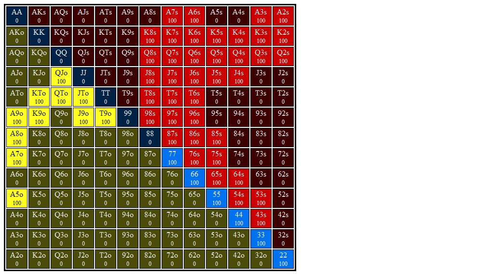
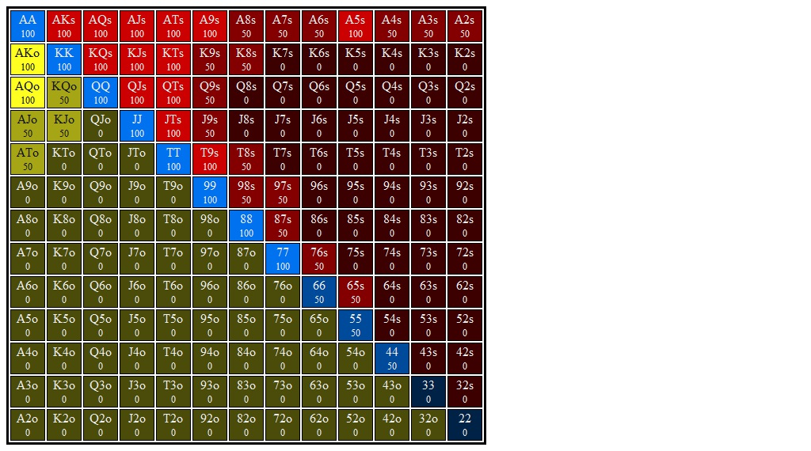
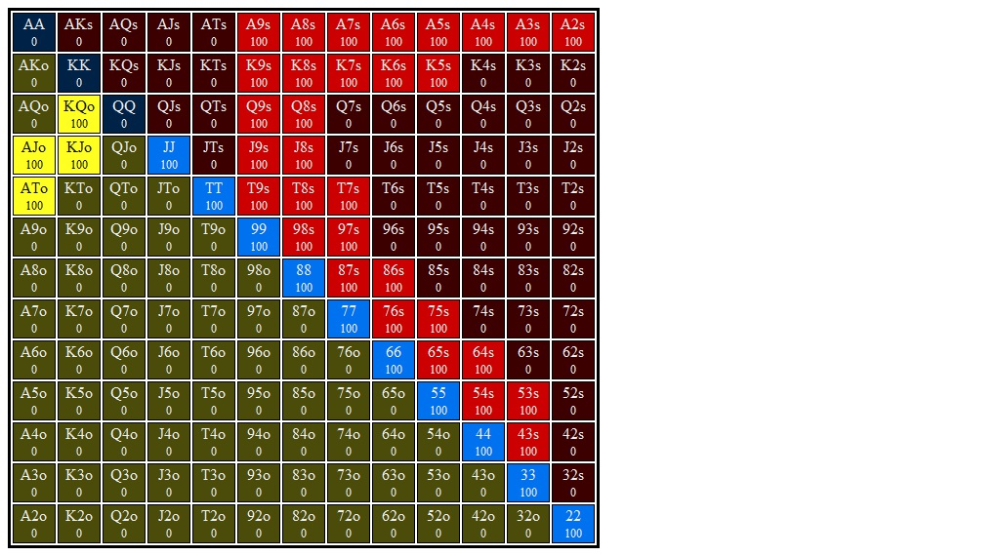

# Section 1: Semi-Bluffs and Protection

## Scenario 1: BB Calls BN Open
_Blinds are $0.05/$0.10. Effective stacks are $10.00. You're on the button and action folds to you. You open for $0.30 (3bb), SB folds, and BB calls. You go to the flop with $9.70 behind and a pot of $0.65, and BB checks to you._
### Player Ranges

#### Hero's Button Opening Range Range

#### Villain's Big Blind Calling Range vs Button Range

### Flop 1: <b>A&spades;T&diams;5&clubs;</b>

1. **Approximate each player's equity. Who has the equity advantage?**

   The button has a significant equity advantage on this flop, probably about 55%.

2. **What are the weakest hands that could go all in on the flop? Go for
   three streets of value on blank turns?**

   The some two pair like AT, A5, and maybe even T5, should be willing to go all in on this flop.

   Top pair top kicker can go for three streets, and maybe get all in on this flop?

3. **Which player has the nuts advantage?**

   The button has a clear nuts advantage.

4. **How static or dynamic is this flop? What aspects of this flop make it
   more static or dynamic?  How do these aspects interact with one another?**

   This is a very static flop. It is rainbow with a high card and no straights on board. There are some gutshots but most of these belong to the button who already has the equity and nuts advantage, so turns like a KQJ won't change benefit the big blind's range.

5. **On this flop do you prefer to bet small or large?  With what
   frequencies would you check and bet?**

   If we cbet small and BB calls we are happy to see any KQJ. Worst cards are a ten or a 5.

6. **Say you adopt a strategy where you either bet with your preferred
   sizing or check. You choose to bet and villain calls. What are the best and
   worst turn cards for your range?**

   I prefer a small cbet with 100% frequency.

#### Hands
1. <b>J&clubs;T&hearts;</b> (Flop: A&spades;T&diams;5&clubs;)
    1. **If you bet this hand should you expect better hands to fold?**

       No.

    2. **If you bet this hand should you expect worse hands to call?**

       Yes. BB should be calling with ands like T6s-T8s, some low pocket pairs,
       some 5x, and some drawing hands.

    3. **Does this hand benefit from a protection bet?**

       Yes. BB has a bunch of hands Kx, Qx, Jx that we would like to clear out.
       They will have a hard time standing up to a bet, and this will make KQJ
       turns a lot safer for us.

    4. **Does this hand benefit from growing the pot?**

       No. This hand is a medium strength hand and wants to get to showdown for cheap.
       There are some turn/rivers where this hand is nutted (TJ, QK) but those are rare
       and this hand shouldn't play with those in mind.

    5. **How is this hand doing if you bet and get called?**

       This hand should be doing fine but not great. Since our range is betting
       wide BB will have to defend with some weaker holdings, and this  hand
       can profit off of those. However it probably doesn't want to bet for
       another street of value, since after bet-call, bet-call villain's range
       will start to look pretty strong.

    6. **How is this hand doing against a check-raise?**

       Not well. I think we call, but we are in a bad spot. We might fold this
       as well. Against a balanced opponent I think we call.

    7. **What are this hand's incentives on this flop? Does it want to bet or check? If it wants to bet, what sizing does it prefer?**

        Bet small. This hand values protection but doesn't want to grow the
        pot.  Therefore this hand wants to bet small to fold out some of
        villain's equity and get called by some worse hands. On most later
        streets, villain wants to try to get to showdown cheaply.

    8. **Suppose you take your preferred action (check or bet the preferred size). If this is a bet, suppose villain calls. What are the best and worst turn cards for this hand?**

        If this hand bets small and BB calls we are happy to see any T or J
        since those both improve our hand, beating a lot of the hands that were
        ahead of us (Ax, QT).  An ace is also good because it blocks a lot of
        villains top pairs.

        We really don't want to see a 5, and in general lower cards might
        connect with  a random pocket pair. We don't mind seeing a K or Q
        since our range offers us some protection and we folded out a lot
        of their Kx/Qx on the flop.

2. <b>K&spades;7&clubs;</b> (Flop: A&spades;T&diams;5&clubs;)
    1. **If you bet this hand should you expect better hands to fold?**

        Yes, a few. BB might fold some like K8s or K9o. We probably won't fold
        out any pairs, and since villain doesn't really have many non-made hands
        with more showdown value than this hand we probably won't get too many
        better hands to fold.

    2. **If you bet this hand should you expect worse hands to call?**

        BB might call with like 43s w/ a backdoor flush draw, but those have
        plenty of equity against us...I wouldn't really call that hand worse.

    3. **Does this hand benefit from a protection bet?**

       Yes. King high can win at showdown unimproved but most turn cards, especially
       lower turn cards, can connect with villain's range in random ways. We won't
       be putting much more money in the pot so folding out random suited
       connectors and 1-gappers is to our benefit.

    4. **Does this hand benefit from growing the pot?**

        Absolutely not! This hand wants to get to showdown for free.

    5. **How is this hand doing if you bet and get called?**

        So-so. Villain should call with some worse unpaired hands that are drawing (like Kd4d).
        We also have pretty good equity against a 5x, having two overs and some
        a backdoor straight draw

    6. **How is this hand doing against a check-raise?**

        Very bad. We fold.

    7. **What are this hand's incentives on this flop? Does it want to bet or check? If it wants to bet, what sizing does it prefer?**

        On its own this hand wants to check and get to showdown. In the context
        of our range, however, we want to push equity by betting small.

    8. **Suppose you take your preferred action (check or bet the preferred size). If this is a bet, suppose villain calls. What are the best and worst turn cards for this hand?**

        Best cards for us are any K and any 7. The 7 improves us above their
        bottom pair, and K improves us against their Tx and 5x. We are probably
        also happy to see an A and maybe a T? 
        
        An A is good because it blocks top pair which we are unlikely to beat.
        Similarly, a T is good because it blocks some of their middle pairs,
        making our K-high relatively stronger. However, if they _do_ have a T
        in their hand and we hit a K on the river we are in trouble.
        
        J and Q give us a gutter but also connect with some of their calling
        hands.

        We don't want to see a 5 since that connects with their range much more
        than ours. Similarly we don't want to see lower cards like 2, 3, 4, 6,
        or 7 since those connect with villains range more.

3. <b>A&diams;T&clubs;</b> (Flop: A&spades;T&diams;5&clubs;)
    1. **If you bet this hand should you expect better hands to fold?**

        No.

    2. **If you bet this hand should you expect worse hands to call?**

        Yes. We are ahead of almost all of their range save for bottom set, and
        they call a significant portion of the time. This is a great value bet.

    3. **Does this hand benefit from a protection bet?**

        No. There are some random draws that might get there, but that will
        happen pretty infrequently. Hands that have good equity against ours
        won't fold to a bet.

    4. **Does this hand benefit from growing the pot?**

        Yes. This hand wants to play for stacks.

    5. **How is this hand doing if you bet and get called?**

        Very well.

    6. **How is this hand doing against a check-raise?**

        Very well.

    7. **What are this hand's incentives on this flop? Does it want to bet or check? If it wants to bet, what sizing does it prefer?**

        This hand wants to bet, and it wants to bet a larger size.

    8. **Suppose you take your preferred action (check or bet the preferred size). If this is a bet, suppose villain calls. What are the best and worst turn cards for this hand?**

        Best cards are A and T. Worst card is probably a 5. We could also be
        worried about some gutshots coming in (so like a K, or a 2,3,4) but I
        don't think those are of much concern.

4. <b>7&clubs;6&clubs;</b> (Flop: A&spades;T&diams;5&clubs;)
    1. **If you bet this hand should you expect better hands to fold?**

        Yes. Some cards with better high cards will fold out some showdown
        equity against us. However, I don't know if those are 'better' hands...
        Our hand doesn't win unimproved but it benefits from a lot of turns: it
        has the option to polarize on any club as well as any 3, 4, 8, or 9, and gains
        showdown on a 7 or a 6.

    2. **If you bet this hand should you expect worse hands to call?**

        No.

    3. **Does this hand benefit from a protection bet?**

        No. It has no showdown to protect

    4. **Does this hand benefit from growing the pot?**

        Not unimproved. It likes a deeper SPR since it is drawing.

    5. **How is this hand doing if you bet and get called?**

        Not particularly well, but we benefit from leverage and position, and this
        hand can triple barrel on a lot of runouts.

    6. **How is this hand doing against a check-raise?**

        This hand is a semi-bluff and does poorly against a check-raise.

    7. **What are this hand's incentives on this flop? Does it want to bet or check? If it wants to bet, what sizing does it prefer?**

        This hand wants to bet big. It is bottom of range and it wants to
        polarize to get any fold equity it can. It also wants to be ready to put
        stacks in depending on runout.

    8. **Suppose you take your preferred action (check or bet the preferred size). If this is a bet, suppose villain calls. What are the best and worst turn cards for this hand?**

        Best turn cards are 8c and 4c. Other than that:
        + Any club (FD)
        + Any 4 or 8 (OESD)
        + A 7 or a 6

5. <b>3&diams;2&diams;</b> (Flop: A&spades;T&diams;5&clubs;)
    1. **If you bet this hand should you expect better hands to fold?**

        Yes. This is bottom of range.

    2. **If you bet this hand should you expect worse hands to call?**

        No. This is bottom of range.

    3. **Does this hand benefit from a protection bet?**

        No, there isn't any showdown equity to protect.

    4. **Does this hand benefit from growing the pot?**

        Not unimproved. This is a natural bluff since it is a drawing hand with
        no showdown value. That means this hand wants to apply leverage to get
        fold equity, and a high SPR is necessary for this to work.

    5. **How is this hand doing if you bet and get called?**

        This hand prefers a fold but has plenty of equity, has position, a high
        SPR, and two more streets to apply leverage.

    6. **How is this hand doing against a check-raise?**

        Not well, we should fold.

    7. **What are this hand's incentives on this flop? Does it want to bet or check? If it wants to bet, what sizing does it prefer?**

        This hand wants to polarize and bet larger. It should apply leverage to
        maximizd fold equity and get the chips in on favorable turns and
        rivers.

    8. **Suppose you take your preferred action (check or bet the preferred size). If this is a bet, suppose villain calls. What are the best and worst turn cards for this hand?**

        If we bet large and villain calls we are happiest by hitting a 4x, and
        da 4d is best (for the redraw). We are also very happy to see any
        diamond. I'm not sure a 2 or a 3 helps us that much. We pick up some
        showdown value, but if villain called a larger bet then they are very
        likely still ahead of us (on a 2 some of their draws got there, though
        I'm not sure they are calling a bigger bet with 43s). Anyway, I think
        even if we _do_ hit a 2 or a 3 we continue to barrel and treat our hand
        like a bluff.

        I don't know if there are any turn cards that are particularly bad for
        us. A king is probably not great since we don't have the nuts when a 4
        comes (their QJ gets there). But yeah, I'm not sure if there are any
        cards that are really bad for us.

        **Note:** After looking at the solver it looks like the worst cards for
        our EV is any non-diamond board pairing card, especially when a
        backdoor flush draw comes in (this makes sense since villain may
        polarize by check/raising, putting us in a rough spot).

6. <b>5&spades;4&spades;</b> (Flop: A&spades;T&diams;5&clubs;)
    1. **If you bet this hand should you expect better hands to fold?**

        No.

    2. **If you bet this hand should you expect worse hands to call?**

        Some unpaired hands with draws should call.

    3. **Does this hand benefit from a protection bet?**

        Yes. Folding out Kx, Qx, Jx and backdoor draws should maintain some of our equity.

    4. **Does this hand benefit from growing the pot?**

        Not really. This hand has enough showdown that it wants to get to the
        river cheap.

    5. **How is this hand doing if you bet and get called?**

        Not great, but we do have some equity against better pairs, and we beat
        some drawing hands unimproved

    6. **How is this hand doing against a check-raise?**

        Not well. This hand should probably fold to a x/r.

    7. **What are this hand's incentives on this flop? Does it want to bet or check? If it wants to bet, what sizing does it prefer?**

        On its own this hand's incentive is to see showdown for as cheap as
        possible. This suggests a check. However, given our range's equity and
        nut advantage, this hand should bet small to push equity. Even when
        called we can still expect to win some portion of the time unimproved,
        and we can also polarize on later streets if we hit a five a spade, a 2
        or a 3.

        Given everything above, this hand's preferred action is to bet small.

    8. **Suppose you take your preferred action (check or bet the preferred size). If this is a bet, suppose villain calls. What are the best and worst turn cards for this hand?**

        If we bet small and villain calls, we are most happy if we see a 5 or a 4.
        We also like to see a spade, and to a lesser degree a 2 or a 3.

        We do not want to see any overcard, especially a K.

        + **Note:** Interesting, so looking at the solver any non-spade T and
          any A are very bad for us (EV around 0.1) and a non-spade K is the
          next worse (EV around 0.18).
        
          I'll try to reason through why I think this is. If villain has a T or
          A in hand we will not be able to get any folds from them. If they
          _don't_ have an A or a T and an A comes on the turn, does this make
          them call more with middle pair? It's blocking a lot of our top pair,
          so we might actually see fewer folds from Tx and we lose a lot of
          fold equity, which is reflected in a lower EV.

          This same reasoning might apply to a lot of lower pocket pairs as
          well.
          
          Looking back at the solver it looks like villain's calling range is
          22% top pair and 29% middle pair. This means that on an A 16% of
          villain's range is trips (but 30% of our range is trips, so our range
          is protected).  Likewise, on a T turn 21% of villains range vs 9% of
          our range is trips.
          
          So I think to summarize, the main problem with the paired board is
          that this uncaps villain's range which takes away a lot of our
          leverage.

7. <b>6&hearts;6&clubs;</b> (Flop: A&spades;T&diams;5&clubs;)
    1. **If you bet this hand should you expect better hands to fold?**

        No.

    2. **If you bet this hand should you expect worse hands to call?**

        Some 5x, 22-44, and some draws should call.

    3. **Does this hand benefit from a protection bet?**

        Yes, there are a lot of hands like K7, K8, etc that should be folding to
        a bet.

    4. **Does this hand benefit from growing the pot?**

        No, this hand wants to play smaller pots with wider ranges.

    5. **How is this hand doing if you bet and get called?**

        Okay but not great. We can expect villain to have middle pair or better
        maybe 50% of the time.

    6. **How is this hand doing against a check-raise?**

        Poorly, and it should fold.

        + **Note:** I checked the solver and all pocket pairs should call a 1/2
          pot bet. However, this is very close to break even (GTO+ marks it's EV
          at $0.06 in a $1.61 pot) so it's certainly not a very profitable call.

    7. **What are this hand's incentives on this flop? Does it want to bet or check? If it wants to bet, what sizing does it prefer?**

        + **Reasons to bet:** This hand benefits from protection by clearing
          out a bunch of random overcards and backdoor equity. It can also be
          called by worse, though most of villain's made hands that call are
          ahead of us.

        + **Reasons to check:** This hand doesn't want to play a larger pot and 
          wants to see showdown as cheap as possible. This hand doesn't do well
          against a check raise.

        Given our strong equity and nut advantages we want to push our equity
        with a small bet. Since we have such a strong range we are protected
        against arbitrary check-raising from villain, and we can get a lot of
        from fold equity.

        Preferred action: bet small

    8. **Suppose you take your preferred action (check or bet the preferred size). If this is a bet, suppose villain calls. What are the best and worst turn cards for this hand?**

    The best turn cards are either 6. I might be getting too clever, but I think we also don't mind seeing a T?
    This will slow down some of their Ax and also blocks some of their Tx.

    The worst turn cards: we really don't want to see a 5. We would also like to avoid random over cards,
    especially a K, since villain should have some random Kx and QJ in their calling range.

    + **Note:** Checked with the solver. Next it likes to see hearts, aces, and
      nines, and tens (though these are very low EV next to a 6, only $0.31
      versus around $2.00). The hearts make sense: there is no flush draw so
      it's less likely that villain takes a polar line, and that's good for our
      specific holding. I'm not sure why it likes 9x. A and T block some of the
      over pairs.

      Worst turn cards are kings, jacks, and queens. Notably K&hearts; is 4th worst turn card in the game (that is, K is bad outweights &hearts; is good).

8. <b>A&clubs;6&clubs;</b>    (Flop: A&spades;T&diams;5&clubs;)

    1. **If you bet this hand should you expect better hands to fold? If so, which hands?**
       Yes.

    2. **If you bet this hand should you expect worse hands to call? If so, which hands?**
       Nope.

    3. **Does this hand benefit from a protection bet? Explain.**
       Not really. Folding out some random backdoors and pocket pairs that can
       hit sets is good on some runouts, but we aren't afraid of overcards and
       we have a backdoor draw to the nuts. We bet and hope to be called by most
       hands we'd be getting protection from if they folded.

    4. **Does this hand benefit from growing the pot? How so?**

       Yes. It has top pair, which is good enough to bet for at least two
       streets of value. What's more, on club turns we have a draw to the nuts.
       We probably won't want to polarize on a club turn because we don't want
       to make villain's calling range so strong that we need to hit the flush
       to win, but we certainly aren't afraid of them check-raising.

    5. **How is this hand doing if you bet and get called? What parts of villain's range are you ahead of? Behind?**
       We are doing very well. We are ahead of most of their holdings, including
       Tx, 5x, and some Ax, not to mention the odd pocket pair. Also we are
       ahead of drawing hands like QJo, 98s, etc.

       We are behind their A5o (twopair) and their sets (55), as well as some
       better Ax (though it's possible kickers won't play depending on runout).

    6. **How is this hand doing against a check-raise?**
       This hand is doing okay against a check-raise but not great. It doesn't
       love to see it but it has enough showdown value that it can call
       and be ahead a lot of the time, and it has the ability to improve
       on later streets.

    7. **What are this hand's incentives on this flop? Does it want to bet or check? If it wants to bet, what sizing does it prefer? Do these incentives line up with the strategy you proposed for your range above?**

       This hand wants to bet and get called. Depending on runouts it can go for
       three streets of value. It's not quite strong enough to polarize, and
       even when it hits a club on the turn it still doesn't want to polarize
       since it has decent, but not amazing, showdown value.

       It wants to bet small. This lines up with my proposed strategy.

    8. **Suppose you take your preferred action from the last question (check or bet the preferred size). If this is a bet, suppose villain calls. What are the best and worst turn cards for this hand?**

       The best turn card is an Ace. After that, a 6. Any club, preferrably not
       a T, or K. I'd prefer not to see a 5, T, K.

9. <b>9&clubs;8&clubs;</b>    (Flop: A&spades;T&diams;5&clubs;)

    1. **If you bet this hand should you expect better hands to fold? If so, which hands?**

        Some K-high/Q-high/J-high will fold.

    2. **If you bet this hand should you expect worse hands to call? If so, which hands?**

        Some lower drawing hands will call, but they have good equity against us. It's unlikely
        either of us get to showdown unimproved.

    3. **Does this hand benefit from a protection bet? Explain.**

        Not much. All hands benefit from protection, but most hands are ahead of this
        one already. Betting is more about getting better hands to fold and opening the option
        to polarize on a 7, possibly a J (though our draw isn't nutty here), or a club.

    4. **Does this hand benefit from growing the pot? How so?**

        No. A larger pot means a stronger range for villain, and that means we
        lose fold equity, a major source of EV. And we don't want to have a huge
        pot when we hit a weak pair (9 or 8). Of course, if the runout comes
        club club or 7 6 we want to be able to get stacks in, but that happens
        rarely enough that we shouldn't be trying to grow the pot this early.

    5. **How is this hand doing if you bet and get called? What parts of villain's range are you ahead of? Behind?**

        We are doing okay. Villain will have a condensed range on a lot of turns
        and we'll have the opportunity to polarize on a lot of turns. Still,
        we'd prefer to see the fold.

    6. **How is this hand doing against a check-raise?**

        Not well. This is a semi-bluff and semi-bluffs do best against linear
        ranges. By check-raising, villain is polarizing their own range,
        and we are left to fold out equity or call and pay their strongest
        hands.

        This hand I think we fold to a x/r

    7. **What are this hand's incentives on this flop? Does it want to bet or check? If it wants to bet, what sizing does it prefer? Do these incentives line up with the strategy you proposed for your range above?**

        This hand does NOT want to check. We have a range and nuts advantage and
        we'd like to push it. What's more we have no showdown equity so we don't
        have anything to gain checking.

        This hand wants to bet small, like the rest of the range. If we had a
        large-bet range this hand might mix into that at some frequency as well,
        but I think this hand really wants to just bet small and hope to pick up
        the pot.

    8. **Suppose you take your preferred action from the last question (check or bet the preferred size). If this is a bet, suppose villain calls. What are the best and worst turn cards for this hand?**

        + Best turn cards: Any club lets us go big. A 7 gives us an OESD, so we
          can polarize as well. A J is dicey because they have a lot of Kx which,
          when the Q comes, will have a higher straight than us. Also, the J will
          pair them up a fair amount.

          We are also happy to pair up, but half of their check/call range is
          middle-pair+ and we can still get bluffed off of our showdown equity.

        + Worst turn cards: Any K is bad news for us since they have so many
          in their x/c range. A 5 is bad news for us since we are now drawing dead
          against their bottom pairs.

        + Good turns to bluff: I think bluffing a T, an A, a 2, a 3, or a 4
          makes sense (in addition to the other semibluffs mentioned above)
          
        + **Solver Check:** Best card is 7c (EV=0.64), Jc (EV=0.53), 6c
          (EV=0.51). We are also happy to see any 9 or 8, getting showdown
          value, and any 7. J, or club.

          Re: bluffing hands: here is what GTO+ thinks about my bluffing
          candidates:
          + **T:** I should bluff small about 1/2 the time on Th and Tc.
            I should not bluff on Ts. I think this is because their range
            polarizes both from hitting trips and from having a lot of spade
            draws. These extra spade draws make the risk of getting bluffed
            off my equity go up substantially.

          + **A:** No, don't bluff an ace (except for Ac). Not sure why this is.
            What is different between an A and a T here?
          + **2, 3, 4:** Interesting, we are checking back a fair amount on 2c,
            3c, and 4c, and bluffing more on 2h, 3h, 4h, and we are mixing a
            bigger size here as well. We are bluffing about 50% on {234}{sd}.
            Bluffing heart turns makes sense, there are fewer drawing hands
            that will x/r us.
            
            I guess checking 234c turns protects our checking range when a club
            comes?

         + I also missed bluffing Q and 6. In fact, these tend to polarize
           pretty hard, preferring a larger bet size, especially the non-clubs
           ones. I think the clubs  wnat to bet smaller because they have way
           more outs and benefit less from fold equity...we can afford to
           give a better price with our combo draws.
          
          

10. <b>9&clubs;4&clubs;</b>    (Flop: A&spades;T&diams;5&clubs;)

    1. **If you bet this hand should you expect better hands to fold? If so, which hands?**

        No.

    2. **If you bet this hand should you expect worse hands to call? If so, which hands?**

        No.

    3. **Does this hand benefit from a protection bet? Explain.**

        No.

    4. **Does this hand benefit from growing the pot? How so?**

        No, it wants to fold out hands and win small pots. On good runouts it
        can get nutty, but it will never bet the nuts

    5. **How is this hand doing if you bet and get called? What parts of villain's range are you ahead of? Behind?**

        We are doing bad if we get called. We are ahead of their low
        drawing hands, but those have a lot of equity and might choose to bluff
        us off of our 9-high equity

    6. **How is this hand doing against a check-raise?**

        Bad, we fold.

    7. **What are this hand's incentives on this flop? Does it want to bet or check? If it wants to bet, what sizing does it prefer? Do these incentives line up with the strategy you proposed for your range above?**

        This hand wants to bet small to push equity from other parts of the
        range. Since it does have a couple back door draws it can bet small as
        a semibluff and can be a bluff on later streets.

    8. **Suppose you take your preferred action from the last question (check or bet the preferred size). If this is a bet, suppose villain calls. What are the best and worst turn cards for this hand?**
        
        + **Best Turn Cards:** 2c or 3c are the best we can see as those bring
          in 12-out combo draws. Other than that, any club (preferrably non-K), and
          any 2 or 3.

          Blank hearts are probably the best cards to bluff since they don't
          bring in any new draws, and we don't want to bluff into a possible
          check-raise.

        + **Worst Turn Cards:** We don't want to see a K, since their random K-high
          and their QJ hit. 

        + **From the solver:** Something that I haven't noticed before (or I did
          but I forgot) is that the solver wants us to bluff a lot on Q and J
          turns. These are the strongest turns for our range because of potential
          straits, sets, two pairs, etc. 

          I'm not sure I'd figure this out in game.

### Flop 2: <b>A&spades;8&diams;4&spades;</b>
1. **Approximate each player's equity. Who has the equity advantage?**

   Hero should have about 55% equity

   **From the solver:** Hero has exactly 55% equity.

2. **What are the weakest hands that could go all in on the flop? Go for three streets of value on blank turns?**

   For value, I think two-pair can get it in at some frequency. Maybe not 84? But
   A8, A4 probably can.

   4&spades;3&spades; is also happy shoving since it values fold equity but
   also has 48% equity (probably a little less...we get called by some better
   flush draws).

  + **From the solver:**
    - **Weakest to call all in (no fold equity):** 8sXs (middle pair with a spade draw), As9x,
      AsTx. Also some KsXs
    - **Weakest to go all in (some fold equity):** Basically the same.

3. **Which player has the nuts advantage?**

   No straights or flushes on the board, so nutty hands are any set. Two pair can
   be treated as nutty as well.

   Hero has more nutty combos in their range.

   + **From the solver:** Not sure how to quantify the nuts advantage but BN has
     about 4.5% 2pair+ while BB has about 3.5% 2pair+. Bn also has about 20% of
     range top pair versus BB's 14% of range being top pair. This is a sizable
     nuts advantage.

4. **How static or dynamic is this flop? What aspects of this flop make it more static or dynamic?  How do these aspects interact with one another?**

   This is a pretty static flop. There are some flush draws and some gutters on
   the board, but the A means that top pair is always top pair.

5. **On this flop do you prefer to bet small or large?  With what frequencies would you check and bet?**

    As the button with a nuts advantage and an equity advantage I prefer to bet
    small with the majority of my range. I might mix in some larger bets because
    of the prevelance of drawing hands...I think this is a more dynamic flop than
    A&spades;T&diam;5&clubs; so we can choose to use a larger bet size
    sometimes, and this betting at a lower frequency

    + **From the solver:** GTO+ bets small 71% and checks 29%. The solver wants
      to check KK, QQ, and JJ (progressively less...JJ benefits from a
      protection bet more than KK) and unpaired broadways, especially Kx. The
      high pocket pairs have a lot of showdown value and don't get as much from
      protection.  The Kx holdings can win unimproved a fair amount and can
      backdoor into a straight. GTO+ is betting Kx of spades at a decent frequency,
      betting K&spades;Q&spades; about 30% of the time, K&spades;J&spades; 60%,
      K&spades;T&spades; 70%, and Ks9s 83%. I believe this again reflects
      protection (K9 wants to get Jx to fold more than KQ), and also ensures
      that the checking and betting range both have a good amount of nut flush
      draws.
      
6. **Say you adopt a strategy where you either bet with your preferred sizing or check. You choose to bet and villain calls. What are the best and worst turn cards for your range?**

    If we bet small we should be getting called by their A-high, their 8x, and
    their 4x, as well as their pocket pairs. They should also be calling their
    spade draws and backdoor flush draws, not to mention a fair number of
    backdoor straight draws.

    In addition to those, BB should be defending some K5s-K7s, Q5s-Q7s,
    J5s-J7s, T5s-T7s, so that they have the ability to hit second pair when a
    J-K comes (these hands also have backdoor straight draw potential)

    I think they are folding out most of their K-high through T-high.

    Their main drawing hands are spade draws and gutshots. Cards that put
    our range and nut advantage in the most danger are any spade and 2, 6, 7.
    We'd also prefer to see non-diamond turns since they will have some
    back-door flush draws coming in, and they will try to bluff some of these,
    hurting the EV of our medium holdings.

    **Best Cards:** K, Q, J, T, especially a non-spade non-diamond. We don't
    mind seeing an A but it does somewhat uncap their range. I also don't think
    we mind seeing  a 9 since it's an overcard to their middle pair and they
    should have folded out a fair number of 9x, though their 98 will now have
    2pair.
    
    **Worst Cards:** An 8 or a 4 uncaps their range, and cards like 9, 7, 6, 5,
    3 give them some straight draws and 2pair, not to mention the fact that some
    random pocket pairs become sets.

    + **From the solver:** 
        When we bet and get called villain has about 54% equity, but we still
        have the EV advantage due to a polarized range and a positional
        advantage. Villain is calling with about 25% top pair, and about 43%
        middle and weak pairs. Their range is capped, with only about 2% of
        2pair+.

        No turn is super good or super bad for us. On the worst turn our EV
        is still 0.42 pot, and on our best turn our EV is 0.57 pot. These values
        are pretty clustered, though I'm not sure why that is the case.

        - **Best Turn Cards:** We want to see a non-spade T, J, 9, Q, or K,
          which lines up with my predection above.

        - **Worst Turn Cards:** Any 4, and any low spade card is bad for our
              range, but we still have a lot of EV. The pot is $1.07 and we still have
          $0.46 on the worst turn card, 5&spades; (so 0.42 pot on the worst turn).
    

#### Hands
1. <b>Q&spades;J&hearts;</b>    (Flop: A&spades;8&diams;4&spades;)

    1. **If you bet this hand should you expect better hands to fold? If so, which hands?**

      Some K-high will fold, and maybe some low pocket pairs, but we don't
      expect much to fold that has us beat.

    2. **If you bet this hand should you expect worse hands to call? If so, which hands?**

      Some drawing hands will call, but I don't think many that are strictly worse
      than ourse will call, even a small 1/3 pot cbet.

      + **From the solver:** At equilibrium the big blind should be mixing some calls with
        back door draws like J9o, T9o, etc, which we beat, but these are mixed strategies
        for board coverage. 

    3. **Does this hand benefit from a protection bet? Explain.**

      No, there isn't much equity to protect here.

    4. **Does this hand benefit from growing the pot? How so?**

       No, this hand prefers to play a smaller pot so that it has room to
       realize its equity. It does have some backdoor draws to the nuts, but
       more often it will win with 2nd (or 3rd) pair. And on a good turn
       it can choose to polarize which is a lot easier to do when there is
       room to apply leverege.

    5. **How is this hand doing if you bet and get called? What parts of villain's range are you ahead of? Behind?**

       Most of villain's flop calling range should be ahead of us. We are ahead of some
       draws.

    6. **How is this hand doing against a check-raise?**
       Very bad, though it should be an easy fold.

    7. **What are this hand's incentives on this flop? Does it want to bet or check? If it wants to bet, what sizing does it prefer? Do these incentives line up with the strategy you proposed for your range above?**

        This hand has very little showdown value, and given our range advantage,
        the number of draws that can come in on the turn, and our position, this
        hand wants to bet to push equity and set up the possibility to bluff on
        the turn/river.

    8. **Suppose you take your preferred action from the last question (check or bet the preferred size). If this is a bet, suppose villain calls. What are the best and worst turn cards for this hand?**

        - **Best turn cards:** I think the best turn card for EV will be the Ts. We block
           spades and we have a draw to the 2nd nut flush, not to mention to a double
           gutshot. We are also happy to see a Ks, 9s, and to see a Q or a J.

        - **Worst turn cards:** We don't want to see the board pair, and low
          cards (below an 8) could hit a random pocket pair.

        - **From the solver:** J&spades; is best for Hero's EV. We pick up showdown and also
          draw to the nuts. After that we want to see Q/J (pref non-diamond because draws),
          _then_ Ts, then other T (pref non-diamond draw).

          I was overvaluing draw hands, and in this case even a really good draw
          on the turn is still not as good as decent showdown. In this case
          the Q also helps our range so we don't have to fear as much aggression
          from a turn card polarizing villain's range.

2. <b>T&diams;3&diams;</b>    (Flop: A&spades;8&diams;4&spades;)

    1. **If you bet this hand should you expect better hands to fold? If so, which hands?**

       No.

    2. **If you bet this hand should you expect worse hands to call? If so, which hands?**

       No.

    3. **Does this hand benefit from a protection bet? Explain.**

       No, there isn't much showdown equity, or pot equity for that matter, to protect.

    4. **Does this hand benefit from growing the pot? How so?**

       No, this hand wants to play small pots, preferably taking down the pot with a small
       cbet.

    5. **How is this hand doing if you bet and get called? What parts of villain's range are you ahead of? Behind?**

       Poorly. We are ahead of some lower draws, but that's about it.

    6. **How is this hand doing against a check-raise?**

       Bad...we fold

    7. **What are this hand's incentives on this flop? Does it want to bet or check? If it wants to bet, what sizing does it prefer? Do these incentives line up with the strategy you proposed for your range above?**

        This hand wants to cbet small to push the range advantage. It has some
        ability to improve but not much.

    8. **Suppose you take your preferred action from the last question (check or bet the preferred size). If this is a bet, suppose villain calls. What are the best and worst turn cards for this hand?**

        + **Best turn cards** The best turn card is probably either T&hearts; or
          T&clubs;. We can also benefit from a 5&diams; or a 2&diams; which
          will give us a decent draw.  We can also bluff when a K&diams;,
          Q&diams;, J&diams;, or 9&diams; comes because that both strengthens
          and polarizes our range, and our semi-bluff has a stronger/more
          polarized range advantage behind it.

          Turning a 2 or a 5 (non diamond) helps our hand but also uncaps
          villain's range, making a semi-bluff less profitable. I think we
          still barrel, but we might mix in some checks, and probably don't
          choose as big of a size on these turns.

        + **Worst turn cards:** We'd prefer to not see the board pair,
          especially w/ an 8 or a 4, though if a diamond comes we might still
          cbet turn with a bigger size. We also don't want any spades to
          come...when we win this hand it's usually from getting folds, and
          it's harder to get folds when betting into an uncapped range.

        + **From the solver:** T&hearts; and T&clubs; are the best turn cards
          for us, followed by a 2&diams; and a 5&diams;.

          We really don't want to see spades (save for T&spades;, and kinda
          3&spades;).

          Non-&diams; J, Q, and K are bad for us, as are Non-&diams; 6, 7, 8,
          and 9.

3. <b>9&hearts;7&hearts;</b>    (Flop: A&spades;8&diams;4&spades;)

    1. **If you bet this hand should you expect better hands to fold? If so, which hands?**

        No.

    2. **If you bet this hand should you expect worse hands to call? If so, which hands?**

        No.

    3. **Does this hand benefit from a protection bet? Explain.**

        No.

    4. **Does this hand benefit from growing the pot? How so?**

        No.

    5. **How is this hand doing if you bet and get called? What parts of villain's range are you ahead of? Behind?**

        Poorly. I am behind most of their calling range.

    6. **How is this hand doing against a check-raise?**

        Bad. We fold.

    7. **What are this hand's incentives on this flop? Does it want to bet or check? If it wants to bet, what sizing does it prefer? Do these incentives line up with the strategy you proposed for your range above?**

        This hand has no showdown value. It may want to bet small, or it may
        want to check and see a turn for free. If it does bet, it's to push
        equity from the range. It has a backdoor straight draw, so it can
        do better on some turns.

    8. **Suppose you take your preferred action from the last question (check or bet the preferred size). If this is a bet, suppose villain calls. What are the best and worst turn cards for this hand?**

        + **Best Turns:** Best turn cards are any 9 (pref 9&clubs;), any 7 (pref
          7&clubs;), or 6&hearts; or 6&clubs; (followed by any 6). After that, a
          T, 5, or J (preferring clean suits)
        
        + **Worst Turns:** Everything else

        + **From The Solver** 
          + **Best Turns:** 
            + 9 (pref non-spade)
            + 7 (pref non-spade)
            + T, 6 (pref non-spade)
            + J,6: (for the gutter)
          + **Worst Turns:** 
            + Anything else

4. <b>J&clubs;8&clubs;</b>    (Flop: A&spades;8&diams;4&spades;)

    1. **If you bet this hand should you expect better hands to fold? If so, which hands?**

        No.

    2. **If you bet this hand should you expect worse hands to call? If so, which hands?**

        Yes. Some 4x, low pocket pairs, and some draws. Some worse Jx

    3. **Does this hand benefit from a protection bet? Explain.**

        Yes, it can easily be outdrawn (9 thru K comes on the turn/river,
        or turn/river comes diamond diamond, etc.)

    4. **Does this hand benefit from growing the pot? How so?**

        No, it's medium strength and wants to showdown cheap.

    5. **How is this hand doing if you bet and get called? What parts of villain's range are you ahead of? Behind?**

        It can be doing okay. We are ahead of their speculative calls and some weak
        made hands, but we are behind a good chunk of their value range

    6. **How is this hand doing against a check-raise?**

        Not great. We call, but we don't like it. Our EV should go down considerably.

    7. **What are this hand's incentives on this flop? Does it want to bet or check? If it wants to bet, what sizing does it prefer? Do these incentives line up with the strategy you proposed for your range above?**

        This hand wants to bet small to push equity and plan to try to get to showdown for cheap.
        This hand doesn't get too strong on most runouts

    8. **Suppose you take your preferred action from the last question (check or bet the preferred size). If this is a bet, suppose villain calls. What are the best and worst turn cards for this hand?**

        + **Best Turn Cards:** Any 8 or J, pref not a spade

        + **Worst Turn Cards:** Any spade is bad. A 4 is bad. A 3 or a 5, 6, or
          7 is bad. A K, Q, or T is bad. Everything is bad.

        + **From the solver:**
          + Solver wants to see Jh, 8h, Jd, 8s, Js (in that order). This makes
            sense...while an 8 gives us more equity it also means the board
            pairs and it might be harder to get paid from villains worse hands.
            A J is more innocuous.

            We want to avoid spades for obvious reasons, and diamonds also polarize
            villain's range quite a bit.

            Solver also doesn't mind seeing an A...this block's villain's top pair.

          + Solver DOESN'T want to see any spades, any 4, or any K, Q...EV is basically flat
            (slight increase) for non-spades that don't connect with us.
            

5. <b>Q&spades;7&spades;</b>    (Flop: A&spades;8&diams;4&spades;)

    1. **If you bet this hand should you expect better hands to fold? If so, which hands?**

        No.

    2. **If you bet this hand should you expect worse hands to call? If so, which hands?**

        No.

    3. **Does this hand benefit from a protection bet? Explain.**

        No.

    4. **Does this hand benefit from growing the pot? How so?**

        It wants a high spr and it wants to apply leverage over multiple
        streets...to get a high spr it wants to play a smaller pot to begin
        with.

    5. **How is this hand doing if you bet and get called? What parts of villain's range are you ahead of? Behind?**

        We are doing fine. We have a strong flush draw, not to mention
        a BDSD, and we can hit a random Q on the turn/river. Plus, we
        can continue to barrel and have a good bluffing candidate on the
        river.

        + **From the solver:** When flop checks to us this hand has EV of 0.54.
          We bet at about 75% frequency, and when we get called we have an EV
          of 0.68, a 1.4 bb improvement.

    6. **How is this hand doing against a check-raise?**

        Not great. We still have a very strong draw, but by x/r-ing us villain
        is polarizing, and if they are constructing this range correctly our
        aggression should be easy for them to handle...we want to give them
        tough decisions, but a polar range has relatively easy decisions facing
        a bet. This makes our hand kinda tough to play.

        + **From the solver:** Wrong. We still have 0.72 EV...I was not
          expecting this. I suppose this is a strong enough draw that we
          can continue to play aggressively.

          After we get x/r'd the solver uses the following turn strategy:

          - Fold any A or 8 turn (afraid of 44), and folds 33% of the time on a
            4 turn (afraid of 44, but only one combo now).

          - On any other turn we call.

    7. **What are this hand's incentives on this flop? Does it want to bet or check? If it wants to bet, what sizing does it prefer? Do these incentives line up with the strategy you proposed for your range above?**

        Bet. We want money to go into the pot, but _we_ want to put the money
        in. We value fold equity, but we also have a very strong draw. This hand
        doesn't need to bet too large. We have a lot of equity so we aren't
        at bottom of range...we don't need to polarize!

        This lines up with our strategy above.

    8. **Suppose you take your preferred action from the last question (check or bet the preferred size). If this is a bet, suppose villain calls. What are the best and worst turn cards for this hand?**

        + **Best Turn Cards:** Easy: any spade. Also, a queen (pref
          non-diamond). A 7 is okay, and we have enough showdown value to beat
          about half of their range.  A non-spade 5 or 6 gives us a combo draw.

        + **Worst turn cards:** We don't want to see the board pair, becase that
          means we aren't drawing to the nuts anymore, and also villains range
          uncaps.
        
        + **From the Solver:** 
          + Re: "Any Spade": A little more care is needed. K&spades; is _the_
            best card for us...we have nut flush. After that a non-8 spade is
            good. With 8&spades; turn we are up against some boats.

6. <b>A&clubs;J&clubs;</b>    (Flop: A&spades;8&diams;4&spades;)

    1. **If you bet this hand should you expect better hands to fold? If so, which hands?**

        No.

    2. **If you bet this hand should you expect worse hands to call? If so, which hands?**

        Yes. Worst Ax, 8x, 4x, some draws and backdoor draws.

    3. **Does this hand benefit from a protection bet? Explain.**

        This hand wouldn't mind folding out some backdoor draws, but hands
        with good equity like spade draws won't be folding.

    4. **Does this hand benefit from growing the pot? How so?**

        This hand could potentially play for stacks depending on runouts and
        action.  It loses to 44, A8o, and maybe 88 or A4s (not in present range
        but could be in some players bb call ranges). It wants to bet to grow
        the pot since it should be ahead a lot of the time at showdown. It gets
        value from hands like worse Ax, 8x, 4x, and some draws.

    
    5. **How is this hand doing if you bet and get called? What parts of villain's range are you ahead of? Behind?**

        We expect to be doing very well. We are ahead of most of their calling
        range. We are behind only 44 (4 combos) and A8 (5 combos), and we tie
        some strong draws (6&spades;5&spades;, 7&spades;6&spades;), but I don't
        expect those to call; since they benefit from fonds _and_ from growing
        the pot I think they should be betting?

        + **From the solver:** A&clubs;J&clubs; has EV=0.6 on flop prior to
          cbetting. After villain calls we have EV=0.98. This is a hand that
          wants to get calls.

    6. **How is this hand doing against a check-raise?**

        We are doing fine. We lose some EV, but not much. We have a lot of turn
        cards that we don't want to see, but on blank runouts I think we can
        play for stacks. However we will be in a bluff-catching role. By
        x/r villain has polarized, and I think they do this with draws and with
        nutty hands (2p+)

        + **From the solver:** A&clubs;J&clubs; has EV=0.6 on flop prior to
          cbetting. After villain x/r and we call hero has EV=0.73. So we
          prefer a call.

    7. **What are this hand's incentives on this flop? Does it want to bet or check? If it wants to bet, what sizing does it prefer? Do these incentives line up with the strategy you proposed for your range above?**

        This hand wants to bet to grow a decent sized pot to win at showdown.
        This hand could either belong to top of a small-cbet range or bottom
        of a large-cbet range. Since this range wants to bet smaller our
        default action with this hand is small.

    8. **Suppose you take your preferred action from the last question (check or bet the preferred size). If this is a bet, suppose villain calls. What are the best and worst turn cards for this hand?**

        + **Best Turn Cards:** Any non-spade J and either A is great to see.
          I'm not sure if seeing a K or a Q is good...on the one hand we can
          get paid from some random Kx and Qx that hit second pair, but on
          the other hand we need to be careful of K8 and K4. I guess since
          this somewhat uncaps villain's range we don't want to see it,
          especially since we have enough aces that they aren't likely to put
          in a bunch with 2nd pair.
        
        + **Worst Turn Cards:** Any spade will cut down our EV by uncapping
          villain's range. We don't want to see an 8 or a 4, and we do need
          to be careful about any card below an 8 since they can complete a
          gutshot.

        + **From The Solver:**

          + **Best Turn Cards:** either non-spade J, either A. After that, any
          non-spade T, K&hearts;/&clubs;, Q&hearts;/&clubs;

          + **Worst Turn Cards:** 5&spades; is the worst card in the deck.
            This uncaps villain's range w/ flushes, straights, 2pair, etc.

            8&spades; is 2nd worse since it brings in flushes and makes middle
            pair trips. Any other spade is also bad (J&spades; less so), but
            lower spades are worse.

            We don't like to see 5, 6, or 7 since these make straights/2pairs
            possible.

            We prefer a non-diamond since villain might bet polar with a
            FD.

7. <b>K&spades;Q&hearts;</b>    (Flop: A&spades;8&diams;4&spades;)

    1. **If you bet this hand should you expect better hands to fold? If so, which hands?**

        No

    2. **If you bet this hand should you expect worse hands to call? If so, which hands?**

        No

    3. **Does this hand benefit from a protection bet? Explain.**

        We are unpaired and might have a bit of showdown, so getting random
        other holdings to fold out is good for us, even if we have them beat.
        However we don't gain much from protection because there are no overs.

    4. **Does this hand benefit from growing the pot? How so?**

        Not really, this hand is happy getting to showdown cheap.

    5. **How is this hand doing if you bet and get called? What parts of villain's range are you ahead of? Behind?**

        We aren't ahead of much. We are live against their middle pairs, but we
        are drawing very thing against their Ax.
        
        Flopzilla says we have about 30% equity

    6. **How is this hand doing against a check-raise?**

        Poor, we fold.

        + **From the solver:** Nope, we actually call here. I should note, we
          are only betting KQo w/ a club, and then only at a frequency of
          around 35%, and we are only calling  K&spades;Qx and folding
          KxQ&spades;.

    7. **What are this hand's incentives on this flop? Does it want to bet or check? If it wants to bet, what sizing does it prefer? Do these incentives line up with the strategy you proposed for your range above?**

        This hand doesn't really want to put any money in on its own. It might
        benefit from fold equity, but I don't think it's ever folding a pair,
        and so it's only folding out hands it's ahead of. Again, there is some
        amount of equity there (against like QJ, which we definitely don't want
        to fold out since we have it dominated) or JT, but I don't know if it's
        enough to bet.

        I'm also a little spoiled because I think I saw that this hand doesn't
        bet this flop (which doesn't surprise me) in the solver output
        previously.

        On the other hand, we do have the back door nut flush draw, so if there
        is a combo of KQo that wants  to bet its this one (or better,
        K&spades;Q&diams;). So I could see this particular combo betting small
        50% of the time or something. But we want some back door nut flush draws
        in our checking range too, and this hand already has incentives to
        check, so I think this is a good checking hand as well.

        So default action: check.

        **Follow Up:** Reading back over this, I'm wondering: why does this
        hand like to check more than, say, another no-pair backdoor straight
        draw flush draw? I'm not sure, but my hypothesis is two fold:
        1. We want a checking range, and as such we want nutty back door
           draws in that range
        2. These combos benefit the least from protection. We can still hit
           a K or Q and make a good amount of showdown equity, and when
           a backdoor flush or straight comes we know we are at the top end of it.
           For instance, when TJ comes, we have nut straight, whereas hands like
           K9 or 97 will have the bottom end, and therefore have some reverse
           implied odds working against them.

    8. **Suppose you take your preferred action from the last question (check or bet the preferred size). If this is a bet, suppose villain calls. What are the best and worst turn cards for this hand?**

        + **Best Turn Cards:** Best turn cards: We pick up the most equity w/ a
          K or a Q.

          We are also very happy to see either J&spades; or T&spades;. We can start
          betting aggressively. Since we have a very strong combo draw we don't need
          to bet as big as, say, a J&hearts;, since we hit the nuts on a _lot_
          of rivers. So, if I had to pick a sizing, I'd probably go like 0.75 pot
          to full pot here, with the intention of barrelling a lot of rivers
          where we either hit the nuts or have a blank turn that doesn't pick
          up any equity.

        + **Worst turn cards:** We don't want the board pairing, especially the
          8 or the 4. We'd also prefer to not see a diamond.

        + **From the solver:**

            + **Best Turn Cards:** Q&spades; is the best turn card. After that
              we have a slight preference for Qx over Kx. I think this might be
              because villain's Qx range is slightly stronger than their Kx
              range and is more willing to call bets, but this is just a guess.

              We also pick up some EV from a spade, especially the J&spades; or
              T&spades; which give us nutty combo draws.

            + **Worst Turn Cards:**  While it's true we don't want to see the
              board pair, the solver is acutally more concerned with other low
              cards that complete straights. I think this is for two reasons.
              First, we lose a lot of equity from random pairs. Second, these
              cards uncap villain's range, especially when there is no flush.

8. <b>A&diams;9&spades;</b>    (Flop: A&spades;8&diams;4&spades;)

    1. **If you bet this hand should you expect better hands to fold? If so, which hands?**

        No

    2. **If you bet this hand should you expect worse hands to call? If so, which hands?**

        Yes, worse pairs, some draws.

    3. **Does this hand benefit from a protection bet? Explain.**

        No

    4. **Does this hand benefit from growing the pot? How so?**

        Somewhat. This hand doesn't want to play for stacks on most runouts,
        but it has top pair with a back door flush draw, so it's not as afraid
        of spade runouts and can play larger pots a bit more comfortably.
        Against this particular BB range, it is never outkicked.

    5. **How is this hand doing if you bet and get called? What parts of villain's range are you ahead of? Behind?**

        This hand is doing fine. This hand is ahead of all pairs, all drawing hands. It is behind sets and 2 pairs (A8, A4).

    6. **How is this hand doing against a check-raise?**

        This hand will lose a fair amount of EV but it is still a clear call.
        However, instead of being the best hand most often BB's range should be
        relatively polarized around us. If they x/r small they can have some
        top pair that we are beating, but if they x/r large I think they should
        not be doing this with Ax (except maybe for some backdoor flush draws?)

    7. **What are this hand's incentives on this flop? Does it want to bet or check? If it wants to bet, what sizing does it prefer? Do these incentives line up with the strategy you proposed for your range above?**

        This hand wants to bet for value. It is ahead of most of villain's
        calling range. I'd say that on blank runouts it's looking for two
        streets of value.

        Our preferred action is to bet small, along with the rest of our range.

        Also of note: we have a backdoor flush draw, and having the spade in
        our hand makes us a little more robust to aggression. We also have
        the A&diams; which takes away some of villain's bluffs on diamond turns.

    8. **Suppose you take your preferred action from the last question (check or bet the preferred size). If this is a bet, suppose villain calls. What are the best and worst turn cards for this hand?**
        
        + **Best Turn Cards:** We are happy to see a 9 since we now beat 2pair.
          An A is also good, but this makes any of BB's sets into boats and also
          sets us up for some coolers, so I think that BB can bet more
          aggressively in these spots...I think it will be a marginal
          difference, but I'm hypothesizing that the solver prefers a 9 turn to
          an A turn. I think this is also because BB will have some random 9x
          that connects, so we are more likely to make money off of one of
          their turned pairs.

        + **Worst Turn Cards:** Whoops, peeked at  the solver. Anyway, we don't
          really get much EV from any other card. We aren't drawing to any
          straights, and we aren't drawing to a good flush. On a
          &spades;&spades; runout we probably can't call a shove, or if we do
          we are probably just barely +EV/indifferent (and in practice at the
          stakes I play, I think this is a pure fold). A spade turn uncaps their
          range, and while we prefer to have a spade here, we can't use it to
          polarize.

          Any lower cards also uncap villain's range because of straights and
          random turned sets.

        + **From The Solver:**
          + **Best Turn Cards:** Yeah, 9s are good for us (pref non-diamond),
            and A is good as well (not as high EV as a 9). We also like to see
            a T. I'm guessing this is because we can target their middle pairs.
          + **Worst Turn Cards:** First, we have a lot of EV no matter what turn
            comes. 5&spades; and 8&spades;, the worst turns in the deck for us,
            both have EV=$0.77 in a pot of $1.07, so about 3/4 pot.
          
            With that said, we do not want to see a spade, especially a low
            spade, and we don't want to see a 5, a 7, or an 8. These uncap
            villain's range and that should allow them to bet polarized in some
            places.
            
            Interestingly, if we bet a 4 and get raised we fold most of the time
            (always on 4&diams;). However, villain should be raising very rarely
            (< 5%) so our range is protected here.

9. <b>Q&spades;T&spades;</b>    (Flop: A&spades;8&diams;4&spades;)

    1. **If you bet this hand should you expect better hands to fold? If so, which hands?**

        Maybe some Kx, but those aren't really better even though they have
        showdown value over us, because if they're folding they don't have a
        flush draw.

    2. **If you bet this hand should you expect worse hands to call? If so, which hands?**

        Some worse draws. Also, some hands with a pair that are vulnerable to
        aggression, especially out of position (say 6&diams;6&hearts;), while
        they have more showdown value we can make them underrealize this
        showdown equity.

    3. **Does this hand benefit from a protection bet? Explain.**

        No.

    4. **Does this hand benefit from growing the pot? How so?**

        On some runouts, but this hand is trying to get folds.

    5. **How is this hand doing if you bet and get called? What parts of villain's range are you ahead of? Behind?**

        This hand is probably slightly EV when called.

    6. **How is this hand doing against a check-raise?**

        Fine. We have a draw to the nuts, a backdoor to a straight, and some
        live cards to make middle pair. Plus, we can polarize and bluff off
        equity on many runouts.

    7. **What are this hand's incentives on this flop? Does it want to bet or check? If it wants to bet, what sizing does it prefer? Do these incentives line up with the strategy you proposed for your range above?**

        This hand wants to bet. It is a semi-bluffing hand. It wants to apply leverage
        for 3 full streets.

    8. **Suppose you take your preferred action from the last question (check or bet the preferred size). If this is a bet, suppose villain calls. What are the best and worst turn cards for this hand?**

        + **Best turn cards:** K&spades;, followed by any other spade. After that,
          any Q or 9, preferably not a diamond. Any TJ (agian, pref not a diamond)
          gives us a strong combo draw.

        + **Worst turn cards:** We would prefer not to see the board pair. An 8
          promotes their middle pair to trips and their bottom sets to a boats,
          and these will be hard to fold out, and in the case of a boat we are
          not drawing to the nuts. Same with an A turn. A 4 shouldn't be quite
          as bad because they will have 1 combo of quads but no combos of
          boats, which are effectively just as nutty as each other against our
          hand, so we've cut down their nutty combos that we're drawing dead
          against to  1/3. A 5 is bad because it completes both a wheel straight
          and the 4..8 straight, and low/mid cards in general make random pairs
          and random straights, so villain picks up some middling equity and
          also uncaps their range simultaneously, making it a bit tougher for
          us to semibluff.

          Cards like T, J, K shouldn't hurt us that much. They do make some
          random pair and 2pair, but we can still put a lot of pressure on
          those, and since they haven't been totally uncapped w/ straights, we
          are a bit more comfortable applying pressure.
        + **From The Solver:**
          + **Best Turn Cards:** We are happiest to see a spade, followed by a 9
            or a Q (in that order)
          + **Worst Turn Cards:** 4, 8, A, 5, K, 6, 7, 2, 3, in that order, are
            all pretty bad for us. I was right that we are somewhat protected
            on T J, since we have a gutter, but a K is a lot worse for us than
            I thought.
          

10. <b>Q&spades;9&spades;</b>    (Flop: A&spades;8&diams;4&spades;)

    1. **If you bet this hand should you expect better hands to fold? If so, which hands?**

    2. **If you bet this hand should you expect worse hands to call? If so, which hands?**

    3. **Does this hand benefit from a protection bet? Explain.**

    4. **Does this hand benefit from growing the pot? How so?**

    5. **How is this hand doing if you bet and get called? What parts of villain's range are you ahead of? Behind?**

    6. **How is this hand doing against a check-raise?**

    7. **What are this hand's incentives on this flop? Does it want to bet or check? If it wants to bet, what sizing does it prefer? Do these incentives line up with the strategy you proposed for your range above?**

    8. **Suppose you take your preferred action from the last question (check or bet the preferred size). If this is a bet, suppose villain calls. What are the best and worst turn cards for this hand?**

### Flop 3: <b>A&spades;7&spades;2&diams;</b>
1. **Approximate each player's equity. Who has the equity advantage?**

2. **What are the weakest hands that could go all in on the flop? Go for three streets of value on blank turns?**

3. **Which player has the nuts advantage?**

4. **How static or dynamic is this flop? What aspects of this flop make it more static or dynamic?  How do these aspects interact with one another?**

5. **On this flop do you prefer to bet small or large?  With what frequencies would you check and bet?**

6. **Say you adopt a strategy where you either bet with your preferred sizing or check. You choose to bet and villain calls. What are the best and worst turn cards for your range?**

#### Hands
1. <b>Q&spades;J&diams;</b>    (Flop: A&spades;7&spades;2&diams;)

    1. **If you bet this hand should you expect better hands to fold? If so, which hands?**

    2. **If you bet this hand should you expect worse hands to call? If so, which hands?**

    3. **Does this hand benefit from a protection bet? Explain.**

    4. **Does this hand benefit from growing the pot? How so?**

    5. **How is this hand doing if you bet and get called? What parts of villain's range are you ahead of? Behind?**

    6. **How is this hand doing against a check-raise?**

    7. **What are this hand's incentives on this flop? Does it want to bet or check? If it wants to bet, what sizing does it prefer? Do these incentives line up with the strategy you proposed for your range above?**

    8. **Suppose you take your preferred action from the last question (check or bet the preferred size). If this is a bet, suppose villain calls. What are the best and worst turn cards for this hand?**

2. <b>J&diams;8&clubs;</b>    (Flop: A&spades;7&spades;2&diams;)

    1. **If you bet this hand should you expect better hands to fold? If so, which hands?**

    2. **If you bet this hand should you expect worse hands to call? If so, which hands?**

    3. **Does this hand benefit from a protection bet? Explain.**

    4. **Does this hand benefit from growing the pot? How so?**

    5. **How is this hand doing if you bet and get called? What parts of villain's range are you ahead of? Behind?**

    6. **How is this hand doing against a check-raise?**

    7. **What are this hand's incentives on this flop? Does it want to bet or check? If it wants to bet, what sizing does it prefer? Do these incentives line up with the strategy you proposed for your range above?**

    8. **Suppose you take your preferred action from the last question (check or bet the preferred size). If this is a bet, suppose villain calls. What are the best and worst turn cards for this hand?**

3. <b>K&spades;9&spades;</b>    (Flop: A&spades;7&spades;2&diams;)

    1. **If you bet this hand should you expect better hands to fold? If so, which hands?**

    2. **If you bet this hand should you expect worse hands to call? If so, which hands?**

    3. **Does this hand benefit from a protection bet? Explain.**

    4. **Does this hand benefit from growing the pot? How so?**

    5. **How is this hand doing if you bet and get called? What parts of villain's range are you ahead of? Behind?**

    6. **How is this hand doing against a check-raise?**

    7. **What are this hand's incentives on this flop? Does it want to bet or check? If it wants to bet, what sizing does it prefer? Do these incentives line up with the strategy you proposed for your range above?**

    8. **Suppose you take your preferred action from the last question (check or bet the preferred size). If this is a bet, suppose villain calls. What are the best and worst turn cards for this hand?**

4. <b>Q&clubs;3&clubs;</b>    (Flop: A&spades;7&spades;2&diams;)

    1. **If you bet this hand should you expect better hands to fold? If so, which hands?**

    2. **If you bet this hand should you expect worse hands to call? If so, which hands?**

    3. **Does this hand benefit from a protection bet? Explain.**

    4. **Does this hand benefit from growing the pot? How so?**

    5. **How is this hand doing if you bet and get called? What parts of villain's range are you ahead of? Behind?**

    6. **How is this hand doing against a check-raise?**

    7. **What are this hand's incentives on this flop? Does it want to bet or check? If it wants to bet, what sizing does it prefer? Do these incentives line up with the strategy you proposed for your range above?**

    8. **Suppose you take your preferred action from the last question (check or bet the preferred size). If this is a bet, suppose villain calls. What are the best and worst turn cards for this hand?**

5. <b>9&diams;6&diams;</b>    (Flop: A&spades;7&spades;2&diams;)

    1. **If you bet this hand should you expect better hands to fold? If so, which hands?**

    2. **If you bet this hand should you expect worse hands to call? If so, which hands?**

    3. **Does this hand benefit from a protection bet? Explain.**

    4. **Does this hand benefit from growing the pot? How so?**

    5. **How is this hand doing if you bet and get called? What parts of villain's range are you ahead of? Behind?**

    6. **How is this hand doing against a check-raise?**

    7. **What are this hand's incentives on this flop? Does it want to bet or check? If it wants to bet, what sizing does it prefer? Do these incentives line up with the strategy you proposed for your range above?**

    8. **Suppose you take your preferred action from the last question (check or bet the preferred size). If this is a bet, suppose villain calls. What are the best and worst turn cards for this hand?**

6. <b>4&spades;4&diams;</b>    (Flop: A&spades;7&spades;2&diams;)

    1. **If you bet this hand should you expect better hands to fold? If so, which hands?**

    2. **If you bet this hand should you expect worse hands to call? If so, which hands?**

    3. **Does this hand benefit from a protection bet? Explain.**

    4. **Does this hand benefit from growing the pot? How so?**

    5. **How is this hand doing if you bet and get called? What parts of villain's range are you ahead of? Behind?**

    6. **How is this hand doing against a check-raise?**

    7. **What are this hand's incentives on this flop? Does it want to bet or check? If it wants to bet, what sizing does it prefer? Do these incentives line up with the strategy you proposed for your range above?**

    8. **Suppose you take your preferred action from the last question (check or bet the preferred size). If this is a bet, suppose villain calls. What are the best and worst turn cards for this hand?**

7. <b>J&clubs;7&clubs;</b>    (Flop: A&spades;7&spades;2&diams;)

    1. **If you bet this hand should you expect better hands to fold? If so, which hands?**

    2. **If you bet this hand should you expect worse hands to call? If so, which hands?**

    3. **Does this hand benefit from a protection bet? Explain.**

    4. **Does this hand benefit from growing the pot? How so?**

    5. **How is this hand doing if you bet and get called? What parts of villain's range are you ahead of? Behind?**

    6. **How is this hand doing against a check-raise?**

    7. **What are this hand's incentives on this flop? Does it want to bet or check? If it wants to bet, what sizing does it prefer? Do these incentives line up with the strategy you proposed for your range above?**

    8. **Suppose you take your preferred action from the last question (check or bet the preferred size). If this is a bet, suppose villain calls. What are the best and worst turn cards for this hand?**

8. <b>6&diams;4&diams;</b>    (Flop: A&spades;7&spades;2&diams;)

    1. **If you bet this hand should you expect better hands to fold? If so, which hands?**

    2. **If you bet this hand should you expect worse hands to call? If so, which hands?**

    3. **Does this hand benefit from a protection bet? Explain.**

    4. **Does this hand benefit from growing the pot? How so?**

    5. **How is this hand doing if you bet and get called? What parts of villain's range are you ahead of? Behind?**

    6. **How is this hand doing against a check-raise?**

    7. **What are this hand's incentives on this flop? Does it want to bet or check? If it wants to bet, what sizing does it prefer? Do these incentives line up with the strategy you proposed for your range above?**

    8. **Suppose you take your preferred action from the last question (check or bet the preferred size). If this is a bet, suppose villain calls. What are the best and worst turn cards for this hand?**

9. <b>9&hearts;9&spades;</b>    (Flop: A&spades;7&spades;2&diams;)

    1. **If you bet this hand should you expect better hands to fold? If so, which hands?**

    2. **If you bet this hand should you expect worse hands to call? If so, which hands?**

    3. **Does this hand benefit from a protection bet? Explain.**

    4. **Does this hand benefit from growing the pot? How so?**

    5. **How is this hand doing if you bet and get called? What parts of villain's range are you ahead of? Behind?**

    6. **How is this hand doing against a check-raise?**

    7. **What are this hand's incentives on this flop? Does it want to bet or check? If it wants to bet, what sizing does it prefer? Do these incentives line up with the strategy you proposed for your range above?**

    8. **Suppose you take your preferred action from the last question (check or bet the preferred size). If this is a bet, suppose villain calls. What are the best and worst turn cards for this hand?**

10. <b>Q&diams;T&spades;</b>    (Flop: A&spades;7&spades;2&diams;)

    1. **If you bet this hand should you expect better hands to fold? If so, which hands?**

    2. **If you bet this hand should you expect worse hands to call? If so, which hands?**

    3. **Does this hand benefit from a protection bet? Explain.**

    4. **Does this hand benefit from growing the pot? How so?**

    5. **How is this hand doing if you bet and get called? What parts of villain's range are you ahead of? Behind?**

    6. **How is this hand doing against a check-raise?**

    7. **What are this hand's incentives on this flop? Does it want to bet or check? If it wants to bet, what sizing does it prefer? Do these incentives line up with the strategy you proposed for your range above?**

    8. **Suppose you take your preferred action from the last question (check or bet the preferred size). If this is a bet, suppose villain calls. What are the best and worst turn cards for this hand?**

### Flop 4: <b>K&spades;J&diams;4&diams;</b>
1. **Approximate each player's equity. Who has the equity advantage?**

2. **What are the weakest hands that could go all in on the flop? Go for three streets of value on blank turns?**

3. **Which player has the nuts advantage?**

4. **How static or dynamic is this flop? What aspects of this flop make it more static or dynamic?  How do these aspects interact with one another?**

5. **On this flop do you prefer to bet small or large?  With what frequencies would you check and bet?**

6. **Say you adopt a strategy where you either bet with your preferred sizing or check. You choose to bet and villain calls. What are the best and worst turn cards for your range?**

#### Hands
1. <b>8&diams;5&diams;</b>    (Flop: K&spades;J&diams;4&diams;)

    1. **If you bet this hand should you expect better hands to fold? If so, which hands?**

    2. **If you bet this hand should you expect worse hands to call? If so, which hands?**

    3. **Does this hand benefit from a protection bet? Explain.**

    4. **Does this hand benefit from growing the pot? How so?**

    5. **How is this hand doing if you bet and get called? What parts of villain's range are you ahead of? Behind?**

    6. **How is this hand doing against a check-raise?**

    7. **What are this hand's incentives on this flop? Does it want to bet or check? If it wants to bet, what sizing does it prefer? Do these incentives line up with the strategy you proposed for your range above?**

    8. **Suppose you take your preferred action from the last question (check or bet the preferred size). If this is a bet, suppose villain calls. What are the best and worst turn cards for this hand?**

2. <b>T&clubs;5&clubs;</b>    (Flop: K&spades;J&diams;4&diams;)

    1. **If you bet this hand should you expect better hands to fold? If so, which hands?**

    2. **If you bet this hand should you expect worse hands to call? If so, which hands?**

    3. **Does this hand benefit from a protection bet? Explain.**

    4. **Does this hand benefit from growing the pot? How so?**

    5. **How is this hand doing if you bet and get called? What parts of villain's range are you ahead of? Behind?**

    6. **How is this hand doing against a check-raise?**

    7. **What are this hand's incentives on this flop? Does it want to bet or check? If it wants to bet, what sizing does it prefer? Do these incentives line up with the strategy you proposed for your range above?**

    8. **Suppose you take your preferred action from the last question (check or bet the preferred size). If this is a bet, suppose villain calls. What are the best and worst turn cards for this hand?**

3. <b>A&diams;2&hearts;</b>    (Flop: K&spades;J&diams;4&diams;)

    1. **If you bet this hand should you expect better hands to fold? If so, which hands?**

    2. **If you bet this hand should you expect worse hands to call? If so, which hands?**

    3. **Does this hand benefit from a protection bet? Explain.**

    4. **Does this hand benefit from growing the pot? How so?**

    5. **How is this hand doing if you bet and get called? What parts of villain's range are you ahead of? Behind?**

    6. **How is this hand doing against a check-raise?**

    7. **What are this hand's incentives on this flop? Does it want to bet or check? If it wants to bet, what sizing does it prefer? Do these incentives line up with the strategy you proposed for your range above?**

    8. **Suppose you take your preferred action from the last question (check or bet the preferred size). If this is a bet, suppose villain calls. What are the best and worst turn cards for this hand?**

4. <b>A&diams;7&diams;</b>    (Flop: K&spades;J&diams;4&diams;)

    1. **If you bet this hand should you expect better hands to fold? If so, which hands?**

    2. **If you bet this hand should you expect worse hands to call? If so, which hands?**

    3. **Does this hand benefit from a protection bet? Explain.**

    4. **Does this hand benefit from growing the pot? How so?**

    5. **How is this hand doing if you bet and get called? What parts of villain's range are you ahead of? Behind?**

    6. **How is this hand doing against a check-raise?**

    7. **What are this hand's incentives on this flop? Does it want to bet or check? If it wants to bet, what sizing does it prefer? Do these incentives line up with the strategy you proposed for your range above?**

    8. **Suppose you take your preferred action from the last question (check or bet the preferred size). If this is a bet, suppose villain calls. What are the best and worst turn cards for this hand?**

5. <b>8&spades;7&clubs;</b>    (Flop: K&spades;J&diams;4&diams;)

    1. **If you bet this hand should you expect better hands to fold? If so, which hands?**

    2. **If you bet this hand should you expect worse hands to call? If so, which hands?**

    3. **Does this hand benefit from a protection bet? Explain.**

    4. **Does this hand benefit from growing the pot? How so?**

    5. **How is this hand doing if you bet and get called? What parts of villain's range are you ahead of? Behind?**

    6. **How is this hand doing against a check-raise?**

    7. **What are this hand's incentives on this flop? Does it want to bet or check? If it wants to bet, what sizing does it prefer? Do these incentives line up with the strategy you proposed for your range above?**

    8. **Suppose you take your preferred action from the last question (check or bet the preferred size). If this is a bet, suppose villain calls. What are the best and worst turn cards for this hand?**

6. <b>5&diams;2&diams;</b>    (Flop: K&spades;J&diams;4&diams;)

    1. **If you bet this hand should you expect better hands to fold? If so, which hands?**

    2. **If you bet this hand should you expect worse hands to call? If so, which hands?**

    3. **Does this hand benefit from a protection bet? Explain.**

    4. **Does this hand benefit from growing the pot? How so?**

    5. **How is this hand doing if you bet and get called? What parts of villain's range are you ahead of? Behind?**

    6. **How is this hand doing against a check-raise?**

    7. **What are this hand's incentives on this flop? Does it want to bet or check? If it wants to bet, what sizing does it prefer? Do these incentives line up with the strategy you proposed for your range above?**

    8. **Suppose you take your preferred action from the last question (check or bet the preferred size). If this is a bet, suppose villain calls. What are the best and worst turn cards for this hand?**

7. <b>T&diams;6&diams;</b>    (Flop: K&spades;J&diams;4&diams;)

    1. **If you bet this hand should you expect better hands to fold? If so, which hands?**

    2. **If you bet this hand should you expect worse hands to call? If so, which hands?**

    3. **Does this hand benefit from a protection bet? Explain.**

    4. **Does this hand benefit from growing the pot? How so?**

    5. **How is this hand doing if you bet and get called? What parts of villain's range are you ahead of? Behind?**

    6. **How is this hand doing against a check-raise?**

    7. **What are this hand's incentives on this flop? Does it want to bet or check? If it wants to bet, what sizing does it prefer? Do these incentives line up with the strategy you proposed for your range above?**

    8. **Suppose you take your preferred action from the last question (check or bet the preferred size). If this is a bet, suppose villain calls. What are the best and worst turn cards for this hand?**

8. <b>A&diams;6&clubs;</b>    (Flop: K&spades;J&diams;4&diams;)

    1. **If you bet this hand should you expect better hands to fold? If so, which hands?**

    2. **If you bet this hand should you expect worse hands to call? If so, which hands?**

    3. **Does this hand benefit from a protection bet? Explain.**

    4. **Does this hand benefit from growing the pot? How so?**

    5. **How is this hand doing if you bet and get called? What parts of villain's range are you ahead of? Behind?**

    6. **How is this hand doing against a check-raise?**

    7. **What are this hand's incentives on this flop? Does it want to bet or check? If it wants to bet, what sizing does it prefer? Do these incentives line up with the strategy you proposed for your range above?**

    8. **Suppose you take your preferred action from the last question (check or bet the preferred size). If this is a bet, suppose villain calls. What are the best and worst turn cards for this hand?**

9. <b>A&spades;9&spades;</b>    (Flop: K&spades;J&diams;4&diams;)

    1. **If you bet this hand should you expect better hands to fold? If so, which hands?**

    2. **If you bet this hand should you expect worse hands to call? If so, which hands?**

    3. **Does this hand benefit from a protection bet? Explain.**

    4. **Does this hand benefit from growing the pot? How so?**

    5. **How is this hand doing if you bet and get called? What parts of villain's range are you ahead of? Behind?**

    6. **How is this hand doing against a check-raise?**

    7. **What are this hand's incentives on this flop? Does it want to bet or check? If it wants to bet, what sizing does it prefer? Do these incentives line up with the strategy you proposed for your range above?**

    8. **Suppose you take your preferred action from the last question (check or bet the preferred size). If this is a bet, suppose villain calls. What are the best and worst turn cards for this hand?**

10. <b>A&spades;K&diams;</b>    (Flop: K&spades;J&diams;4&diams;)

    1. **If you bet this hand should you expect better hands to fold? If so, which hands?**

    2. **If you bet this hand should you expect worse hands to call? If so, which hands?**

    3. **Does this hand benefit from a protection bet? Explain.**

    4. **Does this hand benefit from growing the pot? How so?**

    5. **How is this hand doing if you bet and get called? What parts of villain's range are you ahead of? Behind?**

    6. **How is this hand doing against a check-raise?**

    7. **What are this hand's incentives on this flop? Does it want to bet or check? If it wants to bet, what sizing does it prefer? Do these incentives line up with the strategy you proposed for your range above?**

    8. **Suppose you take your preferred action from the last question (check or bet the preferred size). If this is a bet, suppose villain calls. What are the best and worst turn cards for this hand?**

### Flop 5: <b>K&spades;9&diams;7&clubs;</b>
1. **Approximate each player's equity. Who has the equity advantage?**

2. **What are the weakest hands that could go all in on the flop? Go for three streets of value on blank turns?**

3. **Which player has the nuts advantage?**

4. **How static or dynamic is this flop? What aspects of this flop make it more static or dynamic?  How do these aspects interact with one another?**

5. **On this flop do you prefer to bet small or large?  With what frequencies would you check and bet?**

6. **Say you adopt a strategy where you either bet with your preferred sizing or check. You choose to bet and villain calls. What are the best and worst turn cards for your range?**

#### Hands
1. <b>T&spades;8&spades;</b>    (Flop: K&spades;9&diams;7&clubs;)

    1. **If you bet this hand should you expect better hands to fold? If so, which hands?**

    2. **If you bet this hand should you expect worse hands to call? If so, which hands?**

    3. **Does this hand benefit from a protection bet? Explain.**

    4. **Does this hand benefit from growing the pot? How so?**

    5. **How is this hand doing if you bet and get called? What parts of villain's range are you ahead of? Behind?**

    6. **How is this hand doing against a check-raise?**

    7. **What are this hand's incentives on this flop? Does it want to bet or check? If it wants to bet, what sizing does it prefer? Do these incentives line up with the strategy you proposed for your range above?**

    8. **Suppose you take your preferred action from the last question (check or bet the preferred size). If this is a bet, suppose villain calls. What are the best and worst turn cards for this hand?**

2. <b>8&clubs;3&clubs;</b>    (Flop: K&spades;9&diams;7&clubs;)

    1. **If you bet this hand should you expect better hands to fold? If so, which hands?**

    2. **If you bet this hand should you expect worse hands to call? If so, which hands?**

    3. **Does this hand benefit from a protection bet? Explain.**

    4. **Does this hand benefit from growing the pot? How so?**

    5. **How is this hand doing if you bet and get called? What parts of villain's range are you ahead of? Behind?**

    6. **How is this hand doing against a check-raise?**

    7. **What are this hand's incentives on this flop? Does it want to bet or check? If it wants to bet, what sizing does it prefer? Do these incentives line up with the strategy you proposed for your range above?**

    8. **Suppose you take your preferred action from the last question (check or bet the preferred size). If this is a bet, suppose villain calls. What are the best and worst turn cards for this hand?**

3. <b>A&diams;T&diams;</b>    (Flop: K&spades;9&diams;7&clubs;)

    1. **If you bet this hand should you expect better hands to fold? If so, which hands?**

    2. **If you bet this hand should you expect worse hands to call? If so, which hands?**

    3. **Does this hand benefit from a protection bet? Explain.**

    4. **Does this hand benefit from growing the pot? How so?**

    5. **How is this hand doing if you bet and get called? What parts of villain's range are you ahead of? Behind?**

    6. **How is this hand doing against a check-raise?**

    7. **What are this hand's incentives on this flop? Does it want to bet or check? If it wants to bet, what sizing does it prefer? Do these incentives line up with the strategy you proposed for your range above?**

    8. **Suppose you take your preferred action from the last question (check or bet the preferred size). If this is a bet, suppose villain calls. What are the best and worst turn cards for this hand?**

4. <b>4&spades;2&spades;</b>    (Flop: K&spades;9&diams;7&clubs;)

    1. **If you bet this hand should you expect better hands to fold? If so, which hands?**

    2. **If you bet this hand should you expect worse hands to call? If so, which hands?**

    3. **Does this hand benefit from a protection bet? Explain.**

    4. **Does this hand benefit from growing the pot? How so?**

    5. **How is this hand doing if you bet and get called? What parts of villain's range are you ahead of? Behind?**

    6. **How is this hand doing against a check-raise?**

    7. **What are this hand's incentives on this flop? Does it want to bet or check? If it wants to bet, what sizing does it prefer? Do these incentives line up with the strategy you proposed for your range above?**

    8. **Suppose you take your preferred action from the last question (check or bet the preferred size). If this is a bet, suppose villain calls. What are the best and worst turn cards for this hand?**

5. <b>4&spades;4&clubs;</b>    (Flop: K&spades;9&diams;7&clubs;)

    1. **If you bet this hand should you expect better hands to fold? If so, which hands?**

    2. **If you bet this hand should you expect worse hands to call? If so, which hands?**

    3. **Does this hand benefit from a protection bet? Explain.**

    4. **Does this hand benefit from growing the pot? How so?**

    5. **How is this hand doing if you bet and get called? What parts of villain's range are you ahead of? Behind?**

    6. **How is this hand doing against a check-raise?**

    7. **What are this hand's incentives on this flop? Does it want to bet or check? If it wants to bet, what sizing does it prefer? Do these incentives line up with the strategy you proposed for your range above?**

    8. **Suppose you take your preferred action from the last question (check or bet the preferred size). If this is a bet, suppose villain calls. What are the best and worst turn cards for this hand?**

6. <b>4&spades;3&spades;</b>    (Flop: K&spades;9&diams;7&clubs;)

    1. **If you bet this hand should you expect better hands to fold? If so, which hands?**

    2. **If you bet this hand should you expect worse hands to call? If so, which hands?**

    3. **Does this hand benefit from a protection bet? Explain.**

    4. **Does this hand benefit from growing the pot? How so?**

    5. **How is this hand doing if you bet and get called? What parts of villain's range are you ahead of? Behind?**

    6. **How is this hand doing against a check-raise?**

    7. **What are this hand's incentives on this flop? Does it want to bet or check? If it wants to bet, what sizing does it prefer? Do these incentives line up with the strategy you proposed for your range above?**

    8. **Suppose you take your preferred action from the last question (check or bet the preferred size). If this is a bet, suppose villain calls. What are the best and worst turn cards for this hand?**

7. <b>Q&hearts;T&hearts;</b>    (Flop: K&spades;9&diams;7&clubs;)

    1. **If you bet this hand should you expect better hands to fold? If so, which hands?**

    2. **If you bet this hand should you expect worse hands to call? If so, which hands?**

    3. **Does this hand benefit from a protection bet? Explain.**

    4. **Does this hand benefit from growing the pot? How so?**

    5. **How is this hand doing if you bet and get called? What parts of villain's range are you ahead of? Behind?**

    6. **How is this hand doing against a check-raise?**

    7. **What are this hand's incentives on this flop? Does it want to bet or check? If it wants to bet, what sizing does it prefer? Do these incentives line up with the strategy you proposed for your range above?**

    8. **Suppose you take your preferred action from the last question (check or bet the preferred size). If this is a bet, suppose villain calls. What are the best and worst turn cards for this hand?**

8. <b>T&clubs;9&clubs;</b>    (Flop: K&spades;9&diams;7&clubs;)

    1. **If you bet this hand should you expect better hands to fold? If so, which hands?**

    2. **If you bet this hand should you expect worse hands to call? If so, which hands?**

    3. **Does this hand benefit from a protection bet? Explain.**

    4. **Does this hand benefit from growing the pot? How so?**

    5. **How is this hand doing if you bet and get called? What parts of villain's range are you ahead of? Behind?**

    6. **How is this hand doing against a check-raise?**

    7. **What are this hand's incentives on this flop? Does it want to bet or check? If it wants to bet, what sizing does it prefer? Do these incentives line up with the strategy you proposed for your range above?**

    8. **Suppose you take your preferred action from the last question (check or bet the preferred size). If this is a bet, suppose villain calls. What are the best and worst turn cards for this hand?**

9. <b>Q&hearts;4&hearts;</b>    (Flop: K&spades;9&diams;7&clubs;)

    1. **If you bet this hand should you expect better hands to fold? If so, which hands?**

    2. **If you bet this hand should you expect worse hands to call? If so, which hands?**

    3. **Does this hand benefit from a protection bet? Explain.**

    4. **Does this hand benefit from growing the pot? How so?**

    5. **How is this hand doing if you bet and get called? What parts of villain's range are you ahead of? Behind?**

    6. **How is this hand doing against a check-raise?**

    7. **What are this hand's incentives on this flop? Does it want to bet or check? If it wants to bet, what sizing does it prefer? Do these incentives line up with the strategy you proposed for your range above?**

    8. **Suppose you take your preferred action from the last question (check or bet the preferred size). If this is a bet, suppose villain calls. What are the best and worst turn cards for this hand?**

10. <b>K&hearts;2&hearts;</b>    (Flop: K&spades;9&diams;7&clubs;)

    1. **If you bet this hand should you expect better hands to fold? If so, which hands?**

    2. **If you bet this hand should you expect worse hands to call? If so, which hands?**

    3. **Does this hand benefit from a protection bet? Explain.**

    4. **Does this hand benefit from growing the pot? How so?**

    5. **How is this hand doing if you bet and get called? What parts of villain's range are you ahead of? Behind?**

    6. **How is this hand doing against a check-raise?**

    7. **What are this hand's incentives on this flop? Does it want to bet or check? If it wants to bet, what sizing does it prefer? Do these incentives line up with the strategy you proposed for your range above?**

    8. **Suppose you take your preferred action from the last question (check or bet the preferred size). If this is a bet, suppose villain calls. What are the best and worst turn cards for this hand?**

### Flop 6: <b>K&spades;5&diams;2&spades;</b>
1. **Approximate each player's equity. Who has the equity advantage?**

2. **What are the weakest hands that could go all in on the flop? Go for three streets of value on blank turns?**

3. **Which player has the nuts advantage?**

4. **How static or dynamic is this flop? What aspects of this flop make it more static or dynamic?  How do these aspects interact with one another?**

5. **On this flop do you prefer to bet small or large?  With what frequencies would you check and bet?**

6. **Say you adopt a strategy where you either bet with your preferred sizing or check. You choose to bet and villain calls. What are the best and worst turn cards for your range?**

#### Hands
1. <b>T&clubs;7&clubs;</b>    (Flop: K&spades;5&diams;2&spades;)

    1. **If you bet this hand should you expect better hands to fold? If so, which hands?**

    2. **If you bet this hand should you expect worse hands to call? If so, which hands?**

    3. **Does this hand benefit from a protection bet? Explain.**

    4. **Does this hand benefit from growing the pot? How so?**

    5. **How is this hand doing if you bet and get called? What parts of villain's range are you ahead of? Behind?**

    6. **How is this hand doing against a check-raise?**

    7. **What are this hand's incentives on this flop? Does it want to bet or check? If it wants to bet, what sizing does it prefer? Do these incentives line up with the strategy you proposed for your range above?**

    8. **Suppose you take your preferred action from the last question (check or bet the preferred size). If this is a bet, suppose villain calls. What are the best and worst turn cards for this hand?**

2. <b>T&clubs;2&clubs;</b>    (Flop: K&spades;5&diams;2&spades;)

    1. **If you bet this hand should you expect better hands to fold? If so, which hands?**

    2. **If you bet this hand should you expect worse hands to call? If so, which hands?**

    3. **Does this hand benefit from a protection bet? Explain.**

    4. **Does this hand benefit from growing the pot? How so?**

    5. **How is this hand doing if you bet and get called? What parts of villain's range are you ahead of? Behind?**

    6. **How is this hand doing against a check-raise?**

    7. **What are this hand's incentives on this flop? Does it want to bet or check? If it wants to bet, what sizing does it prefer? Do these incentives line up with the strategy you proposed for your range above?**

    8. **Suppose you take your preferred action from the last question (check or bet the preferred size). If this is a bet, suppose villain calls. What are the best and worst turn cards for this hand?**

3. <b>A&spades;8&hearts;</b>    (Flop: K&spades;5&diams;2&spades;)

    1. **If you bet this hand should you expect better hands to fold? If so, which hands?**

    2. **If you bet this hand should you expect worse hands to call? If so, which hands?**

    3. **Does this hand benefit from a protection bet? Explain.**

    4. **Does this hand benefit from growing the pot? How so?**

    5. **How is this hand doing if you bet and get called? What parts of villain's range are you ahead of? Behind?**

    6. **How is this hand doing against a check-raise?**

    7. **What are this hand's incentives on this flop? Does it want to bet or check? If it wants to bet, what sizing does it prefer? Do these incentives line up with the strategy you proposed for your range above?**

    8. **Suppose you take your preferred action from the last question (check or bet the preferred size). If this is a bet, suppose villain calls. What are the best and worst turn cards for this hand?**

4. <b>K&hearts;Q&clubs;</b>    (Flop: K&spades;5&diams;2&spades;)

    1. **If you bet this hand should you expect better hands to fold? If so, which hands?**

    2. **If you bet this hand should you expect worse hands to call? If so, which hands?**

    3. **Does this hand benefit from a protection bet? Explain.**

    4. **Does this hand benefit from growing the pot? How so?**

    5. **How is this hand doing if you bet and get called? What parts of villain's range are you ahead of? Behind?**

    6. **How is this hand doing against a check-raise?**

    7. **What are this hand's incentives on this flop? Does it want to bet or check? If it wants to bet, what sizing does it prefer? Do these incentives line up with the strategy you proposed for your range above?**

    8. **Suppose you take your preferred action from the last question (check or bet the preferred size). If this is a bet, suppose villain calls. What are the best and worst turn cards for this hand?**

5. <b>Q&hearts;J&hearts;</b>    (Flop: K&spades;5&diams;2&spades;)

    1. **If you bet this hand should you expect better hands to fold? If so, which hands?**

    2. **If you bet this hand should you expect worse hands to call? If so, which hands?**

    3. **Does this hand benefit from a protection bet? Explain.**

    4. **Does this hand benefit from growing the pot? How so?**

    5. **How is this hand doing if you bet and get called? What parts of villain's range are you ahead of? Behind?**

    6. **How is this hand doing against a check-raise?**

    7. **What are this hand's incentives on this flop? Does it want to bet or check? If it wants to bet, what sizing does it prefer? Do these incentives line up with the strategy you proposed for your range above?**

    8. **Suppose you take your preferred action from the last question (check or bet the preferred size). If this is a bet, suppose villain calls. What are the best and worst turn cards for this hand?**

6. <b>Q&spades;9&clubs;</b>    (Flop: K&spades;5&diams;2&spades;)

    1. **If you bet this hand should you expect better hands to fold? If so, which hands?**

    2. **If you bet this hand should you expect worse hands to call? If so, which hands?**

    3. **Does this hand benefit from a protection bet? Explain.**

    4. **Does this hand benefit from growing the pot? How so?**

    5. **How is this hand doing if you bet and get called? What parts of villain's range are you ahead of? Behind?**

    6. **How is this hand doing against a check-raise?**

    7. **What are this hand's incentives on this flop? Does it want to bet or check? If it wants to bet, what sizing does it prefer? Do these incentives line up with the strategy you proposed for your range above?**

    8. **Suppose you take your preferred action from the last question (check or bet the preferred size). If this is a bet, suppose villain calls. What are the best and worst turn cards for this hand?**

7. <b>Q&spades;5&spades;</b>    (Flop: K&spades;5&diams;2&spades;)

    1. **If you bet this hand should you expect better hands to fold? If so, which hands?**

    2. **If you bet this hand should you expect worse hands to call? If so, which hands?**

    3. **Does this hand benefit from a protection bet? Explain.**

    4. **Does this hand benefit from growing the pot? How so?**

    5. **How is this hand doing if you bet and get called? What parts of villain's range are you ahead of? Behind?**

    6. **How is this hand doing against a check-raise?**

    7. **What are this hand's incentives on this flop? Does it want to bet or check? If it wants to bet, what sizing does it prefer? Do these incentives line up with the strategy you proposed for your range above?**

    8. **Suppose you take your preferred action from the last question (check or bet the preferred size). If this is a bet, suppose villain calls. What are the best and worst turn cards for this hand?**

8. <b>Q&hearts;T&spades;</b>    (Flop: K&spades;5&diams;2&spades;)

    1. **If you bet this hand should you expect better hands to fold? If so, which hands?**

    2. **If you bet this hand should you expect worse hands to call? If so, which hands?**

    3. **Does this hand benefit from a protection bet? Explain.**

    4. **Does this hand benefit from growing the pot? How so?**

    5. **How is this hand doing if you bet and get called? What parts of villain's range are you ahead of? Behind?**

    6. **How is this hand doing against a check-raise?**

    7. **What are this hand's incentives on this flop? Does it want to bet or check? If it wants to bet, what sizing does it prefer? Do these incentives line up with the strategy you proposed for your range above?**

    8. **Suppose you take your preferred action from the last question (check or bet the preferred size). If this is a bet, suppose villain calls. What are the best and worst turn cards for this hand?**

9. <b>7&hearts;6&hearts;</b>    (Flop: K&spades;5&diams;2&spades;)

    1. **If you bet this hand should you expect better hands to fold? If so, which hands?**

    2. **If you bet this hand should you expect worse hands to call? If so, which hands?**

    3. **Does this hand benefit from a protection bet? Explain.**

    4. **Does this hand benefit from growing the pot? How so?**

    5. **How is this hand doing if you bet and get called? What parts of villain's range are you ahead of? Behind?**

    6. **How is this hand doing against a check-raise?**

    7. **What are this hand's incentives on this flop? Does it want to bet or check? If it wants to bet, what sizing does it prefer? Do these incentives line up with the strategy you proposed for your range above?**

    8. **Suppose you take your preferred action from the last question (check or bet the preferred size). If this is a bet, suppose villain calls. What are the best and worst turn cards for this hand?**

10. <b>A&diams;6&diams;</b>    (Flop: K&spades;5&diams;2&spades;)

    1. **If you bet this hand should you expect better hands to fold? If so, which hands?**

    2. **If you bet this hand should you expect worse hands to call? If so, which hands?**

    3. **Does this hand benefit from a protection bet? Explain.**

    4. **Does this hand benefit from growing the pot? How so?**

    5. **How is this hand doing if you bet and get called? What parts of villain's range are you ahead of? Behind?**

    6. **How is this hand doing against a check-raise?**

    7. **What are this hand's incentives on this flop? Does it want to bet or check? If it wants to bet, what sizing does it prefer? Do these incentives line up with the strategy you proposed for your range above?**

    8. **Suppose you take your preferred action from the last question (check or bet the preferred size). If this is a bet, suppose villain calls. What are the best and worst turn cards for this hand?**

### Flop 7: <b>Q&spades;Q&diams;J&clubs;</b>
1. **Approximate each player's equity. Who has the equity advantage?**

2. **What are the weakest hands that could go all in on the flop? Go for three streets of value on blank turns?**

3. **Which player has the nuts advantage?**

4. **How static or dynamic is this flop? What aspects of this flop make it more static or dynamic?  How do these aspects interact with one another?**

5. **On this flop do you prefer to bet small or large?  With what frequencies would you check and bet?**

6. **Say you adopt a strategy where you either bet with your preferred sizing or check. You choose to bet and villain calls. What are the best and worst turn cards for your range?**

#### Hands
1. <b>A&clubs;2&hearts;</b>    (Flop: Q&spades;Q&diams;J&clubs;)

    1. **If you bet this hand should you expect better hands to fold? If so, which hands?**

    2. **If you bet this hand should you expect worse hands to call? If so, which hands?**

    3. **Does this hand benefit from a protection bet? Explain.**

    4. **Does this hand benefit from growing the pot? How so?**

    5. **How is this hand doing if you bet and get called? What parts of villain's range are you ahead of? Behind?**

    6. **How is this hand doing against a check-raise?**

    7. **What are this hand's incentives on this flop? Does it want to bet or check? If it wants to bet, what sizing does it prefer? Do these incentives line up with the strategy you proposed for your range above?**

    8. **Suppose you take your preferred action from the last question (check or bet the preferred size). If this is a bet, suppose villain calls. What are the best and worst turn cards for this hand?**

2. <b>7&clubs;5&clubs;</b>    (Flop: Q&spades;Q&diams;J&clubs;)

    1. **If you bet this hand should you expect better hands to fold? If so, which hands?**

    2. **If you bet this hand should you expect worse hands to call? If so, which hands?**

    3. **Does this hand benefit from a protection bet? Explain.**

    4. **Does this hand benefit from growing the pot? How so?**

    5. **How is this hand doing if you bet and get called? What parts of villain's range are you ahead of? Behind?**

    6. **How is this hand doing against a check-raise?**

    7. **What are this hand's incentives on this flop? Does it want to bet or check? If it wants to bet, what sizing does it prefer? Do these incentives line up with the strategy you proposed for your range above?**

    8. **Suppose you take your preferred action from the last question (check or bet the preferred size). If this is a bet, suppose villain calls. What are the best and worst turn cards for this hand?**

3. <b>7&hearts;7&diams;</b>    (Flop: Q&spades;Q&diams;J&clubs;)

    1. **If you bet this hand should you expect better hands to fold? If so, which hands?**

    2. **If you bet this hand should you expect worse hands to call? If so, which hands?**

    3. **Does this hand benefit from a protection bet? Explain.**

    4. **Does this hand benefit from growing the pot? How so?**

    5. **How is this hand doing if you bet and get called? What parts of villain's range are you ahead of? Behind?**

    6. **How is this hand doing against a check-raise?**

    7. **What are this hand's incentives on this flop? Does it want to bet or check? If it wants to bet, what sizing does it prefer? Do these incentives line up with the strategy you proposed for your range above?**

    8. **Suppose you take your preferred action from the last question (check or bet the preferred size). If this is a bet, suppose villain calls. What are the best and worst turn cards for this hand?**

4. <b>8&clubs;6&clubs;</b>    (Flop: Q&spades;Q&diams;J&clubs;)

    1. **If you bet this hand should you expect better hands to fold? If so, which hands?**

    2. **If you bet this hand should you expect worse hands to call? If so, which hands?**

    3. **Does this hand benefit from a protection bet? Explain.**

    4. **Does this hand benefit from growing the pot? How so?**

    5. **How is this hand doing if you bet and get called? What parts of villain's range are you ahead of? Behind?**

    6. **How is this hand doing against a check-raise?**

    7. **What are this hand's incentives on this flop? Does it want to bet or check? If it wants to bet, what sizing does it prefer? Do these incentives line up with the strategy you proposed for your range above?**

    8. **Suppose you take your preferred action from the last question (check or bet the preferred size). If this is a bet, suppose villain calls. What are the best and worst turn cards for this hand?**

5. <b>8&hearts;7&spades;</b>    (Flop: Q&spades;Q&diams;J&clubs;)

    1. **If you bet this hand should you expect better hands to fold? If so, which hands?**

    2. **If you bet this hand should you expect worse hands to call? If so, which hands?**

    3. **Does this hand benefit from a protection bet? Explain.**

    4. **Does this hand benefit from growing the pot? How so?**

    5. **How is this hand doing if you bet and get called? What parts of villain's range are you ahead of? Behind?**

    6. **How is this hand doing against a check-raise?**

    7. **What are this hand's incentives on this flop? Does it want to bet or check? If it wants to bet, what sizing does it prefer? Do these incentives line up with the strategy you proposed for your range above?**

    8. **Suppose you take your preferred action from the last question (check or bet the preferred size). If this is a bet, suppose villain calls. What are the best and worst turn cards for this hand?**

6. <b>Q&hearts;T&clubs;</b>    (Flop: Q&spades;Q&diams;J&clubs;)

    1. **If you bet this hand should you expect better hands to fold? If so, which hands?**

    2. **If you bet this hand should you expect worse hands to call? If so, which hands?**

    3. **Does this hand benefit from a protection bet? Explain.**

    4. **Does this hand benefit from growing the pot? How so?**

    5. **How is this hand doing if you bet and get called? What parts of villain's range are you ahead of? Behind?**

    6. **How is this hand doing against a check-raise?**

    7. **What are this hand's incentives on this flop? Does it want to bet or check? If it wants to bet, what sizing does it prefer? Do these incentives line up with the strategy you proposed for your range above?**

    8. **Suppose you take your preferred action from the last question (check or bet the preferred size). If this is a bet, suppose villain calls. What are the best and worst turn cards for this hand?**

7. <b>A&spades;J&spades;</b>    (Flop: Q&spades;Q&diams;J&clubs;)

    1. **If you bet this hand should you expect better hands to fold? If so, which hands?**

    2. **If you bet this hand should you expect worse hands to call? If so, which hands?**

    3. **Does this hand benefit from a protection bet? Explain.**

    4. **Does this hand benefit from growing the pot? How so?**

    5. **How is this hand doing if you bet and get called? What parts of villain's range are you ahead of? Behind?**

    6. **How is this hand doing against a check-raise?**

    7. **What are this hand's incentives on this flop? Does it want to bet or check? If it wants to bet, what sizing does it prefer? Do these incentives line up with the strategy you proposed for your range above?**

    8. **Suppose you take your preferred action from the last question (check or bet the preferred size). If this is a bet, suppose villain calls. What are the best and worst turn cards for this hand?**

8. <b>Q&clubs;5&clubs;</b>    (Flop: Q&spades;Q&diams;J&clubs;)

    1. **If you bet this hand should you expect better hands to fold? If so, which hands?**

    2. **If you bet this hand should you expect worse hands to call? If so, which hands?**

    3. **Does this hand benefit from a protection bet? Explain.**

    4. **Does this hand benefit from growing the pot? How so?**

    5. **How is this hand doing if you bet and get called? What parts of villain's range are you ahead of? Behind?**

    6. **How is this hand doing against a check-raise?**

    7. **What are this hand's incentives on this flop? Does it want to bet or check? If it wants to bet, what sizing does it prefer? Do these incentives line up with the strategy you proposed for your range above?**

    8. **Suppose you take your preferred action from the last question (check or bet the preferred size). If this is a bet, suppose villain calls. What are the best and worst turn cards for this hand?**

9. <b>K&spades;5&spades;</b>    (Flop: Q&spades;Q&diams;J&clubs;)

    1. **If you bet this hand should you expect better hands to fold? If so, which hands?**

    2. **If you bet this hand should you expect worse hands to call? If so, which hands?**

    3. **Does this hand benefit from a protection bet? Explain.**

    4. **Does this hand benefit from growing the pot? How so?**

    5. **How is this hand doing if you bet and get called? What parts of villain's range are you ahead of? Behind?**

    6. **How is this hand doing against a check-raise?**

    7. **What are this hand's incentives on this flop? Does it want to bet or check? If it wants to bet, what sizing does it prefer? Do these incentives line up with the strategy you proposed for your range above?**

    8. **Suppose you take your preferred action from the last question (check or bet the preferred size). If this is a bet, suppose villain calls. What are the best and worst turn cards for this hand?**

10. <b>5&spades;2&spades;</b>    (Flop: Q&spades;Q&diams;J&clubs;)

    1. **If you bet this hand should you expect better hands to fold? If so, which hands?**

    2. **If you bet this hand should you expect worse hands to call? If so, which hands?**

    3. **Does this hand benefit from a protection bet? Explain.**

    4. **Does this hand benefit from growing the pot? How so?**

    5. **How is this hand doing if you bet and get called? What parts of villain's range are you ahead of? Behind?**

    6. **How is this hand doing against a check-raise?**

    7. **What are this hand's incentives on this flop? Does it want to bet or check? If it wants to bet, what sizing does it prefer? Do these incentives line up with the strategy you proposed for your range above?**

    8. **Suppose you take your preferred action from the last question (check or bet the preferred size). If this is a bet, suppose villain calls. What are the best and worst turn cards for this hand?**

### Flop 8: <b>Q&spades;T&diams;7&spades;</b>
1. **Approximate each player's equity. Who has the equity advantage?**

2. **What are the weakest hands that could go all in on the flop? Go for three streets of value on blank turns?**

3. **Which player has the nuts advantage?**

4. **How static or dynamic is this flop? What aspects of this flop make it more static or dynamic?  How do these aspects interact with one another?**

5. **On this flop do you prefer to bet small or large?  With what frequencies would you check and bet?**

6. **Say you adopt a strategy where you either bet with your preferred sizing or check. You choose to bet and villain calls. What are the best and worst turn cards for your range?**

#### Hands
1. <b>J&diams;7&diams;</b>    (Flop: Q&spades;T&diams;7&spades;)

    1. **If you bet this hand should you expect better hands to fold? If so, which hands?**

    2. **If you bet this hand should you expect worse hands to call? If so, which hands?**

    3. **Does this hand benefit from a protection bet? Explain.**

    4. **Does this hand benefit from growing the pot? How so?**

    5. **How is this hand doing if you bet and get called? What parts of villain's range are you ahead of? Behind?**

    6. **How is this hand doing against a check-raise?**

    7. **What are this hand's incentives on this flop? Does it want to bet or check? If it wants to bet, what sizing does it prefer? Do these incentives line up with the strategy you proposed for your range above?**

    8. **Suppose you take your preferred action from the last question (check or bet the preferred size). If this is a bet, suppose villain calls. What are the best and worst turn cards for this hand?**

2. <b>T&hearts;T&clubs;</b>    (Flop: Q&spades;T&diams;7&spades;)

    1. **If you bet this hand should you expect better hands to fold? If so, which hands?**

    2. **If you bet this hand should you expect worse hands to call? If so, which hands?**

    3. **Does this hand benefit from a protection bet? Explain.**

    4. **Does this hand benefit from growing the pot? How so?**

    5. **How is this hand doing if you bet and get called? What parts of villain's range are you ahead of? Behind?**

    6. **How is this hand doing against a check-raise?**

    7. **What are this hand's incentives on this flop? Does it want to bet or check? If it wants to bet, what sizing does it prefer? Do these incentives line up with the strategy you proposed for your range above?**

    8. **Suppose you take your preferred action from the last question (check or bet the preferred size). If this is a bet, suppose villain calls. What are the best and worst turn cards for this hand?**

3. <b>K&hearts;7&diams;</b>    (Flop: Q&spades;T&diams;7&spades;)

    1. **If you bet this hand should you expect better hands to fold? If so, which hands?**

    2. **If you bet this hand should you expect worse hands to call? If so, which hands?**

    3. **Does this hand benefit from a protection bet? Explain.**

    4. **Does this hand benefit from growing the pot? How so?**

    5. **How is this hand doing if you bet and get called? What parts of villain's range are you ahead of? Behind?**

    6. **How is this hand doing against a check-raise?**

    7. **What are this hand's incentives on this flop? Does it want to bet or check? If it wants to bet, what sizing does it prefer? Do these incentives line up with the strategy you proposed for your range above?**

    8. **Suppose you take your preferred action from the last question (check or bet the preferred size). If this is a bet, suppose villain calls. What are the best and worst turn cards for this hand?**

4. <b>A&diams;T&spades;</b>    (Flop: Q&spades;T&diams;7&spades;)

    1. **If you bet this hand should you expect better hands to fold? If so, which hands?**

    2. **If you bet this hand should you expect worse hands to call? If so, which hands?**

    3. **Does this hand benefit from a protection bet? Explain.**

    4. **Does this hand benefit from growing the pot? How so?**

    5. **How is this hand doing if you bet and get called? What parts of villain's range are you ahead of? Behind?**

    6. **How is this hand doing against a check-raise?**

    7. **What are this hand's incentives on this flop? Does it want to bet or check? If it wants to bet, what sizing does it prefer? Do these incentives line up with the strategy you proposed for your range above?**

    8. **Suppose you take your preferred action from the last question (check or bet the preferred size). If this is a bet, suppose villain calls. What are the best and worst turn cards for this hand?**

5. <b>4&spades;2&spades;</b>    (Flop: Q&spades;T&diams;7&spades;)

    1. **If you bet this hand should you expect better hands to fold? If so, which hands?**

    2. **If you bet this hand should you expect worse hands to call? If so, which hands?**

    3. **Does this hand benefit from a protection bet? Explain.**

    4. **Does this hand benefit from growing the pot? How so?**

    5. **How is this hand doing if you bet and get called? What parts of villain's range are you ahead of? Behind?**

    6. **How is this hand doing against a check-raise?**

    7. **What are this hand's incentives on this flop? Does it want to bet or check? If it wants to bet, what sizing does it prefer? Do these incentives line up with the strategy you proposed for your range above?**

    8. **Suppose you take your preferred action from the last question (check or bet the preferred size). If this is a bet, suppose villain calls. What are the best and worst turn cards for this hand?**

6. <b>A&hearts;5&hearts;</b>    (Flop: Q&spades;T&diams;7&spades;)

    1. **If you bet this hand should you expect better hands to fold? If so, which hands?**

    2. **If you bet this hand should you expect worse hands to call? If so, which hands?**

    3. **Does this hand benefit from a protection bet? Explain.**

    4. **Does this hand benefit from growing the pot? How so?**

    5. **How is this hand doing if you bet and get called? What parts of villain's range are you ahead of? Behind?**

    6. **How is this hand doing against a check-raise?**

    7. **What are this hand's incentives on this flop? Does it want to bet or check? If it wants to bet, what sizing does it prefer? Do these incentives line up with the strategy you proposed for your range above?**

    8. **Suppose you take your preferred action from the last question (check or bet the preferred size). If this is a bet, suppose villain calls. What are the best and worst turn cards for this hand?**

7. <b>T&clubs;3&clubs;</b>    (Flop: Q&spades;T&diams;7&spades;)

    1. **If you bet this hand should you expect better hands to fold? If so, which hands?**

    2. **If you bet this hand should you expect worse hands to call? If so, which hands?**

    3. **Does this hand benefit from a protection bet? Explain.**

    4. **Does this hand benefit from growing the pot? How so?**

    5. **How is this hand doing if you bet and get called? What parts of villain's range are you ahead of? Behind?**

    6. **How is this hand doing against a check-raise?**

    7. **What are this hand's incentives on this flop? Does it want to bet or check? If it wants to bet, what sizing does it prefer? Do these incentives line up with the strategy you proposed for your range above?**

    8. **Suppose you take your preferred action from the last question (check or bet the preferred size). If this is a bet, suppose villain calls. What are the best and worst turn cards for this hand?**

8. <b>J&hearts;5&hearts;</b>    (Flop: Q&spades;T&diams;7&spades;)

    1. **If you bet this hand should you expect better hands to fold? If so, which hands?**

    2. **If you bet this hand should you expect worse hands to call? If so, which hands?**

    3. **Does this hand benefit from a protection bet? Explain.**

    4. **Does this hand benefit from growing the pot? How so?**

    5. **How is this hand doing if you bet and get called? What parts of villain's range are you ahead of? Behind?**

    6. **How is this hand doing against a check-raise?**

    7. **What are this hand's incentives on this flop? Does it want to bet or check? If it wants to bet, what sizing does it prefer? Do these incentives line up with the strategy you proposed for your range above?**

    8. **Suppose you take your preferred action from the last question (check or bet the preferred size). If this is a bet, suppose villain calls. What are the best and worst turn cards for this hand?**

9. <b>K&spades;6&spades;</b>    (Flop: Q&spades;T&diams;7&spades;)

    1. **If you bet this hand should you expect better hands to fold? If so, which hands?**

    2. **If you bet this hand should you expect worse hands to call? If so, which hands?**

    3. **Does this hand benefit from a protection bet? Explain.**

    4. **Does this hand benefit from growing the pot? How so?**

    5. **How is this hand doing if you bet and get called? What parts of villain's range are you ahead of? Behind?**

    6. **How is this hand doing against a check-raise?**

    7. **What are this hand's incentives on this flop? Does it want to bet or check? If it wants to bet, what sizing does it prefer? Do these incentives line up with the strategy you proposed for your range above?**

    8. **Suppose you take your preferred action from the last question (check or bet the preferred size). If this is a bet, suppose villain calls. What are the best and worst turn cards for this hand?**

10. <b>4&clubs;3&clubs;</b>    (Flop: Q&spades;T&diams;7&spades;)

    1. **If you bet this hand should you expect better hands to fold? If so, which hands?**

    2. **If you bet this hand should you expect worse hands to call? If so, which hands?**

    3. **Does this hand benefit from a protection bet? Explain.**

    4. **Does this hand benefit from growing the pot? How so?**

    5. **How is this hand doing if you bet and get called? What parts of villain's range are you ahead of? Behind?**

    6. **How is this hand doing against a check-raise?**

    7. **What are this hand's incentives on this flop? Does it want to bet or check? If it wants to bet, what sizing does it prefer? Do these incentives line up with the strategy you proposed for your range above?**

    8. **Suppose you take your preferred action from the last question (check or bet the preferred size). If this is a bet, suppose villain calls. What are the best and worst turn cards for this hand?**

### Flop 9: <b>Q&spades;8&diams;6&spades;</b>
1. **Approximate each player's equity. Who has the equity advantage?**

2. **What are the weakest hands that could go all in on the flop? Go for three streets of value on blank turns?**

3. **Which player has the nuts advantage?**

4. **How static or dynamic is this flop? What aspects of this flop make it more static or dynamic?  How do these aspects interact with one another?**

5. **On this flop do you prefer to bet small or large?  With what frequencies would you check and bet?**

6. **Say you adopt a strategy where you either bet with your preferred sizing or check. You choose to bet and villain calls. What are the best and worst turn cards for your range?**

#### Hands
1. <b>8&hearts;6&hearts;</b>    (Flop: Q&spades;8&diams;6&spades;)

    1. **If you bet this hand should you expect better hands to fold? If so, which hands?**

    2. **If you bet this hand should you expect worse hands to call? If so, which hands?**

    3. **Does this hand benefit from a protection bet? Explain.**

    4. **Does this hand benefit from growing the pot? How so?**

    5. **How is this hand doing if you bet and get called? What parts of villain's range are you ahead of? Behind?**

    6. **How is this hand doing against a check-raise?**

    7. **What are this hand's incentives on this flop? Does it want to bet or check? If it wants to bet, what sizing does it prefer? Do these incentives line up with the strategy you proposed for your range above?**

    8. **Suppose you take your preferred action from the last question (check or bet the preferred size). If this is a bet, suppose villain calls. What are the best and worst turn cards for this hand?**

2. <b>8&hearts;3&hearts;</b>    (Flop: Q&spades;8&diams;6&spades;)

    1. **If you bet this hand should you expect better hands to fold? If so, which hands?**

    2. **If you bet this hand should you expect worse hands to call? If so, which hands?**

    3. **Does this hand benefit from a protection bet? Explain.**

    4. **Does this hand benefit from growing the pot? How so?**

    5. **How is this hand doing if you bet and get called? What parts of villain's range are you ahead of? Behind?**

    6. **How is this hand doing against a check-raise?**

    7. **What are this hand's incentives on this flop? Does it want to bet or check? If it wants to bet, what sizing does it prefer? Do these incentives line up with the strategy you proposed for your range above?**

    8. **Suppose you take your preferred action from the last question (check or bet the preferred size). If this is a bet, suppose villain calls. What are the best and worst turn cards for this hand?**

3. <b>A&diams;9&hearts;</b>    (Flop: Q&spades;8&diams;6&spades;)

    1. **If you bet this hand should you expect better hands to fold? If so, which hands?**

    2. **If you bet this hand should you expect worse hands to call? If so, which hands?**

    3. **Does this hand benefit from a protection bet? Explain.**

    4. **Does this hand benefit from growing the pot? How so?**

    5. **How is this hand doing if you bet and get called? What parts of villain's range are you ahead of? Behind?**

    6. **How is this hand doing against a check-raise?**

    7. **What are this hand's incentives on this flop? Does it want to bet or check? If it wants to bet, what sizing does it prefer? Do these incentives line up with the strategy you proposed for your range above?**

    8. **Suppose you take your preferred action from the last question (check or bet the preferred size). If this is a bet, suppose villain calls. What are the best and worst turn cards for this hand?**

4. <b>9&hearts;9&diams;</b>    (Flop: Q&spades;8&diams;6&spades;)

    1. **If you bet this hand should you expect better hands to fold? If so, which hands?**

    2. **If you bet this hand should you expect worse hands to call? If so, which hands?**

    3. **Does this hand benefit from a protection bet? Explain.**

    4. **Does this hand benefit from growing the pot? How so?**

    5. **How is this hand doing if you bet and get called? What parts of villain's range are you ahead of? Behind?**

    6. **How is this hand doing against a check-raise?**

    7. **What are this hand's incentives on this flop? Does it want to bet or check? If it wants to bet, what sizing does it prefer? Do these incentives line up with the strategy you proposed for your range above?**

    8. **Suppose you take your preferred action from the last question (check or bet the preferred size). If this is a bet, suppose villain calls. What are the best and worst turn cards for this hand?**

5. <b>A&clubs;Q&clubs;</b>    (Flop: Q&spades;8&diams;6&spades;)

    1. **If you bet this hand should you expect better hands to fold? If so, which hands?**

    2. **If you bet this hand should you expect worse hands to call? If so, which hands?**

    3. **Does this hand benefit from a protection bet? Explain.**

    4. **Does this hand benefit from growing the pot? How so?**

    5. **How is this hand doing if you bet and get called? What parts of villain's range are you ahead of? Behind?**

    6. **How is this hand doing against a check-raise?**

    7. **What are this hand's incentives on this flop? Does it want to bet or check? If it wants to bet, what sizing does it prefer? Do these incentives line up with the strategy you proposed for your range above?**

    8. **Suppose you take your preferred action from the last question (check or bet the preferred size). If this is a bet, suppose villain calls. What are the best and worst turn cards for this hand?**

6. <b>T&spades;3&spades;</b>    (Flop: Q&spades;8&diams;6&spades;)

    1. **If you bet this hand should you expect better hands to fold? If so, which hands?**

    2. **If you bet this hand should you expect worse hands to call? If so, which hands?**

    3. **Does this hand benefit from a protection bet? Explain.**

    4. **Does this hand benefit from growing the pot? How so?**

    5. **How is this hand doing if you bet and get called? What parts of villain's range are you ahead of? Behind?**

    6. **How is this hand doing against a check-raise?**

    7. **What are this hand's incentives on this flop? Does it want to bet or check? If it wants to bet, what sizing does it prefer? Do these incentives line up with the strategy you proposed for your range above?**

    8. **Suppose you take your preferred action from the last question (check or bet the preferred size). If this is a bet, suppose villain calls. What are the best and worst turn cards for this hand?**

7. <b>A&clubs;J&clubs;</b>    (Flop: Q&spades;8&diams;6&spades;)

    1. **If you bet this hand should you expect better hands to fold? If so, which hands?**

    2. **If you bet this hand should you expect worse hands to call? If so, which hands?**

    3. **Does this hand benefit from a protection bet? Explain.**

    4. **Does this hand benefit from growing the pot? How so?**

    5. **How is this hand doing if you bet and get called? What parts of villain's range are you ahead of? Behind?**

    6. **How is this hand doing against a check-raise?**

    7. **What are this hand's incentives on this flop? Does it want to bet or check? If it wants to bet, what sizing does it prefer? Do these incentives line up with the strategy you proposed for your range above?**

    8. **Suppose you take your preferred action from the last question (check or bet the preferred size). If this is a bet, suppose villain calls. What are the best and worst turn cards for this hand?**

8. <b>J&spades;8&spades;</b>    (Flop: Q&spades;8&diams;6&spades;)

    1. **If you bet this hand should you expect better hands to fold? If so, which hands?**

    2. **If you bet this hand should you expect worse hands to call? If so, which hands?**

    3. **Does this hand benefit from a protection bet? Explain.**

    4. **Does this hand benefit from growing the pot? How so?**

    5. **How is this hand doing if you bet and get called? What parts of villain's range are you ahead of? Behind?**

    6. **How is this hand doing against a check-raise?**

    7. **What are this hand's incentives on this flop? Does it want to bet or check? If it wants to bet, what sizing does it prefer? Do these incentives line up with the strategy you proposed for your range above?**

    8. **Suppose you take your preferred action from the last question (check or bet the preferred size). If this is a bet, suppose villain calls. What are the best and worst turn cards for this hand?**

9. <b>Q&clubs;J&diams;</b>    (Flop: Q&spades;8&diams;6&spades;)

    1. **If you bet this hand should you expect better hands to fold? If so, which hands?**

    2. **If you bet this hand should you expect worse hands to call? If so, which hands?**

    3. **Does this hand benefit from a protection bet? Explain.**

    4. **Does this hand benefit from growing the pot? How so?**

    5. **How is this hand doing if you bet and get called? What parts of villain's range are you ahead of? Behind?**

    6. **How is this hand doing against a check-raise?**

    7. **What are this hand's incentives on this flop? Does it want to bet or check? If it wants to bet, what sizing does it prefer? Do these incentives line up with the strategy you proposed for your range above?**

    8. **Suppose you take your preferred action from the last question (check or bet the preferred size). If this is a bet, suppose villain calls. What are the best and worst turn cards for this hand?**

10. <b>7&hearts;3&hearts;</b>    (Flop: Q&spades;8&diams;6&spades;)

    1. **If you bet this hand should you expect better hands to fold? If so, which hands?**

    2. **If you bet this hand should you expect worse hands to call? If so, which hands?**

    3. **Does this hand benefit from a protection bet? Explain.**

    4. **Does this hand benefit from growing the pot? How so?**

    5. **How is this hand doing if you bet and get called? What parts of villain's range are you ahead of? Behind?**

    6. **How is this hand doing against a check-raise?**

    7. **What are this hand's incentives on this flop? Does it want to bet or check? If it wants to bet, what sizing does it prefer? Do these incentives line up with the strategy you proposed for your range above?**

    8. **Suppose you take your preferred action from the last question (check or bet the preferred size). If this is a bet, suppose villain calls. What are the best and worst turn cards for this hand?**

### Flop 10: <b>J&spades;3&diams;2&clubs;</b>
1. **Approximate each player's equity. Who has the equity advantage?**

2. **What are the weakest hands that could go all in on the flop? Go for three streets of value on blank turns?**

3. **Which player has the nuts advantage?**

4. **How static or dynamic is this flop? What aspects of this flop make it more static or dynamic?  How do these aspects interact with one another?**

5. **On this flop do you prefer to bet small or large?  With what frequencies would you check and bet?**

6. **Say you adopt a strategy where you either bet with your preferred sizing or check. You choose to bet and villain calls. What are the best and worst turn cards for your range?**

#### Hands
1. <b>A&diams;T&diams;</b>    (Flop: J&spades;3&diams;2&clubs;)

    1. **If you bet this hand should you expect better hands to fold? If so, which hands?**

    2. **If you bet this hand should you expect worse hands to call? If so, which hands?**

    3. **Does this hand benefit from a protection bet? Explain.**

    4. **Does this hand benefit from growing the pot? How so?**

    5. **How is this hand doing if you bet and get called? What parts of villain's range are you ahead of? Behind?**

    6. **How is this hand doing against a check-raise?**

    7. **What are this hand's incentives on this flop? Does it want to bet or check? If it wants to bet, what sizing does it prefer? Do these incentives line up with the strategy you proposed for your range above?**

    8. **Suppose you take your preferred action from the last question (check or bet the preferred size). If this is a bet, suppose villain calls. What are the best and worst turn cards for this hand?**

2. <b>T&spades;2&spades;</b>    (Flop: J&spades;3&diams;2&clubs;)

    1. **If you bet this hand should you expect better hands to fold? If so, which hands?**

    2. **If you bet this hand should you expect worse hands to call? If so, which hands?**

    3. **Does this hand benefit from a protection bet? Explain.**

    4. **Does this hand benefit from growing the pot? How so?**

    5. **How is this hand doing if you bet and get called? What parts of villain's range are you ahead of? Behind?**

    6. **How is this hand doing against a check-raise?**

    7. **What are this hand's incentives on this flop? Does it want to bet or check? If it wants to bet, what sizing does it prefer? Do these incentives line up with the strategy you proposed for your range above?**

    8. **Suppose you take your preferred action from the last question (check or bet the preferred size). If this is a bet, suppose villain calls. What are the best and worst turn cards for this hand?**

3. <b>7&clubs;6&diams;</b>    (Flop: J&spades;3&diams;2&clubs;)

    1. **If you bet this hand should you expect better hands to fold? If so, which hands?**

    2. **If you bet this hand should you expect worse hands to call? If so, which hands?**

    3. **Does this hand benefit from a protection bet? Explain.**

    4. **Does this hand benefit from growing the pot? How so?**

    5. **How is this hand doing if you bet and get called? What parts of villain's range are you ahead of? Behind?**

    6. **How is this hand doing against a check-raise?**

    7. **What are this hand's incentives on this flop? Does it want to bet or check? If it wants to bet, what sizing does it prefer? Do these incentives line up with the strategy you proposed for your range above?**

    8. **Suppose you take your preferred action from the last question (check or bet the preferred size). If this is a bet, suppose villain calls. What are the best and worst turn cards for this hand?**

4. <b>Q&clubs;5&clubs;</b>    (Flop: J&spades;3&diams;2&clubs;)

    1. **If you bet this hand should you expect better hands to fold? If so, which hands?**

    2. **If you bet this hand should you expect worse hands to call? If so, which hands?**

    3. **Does this hand benefit from a protection bet? Explain.**

    4. **Does this hand benefit from growing the pot? How so?**

    5. **How is this hand doing if you bet and get called? What parts of villain's range are you ahead of? Behind?**

    6. **How is this hand doing against a check-raise?**

    7. **What are this hand's incentives on this flop? Does it want to bet or check? If it wants to bet, what sizing does it prefer? Do these incentives line up with the strategy you proposed for your range above?**

    8. **Suppose you take your preferred action from the last question (check or bet the preferred size). If this is a bet, suppose villain calls. What are the best and worst turn cards for this hand?**

5. <b>9&spades;5&spades;</b>    (Flop: J&spades;3&diams;2&clubs;)

    1. **If you bet this hand should you expect better hands to fold? If so, which hands?**

    2. **If you bet this hand should you expect worse hands to call? If so, which hands?**

    3. **Does this hand benefit from a protection bet? Explain.**

    4. **Does this hand benefit from growing the pot? How so?**

    5. **How is this hand doing if you bet and get called? What parts of villain's range are you ahead of? Behind?**

    6. **How is this hand doing against a check-raise?**

    7. **What are this hand's incentives on this flop? Does it want to bet or check? If it wants to bet, what sizing does it prefer? Do these incentives line up with the strategy you proposed for your range above?**

    8. **Suppose you take your preferred action from the last question (check or bet the preferred size). If this is a bet, suppose villain calls. What are the best and worst turn cards for this hand?**

6. <b>J&clubs;8&clubs;</b>    (Flop: J&spades;3&diams;2&clubs;)

    1. **If you bet this hand should you expect better hands to fold? If so, which hands?**

    2. **If you bet this hand should you expect worse hands to call? If so, which hands?**

    3. **Does this hand benefit from a protection bet? Explain.**

    4. **Does this hand benefit from growing the pot? How so?**

    5. **How is this hand doing if you bet and get called? What parts of villain's range are you ahead of? Behind?**

    6. **How is this hand doing against a check-raise?**

    7. **What are this hand's incentives on this flop? Does it want to bet or check? If it wants to bet, what sizing does it prefer? Do these incentives line up with the strategy you proposed for your range above?**

    8. **Suppose you take your preferred action from the last question (check or bet the preferred size). If this is a bet, suppose villain calls. What are the best and worst turn cards for this hand?**

7. <b>4&spades;2&spades;</b>    (Flop: J&spades;3&diams;2&clubs;)

    1. **If you bet this hand should you expect better hands to fold? If so, which hands?**

    2. **If you bet this hand should you expect worse hands to call? If so, which hands?**

    3. **Does this hand benefit from a protection bet? Explain.**

    4. **Does this hand benefit from growing the pot? How so?**

    5. **How is this hand doing if you bet and get called? What parts of villain's range are you ahead of? Behind?**

    6. **How is this hand doing against a check-raise?**

    7. **What are this hand's incentives on this flop? Does it want to bet or check? If it wants to bet, what sizing does it prefer? Do these incentives line up with the strategy you proposed for your range above?**

    8. **Suppose you take your preferred action from the last question (check or bet the preferred size). If this is a bet, suppose villain calls. What are the best and worst turn cards for this hand?**

8. <b>7&clubs;3&clubs;</b>    (Flop: J&spades;3&diams;2&clubs;)

    1. **If you bet this hand should you expect better hands to fold? If so, which hands?**

    2. **If you bet this hand should you expect worse hands to call? If so, which hands?**

    3. **Does this hand benefit from a protection bet? Explain.**

    4. **Does this hand benefit from growing the pot? How so?**

    5. **How is this hand doing if you bet and get called? What parts of villain's range are you ahead of? Behind?**

    6. **How is this hand doing against a check-raise?**

    7. **What are this hand's incentives on this flop? Does it want to bet or check? If it wants to bet, what sizing does it prefer? Do these incentives line up with the strategy you proposed for your range above?**

    8. **Suppose you take your preferred action from the last question (check or bet the preferred size). If this is a bet, suppose villain calls. What are the best and worst turn cards for this hand?**

9. <b>6&clubs;3&clubs;</b>    (Flop: J&spades;3&diams;2&clubs;)

    1. **If you bet this hand should you expect better hands to fold? If so, which hands?**

    2. **If you bet this hand should you expect worse hands to call? If so, which hands?**

    3. **Does this hand benefit from a protection bet? Explain.**

    4. **Does this hand benefit from growing the pot? How so?**

    5. **How is this hand doing if you bet and get called? What parts of villain's range are you ahead of? Behind?**

    6. **How is this hand doing against a check-raise?**

    7. **What are this hand's incentives on this flop? Does it want to bet or check? If it wants to bet, what sizing does it prefer? Do these incentives line up with the strategy you proposed for your range above?**

    8. **Suppose you take your preferred action from the last question (check or bet the preferred size). If this is a bet, suppose villain calls. What are the best and worst turn cards for this hand?**

10. <b>9&spades;8&spades;</b>    (Flop: J&spades;3&diams;2&clubs;)

    1. **If you bet this hand should you expect better hands to fold? If so, which hands?**

    2. **If you bet this hand should you expect worse hands to call? If so, which hands?**

    3. **Does this hand benefit from a protection bet? Explain.**

    4. **Does this hand benefit from growing the pot? How so?**

    5. **How is this hand doing if you bet and get called? What parts of villain's range are you ahead of? Behind?**

    6. **How is this hand doing against a check-raise?**

    7. **What are this hand's incentives on this flop? Does it want to bet or check? If it wants to bet, what sizing does it prefer? Do these incentives line up with the strategy you proposed for your range above?**

    8. **Suppose you take your preferred action from the last question (check or bet the preferred size). If this is a bet, suppose villain calls. What are the best and worst turn cards for this hand?**

### Flop 11: <b>T&spades;9&diams;6&diams;</b>
1. **Approximate each player's equity. Who has the equity advantage?**

2. **What are the weakest hands that could go all in on the flop? Go for three streets of value on blank turns?**

3. **Which player has the nuts advantage?**

4. **How static or dynamic is this flop? What aspects of this flop make it more static or dynamic?  How do these aspects interact with one another?**

5. **On this flop do you prefer to bet small or large?  With what frequencies would you check and bet?**

6. **Say you adopt a strategy where you either bet with your preferred sizing or check. You choose to bet and villain calls. What are the best and worst turn cards for your range?**

#### Hands
1. <b>8&clubs;6&clubs;</b>    (Flop: T&spades;9&diams;6&diams;)

    1. **If you bet this hand should you expect better hands to fold? If so, which hands?**

    2. **If you bet this hand should you expect worse hands to call? If so, which hands?**

    3. **Does this hand benefit from a protection bet? Explain.**

    4. **Does this hand benefit from growing the pot? How so?**

    5. **How is this hand doing if you bet and get called? What parts of villain's range are you ahead of? Behind?**

    6. **How is this hand doing against a check-raise?**

    7. **What are this hand's incentives on this flop? Does it want to bet or check? If it wants to bet, what sizing does it prefer? Do these incentives line up with the strategy you proposed for your range above?**

    8. **Suppose you take your preferred action from the last question (check or bet the preferred size). If this is a bet, suppose villain calls. What are the best and worst turn cards for this hand?**

2. <b>A&diams;3&diams;</b>    (Flop: T&spades;9&diams;6&diams;)

    1. **If you bet this hand should you expect better hands to fold? If so, which hands?**

    2. **If you bet this hand should you expect worse hands to call? If so, which hands?**

    3. **Does this hand benefit from a protection bet? Explain.**

    4. **Does this hand benefit from growing the pot? How so?**

    5. **How is this hand doing if you bet and get called? What parts of villain's range are you ahead of? Behind?**

    6. **How is this hand doing against a check-raise?**

    7. **What are this hand's incentives on this flop? Does it want to bet or check? If it wants to bet, what sizing does it prefer? Do these incentives line up with the strategy you proposed for your range above?**

    8. **Suppose you take your preferred action from the last question (check or bet the preferred size). If this is a bet, suppose villain calls. What are the best and worst turn cards for this hand?**

3. <b>T&clubs;4&clubs;</b>    (Flop: T&spades;9&diams;6&diams;)

    1. **If you bet this hand should you expect better hands to fold? If so, which hands?**

    2. **If you bet this hand should you expect worse hands to call? If so, which hands?**

    3. **Does this hand benefit from a protection bet? Explain.**

    4. **Does this hand benefit from growing the pot? How so?**

    5. **How is this hand doing if you bet and get called? What parts of villain's range are you ahead of? Behind?**

    6. **How is this hand doing against a check-raise?**

    7. **What are this hand's incentives on this flop? Does it want to bet or check? If it wants to bet, what sizing does it prefer? Do these incentives line up with the strategy you proposed for your range above?**

    8. **Suppose you take your preferred action from the last question (check or bet the preferred size). If this is a bet, suppose villain calls. What are the best and worst turn cards for this hand?**

4. <b>A&hearts;T&hearts;</b>    (Flop: T&spades;9&diams;6&diams;)

    1. **If you bet this hand should you expect better hands to fold? If so, which hands?**

    2. **If you bet this hand should you expect worse hands to call? If so, which hands?**

    3. **Does this hand benefit from a protection bet? Explain.**

    4. **Does this hand benefit from growing the pot? How so?**

    5. **How is this hand doing if you bet and get called? What parts of villain's range are you ahead of? Behind?**

    6. **How is this hand doing against a check-raise?**

    7. **What are this hand's incentives on this flop? Does it want to bet or check? If it wants to bet, what sizing does it prefer? Do these incentives line up with the strategy you proposed for your range above?**

    8. **Suppose you take your preferred action from the last question (check or bet the preferred size). If this is a bet, suppose villain calls. What are the best and worst turn cards for this hand?**

5. <b>5&hearts;5&clubs;</b>    (Flop: T&spades;9&diams;6&diams;)

    1. **If you bet this hand should you expect better hands to fold? If so, which hands?**

    2. **If you bet this hand should you expect worse hands to call? If so, which hands?**

    3. **Does this hand benefit from a protection bet? Explain.**

    4. **Does this hand benefit from growing the pot? How so?**

    5. **How is this hand doing if you bet and get called? What parts of villain's range are you ahead of? Behind?**

    6. **How is this hand doing against a check-raise?**

    7. **What are this hand's incentives on this flop? Does it want to bet or check? If it wants to bet, what sizing does it prefer? Do these incentives line up with the strategy you proposed for your range above?**

    8. **Suppose you take your preferred action from the last question (check or bet the preferred size). If this is a bet, suppose villain calls. What are the best and worst turn cards for this hand?**

6. <b>K&clubs;9&clubs;</b>    (Flop: T&spades;9&diams;6&diams;)

    1. **If you bet this hand should you expect better hands to fold? If so, which hands?**

    2. **If you bet this hand should you expect worse hands to call? If so, which hands?**

    3. **Does this hand benefit from a protection bet? Explain.**

    4. **Does this hand benefit from growing the pot? How so?**

    5. **How is this hand doing if you bet and get called? What parts of villain's range are you ahead of? Behind?**

    6. **How is this hand doing against a check-raise?**

    7. **What are this hand's incentives on this flop? Does it want to bet or check? If it wants to bet, what sizing does it prefer? Do these incentives line up with the strategy you proposed for your range above?**

    8. **Suppose you take your preferred action from the last question (check or bet the preferred size). If this is a bet, suppose villain calls. What are the best and worst turn cards for this hand?**

7. <b>A&spades;9&spades;</b>    (Flop: T&spades;9&diams;6&diams;)

    1. **If you bet this hand should you expect better hands to fold? If so, which hands?**

    2. **If you bet this hand should you expect worse hands to call? If so, which hands?**

    3. **Does this hand benefit from a protection bet? Explain.**

    4. **Does this hand benefit from growing the pot? How so?**

    5. **How is this hand doing if you bet and get called? What parts of villain's range are you ahead of? Behind?**

    6. **How is this hand doing against a check-raise?**

    7. **What are this hand's incentives on this flop? Does it want to bet or check? If it wants to bet, what sizing does it prefer? Do these incentives line up with the strategy you proposed for your range above?**

    8. **Suppose you take your preferred action from the last question (check or bet the preferred size). If this is a bet, suppose villain calls. What are the best and worst turn cards for this hand?**

8. <b>T&hearts;9&hearts;</b>    (Flop: T&spades;9&diams;6&diams;)

    1. **If you bet this hand should you expect better hands to fold? If so, which hands?**

    2. **If you bet this hand should you expect worse hands to call? If so, which hands?**

    3. **Does this hand benefit from a protection bet? Explain.**

    4. **Does this hand benefit from growing the pot? How so?**

    5. **How is this hand doing if you bet and get called? What parts of villain's range are you ahead of? Behind?**

    6. **How is this hand doing against a check-raise?**

    7. **What are this hand's incentives on this flop? Does it want to bet or check? If it wants to bet, what sizing does it prefer? Do these incentives line up with the strategy you proposed for your range above?**

    8. **Suppose you take your preferred action from the last question (check or bet the preferred size). If this is a bet, suppose villain calls. What are the best and worst turn cards for this hand?**

9. <b>A&spades;K&spades;</b>    (Flop: T&spades;9&diams;6&diams;)

    1. **If you bet this hand should you expect better hands to fold? If so, which hands?**

    2. **If you bet this hand should you expect worse hands to call? If so, which hands?**

    3. **Does this hand benefit from a protection bet? Explain.**

    4. **Does this hand benefit from growing the pot? How so?**

    5. **How is this hand doing if you bet and get called? What parts of villain's range are you ahead of? Behind?**

    6. **How is this hand doing against a check-raise?**

    7. **What are this hand's incentives on this flop? Does it want to bet or check? If it wants to bet, what sizing does it prefer? Do these incentives line up with the strategy you proposed for your range above?**

    8. **Suppose you take your preferred action from the last question (check or bet the preferred size). If this is a bet, suppose villain calls. What are the best and worst turn cards for this hand?**

10. <b>7&diams;3&diams;</b>    (Flop: T&spades;9&diams;6&diams;)

    1. **If you bet this hand should you expect better hands to fold? If so, which hands?**

    2. **If you bet this hand should you expect worse hands to call? If so, which hands?**

    3. **Does this hand benefit from a protection bet? Explain.**

    4. **Does this hand benefit from growing the pot? How so?**

    5. **How is this hand doing if you bet and get called? What parts of villain's range are you ahead of? Behind?**

    6. **How is this hand doing against a check-raise?**

    7. **What are this hand's incentives on this flop? Does it want to bet or check? If it wants to bet, what sizing does it prefer? Do these incentives line up with the strategy you proposed for your range above?**

    8. **Suppose you take your preferred action from the last question (check or bet the preferred size). If this is a bet, suppose villain calls. What are the best and worst turn cards for this hand?**

### Flop 12: <b>T&spades;4&spades;2&spades;</b>
1. **Approximate each player's equity. Who has the equity advantage?**

2. **What are the weakest hands that could go all in on the flop? Go for three streets of value on blank turns?**

3. **Which player has the nuts advantage?**

4. **How static or dynamic is this flop? What aspects of this flop make it more static or dynamic?  How do these aspects interact with one another?**

5. **On this flop do you prefer to bet small or large?  With what frequencies would you check and bet?**

6. **Say you adopt a strategy where you either bet with your preferred sizing or check. You choose to bet and villain calls. What are the best and worst turn cards for your range?**

#### Hands
1. <b>T&hearts;9&hearts;</b>    (Flop: T&spades;4&spades;2&spades;)

    1. **If you bet this hand should you expect better hands to fold? If so, which hands?**

    2. **If you bet this hand should you expect worse hands to call? If so, which hands?**

    3. **Does this hand benefit from a protection bet? Explain.**

    4. **Does this hand benefit from growing the pot? How so?**

    5. **How is this hand doing if you bet and get called? What parts of villain's range are you ahead of? Behind?**

    6. **How is this hand doing against a check-raise?**

    7. **What are this hand's incentives on this flop? Does it want to bet or check? If it wants to bet, what sizing does it prefer? Do these incentives line up with the strategy you proposed for your range above?**

    8. **Suppose you take your preferred action from the last question (check or bet the preferred size). If this is a bet, suppose villain calls. What are the best and worst turn cards for this hand?**

2. <b>8&hearts;7&spades;</b>    (Flop: T&spades;4&spades;2&spades;)

    1. **If you bet this hand should you expect better hands to fold? If so, which hands?**

    2. **If you bet this hand should you expect worse hands to call? If so, which hands?**

    3. **Does this hand benefit from a protection bet? Explain.**

    4. **Does this hand benefit from growing the pot? How so?**

    5. **How is this hand doing if you bet and get called? What parts of villain's range are you ahead of? Behind?**

    6. **How is this hand doing against a check-raise?**

    7. **What are this hand's incentives on this flop? Does it want to bet or check? If it wants to bet, what sizing does it prefer? Do these incentives line up with the strategy you proposed for your range above?**

    8. **Suppose you take your preferred action from the last question (check or bet the preferred size). If this is a bet, suppose villain calls. What are the best and worst turn cards for this hand?**

3. <b>Q&clubs;T&clubs;</b>    (Flop: T&spades;4&spades;2&spades;)

    1. **If you bet this hand should you expect better hands to fold? If so, which hands?**

    2. **If you bet this hand should you expect worse hands to call? If so, which hands?**

    3. **Does this hand benefit from a protection bet? Explain.**

    4. **Does this hand benefit from growing the pot? How so?**

    5. **How is this hand doing if you bet and get called? What parts of villain's range are you ahead of? Behind?**

    6. **How is this hand doing against a check-raise?**

    7. **What are this hand's incentives on this flop? Does it want to bet or check? If it wants to bet, what sizing does it prefer? Do these incentives line up with the strategy you proposed for your range above?**

    8. **Suppose you take your preferred action from the last question (check or bet the preferred size). If this is a bet, suppose villain calls. What are the best and worst turn cards for this hand?**

4. <b>4&diams;2&diams;</b>    (Flop: T&spades;4&spades;2&spades;)

    1. **If you bet this hand should you expect better hands to fold? If so, which hands?**

    2. **If you bet this hand should you expect worse hands to call? If so, which hands?**

    3. **Does this hand benefit from a protection bet? Explain.**

    4. **Does this hand benefit from growing the pot? How so?**

    5. **How is this hand doing if you bet and get called? What parts of villain's range are you ahead of? Behind?**

    6. **How is this hand doing against a check-raise?**

    7. **What are this hand's incentives on this flop? Does it want to bet or check? If it wants to bet, what sizing does it prefer? Do these incentives line up with the strategy you proposed for your range above?**

    8. **Suppose you take your preferred action from the last question (check or bet the preferred size). If this is a bet, suppose villain calls. What are the best and worst turn cards for this hand?**

5. <b>A&clubs;Q&hearts;</b>    (Flop: T&spades;4&spades;2&spades;)

    1. **If you bet this hand should you expect better hands to fold? If so, which hands?**

    2. **If you bet this hand should you expect worse hands to call? If so, which hands?**

    3. **Does this hand benefit from a protection bet? Explain.**

    4. **Does this hand benefit from growing the pot? How so?**

    5. **How is this hand doing if you bet and get called? What parts of villain's range are you ahead of? Behind?**

    6. **How is this hand doing against a check-raise?**

    7. **What are this hand's incentives on this flop? Does it want to bet or check? If it wants to bet, what sizing does it prefer? Do these incentives line up with the strategy you proposed for your range above?**

    8. **Suppose you take your preferred action from the last question (check or bet the preferred size). If this is a bet, suppose villain calls. What are the best and worst turn cards for this hand?**

6. <b>J&hearts;5&hearts;</b>    (Flop: T&spades;4&spades;2&spades;)

    1. **If you bet this hand should you expect better hands to fold? If so, which hands?**

    2. **If you bet this hand should you expect worse hands to call? If so, which hands?**

    3. **Does this hand benefit from a protection bet? Explain.**

    4. **Does this hand benefit from growing the pot? How so?**

    5. **How is this hand doing if you bet and get called? What parts of villain's range are you ahead of? Behind?**

    6. **How is this hand doing against a check-raise?**

    7. **What are this hand's incentives on this flop? Does it want to bet or check? If it wants to bet, what sizing does it prefer? Do these incentives line up with the strategy you proposed for your range above?**

    8. **Suppose you take your preferred action from the last question (check or bet the preferred size). If this is a bet, suppose villain calls. What are the best and worst turn cards for this hand?**

7. <b>8&hearts;8&clubs;</b>    (Flop: T&spades;4&spades;2&spades;)

    1. **If you bet this hand should you expect better hands to fold? If so, which hands?**

    2. **If you bet this hand should you expect worse hands to call? If so, which hands?**

    3. **Does this hand benefit from a protection bet? Explain.**

    4. **Does this hand benefit from growing the pot? How so?**

    5. **How is this hand doing if you bet and get called? What parts of villain's range are you ahead of? Behind?**

    6. **How is this hand doing against a check-raise?**

    7. **What are this hand's incentives on this flop? Does it want to bet or check? If it wants to bet, what sizing does it prefer? Do these incentives line up with the strategy you proposed for your range above?**

    8. **Suppose you take your preferred action from the last question (check or bet the preferred size). If this is a bet, suppose villain calls. What are the best and worst turn cards for this hand?**

8. <b>T&hearts;7&hearts;</b>    (Flop: T&spades;4&spades;2&spades;)

    1. **If you bet this hand should you expect better hands to fold? If so, which hands?**

    2. **If you bet this hand should you expect worse hands to call? If so, which hands?**

    3. **Does this hand benefit from a protection bet? Explain.**

    4. **Does this hand benefit from growing the pot? How so?**

    5. **How is this hand doing if you bet and get called? What parts of villain's range are you ahead of? Behind?**

    6. **How is this hand doing against a check-raise?**

    7. **What are this hand's incentives on this flop? Does it want to bet or check? If it wants to bet, what sizing does it prefer? Do these incentives line up with the strategy you proposed for your range above?**

    8. **Suppose you take your preferred action from the last question (check or bet the preferred size). If this is a bet, suppose villain calls. What are the best and worst turn cards for this hand?**

9. <b>T&clubs;5&clubs;</b>    (Flop: T&spades;4&spades;2&spades;)

    1. **If you bet this hand should you expect better hands to fold? If so, which hands?**

    2. **If you bet this hand should you expect worse hands to call? If so, which hands?**

    3. **Does this hand benefit from a protection bet? Explain.**

    4. **Does this hand benefit from growing the pot? How so?**

    5. **How is this hand doing if you bet and get called? What parts of villain's range are you ahead of? Behind?**

    6. **How is this hand doing against a check-raise?**

    7. **What are this hand's incentives on this flop? Does it want to bet or check? If it wants to bet, what sizing does it prefer? Do these incentives line up with the strategy you proposed for your range above?**

    8. **Suppose you take your preferred action from the last question (check or bet the preferred size). If this is a bet, suppose villain calls. What are the best and worst turn cards for this hand?**

10. <b>A&clubs;T&clubs;</b>    (Flop: T&spades;4&spades;2&spades;)

    1. **If you bet this hand should you expect better hands to fold? If so, which hands?**

    2. **If you bet this hand should you expect worse hands to call? If so, which hands?**

    3. **Does this hand benefit from a protection bet? Explain.**

    4. **Does this hand benefit from growing the pot? How so?**

    5. **How is this hand doing if you bet and get called? What parts of villain's range are you ahead of? Behind?**

    6. **How is this hand doing against a check-raise?**

    7. **What are this hand's incentives on this flop? Does it want to bet or check? If it wants to bet, what sizing does it prefer? Do these incentives line up with the strategy you proposed for your range above?**

    8. **Suppose you take your preferred action from the last question (check or bet the preferred size). If this is a bet, suppose villain calls. What are the best and worst turn cards for this hand?**

### Flop 13: <b>9&spades;4&diams;3&clubs;</b>
1. **Approximate each player's equity. Who has the equity advantage?**

2. **What are the weakest hands that could go all in on the flop? Go for three streets of value on blank turns?**

3. **Which player has the nuts advantage?**

4. **How static or dynamic is this flop? What aspects of this flop make it more static or dynamic?  How do these aspects interact with one another?**

5. **On this flop do you prefer to bet small or large?  With what frequencies would you check and bet?**

6. **Say you adopt a strategy where you either bet with your preferred sizing or check. You choose to bet and villain calls. What are the best and worst turn cards for your range?**

#### Hands
1. <b>J&hearts;9&hearts;</b>    (Flop: 9&spades;4&diams;3&clubs;)

    1. **If you bet this hand should you expect better hands to fold? If so, which hands?**

    2. **If you bet this hand should you expect worse hands to call? If so, which hands?**

    3. **Does this hand benefit from a protection bet? Explain.**

    4. **Does this hand benefit from growing the pot? How so?**

    5. **How is this hand doing if you bet and get called? What parts of villain's range are you ahead of? Behind?**

    6. **How is this hand doing against a check-raise?**

    7. **What are this hand's incentives on this flop? Does it want to bet or check? If it wants to bet, what sizing does it prefer? Do these incentives line up with the strategy you proposed for your range above?**

    8. **Suppose you take your preferred action from the last question (check or bet the preferred size). If this is a bet, suppose villain calls. What are the best and worst turn cards for this hand?**

2. <b>T&spades;6&spades;</b>    (Flop: 9&spades;4&diams;3&clubs;)

    1. **If you bet this hand should you expect better hands to fold? If so, which hands?**

    2. **If you bet this hand should you expect worse hands to call? If so, which hands?**

    3. **Does this hand benefit from a protection bet? Explain.**

    4. **Does this hand benefit from growing the pot? How so?**

    5. **How is this hand doing if you bet and get called? What parts of villain's range are you ahead of? Behind?**

    6. **How is this hand doing against a check-raise?**

    7. **What are this hand's incentives on this flop? Does it want to bet or check? If it wants to bet, what sizing does it prefer? Do these incentives line up with the strategy you proposed for your range above?**

    8. **Suppose you take your preferred action from the last question (check or bet the preferred size). If this is a bet, suppose villain calls. What are the best and worst turn cards for this hand?**

3. <b>T&clubs;8&spades;</b>    (Flop: 9&spades;4&diams;3&clubs;)

    1. **If you bet this hand should you expect better hands to fold? If so, which hands?**

    2. **If you bet this hand should you expect worse hands to call? If so, which hands?**

    3. **Does this hand benefit from a protection bet? Explain.**

    4. **Does this hand benefit from growing the pot? How so?**

    5. **How is this hand doing if you bet and get called? What parts of villain's range are you ahead of? Behind?**

    6. **How is this hand doing against a check-raise?**

    7. **What are this hand's incentives on this flop? Does it want to bet or check? If it wants to bet, what sizing does it prefer? Do these incentives line up with the strategy you proposed for your range above?**

    8. **Suppose you take your preferred action from the last question (check or bet the preferred size). If this is a bet, suppose villain calls. What are the best and worst turn cards for this hand?**

4. <b>7&spades;5&spades;</b>    (Flop: 9&spades;4&diams;3&clubs;)

    1. **If you bet this hand should you expect better hands to fold? If so, which hands?**

    2. **If you bet this hand should you expect worse hands to call? If so, which hands?**

    3. **Does this hand benefit from a protection bet? Explain.**

    4. **Does this hand benefit from growing the pot? How so?**

    5. **How is this hand doing if you bet and get called? What parts of villain's range are you ahead of? Behind?**

    6. **How is this hand doing against a check-raise?**

    7. **What are this hand's incentives on this flop? Does it want to bet or check? If it wants to bet, what sizing does it prefer? Do these incentives line up with the strategy you proposed for your range above?**

    8. **Suppose you take your preferred action from the last question (check or bet the preferred size). If this is a bet, suppose villain calls. What are the best and worst turn cards for this hand?**

5. <b>4&hearts;3&hearts;</b>    (Flop: 9&spades;4&diams;3&clubs;)

    1. **If you bet this hand should you expect better hands to fold? If so, which hands?**

    2. **If you bet this hand should you expect worse hands to call? If so, which hands?**

    3. **Does this hand benefit from a protection bet? Explain.**

    4. **Does this hand benefit from growing the pot? How so?**

    5. **How is this hand doing if you bet and get called? What parts of villain's range are you ahead of? Behind?**

    6. **How is this hand doing against a check-raise?**

    7. **What are this hand's incentives on this flop? Does it want to bet or check? If it wants to bet, what sizing does it prefer? Do these incentives line up with the strategy you proposed for your range above?**

    8. **Suppose you take your preferred action from the last question (check or bet the preferred size). If this is a bet, suppose villain calls. What are the best and worst turn cards for this hand?**

6. <b>6&clubs;4&clubs;</b>    (Flop: 9&spades;4&diams;3&clubs;)

    1. **If you bet this hand should you expect better hands to fold? If so, which hands?**

    2. **If you bet this hand should you expect worse hands to call? If so, which hands?**

    3. **Does this hand benefit from a protection bet? Explain.**

    4. **Does this hand benefit from growing the pot? How so?**

    5. **How is this hand doing if you bet and get called? What parts of villain's range are you ahead of? Behind?**

    6. **How is this hand doing against a check-raise?**

    7. **What are this hand's incentives on this flop? Does it want to bet or check? If it wants to bet, what sizing does it prefer? Do these incentives line up with the strategy you proposed for your range above?**

    8. **Suppose you take your preferred action from the last question (check or bet the preferred size). If this is a bet, suppose villain calls. What are the best and worst turn cards for this hand?**

7. <b>A&spades;3&spades;</b>    (Flop: 9&spades;4&diams;3&clubs;)

    1. **If you bet this hand should you expect better hands to fold? If so, which hands?**

    2. **If you bet this hand should you expect worse hands to call? If so, which hands?**

    3. **Does this hand benefit from a protection bet? Explain.**

    4. **Does this hand benefit from growing the pot? How so?**

    5. **How is this hand doing if you bet and get called? What parts of villain's range are you ahead of? Behind?**

    6. **How is this hand doing against a check-raise?**

    7. **What are this hand's incentives on this flop? Does it want to bet or check? If it wants to bet, what sizing does it prefer? Do these incentives line up with the strategy you proposed for your range above?**

    8. **Suppose you take your preferred action from the last question (check or bet the preferred size). If this is a bet, suppose villain calls. What are the best and worst turn cards for this hand?**

8. <b>9&hearts;6&hearts;</b>    (Flop: 9&spades;4&diams;3&clubs;)

    1. **If you bet this hand should you expect better hands to fold? If so, which hands?**

    2. **If you bet this hand should you expect worse hands to call? If so, which hands?**

    3. **Does this hand benefit from a protection bet? Explain.**

    4. **Does this hand benefit from growing the pot? How so?**

    5. **How is this hand doing if you bet and get called? What parts of villain's range are you ahead of? Behind?**

    6. **How is this hand doing against a check-raise?**

    7. **What are this hand's incentives on this flop? Does it want to bet or check? If it wants to bet, what sizing does it prefer? Do these incentives line up with the strategy you proposed for your range above?**

    8. **Suppose you take your preferred action from the last question (check or bet the preferred size). If this is a bet, suppose villain calls. What are the best and worst turn cards for this hand?**

9. <b>A&clubs;Q&clubs;</b>    (Flop: 9&spades;4&diams;3&clubs;)

    1. **If you bet this hand should you expect better hands to fold? If so, which hands?**

    2. **If you bet this hand should you expect worse hands to call? If so, which hands?**

    3. **Does this hand benefit from a protection bet? Explain.**

    4. **Does this hand benefit from growing the pot? How so?**

    5. **How is this hand doing if you bet and get called? What parts of villain's range are you ahead of? Behind?**

    6. **How is this hand doing against a check-raise?**

    7. **What are this hand's incentives on this flop? Does it want to bet or check? If it wants to bet, what sizing does it prefer? Do these incentives line up with the strategy you proposed for your range above?**

    8. **Suppose you take your preferred action from the last question (check or bet the preferred size). If this is a bet, suppose villain calls. What are the best and worst turn cards for this hand?**

10. <b>J&diams;8&diams;</b>    (Flop: 9&spades;4&diams;3&clubs;)

    1. **If you bet this hand should you expect better hands to fold? If so, which hands?**

    2. **If you bet this hand should you expect worse hands to call? If so, which hands?**

    3. **Does this hand benefit from a protection bet? Explain.**

    4. **Does this hand benefit from growing the pot? How so?**

    5. **How is this hand doing if you bet and get called? What parts of villain's range are you ahead of? Behind?**

    6. **How is this hand doing against a check-raise?**

    7. **What are this hand's incentives on this flop? Does it want to bet or check? If it wants to bet, what sizing does it prefer? Do these incentives line up with the strategy you proposed for your range above?**

    8. **Suppose you take your preferred action from the last question (check or bet the preferred size). If this is a bet, suppose villain calls. What are the best and worst turn cards for this hand?**

### Flop 14: <b>8&spades;5&diams;3&diams;</b>
1. **Approximate each player's equity. Who has the equity advantage?**

2. **What are the weakest hands that could go all in on the flop? Go for three streets of value on blank turns?**

3. **Which player has the nuts advantage?**

4. **How static or dynamic is this flop? What aspects of this flop make it more static or dynamic?  How do these aspects interact with one another?**

5. **On this flop do you prefer to bet small or large?  With what frequencies would you check and bet?**

6. **Say you adopt a strategy where you either bet with your preferred sizing or check. You choose to bet and villain calls. What are the best and worst turn cards for your range?**

#### Hands
1. <b>6&clubs;4&clubs;</b>    (Flop: 8&spades;5&diams;3&diams;)

    1. **If you bet this hand should you expect better hands to fold? If so, which hands?**

    2. **If you bet this hand should you expect worse hands to call? If so, which hands?**

    3. **Does this hand benefit from a protection bet? Explain.**

    4. **Does this hand benefit from growing the pot? How so?**

    5. **How is this hand doing if you bet and get called? What parts of villain's range are you ahead of? Behind?**

    6. **How is this hand doing against a check-raise?**

    7. **What are this hand's incentives on this flop? Does it want to bet or check? If it wants to bet, what sizing does it prefer? Do these incentives line up with the strategy you proposed for your range above?**

    8. **Suppose you take your preferred action from the last question (check or bet the preferred size). If this is a bet, suppose villain calls. What are the best and worst turn cards for this hand?**

2. <b>A&diams;5&clubs;</b>    (Flop: 8&spades;5&diams;3&diams;)

    1. **If you bet this hand should you expect better hands to fold? If so, which hands?**

    2. **If you bet this hand should you expect worse hands to call? If so, which hands?**

    3. **Does this hand benefit from a protection bet? Explain.**

    4. **Does this hand benefit from growing the pot? How so?**

    5. **How is this hand doing if you bet and get called? What parts of villain's range are you ahead of? Behind?**

    6. **How is this hand doing against a check-raise?**

    7. **What are this hand's incentives on this flop? Does it want to bet or check? If it wants to bet, what sizing does it prefer? Do these incentives line up with the strategy you proposed for your range above?**

    8. **Suppose you take your preferred action from the last question (check or bet the preferred size). If this is a bet, suppose villain calls. What are the best and worst turn cards for this hand?**

3. <b>3&spades;2&spades;</b>    (Flop: 8&spades;5&diams;3&diams;)

    1. **If you bet this hand should you expect better hands to fold? If so, which hands?**

    2. **If you bet this hand should you expect worse hands to call? If so, which hands?**

    3. **Does this hand benefit from a protection bet? Explain.**

    4. **Does this hand benefit from growing the pot? How so?**

    5. **How is this hand doing if you bet and get called? What parts of villain's range are you ahead of? Behind?**

    6. **How is this hand doing against a check-raise?**

    7. **What are this hand's incentives on this flop? Does it want to bet or check? If it wants to bet, what sizing does it prefer? Do these incentives line up with the strategy you proposed for your range above?**

    8. **Suppose you take your preferred action from the last question (check or bet the preferred size). If this is a bet, suppose villain calls. What are the best and worst turn cards for this hand?**

4. <b>K&spades;8&diams;</b>    (Flop: 8&spades;5&diams;3&diams;)

    1. **If you bet this hand should you expect better hands to fold? If so, which hands?**

    2. **If you bet this hand should you expect worse hands to call? If so, which hands?**

    3. **Does this hand benefit from a protection bet? Explain.**

    4. **Does this hand benefit from growing the pot? How so?**

    5. **How is this hand doing if you bet and get called? What parts of villain's range are you ahead of? Behind?**

    6. **How is this hand doing against a check-raise?**

    7. **What are this hand's incentives on this flop? Does it want to bet or check? If it wants to bet, what sizing does it prefer? Do these incentives line up with the strategy you proposed for your range above?**

    8. **Suppose you take your preferred action from the last question (check or bet the preferred size). If this is a bet, suppose villain calls. What are the best and worst turn cards for this hand?**

5. <b>9&clubs;5&clubs;</b>    (Flop: 8&spades;5&diams;3&diams;)

    1. **If you bet this hand should you expect better hands to fold? If so, which hands?**

    2. **If you bet this hand should you expect worse hands to call? If so, which hands?**

    3. **Does this hand benefit from a protection bet? Explain.**

    4. **Does this hand benefit from growing the pot? How so?**

    5. **How is this hand doing if you bet and get called? What parts of villain's range are you ahead of? Behind?**

    6. **How is this hand doing against a check-raise?**

    7. **What are this hand's incentives on this flop? Does it want to bet or check? If it wants to bet, what sizing does it prefer? Do these incentives line up with the strategy you proposed for your range above?**

    8. **Suppose you take your preferred action from the last question (check or bet the preferred size). If this is a bet, suppose villain calls. What are the best and worst turn cards for this hand?**

6. <b>Q&diams;8&diams;</b>    (Flop: 8&spades;5&diams;3&diams;)

    1. **If you bet this hand should you expect better hands to fold? If so, which hands?**

    2. **If you bet this hand should you expect worse hands to call? If so, which hands?**

    3. **Does this hand benefit from a protection bet? Explain.**

    4. **Does this hand benefit from growing the pot? How so?**

    5. **How is this hand doing if you bet and get called? What parts of villain's range are you ahead of? Behind?**

    6. **How is this hand doing against a check-raise?**

    7. **What are this hand's incentives on this flop? Does it want to bet or check? If it wants to bet, what sizing does it prefer? Do these incentives line up with the strategy you proposed for your range above?**

    8. **Suppose you take your preferred action from the last question (check or bet the preferred size). If this is a bet, suppose villain calls. What are the best and worst turn cards for this hand?**

7. <b>6&hearts;2&hearts;</b>    (Flop: 8&spades;5&diams;3&diams;)

    1. **If you bet this hand should you expect better hands to fold? If so, which hands?**

    2. **If you bet this hand should you expect worse hands to call? If so, which hands?**

    3. **Does this hand benefit from a protection bet? Explain.**

    4. **Does this hand benefit from growing the pot? How so?**

    5. **How is this hand doing if you bet and get called? What parts of villain's range are you ahead of? Behind?**

    6. **How is this hand doing against a check-raise?**

    7. **What are this hand's incentives on this flop? Does it want to bet or check? If it wants to bet, what sizing does it prefer? Do these incentives line up with the strategy you proposed for your range above?**

    8. **Suppose you take your preferred action from the last question (check or bet the preferred size). If this is a bet, suppose villain calls. What are the best and worst turn cards for this hand?**

8. <b>9&hearts;9&spades;</b>    (Flop: 8&spades;5&diams;3&diams;)

    1. **If you bet this hand should you expect better hands to fold? If so, which hands?**

    2. **If you bet this hand should you expect worse hands to call? If so, which hands?**

    3. **Does this hand benefit from a protection bet? Explain.**

    4. **Does this hand benefit from growing the pot? How so?**

    5. **How is this hand doing if you bet and get called? What parts of villain's range are you ahead of? Behind?**

    6. **How is this hand doing against a check-raise?**

    7. **What are this hand's incentives on this flop? Does it want to bet or check? If it wants to bet, what sizing does it prefer? Do these incentives line up with the strategy you proposed for your range above?**

    8. **Suppose you take your preferred action from the last question (check or bet the preferred size). If this is a bet, suppose villain calls. What are the best and worst turn cards for this hand?**

9. <b>Q&spades;J&spades;</b>    (Flop: 8&spades;5&diams;3&diams;)

    1. **If you bet this hand should you expect better hands to fold? If so, which hands?**

    2. **If you bet this hand should you expect worse hands to call? If so, which hands?**

    3. **Does this hand benefit from a protection bet? Explain.**

    4. **Does this hand benefit from growing the pot? How so?**

    5. **How is this hand doing if you bet and get called? What parts of villain's range are you ahead of? Behind?**

    6. **How is this hand doing against a check-raise?**

    7. **What are this hand's incentives on this flop? Does it want to bet or check? If it wants to bet, what sizing does it prefer? Do these incentives line up with the strategy you proposed for your range above?**

    8. **Suppose you take your preferred action from the last question (check or bet the preferred size). If this is a bet, suppose villain calls. What are the best and worst turn cards for this hand?**

10. <b>Q&clubs;8&hearts;</b>    (Flop: 8&spades;5&diams;3&diams;)

    1. **If you bet this hand should you expect better hands to fold? If so, which hands?**

    2. **If you bet this hand should you expect worse hands to call? If so, which hands?**

    3. **Does this hand benefit from a protection bet? Explain.**

    4. **Does this hand benefit from growing the pot? How so?**

    5. **How is this hand doing if you bet and get called? What parts of villain's range are you ahead of? Behind?**

    6. **How is this hand doing against a check-raise?**

    7. **What are this hand's incentives on this flop? Does it want to bet or check? If it wants to bet, what sizing does it prefer? Do these incentives line up with the strategy you proposed for your range above?**

    8. **Suppose you take your preferred action from the last question (check or bet the preferred size). If this is a bet, suppose villain calls. What are the best and worst turn cards for this hand?**

### Flop 15: <b>7&spades;6&spades;6&diams;</b>
1. **Approximate each player's equity. Who has the equity advantage?**

2. **What are the weakest hands that could go all in on the flop? Go for three streets of value on blank turns?**

3. **Which player has the nuts advantage?**

4. **How static or dynamic is this flop? What aspects of this flop make it more static or dynamic?  How do these aspects interact with one another?**

5. **On this flop do you prefer to bet small or large?  With what frequencies would you check and bet?**

6. **Say you adopt a strategy where you either bet with your preferred sizing or check. You choose to bet and villain calls. What are the best and worst turn cards for your range?**

#### Hands
1. <b>6&hearts;6&clubs;</b>    (Flop: 7&spades;6&spades;6&diams;)

    1. **If you bet this hand should you expect better hands to fold? If so, which hands?**

    2. **If you bet this hand should you expect worse hands to call? If so, which hands?**

    3. **Does this hand benefit from a protection bet? Explain.**

    4. **Does this hand benefit from growing the pot? How so?**

    5. **How is this hand doing if you bet and get called? What parts of villain's range are you ahead of? Behind?**

    6. **How is this hand doing against a check-raise?**

    7. **What are this hand's incentives on this flop? Does it want to bet or check? If it wants to bet, what sizing does it prefer? Do these incentives line up with the strategy you proposed for your range above?**

    8. **Suppose you take your preferred action from the last question (check or bet the preferred size). If this is a bet, suppose villain calls. What are the best and worst turn cards for this hand?**

2. <b>A&diams;8&diams;</b>    (Flop: 7&spades;6&spades;6&diams;)

    1. **If you bet this hand should you expect better hands to fold? If so, which hands?**

    2. **If you bet this hand should you expect worse hands to call? If so, which hands?**

    3. **Does this hand benefit from a protection bet? Explain.**

    4. **Does this hand benefit from growing the pot? How so?**

    5. **How is this hand doing if you bet and get called? What parts of villain's range are you ahead of? Behind?**

    6. **How is this hand doing against a check-raise?**

    7. **What are this hand's incentives on this flop? Does it want to bet or check? If it wants to bet, what sizing does it prefer? Do these incentives line up with the strategy you proposed for your range above?**

    8. **Suppose you take your preferred action from the last question (check or bet the preferred size). If this is a bet, suppose villain calls. What are the best and worst turn cards for this hand?**

3. <b>Q&hearts;8&clubs;</b>    (Flop: 7&spades;6&spades;6&diams;)

    1. **If you bet this hand should you expect better hands to fold? If so, which hands?**

    2. **If you bet this hand should you expect worse hands to call? If so, which hands?**

    3. **Does this hand benefit from a protection bet? Explain.**

    4. **Does this hand benefit from growing the pot? How so?**

    5. **How is this hand doing if you bet and get called? What parts of villain's range are you ahead of? Behind?**

    6. **How is this hand doing against a check-raise?**

    7. **What are this hand's incentives on this flop? Does it want to bet or check? If it wants to bet, what sizing does it prefer? Do these incentives line up with the strategy you proposed for your range above?**

    8. **Suppose you take your preferred action from the last question (check or bet the preferred size). If this is a bet, suppose villain calls. What are the best and worst turn cards for this hand?**

4. <b>K&spades;J&diams;</b>    (Flop: 7&spades;6&spades;6&diams;)

    1. **If you bet this hand should you expect better hands to fold? If so, which hands?**

    2. **If you bet this hand should you expect worse hands to call? If so, which hands?**

    3. **Does this hand benefit from a protection bet? Explain.**

    4. **Does this hand benefit from growing the pot? How so?**

    5. **How is this hand doing if you bet and get called? What parts of villain's range are you ahead of? Behind?**

    6. **How is this hand doing against a check-raise?**

    7. **What are this hand's incentives on this flop? Does it want to bet or check? If it wants to bet, what sizing does it prefer? Do these incentives line up with the strategy you proposed for your range above?**

    8. **Suppose you take your preferred action from the last question (check or bet the preferred size). If this is a bet, suppose villain calls. What are the best and worst turn cards for this hand?**

5. <b>K&hearts;J&hearts;</b>    (Flop: 7&spades;6&spades;6&diams;)

    1. **If you bet this hand should you expect better hands to fold? If so, which hands?**

    2. **If you bet this hand should you expect worse hands to call? If so, which hands?**

    3. **Does this hand benefit from a protection bet? Explain.**

    4. **Does this hand benefit from growing the pot? How so?**

    5. **How is this hand doing if you bet and get called? What parts of villain's range are you ahead of? Behind?**

    6. **How is this hand doing against a check-raise?**

    7. **What are this hand's incentives on this flop? Does it want to bet or check? If it wants to bet, what sizing does it prefer? Do these incentives line up with the strategy you proposed for your range above?**

    8. **Suppose you take your preferred action from the last question (check or bet the preferred size). If this is a bet, suppose villain calls. What are the best and worst turn cards for this hand?**

6. <b>A&clubs;T&clubs;</b>    (Flop: 7&spades;6&spades;6&diams;)

    1. **If you bet this hand should you expect better hands to fold? If so, which hands?**

    2. **If you bet this hand should you expect worse hands to call? If so, which hands?**

    3. **Does this hand benefit from a protection bet? Explain.**

    4. **Does this hand benefit from growing the pot? How so?**

    5. **How is this hand doing if you bet and get called? What parts of villain's range are you ahead of? Behind?**

    6. **How is this hand doing against a check-raise?**

    7. **What are this hand's incentives on this flop? Does it want to bet or check? If it wants to bet, what sizing does it prefer? Do these incentives line up with the strategy you proposed for your range above?**

    8. **Suppose you take your preferred action from the last question (check or bet the preferred size). If this is a bet, suppose villain calls. What are the best and worst turn cards for this hand?**

7. <b>3&spades;3&diams;</b>    (Flop: 7&spades;6&spades;6&diams;)

    1. **If you bet this hand should you expect better hands to fold? If so, which hands?**

    2. **If you bet this hand should you expect worse hands to call? If so, which hands?**

    3. **Does this hand benefit from a protection bet? Explain.**

    4. **Does this hand benefit from growing the pot? How so?**

    5. **How is this hand doing if you bet and get called? What parts of villain's range are you ahead of? Behind?**

    6. **How is this hand doing against a check-raise?**

    7. **What are this hand's incentives on this flop? Does it want to bet or check? If it wants to bet, what sizing does it prefer? Do these incentives line up with the strategy you proposed for your range above?**

    8. **Suppose you take your preferred action from the last question (check or bet the preferred size). If this is a bet, suppose villain calls. What are the best and worst turn cards for this hand?**

8. <b>K&spades;8&diams;</b>    (Flop: 7&spades;6&spades;6&diams;)

    1. **If you bet this hand should you expect better hands to fold? If so, which hands?**

    2. **If you bet this hand should you expect worse hands to call? If so, which hands?**

    3. **Does this hand benefit from a protection bet? Explain.**

    4. **Does this hand benefit from growing the pot? How so?**

    5. **How is this hand doing if you bet and get called? What parts of villain's range are you ahead of? Behind?**

    6. **How is this hand doing against a check-raise?**

    7. **What are this hand's incentives on this flop? Does it want to bet or check? If it wants to bet, what sizing does it prefer? Do these incentives line up with the strategy you proposed for your range above?**

    8. **Suppose you take your preferred action from the last question (check or bet the preferred size). If this is a bet, suppose villain calls. What are the best and worst turn cards for this hand?**

9. <b>7&clubs;3&clubs;</b>    (Flop: 7&spades;6&spades;6&diams;)

    1. **If you bet this hand should you expect better hands to fold? If so, which hands?**

    2. **If you bet this hand should you expect worse hands to call? If so, which hands?**

    3. **Does this hand benefit from a protection bet? Explain.**

    4. **Does this hand benefit from growing the pot? How so?**

    5. **How is this hand doing if you bet and get called? What parts of villain's range are you ahead of? Behind?**

    6. **How is this hand doing against a check-raise?**

    7. **What are this hand's incentives on this flop? Does it want to bet or check? If it wants to bet, what sizing does it prefer? Do these incentives line up with the strategy you proposed for your range above?**

    8. **Suppose you take your preferred action from the last question (check or bet the preferred size). If this is a bet, suppose villain calls. What are the best and worst turn cards for this hand?**

10. <b>J&hearts;5&hearts;</b>    (Flop: 7&spades;6&spades;6&diams;)

    1. **If you bet this hand should you expect better hands to fold? If so, which hands?**

    2. **If you bet this hand should you expect worse hands to call? If so, which hands?**

    3. **Does this hand benefit from a protection bet? Explain.**

    4. **Does this hand benefit from growing the pot? How so?**

    5. **How is this hand doing if you bet and get called? What parts of villain's range are you ahead of? Behind?**

    6. **How is this hand doing against a check-raise?**

    7. **What are this hand's incentives on this flop? Does it want to bet or check? If it wants to bet, what sizing does it prefer? Do these incentives line up with the strategy you proposed for your range above?**

    8. **Suppose you take your preferred action from the last question (check or bet the preferred size). If this is a bet, suppose villain calls. What are the best and worst turn cards for this hand?**

## Scenario 2: BB Calls LJ Open
_Blinds are $0.05/$0.10. Effective stacks are $10.00. You're on the button and action folds to you. You open for $0.30 (3bb), SB folds, and BB calls. You go to the flop with $9.70 behind and a pot of $0.65, and BB checks to you._
### Player Ranges

#### Hero's Hijack Opening Range Range

#### Villain's Big Bling Calling Range vs Hijack Range

### Flop 1: <b>A&spades;T&diams;5&clubs;</b>
1. **Approximate each player's equity. Who has the equity advantage?**

2. **What are the weakest hands that could go all in on the flop? Go for three streets of value on blank turns?**

3. **Which player has the nuts advantage?**

4. **How static or dynamic is this flop? What aspects of this flop make it more static or dynamic?  How do these aspects interact with one another?**

5. **On this flop do you prefer to bet small or large?  With what frequencies would you check and bet?**

6. **Say you adopt a strategy where you either bet with your preferred sizing or check. You choose to bet and villain calls. What are the best and worst turn cards for your range?**

#### Hands
1. <b>K&diams;8&diams;</b>    (Flop: A&spades;T&diams;5&clubs;)

    1. **If you bet this hand should you expect better hands to fold? If so, which hands?**

    2. **If you bet this hand should you expect worse hands to call? If so, which hands?**

    3. **Does this hand benefit from a protection bet? Explain.**

    4. **Does this hand benefit from growing the pot? How so?**

    5. **How is this hand doing if you bet and get called? What parts of villain's range are you ahead of? Behind?**

    6. **How is this hand doing against a check-raise?**

    7. **What are this hand's incentives on this flop? Does it want to bet or check? If it wants to bet, what sizing does it prefer? Do these incentives line up with the strategy you proposed for your range above?**

    8. **Suppose you take your preferred action from the last question (check or bet the preferred size). If this is a bet, suppose villain calls. What are the best and worst turn cards for this hand?**

2. <b>J&diams;9&diams;</b>    (Flop: A&spades;T&diams;5&clubs;)

    1. **If you bet this hand should you expect better hands to fold? If so, which hands?**

    2. **If you bet this hand should you expect worse hands to call? If so, which hands?**

    3. **Does this hand benefit from a protection bet? Explain.**

    4. **Does this hand benefit from growing the pot? How so?**

    5. **How is this hand doing if you bet and get called? What parts of villain's range are you ahead of? Behind?**

    6. **How is this hand doing against a check-raise?**

    7. **What are this hand's incentives on this flop? Does it want to bet or check? If it wants to bet, what sizing does it prefer? Do these incentives line up with the strategy you proposed for your range above?**

    8. **Suppose you take your preferred action from the last question (check or bet the preferred size). If this is a bet, suppose villain calls. What are the best and worst turn cards for this hand?**

3. <b>Q&spades;Q&clubs;</b>    (Flop: A&spades;T&diams;5&clubs;)

    1. **If you bet this hand should you expect better hands to fold? If so, which hands?**

    2. **If you bet this hand should you expect worse hands to call? If so, which hands?**

    3. **Does this hand benefit from a protection bet? Explain.**

    4. **Does this hand benefit from growing the pot? How so?**

    5. **How is this hand doing if you bet and get called? What parts of villain's range are you ahead of? Behind?**

    6. **How is this hand doing against a check-raise?**

    7. **What are this hand's incentives on this flop? Does it want to bet or check? If it wants to bet, what sizing does it prefer? Do these incentives line up with the strategy you proposed for your range above?**

    8. **Suppose you take your preferred action from the last question (check or bet the preferred size). If this is a bet, suppose villain calls. What are the best and worst turn cards for this hand?**

4. <b>6&diams;5&diams;</b>    (Flop: A&spades;T&diams;5&clubs;)

    1. **If you bet this hand should you expect better hands to fold? If so, which hands?**

    2. **If you bet this hand should you expect worse hands to call? If so, which hands?**

    3. **Does this hand benefit from a protection bet? Explain.**

    4. **Does this hand benefit from growing the pot? How so?**

    5. **How is this hand doing if you bet and get called? What parts of villain's range are you ahead of? Behind?**

    6. **How is this hand doing against a check-raise?**

    7. **What are this hand's incentives on this flop? Does it want to bet or check? If it wants to bet, what sizing does it prefer? Do these incentives line up with the strategy you proposed for your range above?**

    8. **Suppose you take your preferred action from the last question (check or bet the preferred size). If this is a bet, suppose villain calls. What are the best and worst turn cards for this hand?**

5. <b>A&hearts;K&diams;</b>    (Flop: A&spades;T&diams;5&clubs;)

    1. **If you bet this hand should you expect better hands to fold? If so, which hands?**

    2. **If you bet this hand should you expect worse hands to call? If so, which hands?**

    3. **Does this hand benefit from a protection bet? Explain.**

    4. **Does this hand benefit from growing the pot? How so?**

    5. **How is this hand doing if you bet and get called? What parts of villain's range are you ahead of? Behind?**

    6. **How is this hand doing against a check-raise?**

    7. **What are this hand's incentives on this flop? Does it want to bet or check? If it wants to bet, what sizing does it prefer? Do these incentives line up with the strategy you proposed for your range above?**

    8. **Suppose you take your preferred action from the last question (check or bet the preferred size). If this is a bet, suppose villain calls. What are the best and worst turn cards for this hand?**

6. <b>A&clubs;T&clubs;</b>    (Flop: A&spades;T&diams;5&clubs;)

    1. **If you bet this hand should you expect better hands to fold? If so, which hands?**

    2. **If you bet this hand should you expect worse hands to call? If so, which hands?**

    3. **Does this hand benefit from a protection bet? Explain.**

    4. **Does this hand benefit from growing the pot? How so?**

    5. **How is this hand doing if you bet and get called? What parts of villain's range are you ahead of? Behind?**

    6. **How is this hand doing against a check-raise?**

    7. **What are this hand's incentives on this flop? Does it want to bet or check? If it wants to bet, what sizing does it prefer? Do these incentives line up with the strategy you proposed for your range above?**

    8. **Suppose you take your preferred action from the last question (check or bet the preferred size). If this is a bet, suppose villain calls. What are the best and worst turn cards for this hand?**

7. <b>6&spades;6&clubs;</b>    (Flop: A&spades;T&diams;5&clubs;)

    1. **If you bet this hand should you expect better hands to fold? If so, which hands?**

    2. **If you bet this hand should you expect worse hands to call? If so, which hands?**

    3. **Does this hand benefit from a protection bet? Explain.**

    4. **Does this hand benefit from growing the pot? How so?**

    5. **How is this hand doing if you bet and get called? What parts of villain's range are you ahead of? Behind?**

    6. **How is this hand doing against a check-raise?**

    7. **What are this hand's incentives on this flop? Does it want to bet or check? If it wants to bet, what sizing does it prefer? Do these incentives line up with the strategy you proposed for your range above?**

    8. **Suppose you take your preferred action from the last question (check or bet the preferred size). If this is a bet, suppose villain calls. What are the best and worst turn cards for this hand?**

8. <b>K&diams;9&diams;</b>    (Flop: A&spades;T&diams;5&clubs;)

    1. **If you bet this hand should you expect better hands to fold? If so, which hands?**

    2. **If you bet this hand should you expect worse hands to call? If so, which hands?**

    3. **Does this hand benefit from a protection bet? Explain.**

    4. **Does this hand benefit from growing the pot? How so?**

    5. **How is this hand doing if you bet and get called? What parts of villain's range are you ahead of? Behind?**

    6. **How is this hand doing against a check-raise?**

    7. **What are this hand's incentives on this flop? Does it want to bet or check? If it wants to bet, what sizing does it prefer? Do these incentives line up with the strategy you proposed for your range above?**

    8. **Suppose you take your preferred action from the last question (check or bet the preferred size). If this is a bet, suppose villain calls. What are the best and worst turn cards for this hand?**

9. <b>A&clubs;Q&clubs;</b>    (Flop: A&spades;T&diams;5&clubs;)

    1. **If you bet this hand should you expect better hands to fold? If so, which hands?**

    2. **If you bet this hand should you expect worse hands to call? If so, which hands?**

    3. **Does this hand benefit from a protection bet? Explain.**

    4. **Does this hand benefit from growing the pot? How so?**

    5. **How is this hand doing if you bet and get called? What parts of villain's range are you ahead of? Behind?**

    6. **How is this hand doing against a check-raise?**

    7. **What are this hand's incentives on this flop? Does it want to bet or check? If it wants to bet, what sizing does it prefer? Do these incentives line up with the strategy you proposed for your range above?**

    8. **Suppose you take your preferred action from the last question (check or bet the preferred size). If this is a bet, suppose villain calls. What are the best and worst turn cards for this hand?**

10. <b>A&diams;A&clubs;</b>    (Flop: A&spades;T&diams;5&clubs;)

    1. **If you bet this hand should you expect better hands to fold? If so, which hands?**

    2. **If you bet this hand should you expect worse hands to call? If so, which hands?**

    3. **Does this hand benefit from a protection bet? Explain.**

    4. **Does this hand benefit from growing the pot? How so?**

    5. **How is this hand doing if you bet and get called? What parts of villain's range are you ahead of? Behind?**

    6. **How is this hand doing against a check-raise?**

    7. **What are this hand's incentives on this flop? Does it want to bet or check? If it wants to bet, what sizing does it prefer? Do these incentives line up with the strategy you proposed for your range above?**

    8. **Suppose you take your preferred action from the last question (check or bet the preferred size). If this is a bet, suppose villain calls. What are the best and worst turn cards for this hand?**

### Flop 2: <b>A&spades;8&diams;4&spades;</b>
1. **Approximate each player's equity. Who has the equity advantage?**

2. **What are the weakest hands that could go all in on the flop? Go for three streets of value on blank turns?**

3. **Which player has the nuts advantage?**

4. **How static or dynamic is this flop? What aspects of this flop make it more static or dynamic?  How do these aspects interact with one another?**

5. **On this flop do you prefer to bet small or large?  With what frequencies would you check and bet?**

6. **Say you adopt a strategy where you either bet with your preferred sizing or check. You choose to bet and villain calls. What are the best and worst turn cards for your range?**

#### Hands
1. <b>7&diams;7&clubs;</b>    (Flop: A&spades;8&diams;4&spades;)

    1. **If you bet this hand should you expect better hands to fold? If so, which hands?**

    2. **If you bet this hand should you expect worse hands to call? If so, which hands?**

    3. **Does this hand benefit from a protection bet? Explain.**

    4. **Does this hand benefit from growing the pot? How so?**

    5. **How is this hand doing if you bet and get called? What parts of villain's range are you ahead of? Behind?**

    6. **How is this hand doing against a check-raise?**

    7. **What are this hand's incentives on this flop? Does it want to bet or check? If it wants to bet, what sizing does it prefer? Do these incentives line up with the strategy you proposed for your range above?**

    8. **Suppose you take your preferred action from the last question (check or bet the preferred size). If this is a bet, suppose villain calls. What are the best and worst turn cards for this hand?**

2. <b>6&diams;5&diams;</b>    (Flop: A&spades;8&diams;4&spades;)

    1. **If you bet this hand should you expect better hands to fold? If so, which hands?**

    2. **If you bet this hand should you expect worse hands to call? If so, which hands?**

    3. **Does this hand benefit from a protection bet? Explain.**

    4. **Does this hand benefit from growing the pot? How so?**

    5. **How is this hand doing if you bet and get called? What parts of villain's range are you ahead of? Behind?**

    6. **How is this hand doing against a check-raise?**

    7. **What are this hand's incentives on this flop? Does it want to bet or check? If it wants to bet, what sizing does it prefer? Do these incentives line up with the strategy you proposed for your range above?**

    8. **Suppose you take your preferred action from the last question (check or bet the preferred size). If this is a bet, suppose villain calls. What are the best and worst turn cards for this hand?**

3. <b>Q&diams;J&diams;</b>    (Flop: A&spades;8&diams;4&spades;)

    1. **If you bet this hand should you expect better hands to fold? If so, which hands?**

    2. **If you bet this hand should you expect worse hands to call? If so, which hands?**

    3. **Does this hand benefit from a protection bet? Explain.**

    4. **Does this hand benefit from growing the pot? How so?**

    5. **How is this hand doing if you bet and get called? What parts of villain's range are you ahead of? Behind?**

    6. **How is this hand doing against a check-raise?**

    7. **What are this hand's incentives on this flop? Does it want to bet or check? If it wants to bet, what sizing does it prefer? Do these incentives line up with the strategy you proposed for your range above?**

    8. **Suppose you take your preferred action from the last question (check or bet the preferred size). If this is a bet, suppose villain calls. What are the best and worst turn cards for this hand?**

4. <b>A&hearts;7&hearts;</b>    (Flop: A&spades;8&diams;4&spades;)

    1. **If you bet this hand should you expect better hands to fold? If so, which hands?**

    2. **If you bet this hand should you expect worse hands to call? If so, which hands?**

    3. **Does this hand benefit from a protection bet? Explain.**

    4. **Does this hand benefit from growing the pot? How so?**

    5. **How is this hand doing if you bet and get called? What parts of villain's range are you ahead of? Behind?**

    6. **How is this hand doing against a check-raise?**

    7. **What are this hand's incentives on this flop? Does it want to bet or check? If it wants to bet, what sizing does it prefer? Do these incentives line up with the strategy you proposed for your range above?**

    8. **Suppose you take your preferred action from the last question (check or bet the preferred size). If this is a bet, suppose villain calls. What are the best and worst turn cards for this hand?**

5. <b>7&diams;6&diams;</b>    (Flop: A&spades;8&diams;4&spades;)

    1. **If you bet this hand should you expect better hands to fold? If so, which hands?**

    2. **If you bet this hand should you expect worse hands to call? If so, which hands?**

    3. **Does this hand benefit from a protection bet? Explain.**

    4. **Does this hand benefit from growing the pot? How so?**

    5. **How is this hand doing if you bet and get called? What parts of villain's range are you ahead of? Behind?**

    6. **How is this hand doing against a check-raise?**

    7. **What are this hand's incentives on this flop? Does it want to bet or check? If it wants to bet, what sizing does it prefer? Do these incentives line up with the strategy you proposed for your range above?**

    8. **Suppose you take your preferred action from the last question (check or bet the preferred size). If this is a bet, suppose villain calls. What are the best and worst turn cards for this hand?**

6. <b>Q&clubs;9&clubs;</b>    (Flop: A&spades;8&diams;4&spades;)

    1. **If you bet this hand should you expect better hands to fold? If so, which hands?**

    2. **If you bet this hand should you expect worse hands to call? If so, which hands?**

    3. **Does this hand benefit from a protection bet? Explain.**

    4. **Does this hand benefit from growing the pot? How so?**

    5. **How is this hand doing if you bet and get called? What parts of villain's range are you ahead of? Behind?**

    6. **How is this hand doing against a check-raise?**

    7. **What are this hand's incentives on this flop? Does it want to bet or check? If it wants to bet, what sizing does it prefer? Do these incentives line up with the strategy you proposed for your range above?**

    8. **Suppose you take your preferred action from the last question (check or bet the preferred size). If this is a bet, suppose villain calls. What are the best and worst turn cards for this hand?**

7. <b>A&diams;2&diams;</b>    (Flop: A&spades;8&diams;4&spades;)

    1. **If you bet this hand should you expect better hands to fold? If so, which hands?**

    2. **If you bet this hand should you expect worse hands to call? If so, which hands?**

    3. **Does this hand benefit from a protection bet? Explain.**

    4. **Does this hand benefit from growing the pot? How so?**

    5. **How is this hand doing if you bet and get called? What parts of villain's range are you ahead of? Behind?**

    6. **How is this hand doing against a check-raise?**

    7. **What are this hand's incentives on this flop? Does it want to bet or check? If it wants to bet, what sizing does it prefer? Do these incentives line up with the strategy you proposed for your range above?**

    8. **Suppose you take your preferred action from the last question (check or bet the preferred size). If this is a bet, suppose villain calls. What are the best and worst turn cards for this hand?**

8. <b>Q&spades;Q&clubs;</b>    (Flop: A&spades;8&diams;4&spades;)

    1. **If you bet this hand should you expect better hands to fold? If so, which hands?**

    2. **If you bet this hand should you expect worse hands to call? If so, which hands?**

    3. **Does this hand benefit from a protection bet? Explain.**

    4. **Does this hand benefit from growing the pot? How so?**

    5. **How is this hand doing if you bet and get called? What parts of villain's range are you ahead of? Behind?**

    6. **How is this hand doing against a check-raise?**

    7. **What are this hand's incentives on this flop? Does it want to bet or check? If it wants to bet, what sizing does it prefer? Do these incentives line up with the strategy you proposed for your range above?**

    8. **Suppose you take your preferred action from the last question (check or bet the preferred size). If this is a bet, suppose villain calls. What are the best and worst turn cards for this hand?**

9. <b>9&diams;9&clubs;</b>    (Flop: A&spades;8&diams;4&spades;)

    1. **If you bet this hand should you expect better hands to fold? If so, which hands?**

    2. **If you bet this hand should you expect worse hands to call? If so, which hands?**

    3. **Does this hand benefit from a protection bet? Explain.**

    4. **Does this hand benefit from growing the pot? How so?**

    5. **How is this hand doing if you bet and get called? What parts of villain's range are you ahead of? Behind?**

    6. **How is this hand doing against a check-raise?**

    7. **What are this hand's incentives on this flop? Does it want to bet or check? If it wants to bet, what sizing does it prefer? Do these incentives line up with the strategy you proposed for your range above?**

    8. **Suppose you take your preferred action from the last question (check or bet the preferred size). If this is a bet, suppose villain calls. What are the best and worst turn cards for this hand?**

10. <b>K&spades;J&spades;</b>    (Flop: A&spades;8&diams;4&spades;)

    1. **If you bet this hand should you expect better hands to fold? If so, which hands?**

    2. **If you bet this hand should you expect worse hands to call? If so, which hands?**

    3. **Does this hand benefit from a protection bet? Explain.**

    4. **Does this hand benefit from growing the pot? How so?**

    5. **How is this hand doing if you bet and get called? What parts of villain's range are you ahead of? Behind?**

    6. **How is this hand doing against a check-raise?**

    7. **What are this hand's incentives on this flop? Does it want to bet or check? If it wants to bet, what sizing does it prefer? Do these incentives line up with the strategy you proposed for your range above?**

    8. **Suppose you take your preferred action from the last question (check or bet the preferred size). If this is a bet, suppose villain calls. What are the best and worst turn cards for this hand?**

### Flop 3: <b>A&spades;7&spades;2&diams;</b>
1. **Approximate each player's equity. Who has the equity advantage?**

2. **What are the weakest hands that could go all in on the flop? Go for three streets of value on blank turns?**

3. **Which player has the nuts advantage?**

4. **How static or dynamic is this flop? What aspects of this flop make it more static or dynamic?  How do these aspects interact with one another?**

5. **On this flop do you prefer to bet small or large?  With what frequencies would you check and bet?**

6. **Say you adopt a strategy where you either bet with your preferred sizing or check. You choose to bet and villain calls. What are the best and worst turn cards for your range?**

#### Hands
1. <b>A&clubs;T&hearts;</b>    (Flop: A&spades;7&spades;2&diams;)

    1. **If you bet this hand should you expect better hands to fold? If so, which hands?**

    2. **If you bet this hand should you expect worse hands to call? If so, which hands?**

    3. **Does this hand benefit from a protection bet? Explain.**

    4. **Does this hand benefit from growing the pot? How so?**

    5. **How is this hand doing if you bet and get called? What parts of villain's range are you ahead of? Behind?**

    6. **How is this hand doing against a check-raise?**

    7. **What are this hand's incentives on this flop? Does it want to bet or check? If it wants to bet, what sizing does it prefer? Do these incentives line up with the strategy you proposed for your range above?**

    8. **Suppose you take your preferred action from the last question (check or bet the preferred size). If this is a bet, suppose villain calls. What are the best and worst turn cards for this hand?**

2. <b>6&diams;5&diams;</b>    (Flop: A&spades;7&spades;2&diams;)

    1. **If you bet this hand should you expect better hands to fold? If so, which hands?**

    2. **If you bet this hand should you expect worse hands to call? If so, which hands?**

    3. **Does this hand benefit from a protection bet? Explain.**

    4. **Does this hand benefit from growing the pot? How so?**

    5. **How is this hand doing if you bet and get called? What parts of villain's range are you ahead of? Behind?**

    6. **How is this hand doing against a check-raise?**

    7. **What are this hand's incentives on this flop? Does it want to bet or check? If it wants to bet, what sizing does it prefer? Do these incentives line up with the strategy you proposed for your range above?**

    8. **Suppose you take your preferred action from the last question (check or bet the preferred size). If this is a bet, suppose villain calls. What are the best and worst turn cards for this hand?**

3. <b>7&diams;6&diams;</b>    (Flop: A&spades;7&spades;2&diams;)

    1. **If you bet this hand should you expect better hands to fold? If so, which hands?**

    2. **If you bet this hand should you expect worse hands to call? If so, which hands?**

    3. **Does this hand benefit from a protection bet? Explain.**

    4. **Does this hand benefit from growing the pot? How so?**

    5. **How is this hand doing if you bet and get called? What parts of villain's range are you ahead of? Behind?**

    6. **How is this hand doing against a check-raise?**

    7. **What are this hand's incentives on this flop? Does it want to bet or check? If it wants to bet, what sizing does it prefer? Do these incentives line up with the strategy you proposed for your range above?**

    8. **Suppose you take your preferred action from the last question (check or bet the preferred size). If this is a bet, suppose villain calls. What are the best and worst turn cards for this hand?**

4. <b>J&hearts;J&spades;</b>    (Flop: A&spades;7&spades;2&diams;)

    1. **If you bet this hand should you expect better hands to fold? If so, which hands?**

    2. **If you bet this hand should you expect worse hands to call? If so, which hands?**

    3. **Does this hand benefit from a protection bet? Explain.**

    4. **Does this hand benefit from growing the pot? How so?**

    5. **How is this hand doing if you bet and get called? What parts of villain's range are you ahead of? Behind?**

    6. **How is this hand doing against a check-raise?**

    7. **What are this hand's incentives on this flop? Does it want to bet or check? If it wants to bet, what sizing does it prefer? Do these incentives line up with the strategy you proposed for your range above?**

    8. **Suppose you take your preferred action from the last question (check or bet the preferred size). If this is a bet, suppose villain calls. What are the best and worst turn cards for this hand?**

5. <b>J&diams;T&diams;</b>    (Flop: A&spades;7&spades;2&diams;)

    1. **If you bet this hand should you expect better hands to fold? If so, which hands?**

    2. **If you bet this hand should you expect worse hands to call? If so, which hands?**

    3. **Does this hand benefit from a protection bet? Explain.**

    4. **Does this hand benefit from growing the pot? How so?**

    5. **How is this hand doing if you bet and get called? What parts of villain's range are you ahead of? Behind?**

    6. **How is this hand doing against a check-raise?**

    7. **What are this hand's incentives on this flop? Does it want to bet or check? If it wants to bet, what sizing does it prefer? Do these incentives line up with the strategy you proposed for your range above?**

    8. **Suppose you take your preferred action from the last question (check or bet the preferred size). If this is a bet, suppose villain calls. What are the best and worst turn cards for this hand?**

6. <b>9&spades;8&spades;</b>    (Flop: A&spades;7&spades;2&diams;)

    1. **If you bet this hand should you expect better hands to fold? If so, which hands?**

    2. **If you bet this hand should you expect worse hands to call? If so, which hands?**

    3. **Does this hand benefit from a protection bet? Explain.**

    4. **Does this hand benefit from growing the pot? How so?**

    5. **How is this hand doing if you bet and get called? What parts of villain's range are you ahead of? Behind?**

    6. **How is this hand doing against a check-raise?**

    7. **What are this hand's incentives on this flop? Does it want to bet or check? If it wants to bet, what sizing does it prefer? Do these incentives line up with the strategy you proposed for your range above?**

    8. **Suppose you take your preferred action from the last question (check or bet the preferred size). If this is a bet, suppose villain calls. What are the best and worst turn cards for this hand?**

7. <b>9&hearts;9&spades;</b>    (Flop: A&spades;7&spades;2&diams;)

    1. **If you bet this hand should you expect better hands to fold? If so, which hands?**

    2. **If you bet this hand should you expect worse hands to call? If so, which hands?**

    3. **Does this hand benefit from a protection bet? Explain.**

    4. **Does this hand benefit from growing the pot? How so?**

    5. **How is this hand doing if you bet and get called? What parts of villain's range are you ahead of? Behind?**

    6. **How is this hand doing against a check-raise?**

    7. **What are this hand's incentives on this flop? Does it want to bet or check? If it wants to bet, what sizing does it prefer? Do these incentives line up with the strategy you proposed for your range above?**

    8. **Suppose you take your preferred action from the last question (check or bet the preferred size). If this is a bet, suppose villain calls. What are the best and worst turn cards for this hand?**

8. <b>T&hearts;9&hearts;</b>    (Flop: A&spades;7&spades;2&diams;)

    1. **If you bet this hand should you expect better hands to fold? If so, which hands?**

    2. **If you bet this hand should you expect worse hands to call? If so, which hands?**

    3. **Does this hand benefit from a protection bet? Explain.**

    4. **Does this hand benefit from growing the pot? How so?**

    5. **How is this hand doing if you bet and get called? What parts of villain's range are you ahead of? Behind?**

    6. **How is this hand doing against a check-raise?**

    7. **What are this hand's incentives on this flop? Does it want to bet or check? If it wants to bet, what sizing does it prefer? Do these incentives line up with the strategy you proposed for your range above?**

    8. **Suppose you take your preferred action from the last question (check or bet the preferred size). If this is a bet, suppose villain calls. What are the best and worst turn cards for this hand?**

9. <b>K&hearts;Q&diams;</b>    (Flop: A&spades;7&spades;2&diams;)

    1. **If you bet this hand should you expect better hands to fold? If so, which hands?**

    2. **If you bet this hand should you expect worse hands to call? If so, which hands?**

    3. **Does this hand benefit from a protection bet? Explain.**

    4. **Does this hand benefit from growing the pot? How so?**

    5. **How is this hand doing if you bet and get called? What parts of villain's range are you ahead of? Behind?**

    6. **How is this hand doing against a check-raise?**

    7. **What are this hand's incentives on this flop? Does it want to bet or check? If it wants to bet, what sizing does it prefer? Do these incentives line up with the strategy you proposed for your range above?**

    8. **Suppose you take your preferred action from the last question (check or bet the preferred size). If this is a bet, suppose villain calls. What are the best and worst turn cards for this hand?**

10. <b>K&diams;8&diams;</b>    (Flop: A&spades;7&spades;2&diams;)

    1. **If you bet this hand should you expect better hands to fold? If so, which hands?**

    2. **If you bet this hand should you expect worse hands to call? If so, which hands?**

    3. **Does this hand benefit from a protection bet? Explain.**

    4. **Does this hand benefit from growing the pot? How so?**

    5. **How is this hand doing if you bet and get called? What parts of villain's range are you ahead of? Behind?**

    6. **How is this hand doing against a check-raise?**

    7. **What are this hand's incentives on this flop? Does it want to bet or check? If it wants to bet, what sizing does it prefer? Do these incentives line up with the strategy you proposed for your range above?**

    8. **Suppose you take your preferred action from the last question (check or bet the preferred size). If this is a bet, suppose villain calls. What are the best and worst turn cards for this hand?**

### Flop 4: <b>K&spades;J&diams;4&diams;</b>
1. **Approximate each player's equity. Who has the equity advantage?**

2. **What are the weakest hands that could go all in on the flop? Go for three streets of value on blank turns?**

3. **Which player has the nuts advantage?**

4. **How static or dynamic is this flop? What aspects of this flop make it more static or dynamic?  How do these aspects interact with one another?**

5. **On this flop do you prefer to bet small or large?  With what frequencies would you check and bet?**

6. **Say you adopt a strategy where you either bet with your preferred sizing or check. You choose to bet and villain calls. What are the best and worst turn cards for your range?**

#### Hands
1. <b>A&clubs;J&hearts;</b>    (Flop: K&spades;J&diams;4&diams;)

    1. **If you bet this hand should you expect better hands to fold? If so, which hands?**

    2. **If you bet this hand should you expect worse hands to call? If so, which hands?**

    3. **Does this hand benefit from a protection bet? Explain.**

    4. **Does this hand benefit from growing the pot? How so?**

    5. **How is this hand doing if you bet and get called? What parts of villain's range are you ahead of? Behind?**

    6. **How is this hand doing against a check-raise?**

    7. **What are this hand's incentives on this flop? Does it want to bet or check? If it wants to bet, what sizing does it prefer? Do these incentives line up with the strategy you proposed for your range above?**

    8. **Suppose you take your preferred action from the last question (check or bet the preferred size). If this is a bet, suppose villain calls. What are the best and worst turn cards for this hand?**

2. <b>8&hearts;7&hearts;</b>    (Flop: K&spades;J&diams;4&diams;)

    1. **If you bet this hand should you expect better hands to fold? If so, which hands?**

    2. **If you bet this hand should you expect worse hands to call? If so, which hands?**

    3. **Does this hand benefit from a protection bet? Explain.**

    4. **Does this hand benefit from growing the pot? How so?**

    5. **How is this hand doing if you bet and get called? What parts of villain's range are you ahead of? Behind?**

    6. **How is this hand doing against a check-raise?**

    7. **What are this hand's incentives on this flop? Does it want to bet or check? If it wants to bet, what sizing does it prefer? Do these incentives line up with the strategy you proposed for your range above?**

    8. **Suppose you take your preferred action from the last question (check or bet the preferred size). If this is a bet, suppose villain calls. What are the best and worst turn cards for this hand?**

3. <b>A&clubs;3&clubs;</b>    (Flop: K&spades;J&diams;4&diams;)

    1. **If you bet this hand should you expect better hands to fold? If so, which hands?**

    2. **If you bet this hand should you expect worse hands to call? If so, which hands?**

    3. **Does this hand benefit from a protection bet? Explain.**

    4. **Does this hand benefit from growing the pot? How so?**

    5. **How is this hand doing if you bet and get called? What parts of villain's range are you ahead of? Behind?**

    6. **How is this hand doing against a check-raise?**

    7. **What are this hand's incentives on this flop? Does it want to bet or check? If it wants to bet, what sizing does it prefer? Do these incentives line up with the strategy you proposed for your range above?**

    8. **Suppose you take your preferred action from the last question (check or bet the preferred size). If this is a bet, suppose villain calls. What are the best and worst turn cards for this hand?**

4. <b>9&clubs;7&clubs;</b>    (Flop: K&spades;J&diams;4&diams;)

    1. **If you bet this hand should you expect better hands to fold? If so, which hands?**

    2. **If you bet this hand should you expect worse hands to call? If so, which hands?**

    3. **Does this hand benefit from a protection bet? Explain.**

    4. **Does this hand benefit from growing the pot? How so?**

    5. **How is this hand doing if you bet and get called? What parts of villain's range are you ahead of? Behind?**

    6. **How is this hand doing against a check-raise?**

    7. **What are this hand's incentives on this flop? Does it want to bet or check? If it wants to bet, what sizing does it prefer? Do these incentives line up with the strategy you proposed for your range above?**

    8. **Suppose you take your preferred action from the last question (check or bet the preferred size). If this is a bet, suppose villain calls. What are the best and worst turn cards for this hand?**

5. <b>A&clubs;7&clubs;</b>    (Flop: K&spades;J&diams;4&diams;)

    1. **If you bet this hand should you expect better hands to fold? If so, which hands?**

    2. **If you bet this hand should you expect worse hands to call? If so, which hands?**

    3. **Does this hand benefit from a protection bet? Explain.**

    4. **Does this hand benefit from growing the pot? How so?**

    5. **How is this hand doing if you bet and get called? What parts of villain's range are you ahead of? Behind?**

    6. **How is this hand doing against a check-raise?**

    7. **What are this hand's incentives on this flop? Does it want to bet or check? If it wants to bet, what sizing does it prefer? Do these incentives line up with the strategy you proposed for your range above?**

    8. **Suppose you take your preferred action from the last question (check or bet the preferred size). If this is a bet, suppose villain calls. What are the best and worst turn cards for this hand?**

6. <b>K&diams;Q&diams;</b>    (Flop: K&spades;J&diams;4&diams;)

    1. **If you bet this hand should you expect better hands to fold? If so, which hands?**

    2. **If you bet this hand should you expect worse hands to call? If so, which hands?**

    3. **Does this hand benefit from a protection bet? Explain.**

    4. **Does this hand benefit from growing the pot? How so?**

    5. **How is this hand doing if you bet and get called? What parts of villain's range are you ahead of? Behind?**

    6. **How is this hand doing against a check-raise?**

    7. **What are this hand's incentives on this flop? Does it want to bet or check? If it wants to bet, what sizing does it prefer? Do these incentives line up with the strategy you proposed for your range above?**

    8. **Suppose you take your preferred action from the last question (check or bet the preferred size). If this is a bet, suppose villain calls. What are the best and worst turn cards for this hand?**

7. <b>A&clubs;K&clubs;</b>    (Flop: K&spades;J&diams;4&diams;)

    1. **If you bet this hand should you expect better hands to fold? If so, which hands?**

    2. **If you bet this hand should you expect worse hands to call? If so, which hands?**

    3. **Does this hand benefit from a protection bet? Explain.**

    4. **Does this hand benefit from growing the pot? How so?**

    5. **How is this hand doing if you bet and get called? What parts of villain's range are you ahead of? Behind?**

    6. **How is this hand doing against a check-raise?**

    7. **What are this hand's incentives on this flop? Does it want to bet or check? If it wants to bet, what sizing does it prefer? Do these incentives line up with the strategy you proposed for your range above?**

    8. **Suppose you take your preferred action from the last question (check or bet the preferred size). If this is a bet, suppose villain calls. What are the best and worst turn cards for this hand?**

8. <b>K&hearts;J&hearts;</b>    (Flop: K&spades;J&diams;4&diams;)

    1. **If you bet this hand should you expect better hands to fold? If so, which hands?**

    2. **If you bet this hand should you expect worse hands to call? If so, which hands?**

    3. **Does this hand benefit from a protection bet? Explain.**

    4. **Does this hand benefit from growing the pot? How so?**

    5. **How is this hand doing if you bet and get called? What parts of villain's range are you ahead of? Behind?**

    6. **How is this hand doing against a check-raise?**

    7. **What are this hand's incentives on this flop? Does it want to bet or check? If it wants to bet, what sizing does it prefer? Do these incentives line up with the strategy you proposed for your range above?**

    8. **Suppose you take your preferred action from the last question (check or bet the preferred size). If this is a bet, suppose villain calls. What are the best and worst turn cards for this hand?**

9. <b>4&hearts;4&spades;</b>    (Flop: K&spades;J&diams;4&diams;)

    1. **If you bet this hand should you expect better hands to fold? If so, which hands?**

    2. **If you bet this hand should you expect worse hands to call? If so, which hands?**

    3. **Does this hand benefit from a protection bet? Explain.**

    4. **Does this hand benefit from growing the pot? How so?**

    5. **How is this hand doing if you bet and get called? What parts of villain's range are you ahead of? Behind?**

    6. **How is this hand doing against a check-raise?**

    7. **What are this hand's incentives on this flop? Does it want to bet or check? If it wants to bet, what sizing does it prefer? Do these incentives line up with the strategy you proposed for your range above?**

    8. **Suppose you take your preferred action from the last question (check or bet the preferred size). If this is a bet, suppose villain calls. What are the best and worst turn cards for this hand?**

10. <b>A&diams;K&clubs;</b>    (Flop: K&spades;J&diams;4&diams;)

    1. **If you bet this hand should you expect better hands to fold? If so, which hands?**

    2. **If you bet this hand should you expect worse hands to call? If so, which hands?**

    3. **Does this hand benefit from a protection bet? Explain.**

    4. **Does this hand benefit from growing the pot? How so?**

    5. **How is this hand doing if you bet and get called? What parts of villain's range are you ahead of? Behind?**

    6. **How is this hand doing against a check-raise?**

    7. **What are this hand's incentives on this flop? Does it want to bet or check? If it wants to bet, what sizing does it prefer? Do these incentives line up with the strategy you proposed for your range above?**

    8. **Suppose you take your preferred action from the last question (check or bet the preferred size). If this is a bet, suppose villain calls. What are the best and worst turn cards for this hand?**

### Flop 5: <b>K&spades;9&diams;7&clubs;</b>
1. **Approximate each player's equity. Who has the equity advantage?**

2. **What are the weakest hands that could go all in on the flop? Go for three streets of value on blank turns?**

3. **Which player has the nuts advantage?**

4. **How static or dynamic is this flop? What aspects of this flop make it more static or dynamic?  How do these aspects interact with one another?**

5. **On this flop do you prefer to bet small or large?  With what frequencies would you check and bet?**

6. **Say you adopt a strategy where you either bet with your preferred sizing or check. You choose to bet and villain calls. What are the best and worst turn cards for your range?**

#### Hands
1. <b>A&hearts;J&clubs;</b>    (Flop: K&spades;9&diams;7&clubs;)

    1. **If you bet this hand should you expect better hands to fold? If so, which hands?**

    2. **If you bet this hand should you expect worse hands to call? If so, which hands?**

    3. **Does this hand benefit from a protection bet? Explain.**

    4. **Does this hand benefit from growing the pot? How so?**

    5. **How is this hand doing if you bet and get called? What parts of villain's range are you ahead of? Behind?**

    6. **How is this hand doing against a check-raise?**

    7. **What are this hand's incentives on this flop? Does it want to bet or check? If it wants to bet, what sizing does it prefer? Do these incentives line up with the strategy you proposed for your range above?**

    8. **Suppose you take your preferred action from the last question (check or bet the preferred size). If this is a bet, suppose villain calls. What are the best and worst turn cards for this hand?**

2. <b>K&hearts;Q&hearts;</b>    (Flop: K&spades;9&diams;7&clubs;)

    1. **If you bet this hand should you expect better hands to fold? If so, which hands?**

    2. **If you bet this hand should you expect worse hands to call? If so, which hands?**

    3. **Does this hand benefit from a protection bet? Explain.**

    4. **Does this hand benefit from growing the pot? How so?**

    5. **How is this hand doing if you bet and get called? What parts of villain's range are you ahead of? Behind?**

    6. **How is this hand doing against a check-raise?**

    7. **What are this hand's incentives on this flop? Does it want to bet or check? If it wants to bet, what sizing does it prefer? Do these incentives line up with the strategy you proposed for your range above?**

    8. **Suppose you take your preferred action from the last question (check or bet the preferred size). If this is a bet, suppose villain calls. What are the best and worst turn cards for this hand?**

3. <b>K&clubs;9&clubs;</b>    (Flop: K&spades;9&diams;7&clubs;)

    1. **If you bet this hand should you expect better hands to fold? If so, which hands?**

    2. **If you bet this hand should you expect worse hands to call? If so, which hands?**

    3. **Does this hand benefit from a protection bet? Explain.**

    4. **Does this hand benefit from growing the pot? How so?**

    5. **How is this hand doing if you bet and get called? What parts of villain's range are you ahead of? Behind?**

    6. **How is this hand doing against a check-raise?**

    7. **What are this hand's incentives on this flop? Does it want to bet or check? If it wants to bet, what sizing does it prefer? Do these incentives line up with the strategy you proposed for your range above?**

    8. **Suppose you take your preferred action from the last question (check or bet the preferred size). If this is a bet, suppose villain calls. What are the best and worst turn cards for this hand?**

4. <b>K&hearts;J&spades;</b>    (Flop: K&spades;9&diams;7&clubs;)

    1. **If you bet this hand should you expect better hands to fold? If so, which hands?**

    2. **If you bet this hand should you expect worse hands to call? If so, which hands?**

    3. **Does this hand benefit from a protection bet? Explain.**

    4. **Does this hand benefit from growing the pot? How so?**

    5. **How is this hand doing if you bet and get called? What parts of villain's range are you ahead of? Behind?**

    6. **How is this hand doing against a check-raise?**

    7. **What are this hand's incentives on this flop? Does it want to bet or check? If it wants to bet, what sizing does it prefer? Do these incentives line up with the strategy you proposed for your range above?**

    8. **Suppose you take your preferred action from the last question (check or bet the preferred size). If this is a bet, suppose villain calls. What are the best and worst turn cards for this hand?**

5. <b>T&hearts;T&spades;</b>    (Flop: K&spades;9&diams;7&clubs;)

    1. **If you bet this hand should you expect better hands to fold? If so, which hands?**

    2. **If you bet this hand should you expect worse hands to call? If so, which hands?**

    3. **Does this hand benefit from a protection bet? Explain.**

    4. **Does this hand benefit from growing the pot? How so?**

    5. **How is this hand doing if you bet and get called? What parts of villain's range are you ahead of? Behind?**

    6. **How is this hand doing against a check-raise?**

    7. **What are this hand's incentives on this flop? Does it want to bet or check? If it wants to bet, what sizing does it prefer? Do these incentives line up with the strategy you proposed for your range above?**

    8. **Suppose you take your preferred action from the last question (check or bet the preferred size). If this is a bet, suppose villain calls. What are the best and worst turn cards for this hand?**

6. <b>A&diams;6&diams;</b>    (Flop: K&spades;9&diams;7&clubs;)

    1. **If you bet this hand should you expect better hands to fold? If so, which hands?**

    2. **If you bet this hand should you expect worse hands to call? If so, which hands?**

    3. **Does this hand benefit from a protection bet? Explain.**

    4. **Does this hand benefit from growing the pot? How so?**

    5. **How is this hand doing if you bet and get called? What parts of villain's range are you ahead of? Behind?**

    6. **How is this hand doing against a check-raise?**

    7. **What are this hand's incentives on this flop? Does it want to bet or check? If it wants to bet, what sizing does it prefer? Do these incentives line up with the strategy you proposed for your range above?**

    8. **Suppose you take your preferred action from the last question (check or bet the preferred size). If this is a bet, suppose villain calls. What are the best and worst turn cards for this hand?**

7. <b>8&hearts;7&hearts;</b>    (Flop: K&spades;9&diams;7&clubs;)

    1. **If you bet this hand should you expect better hands to fold? If so, which hands?**

    2. **If you bet this hand should you expect worse hands to call? If so, which hands?**

    3. **Does this hand benefit from a protection bet? Explain.**

    4. **Does this hand benefit from growing the pot? How so?**

    5. **How is this hand doing if you bet and get called? What parts of villain's range are you ahead of? Behind?**

    6. **How is this hand doing against a check-raise?**

    7. **What are this hand's incentives on this flop? Does it want to bet or check? If it wants to bet, what sizing does it prefer? Do these incentives line up with the strategy you proposed for your range above?**

    8. **Suppose you take your preferred action from the last question (check or bet the preferred size). If this is a bet, suppose villain calls. What are the best and worst turn cards for this hand?**

8. <b>J&spades;9&spades;</b>    (Flop: K&spades;9&diams;7&clubs;)

    1. **If you bet this hand should you expect better hands to fold? If so, which hands?**

    2. **If you bet this hand should you expect worse hands to call? If so, which hands?**

    3. **Does this hand benefit from a protection bet? Explain.**

    4. **Does this hand benefit from growing the pot? How so?**

    5. **How is this hand doing if you bet and get called? What parts of villain's range are you ahead of? Behind?**

    6. **How is this hand doing against a check-raise?**

    7. **What are this hand's incentives on this flop? Does it want to bet or check? If it wants to bet, what sizing does it prefer? Do these incentives line up with the strategy you proposed for your range above?**

    8. **Suppose you take your preferred action from the last question (check or bet the preferred size). If this is a bet, suppose villain calls. What are the best and worst turn cards for this hand?**

9. <b>J&spades;T&spades;</b>    (Flop: K&spades;9&diams;7&clubs;)

    1. **If you bet this hand should you expect better hands to fold? If so, which hands?**

    2. **If you bet this hand should you expect worse hands to call? If so, which hands?**

    3. **Does this hand benefit from a protection bet? Explain.**

    4. **Does this hand benefit from growing the pot? How so?**

    5. **How is this hand doing if you bet and get called? What parts of villain's range are you ahead of? Behind?**

    6. **How is this hand doing against a check-raise?**

    7. **What are this hand's incentives on this flop? Does it want to bet or check? If it wants to bet, what sizing does it prefer? Do these incentives line up with the strategy you proposed for your range above?**

    8. **Suppose you take your preferred action from the last question (check or bet the preferred size). If this is a bet, suppose villain calls. What are the best and worst turn cards for this hand?**

10. <b>A&spades;A&clubs;</b>    (Flop: K&spades;9&diams;7&clubs;)

    1. **If you bet this hand should you expect better hands to fold? If so, which hands?**

    2. **If you bet this hand should you expect worse hands to call? If so, which hands?**

    3. **Does this hand benefit from a protection bet? Explain.**

    4. **Does this hand benefit from growing the pot? How so?**

    5. **How is this hand doing if you bet and get called? What parts of villain's range are you ahead of? Behind?**

    6. **How is this hand doing against a check-raise?**

    7. **What are this hand's incentives on this flop? Does it want to bet or check? If it wants to bet, what sizing does it prefer? Do these incentives line up with the strategy you proposed for your range above?**

    8. **Suppose you take your preferred action from the last question (check or bet the preferred size). If this is a bet, suppose villain calls. What are the best and worst turn cards for this hand?**

### Flop 6: <b>K&spades;5&diams;2&spades;</b>
1. **Approximate each player's equity. Who has the equity advantage?**

2. **What are the weakest hands that could go all in on the flop? Go for three streets of value on blank turns?**

3. **Which player has the nuts advantage?**

4. **How static or dynamic is this flop? What aspects of this flop make it more static or dynamic?  How do these aspects interact with one another?**

5. **On this flop do you prefer to bet small or large?  With what frequencies would you check and bet?**

6. **Say you adopt a strategy where you either bet with your preferred sizing or check. You choose to bet and villain calls. What are the best and worst turn cards for your range?**

#### Hands
1. <b>5&hearts;5&clubs;</b>    (Flop: K&spades;5&diams;2&spades;)

    1. **If you bet this hand should you expect better hands to fold? If so, which hands?**

    2. **If you bet this hand should you expect worse hands to call? If so, which hands?**

    3. **Does this hand benefit from a protection bet? Explain.**

    4. **Does this hand benefit from growing the pot? How so?**

    5. **How is this hand doing if you bet and get called? What parts of villain's range are you ahead of? Behind?**

    6. **How is this hand doing against a check-raise?**

    7. **What are this hand's incentives on this flop? Does it want to bet or check? If it wants to bet, what sizing does it prefer? Do these incentives line up with the strategy you proposed for your range above?**

    8. **Suppose you take your preferred action from the last question (check or bet the preferred size). If this is a bet, suppose villain calls. What are the best and worst turn cards for this hand?**

2. <b>K&clubs;J&clubs;</b>    (Flop: K&spades;5&diams;2&spades;)

    1. **If you bet this hand should you expect better hands to fold? If so, which hands?**

    2. **If you bet this hand should you expect worse hands to call? If so, which hands?**

    3. **Does this hand benefit from a protection bet? Explain.**

    4. **Does this hand benefit from growing the pot? How so?**

    5. **How is this hand doing if you bet and get called? What parts of villain's range are you ahead of? Behind?**

    6. **How is this hand doing against a check-raise?**

    7. **What are this hand's incentives on this flop? Does it want to bet or check? If it wants to bet, what sizing does it prefer? Do these incentives line up with the strategy you proposed for your range above?**

    8. **Suppose you take your preferred action from the last question (check or bet the preferred size). If this is a bet, suppose villain calls. What are the best and worst turn cards for this hand?**

3. <b>A&clubs;K&diams;</b>    (Flop: K&spades;5&diams;2&spades;)

    1. **If you bet this hand should you expect better hands to fold? If so, which hands?**

    2. **If you bet this hand should you expect worse hands to call? If so, which hands?**

    3. **Does this hand benefit from a protection bet? Explain.**

    4. **Does this hand benefit from growing the pot? How so?**

    5. **How is this hand doing if you bet and get called? What parts of villain's range are you ahead of? Behind?**

    6. **How is this hand doing against a check-raise?**

    7. **What are this hand's incentives on this flop? Does it want to bet or check? If it wants to bet, what sizing does it prefer? Do these incentives line up with the strategy you proposed for your range above?**

    8. **Suppose you take your preferred action from the last question (check or bet the preferred size). If this is a bet, suppose villain calls. What are the best and worst turn cards for this hand?**

4. <b>K&clubs;Q&diams;</b>    (Flop: K&spades;5&diams;2&spades;)

    1. **If you bet this hand should you expect better hands to fold? If so, which hands?**

    2. **If you bet this hand should you expect worse hands to call? If so, which hands?**

    3. **Does this hand benefit from a protection bet? Explain.**

    4. **Does this hand benefit from growing the pot? How so?**

    5. **How is this hand doing if you bet and get called? What parts of villain's range are you ahead of? Behind?**

    6. **How is this hand doing against a check-raise?**

    7. **What are this hand's incentives on this flop? Does it want to bet or check? If it wants to bet, what sizing does it prefer? Do these incentives line up with the strategy you proposed for your range above?**

    8. **Suppose you take your preferred action from the last question (check or bet the preferred size). If this is a bet, suppose villain calls. What are the best and worst turn cards for this hand?**

5. <b>K&clubs;8&clubs;</b>    (Flop: K&spades;5&diams;2&spades;)

    1. **If you bet this hand should you expect better hands to fold? If so, which hands?**

    2. **If you bet this hand should you expect worse hands to call? If so, which hands?**

    3. **Does this hand benefit from a protection bet? Explain.**

    4. **Does this hand benefit from growing the pot? How so?**

    5. **How is this hand doing if you bet and get called? What parts of villain's range are you ahead of? Behind?**

    6. **How is this hand doing against a check-raise?**

    7. **What are this hand's incentives on this flop? Does it want to bet or check? If it wants to bet, what sizing does it prefer? Do these incentives line up with the strategy you proposed for your range above?**

    8. **Suppose you take your preferred action from the last question (check or bet the preferred size). If this is a bet, suppose villain calls. What are the best and worst turn cards for this hand?**

6. <b>J&spades;9&spades;</b>    (Flop: K&spades;5&diams;2&spades;)

    1. **If you bet this hand should you expect better hands to fold? If so, which hands?**

    2. **If you bet this hand should you expect worse hands to call? If so, which hands?**

    3. **Does this hand benefit from a protection bet? Explain.**

    4. **Does this hand benefit from growing the pot? How so?**

    5. **How is this hand doing if you bet and get called? What parts of villain's range are you ahead of? Behind?**

    6. **How is this hand doing against a check-raise?**

    7. **What are this hand's incentives on this flop? Does it want to bet or check? If it wants to bet, what sizing does it prefer? Do these incentives line up with the strategy you proposed for your range above?**

    8. **Suppose you take your preferred action from the last question (check or bet the preferred size). If this is a bet, suppose villain calls. What are the best and worst turn cards for this hand?**

7. <b>6&hearts;6&diams;</b>    (Flop: K&spades;5&diams;2&spades;)

    1. **If you bet this hand should you expect better hands to fold? If so, which hands?**

    2. **If you bet this hand should you expect worse hands to call? If so, which hands?**

    3. **Does this hand benefit from a protection bet? Explain.**

    4. **Does this hand benefit from growing the pot? How so?**

    5. **How is this hand doing if you bet and get called? What parts of villain's range are you ahead of? Behind?**

    6. **How is this hand doing against a check-raise?**

    7. **What are this hand's incentives on this flop? Does it want to bet or check? If it wants to bet, what sizing does it prefer? Do these incentives line up with the strategy you proposed for your range above?**

    8. **Suppose you take your preferred action from the last question (check or bet the preferred size). If this is a bet, suppose villain calls. What are the best and worst turn cards for this hand?**

8. <b>A&clubs;7&clubs;</b>    (Flop: K&spades;5&diams;2&spades;)

    1. **If you bet this hand should you expect better hands to fold? If so, which hands?**

    2. **If you bet this hand should you expect worse hands to call? If so, which hands?**

    3. **Does this hand benefit from a protection bet? Explain.**

    4. **Does this hand benefit from growing the pot? How so?**

    5. **How is this hand doing if you bet and get called? What parts of villain's range are you ahead of? Behind?**

    6. **How is this hand doing against a check-raise?**

    7. **What are this hand's incentives on this flop? Does it want to bet or check? If it wants to bet, what sizing does it prefer? Do these incentives line up with the strategy you proposed for your range above?**

    8. **Suppose you take your preferred action from the last question (check or bet the preferred size). If this is a bet, suppose villain calls. What are the best and worst turn cards for this hand?**

9. <b>9&spades;9&clubs;</b>    (Flop: K&spades;5&diams;2&spades;)

    1. **If you bet this hand should you expect better hands to fold? If so, which hands?**

    2. **If you bet this hand should you expect worse hands to call? If so, which hands?**

    3. **Does this hand benefit from a protection bet? Explain.**

    4. **Does this hand benefit from growing the pot? How so?**

    5. **How is this hand doing if you bet and get called? What parts of villain's range are you ahead of? Behind?**

    6. **How is this hand doing against a check-raise?**

    7. **What are this hand's incentives on this flop? Does it want to bet or check? If it wants to bet, what sizing does it prefer? Do these incentives line up with the strategy you proposed for your range above?**

    8. **Suppose you take your preferred action from the last question (check or bet the preferred size). If this is a bet, suppose villain calls. What are the best and worst turn cards for this hand?**

10. <b>A&hearts;9&hearts;</b>    (Flop: K&spades;5&diams;2&spades;)

    1. **If you bet this hand should you expect better hands to fold? If so, which hands?**

    2. **If you bet this hand should you expect worse hands to call? If so, which hands?**

    3. **Does this hand benefit from a protection bet? Explain.**

    4. **Does this hand benefit from growing the pot? How so?**

    5. **How is this hand doing if you bet and get called? What parts of villain's range are you ahead of? Behind?**

    6. **How is this hand doing against a check-raise?**

    7. **What are this hand's incentives on this flop? Does it want to bet or check? If it wants to bet, what sizing does it prefer? Do these incentives line up with the strategy you proposed for your range above?**

    8. **Suppose you take your preferred action from the last question (check or bet the preferred size). If this is a bet, suppose villain calls. What are the best and worst turn cards for this hand?**

### Flop 7: <b>Q&spades;Q&diams;J&clubs;</b>
1. **Approximate each player's equity. Who has the equity advantage?**

2. **What are the weakest hands that could go all in on the flop? Go for three streets of value on blank turns?**

3. **Which player has the nuts advantage?**

4. **How static or dynamic is this flop? What aspects of this flop make it more static or dynamic?  How do these aspects interact with one another?**

5. **On this flop do you prefer to bet small or large?  With what frequencies would you check and bet?**

6. **Say you adopt a strategy where you either bet with your preferred sizing or check. You choose to bet and villain calls. What are the best and worst turn cards for your range?**

#### Hands
1. <b>K&diams;K&clubs;</b>    (Flop: Q&spades;Q&diams;J&clubs;)

    1. **If you bet this hand should you expect better hands to fold? If so, which hands?**

    2. **If you bet this hand should you expect worse hands to call? If so, which hands?**

    3. **Does this hand benefit from a protection bet? Explain.**

    4. **Does this hand benefit from growing the pot? How so?**

    5. **How is this hand doing if you bet and get called? What parts of villain's range are you ahead of? Behind?**

    6. **How is this hand doing against a check-raise?**

    7. **What are this hand's incentives on this flop? Does it want to bet or check? If it wants to bet, what sizing does it prefer? Do these incentives line up with the strategy you proposed for your range above?**

    8. **Suppose you take your preferred action from the last question (check or bet the preferred size). If this is a bet, suppose villain calls. What are the best and worst turn cards for this hand?**

2. <b>A&clubs;J&spades;</b>    (Flop: Q&spades;Q&diams;J&clubs;)

    1. **If you bet this hand should you expect better hands to fold? If so, which hands?**

    2. **If you bet this hand should you expect worse hands to call? If so, which hands?**

    3. **Does this hand benefit from a protection bet? Explain.**

    4. **Does this hand benefit from growing the pot? How so?**

    5. **How is this hand doing if you bet and get called? What parts of villain's range are you ahead of? Behind?**

    6. **How is this hand doing against a check-raise?**

    7. **What are this hand's incentives on this flop? Does it want to bet or check? If it wants to bet, what sizing does it prefer? Do these incentives line up with the strategy you proposed for your range above?**

    8. **Suppose you take your preferred action from the last question (check or bet the preferred size). If this is a bet, suppose villain calls. What are the best and worst turn cards for this hand?**

3. <b>A&clubs;Q&clubs;</b>    (Flop: Q&spades;Q&diams;J&clubs;)

    1. **If you bet this hand should you expect better hands to fold? If so, which hands?**

    2. **If you bet this hand should you expect worse hands to call? If so, which hands?**

    3. **Does this hand benefit from a protection bet? Explain.**

    4. **Does this hand benefit from growing the pot? How so?**

    5. **How is this hand doing if you bet and get called? What parts of villain's range are you ahead of? Behind?**

    6. **How is this hand doing against a check-raise?**

    7. **What are this hand's incentives on this flop? Does it want to bet or check? If it wants to bet, what sizing does it prefer? Do these incentives line up with the strategy you proposed for your range above?**

    8. **Suppose you take your preferred action from the last question (check or bet the preferred size). If this is a bet, suppose villain calls. What are the best and worst turn cards for this hand?**

4. <b>6&spades;5&spades;</b>    (Flop: Q&spades;Q&diams;J&clubs;)

    1. **If you bet this hand should you expect better hands to fold? If so, which hands?**

    2. **If you bet this hand should you expect worse hands to call? If so, which hands?**

    3. **Does this hand benefit from a protection bet? Explain.**

    4. **Does this hand benefit from growing the pot? How so?**

    5. **How is this hand doing if you bet and get called? What parts of villain's range are you ahead of? Behind?**

    6. **How is this hand doing against a check-raise?**

    7. **What are this hand's incentives on this flop? Does it want to bet or check? If it wants to bet, what sizing does it prefer? Do these incentives line up with the strategy you proposed for your range above?**

    8. **Suppose you take your preferred action from the last question (check or bet the preferred size). If this is a bet, suppose villain calls. What are the best and worst turn cards for this hand?**

5. <b>T&hearts;T&clubs;</b>    (Flop: Q&spades;Q&diams;J&clubs;)

    1. **If you bet this hand should you expect better hands to fold? If so, which hands?**

    2. **If you bet this hand should you expect worse hands to call? If so, which hands?**

    3. **Does this hand benefit from a protection bet? Explain.**

    4. **Does this hand benefit from growing the pot? How so?**

    5. **How is this hand doing if you bet and get called? What parts of villain's range are you ahead of? Behind?**

    6. **How is this hand doing against a check-raise?**

    7. **What are this hand's incentives on this flop? Does it want to bet or check? If it wants to bet, what sizing does it prefer? Do these incentives line up with the strategy you proposed for your range above?**

    8. **Suppose you take your preferred action from the last question (check or bet the preferred size). If this is a bet, suppose villain calls. What are the best and worst turn cards for this hand?**

6. <b>K&spades;J&hearts;</b>    (Flop: Q&spades;Q&diams;J&clubs;)

    1. **If you bet this hand should you expect better hands to fold? If so, which hands?**

    2. **If you bet this hand should you expect worse hands to call? If so, which hands?**

    3. **Does this hand benefit from a protection bet? Explain.**

    4. **Does this hand benefit from growing the pot? How so?**

    5. **How is this hand doing if you bet and get called? What parts of villain's range are you ahead of? Behind?**

    6. **How is this hand doing against a check-raise?**

    7. **What are this hand's incentives on this flop? Does it want to bet or check? If it wants to bet, what sizing does it prefer? Do these incentives line up with the strategy you proposed for your range above?**

    8. **Suppose you take your preferred action from the last question (check or bet the preferred size). If this is a bet, suppose villain calls. What are the best and worst turn cards for this hand?**

7. <b>J&diams;T&diams;</b>    (Flop: Q&spades;Q&diams;J&clubs;)

    1. **If you bet this hand should you expect better hands to fold? If so, which hands?**

    2. **If you bet this hand should you expect worse hands to call? If so, which hands?**

    3. **Does this hand benefit from a protection bet? Explain.**

    4. **Does this hand benefit from growing the pot? How so?**

    5. **How is this hand doing if you bet and get called? What parts of villain's range are you ahead of? Behind?**

    6. **How is this hand doing against a check-raise?**

    7. **What are this hand's incentives on this flop? Does it want to bet or check? If it wants to bet, what sizing does it prefer? Do these incentives line up with the strategy you proposed for your range above?**

    8. **Suppose you take your preferred action from the last question (check or bet the preferred size). If this is a bet, suppose villain calls. What are the best and worst turn cards for this hand?**

8. <b>9&spades;9&diams;</b>    (Flop: Q&spades;Q&diams;J&clubs;)

    1. **If you bet this hand should you expect better hands to fold? If so, which hands?**

    2. **If you bet this hand should you expect worse hands to call? If so, which hands?**

    3. **Does this hand benefit from a protection bet? Explain.**

    4. **Does this hand benefit from growing the pot? How so?**

    5. **How is this hand doing if you bet and get called? What parts of villain's range are you ahead of? Behind?**

    6. **How is this hand doing against a check-raise?**

    7. **What are this hand's incentives on this flop? Does it want to bet or check? If it wants to bet, what sizing does it prefer? Do these incentives line up with the strategy you proposed for your range above?**

    8. **Suppose you take your preferred action from the last question (check or bet the preferred size). If this is a bet, suppose villain calls. What are the best and worst turn cards for this hand?**

9. <b>A&spades;4&spades;</b>    (Flop: Q&spades;Q&diams;J&clubs;)

    1. **If you bet this hand should you expect better hands to fold? If so, which hands?**

    2. **If you bet this hand should you expect worse hands to call? If so, which hands?**

    3. **Does this hand benefit from a protection bet? Explain.**

    4. **Does this hand benefit from growing the pot? How so?**

    5. **How is this hand doing if you bet and get called? What parts of villain's range are you ahead of? Behind?**

    6. **How is this hand doing against a check-raise?**

    7. **What are this hand's incentives on this flop? Does it want to bet or check? If it wants to bet, what sizing does it prefer? Do these incentives line up with the strategy you proposed for your range above?**

    8. **Suppose you take your preferred action from the last question (check or bet the preferred size). If this is a bet, suppose villain calls. What are the best and worst turn cards for this hand?**

10. <b>A&hearts;A&clubs;</b>    (Flop: Q&spades;Q&diams;J&clubs;)

    1. **If you bet this hand should you expect better hands to fold? If so, which hands?**

    2. **If you bet this hand should you expect worse hands to call? If so, which hands?**

    3. **Does this hand benefit from a protection bet? Explain.**

    4. **Does this hand benefit from growing the pot? How so?**

    5. **How is this hand doing if you bet and get called? What parts of villain's range are you ahead of? Behind?**

    6. **How is this hand doing against a check-raise?**

    7. **What are this hand's incentives on this flop? Does it want to bet or check? If it wants to bet, what sizing does it prefer? Do these incentives line up with the strategy you proposed for your range above?**

    8. **Suppose you take your preferred action from the last question (check or bet the preferred size). If this is a bet, suppose villain calls. What are the best and worst turn cards for this hand?**

### Flop 8: <b>Q&spades;T&diams;7&spades;</b>
1. **Approximate each player's equity. Who has the equity advantage?**

2. **What are the weakest hands that could go all in on the flop? Go for three streets of value on blank turns?**

3. **Which player has the nuts advantage?**

4. **How static or dynamic is this flop? What aspects of this flop make it more static or dynamic?  How do these aspects interact with one another?**

5. **On this flop do you prefer to bet small or large?  With what frequencies would you check and bet?**

6. **Say you adopt a strategy where you either bet with your preferred sizing or check. You choose to bet and villain calls. What are the best and worst turn cards for your range?**

#### Hands
1. <b>T&clubs;9&clubs;</b>    (Flop: Q&spades;T&diams;7&spades;)

    1. **If you bet this hand should you expect better hands to fold? If so, which hands?**

    2. **If you bet this hand should you expect worse hands to call? If so, which hands?**

    3. **Does this hand benefit from a protection bet? Explain.**

    4. **Does this hand benefit from growing the pot? How so?**

    5. **How is this hand doing if you bet and get called? What parts of villain's range are you ahead of? Behind?**

    6. **How is this hand doing against a check-raise?**

    7. **What are this hand's incentives on this flop? Does it want to bet or check? If it wants to bet, what sizing does it prefer? Do these incentives line up with the strategy you proposed for your range above?**

    8. **Suppose you take your preferred action from the last question (check or bet the preferred size). If this is a bet, suppose villain calls. What are the best and worst turn cards for this hand?**

2. <b>A&diams;8&diams;</b>    (Flop: Q&spades;T&diams;7&spades;)

    1. **If you bet this hand should you expect better hands to fold? If so, which hands?**

    2. **If you bet this hand should you expect worse hands to call? If so, which hands?**

    3. **Does this hand benefit from a protection bet? Explain.**

    4. **Does this hand benefit from growing the pot? How so?**

    5. **How is this hand doing if you bet and get called? What parts of villain's range are you ahead of? Behind?**

    6. **How is this hand doing against a check-raise?**

    7. **What are this hand's incentives on this flop? Does it want to bet or check? If it wants to bet, what sizing does it prefer? Do these incentives line up with the strategy you proposed for your range above?**

    8. **Suppose you take your preferred action from the last question (check or bet the preferred size). If this is a bet, suppose villain calls. What are the best and worst turn cards for this hand?**

3. <b>A&diams;2&diams;</b>    (Flop: Q&spades;T&diams;7&spades;)

    1. **If you bet this hand should you expect better hands to fold? If so, which hands?**

    2. **If you bet this hand should you expect worse hands to call? If so, which hands?**

    3. **Does this hand benefit from a protection bet? Explain.**

    4. **Does this hand benefit from growing the pot? How so?**

    5. **How is this hand doing if you bet and get called? What parts of villain's range are you ahead of? Behind?**

    6. **How is this hand doing against a check-raise?**

    7. **What are this hand's incentives on this flop? Does it want to bet or check? If it wants to bet, what sizing does it prefer? Do these incentives line up with the strategy you proposed for your range above?**

    8. **Suppose you take your preferred action from the last question (check or bet the preferred size). If this is a bet, suppose villain calls. What are the best and worst turn cards for this hand?**

4. <b>9&hearts;7&hearts;</b>    (Flop: Q&spades;T&diams;7&spades;)

    1. **If you bet this hand should you expect better hands to fold? If so, which hands?**

    2. **If you bet this hand should you expect worse hands to call? If so, which hands?**

    3. **Does this hand benefit from a protection bet? Explain.**

    4. **Does this hand benefit from growing the pot? How so?**

    5. **How is this hand doing if you bet and get called? What parts of villain's range are you ahead of? Behind?**

    6. **How is this hand doing against a check-raise?**

    7. **What are this hand's incentives on this flop? Does it want to bet or check? If it wants to bet, what sizing does it prefer? Do these incentives line up with the strategy you proposed for your range above?**

    8. **Suppose you take your preferred action from the last question (check or bet the preferred size). If this is a bet, suppose villain calls. What are the best and worst turn cards for this hand?**

5. <b>T&hearts;8&hearts;</b>    (Flop: Q&spades;T&diams;7&spades;)

    1. **If you bet this hand should you expect better hands to fold? If so, which hands?**

    2. **If you bet this hand should you expect worse hands to call? If so, which hands?**

    3. **Does this hand benefit from a protection bet? Explain.**

    4. **Does this hand benefit from growing the pot? How so?**

    5. **How is this hand doing if you bet and get called? What parts of villain's range are you ahead of? Behind?**

    6. **How is this hand doing against a check-raise?**

    7. **What are this hand's incentives on this flop? Does it want to bet or check? If it wants to bet, what sizing does it prefer? Do these incentives line up with the strategy you proposed for your range above?**

    8. **Suppose you take your preferred action from the last question (check or bet the preferred size). If this is a bet, suppose villain calls. What are the best and worst turn cards for this hand?**

6. <b>Q&clubs;J&clubs;</b>    (Flop: Q&spades;T&diams;7&spades;)

    1. **If you bet this hand should you expect better hands to fold? If so, which hands?**

    2. **If you bet this hand should you expect worse hands to call? If so, which hands?**

    3. **Does this hand benefit from a protection bet? Explain.**

    4. **Does this hand benefit from growing the pot? How so?**

    5. **How is this hand doing if you bet and get called? What parts of villain's range are you ahead of? Behind?**

    6. **How is this hand doing against a check-raise?**

    7. **What are this hand's incentives on this flop? Does it want to bet or check? If it wants to bet, what sizing does it prefer? Do these incentives line up with the strategy you proposed for your range above?**

    8. **Suppose you take your preferred action from the last question (check or bet the preferred size). If this is a bet, suppose villain calls. What are the best and worst turn cards for this hand?**

7. <b>K&hearts;9&hearts;</b>    (Flop: Q&spades;T&diams;7&spades;)

    1. **If you bet this hand should you expect better hands to fold? If so, which hands?**

    2. **If you bet this hand should you expect worse hands to call? If so, which hands?**

    3. **Does this hand benefit from a protection bet? Explain.**

    4. **Does this hand benefit from growing the pot? How so?**

    5. **How is this hand doing if you bet and get called? What parts of villain's range are you ahead of? Behind?**

    6. **How is this hand doing against a check-raise?**

    7. **What are this hand's incentives on this flop? Does it want to bet or check? If it wants to bet, what sizing does it prefer? Do these incentives line up with the strategy you proposed for your range above?**

    8. **Suppose you take your preferred action from the last question (check or bet the preferred size). If this is a bet, suppose villain calls. What are the best and worst turn cards for this hand?**

8. <b>A&diams;K&diams;</b>    (Flop: Q&spades;T&diams;7&spades;)

    1. **If you bet this hand should you expect better hands to fold? If so, which hands?**

    2. **If you bet this hand should you expect worse hands to call? If so, which hands?**

    3. **Does this hand benefit from a protection bet? Explain.**

    4. **Does this hand benefit from growing the pot? How so?**

    5. **How is this hand doing if you bet and get called? What parts of villain's range are you ahead of? Behind?**

    6. **How is this hand doing against a check-raise?**

    7. **What are this hand's incentives on this flop? Does it want to bet or check? If it wants to bet, what sizing does it prefer? Do these incentives line up with the strategy you proposed for your range above?**

    8. **Suppose you take your preferred action from the last question (check or bet the preferred size). If this is a bet, suppose villain calls. What are the best and worst turn cards for this hand?**

9. <b>A&diams;A&clubs;</b>    (Flop: Q&spades;T&diams;7&spades;)

    1. **If you bet this hand should you expect better hands to fold? If so, which hands?**

    2. **If you bet this hand should you expect worse hands to call? If so, which hands?**

    3. **Does this hand benefit from a protection bet? Explain.**

    4. **Does this hand benefit from growing the pot? How so?**

    5. **How is this hand doing if you bet and get called? What parts of villain's range are you ahead of? Behind?**

    6. **How is this hand doing against a check-raise?**

    7. **What are this hand's incentives on this flop? Does it want to bet or check? If it wants to bet, what sizing does it prefer? Do these incentives line up with the strategy you proposed for your range above?**

    8. **Suppose you take your preferred action from the last question (check or bet the preferred size). If this is a bet, suppose villain calls. What are the best and worst turn cards for this hand?**

10. <b>A&diams;5&diams;</b>    (Flop: Q&spades;T&diams;7&spades;)

    1. **If you bet this hand should you expect better hands to fold? If so, which hands?**

    2. **If you bet this hand should you expect worse hands to call? If so, which hands?**

    3. **Does this hand benefit from a protection bet? Explain.**

    4. **Does this hand benefit from growing the pot? How so?**

    5. **How is this hand doing if you bet and get called? What parts of villain's range are you ahead of? Behind?**

    6. **How is this hand doing against a check-raise?**

    7. **What are this hand's incentives on this flop? Does it want to bet or check? If it wants to bet, what sizing does it prefer? Do these incentives line up with the strategy you proposed for your range above?**

    8. **Suppose you take your preferred action from the last question (check or bet the preferred size). If this is a bet, suppose villain calls. What are the best and worst turn cards for this hand?**

### Flop 9: <b>Q&spades;8&diams;6&spades;</b>
1. **Approximate each player's equity. Who has the equity advantage?**

2. **What are the weakest hands that could go all in on the flop? Go for three streets of value on blank turns?**

3. **Which player has the nuts advantage?**

4. **How static or dynamic is this flop? What aspects of this flop make it more static or dynamic?  How do these aspects interact with one another?**

5. **On this flop do you prefer to bet small or large?  With what frequencies would you check and bet?**

6. **Say you adopt a strategy where you either bet with your preferred sizing or check. You choose to bet and villain calls. What are the best and worst turn cards for your range?**

#### Hands
1. <b>A&clubs;6&clubs;</b>    (Flop: Q&spades;8&diams;6&spades;)

    1. **If you bet this hand should you expect better hands to fold? If so, which hands?**

    2. **If you bet this hand should you expect worse hands to call? If so, which hands?**

    3. **Does this hand benefit from a protection bet? Explain.**

    4. **Does this hand benefit from growing the pot? How so?**

    5. **How is this hand doing if you bet and get called? What parts of villain's range are you ahead of? Behind?**

    6. **How is this hand doing against a check-raise?**

    7. **What are this hand's incentives on this flop? Does it want to bet or check? If it wants to bet, what sizing does it prefer? Do these incentives line up with the strategy you proposed for your range above?**

    8. **Suppose you take your preferred action from the last question (check or bet the preferred size). If this is a bet, suppose villain calls. What are the best and worst turn cards for this hand?**

2. <b>K&hearts;8&hearts;</b>    (Flop: Q&spades;8&diams;6&spades;)

    1. **If you bet this hand should you expect better hands to fold? If so, which hands?**

    2. **If you bet this hand should you expect worse hands to call? If so, which hands?**

    3. **Does this hand benefit from a protection bet? Explain.**

    4. **Does this hand benefit from growing the pot? How so?**

    5. **How is this hand doing if you bet and get called? What parts of villain's range are you ahead of? Behind?**

    6. **How is this hand doing against a check-raise?**

    7. **What are this hand's incentives on this flop? Does it want to bet or check? If it wants to bet, what sizing does it prefer? Do these incentives line up with the strategy you proposed for your range above?**

    8. **Suppose you take your preferred action from the last question (check or bet the preferred size). If this is a bet, suppose villain calls. What are the best and worst turn cards for this hand?**

3. <b>A&clubs;Q&clubs;</b>    (Flop: Q&spades;8&diams;6&spades;)

    1. **If you bet this hand should you expect better hands to fold? If so, which hands?**

    2. **If you bet this hand should you expect worse hands to call? If so, which hands?**

    3. **Does this hand benefit from a protection bet? Explain.**

    4. **Does this hand benefit from growing the pot? How so?**

    5. **How is this hand doing if you bet and get called? What parts of villain's range are you ahead of? Behind?**

    6. **How is this hand doing against a check-raise?**

    7. **What are this hand's incentives on this flop? Does it want to bet or check? If it wants to bet, what sizing does it prefer? Do these incentives line up with the strategy you proposed for your range above?**

    8. **Suppose you take your preferred action from the last question (check or bet the preferred size). If this is a bet, suppose villain calls. What are the best and worst turn cards for this hand?**

4. <b>8&spades;7&spades;</b>    (Flop: Q&spades;8&diams;6&spades;)

    1. **If you bet this hand should you expect better hands to fold? If so, which hands?**

    2. **If you bet this hand should you expect worse hands to call? If so, which hands?**

    3. **Does this hand benefit from a protection bet? Explain.**

    4. **Does this hand benefit from growing the pot? How so?**

    5. **How is this hand doing if you bet and get called? What parts of villain's range are you ahead of? Behind?**

    6. **How is this hand doing against a check-raise?**

    7. **What are this hand's incentives on this flop? Does it want to bet or check? If it wants to bet, what sizing does it prefer? Do these incentives line up with the strategy you proposed for your range above?**

    8. **Suppose you take your preferred action from the last question (check or bet the preferred size). If this is a bet, suppose villain calls. What are the best and worst turn cards for this hand?**

5. <b>K&hearts;K&diams;</b>    (Flop: Q&spades;8&diams;6&spades;)

    1. **If you bet this hand should you expect better hands to fold? If so, which hands?**

    2. **If you bet this hand should you expect worse hands to call? If so, which hands?**

    3. **Does this hand benefit from a protection bet? Explain.**

    4. **Does this hand benefit from growing the pot? How so?**

    5. **How is this hand doing if you bet and get called? What parts of villain's range are you ahead of? Behind?**

    6. **How is this hand doing against a check-raise?**

    7. **What are this hand's incentives on this flop? Does it want to bet or check? If it wants to bet, what sizing does it prefer? Do these incentives line up with the strategy you proposed for your range above?**

    8. **Suppose you take your preferred action from the last question (check or bet the preferred size). If this is a bet, suppose villain calls. What are the best and worst turn cards for this hand?**

6. <b>A&hearts;2&hearts;</b>    (Flop: Q&spades;8&diams;6&spades;)

    1. **If you bet this hand should you expect better hands to fold? If so, which hands?**

    2. **If you bet this hand should you expect worse hands to call? If so, which hands?**

    3. **Does this hand benefit from a protection bet? Explain.**

    4. **Does this hand benefit from growing the pot? How so?**

    5. **How is this hand doing if you bet and get called? What parts of villain's range are you ahead of? Behind?**

    6. **How is this hand doing against a check-raise?**

    7. **What are this hand's incentives on this flop? Does it want to bet or check? If it wants to bet, what sizing does it prefer? Do these incentives line up with the strategy you proposed for your range above?**

    8. **Suppose you take your preferred action from the last question (check or bet the preferred size). If this is a bet, suppose villain calls. What are the best and worst turn cards for this hand?**

7. <b>A&clubs;9&clubs;</b>    (Flop: Q&spades;8&diams;6&spades;)

    1. **If you bet this hand should you expect better hands to fold? If so, which hands?**

    2. **If you bet this hand should you expect worse hands to call? If so, which hands?**

    3. **Does this hand benefit from a protection bet? Explain.**

    4. **Does this hand benefit from growing the pot? How so?**

    5. **How is this hand doing if you bet and get called? What parts of villain's range are you ahead of? Behind?**

    6. **How is this hand doing against a check-raise?**

    7. **What are this hand's incentives on this flop? Does it want to bet or check? If it wants to bet, what sizing does it prefer? Do these incentives line up with the strategy you proposed for your range above?**

    8. **Suppose you take your preferred action from the last question (check or bet the preferred size). If this is a bet, suppose villain calls. What are the best and worst turn cards for this hand?**

8. <b>K&clubs;J&hearts;</b>    (Flop: Q&spades;8&diams;6&spades;)

    1. **If you bet this hand should you expect better hands to fold? If so, which hands?**

    2. **If you bet this hand should you expect worse hands to call? If so, which hands?**

    3. **Does this hand benefit from a protection bet? Explain.**

    4. **Does this hand benefit from growing the pot? How so?**

    5. **How is this hand doing if you bet and get called? What parts of villain's range are you ahead of? Behind?**

    6. **How is this hand doing against a check-raise?**

    7. **What are this hand's incentives on this flop? Does it want to bet or check? If it wants to bet, what sizing does it prefer? Do these incentives line up with the strategy you proposed for your range above?**

    8. **Suppose you take your preferred action from the last question (check or bet the preferred size). If this is a bet, suppose villain calls. What are the best and worst turn cards for this hand?**

9. <b>4&hearts;4&diams;</b>    (Flop: Q&spades;8&diams;6&spades;)

    1. **If you bet this hand should you expect better hands to fold? If so, which hands?**

    2. **If you bet this hand should you expect worse hands to call? If so, which hands?**

    3. **Does this hand benefit from a protection bet? Explain.**

    4. **Does this hand benefit from growing the pot? How so?**

    5. **How is this hand doing if you bet and get called? What parts of villain's range are you ahead of? Behind?**

    6. **How is this hand doing against a check-raise?**

    7. **What are this hand's incentives on this flop? Does it want to bet or check? If it wants to bet, what sizing does it prefer? Do these incentives line up with the strategy you proposed for your range above?**

    8. **Suppose you take your preferred action from the last question (check or bet the preferred size). If this is a bet, suppose villain calls. What are the best and worst turn cards for this hand?**

10. <b>7&hearts;6&hearts;</b>    (Flop: Q&spades;8&diams;6&spades;)

    1. **If you bet this hand should you expect better hands to fold? If so, which hands?**

    2. **If you bet this hand should you expect worse hands to call? If so, which hands?**

    3. **Does this hand benefit from a protection bet? Explain.**

    4. **Does this hand benefit from growing the pot? How so?**

    5. **How is this hand doing if you bet and get called? What parts of villain's range are you ahead of? Behind?**

    6. **How is this hand doing against a check-raise?**

    7. **What are this hand's incentives on this flop? Does it want to bet or check? If it wants to bet, what sizing does it prefer? Do these incentives line up with the strategy you proposed for your range above?**

    8. **Suppose you take your preferred action from the last question (check or bet the preferred size). If this is a bet, suppose villain calls. What are the best and worst turn cards for this hand?**

### Flop 10: <b>J&spades;3&diams;2&clubs;</b>
1. **Approximate each player's equity. Who has the equity advantage?**

2. **What are the weakest hands that could go all in on the flop? Go for three streets of value on blank turns?**

3. **Which player has the nuts advantage?**

4. **How static or dynamic is this flop? What aspects of this flop make it more static or dynamic?  How do these aspects interact with one another?**

5. **On this flop do you prefer to bet small or large?  With what frequencies would you check and bet?**

6. **Say you adopt a strategy where you either bet with your preferred sizing or check. You choose to bet and villain calls. What are the best and worst turn cards for your range?**

#### Hands
1. <b>T&spades;9&spades;</b>    (Flop: J&spades;3&diams;2&clubs;)

    1. **If you bet this hand should you expect better hands to fold? If so, which hands?**

    2. **If you bet this hand should you expect worse hands to call? If so, which hands?**

    3. **Does this hand benefit from a protection bet? Explain.**

    4. **Does this hand benefit from growing the pot? How so?**

    5. **How is this hand doing if you bet and get called? What parts of villain's range are you ahead of? Behind?**

    6. **How is this hand doing against a check-raise?**

    7. **What are this hand's incentives on this flop? Does it want to bet or check? If it wants to bet, what sizing does it prefer? Do these incentives line up with the strategy you proposed for your range above?**

    8. **Suppose you take your preferred action from the last question (check or bet the preferred size). If this is a bet, suppose villain calls. What are the best and worst turn cards for this hand?**

2. <b>J&diams;9&diams;</b>    (Flop: J&spades;3&diams;2&clubs;)

    1. **If you bet this hand should you expect better hands to fold? If so, which hands?**

    2. **If you bet this hand should you expect worse hands to call? If so, which hands?**

    3. **Does this hand benefit from a protection bet? Explain.**

    4. **Does this hand benefit from growing the pot? How so?**

    5. **How is this hand doing if you bet and get called? What parts of villain's range are you ahead of? Behind?**

    6. **How is this hand doing against a check-raise?**

    7. **What are this hand's incentives on this flop? Does it want to bet or check? If it wants to bet, what sizing does it prefer? Do these incentives line up with the strategy you proposed for your range above?**

    8. **Suppose you take your preferred action from the last question (check or bet the preferred size). If this is a bet, suppose villain calls. What are the best and worst turn cards for this hand?**

3. <b>A&hearts;5&hearts;</b>    (Flop: J&spades;3&diams;2&clubs;)

    1. **If you bet this hand should you expect better hands to fold? If so, which hands?**

    2. **If you bet this hand should you expect worse hands to call? If so, which hands?**

    3. **Does this hand benefit from a protection bet? Explain.**

    4. **Does this hand benefit from growing the pot? How so?**

    5. **How is this hand doing if you bet and get called? What parts of villain's range are you ahead of? Behind?**

    6. **How is this hand doing against a check-raise?**

    7. **What are this hand's incentives on this flop? Does it want to bet or check? If it wants to bet, what sizing does it prefer? Do these incentives line up with the strategy you proposed for your range above?**

    8. **Suppose you take your preferred action from the last question (check or bet the preferred size). If this is a bet, suppose villain calls. What are the best and worst turn cards for this hand?**

4. <b>9&hearts;8&hearts;</b>    (Flop: J&spades;3&diams;2&clubs;)

    1. **If you bet this hand should you expect better hands to fold? If so, which hands?**

    2. **If you bet this hand should you expect worse hands to call? If so, which hands?**

    3. **Does this hand benefit from a protection bet? Explain.**

    4. **Does this hand benefit from growing the pot? How so?**

    5. **How is this hand doing if you bet and get called? What parts of villain's range are you ahead of? Behind?**

    6. **How is this hand doing against a check-raise?**

    7. **What are this hand's incentives on this flop? Does it want to bet or check? If it wants to bet, what sizing does it prefer? Do these incentives line up with the strategy you proposed for your range above?**

    8. **Suppose you take your preferred action from the last question (check or bet the preferred size). If this is a bet, suppose villain calls. What are the best and worst turn cards for this hand?**

5. <b>A&hearts;Q&hearts;</b>    (Flop: J&spades;3&diams;2&clubs;)

    1. **If you bet this hand should you expect better hands to fold? If so, which hands?**

    2. **If you bet this hand should you expect worse hands to call? If so, which hands?**

    3. **Does this hand benefit from a protection bet? Explain.**

    4. **Does this hand benefit from growing the pot? How so?**

    5. **How is this hand doing if you bet and get called? What parts of villain's range are you ahead of? Behind?**

    6. **How is this hand doing against a check-raise?**

    7. **What are this hand's incentives on this flop? Does it want to bet or check? If it wants to bet, what sizing does it prefer? Do these incentives line up with the strategy you proposed for your range above?**

    8. **Suppose you take your preferred action from the last question (check or bet the preferred size). If this is a bet, suppose villain calls. What are the best and worst turn cards for this hand?**

6. <b>8&spades;8&diams;</b>    (Flop: J&spades;3&diams;2&clubs;)

    1. **If you bet this hand should you expect better hands to fold? If so, which hands?**

    2. **If you bet this hand should you expect worse hands to call? If so, which hands?**

    3. **Does this hand benefit from a protection bet? Explain.**

    4. **Does this hand benefit from growing the pot? How so?**

    5. **How is this hand doing if you bet and get called? What parts of villain's range are you ahead of? Behind?**

    6. **How is this hand doing against a check-raise?**

    7. **What are this hand's incentives on this flop? Does it want to bet or check? If it wants to bet, what sizing does it prefer? Do these incentives line up with the strategy you proposed for your range above?**

    8. **Suppose you take your preferred action from the last question (check or bet the preferred size). If this is a bet, suppose villain calls. What are the best and worst turn cards for this hand?**

7. <b>K&diams;J&diams;</b>    (Flop: J&spades;3&diams;2&clubs;)

    1. **If you bet this hand should you expect better hands to fold? If so, which hands?**

    2. **If you bet this hand should you expect worse hands to call? If so, which hands?**

    3. **Does this hand benefit from a protection bet? Explain.**

    4. **Does this hand benefit from growing the pot? How so?**

    5. **How is this hand doing if you bet and get called? What parts of villain's range are you ahead of? Behind?**

    6. **How is this hand doing against a check-raise?**

    7. **What are this hand's incentives on this flop? Does it want to bet or check? If it wants to bet, what sizing does it prefer? Do these incentives line up with the strategy you proposed for your range above?**

    8. **Suppose you take your preferred action from the last question (check or bet the preferred size). If this is a bet, suppose villain calls. What are the best and worst turn cards for this hand?**

8. <b>A&clubs;J&hearts;</b>    (Flop: J&spades;3&diams;2&clubs;)

    1. **If you bet this hand should you expect better hands to fold? If so, which hands?**

    2. **If you bet this hand should you expect worse hands to call? If so, which hands?**

    3. **Does this hand benefit from a protection bet? Explain.**

    4. **Does this hand benefit from growing the pot? How so?**

    5. **How is this hand doing if you bet and get called? What parts of villain's range are you ahead of? Behind?**

    6. **How is this hand doing against a check-raise?**

    7. **What are this hand's incentives on this flop? Does it want to bet or check? If it wants to bet, what sizing does it prefer? Do these incentives line up with the strategy you proposed for your range above?**

    8. **Suppose you take your preferred action from the last question (check or bet the preferred size). If this is a bet, suppose villain calls. What are the best and worst turn cards for this hand?**

9. <b>9&spades;9&clubs;</b>    (Flop: J&spades;3&diams;2&clubs;)

    1. **If you bet this hand should you expect better hands to fold? If so, which hands?**

    2. **If you bet this hand should you expect worse hands to call? If so, which hands?**

    3. **Does this hand benefit from a protection bet? Explain.**

    4. **Does this hand benefit from growing the pot? How so?**

    5. **How is this hand doing if you bet and get called? What parts of villain's range are you ahead of? Behind?**

    6. **How is this hand doing against a check-raise?**

    7. **What are this hand's incentives on this flop? Does it want to bet or check? If it wants to bet, what sizing does it prefer? Do these incentives line up with the strategy you proposed for your range above?**

    8. **Suppose you take your preferred action from the last question (check or bet the preferred size). If this is a bet, suppose villain calls. What are the best and worst turn cards for this hand?**

10. <b>K&spades;Q&hearts;</b>    (Flop: J&spades;3&diams;2&clubs;)

    1. **If you bet this hand should you expect better hands to fold? If so, which hands?**

    2. **If you bet this hand should you expect worse hands to call? If so, which hands?**

    3. **Does this hand benefit from a protection bet? Explain.**

    4. **Does this hand benefit from growing the pot? How so?**

    5. **How is this hand doing if you bet and get called? What parts of villain's range are you ahead of? Behind?**

    6. **How is this hand doing against a check-raise?**

    7. **What are this hand's incentives on this flop? Does it want to bet or check? If it wants to bet, what sizing does it prefer? Do these incentives line up with the strategy you proposed for your range above?**

    8. **Suppose you take your preferred action from the last question (check or bet the preferred size). If this is a bet, suppose villain calls. What are the best and worst turn cards for this hand?**

### Flop 11: <b>T&spades;9&diams;6&diams;</b>
1. **Approximate each player's equity. Who has the equity advantage?**

2. **What are the weakest hands that could go all in on the flop? Go for three streets of value on blank turns?**

3. **Which player has the nuts advantage?**

4. **How static or dynamic is this flop? What aspects of this flop make it more static or dynamic?  How do these aspects interact with one another?**

5. **On this flop do you prefer to bet small or large?  With what frequencies would you check and bet?**

6. **Say you adopt a strategy where you either bet with your preferred sizing or check. You choose to bet and villain calls. What are the best and worst turn cards for your range?**

#### Hands
1. <b>T&clubs;9&clubs;</b>    (Flop: T&spades;9&diams;6&diams;)

    1. **If you bet this hand should you expect better hands to fold? If so, which hands?**

    2. **If you bet this hand should you expect worse hands to call? If so, which hands?**

    3. **Does this hand benefit from a protection bet? Explain.**

    4. **Does this hand benefit from growing the pot? How so?**

    5. **How is this hand doing if you bet and get called? What parts of villain's range are you ahead of? Behind?**

    6. **How is this hand doing against a check-raise?**

    7. **What are this hand's incentives on this flop? Does it want to bet or check? If it wants to bet, what sizing does it prefer? Do these incentives line up with the strategy you proposed for your range above?**

    8. **Suppose you take your preferred action from the last question (check or bet the preferred size). If this is a bet, suppose villain calls. What are the best and worst turn cards for this hand?**

2. <b>T&hearts;T&diams;</b>    (Flop: T&spades;9&diams;6&diams;)

    1. **If you bet this hand should you expect better hands to fold? If so, which hands?**

    2. **If you bet this hand should you expect worse hands to call? If so, which hands?**

    3. **Does this hand benefit from a protection bet? Explain.**

    4. **Does this hand benefit from growing the pot? How so?**

    5. **How is this hand doing if you bet and get called? What parts of villain's range are you ahead of? Behind?**

    6. **How is this hand doing against a check-raise?**

    7. **What are this hand's incentives on this flop? Does it want to bet or check? If it wants to bet, what sizing does it prefer? Do these incentives line up with the strategy you proposed for your range above?**

    8. **Suppose you take your preferred action from the last question (check or bet the preferred size). If this is a bet, suppose villain calls. What are the best and worst turn cards for this hand?**

3. <b>A&spades;7&spades;</b>    (Flop: T&spades;9&diams;6&diams;)

    1. **If you bet this hand should you expect better hands to fold? If so, which hands?**

    2. **If you bet this hand should you expect worse hands to call? If so, which hands?**

    3. **Does this hand benefit from a protection bet? Explain.**

    4. **Does this hand benefit from growing the pot? How so?**

    5. **How is this hand doing if you bet and get called? What parts of villain's range are you ahead of? Behind?**

    6. **How is this hand doing against a check-raise?**

    7. **What are this hand's incentives on this flop? Does it want to bet or check? If it wants to bet, what sizing does it prefer? Do these incentives line up with the strategy you proposed for your range above?**

    8. **Suppose you take your preferred action from the last question (check or bet the preferred size). If this is a bet, suppose villain calls. What are the best and worst turn cards for this hand?**

4. <b>A&spades;9&spades;</b>    (Flop: T&spades;9&diams;6&diams;)

    1. **If you bet this hand should you expect better hands to fold? If so, which hands?**

    2. **If you bet this hand should you expect worse hands to call? If so, which hands?**

    3. **Does this hand benefit from a protection bet? Explain.**

    4. **Does this hand benefit from growing the pot? How so?**

    5. **How is this hand doing if you bet and get called? What parts of villain's range are you ahead of? Behind?**

    6. **How is this hand doing against a check-raise?**

    7. **What are this hand's incentives on this flop? Does it want to bet or check? If it wants to bet, what sizing does it prefer? Do these incentives line up with the strategy you proposed for your range above?**

    8. **Suppose you take your preferred action from the last question (check or bet the preferred size). If this is a bet, suppose villain calls. What are the best and worst turn cards for this hand?**

5. <b>7&hearts;7&clubs;</b>    (Flop: T&spades;9&diams;6&diams;)

    1. **If you bet this hand should you expect better hands to fold? If so, which hands?**

    2. **If you bet this hand should you expect worse hands to call? If so, which hands?**

    3. **Does this hand benefit from a protection bet? Explain.**

    4. **Does this hand benefit from growing the pot? How so?**

    5. **How is this hand doing if you bet and get called? What parts of villain's range are you ahead of? Behind?**

    6. **How is this hand doing against a check-raise?**

    7. **What are this hand's incentives on this flop? Does it want to bet or check? If it wants to bet, what sizing does it prefer? Do these incentives line up with the strategy you proposed for your range above?**

    8. **Suppose you take your preferred action from the last question (check or bet the preferred size). If this is a bet, suppose villain calls. What are the best and worst turn cards for this hand?**

6. <b>A&clubs;K&clubs;</b>    (Flop: T&spades;9&diams;6&diams;)

    1. **If you bet this hand should you expect better hands to fold? If so, which hands?**

    2. **If you bet this hand should you expect worse hands to call? If so, which hands?**

    3. **Does this hand benefit from a protection bet? Explain.**

    4. **Does this hand benefit from growing the pot? How so?**

    5. **How is this hand doing if you bet and get called? What parts of villain's range are you ahead of? Behind?**

    6. **How is this hand doing against a check-raise?**

    7. **What are this hand's incentives on this flop? Does it want to bet or check? If it wants to bet, what sizing does it prefer? Do these incentives line up with the strategy you proposed for your range above?**

    8. **Suppose you take your preferred action from the last question (check or bet the preferred size). If this is a bet, suppose villain calls. What are the best and worst turn cards for this hand?**

7. <b>8&spades;7&spades;</b>    (Flop: T&spades;9&diams;6&diams;)

    1. **If you bet this hand should you expect better hands to fold? If so, which hands?**

    2. **If you bet this hand should you expect worse hands to call? If so, which hands?**

    3. **Does this hand benefit from a protection bet? Explain.**

    4. **Does this hand benefit from growing the pot? How so?**

    5. **How is this hand doing if you bet and get called? What parts of villain's range are you ahead of? Behind?**

    6. **How is this hand doing against a check-raise?**

    7. **What are this hand's incentives on this flop? Does it want to bet or check? If it wants to bet, what sizing does it prefer? Do these incentives line up with the strategy you proposed for your range above?**

    8. **Suppose you take your preferred action from the last question (check or bet the preferred size). If this is a bet, suppose villain calls. What are the best and worst turn cards for this hand?**

8. <b>Q&diams;T&diams;</b>    (Flop: T&spades;9&diams;6&diams;)

    1. **If you bet this hand should you expect better hands to fold? If so, which hands?**

    2. **If you bet this hand should you expect worse hands to call? If so, which hands?**

    3. **Does this hand benefit from a protection bet? Explain.**

    4. **Does this hand benefit from growing the pot? How so?**

    5. **How is this hand doing if you bet and get called? What parts of villain's range are you ahead of? Behind?**

    6. **How is this hand doing against a check-raise?**

    7. **What are this hand's incentives on this flop? Does it want to bet or check? If it wants to bet, what sizing does it prefer? Do these incentives line up with the strategy you proposed for your range above?**

    8. **Suppose you take your preferred action from the last question (check or bet the preferred size). If this is a bet, suppose villain calls. What are the best and worst turn cards for this hand?**

9. <b>9&hearts;9&spades;</b>    (Flop: T&spades;9&diams;6&diams;)

    1. **If you bet this hand should you expect better hands to fold? If so, which hands?**

    2. **If you bet this hand should you expect worse hands to call? If so, which hands?**

    3. **Does this hand benefit from a protection bet? Explain.**

    4. **Does this hand benefit from growing the pot? How so?**

    5. **How is this hand doing if you bet and get called? What parts of villain's range are you ahead of? Behind?**

    6. **How is this hand doing against a check-raise?**

    7. **What are this hand's incentives on this flop? Does it want to bet or check? If it wants to bet, what sizing does it prefer? Do these incentives line up with the strategy you proposed for your range above?**

    8. **Suppose you take your preferred action from the last question (check or bet the preferred size). If this is a bet, suppose villain calls. What are the best and worst turn cards for this hand?**

10. <b>K&diams;T&diams;</b>    (Flop: T&spades;9&diams;6&diams;)

    1. **If you bet this hand should you expect better hands to fold? If so, which hands?**

    2. **If you bet this hand should you expect worse hands to call? If so, which hands?**

    3. **Does this hand benefit from a protection bet? Explain.**

    4. **Does this hand benefit from growing the pot? How so?**

    5. **How is this hand doing if you bet and get called? What parts of villain's range are you ahead of? Behind?**

    6. **How is this hand doing against a check-raise?**

    7. **What are this hand's incentives on this flop? Does it want to bet or check? If it wants to bet, what sizing does it prefer? Do these incentives line up with the strategy you proposed for your range above?**

    8. **Suppose you take your preferred action from the last question (check or bet the preferred size). If this is a bet, suppose villain calls. What are the best and worst turn cards for this hand?**

### Flop 12: <b>T&spades;4&spades;2&spades;</b>
1. **Approximate each player's equity. Who has the equity advantage?**

2. **What are the weakest hands that could go all in on the flop? Go for three streets of value on blank turns?**

3. **Which player has the nuts advantage?**

4. **How static or dynamic is this flop? What aspects of this flop make it more static or dynamic?  How do these aspects interact with one another?**

5. **On this flop do you prefer to bet small or large?  With what frequencies would you check and bet?**

6. **Say you adopt a strategy where you either bet with your preferred sizing or check. You choose to bet and villain calls. What are the best and worst turn cards for your range?**

#### Hands
1. <b>A&spades;J&diams;</b>    (Flop: T&spades;4&spades;2&spades;)

    1. **If you bet this hand should you expect better hands to fold? If so, which hands?**

    2. **If you bet this hand should you expect worse hands to call? If so, which hands?**

    3. **Does this hand benefit from a protection bet? Explain.**

    4. **Does this hand benefit from growing the pot? How so?**

    5. **How is this hand doing if you bet and get called? What parts of villain's range are you ahead of? Behind?**

    6. **How is this hand doing against a check-raise?**

    7. **What are this hand's incentives on this flop? Does it want to bet or check? If it wants to bet, what sizing does it prefer? Do these incentives line up with the strategy you proposed for your range above?**

    8. **Suppose you take your preferred action from the last question (check or bet the preferred size). If this is a bet, suppose villain calls. What are the best and worst turn cards for this hand?**

2. <b>K&hearts;J&hearts;</b>    (Flop: T&spades;4&spades;2&spades;)

    1. **If you bet this hand should you expect better hands to fold? If so, which hands?**

    2. **If you bet this hand should you expect worse hands to call? If so, which hands?**

    3. **Does this hand benefit from a protection bet? Explain.**

    4. **Does this hand benefit from growing the pot? How so?**

    5. **How is this hand doing if you bet and get called? What parts of villain's range are you ahead of? Behind?**

    6. **How is this hand doing against a check-raise?**

    7. **What are this hand's incentives on this flop? Does it want to bet or check? If it wants to bet, what sizing does it prefer? Do these incentives line up with the strategy you proposed for your range above?**

    8. **Suppose you take your preferred action from the last question (check or bet the preferred size). If this is a bet, suppose villain calls. What are the best and worst turn cards for this hand?**

3. <b>A&diams;6&diams;</b>    (Flop: T&spades;4&spades;2&spades;)

    1. **If you bet this hand should you expect better hands to fold? If so, which hands?**

    2. **If you bet this hand should you expect worse hands to call? If so, which hands?**

    3. **Does this hand benefit from a protection bet? Explain.**

    4. **Does this hand benefit from growing the pot? How so?**

    5. **How is this hand doing if you bet and get called? What parts of villain's range are you ahead of? Behind?**

    6. **How is this hand doing against a check-raise?**

    7. **What are this hand's incentives on this flop? Does it want to bet or check? If it wants to bet, what sizing does it prefer? Do these incentives line up with the strategy you proposed for your range above?**

    8. **Suppose you take your preferred action from the last question (check or bet the preferred size). If this is a bet, suppose villain calls. What are the best and worst turn cards for this hand?**

4. <b>4&hearts;4&diams;</b>    (Flop: T&spades;4&spades;2&spades;)

    1. **If you bet this hand should you expect better hands to fold? If so, which hands?**

    2. **If you bet this hand should you expect worse hands to call? If so, which hands?**

    3. **Does this hand benefit from a protection bet? Explain.**

    4. **Does this hand benefit from growing the pot? How so?**

    5. **How is this hand doing if you bet and get called? What parts of villain's range are you ahead of? Behind?**

    6. **How is this hand doing against a check-raise?**

    7. **What are this hand's incentives on this flop? Does it want to bet or check? If it wants to bet, what sizing does it prefer? Do these incentives line up with the strategy you proposed for your range above?**

    8. **Suppose you take your preferred action from the last question (check or bet the preferred size). If this is a bet, suppose villain calls. What are the best and worst turn cards for this hand?**

5. <b>A&clubs;J&clubs;</b>    (Flop: T&spades;4&spades;2&spades;)

    1. **If you bet this hand should you expect better hands to fold? If so, which hands?**

    2. **If you bet this hand should you expect worse hands to call? If so, which hands?**

    3. **Does this hand benefit from a protection bet? Explain.**

    4. **Does this hand benefit from growing the pot? How so?**

    5. **How is this hand doing if you bet and get called? What parts of villain's range are you ahead of? Behind?**

    6. **How is this hand doing against a check-raise?**

    7. **What are this hand's incentives on this flop? Does it want to bet or check? If it wants to bet, what sizing does it prefer? Do these incentives line up with the strategy you proposed for your range above?**

    8. **Suppose you take your preferred action from the last question (check or bet the preferred size). If this is a bet, suppose villain calls. What are the best and worst turn cards for this hand?**

6. <b>K&clubs;T&clubs;</b>    (Flop: T&spades;4&spades;2&spades;)

    1. **If you bet this hand should you expect better hands to fold? If so, which hands?**

    2. **If you bet this hand should you expect worse hands to call? If so, which hands?**

    3. **Does this hand benefit from a protection bet? Explain.**

    4. **Does this hand benefit from growing the pot? How so?**

    5. **How is this hand doing if you bet and get called? What parts of villain's range are you ahead of? Behind?**

    6. **How is this hand doing against a check-raise?**

    7. **What are this hand's incentives on this flop? Does it want to bet or check? If it wants to bet, what sizing does it prefer? Do these incentives line up with the strategy you proposed for your range above?**

    8. **Suppose you take your preferred action from the last question (check or bet the preferred size). If this is a bet, suppose villain calls. What are the best and worst turn cards for this hand?**

7. <b>A&spades;8&spades;</b>    (Flop: T&spades;4&spades;2&spades;)

    1. **If you bet this hand should you expect better hands to fold? If so, which hands?**

    2. **If you bet this hand should you expect worse hands to call? If so, which hands?**

    3. **Does this hand benefit from a protection bet? Explain.**

    4. **Does this hand benefit from growing the pot? How so?**

    5. **How is this hand doing if you bet and get called? What parts of villain's range are you ahead of? Behind?**

    6. **How is this hand doing against a check-raise?**

    7. **What are this hand's incentives on this flop? Does it want to bet or check? If it wants to bet, what sizing does it prefer? Do these incentives line up with the strategy you proposed for your range above?**

    8. **Suppose you take your preferred action from the last question (check or bet the preferred size). If this is a bet, suppose villain calls. What are the best and worst turn cards for this hand?**

8. <b>A&clubs;T&diams;</b>    (Flop: T&spades;4&spades;2&spades;)

    1. **If you bet this hand should you expect better hands to fold? If so, which hands?**

    2. **If you bet this hand should you expect worse hands to call? If so, which hands?**

    3. **Does this hand benefit from a protection bet? Explain.**

    4. **Does this hand benefit from growing the pot? How so?**

    5. **How is this hand doing if you bet and get called? What parts of villain's range are you ahead of? Behind?**

    6. **How is this hand doing against a check-raise?**

    7. **What are this hand's incentives on this flop? Does it want to bet or check? If it wants to bet, what sizing does it prefer? Do these incentives line up with the strategy you proposed for your range above?**

    8. **Suppose you take your preferred action from the last question (check or bet the preferred size). If this is a bet, suppose villain calls. What are the best and worst turn cards for this hand?**

9. <b>8&hearts;8&spades;</b>    (Flop: T&spades;4&spades;2&spades;)

    1. **If you bet this hand should you expect better hands to fold? If so, which hands?**

    2. **If you bet this hand should you expect worse hands to call? If so, which hands?**

    3. **Does this hand benefit from a protection bet? Explain.**

    4. **Does this hand benefit from growing the pot? How so?**

    5. **How is this hand doing if you bet and get called? What parts of villain's range are you ahead of? Behind?**

    6. **How is this hand doing against a check-raise?**

    7. **What are this hand's incentives on this flop? Does it want to bet or check? If it wants to bet, what sizing does it prefer? Do these incentives line up with the strategy you proposed for your range above?**

    8. **Suppose you take your preferred action from the last question (check or bet the preferred size). If this is a bet, suppose villain calls. What are the best and worst turn cards for this hand?**

10. <b>8&spades;7&spades;</b>    (Flop: T&spades;4&spades;2&spades;)

    1. **If you bet this hand should you expect better hands to fold? If so, which hands?**

    2. **If you bet this hand should you expect worse hands to call? If so, which hands?**

    3. **Does this hand benefit from a protection bet? Explain.**

    4. **Does this hand benefit from growing the pot? How so?**

    5. **How is this hand doing if you bet and get called? What parts of villain's range are you ahead of? Behind?**

    6. **How is this hand doing against a check-raise?**

    7. **What are this hand's incentives on this flop? Does it want to bet or check? If it wants to bet, what sizing does it prefer? Do these incentives line up with the strategy you proposed for your range above?**

    8. **Suppose you take your preferred action from the last question (check or bet the preferred size). If this is a bet, suppose villain calls. What are the best and worst turn cards for this hand?**

### Flop 13: <b>9&spades;4&diams;3&clubs;</b>
1. **Approximate each player's equity. Who has the equity advantage?**

2. **What are the weakest hands that could go all in on the flop? Go for three streets of value on blank turns?**

3. **Which player has the nuts advantage?**

4. **How static or dynamic is this flop? What aspects of this flop make it more static or dynamic?  How do these aspects interact with one another?**

5. **On this flop do you prefer to bet small or large?  With what frequencies would you check and bet?**

6. **Say you adopt a strategy where you either bet with your preferred sizing or check. You choose to bet and villain calls. What are the best and worst turn cards for your range?**

#### Hands
1. <b>K&hearts;K&diams;</b>    (Flop: 9&spades;4&diams;3&clubs;)

    1. **If you bet this hand should you expect better hands to fold? If so, which hands?**

    2. **If you bet this hand should you expect worse hands to call? If so, which hands?**

    3. **Does this hand benefit from a protection bet? Explain.**

    4. **Does this hand benefit from growing the pot? How so?**

    5. **How is this hand doing if you bet and get called? What parts of villain's range are you ahead of? Behind?**

    6. **How is this hand doing against a check-raise?**

    7. **What are this hand's incentives on this flop? Does it want to bet or check? If it wants to bet, what sizing does it prefer? Do these incentives line up with the strategy you proposed for your range above?**

    8. **Suppose you take your preferred action from the last question (check or bet the preferred size). If this is a bet, suppose villain calls. What are the best and worst turn cards for this hand?**

2. <b>A&spades;K&spades;</b>    (Flop: 9&spades;4&diams;3&clubs;)

    1. **If you bet this hand should you expect better hands to fold? If so, which hands?**

    2. **If you bet this hand should you expect worse hands to call? If so, which hands?**

    3. **Does this hand benefit from a protection bet? Explain.**

    4. **Does this hand benefit from growing the pot? How so?**

    5. **How is this hand doing if you bet and get called? What parts of villain's range are you ahead of? Behind?**

    6. **How is this hand doing against a check-raise?**

    7. **What are this hand's incentives on this flop? Does it want to bet or check? If it wants to bet, what sizing does it prefer? Do these incentives line up with the strategy you proposed for your range above?**

    8. **Suppose you take your preferred action from the last question (check or bet the preferred size). If this is a bet, suppose villain calls. What are the best and worst turn cards for this hand?**

3. <b>8&hearts;8&spades;</b>    (Flop: 9&spades;4&diams;3&clubs;)

    1. **If you bet this hand should you expect better hands to fold? If so, which hands?**

    2. **If you bet this hand should you expect worse hands to call? If so, which hands?**

    3. **Does this hand benefit from a protection bet? Explain.**

    4. **Does this hand benefit from growing the pot? How so?**

    5. **How is this hand doing if you bet and get called? What parts of villain's range are you ahead of? Behind?**

    6. **How is this hand doing against a check-raise?**

    7. **What are this hand's incentives on this flop? Does it want to bet or check? If it wants to bet, what sizing does it prefer? Do these incentives line up with the strategy you proposed for your range above?**

    8. **Suppose you take your preferred action from the last question (check or bet the preferred size). If this is a bet, suppose villain calls. What are the best and worst turn cards for this hand?**

4. <b>K&diams;Q&diams;</b>    (Flop: 9&spades;4&diams;3&clubs;)

    1. **If you bet this hand should you expect better hands to fold? If so, which hands?**

    2. **If you bet this hand should you expect worse hands to call? If so, which hands?**

    3. **Does this hand benefit from a protection bet? Explain.**

    4. **Does this hand benefit from growing the pot? How so?**

    5. **How is this hand doing if you bet and get called? What parts of villain's range are you ahead of? Behind?**

    6. **How is this hand doing against a check-raise?**

    7. **What are this hand's incentives on this flop? Does it want to bet or check? If it wants to bet, what sizing does it prefer? Do these incentives line up with the strategy you proposed for your range above?**

    8. **Suppose you take your preferred action from the last question (check or bet the preferred size). If this is a bet, suppose villain calls. What are the best and worst turn cards for this hand?**

5. <b>K&hearts;Q&spades;</b>    (Flop: 9&spades;4&diams;3&clubs;)

    1. **If you bet this hand should you expect better hands to fold? If so, which hands?**

    2. **If you bet this hand should you expect worse hands to call? If so, which hands?**

    3. **Does this hand benefit from a protection bet? Explain.**

    4. **Does this hand benefit from growing the pot? How so?**

    5. **How is this hand doing if you bet and get called? What parts of villain's range are you ahead of? Behind?**

    6. **How is this hand doing against a check-raise?**

    7. **What are this hand's incentives on this flop? Does it want to bet or check? If it wants to bet, what sizing does it prefer? Do these incentives line up with the strategy you proposed for your range above?**

    8. **Suppose you take your preferred action from the last question (check or bet the preferred size). If this is a bet, suppose villain calls. What are the best and worst turn cards for this hand?**

6. <b>T&diams;T&clubs;</b>    (Flop: 9&spades;4&diams;3&clubs;)

    1. **If you bet this hand should you expect better hands to fold? If so, which hands?**

    2. **If you bet this hand should you expect worse hands to call? If so, which hands?**

    3. **Does this hand benefit from a protection bet? Explain.**

    4. **Does this hand benefit from growing the pot? How so?**

    5. **How is this hand doing if you bet and get called? What parts of villain's range are you ahead of? Behind?**

    6. **How is this hand doing against a check-raise?**

    7. **What are this hand's incentives on this flop? Does it want to bet or check? If it wants to bet, what sizing does it prefer? Do these incentives line up with the strategy you proposed for your range above?**

    8. **Suppose you take your preferred action from the last question (check or bet the preferred size). If this is a bet, suppose villain calls. What are the best and worst turn cards for this hand?**

7. <b>T&diams;9&diams;</b>    (Flop: 9&spades;4&diams;3&clubs;)

    1. **If you bet this hand should you expect better hands to fold? If so, which hands?**

    2. **If you bet this hand should you expect worse hands to call? If so, which hands?**

    3. **Does this hand benefit from a protection bet? Explain.**

    4. **Does this hand benefit from growing the pot? How so?**

    5. **How is this hand doing if you bet and get called? What parts of villain's range are you ahead of? Behind?**

    6. **How is this hand doing against a check-raise?**

    7. **What are this hand's incentives on this flop? Does it want to bet or check? If it wants to bet, what sizing does it prefer? Do these incentives line up with the strategy you proposed for your range above?**

    8. **Suppose you take your preferred action from the last question (check or bet the preferred size). If this is a bet, suppose villain calls. What are the best and worst turn cards for this hand?**

8. <b>A&diams;2&diams;</b>    (Flop: 9&spades;4&diams;3&clubs;)

    1. **If you bet this hand should you expect better hands to fold? If so, which hands?**

    2. **If you bet this hand should you expect worse hands to call? If so, which hands?**

    3. **Does this hand benefit from a protection bet? Explain.**

    4. **Does this hand benefit from growing the pot? How so?**

    5. **How is this hand doing if you bet and get called? What parts of villain's range are you ahead of? Behind?**

    6. **How is this hand doing against a check-raise?**

    7. **What are this hand's incentives on this flop? Does it want to bet or check? If it wants to bet, what sizing does it prefer? Do these incentives line up with the strategy you proposed for your range above?**

    8. **Suppose you take your preferred action from the last question (check or bet the preferred size). If this is a bet, suppose villain calls. What are the best and worst turn cards for this hand?**

9. <b>A&clubs;J&hearts;</b>    (Flop: 9&spades;4&diams;3&clubs;)

    1. **If you bet this hand should you expect better hands to fold? If so, which hands?**

    2. **If you bet this hand should you expect worse hands to call? If so, which hands?**

    3. **Does this hand benefit from a protection bet? Explain.**

    4. **Does this hand benefit from growing the pot? How so?**

    5. **How is this hand doing if you bet and get called? What parts of villain's range are you ahead of? Behind?**

    6. **How is this hand doing against a check-raise?**

    7. **What are this hand's incentives on this flop? Does it want to bet or check? If it wants to bet, what sizing does it prefer? Do these incentives line up with the strategy you proposed for your range above?**

    8. **Suppose you take your preferred action from the last question (check or bet the preferred size). If this is a bet, suppose villain calls. What are the best and worst turn cards for this hand?**

10. <b>A&clubs;5&clubs;</b>    (Flop: 9&spades;4&diams;3&clubs;)

    1. **If you bet this hand should you expect better hands to fold? If so, which hands?**

    2. **If you bet this hand should you expect worse hands to call? If so, which hands?**

    3. **Does this hand benefit from a protection bet? Explain.**

    4. **Does this hand benefit from growing the pot? How so?**

    5. **How is this hand doing if you bet and get called? What parts of villain's range are you ahead of? Behind?**

    6. **How is this hand doing against a check-raise?**

    7. **What are this hand's incentives on this flop? Does it want to bet or check? If it wants to bet, what sizing does it prefer? Do these incentives line up with the strategy you proposed for your range above?**

    8. **Suppose you take your preferred action from the last question (check or bet the preferred size). If this is a bet, suppose villain calls. What are the best and worst turn cards for this hand?**

### Flop 14: <b>8&spades;5&diams;3&diams;</b>
1. **Approximate each player's equity. Who has the equity advantage?**

2. **What are the weakest hands that could go all in on the flop? Go for three streets of value on blank turns?**

3. **Which player has the nuts advantage?**

4. **How static or dynamic is this flop? What aspects of this flop make it more static or dynamic?  How do these aspects interact with one another?**

5. **On this flop do you prefer to bet small or large?  With what frequencies would you check and bet?**

6. **Say you adopt a strategy where you either bet with your preferred sizing or check. You choose to bet and villain calls. What are the best and worst turn cards for your range?**

#### Hands
1. <b>A&diams;J&clubs;</b>    (Flop: 8&spades;5&diams;3&diams;)

    1. **If you bet this hand should you expect better hands to fold? If so, which hands?**

    2. **If you bet this hand should you expect worse hands to call? If so, which hands?**

    3. **Does this hand benefit from a protection bet? Explain.**

    4. **Does this hand benefit from growing the pot? How so?**

    5. **How is this hand doing if you bet and get called? What parts of villain's range are you ahead of? Behind?**

    6. **How is this hand doing against a check-raise?**

    7. **What are this hand's incentives on this flop? Does it want to bet or check? If it wants to bet, what sizing does it prefer? Do these incentives line up with the strategy you proposed for your range above?**

    8. **Suppose you take your preferred action from the last question (check or bet the preferred size). If this is a bet, suppose villain calls. What are the best and worst turn cards for this hand?**

2. <b>9&hearts;9&diams;</b>    (Flop: 8&spades;5&diams;3&diams;)

    1. **If you bet this hand should you expect better hands to fold? If so, which hands?**

    2. **If you bet this hand should you expect worse hands to call? If so, which hands?**

    3. **Does this hand benefit from a protection bet? Explain.**

    4. **Does this hand benefit from growing the pot? How so?**

    5. **How is this hand doing if you bet and get called? What parts of villain's range are you ahead of? Behind?**

    6. **How is this hand doing against a check-raise?**

    7. **What are this hand's incentives on this flop? Does it want to bet or check? If it wants to bet, what sizing does it prefer? Do these incentives line up with the strategy you proposed for your range above?**

    8. **Suppose you take your preferred action from the last question (check or bet the preferred size). If this is a bet, suppose villain calls. What are the best and worst turn cards for this hand?**

3. <b>A&clubs;9&clubs;</b>    (Flop: 8&spades;5&diams;3&diams;)

    1. **If you bet this hand should you expect better hands to fold? If so, which hands?**

    2. **If you bet this hand should you expect worse hands to call? If so, which hands?**

    3. **Does this hand benefit from a protection bet? Explain.**

    4. **Does this hand benefit from growing the pot? How so?**

    5. **How is this hand doing if you bet and get called? What parts of villain's range are you ahead of? Behind?**

    6. **How is this hand doing against a check-raise?**

    7. **What are this hand's incentives on this flop? Does it want to bet or check? If it wants to bet, what sizing does it prefer? Do these incentives line up with the strategy you proposed for your range above?**

    8. **Suppose you take your preferred action from the last question (check or bet the preferred size). If this is a bet, suppose villain calls. What are the best and worst turn cards for this hand?**

4. <b>T&clubs;8&clubs;</b>    (Flop: 8&spades;5&diams;3&diams;)

    1. **If you bet this hand should you expect better hands to fold? If so, which hands?**

    2. **If you bet this hand should you expect worse hands to call? If so, which hands?**

    3. **Does this hand benefit from a protection bet? Explain.**

    4. **Does this hand benefit from growing the pot? How so?**

    5. **How is this hand doing if you bet and get called? What parts of villain's range are you ahead of? Behind?**

    6. **How is this hand doing against a check-raise?**

    7. **What are this hand's incentives on this flop? Does it want to bet or check? If it wants to bet, what sizing does it prefer? Do these incentives line up with the strategy you proposed for your range above?**

    8. **Suppose you take your preferred action from the last question (check or bet the preferred size). If this is a bet, suppose villain calls. What are the best and worst turn cards for this hand?**

5. <b>6&hearts;5&hearts;</b>    (Flop: 8&spades;5&diams;3&diams;)

    1. **If you bet this hand should you expect better hands to fold? If so, which hands?**

    2. **If you bet this hand should you expect worse hands to call? If so, which hands?**

    3. **Does this hand benefit from a protection bet? Explain.**

    4. **Does this hand benefit from growing the pot? How so?**

    5. **How is this hand doing if you bet and get called? What parts of villain's range are you ahead of? Behind?**

    6. **How is this hand doing against a check-raise?**

    7. **What are this hand's incentives on this flop? Does it want to bet or check? If it wants to bet, what sizing does it prefer? Do these incentives line up with the strategy you proposed for your range above?**

    8. **Suppose you take your preferred action from the last question (check or bet the preferred size). If this is a bet, suppose villain calls. What are the best and worst turn cards for this hand?**

6. <b>T&diams;9&diams;</b>    (Flop: 8&spades;5&diams;3&diams;)

    1. **If you bet this hand should you expect better hands to fold? If so, which hands?**

    2. **If you bet this hand should you expect worse hands to call? If so, which hands?**

    3. **Does this hand benefit from a protection bet? Explain.**

    4. **Does this hand benefit from growing the pot? How so?**

    5. **How is this hand doing if you bet and get called? What parts of villain's range are you ahead of? Behind?**

    6. **How is this hand doing against a check-raise?**

    7. **What are this hand's incentives on this flop? Does it want to bet or check? If it wants to bet, what sizing does it prefer? Do these incentives line up with the strategy you proposed for your range above?**

    8. **Suppose you take your preferred action from the last question (check or bet the preferred size). If this is a bet, suppose villain calls. What are the best and worst turn cards for this hand?**

7. <b>A&clubs;T&diams;</b>    (Flop: 8&spades;5&diams;3&diams;)

    1. **If you bet this hand should you expect better hands to fold? If so, which hands?**

    2. **If you bet this hand should you expect worse hands to call? If so, which hands?**

    3. **Does this hand benefit from a protection bet? Explain.**

    4. **Does this hand benefit from growing the pot? How so?**

    5. **How is this hand doing if you bet and get called? What parts of villain's range are you ahead of? Behind?**

    6. **How is this hand doing against a check-raise?**

    7. **What are this hand's incentives on this flop? Does it want to bet or check? If it wants to bet, what sizing does it prefer? Do these incentives line up with the strategy you proposed for your range above?**

    8. **Suppose you take your preferred action from the last question (check or bet the preferred size). If this is a bet, suppose villain calls. What are the best and worst turn cards for this hand?**

8. <b>J&diams;9&diams;</b>    (Flop: 8&spades;5&diams;3&diams;)

    1. **If you bet this hand should you expect better hands to fold? If so, which hands?**

    2. **If you bet this hand should you expect worse hands to call? If so, which hands?**

    3. **Does this hand benefit from a protection bet? Explain.**

    4. **Does this hand benefit from growing the pot? How so?**

    5. **How is this hand doing if you bet and get called? What parts of villain's range are you ahead of? Behind?**

    6. **How is this hand doing against a check-raise?**

    7. **What are this hand's incentives on this flop? Does it want to bet or check? If it wants to bet, what sizing does it prefer? Do these incentives line up with the strategy you proposed for your range above?**

    8. **Suppose you take your preferred action from the last question (check or bet the preferred size). If this is a bet, suppose villain calls. What are the best and worst turn cards for this hand?**

9. <b>A&diams;7&diams;</b>    (Flop: 8&spades;5&diams;3&diams;)

    1. **If you bet this hand should you expect better hands to fold? If so, which hands?**

    2. **If you bet this hand should you expect worse hands to call? If so, which hands?**

    3. **Does this hand benefit from a protection bet? Explain.**

    4. **Does this hand benefit from growing the pot? How so?**

    5. **How is this hand doing if you bet and get called? What parts of villain's range are you ahead of? Behind?**

    6. **How is this hand doing against a check-raise?**

    7. **What are this hand's incentives on this flop? Does it want to bet or check? If it wants to bet, what sizing does it prefer? Do these incentives line up with the strategy you proposed for your range above?**

    8. **Suppose you take your preferred action from the last question (check or bet the preferred size). If this is a bet, suppose villain calls. What are the best and worst turn cards for this hand?**

10. <b>A&hearts;J&hearts;</b>    (Flop: 8&spades;5&diams;3&diams;)

    1. **If you bet this hand should you expect better hands to fold? If so, which hands?**

    2. **If you bet this hand should you expect worse hands to call? If so, which hands?**

    3. **Does this hand benefit from a protection bet? Explain.**

    4. **Does this hand benefit from growing the pot? How so?**

    5. **How is this hand doing if you bet and get called? What parts of villain's range are you ahead of? Behind?**

    6. **How is this hand doing against a check-raise?**

    7. **What are this hand's incentives on this flop? Does it want to bet or check? If it wants to bet, what sizing does it prefer? Do these incentives line up with the strategy you proposed for your range above?**

    8. **Suppose you take your preferred action from the last question (check or bet the preferred size). If this is a bet, suppose villain calls. What are the best and worst turn cards for this hand?**

### Flop 15: <b>7&spades;6&spades;6&diams;</b>
1. **Approximate each player's equity. Who has the equity advantage?**

2. **What are the weakest hands that could go all in on the flop? Go for three streets of value on blank turns?**

3. **Which player has the nuts advantage?**

4. **How static or dynamic is this flop? What aspects of this flop make it more static or dynamic?  How do these aspects interact with one another?**

5. **On this flop do you prefer to bet small or large?  With what frequencies would you check and bet?**

6. **Say you adopt a strategy where you either bet with your preferred sizing or check. You choose to bet and villain calls. What are the best and worst turn cards for your range?**

#### Hands
1. <b>Q&hearts;T&hearts;</b>    (Flop: 7&spades;6&spades;6&diams;)

    1. **If you bet this hand should you expect better hands to fold? If so, which hands?**

    2. **If you bet this hand should you expect worse hands to call? If so, which hands?**

    3. **Does this hand benefit from a protection bet? Explain.**

    4. **Does this hand benefit from growing the pot? How so?**

    5. **How is this hand doing if you bet and get called? What parts of villain's range are you ahead of? Behind?**

    6. **How is this hand doing against a check-raise?**

    7. **What are this hand's incentives on this flop? Does it want to bet or check? If it wants to bet, what sizing does it prefer? Do these incentives line up with the strategy you proposed for your range above?**

    8. **Suppose you take your preferred action from the last question (check or bet the preferred size). If this is a bet, suppose villain calls. What are the best and worst turn cards for this hand?**

2. <b>A&clubs;3&clubs;</b>    (Flop: 7&spades;6&spades;6&diams;)

    1. **If you bet this hand should you expect better hands to fold? If so, which hands?**

    2. **If you bet this hand should you expect worse hands to call? If so, which hands?**

    3. **Does this hand benefit from a protection bet? Explain.**

    4. **Does this hand benefit from growing the pot? How so?**

    5. **How is this hand doing if you bet and get called? What parts of villain's range are you ahead of? Behind?**

    6. **How is this hand doing against a check-raise?**

    7. **What are this hand's incentives on this flop? Does it want to bet or check? If it wants to bet, what sizing does it prefer? Do these incentives line up with the strategy you proposed for your range above?**

    8. **Suppose you take your preferred action from the last question (check or bet the preferred size). If this is a bet, suppose villain calls. What are the best and worst turn cards for this hand?**

3. <b>J&diams;9&diams;</b>    (Flop: 7&spades;6&spades;6&diams;)

    1. **If you bet this hand should you expect better hands to fold? If so, which hands?**

    2. **If you bet this hand should you expect worse hands to call? If so, which hands?**

    3. **Does this hand benefit from a protection bet? Explain.**

    4. **Does this hand benefit from growing the pot? How so?**

    5. **How is this hand doing if you bet and get called? What parts of villain's range are you ahead of? Behind?**

    6. **How is this hand doing against a check-raise?**

    7. **What are this hand's incentives on this flop? Does it want to bet or check? If it wants to bet, what sizing does it prefer? Do these incentives line up with the strategy you proposed for your range above?**

    8. **Suppose you take your preferred action from the last question (check or bet the preferred size). If this is a bet, suppose villain calls. What are the best and worst turn cards for this hand?**

4. <b>K&clubs;J&clubs;</b>    (Flop: 7&spades;6&spades;6&diams;)

    1. **If you bet this hand should you expect better hands to fold? If so, which hands?**

    2. **If you bet this hand should you expect worse hands to call? If so, which hands?**

    3. **Does this hand benefit from a protection bet? Explain.**

    4. **Does this hand benefit from growing the pot? How so?**

    5. **How is this hand doing if you bet and get called? What parts of villain's range are you ahead of? Behind?**

    6. **How is this hand doing against a check-raise?**

    7. **What are this hand's incentives on this flop? Does it want to bet or check? If it wants to bet, what sizing does it prefer? Do these incentives line up with the strategy you proposed for your range above?**

    8. **Suppose you take your preferred action from the last question (check or bet the preferred size). If this is a bet, suppose villain calls. What are the best and worst turn cards for this hand?**

5. <b>9&hearts;7&hearts;</b>    (Flop: 7&spades;6&spades;6&diams;)

    1. **If you bet this hand should you expect better hands to fold? If so, which hands?**

    2. **If you bet this hand should you expect worse hands to call? If so, which hands?**

    3. **Does this hand benefit from a protection bet? Explain.**

    4. **Does this hand benefit from growing the pot? How so?**

    5. **How is this hand doing if you bet and get called? What parts of villain's range are you ahead of? Behind?**

    6. **How is this hand doing against a check-raise?**

    7. **What are this hand's incentives on this flop? Does it want to bet or check? If it wants to bet, what sizing does it prefer? Do these incentives line up with the strategy you proposed for your range above?**

    8. **Suppose you take your preferred action from the last question (check or bet the preferred size). If this is a bet, suppose villain calls. What are the best and worst turn cards for this hand?**

6. <b>K&hearts;K&clubs;</b>    (Flop: 7&spades;6&spades;6&diams;)

    1. **If you bet this hand should you expect better hands to fold? If so, which hands?**

    2. **If you bet this hand should you expect worse hands to call? If so, which hands?**

    3. **Does this hand benefit from a protection bet? Explain.**

    4. **Does this hand benefit from growing the pot? How so?**

    5. **How is this hand doing if you bet and get called? What parts of villain's range are you ahead of? Behind?**

    6. **How is this hand doing against a check-raise?**

    7. **What are this hand's incentives on this flop? Does it want to bet or check? If it wants to bet, what sizing does it prefer? Do these incentives line up with the strategy you proposed for your range above?**

    8. **Suppose you take your preferred action from the last question (check or bet the preferred size). If this is a bet, suppose villain calls. What are the best and worst turn cards for this hand?**

7. <b>A&diams;5&diams;</b>    (Flop: 7&spades;6&spades;6&diams;)

    1. **If you bet this hand should you expect better hands to fold? If so, which hands?**

    2. **If you bet this hand should you expect worse hands to call? If so, which hands?**

    3. **Does this hand benefit from a protection bet? Explain.**

    4. **Does this hand benefit from growing the pot? How so?**

    5. **How is this hand doing if you bet and get called? What parts of villain's range are you ahead of? Behind?**

    6. **How is this hand doing against a check-raise?**

    7. **What are this hand's incentives on this flop? Does it want to bet or check? If it wants to bet, what sizing does it prefer? Do these incentives line up with the strategy you proposed for your range above?**

    8. **Suppose you take your preferred action from the last question (check or bet the preferred size). If this is a bet, suppose villain calls. What are the best and worst turn cards for this hand?**

8. <b>T&spades;T&diams;</b>    (Flop: 7&spades;6&spades;6&diams;)

    1. **If you bet this hand should you expect better hands to fold? If so, which hands?**

    2. **If you bet this hand should you expect worse hands to call? If so, which hands?**

    3. **Does this hand benefit from a protection bet? Explain.**

    4. **Does this hand benefit from growing the pot? How so?**

    5. **How is this hand doing if you bet and get called? What parts of villain's range are you ahead of? Behind?**

    6. **How is this hand doing against a check-raise?**

    7. **What are this hand's incentives on this flop? Does it want to bet or check? If it wants to bet, what sizing does it prefer? Do these incentives line up with the strategy you proposed for your range above?**

    8. **Suppose you take your preferred action from the last question (check or bet the preferred size). If this is a bet, suppose villain calls. What are the best and worst turn cards for this hand?**

9. <b>9&spades;9&diams;</b>    (Flop: 7&spades;6&spades;6&diams;)

    1. **If you bet this hand should you expect better hands to fold? If so, which hands?**

    2. **If you bet this hand should you expect worse hands to call? If so, which hands?**

    3. **Does this hand benefit from a protection bet? Explain.**

    4. **Does this hand benefit from growing the pot? How so?**

    5. **How is this hand doing if you bet and get called? What parts of villain's range are you ahead of? Behind?**

    6. **How is this hand doing against a check-raise?**

    7. **What are this hand's incentives on this flop? Does it want to bet or check? If it wants to bet, what sizing does it prefer? Do these incentives line up with the strategy you proposed for your range above?**

    8. **Suppose you take your preferred action from the last question (check or bet the preferred size). If this is a bet, suppose villain calls. What are the best and worst turn cards for this hand?**

10. <b>A&spades;9&spades;</b>    (Flop: 7&spades;6&spades;6&diams;)

    1. **If you bet this hand should you expect better hands to fold? If so, which hands?**

    2. **If you bet this hand should you expect worse hands to call? If so, which hands?**

    3. **Does this hand benefit from a protection bet? Explain.**

    4. **Does this hand benefit from growing the pot? How so?**

    5. **How is this hand doing if you bet and get called? What parts of villain's range are you ahead of? Behind?**

    6. **How is this hand doing against a check-raise?**

    7. **What are this hand's incentives on this flop? Does it want to bet or check? If it wants to bet, what sizing does it prefer? Do these incentives line up with the strategy you proposed for your range above?**

    8. **Suppose you take your preferred action from the last question (check or bet the preferred size). If this is a bet, suppose villain calls. What are the best and worst turn cards for this hand?**

