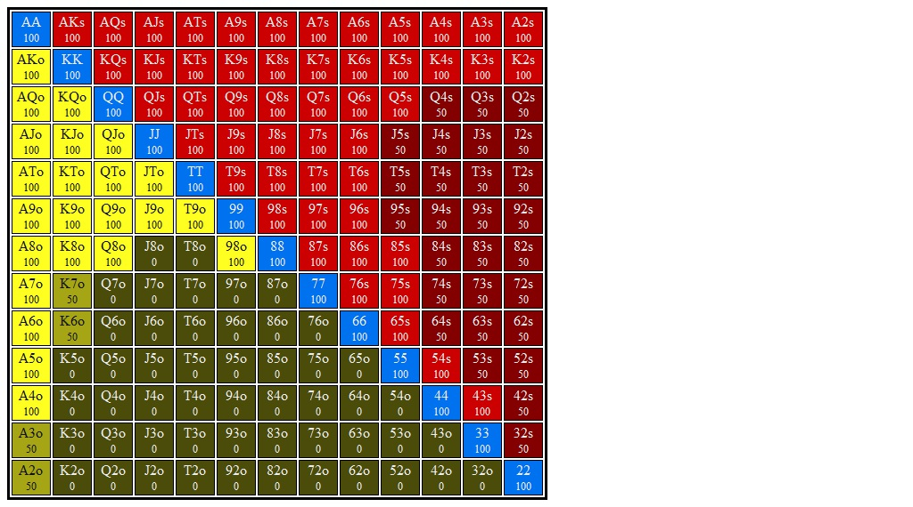
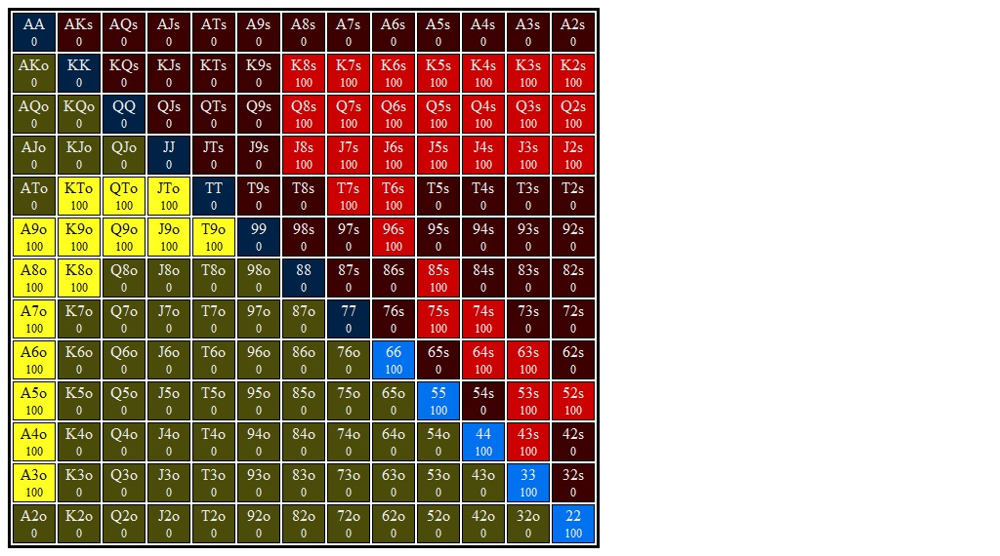

# Flop 3: <b>7&spades;6&spades;6&diams;</b>

## Hero's Smallblind Opens and Bigblind Calls Range

## Villain's Button 3Bet Range vs Lojack Open Range

## Flop Questions

### 1. **Approximate each player's equity. Who has the equity advantage?**

### 2. **What are the weakest hands in your range that could go all in on the flop? Go for three streets of value on blank turns?**

### 3. **Which player has the nuts advantage?**

### 4. **How static or dynamic is this flop? What aspects of this flop make it more static or dynamic?  How do these aspects interact with one another?**

### 5. **Do you want to develop a betting range? Which hands prefer to bet?**

### 6. **Do you want to develop a checking range? If so, estimate a x/f, x/c, and x/r range?**

### 7. **Suppose you check and villain checks behind. What are the best and worst turn cards for your range? Do any give you an equity advantage? A nuts advantage? Uncap your range?**

### 8. **Suppose you check, villain bets 1/3 pot, and you call. What are the best and worst turn cards for your range? Do any give you an equity advantage? A nuts advantage? Uncap your range?**

## Hands for flop 7&spades;6&spades;6&diams;
### Combo 1. <b>Q&diams;7&diams;</b>    (Flop: 7&spades;6&spades;6&diams;)

1. **Do you ever check/fold this hand?**

2. **Do you ever check/call this hand? If so, discuss your turn strategy.**

3. **Do you ever check/raise this hand? If so, should you expect better hands to fold? Worse hands to call? Which hands? Discuss your strategy when reraised. Discuss your turn strategy when called.**

4. **Does this hand benefit from protection bet?**

5. **Which aspects of this hand want to grow the pot? Which aspects want to play a smaller pot? How do they interact?**

6. **Does this hand ever bet? Which sizes should you choose (1/3 pot, 2/3 pot, 5/4 pot)? What is your strategy after getting called? After getting raised?**

7. **Suppose you check the flop and villain checks behind. Discuss your turn strategy.**

### Combo 2. <b>4&diams;3&diams;</b>    (Flop: 7&spades;6&spades;6&diams;)

1. **Do you ever check/fold this hand?**

2. **Do you ever check/call this hand? If so, discuss your turn strategy.**

3. **Do you ever check/raise this hand? If so, should you expect better hands to fold? Worse hands to call? Which hands? Discuss your strategy when reraised. Discuss your turn strategy when called.**

4. **Does this hand benefit from protection bet?**

5. **Which aspects of this hand want to grow the pot? Which aspects want to play a smaller pot? How do they interact?**

6. **Does this hand ever bet? Which sizes should you choose (1/3 pot, 2/3 pot, 5/4 pot)? What is your strategy after getting called? After getting raised?**

7. **Suppose you check the flop and villain checks behind. Discuss your turn strategy.**

### Combo 3. <b>Q&clubs;8&clubs;</b>    (Flop: 7&spades;6&spades;6&diams;)

1. **Do you ever check/fold this hand?**

2. **Do you ever check/call this hand? If so, discuss your turn strategy.**

3. **Do you ever check/raise this hand? If so, should you expect better hands to fold? Worse hands to call? Which hands? Discuss your strategy when reraised. Discuss your turn strategy when called.**

4. **Does this hand benefit from protection bet?**

5. **Which aspects of this hand want to grow the pot? Which aspects want to play a smaller pot? How do they interact?**

6. **Does this hand ever bet? Which sizes should you choose (1/3 pot, 2/3 pot, 5/4 pot)? What is your strategy after getting called? After getting raised?**

7. **Suppose you check the flop and villain checks behind. Discuss your turn strategy.**

### Combo 4. <b>K&spades;J&spades;</b>    (Flop: 7&spades;6&spades;6&diams;)

1. **Do you ever check/fold this hand?**

2. **Do you ever check/call this hand? If so, discuss your turn strategy.**

3. **Do you ever check/raise this hand? If so, should you expect better hands to fold? Worse hands to call? Which hands? Discuss your strategy when reraised. Discuss your turn strategy when called.**

4. **Does this hand benefit from protection bet?**

5. **Which aspects of this hand want to grow the pot? Which aspects want to play a smaller pot? How do they interact?**

6. **Does this hand ever bet? Which sizes should you choose (1/3 pot, 2/3 pot, 5/4 pot)? What is your strategy after getting called? After getting raised?**

7. **Suppose you check the flop and villain checks behind. Discuss your turn strategy.**

### Combo 5. <b>A&diams;Q&clubs;</b>    (Flop: 7&spades;6&spades;6&diams;)

1. **Do you ever check/fold this hand?**

2. **Do you ever check/call this hand? If so, discuss your turn strategy.**

3. **Do you ever check/raise this hand? If so, should you expect better hands to fold? Worse hands to call? Which hands? Discuss your strategy when reraised. Discuss your turn strategy when called.**

4. **Does this hand benefit from protection bet?**

5. **Which aspects of this hand want to grow the pot? Which aspects want to play a smaller pot? How do they interact?**

6. **Does this hand ever bet? Which sizes should you choose (1/3 pot, 2/3 pot, 5/4 pot)? What is your strategy after getting called? After getting raised?**

7. **Suppose you check the flop and villain checks behind. Discuss your turn strategy.**

### Combo 6. <b>7&clubs;4&clubs;</b>    (Flop: 7&spades;6&spades;6&diams;)

1. **Do you ever check/fold this hand?**

2. **Do you ever check/call this hand? If so, discuss your turn strategy.**

3. **Do you ever check/raise this hand? If so, should you expect better hands to fold? Worse hands to call? Which hands? Discuss your strategy when reraised. Discuss your turn strategy when called.**

4. **Does this hand benefit from protection bet?**

5. **Which aspects of this hand want to grow the pot? Which aspects want to play a smaller pot? How do they interact?**

6. **Does this hand ever bet? Which sizes should you choose (1/3 pot, 2/3 pot, 5/4 pot)? What is your strategy after getting called? After getting raised?**

7. **Suppose you check the flop and villain checks behind. Discuss your turn strategy.**

### Combo 7. <b>K&diams;T&diams;</b>    (Flop: 7&spades;6&spades;6&diams;)

1. **Do you ever check/fold this hand?**

2. **Do you ever check/call this hand? If so, discuss your turn strategy.**

3. **Do you ever check/raise this hand? If so, should you expect better hands to fold? Worse hands to call? Which hands? Discuss your strategy when reraised. Discuss your turn strategy when called.**

4. **Does this hand benefit from protection bet?**

5. **Which aspects of this hand want to grow the pot? Which aspects want to play a smaller pot? How do they interact?**

6. **Does this hand ever bet? Which sizes should you choose (1/3 pot, 2/3 pot, 5/4 pot)? What is your strategy after getting called? After getting raised?**

7. **Suppose you check the flop and villain checks behind. Discuss your turn strategy.**

### Combo 8. <b>5&spades;3&spades;</b>    (Flop: 7&spades;6&spades;6&diams;)

1. **Do you ever check/fold this hand?**

2. **Do you ever check/call this hand? If so, discuss your turn strategy.**

3. **Do you ever check/raise this hand? If so, should you expect better hands to fold? Worse hands to call? Which hands? Discuss your strategy when reraised. Discuss your turn strategy when called.**

4. **Does this hand benefit from protection bet?**

5. **Which aspects of this hand want to grow the pot? Which aspects want to play a smaller pot? How do they interact?**

6. **Does this hand ever bet? Which sizes should you choose (1/3 pot, 2/3 pot, 5/4 pot)? What is your strategy after getting called? After getting raised?**

7. **Suppose you check the flop and villain checks behind. Discuss your turn strategy.**

### Combo 9. <b>Q&spades;T&clubs;</b>    (Flop: 7&spades;6&spades;6&diams;)

1. **Do you ever check/fold this hand?**

2. **Do you ever check/call this hand? If so, discuss your turn strategy.**

3. **Do you ever check/raise this hand? If so, should you expect better hands to fold? Worse hands to call? Which hands? Discuss your strategy when reraised. Discuss your turn strategy when called.**

4. **Does this hand benefit from protection bet?**

5. **Which aspects of this hand want to grow the pot? Which aspects want to play a smaller pot? How do they interact?**

6. **Does this hand ever bet? Which sizes should you choose (1/3 pot, 2/3 pot, 5/4 pot)? What is your strategy after getting called? After getting raised?**

7. **Suppose you check the flop and villain checks behind. Discuss your turn strategy.**

### Combo 10. <b>Q&spades;J&spades;</b>    (Flop: 7&spades;6&spades;6&diams;)

1. **Do you ever check/fold this hand?**

2. **Do you ever check/call this hand? If so, discuss your turn strategy.**

3. **Do you ever check/raise this hand? If so, should you expect better hands to fold? Worse hands to call? Which hands? Discuss your strategy when reraised. Discuss your turn strategy when called.**

4. **Does this hand benefit from protection bet?**

5. **Which aspects of this hand want to grow the pot? Which aspects want to play a smaller pot? How do they interact?**

6. **Does this hand ever bet? Which sizes should you choose (1/3 pot, 2/3 pot, 5/4 pot)? What is your strategy after getting called? After getting raised?**

7. **Suppose you check the flop and villain checks behind. Discuss your turn strategy.**
