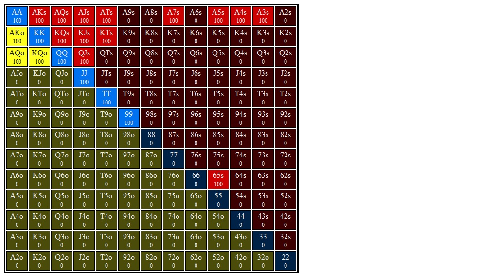

# Flop 3: <b>7&spades;6&spades;6&diams;</b>

## Hero's Lojack OOP 3Bet Call Range Range

## Villain's Button 3Bet Range vs Lojack Open Range

## Flop Questions

### 1. **Approximate each player's equity. Who has the equity advantage?**

### 2. **What are the weakest hands in your range that could go all in on the flop? Go for three streets of value on blank turns?**

### 3. **Which player has the nuts advantage?**

### 4. **How static or dynamic is this flop? What aspects of this flop make it more static or dynamic?  How do these aspects interact with one another?**

### 5. **What are some hands that prefer to check/fold?**

### 6. **What are some hands that prefer to check/call?**

### 7. **What are some hands that prefer to check/raise?**

### 8. **Do any hands ever donk? If so, which ones?**

### 9. **Suppose you check and villain checks behind. What are the best and worst turn cards for your range? Do any give you an equity advantage? A nuts advantage? Uncap your range?**

### 10. **Suppose you check, villain bets 1/3 pot, and you call. What are the best and worst turn cards for your range? Do any give you an equity advantage? A nuts advantage? Uncap your range?**

## Hands for flop 7&spades;6&spades;6&diams;
### Combo 1. <b>8&diams;8&clubs;</b>    (Flop: 7&spades;6&spades;6&diams;)

1. **Do you ever check/fold this hand?**

2. **Do you ever check/call this hand?**

3. **If you check/raise this hand should you expect better hands to fold? If so, which hands?**

4. **If you check/raise this hand should you expect worse hands to call? If so, which hands?**

5. **Does this hand ever donk bet 1/2 pot?**

6. **Does this hand benefit from protection bet?**

7. **Does this hand benefit from growing the pot?**

8. **How is this hand doing if you check/raise and get called? What parts of villain's range are you ahead of? Behind?**

9. **How is this hand doing against a bet or raise when you check or bet respectively?**

10. **Suppose you check the flop and villain checks behind. What are the best and worst turn cards for this hand?**

11. **Suppose you check the flop, villain bets 1/3 pot, and and you call behind. What are the best and worst turn cards for this hand?**

### Combo 2. <b>K&clubs;J&clubs;</b>    (Flop: 7&spades;6&spades;6&diams;)

1. **Do you ever check/fold this hand?**

2. **Do you ever check/call this hand?**

3. **If you check/raise this hand should you expect better hands to fold? If so, which hands?**

4. **If you check/raise this hand should you expect worse hands to call? If so, which hands?**

5. **Does this hand ever donk bet 1/2 pot?**

6. **Does this hand benefit from protection bet?**

7. **Does this hand benefit from growing the pot?**

8. **How is this hand doing if you check/raise and get called? What parts of villain's range are you ahead of? Behind?**

9. **How is this hand doing against a bet or raise when you check or bet respectively?**

10. **Suppose you check the flop and villain checks behind. What are the best and worst turn cards for this hand?**

11. **Suppose you check the flop, villain bets 1/3 pot, and and you call behind. What are the best and worst turn cards for this hand?**

### Combo 3. <b>K&spades;Q&spades;</b>    (Flop: 7&spades;6&spades;6&diams;)

1. **Do you ever check/fold this hand?**

2. **Do you ever check/call this hand?**

3. **If you check/raise this hand should you expect better hands to fold? If so, which hands?**

4. **If you check/raise this hand should you expect worse hands to call? If so, which hands?**

5. **Does this hand ever donk bet 1/2 pot?**

6. **Does this hand benefit from protection bet?**

7. **Does this hand benefit from growing the pot?**

8. **How is this hand doing if you check/raise and get called? What parts of villain's range are you ahead of? Behind?**

9. **How is this hand doing against a bet or raise when you check or bet respectively?**

10. **Suppose you check the flop and villain checks behind. What are the best and worst turn cards for this hand?**

11. **Suppose you check the flop, villain bets 1/3 pot, and and you call behind. What are the best and worst turn cards for this hand?**

### Combo 4. <b>A&diams;Q&spades;</b>    (Flop: 7&spades;6&spades;6&diams;)

1. **Do you ever check/fold this hand?**

2. **Do you ever check/call this hand?**

3. **If you check/raise this hand should you expect better hands to fold? If so, which hands?**

4. **If you check/raise this hand should you expect worse hands to call? If so, which hands?**

5. **Does this hand ever donk bet 1/2 pot?**

6. **Does this hand benefit from protection bet?**

7. **Does this hand benefit from growing the pot?**

8. **How is this hand doing if you check/raise and get called? What parts of villain's range are you ahead of? Behind?**

9. **How is this hand doing against a bet or raise when you check or bet respectively?**

10. **Suppose you check the flop and villain checks behind. What are the best and worst turn cards for this hand?**

11. **Suppose you check the flop, villain bets 1/3 pot, and and you call behind. What are the best and worst turn cards for this hand?**

### Combo 5. <b>K&clubs;T&clubs;</b>    (Flop: 7&spades;6&spades;6&diams;)

1. **Do you ever check/fold this hand?**

2. **Do you ever check/call this hand?**

3. **If you check/raise this hand should you expect better hands to fold? If so, which hands?**

4. **If you check/raise this hand should you expect worse hands to call? If so, which hands?**

5. **Does this hand ever donk bet 1/2 pot?**

6. **Does this hand benefit from protection bet?**

7. **Does this hand benefit from growing the pot?**

8. **How is this hand doing if you check/raise and get called? What parts of villain's range are you ahead of? Behind?**

9. **How is this hand doing against a bet or raise when you check or bet respectively?**

10. **Suppose you check the flop and villain checks behind. What are the best and worst turn cards for this hand?**

11. **Suppose you check the flop, villain bets 1/3 pot, and and you call behind. What are the best and worst turn cards for this hand?**

### Combo 6. <b>T&spades;T&clubs;</b>    (Flop: 7&spades;6&spades;6&diams;)

1. **Do you ever check/fold this hand?**

2. **Do you ever check/call this hand?**

3. **If you check/raise this hand should you expect better hands to fold? If so, which hands?**

4. **If you check/raise this hand should you expect worse hands to call? If so, which hands?**

5. **Does this hand ever donk bet 1/2 pot?**

6. **Does this hand benefit from protection bet?**

7. **Does this hand benefit from growing the pot?**

8. **How is this hand doing if you check/raise and get called? What parts of villain's range are you ahead of? Behind?**

9. **How is this hand doing against a bet or raise when you check or bet respectively?**

10. **Suppose you check the flop and villain checks behind. What are the best and worst turn cards for this hand?**

11. **Suppose you check the flop, villain bets 1/3 pot, and and you call behind. What are the best and worst turn cards for this hand?**

### Combo 7. <b>J&hearts;J&diams;</b>    (Flop: 7&spades;6&spades;6&diams;)

1. **Do you ever check/fold this hand?**

2. **Do you ever check/call this hand?**

3. **If you check/raise this hand should you expect better hands to fold? If so, which hands?**

4. **If you check/raise this hand should you expect worse hands to call? If so, which hands?**

5. **Does this hand ever donk bet 1/2 pot?**

6. **Does this hand benefit from protection bet?**

7. **Does this hand benefit from growing the pot?**

8. **How is this hand doing if you check/raise and get called? What parts of villain's range are you ahead of? Behind?**

9. **How is this hand doing against a bet or raise when you check or bet respectively?**

10. **Suppose you check the flop and villain checks behind. What are the best and worst turn cards for this hand?**

11. **Suppose you check the flop, villain bets 1/3 pot, and and you call behind. What are the best and worst turn cards for this hand?**

### Combo 8. <b>J&hearts;T&hearts;</b>    (Flop: 7&spades;6&spades;6&diams;)

1. **Do you ever check/fold this hand?**

2. **Do you ever check/call this hand?**

3. **If you check/raise this hand should you expect better hands to fold? If so, which hands?**

4. **If you check/raise this hand should you expect worse hands to call? If so, which hands?**

5. **Does this hand ever donk bet 1/2 pot?**

6. **Does this hand benefit from protection bet?**

7. **Does this hand benefit from growing the pot?**

8. **How is this hand doing if you check/raise and get called? What parts of villain's range are you ahead of? Behind?**

9. **How is this hand doing against a bet or raise when you check or bet respectively?**

10. **Suppose you check the flop and villain checks behind. What are the best and worst turn cards for this hand?**

11. **Suppose you check the flop, villain bets 1/3 pot, and and you call behind. What are the best and worst turn cards for this hand?**

### Combo 9. <b>A&hearts;J&hearts;</b>    (Flop: 7&spades;6&spades;6&diams;)

1. **Do you ever check/fold this hand?**

2. **Do you ever check/call this hand?**

3. **If you check/raise this hand should you expect better hands to fold? If so, which hands?**

4. **If you check/raise this hand should you expect worse hands to call? If so, which hands?**

5. **Does this hand ever donk bet 1/2 pot?**

6. **Does this hand benefit from protection bet?**

7. **Does this hand benefit from growing the pot?**

8. **How is this hand doing if you check/raise and get called? What parts of villain's range are you ahead of? Behind?**

9. **How is this hand doing against a bet or raise when you check or bet respectively?**

10. **Suppose you check the flop and villain checks behind. What are the best and worst turn cards for this hand?**

11. **Suppose you check the flop, villain bets 1/3 pot, and and you call behind. What are the best and worst turn cards for this hand?**

### Combo 10. <b>9&hearts;9&clubs;</b>    (Flop: 7&spades;6&spades;6&diams;)

1. **Do you ever check/fold this hand?**

2. **Do you ever check/call this hand?**

3. **If you check/raise this hand should you expect better hands to fold? If so, which hands?**

4. **If you check/raise this hand should you expect worse hands to call? If so, which hands?**

5. **Does this hand ever donk bet 1/2 pot?**

6. **Does this hand benefit from protection bet?**

7. **Does this hand benefit from growing the pot?**

8. **How is this hand doing if you check/raise and get called? What parts of villain's range are you ahead of? Behind?**

9. **How is this hand doing against a bet or raise when you check or bet respectively?**

10. **Suppose you check the flop and villain checks behind. What are the best and worst turn cards for this hand?**

11. **Suppose you check the flop, villain bets 1/3 pot, and and you call behind. What are the best and worst turn cards for this hand?**
