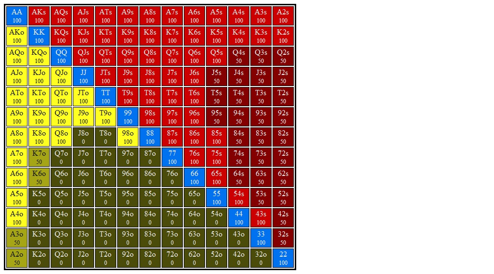

# Section 1: Sb opens, Bb Calls

Blinds are $0.05/$0.10. Effective stacks are $10.00. You're in the Sb. Action folds to you and you open for $0.30 (3bb). Bb calls and go to the flop with $9.70 behind and a pot of $0.60. Action is on you
### Player Ranges

#### Hero's Smallblind Opens and Bigblind Calls Range

#### Villain's Button 3Bet Range vs Lojack Open Range

## Flop 1: [<b>A&spades;T&diams;5&clubs;</b>](AsTd5c.md)
## Flop 2: [<b>T&spades;4&spades;2&spades;</b>](Ts4s2s.md)
## Flop 3: [<b>7&spades;6&spades;6&diams;</b>](7s6s6d.md)
## Flop 4: [<b>Q&spades;8&diams;6&spades;</b>](Qs8d6s.md)
## Flop 5: [<b>8&spades;5&diams;3&diams;</b>](8s5d3d.md)
## Flop 6: [<b>K&spades;5&diams;2&spades;</b>](Ks5d2s.md)
## Flop 7: [<b>Q&spades;Q&diams;J&clubs;</b>](QsQdJc.md)
## Flop 8: [<b>J&spades;3&diams;2&clubs;</b>](Js3d2c.md)
## Flop 9: [<b>Q&spades;T&diams;7&spades;</b>](QsTd7s.md)
## Flop 10: [<b>T&spades;9&diams;6&diams;</b>](Ts9d6d.md)
## Flop 11: [<b>A&spades;8&diams;4&spades;</b>](As8d4s.md)
## Flop 12: [<b>K&spades;J&diams;4&diams;</b>](KsJd4d.md)
## Flop 13: [<b>A&spades;7&spades;2&diams;</b>](As7s2d.md)
## Flop 14: [<b>9&spades;4&diams;3&clubs;</b>](9s4d3c.md)
## Flop 15: [<b>K&spades;9&diams;7&clubs;</b>](Ks9d7c.md)

