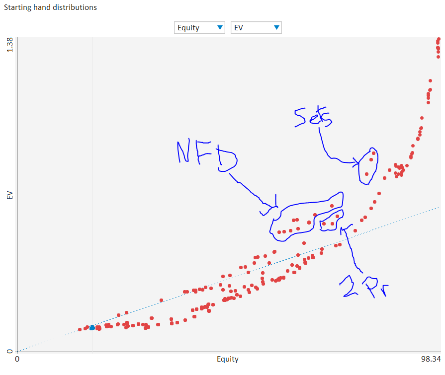
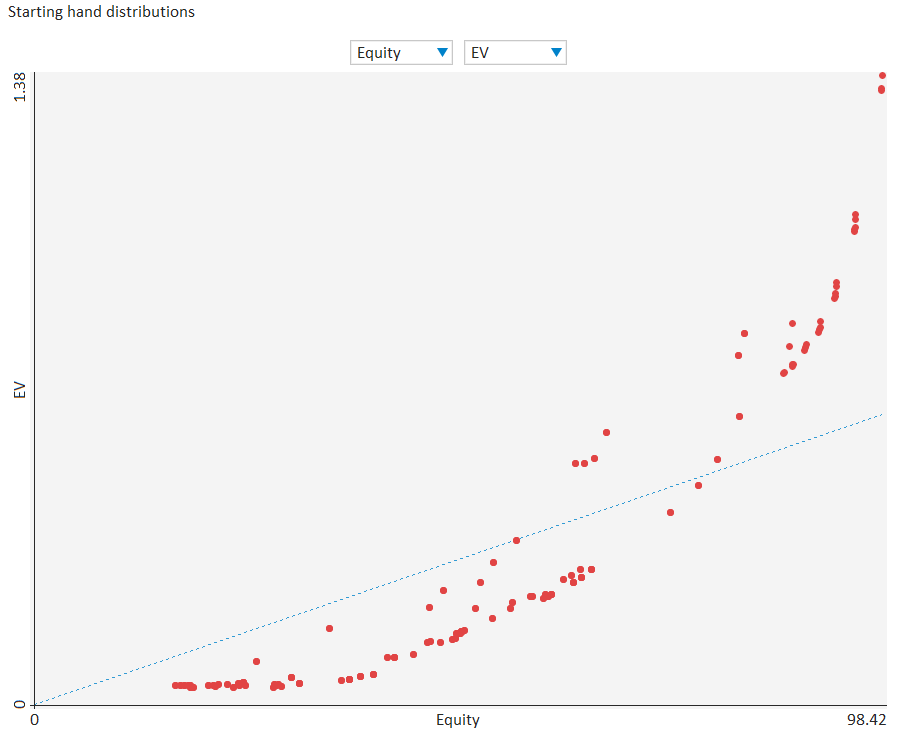
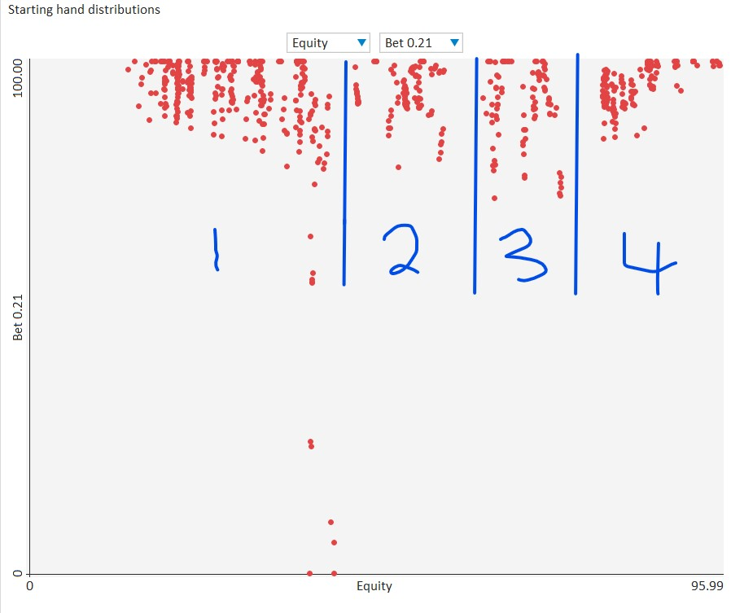

# Flop 2: <b>T<span style="color:#000000;">&spades;</span>4<span style="color:#000000;">&spades;</span>2<span style="color:#000000;">&spades;</span></b>

## Hero's Button Opening Range Range


## Villain's Big Blind Calling Range vs Button Range


## Flop Questions

### 1. **Approximate each player's equity. Who has the equity advantage?**

Bn: 52%

Bb: 48%

+ **From the solver:** Bn: 51%, Bb: 49%.

### 2. **Give a qualitative description of how each player's range interacts with the board?**

This is a monotone board, and that means that this hand will be largely about
flushes and strong flush draws. Both players should have a similar percentage
of flopped flushes (BB has maybe a slightly higher percentage), and both players
should have a similar percentage of nut flush draws. Bn has more K-high flush
draws.

To give solid numbers, I'd say that Bn has about 10% flushes, Bb has maybe
12-13% flushes. Bn has more nut flushes than Bb.

Outside of flushes, Bn has a all the sets and Bb has bottom and middle set.
Given Bb's smaller range Bb should actually have a higher percentage of sets
compared to Bn.

There are no straights on board,  but there are some straight draws, including
A3, A5, 53, 65. These look like they should be about even in number, which means
that Bb should have about 2x the percentage of straight draws.

### 3. **What are the weakest hands that could go all in on the flop? Go for three streets of value on blank turns?**

It's going to be hard to go all in on the flop without a strong flush. Does top
set go all in? Yeah, because there might be some nut flush draws out there
bluffing, and because we have some equity against flushes. I think some pairs
with the A&spades; call off, but they don't shove.

Straight draws don't call off, and they don't shove either.

I'm not sure what BB's strat looks like but I wouldn't be surprised if they
could come after us pretty hard because of the number of flushes and strong
semi-bluffs in their range.

+ **From the solver:** As I suspected, it's hard to find hands that raise enough
  early on to be in a situation to call. NFDs mix call/fold, and nut flushes/2nd
  nut flushes call. In total, only about 2 combos go all in (either from calling
  or from shoving). This might have to do with the tree I used, and I'd be
  interested to see how this changes if I allow myself a larger tree.

  A&spades;2 shoves all in after `x/bet 0.21/raise 0.75/raise 1.8/raise 4.3`.
  I'm not sure why...we do block bottom set, but that only makes up 0.07/3.81
  combos (or 2%) of Bb's range here. But I guess that's why A&spades;2 is a
  pure shove while A&spades;9 is a pure fold.

  
### 4. **Which player has the nuts advantage?**

This is tricky. Bn has more nutted hands, but I think Bb has slightly
more flushes (relative to range size). Both players have a similar percentage
of sets. I'd give a weak nod to Bb for the nuts advantage here.

+ **From the solver:** I forget  exactly how MPT classifies this, but I
  used a bucketting system where hands that had at  least 80% equity against
  the opponent's range were considered 'nutted'. 

  + **Bn:** 10.8% of range (75 of 696 combos) beat 80% of Bb's range
  + **Bb:** 12.2% of range (36 of 294 combos) beat 80% of Bn's range

  Bb  has a slight nuts advantage using this metric, but it may change
  depending on what my cutoff is.

### 5. **How static or dynamic is this flop? What aspects of this flop make it more static or dynamic?  How do these aspects interact with one another?**

While T-high is a dynamic characteristic, the fact is that making top pair
won't make much of a difference in EV in this hand. There are very few cards
that can come that will change how much money a hand wants to get in. A few
straights might come in, but those won't want to get stacks in given the threat
of a flush on the board. A paired board turns a set into a boat/quads, and that
will change that hand's incentive, but sets are rare so this doesn't contribute
too much to this boar'ds dynamism.

On the other hand, there are a fair number of flushes already out there. The
main hand that can improve is a flush draw, but even then a weak flush draw
can't put too much money in the pot because they will be up against better
flush draws.

Thus I think this is a very static flop: most hands won't change strength on
most turns.


### 6. **On this flop do you prefer to bet small or large?  With what frequencies would you check and bet?**

Small. I don't have a nuts advantage, range advantage is pretty even, and
polarizing won't give very many of their hands tough choices. If I bet big
with the nuts I'll be folding out a lot of their medium-strength hands that
I want to get value from, and if I have the A&spades; then I'm blocking a lot
of the draws I want to get payed by. K&spades; is still out there, so maybe
I get payed by that, but this hand doesn't want to put as much money in the pot.

As for frequencies, I should definitely develop a substantial checking range.
I want to cbet most of my flushes and strong flush draws, but I want to
protect my checking range, and hands like A&spades;K&spades;, A&spades;Q&spades;
are blocking some of the drawing hands I want to get value from, so I might
consider a check at some frequency.

Pairs and pairs + draws can check comfortably. They don't want to grow the pot,
and they do poorly against a check raise (especially a pair w/ no draw). Straight
draws probably want to bet, w/ or without a flush draw, because they value fold
equity.

I think Bn checks about 60% and bets small about 40%.

+ **From the solver:** The solver chooses to bet 40% frequency, usually small
  (about 38%) and large (about 2%).

  Flush draws are split pretty evenly between betting and checking. A possible
  heuristic to construct this range is to either randomize 50/50, or to sum the
  ranks of the cards and cbet odd sums and check even sums. The second is a bit
  more exploitable, but not really, and not at the games I'm playing in.

  With pair + flush draws we  are betting nut flush draws with pairs like
  A&spades;T&diams;, A&spades;4&diams; at a high  frequency (but not as much
  A&spades;2&diams;). Overpairs with a spade bet a fair amount, and JJ w/ or
  w/out a spade bet around 70%.

  Straight draws mix calling and betting. I guess this makes sense because we want
  our checking range to be robust against 

### 7. **Say you adopt a strategy where you either bet with your preferred sizing or check. You choose to bet and villain calls. What are the best and worst turn cards for your range?**

Hmm, I'm actually not sure here. I'm betting smaller, so I'm going to be betting some of my pairs, and those don't want to see another spade (unless it's a pair w/
a spade). I'm also betting a lot of flushes/flush draws, and those are pretty okay
with another spade (but not baby flushes). I think I'll have a somewhat linear
range on the turn, and a spade doesn't like to see that because villain's
calling range now uncaps quite a bit.

Board pairing cards also aren't great for range.

+ **From the solver:** We are betting linear, but when BB calls we have about
  42% equity. We are at a significant equity disadvantage. Villain has a nuts
  advantage as well, with 12.5% of their range being flushes (these have >80%
  equity vs our range) while we have about 9% flushes. When a spade comes, this
  blocks some of their flushes and also serves to uncap our range considerably.

  + **Best Turns:** Any spade other than A&spades;. The A&spades; blocks a lot of
    our flushes and flush draws (Of about 66 flushdraw combos, 18 of them are
    NFDs, and another 10 are 2nd NFDs). Also, Bb has more Ax in their calling
    range than we do in our betting range, so they tend to have more top pair
    when any A, including A&spades;, comes.

  + **Worst Turns:** Board pairing and non-spade low cards that complete
    straights and make 2-pair and sets.
 
## Hands for flop T<span style="color:#000000;">&spades;</span>4<span style="color:#000000;">&spades;</span>2<span style="color:#000000;">&spades;</span>
### Combo 1. <b>K<span style="color:#ff0000;">&hearts;</span>T<span style="color:#ff0000;">&hearts;</span></b>    (Flop: T<span style="color:#000000;">&spades;</span>4<span style="color:#000000;">&spades;</span>2<span style="color:#000000;">&spades;</span>)

1. **Estimate this hand's equity against villain's range. Estimate it's EV. Does this hand over-realize or under-realize it's equity?**

   This hand should have around 60% equity, but this should be under-realized.
   I'd expect the EV to be around $0.33 in a pot of $0.65

   + **From the solver:** 
     + Equity: 67%,
     + EV: $0.39 = 60% of pot
     + EqR: 39/67 = 90%

2. **If you bet this hand should you expect better hands to fold? If so, which hands?**

    No.

    + **From the solver:** facing a small bet villain is not folding any pairs.

3. **If you bet this hand should you expect worse hands to call? If so, which hands?**

    Worse pairs should be calling, as well as some drawing hands (though these
    have plenty of equity against us)

    + **From the solver:** Villain calls all pairs. We are beating everything
      except KTo, which we tie with. Villain is also calling QJo, with or
      without a spade, which does fairly well against us and can bluff us
      a lot on many runouts.

4. **Does this hand benefit from a protection bet? Explain.**

    We aren't folding out any strong draws, we are are going to get folds from
    some random Jx/Qx/Ax which we are happy to see.

    + **From the solver:** Yup.

5. **Does this hand benefit from growing the pot? How so?**

    This hand is doing okay after a single small bet goes into the pot but
    will have to give up on a lot of runouts. This hand certainly doesn't
    want to play a big pot.

6. **How is this hand doing if you bet and get called? What parts of villain's range are you ahead of? Behind?**

    This hand should be doing okay, but not great, when called. It should
    probably under-realize equity given the board and it's strength.

    + **From the solver:** This hand has 57% equity vs villain's calling range
      but only takes about 1/2 the pot and under-realizes it's equity by a fair
      amount (not surprising).

7. **How is this hand doing against a check-raise?**

    Not very well. I think it should maybe call at equilibrium at some frequency,
    but not surprised if it's a mix. I'd imagine a x/r from villain should be
    making exactly this sort of hand indifferent, or close to indifferent.

    + **From the solver:** Yup, this hand is just about indifferent (EV = 0.02) when
      check-raised. We always call.

8. **What are this hand's incentives on this flop? Does it want to bet or check? If it wants to bet, what sizing does it prefer? Do these incentives line up with the strategy you proposed for your range above?**

    High level incentives:
    1. **Protection:** this hand is decent now but won't be on later streets. If
       we can get overcards or weak flush draws to fold we are happy about this.
       I'm not sure if we get any flush draws to fold here, but maybe something
       like Qx9&spades;? Or Ax7&spades;? The Q9 has some backdoor straight
       equity as well, which might make it call, while A7 has some backdoor
       straight equity as well as an A, so with the flush draw these probably
       both call at some frequency.

    2. **Value:** We can get worse to call. worse pairs call, and some straight
       draws call as well, though we'll have to be careful on most runouts. Still,
       we'd prefer to get a small value bet in now before bad cards come, and can
       get draws to commit some chips while they are still drawing. They won't
       pay us on the river.

    I don't think this hand is a particularly great bluff catcher. I believe
    this hand's dynamics will center around flushes, and then around straight
    draws and sets. We don't really block anything in villain's range that we
    care about.

    If we check we can easily get bluffed off the best hand, and facing a small
    bet a lot of hands that might otherwise bluff us will have to fold.
    We can also get some value from worse hands. Since we are betting a linear
    range, this hand falls naturally into that range. I think we bet, with
    intention of calling a raise or a bet on blank turns. I don't think we put
    more than 2 bets in this pot, and 2 small ones at that.

    + **From the solver:** After a check/raise/call we fold on just about any turn
      that isn't a K, T, 4, or 2. Basically if we can draw to a boat on the river
      we will call a smaller bet. Against a larger bet we only call a T (and sometimes
      raise a T)

      On blank runouts K&hearts;T&hearts; calls small bets on most rivers. (F:
      x/b/c. T: x/x. R: b/c). This comports with my understanding of this hand's
      strengths. It would be fun to qunatify this somehow.

### Combo 2. <b>A<span style="color:#0088ff;">&diams;</span>8<span style="color:#008800;">&clubs;</span></b>    (Flop: T<span style="color:#000000;">&spades;</span>4<span style="color:#000000;">&spades;</span>2<span style="color:#000000;">&spades;</span>)

1. **Estimate this hand's equity against villain's range. Estimate it's EV. Does this hand over-realize or under-realize it's equity?**

   Probably around 45% equity, but I'm guessing EV is around $0.20, severely
   under-realizing it's equity.

   + **From the solver:** 
     + Equity: 39%
     + EV: $0.14 (21% of pot)
     + EqR: 21% / 39% = 53%

2. **If you bet this hand should you expect better hands to fold? If so, which hands?**

   Not really, maybe like an A9 w/out a spade? But that's about it.

3. **If you bet this hand should you expect worse hands to call? If so, which hands?**

   No. There are hands w/ less showdown than us but with plenty of equity that can bluff us
   off.

4. **Does this hand benefit from a protection bet? Explain.**

   A-high has marginal showdown and can be best a lot of the time. By getting folds
   from any two cards (we don't dominate) then we prevent random pairs.

5. **Does this hand benefit from growing the pot? How so?**

   No. Maybe we hit an A on the turn, and we'll be a bit more comfortable w/
   putting more money in, but even when we run out like AA or A8 no spade we
   still don't feel great.

6. **How is this hand doing if you bet and get called? What parts of villain's range are you ahead of? Behind?**

   We are doing very bad.

7. **How is this hand doing against a check-raise?**
    
    Horribly, pure fold.

8. **What are this hand's incentives on this flop? Does it want to bet or check? If it wants to bet, what sizing does it prefer? Do these incentives line up with the strategy you proposed for your range above?**

   This hand doesn't want to put much, if any, money in. It is a natural checking candidate,
   but it also might benefit from a protection bet. It has a bit too much showdown to be a
   great bluffing candidate at this point, but we could turn it into a bluff on
   later streets, maybe like a 9,7 runout (we block the straight), and on a 3 or
   5 runout (we have a wheel draw).

   I'd put this hand into my bet/give upt range.

9. **Suppose you take your preferred action from the last question (check or bet the preferred size). If this is a bet, suppose villain calls. What are the best and worst turn cards for this hand?**

   Best turns are any non-spade A/8. A 3 or a 5 gives us a draw as well, but to the bottom end
   of the straight.

### Combo 3. <b>4<span style="color:#ff0000;">&hearts;</span>3<span style="color:#ff0000;">&hearts;</span></b>    (Flop: T<span style="color:#000000;">&spades;</span>4<span style="color:#000000;">&spades;</span>2<span style="color:#000000;">&spades;</span>)

1. **Estimate this hand's equity against villain's range. Estimate it's EV. Does this hand over-realize or under-realize it's equity?**

   This hand has less equity than K&hearts;T&hearts; (67%) but more than
   A&diams;8&clubs; (39%), probably around 55%. It still under-realizes its
   equity, but I think less so than K&hearts;T&hearts; since it has a backdoor
   draw. I'm guessing `EqR = (EV/pot)/Eq = 0.91`, so
   ```
   EV = 0.91 * 0.65 * Eq 
      = 0.91 * 0.65 * 0.58 
      = 0.33
   ```

   + **From the solver:** 
     + Equity: 49%
     + EV: $0.23 (35% of pot)
     + EqR: 35% / 49% = 71%
   
      Yikes, I was way off. This hand significantly under-realizes equity, and
      the backdoor draw does very little to help. I guess that makes sense,
      since there are few clean runouts, and we aren't drawing to the nuts.
   
2. **If you bet this hand should you expect better hands to fold? If so, which hands?**

   No. Bb should be calling with a pair or better.


3. **If you bet this hand should you expect worse hands to call? If so, which hands?**

   Some A-high, some backdoor draws (like QJ), but nothing that we have solidly beat. We are also blocking some draws like 53 that might call.

4. **Does this hand benefit from a protection bet? Explain.**

   Yeah, just about any turn is bad for us.

5. **Does this hand benefit from growing the pot? How so?**

   Not on most runouts. If the runout is A,5 no spade and Bb isn't playing aggressively then
   we can consider polarizing on the river, but on most runouts we want to play smaller pots.

   This hand _could_ be turned into a bluff on the turn.

6. **How is this hand doing if you bet and get called? What parts of villain's range are you ahead of? Behind?**

   We are doing very poorly when called. I'd guess we have less than 40% equity when called.

   + **From the solver:** We have around 35% equity but ev of 0.27 in a pot of 1.08, seriously
     underrealizing equity.

7. **How is this hand doing against a check-raise?**

   Very bad. If we bet and get x/r then I think we fold this. We do have a backdoor draw, but not a good one, and probably not enough to justify continuing

   + **From the solver:** we are indifferent between calling and folding and we mix

8. **What are this hand's incentives on this flop? Does it want to bet or check? If it wants to bet, what sizing does it prefer? Do these incentives line up with the strategy you proposed for your range above?**

  1. This hand wants to try to navigate to showdown as cheaply as possible.
  2. This hand doesn't get much value from a value bet
  3. This hand benefits from protection. Just about anything we get to fold out
     will be live against us

  I think this hand is probably pretty indifferent between betting and checking.

9. **Suppose you take your preferred action from the last question (check or bet the preferred size). If this is a bet, suppose villain calls. What are the best and worst turn cards for this hand?**

    If we bet small and villain calls we are in pretty bad shape. Here are our best turns:

    + **Best Turns:** 
      + Any 4
      + Nonspade 3
      + Any T (block top pair, outs to boat)
      + Any 2

      I'm guessing there is a strong EV dropoff to the drawing hands because we
      aren't drawing to the nuts. On a 4 or a 3 we are now beating top pair as well
      as bottom pair, and on any 2pair or trips we now have outs to a boat which
      means we have equity against their flushes. If the turn comes 3&diams; and
      river is 3&spades; we can cool villain's flushes.

    + **Worst Turns:**
      + Any spade
      + Any non-T card above a 4 (6, 7, 8, 9, J, Q, K all hit random parts of their range).
        However, on an A or a 5 we do hit a straight draw, so we might be able to play back
        a bit.

### Combo 4. <b>T<span style="color:#0088ff;">&diams;</span>T<span style="color:#008800;">&clubs;</span></b>    (Flop: T<span style="color:#000000;">&spades;</span>4<span style="color:#000000;">&spades;</span>2<span style="color:#000000;">&spades;</span>)

1. **Estimate this hand's equity against villain's range. Estimate it's EV. Does this hand over-realize or under-realize it's equity?**

   This hand has around 80% equity against villain's range OTF, and I think it
   should over-realize that equity; I'd estimate EV at $0.90, which is 138% pot,
   and EqR = 138 / 80 = 172%.  This is a hand that can get calls from worse
   hands, and can raise all in when the board pairs, getting extra $$ from
   flushes.

   + **From the solver:** 
     + Equity: 83%
     + EV: $0.88 (135% of pot)
     + EqR: 135% / 83% = 162%

2. **If you bet this hand should you expect better hands to fold? If so, which hands?**

   No

3. **If you bet this hand should you expect worse hands to call? If so, which hands?**

   Yes,  we beat anything that's not a flush that calls. I would guess we have
   about 80% equity (solver says 76%).

4. **Does this hand benefit from a protection bet? Explain.**

   No, we are not getting flush draws to fold, and that's about all we need
   protection from. Even when the flush gets there, sometimes the board pairs
   and we have the nuts.

5. **Does this hand benefit from growing the pot? How so?**

   Yes. While this is a scary board we still have a ton of equity. Villain has a
   lot of flushes, but they have even more flush draws, and we would rather put
   the money in on the flop/turn before another spade hits. We also have outs to
   the nuts (14% on turn, 20% on river). At 100bb we are probably happy to play
   a bigish pot, and are willing to (but would rather not) go all in.

6. **How is this hand doing if you bet and get called? What parts of villain's range are you ahead of? Behind?**

   As above,  we are doing very well with about 80% equity (again, solver says
   76% equity). This is close to the bottom end of 'nutted hands'. While it has
   76% equity of the $0.65 pot, it has a whopping $0.88 EV, seriously
   over-realizing it's equity by almost double.
    
7. **How is this hand doing against a check-raise?**

   We are doing well. We might want to slow down our aggression since we are
   against a polarizing range, but we are beating some of their value (bottom
   and middle set).

   + **From the solver:** We are still ahead of 72% of BB's x/r range, and
     facing a x/r we have EV of pot. This should be a pure call.

8. **What are this hand's incentives on this flop? Does it want to bet or check? If it wants to bet, what sizing does it prefer? Do these incentives line up with the strategy you proposed for your range above?**

9. **Suppose you take your preferred action from the last question (check or bet the preferred size). If this is a bet, suppose villain calls. What are the best and worst turn cards for this hand?**

### Combo 5. <b>J<span style="color:#ff0000;">&hearts;</span>J<span style="color:#008800;">&clubs;</span></b>    (Flop: T<span style="color:#000000;">&spades;</span>4<span style="color:#000000;">&spades;</span>2<span style="color:#000000;">&spades;</span>)

1. **Estimate this hand's equity against villain's range. Estimate it's EV. Does this hand over-realize or under-realize it's equity?**

   This should have around 70% equity, and I think it should realize all of it. While
   it has to be careful of flushes, most hands that matter will be pairs and it
   should be able to get value from those and call a river bet if need be.

   + **From the solver:** 
     + Equity: 67%
     + EV: $0.41 (63% of pot)
     + EqR: %63 / %67 = 94%

   Yeah, I over-estimated the equity a bit, but I was basically right on. Slight
   under-realization, but not much given that it's a pair on this board.

2. **If you bet this hand should you expect better hands to fold? If so, which hands?**

   No.

3. **If you bet this hand should you expect worse hands to call? If so, which hands?**

    Yes, we are ahead of any pair w/out a spade, as well as some draws.

4. **Does this hand benefit from a protection bet? Explain.**

   We might get some backdoor straight draws to fold, and I guess we are technically
   protected from splitting the pot on a spade spade runout. We also might
   protect from some bluffs on turns if we check back. Random Ax, Kx, Qx will
   fold out (like A7s, K8s, etc), so we benefit from that.

5. **Does this hand benefit from growing the pot? How so?**

   This hand probably wants to play for about two bets. It's a strong hand,
   willing to call a check raise. It certainly doesn't want to play for stacks.
   On blank runouts, after a x/b/c;x/x;x I think we can value bet small.

6. **How is this hand doing if you bet and get called? What parts of villain's range are you ahead of? Behind?**

   We are ahead of all pairs. We are also doing okay against flush draws, though
   those might bluff us on the river. I think that on most turns bb should be
   checking and we can check back for pot control. This means that bb will only
   get to bluff us once, which we can call. So unless they choose a polarized sizing
   (which I don't have in this sim).

   I think we still have like 75% equity, and maybe 0.6pot ev.

7. **How is this hand doing against a check-raise?**

   Not great. I imagine we call but with very low EV due to OOP's leverage. We have
   an overpair, but we still have a lot of streets until showdown, and we cannot hold
   up to a lot of aggression on many runouts.

8. **What are this hand's incentives on this flop? Does it want to bet or check? If it wants to bet, what sizing does it prefer? Do these incentives line up with the strategy you proposed for your range above?**

   This hand wants to play for 1-2 bets. We can bet for value, and we can even bet some
   rivers for value after x/b/c;x/x;x.

   This hand values protection. It would like to get random KQJx to fold out
   now. There aren't a lot of good runouts, with cards like 3,5,6,7 making some
   sets, and 3,5,6 making straights, not to mention any spade being a disaster.
   We probably won't fold out any pairs, so we can't protect against turned
   2pairs or trips.


9. **Suppose you take your preferred action from the last question (check or bet the preferred size). If this is a bet, suppose villain calls. What are the best and worst turn cards for this hand?**

   I've already noticed that this hand bets a lot, as opposed to any other
   (non-set) pocket pair, which primarily checks. I believe this is a mix of
   protection and value. We can bet and be best a lot, but we also benefit a lot
   from protection.

### Combo 6. <b>A<span style="color:#0088ff;">&diams;</span>K<span style="color:#0088ff;">&diams;</span></b>    (Flop: T<span style="color:#000000;">&spades;</span>4<span style="color:#000000;">&spades;</span>2<span style="color:#000000;">&spades;</span>)

1. **Estimate this hand's equity against villain's range. Estimate it's EV. Does this hand over-realize or under-realize it's equity?**
   Equity: 50%, EV: $0.29, EqR: 90%

   + **From the solver:** 
     + Equity: 45%
     + EV: $0.18 (28% of pot)
     + EqR: 28% / 45% = 62%

   Overestimating backdoor draws again.

2. **If you bet this hand should you expect better hands to fold? If so, which hands?**

   No. We have nut no pair, and any pairs are calling.

3. **If you bet this hand should you expect worse hands to call? If so, which hands?**

   Some draws, but anything calling should either have a pair or have very good
   equity against us.

   I think we have about 20% equity when called, and probably like 0.05 EV.

4. **Does this hand benefit from a protection bet? Explain.**

   It has some equity w/ A-high, and that equity isn't very robust (any random 3
   making a pair beats us). So yeah, I think we stand to benefit from some
   protection.

5. **Does this hand benefit from growing the pot? How so?**

   On most runouts, no. However, we do make the nut straight sometimes, and if
   no spades have come out then we can play a larger pot.

6. **How is this hand doing if you bet and get called? What parts of villain's range are you ahead of? Behind?**
  
   Bad. We really want to take the pot down on the flop if we bet. Still, we are called
   by a lot of pairs and we have some equity against them.

   I suppose we could think about semibluffing w/ AK. We aren't getting any
   flushes or flush draws to fold, but we have a fair amount of equity against
   any pairs, plus we are happy if we get them to fold. Given the backdoor
   potential, I think it makes sense to put this in our semibluffing range

7. **How is this hand doing against a check-raise?**

   Bad. We have almost no showdown equity, beat no value, and don't want to
   polarize here, especially when we aren't drawing to the nuts. If we bet at
   all on the flop I think we fold.

8. **What are this hand's incentives on this flop? Does it want to bet or check? If it wants to bet, what sizing does it prefer? Do these incentives line up with the strategy you proposed for your range above?**

   1. We have some showdown, but not much, and it will be hard to navigate to
      showdown with it.
   2. We want some protection (as described above)
   3. We want to play a smaller pot on most runouts, but occasionally can play a
      larger pot on a QJ runout (no spade)
   4. As I mentioned above, I think this hand makes a decent semibluffing candidate.
      We won't fire three barrels for sure, but maybe cbet flop, cbet some turns?
      We will primarily be trying to get pairs to fold. If we connect with an A or a K
      we will check back turns. If we hit a Q or a J I think we continue to
      barrel (no spade, of course). On random blanks like a 7 or an 8 I think we keep
      firing.

    Overall I think this hand wants to check. While I can imagine taking an aggressive
    line here, I don't think it makes sense in this particular instance. We would rather
    see a free card and maybe bluff later streets, but as it is we have a bit too much
    show down to turn into a bluff.

9. **Suppose you take your preferred action from the last question (check or bet the preferred size). If this is a bet, suppose villain calls. What are the best and worst turn cards for this hand?**

   If we check our best turns are non-spade A and K. After that, non-spade Q and
   J, and maybe a 3 or a 5 for the wheel draw.

   Worst turns are spades and paired board cards.

   + **From the solver:** 
     + **Best turns:** Non-spade A, K are best, followed by A&spades; K&spades;,
       followed by Non-spade Q and non-spade Js.


     + **Worst turn cards:** any spade (non A/K), and then 9,7,8,6,3. Paired boards
       are also pretty bad

### Combo 7. <b>A<span style="color:#000000;">&spades;</span>A<span style="color:#008800;">&clubs;</span></b>    (Flop: T<span style="color:#000000;">&spades;</span>4<span style="color:#000000;">&spades;</span>2<span style="color:#000000;">&spades;</span>)

1. **Estimate this hand's equity against villain's range. Estimate it's EV. Does this hand over-realize or under-realize it's equity?**
   Equity: 80%, EV: $0.80, EqR = 153%
   + **From the solver:** 
     + Equity: 86%
     + EV: $0.80 (123% of pot)
     + EqR: 123% / 80% = 143%


2. **If you bet this hand should you expect better hands to fold? If so, which hands?**
   
   God no.

3. **If you bet this hand should you expect worse hands to call? If so, which hands?**

   Aces w/ the NFD. We are probably at about 80% equity and we should be
   over-realizing that equity. We doing _very_ well when called.

4. **Does this hand benefit from a protection bet? Explain.**

   No. The only thing that might beat us that isn't beating us already is a
   random straight, or maybe a random straight flush. But we already have the
   bottom part of those so protection is minimal.

5. **Does this hand benefit from growing the pot? How so?**

   Yes. We want to play a larger pot here. We don't need to semibluff, and we
   don't want to play for stacks unimproved (but we'll call a shove if there are
   cards left to come). We block a lot of their best bluffs, and are live
   against their flushes.

   Without seeing  another spade I think this hand does best with 2-3 bets in
   the pot.

6. **How is this hand doing if you bet and get called? What parts of villain's range are you ahead of? Behind?**

   We are doing great. we are ahead of most of their range (sets, flushes,
   2pair). What we aren't ahead of we are live against. 

7. **How is this hand doing against a check-raise?**

   We are doing just fine. Our EV will probably take a hit, but we have the nut
   flush draw and top pair.

   However, I think we check this back the majority of the time so we shouldn't
   be facing too many x/r's.

8. **What are this hand's incentives on this flop? Does it want to bet or check? If it wants to bet, what sizing does it prefer? Do these incentives line up with the strategy you proposed for your range above?**

   This hand wants to play for two bets, but can call more than that. It doesn't
   need protection, aside from the random 2pair. It can face aggression on
   later streets, and if villain doesn't start aggressing this hand can be the
   aggressor on turns/rivers.

   I don't think we are particularly afraid of a check-raise, but we don't
   really want to see one either.

   With this in mind, I think this hand can either check or bet flop, and is
   probably a mix. Checking for pot control makes a lot of sense here. There
   are some disaster runouts where we don't want to play for stacks.

   This hand, when betting, prefers a smaller size.

   This strategy lines up with the ranges strategy: bet small and not too often.

   + **From the solver:** Yeah, this hand mixes checks and bets, checking about
     60% of the time.

9. **Suppose you take your preferred action from the last question (check or bet the preferred size). If this is a bet, suppose villain calls. What are the best and worst turn cards for this hand?**

   In either case, betting or checking, we are happy to see an any spade or an Ace.

   We really don't want to see a T, 4, or 2, especially after we've bet and
   been called (since they should be very pair heavy). We also don't want to
   see any low cards that complete straights (a 3 or a 5).

   + **From the solver:**
      (Check/check line)

      + **Best Turns:** Any spade, Any ace.
        Surprisingly, after that, a 2 is the next best card. I guess this blocks
        bottom set and some 2-pair?
      + **Worst Turns:** A T, K or Q. The T is because we might be up against trips I guess,
        while the K or Q mean we probably don't get as much value from Tx (plus
        villain landing some random 2pair). A 3 is also bad cuz it uncaps
        villain a bit more

      (Check/Bet 1/3 pot/Call line):
      + Very similar actually...a 3 is a bit worse than a K or Q now, but other than
        that things are very similar.

### Combo 8. <b>6<span style="color:#0088ff;">&diams;</span>3<span style="color:#0088ff;">&diams;</span></b>    (Flop: T<span style="color:#000000;">&spades;</span>4<span style="color:#000000;">&spades;</span>2<span style="color:#000000;">&spades;</span>)

1. **Estimate this hand's equity against villain's range. Estimate it's EV. Does this hand over-realize or under-realize it's equity?**

   Equity: 25%,  EqR: I'm not sure, I'm guessing around 50%

   This hand has very little equity, so it doesn't need to win much to realize
   it's full equity. It can get some of this through bluffs, and then when it
   makes a straight it can win a bet off of some pairs. It can't really
   polarize, so I don't think it can really overrealize equity.

   On the other hand, at equilibrium the bb should be calling enough to make
   this hand indifferent to bluffing if it's possible (or even negative EV),
   so it will be hard to get this hand to full EqR. My guess is EqR is around
   50%.

   My first guess was around 100%, but I've kinda talked myself into 50%.

   + **From the solver:** 
     + Equity: 24%
     + EV: $0.16 (24% of pot)
     + EqR: 24% / 24% = 100%

     My first guess was correct. I'm currious how this hand is able to realize
     it's equity...but I guess that's the point of me doing this workbook.

2. **If you bet this hand should you expect better hands to fold? If so, which hands?**

   Yeah, better high card hands.

3. **If you bet this hand should you expect worse hands to call? If so, which hands?**

   No way. Everything calling has more showdown value or is a better draw.

4. **Does this hand benefit from a protection bet? Explain.**

   Not really...I mean, if you squint real hard I guess a semibluff is kind of a
   protection bet, but yeah, no realy showdown equity to protect.

5. **Does this hand benefit from growing the pot? How so?**

   It can benefit slightly on future streets if a 5 comes, but even then it's
   basically just trying to get payed by pairs and can't really polarize. However,
   on some runouts (say blank, check check, 5, x/b/r) we have a pretty good
   bluff catcher (and _might_) even beat some slowplayed value. I'll have to check
   how much flushes make up bb's range after we check through flop and turn,
   versus sets. How do these play into their river check-raise range? Do we
   actually beat some value when we bink the 5 on the river and get x/rd? I'd
   assume that some sets will take that line, but most should be betting turn
   after we check/check. Maybe 55 w/ a spade x/rs us?

6. **How is this hand doing if you bet and get called? What parts of villain's range are you ahead of? Behind?**

   We are behind EVERYTHING.

7. **How is this hand doing against a check-raise?**

   Bad, we fold.

8. **What are this hand's incentives on this flop? Does it want to bet or check? If it wants to bet, what sizing does it prefer? Do these incentives line up with the strategy you proposed for your range above?**

   This hand cannot bet for value. It has no equity to protect. It also doesn't improve
   to the nuts. It can, however, make a verys strong hand on some runouts/action
   sequences.

   This hand benefits from keeping the pot smaller and seeing free turns. It can
   sometimes hit a random pair. It can also bluff on later streets once the turn
   checks to us again. We can also hit a straight and get payed off by
   pairs/2pairs/sets.

   I think this hand wants to check, but it could also want to bet as a bluff.
   I'm not sure. Maybe a mix? We'll set preferred action to a check.

9. **Suppose you take your preferred action from the last question (check or bet the preferred size). If this is a bet, suppose villain calls. What are the best and worst turn cards for this hand?**

   Best: clearly a non-spade 5. After that a 6 or a 3 (non-spade of course),
   giving a pair that can call a bet. If a 5 comes I think we can play for maybe
   2 bets. If a 6 comes we probably can call once and then give up (or bet if
   the turn checks to us). A 3 we can probably call but we don't bet turn.

   Those ones are obvious. What else can we work with? We are blocking suited 4x
   (64s, 63s) so we block some middle pair. This means we are blocking trips when
   a 4 comes. We don't block any 2s (no 32s or 62s in bb's range). I'm not sure
   if that gives us a tool to work with bluff wise.

   If the turn is a 2 we could potentially bluff off some Tx and some 4x by
   representing trips (even without blockers).

   So I'd guess:
   + Nonspade 5
   + Nonspade 6
   + Nonspade 3
   + Nonspade 4
   + Nonspade 2
   + Nonspade T

   Worst: any spade

   + **From the solver:**
     + **Best:** 
       + Nonspade 5
       + 5&spades; (i mean, yeah, makes sense...we can't push but we beat most of their value  still)
       + nonspade 6
       + nonspade 3
       + 6&spades;
       + 3&spades;
       + nonspade 2
       + nonspade A

#### Random Observations
So digging around in solver output for suited connectors/1gappers in the
general vacinity of 63s I'm noticing that backdoor straights, who have equity
less than 20%, are pure bluffs, while the gutshots tend to be pure checks.

This makes sense. We don't have _that_ many bluffs before we overbluff, and 
gutters have enough equity that they play better as a check.


### Combo 9. <b>J<span style="color:#000000;">&spades;</span>8<span style="color:#ff0000;">&hearts;</span></b>    (Flop: T<span style="color:#000000;">&spades;</span>4<span style="color:#000000;">&spades;</span>2<span style="color:#000000;">&spades;</span>)

_**I'm skipping the last two combos as not-interesting**_

1. **Estimate this hand's equity against villain's range. Estimate it's EV. Does this hand over-realize or under-realize it's equity?**

   + **From the solver:** 
     + Equity: 
     + EV: $ (% of pot)
     + EqR: % / % = %

2. **If you bet this hand should you expect better hands to fold? If so, which hands?**

3. **If you bet this hand should you expect worse hands to call? If so, which hands?**

4. **Does this hand benefit from a protection bet? Explain.**

5. **Does this hand benefit from growing the pot? How so?**

6. **How is this hand doing if you bet and get called? What parts of villain's range are you ahead of? Behind?**

7. **How is this hand doing against a check-raise?**

8. **What are this hand's incentives on this flop? Does it want to bet or check? If it wants to bet, what sizing does it prefer? Do these incentives line up with the strategy you proposed for your range above?**

9. **Suppose you take your preferred action from the last question (check or bet the preferred size). If this is a bet, suppose villain calls. What are the best and worst turn cards for this hand?**

### Combo 10. <b>K<span style="color:#0088ff;">&diams;</span>8<span style="color:#ff0000;">&hearts;</span></b>    (Flop: T<span style="color:#000000;">&spades;</span>4<span style="color:#000000;">&spades;</span>2<span style="color:#000000;">&spades;</span>)

1. **Estimate this hand's equity against villain's range. Estimate it's EV. Does this hand over-realize or under-realize it's equity?**

   + **From the solver:** 
     + Equity: 
     + EV: $ (% of pot)
     + EqR: % / % = %

2. **If you bet this hand should you expect better hands to fold? If so, which hands?**

3. **If you bet this hand should you expect worse hands to call? If so, which hands?**

4. **Does this hand benefit from a protection bet? Explain.**

5. **Does this hand benefit from growing the pot? How so?**

6. **How is this hand doing if you bet and get called? What parts of villain's range are you ahead of? Behind?**

7. **How is this hand doing against a check-raise?**

8. **What are this hand's incentives on this flop? Does it want to bet or check? If it wants to bet, what sizing does it prefer? Do these incentives line up with the strategy you proposed for your range above?**

9. **Suppose you take your preferred action from the last question (check or bet the preferred size). If this is a bet, suppose villain calls. What are the best and worst turn cards for this hand?**

# Notes and observations

## Equity realization Graph

I found the EqR graph to be pretty interesting:



I'm not sure if this is normal, but as our hands increase in strength we get a
near vertical increase in equity realization.

 Looking at a few more flops, this seems to be pretty normal, and if anything
 the top of our curve is somewhat stunted because it will be harder for
 medium/somewhat strong hands to put money in when we have the nuts (we block
 A&spades; when we are at the top of our curve).

 Also interesting is that OOP's graph looks very similar but  is down-shifted
 due to positional disadvantage: 



## Equity vs Bet Graphs

I'm finding the texture of the equity-vs-bet graph very interesting:


First, there aren't really equity bands which I see in some flops (like AsTd5c below)
which tend to correspond to pairs and draws.



I would describe the equity profile of Ts4s2s as _unbanded_, and the equity
profile of AsTd5c as _banded_. The bands in the AT5 flop correspond to 

1. air/low pairs (22, 33, 44)
3. bottom pairs and pp>bottom pairs (66, 77), as well as some draws (QJo, KQo)
4. middle pairs (Tx) and pp>middle pair (JJ, QQ, KK)
5. Top pair+, including sets, 2pair, etc

At the right of band 1  there is a trickle of checks, all of which are K9. These
have around 42% equity.

There is a "value finger" on the right of the T42 board, to the right of the 80%
equity line, which represents nutted hands. These include sets and strong
flushes, as well as some strong pairs + draws (JJ w/ a spade, K&spades;T&clubs;,
etc).

## Flop bluffs
I don't think I'm bluffing enough with hands like 83s, 76s, 87s, 97s, (no spade),
etc. These all have backdoor straight draws and little else going for them, and
so value fold equity/benefit on some runouts from growing the pot.

It is counterintuitive for me to bet these hands...I feel like I should be
bluffing less on this kind of board. But then again, from my experience, I get
a lot of folds by cbetting small on monotone boards.

Hands like K6s, no spade, are also betting at about 60%, and K5s are betting at 80%.

K9s is checking a bunch while K8s is betting a bunch. Could be noise.

## A thought on the dynamics of this flop

This texture is _all about flushes_, but most of the battle will be fought
between weaker hands (pairs, two-pair, etc). I feel like there are almost two
battles happening at once: the battle between nutted hands and the battle
between mediocre hands. Unfortunately for the mediocre hands, both of these
battles are happening on the same battle ground, so there is a lot of interplay
between them. Top pair is trying to get payed by middle pair and bottom pair
while avoiding flushes. Since there are so many more pairs than there are
flushes we need to be willing to take some risks. But, there are a lot of
flushes out there so we can't just bet with abandon. I think most of my value
will come from pairs (I should check this! (Future Ben says: "I checked this!
Details below!")), and so playing them too passively will be catastrophic for my
winrate. It's a fine line, and learning to navigate it  will be tricky.

### Future Ben: Fact Checker
Hi, I'm future Ben. I didn't quite make it as a poker player but I discovered
a knack for fact checking. I dug into Yesterben's claim that most of our EV
comes from pairs. I give this two Pinocchios. Here's what I found.

Multiplying # combos of pairs by their EV (calculated as `ev(overpair) *
#overpairs + ev(top-pair) * #toppairs + ...  + ev(weakpair) * #weakpairs`) I got
**67.7**. I did the same for flushes and got **41.31**.

This isn't perfect: some pairs have flush draws, and they will contribute more
to the EV than pairs w/out flush draws. Still, I think it's a good number to
keep in mind: I'm making almost 50% more money from pairs than I am from
flushes.

In fact, multiplying #combos * EV(random combo) gives me 194: this means learning
to play non-flush hands is MUCH MORE valuable than learning to play flush hands.
Also, flush hands are kinda easy to play :).

This gets 2 Pinocchios because only 1/3 of EV is made up from pairs, and some
of those are from flush draws (which kind of violates the spirit of the claim).