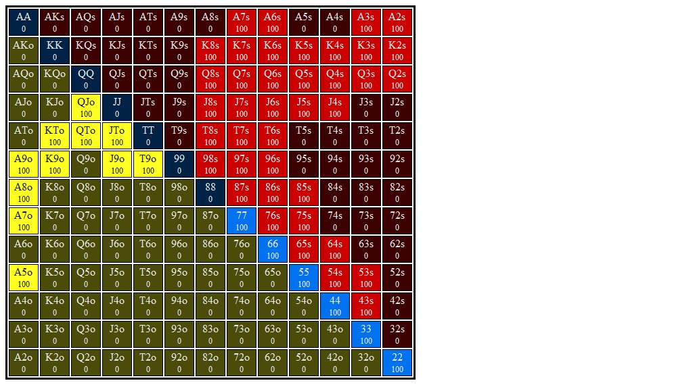

# Flop 2: <b>T&spades;4&spades;2&spades;</b>

## Hero's Button Opening Range Range

## Villain's Big Blind Calling Range vs Button Range

## Flop Questions

### 1. **Approximate each player's equity. Who has the equity advantage?**

Bn: 52%

Bb: 48%

+ **From the solver:** Bn: 51%, Bb: 49%.

### 2. **Give a qualitative description of how each player's range interacts with the board?**

This is a monotone board, and that means that this hand will be largely about
flushes and strong flush draws. Both players should have a similar percentage
of flopped flushes (BB has maybe a slightly higher percentage), and both players
should have a similar percentage of nut flush draws. Bn has more K-high flush
draws.

To give solid numbers, I'd say that Bn has about 10% flushes, Bb has maybe
12-13% flushes. Bn has more nut flushes than Bb.

Outside of flushes, Bn has a all the sets and Bb has bottom and middle set.
Given Bb's smaller range Bb should actually have a higher percentage of sets
compared to Bn.

There are no straights on board,  but there are some straight draws, including
A3, A5, 53, 65. These look like they should be about even in number, which means
that Bb should have about 2x the percentage of straight draws.

### 3. **What are the weakest hands that could go all in on the flop? Go for three streets of value on blank turns?**

It's going to be hard to go all in on the flop without a strong flush. Does top
set go all in? Yeah, because there might be some nut flush draws out there
bluffing, and because we have some equity against flushes. I think some pairs
with the A&spades; call off, but they don't shove.

Straight draws don't call off, and they don't shove either.

I'm not sure what BB's strat looks like but I wouldn't be surprised if they
could come after us pretty hard because of the number of flushes and strong
semi-bluffs in their range.

+ **From the solver:** As I suspected, it's hard to find hands that raise enough
  early on to be in a situation to call. NFDs mix call/fold, and nut flushes/2nd
  nut flushes call. In total, only about 2 combos go all in (either from calling
  or from shoving). This might have to do with the tree I used, and I'd be
  interested to see how this changes if I allow myself a larger tree.

  A&spades;2 shoves all in after `x/bet 0.21/raise 0.75/raise 1.8/raise 4.3`.
  I'm not sure why...we do block bottom set, but that only makes up 0.07/3.81
  combos (or 2%) of Bb's range here. But I guess that's why A&spades;2 is a
  pure shove while A&spades;9 is a pure fold.

  
### 4. **Which player has the nuts advantage?**

This is tricky. Bn has more nutted hands, but I think Bb has slightly
more flushes (relative to range size). Both players have a similar percentage
of sets. I'd give a weak nod to Bb for the nuts advantage here.

+ **From the solver:** I forget  exactly how MPT classifies this, but I
  used a bucketting system where hands that had at  least 80% equity against
  the opponent's range were considered 'nutted'. 

  + **Bn:** 10.8% of range (75 of 696 combos) beat 80% of Bb's range
  + **Bb:** 12.2% of range (36 of 294 combos) beat 80% of Bn's range

  Bb  has a slight nuts advantage using this metric, but it may change
  depending on what my cutoff is.

### 5. **How static or dynamic is this flop? What aspects of this flop make it more static or dynamic?  How do these aspects interact with one another?**

While T-high is a dynamic characteristic, the fact is that making top pair
won't make much of a difference in EV in this hand. There are very few cards
that can come that will change how much money a hand wants to get in. A few
straights might come in, but those won't want to get stacks in given the threat
of a flush on the board. A paired board turns a set into a boat/quads, and that
will change that hand's incentive, but sets are rare so this doesn't contribute
too much to this boar'ds dynamism.

On the other hand, there are a fair number of flushes already out there. The
main hand that can improve is a flush draw, but even then a weak flush draw
can't put too much money in the pot because they will be up against better
flush draws.

Thus I think this is a very static flop: most hands won't change strength on
most turns.

### 6. **On this flop do you prefer to bet small or large?  With what frequencies would you check and bet?**

Small. I don't have a nuts advantage, range advantage is pretty even, and
polarizing won't give very many of their hands tough choices. If I bet big
with the nuts I'll be folding out a lot of their medium-strength hands that
I want to get value from, and if I have the A&spades; then I'm blocking a lot
of the draws I want to get payed by. K&spades; is still out there, so maybe
I get payed by that, but this hand doesn't want to put as much money in the pot.

As for frequencies, I should definitely develop a substantial checking range.
I want to cbet most of my flushes and strong flush draws, but I want to
protect my checking range, and hands like A&spades;K&spades;, A&spades;Q&spades;
are blocking some of the drawing hands I want to get value from, so I might
consider a check at some frequency.

Pairs and pairs + draws can check comfortably. They don't want to grow the pot,
and they do poorly against a check raise (especially a pair w/ no draw). Straight
draws probably want to bet, w/ or without a flush draw, because they value fold
equity.

I think Bn checks about 60% and bets small about 40%.

### 7. **Say you adopt a strategy where you either bet with your preferred sizing or check. You choose to bet and villain calls. What are the best and worst turn cards for your range?**

Hmm, I'm actually not sure here. I'm betting smaller, so I'm going to be betting some of my pairs, and those don't want to see another spade (unless it's a pair w/
a spade). I'm also betting a lot of flushes/flush draws, and those are pretty okay
with another spade (but not baby flushes). I think I'll have a somewhat linear
range on the turn, and a spade doesn't like to see that because villain's
calling range now uncaps quite a bit.

Board pairing cards also aren't great for range.

+ **From the solver:** We are betting linear, but when BB calls we have about
  42% equity. We are at a significant equity disadvantage. Villain has a nuts
  advantage as well, with 12.5% of their range being flushes (these have >80%
  equity vs our range) while we have about 9% flushes. When a spade comes, this
  blocks some of their flushes and also serves to uncap our range considerably.

  + **Best Turns:** Any spade other than A&spades;. The A&spades; blocks a lot of
    our flushes and flush draws (Of about 66 flushdraw combos, 18 of them are
    NFDs, and another 10 are 2nd NFDs). Also, Bb has more Ax in their calling
    range than we do in our betting range, so they tend to have more top pair
    when any A, including A&spades;, comes.

  + **Worst Turns:** Board pairing and non-spade low cards that complete
    straights and make 2-pair and sets.
 
## Hands for flop T&spades;4&spades;2&spades;
### Combo 1. <b>K&hearts;T&hearts;</b>    (Flop: T&spades;4&spades;2&spades;)

1. **If you bet this hand should you expect better hands to fold? If so, which hands?**

2. **If you bet this hand should you expect worse hands to call? If so, which hands?**

3. **Does this hand benefit from a protection bet? Explain.**

4. **Does this hand benefit from growing the pot? How so?**

5. **How is this hand doing if you bet and get called? What parts of villain's range are you ahead of? Behind?**

6. **How is this hand doing against a check-raise?**

7. **What are this hand's incentives on this flop? Does it want to bet or check? If it wants to bet, what sizing does it prefer? Do these incentives line up with the strategy you proposed for your range above?**

8. **Suppose you take your preferred action from the last question (check or bet the preferred size). If this is a bet, suppose villain calls. What are the best and worst turn cards for this hand?**

### Combo 1. <b>A&diams;8&clubs;</b>    (Flop: T&spades;4&spades;2&spades;)

1. **If you bet this hand should you expect better hands to fold? If so, which hands?**

2. **If you bet this hand should you expect worse hands to call? If so, which hands?**

3. **Does this hand benefit from a protection bet? Explain.**

4. **Does this hand benefit from growing the pot? How so?**

5. **How is this hand doing if you bet and get called? What parts of villain's range are you ahead of? Behind?**

6. **How is this hand doing against a check-raise?**

7. **What are this hand's incentives on this flop? Does it want to bet or check? If it wants to bet, what sizing does it prefer? Do these incentives line up with the strategy you proposed for your range above?**

8. **Suppose you take your preferred action from the last question (check or bet the preferred size). If this is a bet, suppose villain calls. What are the best and worst turn cards for this hand?**

### Combo 1. <b>4&hearts;3&hearts;</b>    (Flop: T&spades;4&spades;2&spades;)

1. **If you bet this hand should you expect better hands to fold? If so, which hands?**

2. **If you bet this hand should you expect worse hands to call? If so, which hands?**

3. **Does this hand benefit from a protection bet? Explain.**

4. **Does this hand benefit from growing the pot? How so?**

5. **How is this hand doing if you bet and get called? What parts of villain's range are you ahead of? Behind?**

6. **How is this hand doing against a check-raise?**

7. **What are this hand's incentives on this flop? Does it want to bet or check? If it wants to bet, what sizing does it prefer? Do these incentives line up with the strategy you proposed for your range above?**

8. **Suppose you take your preferred action from the last question (check or bet the preferred size). If this is a bet, suppose villain calls. What are the best and worst turn cards for this hand?**

### Combo 1. <b>T&diams;T&clubs;</b>    (Flop: T&spades;4&spades;2&spades;)

1. **If you bet this hand should you expect better hands to fold? If so, which hands?**

2. **If you bet this hand should you expect worse hands to call? If so, which hands?**

3. **Does this hand benefit from a protection bet? Explain.**

4. **Does this hand benefit from growing the pot? How so?**

5. **How is this hand doing if you bet and get called? What parts of villain's range are you ahead of? Behind?**

6. **How is this hand doing against a check-raise?**

7. **What are this hand's incentives on this flop? Does it want to bet or check? If it wants to bet, what sizing does it prefer? Do these incentives line up with the strategy you proposed for your range above?**

8. **Suppose you take your preferred action from the last question (check or bet the preferred size). If this is a bet, suppose villain calls. What are the best and worst turn cards for this hand?**

### Combo 1. <b>J&hearts;J&clubs;</b>    (Flop: T&spades;4&spades;2&spades;)

1. **If you bet this hand should you expect better hands to fold? If so, which hands?**

2. **If you bet this hand should you expect worse hands to call? If so, which hands?**

3. **Does this hand benefit from a protection bet? Explain.**

4. **Does this hand benefit from growing the pot? How so?**

5. **How is this hand doing if you bet and get called? What parts of villain's range are you ahead of? Behind?**

6. **How is this hand doing against a check-raise?**

7. **What are this hand's incentives on this flop? Does it want to bet or check? If it wants to bet, what sizing does it prefer? Do these incentives line up with the strategy you proposed for your range above?**

8. **Suppose you take your preferred action from the last question (check or bet the preferred size). If this is a bet, suppose villain calls. What are the best and worst turn cards for this hand?**

### Combo 1. <b>A&diams;K&diams;</b>    (Flop: T&spades;4&spades;2&spades;)

1. **If you bet this hand should you expect better hands to fold? If so, which hands?**

2. **If you bet this hand should you expect worse hands to call? If so, which hands?**

3. **Does this hand benefit from a protection bet? Explain.**

4. **Does this hand benefit from growing the pot? How so?**

5. **How is this hand doing if you bet and get called? What parts of villain's range are you ahead of? Behind?**

6. **How is this hand doing against a check-raise?**

7. **What are this hand's incentives on this flop? Does it want to bet or check? If it wants to bet, what sizing does it prefer? Do these incentives line up with the strategy you proposed for your range above?**

8. **Suppose you take your preferred action from the last question (check or bet the preferred size). If this is a bet, suppose villain calls. What are the best and worst turn cards for this hand?**

### Combo 1. <b>A&spades;A&clubs;</b>    (Flop: T&spades;4&spades;2&spades;)

1. **If you bet this hand should you expect better hands to fold? If so, which hands?**

2. **If you bet this hand should you expect worse hands to call? If so, which hands?**

3. **Does this hand benefit from a protection bet? Explain.**

4. **Does this hand benefit from growing the pot? How so?**

5. **How is this hand doing if you bet and get called? What parts of villain's range are you ahead of? Behind?**

6. **How is this hand doing against a check-raise?**

7. **What are this hand's incentives on this flop? Does it want to bet or check? If it wants to bet, what sizing does it prefer? Do these incentives line up with the strategy you proposed for your range above?**

8. **Suppose you take your preferred action from the last question (check or bet the preferred size). If this is a bet, suppose villain calls. What are the best and worst turn cards for this hand?**

### Combo 1. <b>6&diams;3&diams;</b>    (Flop: T&spades;4&spades;2&spades;)

1. **If you bet this hand should you expect better hands to fold? If so, which hands?**

2. **If you bet this hand should you expect worse hands to call? If so, which hands?**

3. **Does this hand benefit from a protection bet? Explain.**

4. **Does this hand benefit from growing the pot? How so?**

5. **How is this hand doing if you bet and get called? What parts of villain's range are you ahead of? Behind?**

6. **How is this hand doing against a check-raise?**

7. **What are this hand's incentives on this flop? Does it want to bet or check? If it wants to bet, what sizing does it prefer? Do these incentives line up with the strategy you proposed for your range above?**

8. **Suppose you take your preferred action from the last question (check or bet the preferred size). If this is a bet, suppose villain calls. What are the best and worst turn cards for this hand?**

### Combo 1. <b>J&spades;8&hearts;</b>    (Flop: T&spades;4&spades;2&spades;)

1. **If you bet this hand should you expect better hands to fold? If so, which hands?**

2. **If you bet this hand should you expect worse hands to call? If so, which hands?**

3. **Does this hand benefit from a protection bet? Explain.**

4. **Does this hand benefit from growing the pot? How so?**

5. **How is this hand doing if you bet and get called? What parts of villain's range are you ahead of? Behind?**

6. **How is this hand doing against a check-raise?**

7. **What are this hand's incentives on this flop? Does it want to bet or check? If it wants to bet, what sizing does it prefer? Do these incentives line up with the strategy you proposed for your range above?**

8. **Suppose you take your preferred action from the last question (check or bet the preferred size). If this is a bet, suppose villain calls. What are the best and worst turn cards for this hand?**

### Combo 1. <b>K&diams;8&hearts;</b>    (Flop: T&spades;4&spades;2&spades;)

1. **If you bet this hand should you expect better hands to fold? If so, which hands?**

2. **If you bet this hand should you expect worse hands to call? If so, which hands?**

3. **Does this hand benefit from a protection bet? Explain.**

4. **Does this hand benefit from growing the pot? How so?**

5. **How is this hand doing if you bet and get called? What parts of villain's range are you ahead of? Behind?**

6. **How is this hand doing against a check-raise?**

7. **What are this hand's incentives on this flop? Does it want to bet or check? If it wants to bet, what sizing does it prefer? Do these incentives line up with the strategy you proposed for your range above?**

8. **Suppose you take your preferred action from the last question (check or bet the preferred size). If this is a bet, suppose villain calls. What are the best and worst turn cards for this hand?**
