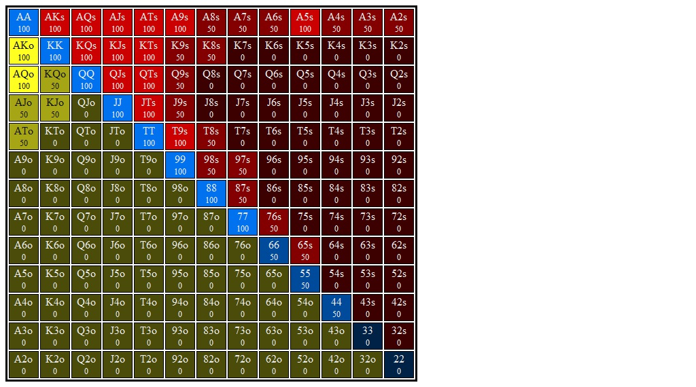

# Flop 10: <b>T&spades;9&diams;6&diams;</b>

## Hero's Hijack Opening Range Range

## Villain's Big Bling Calling Range vs Hijack Range

## Flop Questions

### 1. **Approximate each player's equity. Who has the equity advantage?**

### 2. **What are the weakest hands that could go all in on the flop? Go for three streets of value on blank turns?**

### 3. **Which player has the nuts advantage?**

### 4. **How static or dynamic is this flop? What aspects of this flop make it more static or dynamic?  How do these aspects interact with one another?**

### 5. **On this flop do you prefer to bet small or large?  With what frequencies would you check and bet?**

### 6. **Say you adopt a strategy where you either bet with your preferred sizing or check. You choose to bet and villain calls. What are the best and worst turn cards for your range?**

## Hands for flop T&spades;9&diams;6&diams;
### Combo 1. <b>A&hearts;Q&spades;</b>    (Flop: T&spades;9&diams;6&diams;)

1. **If you bet this hand should you expect better hands to fold? If so, which hands?**

2. **If you bet this hand should you expect worse hands to call? If so, which hands?**

3. **Does this hand benefit from a protection bet? Explain.**

4. **Does this hand benefit from growing the pot? How so?**

5. **How is this hand doing if you bet and get called? What parts of villain's range are you ahead of? Behind?**

6. **How is this hand doing against a check-raise?**

7. **What are this hand's incentives on this flop? Does it want to bet or check? If it wants to bet, what sizing does it prefer? Do these incentives line up with the strategy you proposed for your range above?**

8. **Suppose you take your preferred action from the last question (check or bet the preferred size). If this is a bet, suppose villain calls. What are the best and worst turn cards for this hand?**

### Combo 1. <b>A&spades;K&clubs;</b>    (Flop: T&spades;9&diams;6&diams;)

1. **If you bet this hand should you expect better hands to fold? If so, which hands?**

2. **If you bet this hand should you expect worse hands to call? If so, which hands?**

3. **Does this hand benefit from a protection bet? Explain.**

4. **Does this hand benefit from growing the pot? How so?**

5. **How is this hand doing if you bet and get called? What parts of villain's range are you ahead of? Behind?**

6. **How is this hand doing against a check-raise?**

7. **What are this hand's incentives on this flop? Does it want to bet or check? If it wants to bet, what sizing does it prefer? Do these incentives line up with the strategy you proposed for your range above?**

8. **Suppose you take your preferred action from the last question (check or bet the preferred size). If this is a bet, suppose villain calls. What are the best and worst turn cards for this hand?**

### Combo 1. <b>A&clubs;T&clubs;</b>    (Flop: T&spades;9&diams;6&diams;)

1. **If you bet this hand should you expect better hands to fold? If so, which hands?**

2. **If you bet this hand should you expect worse hands to call? If so, which hands?**

3. **Does this hand benefit from a protection bet? Explain.**

4. **Does this hand benefit from growing the pot? How so?**

5. **How is this hand doing if you bet and get called? What parts of villain's range are you ahead of? Behind?**

6. **How is this hand doing against a check-raise?**

7. **What are this hand's incentives on this flop? Does it want to bet or check? If it wants to bet, what sizing does it prefer? Do these incentives line up with the strategy you proposed for your range above?**

8. **Suppose you take your preferred action from the last question (check or bet the preferred size). If this is a bet, suppose villain calls. What are the best and worst turn cards for this hand?**

### Combo 1. <b>K&diams;8&diams;</b>    (Flop: T&spades;9&diams;6&diams;)

1. **If you bet this hand should you expect better hands to fold? If so, which hands?**

2. **If you bet this hand should you expect worse hands to call? If so, which hands?**

3. **Does this hand benefit from a protection bet? Explain.**

4. **Does this hand benefit from growing the pot? How so?**

5. **How is this hand doing if you bet and get called? What parts of villain's range are you ahead of? Behind?**

6. **How is this hand doing against a check-raise?**

7. **What are this hand's incentives on this flop? Does it want to bet or check? If it wants to bet, what sizing does it prefer? Do these incentives line up with the strategy you proposed for your range above?**

8. **Suppose you take your preferred action from the last question (check or bet the preferred size). If this is a bet, suppose villain calls. What are the best and worst turn cards for this hand?**

### Combo 1. <b>A&spades;2&spades;</b>    (Flop: T&spades;9&diams;6&diams;)

1. **If you bet this hand should you expect better hands to fold? If so, which hands?**

2. **If you bet this hand should you expect worse hands to call? If so, which hands?**

3. **Does this hand benefit from a protection bet? Explain.**

4. **Does this hand benefit from growing the pot? How so?**

5. **How is this hand doing if you bet and get called? What parts of villain's range are you ahead of? Behind?**

6. **How is this hand doing against a check-raise?**

7. **What are this hand's incentives on this flop? Does it want to bet or check? If it wants to bet, what sizing does it prefer? Do these incentives line up with the strategy you proposed for your range above?**

8. **Suppose you take your preferred action from the last question (check or bet the preferred size). If this is a bet, suppose villain calls. What are the best and worst turn cards for this hand?**

### Combo 1. <b>A&diams;7&diams;</b>    (Flop: T&spades;9&diams;6&diams;)

1. **If you bet this hand should you expect better hands to fold? If so, which hands?**

2. **If you bet this hand should you expect worse hands to call? If so, which hands?**

3. **Does this hand benefit from a protection bet? Explain.**

4. **Does this hand benefit from growing the pot? How so?**

5. **How is this hand doing if you bet and get called? What parts of villain's range are you ahead of? Behind?**

6. **How is this hand doing against a check-raise?**

7. **What are this hand's incentives on this flop? Does it want to bet or check? If it wants to bet, what sizing does it prefer? Do these incentives line up with the strategy you proposed for your range above?**

8. **Suppose you take your preferred action from the last question (check or bet the preferred size). If this is a bet, suppose villain calls. What are the best and worst turn cards for this hand?**

### Combo 1. <b>8&clubs;7&clubs;</b>    (Flop: T&spades;9&diams;6&diams;)

1. **If you bet this hand should you expect better hands to fold? If so, which hands?**

2. **If you bet this hand should you expect worse hands to call? If so, which hands?**

3. **Does this hand benefit from a protection bet? Explain.**

4. **Does this hand benefit from growing the pot? How so?**

5. **How is this hand doing if you bet and get called? What parts of villain's range are you ahead of? Behind?**

6. **How is this hand doing against a check-raise?**

7. **What are this hand's incentives on this flop? Does it want to bet or check? If it wants to bet, what sizing does it prefer? Do these incentives line up with the strategy you proposed for your range above?**

8. **Suppose you take your preferred action from the last question (check or bet the preferred size). If this is a bet, suppose villain calls. What are the best and worst turn cards for this hand?**

### Combo 1. <b>T&clubs;9&clubs;</b>    (Flop: T&spades;9&diams;6&diams;)

1. **If you bet this hand should you expect better hands to fold? If so, which hands?**

2. **If you bet this hand should you expect worse hands to call? If so, which hands?**

3. **Does this hand benefit from a protection bet? Explain.**

4. **Does this hand benefit from growing the pot? How so?**

5. **How is this hand doing if you bet and get called? What parts of villain's range are you ahead of? Behind?**

6. **How is this hand doing against a check-raise?**

7. **What are this hand's incentives on this flop? Does it want to bet or check? If it wants to bet, what sizing does it prefer? Do these incentives line up with the strategy you proposed for your range above?**

8. **Suppose you take your preferred action from the last question (check or bet the preferred size). If this is a bet, suppose villain calls. What are the best and worst turn cards for this hand?**

### Combo 1. <b>7&hearts;6&hearts;</b>    (Flop: T&spades;9&diams;6&diams;)

1. **If you bet this hand should you expect better hands to fold? If so, which hands?**

2. **If you bet this hand should you expect worse hands to call? If so, which hands?**

3. **Does this hand benefit from a protection bet? Explain.**

4. **Does this hand benefit from growing the pot? How so?**

5. **How is this hand doing if you bet and get called? What parts of villain's range are you ahead of? Behind?**

6. **How is this hand doing against a check-raise?**

7. **What are this hand's incentives on this flop? Does it want to bet or check? If it wants to bet, what sizing does it prefer? Do these incentives line up with the strategy you proposed for your range above?**

8. **Suppose you take your preferred action from the last question (check or bet the preferred size). If this is a bet, suppose villain calls. What are the best and worst turn cards for this hand?**

### Combo 1. <b>A&hearts;K&hearts;</b>    (Flop: T&spades;9&diams;6&diams;)

1. **If you bet this hand should you expect better hands to fold? If so, which hands?**

2. **If you bet this hand should you expect worse hands to call? If so, which hands?**

3. **Does this hand benefit from a protection bet? Explain.**

4. **Does this hand benefit from growing the pot? How so?**

5. **How is this hand doing if you bet and get called? What parts of villain's range are you ahead of? Behind?**

6. **How is this hand doing against a check-raise?**

7. **What are this hand's incentives on this flop? Does it want to bet or check? If it wants to bet, what sizing does it prefer? Do these incentives line up with the strategy you proposed for your range above?**

8. **Suppose you take your preferred action from the last question (check or bet the preferred size). If this is a bet, suppose villain calls. What are the best and worst turn cards for this hand?**
